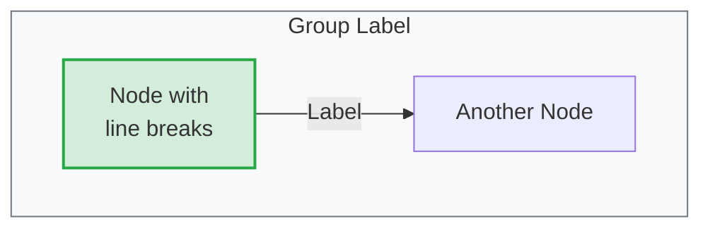
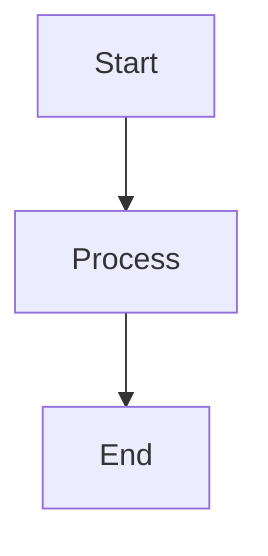
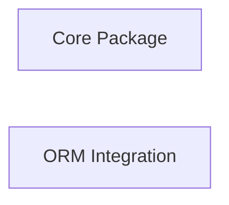

# CLAUDE.md

This file provides guidance to Claude Code (claude.ai/code) when working with code in this repository.

## Commands

### Development
```bash
npm start      # Start dev server with HMR at http://localhost:4200
npm run build  # Production build with output hashing
npm run preview # Serve production build locally
```

**Important**: The development server (`npm start`) is always running and automatically picks up live changes. Never run `npm start` during development sessions as it's already active.

### Build Process
The `npm start` and `npm run build` commands automatically execute:
1. `node src/scripts/gen-docs-list.mjs` - Generates documentation listing (simple array of file paths)
2. `node src/scripts/gen-docs-index.mjs` - Creates docs index with metadata (used by site navigation)
3. `./build-search-index.sh` - Builds search indices

### Testing
No standard Angular testing framework is configured. Testing is done through:
- Standalone HTML test files (e.g., `test-*.html`)
- Verification scripts (e.g., `verify-*.sh`)

## Architecture

### Core Framework
- Angular 20.0.1 application for documentation and code examples
- Component prefix: `wb`
- Strict TypeScript configuration

### Key Dependencies
- **UI**: PrimeNG 19.1.3 + PrimeFlex for components
- **Markdown**: ngx-markdown 20.0.0 for documentation rendering
- **Diagrams**: Mermaid 11.12.0 for architectural diagrams and flowcharts
- **Syntax Highlighting**: Multiple options - PrismJS, Shiki, Highlight.js
- **Search**: MiniSearch 7.1.2 + Fuse.js 7.1.0 for full-text search

### Project Structure
```
src/app/
├── components/       # Reusable UI (enhanced-code-block*, search, galleries)
├── services/         # Business logic (docs, search, syntax highlighting)
├── pages/           # Route components (home, docs, examples, videos)
├── layout/          # App layout components
└── config/          # Configuration modules

src/assets/
├── docs/            # Markdown documentation files
├── code-samples/    # Example code files
└── *.json          # Generated index files (do not edit manually)
```

### Key Components
- **EnhancedCodeBlockV2Component**: Advanced code display with syntax highlighting
- **EnhancedSearchComponent**: Full-text search with fuzzy matching
- **CodeSampleGalleryComponent**: Browse and display code examples

### Important Services
- **DocsService**: Handles documentation loading and navigation
- **SearchService**: Implements MiniSearch and Fuse.js for different search types
- **ShikiHighlightService/PrismService**: Syntax highlighting providers

### Build Outputs
- Development: Served from memory with HMR
- Production: `dist/whizbang-site/` with hashed assets

## Project Vision & Goals

### Site Purpose
This is a documentation website for the **Whizbang .NET library** - a comprehensive .NET/C# library for [library purpose]. The site provides:
- Complete API documentation and reference guides
- C# code examples demonstrating library usage
- Getting started tutorials and advanced configuration guides
- Interactive code samples and demonstrations

### Content Focus
- **Primary Language**: C# (.NET)
- **Documentation Types**: API references, tutorials, philosophy, getting started guides
- **Code Examples**: C# snippets with syntax highlighting and metadata
- **Sample Code**: Located in `src/assets/code-samples/` (note: some TypeScript/Angular samples exist for the documentation site itself)

### Target Experience
- **Clean, Mobile-First UI**: Optimized for viewing documentation on any device
- **Excellent Search**: Full-text search with MiniSearch + Fuse.js, with AI enhancements in progress
- **Code Display Excellence**: Enhanced code blocks optimized for C# examples with special handling
- **Progressive Disclosure**: Show essential information first, hide secondary details on mobile

### Tech Stack
- **Frontend**: Angular 20 application (this documentation site)
- **Documented Library**: .NET/C# (Whizbang library)
- **Rendering**: ngx-markdown for documentation, multiple syntax highlighters for code

## Documentation as Specification

This documentation serves a **dual purpose**: it is both user-facing documentation AND the living specification for the Whizbang library development.

### Core Principles

#### Documentation-First Development

- Write documentation BEFORE or DURING implementation, not after
- Documentation drives API design discussions
- If you can't explain it clearly in docs, the API needs work
- Examples written during design phase reveal usability issues early

#### Living Specifications

- Documentation must stay synchronized with library code at all times
- Every API change requires corresponding documentation update
- Breaking changes require migration guides
- Documentation is never "done" - it evolves with the library

#### Example-Driven Development

- Every concept MUST have complete, runnable C# examples
- Examples are not optional - they're part of the specification
- Code examples should be validated against actual library behavior
- Examples demonstrate best practices, not just syntax

#### Documentation as Tests

- Documentation examples serve as integration tests (conceptually)
- If an example doesn't work, either the docs or the library is wrong
- Examples validate that the API is actually usable
- Breaking example code is a regression

#### Source of Truth

- When in doubt about API design, refer to the documentation
- Documentation reflects intended behavior
- Implementation should match documented behavior
- Discrepancies are bugs to be fixed

### Why This Matters

#### For Users

- High-quality, accurate documentation they can trust
- Complete examples that actually work
- Clear guidance on best practices

#### For Developers

- Documentation guides implementation
- Catches design issues before code is written
- Provides clear acceptance criteria
- Reduces rework and refactoring

#### For AI Assistants

- Clear specifications to reference during development
- Examples demonstrate intended usage patterns
- Vibe-code-guide for implementing library features
- Roadmap shows planned direction

### Definition of Done

A feature is not complete until:

- [ ] Public APIs are documented
- [ ] Complete C# examples are provided
- [ ] Examples have been validated
- [ ] Best practices are explained
- [ ] Error scenarios are covered
- [ ] Migration guide exists (if breaking change)

## Active Development Initiatives

### Completed Initiatives ✅

#### Mobile Responsiveness Enhancement
**Status**: ✅ Complete (2025-06-19)
**Impact**: Significantly improved mobile user experience

Key achievements:
- **Chip decluttering**: All metadata chips (language, framework, difficulty, tags) hidden below 768px for cleaner mobile interface
- **Touch accessibility**: All interactive elements meet WCAG 44px minimum touch target requirements
- **Responsive navigation**: Hamburger menu with 320px tablet width, 100vw mobile width
- **Typography scaling**: Mobile-first typography system with proper hierarchy
- **Build impact**: Zero functionality regressions, clean mobile interface

See: [plans/ui-improvements/mobile-responsiveness-enhancement.md](plans/ui-improvements/mobile-responsiveness-enhancement.md)

#### Code Block Styling Improvements
**Status**: ✅ Complete (2025-06-19)
**Impact**: Polished, professional code block appearance

Key achievements:
- **Transparent tools container**: Buttons integrate seamlessly with dark header using `rgba(255, 255, 255, 0.1)` backgrounds
- **Pill/bubble chips**: All chips redesigned with `border-radius: 9999px` for modern appearance
- **Color-coded metadata**: Language, framework, difficulty, and tag chips with distinctive colors
- **Hover animations**: Subtle lift effects with `translateY(-1px)` for better UX
- **Layout optimization**: Tags moved inline with metadata to save vertical space

See: [plans/ui-improvements/code-block-styling-improvement.md](plans/ui-improvements/code-block-styling-improvement.md)

#### Enhanced Code Block Improvements
**Status**: ✅ Complete (2025-06-19)
**Impact**: Progressive disclosure for better content density

Key achievements:
- **More Info toggle**: Desktop shows/hides metadata with smooth animations
- **Mobile modal**: PrimeNG dialog for metadata on mobile devices
- **Icon-only buttons**: Show Full Code button converted to compact icon format
- **Content minimization**: Smaller fonts and optimized spacing on mobile (extra small at 480px)
- **Container constraints**: Max-width: 100vw with proper overflow handling

See: [plans/ui-improvements/enhanced-code-block-improvements.md](plans/ui-improvements/enhanced-code-block-improvements.md)

### In Progress 🔄

#### AI-Enhanced Search Implementation
**Status**: 🔄 Phase 1 Complete, Phase 2+ Ready
**Progress**: 7/20 tasks complete (35%)
**Current Phase**: Phase 1 (Build-Time Processing) ✅ Complete

**Completed (Phase 1)**:
- ✅ Build-time AI content processing with Node.js Transformers.js
- ✅ 384-dimensional embeddings using all-MiniLM-L6-v2 model
- ✅ Semantic keyword extraction and content classification
- ✅ Caching system for embeddings (17 embeddings cached successfully)
- ✅ Enhanced search index generation (233KB enhanced vs 31KB standard)
- ✅ Build time: ~45 seconds (vs 30 seconds baseline) - within target
- ✅ Full integration with build pipeline

**Next Steps (Phase 2-4)**:
- [ ] Create browser-side AI enhancement service for progressive loading
- [ ] Implement device capability detection and memory management
- [ ] Build hybrid search algorithm (60% semantic + 40% keyword)
- [ ] Add query understanding and result re-ranking
- [ ] Performance optimization and user notifications

**Technical Decisions**:
- Build-time preprocessing eliminates runtime AI performance impact
- all-MiniLM-L6-v2 chosen for balance of size (22MB) and accuracy (384 dimensions)
- Progressive enhancement strategy maintains current excellent search as baseline
- Graceful degradation for unsupported devices/browsers

See: [plans/search-enhancements/ai-search-enhancement.md](plans/search-enhancements/ai-search-enhancement.md)
See: [plans/search-enhancements/progress-tracker.md](plans/search-enhancements/progress-tracker.md)

## MCP Server Integration

This project includes a Model Context Protocol (MCP) server for programmatic access to documentation.

### Two Separate MCP Servers

**IMPORTANT**: This project ecosystem includes TWO distinct MCP servers with different purposes:

#### 1. Documentation MCP Server (This Repository)

**Location**: `mcp-docs-server/` directory in this repo
**Technology**: Node.js/TypeScript
**Package**: `@whizbang/docs-mcp-server` (npm)
**Installation**: `npm install -g @whizbang/docs-mcp-server`

**Purpose**: Read-only access to Whizbang library documentation

**Capabilities**:

- Access all documentation via resources (`doc://`, `roadmap://`, `code://`)
- Full-text search using MiniSearch
- AI-enhanced semantic search
- Find code examples by topic
- List documentation by category
- Browse roadmap/planned features

**Does NOT**:

- Execute library code
- Interact with Whizbang runtime
- Modify documentation
- Run C# code

**Target Audience**:

- Developers learning Whizbang
- AI assistants providing guidance on library usage
- Technical writers maintaining documentation
- Library maintainers searching docs

#### 2. Runtime MCP Server (Future - Separate Repository)

**Technology**: C#/.NET
**Package**: `Whizbang.Runtime.McpServer` (NuGet)
**Installation**: `dotnet tool install -g Whizbang.Runtime.McpServer`

**Purpose**: Interact with actual Whizbang .NET library functions

**Capabilities**:

- Execute library methods
- Create and manage aggregates
- Run projections
- Query data through Whizbang API
- Test library functionality
- Demonstrate live examples

**Does**:

- Actually run Whizbang library code
- Provide runtime interaction
- Execute C# against the library

**Target Audience**:

- AI assistants building applications with Whizbang
- Developers prototyping with the library
- Testing and validation scenarios

### Why Two Separate Servers?

**Separation of Concerns**:

- **Documentation** (read-only data) vs **Execution** (active runtime)
- Different security models (docs are safe, code execution requires sandboxing)
- Different performance characteristics
- Different failure modes

**Technology Alignment**:

- **Docs server**: Node.js leverages existing search infrastructure
- **Runtime server**: Must be C#/.NET to interact with library

**Independent Evolution**:

- Update docs without affecting runtime
- Change runtime without breaking docs
- Version independently
- Deploy separately

### Documentation MCP Server - Usage Modes

The docs MCP server supports multiple configurations:

#### Mode 1: Local Development

For contributors working on documentation:

```json
{
  "mcpServers": {
    "whizbang-docs": {
      "command": "node",
      "args": ["./mcp-docs-server/build/index.js"],
      "env": {
        "DOCS_SOURCE": "local",
        "DOCS_PATH": "./src/assets/docs"
      }
    }
  }
}
```

#### Mode 2: Installed Package

For users with package installed globally:

```json
{
  "mcpServers": {
    "whizbang-docs": {
      "command": "npx",
      "args": ["@whizbang/docs-mcp-server"]
    }
  }
}
```

#### Mode 3: Remote Fetch (Future)

Fetch docs from published GitHub Pages:

```json
{
  "mcpServers": {
    "whizbang-docs": {
      "command": "npx",
      "args": ["@whizbang/docs-mcp-server"],
      "env": {
        "DOCS_SOURCE": "remote",
        "DOCS_BASE_URL": "https://whizbang-lib.github.io"
      }
    }
  }
}
```

### URI Schemes

The documentation MCP server uses distinct URI schemes for different content types:

#### Documentation Resources

- `doc://getting-started` - Getting Started guide
- `doc://tutorials/getting-started-tutorial` - Tutorial documents
- `doc://advanced/configuration` - Advanced configuration
- `doc://api` - API reference

#### Roadmap Resources (Unreleased Features)

- `roadmap://event-sourcing` - Planned event sourcing feature
- `roadmap://advanced-querying` - Future query capabilities

**Important**: Separate `roadmap://` scheme prevents confusion about what's released.

#### Code Example Resources

- `code://csharp/aggregates/order-aggregate` - Aggregate examples
- `code://csharp/projections/read-model` - Projection examples

### Available Tools

The docs MCP server provides these tools for searching and discovery:

#### search-docs

Full-text search using existing MiniSearch index.

**Input**: Query string, optional limit
**Output**: Ranked search results with snippets
**Use case**: Find docs by keyword

#### semantic-search

AI-enhanced search using pre-computed embeddings.

**Input**: Query string, optional limit
**Output**: Semantically similar results
**Use case**: Find conceptually related content

#### find-examples

Search specifically for C# code examples.

**Input**: Topic/keyword, optional filters (language, framework, difficulty)
**Output**: Relevant code examples with metadata
**Use case**: Find examples demonstrating a concept

#### list-docs-by-category

List all documentation in a category.

**Input**: Category name
**Output**: Array of documents with metadata
**Use case**: Browse documentation structure

#### list-roadmap

List planned/unreleased features.

**Input**: Optional status filter (planned, in-development, experimental)
**Output**: Roadmap items with status and target version
**Use case**: Discover future features

### Available Prompts

Reusable templates for common tasks:

#### explain-concept

Get detailed explanation of a Whizbang concept.

**Input**: Concept name (e.g., "aggregates", "projections")
**Process**: Searches docs, formats explanation
**Output**: Concept explanation + examples + API reference

#### show-example

Find and display relevant code examples.

**Input**: What user wants to do (e.g., "create an aggregate")
**Process**: Searches examples, returns formatted code
**Output**: Code example with explanation and usage notes

#### api-reference

Look up API documentation.

**Input**: Class/method name
**Process**: Searches API docs
**Output**: API signature, parameters, examples, links

### MCP Server Benefits

#### User Benefits

- AI assistants can search and reference documentation
- No need to manually copy-paste docs into chat
- Always access latest documentation
- Discover related content through semantic search

#### Maintainer Benefits

- Reduce context window usage in AI conversations
- Documentation accessible across sessions
- Easy to test documentation accessibility
- MCP Inspector for validation

#### AI Assistant Benefits

- Direct programmatic access to docs
- Search capabilities (keyword + semantic)
- Clear distinction between released and planned features
- Persistent knowledge across conversation sessions

### MCP Server Development

See [`mcp-docs-server/README.md`](mcp-docs-server/README.md) (to be created) for:

- Installation and setup
- Development workflow
- Testing with MCP Inspector
- Publishing to npm registry
- Configuration options

### Key Technical Decisions

These architectural decisions should guide all future development:

#### Mobile-First Design
- **Breakpoints**: 768px (tablet), 480px (mobile) matching design tokens
- **Touch Targets**: 44px minimum (tablet), 48px (small mobile) for WCAG compliance
- **Content Strategy**: Hide non-essential metadata on mobile to reduce clutter
- **Progressive Enhancement**: Mobile experience first, enhance for desktop

#### Progressive Disclosure Pattern
- Essential information visible by default
- Secondary details behind "More Info" toggle (desktop) or modal (mobile)
- Chips hidden on mobile to maximize content focus
- Graceful degradation for all features

#### AI/Search Architecture
- Build-time processing preferred over runtime for performance
- Pre-computed embeddings and metadata included in search index
- Hybrid scoring combines semantic similarity with keyword matching
- Zero impact on current search quality - AI enhances, never replaces

#### Code Display Excellence
- Special handling for C# syntax highlighting
- Multiple syntax highlighters available (PrismJS, Shiki, Highlight.js)
- Enhanced code blocks with metadata, actions, and progressive disclosure
- Dark header forced in all themes for consistent branding

## Design System & UI Standards

These design standards have been established through implementation and should be maintained:

### Visual Design

#### Header & Container Styling
- **Code block headers**: Dark background (`--code-block-header-bg`) forced in all themes
- **Tools container**: Transparent background with subtle button styling
- **Button styling**: `rgba(255, 255, 255, 0.1)` backgrounds with hover effects
- **Hover animations**: `translateY(-1px)` with smooth transitions

#### Chip & Tag Styling
- **Shape**: Pill/bubble appearance with `border-radius: 9999px`
- **Size**: Vertically thin with `min-height: 1.5rem` and tight padding
- **Colors**: Color-coded by type:
  - Language chips: Dynamic colors via `getLanguageColor()` method
  - Framework chips: Success green (`--color-success`)
  - Difficulty chips: Severity-based (success/info/warning/danger)
  - Tag chips: Primary brand color (`--color-primary`)
- **Hover**: Lift effect with `box-shadow` and `color-mix()` for hover states

#### Responsive Behavior
- **Metadata chips**: Hidden below 768px to reduce mobile clutter
- **More Info content**: Toggle on desktop, modal on mobile
- **Typography**: Scaled down on mobile (md → sm → xs at breakpoints)
- **Spacing**: Reduced padding and margins on mobile

### Component Patterns

#### Code Blocks
- Header with title, metadata row (chips), and action buttons
- Transparent tools container integrated with header
- Progressive disclosure for description and metadata sections
- Mobile: Chips hidden, More Info opens modal, icon-only buttons

#### Navigation
- Hamburger menu with push sidebar
- Sidebar width: 320px (tablet), 100vw (mobile)
- 44px minimum touch targets throughout
- Responsive toolbar with mobile-optimized spacing

#### Search
- MiniSearch + Fuse.js baseline (excellent keyword search)
- AI enhancement as progressive addition (not replacement)
- Hybrid scoring when AI available (60% semantic + 40% keyword)
- Graceful fallback to keyword-only search

### Accessibility Standards
- **Touch targets**: 44px minimum (WCAG 2.1 Level AAA)
- **Color contrast**: Proper ratios maintained across themes
- **Focus indicators**: Visible focus states on all interactive elements
- **Screen readers**: ARIA labels and proper semantic HTML
- **Keyboard navigation**: Full functionality without mouse

### Theme System
- Light and dark themes supported
- CSS custom properties for all colors
- Dark header forced even in light theme (code blocks)
- Consistent visual language across themes

## Standards & Anti-Patterns

These standards ensure high-quality, consistent documentation and prevent common pitfalls.

### C# Coding Standards for Examples

All C# code examples in documentation must follow these standards:

#### EditorConfig Compliance

**CRITICAL**: All code examples MUST follow [`CODE_SAMPLES.editorconfig`](./CODE_SAMPLES.editorconfig).

**Key Conventions**:
- **Brace Style**: K&R/Egyptian (opening brace on same line, not Allman style)
- **var Usage**: Always use `var` for local variables
- **Naming**:
  - PascalCase: Types, methods, properties, public fields
  - camelCase: Parameters, local variables
  - `_camelCase`: Private fields (underscore prefix)
  - `IPascalCase`: Interfaces (I prefix)
  - `MethodAsync`: Async methods (Async suffix)
  - `ALL_CAPS`: Constants (with underscores)
- **Namespaces**: File-scoped (not block-scoped)
- **Using Directives**: Outside namespace, System directives first
- **Modern C#**: Pattern matching, null coalescing, index/range operators, file-scoped namespaces

#### Enhanced Code Block Metadata

The site supports rich metadata for examples. Use this format for complete, standalone examples:

````markdown
```csharp{
title: "Order Processing Service"
description: "Demonstrates order validation with error handling"
framework: "NET8"
category: "Domain Logic"
difficulty: "INTERMEDIATE"
tags: ["Orders", "Validation", "Error Handling"]
nugetPackages: ["Whizbang.Core", "Whizbang.Orders"]
filename: "OrderProcessor.cs"
showLineNumbers: true
highlightLines: [12, 15]
usingStatements: ["Whizbang", "System", "System.Threading.Tasks"]
}
// Code here
```
````

See [DOCUMENTATION-STANDARDS.md](./DOCUMENTATION-STANDARDS.md) for complete metadata field documentation.

#### Test-Driven Examples

**CRITICAL**: All complete code examples MUST have corresponding tests that verify they work.

Add test references to metadata:

```csharp{
title: "Order Processing Example"
testFile: "OrderProcessorTests.cs"
testMethod: "ProcessOrderAsync_ValidOrder_SavesSuccessfully"
githubUrl: "https://github.com/whizbang/library/blob/main/tests/Documentation/OrderProcessorTests.cs"
}
```

**Requirements**:
- Examples extracted from or validated by tests in `tests/Documentation/`
- Tests must pass in CI/CD
- Roadmap features have skeleton tests with `[Fact(Skip = "Roadmap feature")]`
- Breaking changes update tests immediately

**Benefits**:
- Examples guaranteed to compile
- Examples guaranteed to work
- Breaking changes caught immediately
- Documentation stays synchronized with code

See [DOCUMENTATION-STANDARDS.md](./DOCUMENTATION-STANDARDS.md#test-driven-examples) for complete test-driven examples guide.

#### Complete Examples

- Include ALL `using` statements required
- Show full class/method context, not just fragments
- Provide complete, copy-paste-able code
- Use file-scoped namespaces
- Follow K&R/Egyptian brace style
- Reference corresponding test in metadata

```csharp
// ✅ GOOD - Complete example with K&R/Egyptian braces
using System;
using System.Threading.Tasks;
using Whizbang;

namespace MyApp.Orders;

public class OrderProcessor {
    private readonly IOrderRepository _repository;

    public OrderProcessor(IOrderRepository repository) {
        _repository = repository;
    }

    public async Task ProcessOrderAsync(Order order) {
        // Implementation
        await _repository.SaveAsync(order);
    }
}

// ❌ BAD - Incomplete fragment
ProcessOrderAsync(order);  // Where does order come from? What namespace?
```

#### Error Handling

- Show error handling for important scenarios
- Document exceptions that can be thrown
- Don't swallow exceptions in examples
- Use meaningful error messages

```csharp
// ✅ GOOD - Proper error handling (K&R/Egyptian braces)
try {
    await processor.ProcessOrderAsync(order);
} catch (InvalidOrderException ex) {
    _logger.LogError(ex, "Order validation failed: {OrderId}", order.Id);
    throw;
}

// ❌ BAD - Swallowing exceptions
try {
    await processor.ProcessOrderAsync(order);
} catch { }  // Silent failure
```

#### Comments

- Explain **why**, not **what** (code shows what)
- Highlight non-obvious behavior
- Point out important patterns
- Keep comments concise

### Documentation Standards

#### Required Elements

Every documentation page must have:

- **Title**: Clear, descriptive H1 heading
- **Frontmatter**: Complete metadata (title, category, order)
- **Concept Explanation**: What it is and why it matters
- **Code Examples**: Complete, runnable C# code
- **Best Practices**: Recommended patterns
- **Error Scenarios**: Common pitfalls and how to avoid them

#### Frontmatter Requirements

```yaml
---
title: Getting Started          # Required - display title
slug: getting-started           # Optional - URL slug (auto-generated from filename if omitted)
category: Introduction          # Required - navigation category
order: 1                        # Required - sort order within category
tags: beginner, tutorial        # Optional - for search/filtering
---
```

**Note**: The `slug` field is optional and will be auto-generated from the filename if omitted. The documentation generation script (`src/scripts/gen-docs-list.mjs`) recursively discovers all markdown files in `src/assets/docs/` including subdirectories, so files can be organized into folders (e.g., `Projections/`, `Commands/`, `Tutorials/`) for better structure.

#### Visual Diagrams (Mermaid)

Documentation should include **Mermaid diagrams** to provide visual understanding of architecture and workflows. Use diagrams liberally to:

- Show system architecture and component relationships
- Illustrate data flow and sequences
- Visualize hierarchies and precedence
- Demonstrate workflows and patterns

**Diagram Types to Use:**

1. **Graph Diagrams** (`graph TB` or `graph LR`) - For architecture, component relationships, hierarchies
2. **Sequence Diagrams** (`sequenceDiagram`) - For workflows, message flows, command→event flows
3. **Class Diagrams** (`classDiagram`) - For type hierarchies (when needed)

**Style Guidelines:**



**Color Coding Standards:**
- **Green** (`#d4edda` / `#28a745`) - Business logic layer, success states, correct examples
- **Blue** (`#cce5ff` / `#004085`) - Read model layer, projections
- **Yellow** (`#fff3cd` / `#ffc107`) - Data layer (events, commands)
- **Red** (`#f8d7da` / `#dc3545`) - Errors, warnings, incorrect examples

**Technical Setup:**

The site is configured to render Mermaid diagrams automatically:
- **Package**: `mermaid@11.12.0` installed in dependencies
- **Extraction**: `markdown.page.ts` extracts mermaid blocks before markdown processing
- **Parser Skip**: `code-block-parser.service.ts` skips mermaid blocks (only processes C#/other code)
- **Rendering**: `MermaidService` renders diagrams to SVG using Mermaid.js
- **Injection**: SVG diagrams replace HTML comment placeholders in rendered DOM

**Implementation Flow:**
1. Load markdown file with mermaid blocks
2. Code block parser skips `language === 'mermaid'` blocks
3. `parseCustomComponents()` extracts mermaid code, replaces with `<!--MERMAID_PLACEHOLDER_N-->`
4. ngx-markdown renders markdown (without mermaid blocks)
5. `renderMermaidBlocks()` finds placeholder comments in DOM
6. Mermaid.js renders code to SVG
7. Replace placeholders with rendered diagrams

Simply include Mermaid syntax in markdown files using triple backtick code blocks with `mermaid` language identifier:

````markdown

````

**Critical**: The code block parser MUST skip mermaid blocks to avoid stripping them out. This is handled in `code-block-parser.service.ts` with `if (language === 'mermaid') continue;`

#### Mermaid Color Scheme Methodology

All Mermaid diagrams use a **dual-class system** for semantic meaning and visual grouping:

**1. Semantic Layer Classes** (architectural meaning):

These represent the **functional areas** of the Whizbang library architecture:

| Layer Class | Color | Hex Code | Functional Area | Usage |
|-------------|-------|----------|-----------------|-------|
| `layer-core` | 🟢 Green | `#28a745` | **Core Business Logic** | Domain functionality, mediator, handlers, core abstractions |
| `layer-event` | 🔴 Red | `#dc3545` | **Event Sourcing & Persistence** | Event stores, aggregates, event handling, data persistence |
| `layer-read` | 🔵 Blue | `#004085` | **Read Models & Queries** | Projections, read model subscriptions, query operations |
| `layer-command` | 🟡 Yellow | `#ffc107` | **Commands & Messaging** | Write operations, distributed messaging, outbox/inbox patterns |
| `layer-observability` | 🔷 Teal | `#14b8a6` | **Observability & Monitoring** | Telemetry, metrics, tracing, monitoring, dashboards |
| `layer-infrastructure` | 🟣 Purple | `#8b5cf6` | **Developer Tools** | Analyzers, testing utilities, development-time tooling |

**When to Use Functional Area Colors:**
- Package dependency diagrams (showing how packages relate architecturally)
- Component interaction diagrams (showing functional layer communication)
- Edge labels in flowcharts (colored to match source node's functional area)
- Any diagram where architectural concerns need visual distinction

**2. Color Bucket Classes** (visual grouping with coordinated line colors):
- `bucket-a` through `bucket-e` - For grouping related items with matching edge colors
- Used when diagrams have many connections to the same nodes (e.g., multiple ORMs connecting to event store)
- Each bucket colors both the node AND its connecting lines/edges for easy visual tracing

**Theme-Aware Styling:**
- All colors defined in `src/styles.scss` with both light and dark mode variants
- Light mode: Pastel backgrounds with dark text
- Dark mode: Dark backgrounds with light text and brighter borders

**Usage in Diagrams:**



**Line Color Coordination:**
Bucket classes automatically style connecting edges by ID pattern matching (e.g., `path[id*="WhizEF"]` matches edges from WhizEF nodes).

**When to Use Each:**
- **Semantic layers**: Use for packages/components representing architectural concerns
- **Color buckets**: Use for third-party integrations, adapters, or when you need distinct colors for related items with many connections

See `src/styles.scss` lines 523-994 for complete color definitions.

#### Cross-References

- Link to related concepts liberally
- Use relative paths: `[Aggregates](./aggregates.md)`
- Keep links up-to-date when reorganizing
- Test links after moving files

### Anti-Patterns to Avoid

#### ❌ Incomplete Code Examples

Don't show code fragments without context:

```csharp
// ❌ BAD - Missing context
aggregate.Apply(event);  // What type is aggregate? Where is Apply defined?
```

Show complete, compilable examples:

```csharp
// ✅ GOOD - Complete context with K&R/Egyptian braces
using Whizbang;

namespace MyApp.Domain;

public class OrderAggregate : Aggregate {
    public void PlaceOrder(Order order) {
        var @event = new OrderPlacedEvent(order.Id, order.CustomerId);
        Apply(@event);
    }
}
```

#### ❌ Pseudo-Code or Simplified Examples

Don't use pseudo-code that won't compile:

```csharp
// ❌ BAD - Won't compile
var result = DoSomething();  // Generic placeholder code
```

Use real, working code:

```csharp
// ✅ GOOD - Actual code
var result = await orderService.GetOrderAsync(orderId);
```

#### ❌ Outdated Examples

- Don't let examples use deprecated APIs
- Update examples when library APIs change
- Version-check examples regularly
- Remove examples for removed features

#### ❌ Missing Error Handling

Don't ignore error scenarios in examples:

```csharp
// ❌ BAD - No error handling
var order = await GetOrderAsync(id);  // What if it doesn't exist?
order.Process();
```

Show realistic error handling:

```csharp
// ✅ GOOD - Handles errors (K&R/Egyptian braces)
var order = await GetOrderAsync(id);
if (order == null) {
    throw new OrderNotFoundException(id);
}
await order.ProcessAsync();
```

#### ❌ Concepts Without Examples

Every concept MUST have at least one code example. Explanations alone are insufficient.

#### ❌ Examples Without Explanation

Every code example MUST have accompanying explanation. Code dumps without context are confusing.

#### ❌ Copy-Paste Without Understanding

Don't include boilerplate code you don't understand. Every line should serve a purpose.

### Validation Requirements

Before merging documentation:

#### Code Quality Checks

- [ ] All examples include necessary `using` statements
- [ ] Examples follow C# naming conventions
- [ ] Examples follow `CODE_SAMPLES.editorconfig` (K&R/Egyptian braces)
- [ ] Examples use current library APIs (not deprecated)
- [ ] Error handling is appropriate for the scenario
- [ ] Comments explain key concepts, not syntax

#### Test Verification

- [ ] Complete examples have corresponding tests
- [ ] `testFile` and `testMethod` metadata present
- [ ] Tests pass in CI/CD
- [ ] Example code matches test's Arrange/Act sections
- [ ] Tests located in `tests/Documentation/` directory
- [ ] Roadmap features have skeleton tests with `[Fact(Skip = "...")]`

#### Completeness Checks

- [ ] Public APIs are documented
- [ ] Concepts have explanations
- [ ] Examples are provided
- [ ] Best practices are covered
- [ ] Common errors are addressed

#### Consistency Checks

- [ ] Terminology is consistent across docs
- [ ] Naming patterns match library conventions
- [ ] Code style is uniform (K&R/Egyptian braces)
- [ ] Frontmatter is complete and correct

## Regression Prevention

Preventing documentation regressions is critical to maintaining trust and usability.

### Change Impact Analysis

When changing library APIs, immediately check documentation impact:

#### Process

1. **Identify Affected Documentation**
   - Search docs for type names, method names, namespaces
   - Check tutorials that demonstrate the changed feature
   - Review getting started guides
   - Examine advanced topics using the API

2. **Update All Affected Examples**
   - Fix code examples to use new API
   - Update method signatures
   - Change parameter names/types
   - Add/remove using statements as needed

3. **Update Explanations**
   - Revise concept descriptions if behavior changed
   - Update best practices if patterns changed
   - Modify warnings if pitfalls changed
   - Refresh screenshots or diagrams

4. **Add Migration Guidance**
   - Document what changed and why
   - Show before/after examples
   - Explain how to upgrade existing code
   - Provide timeline for deprecated features

### Documentation Testing

Validate that examples remain accurate:

#### Manual Validation

- **Extract Examples**: Pull all code examples from documentation
- **Check Compilation**: Verify examples would compile (conceptually)
- **Verify APIs**: Ensure examples use current, non-deprecated APIs
- **Test Patterns**: Confirm examples follow current best practices
- **Check Links**: Validate cross-references and external links

#### Automated Validation (Future)

When test framework is available:

- Extract code blocks from markdown
- Compile examples against current library
- Run examples as integration tests
- Fail build if examples don't compile
- Generate report of broken examples

### Version Synchronization

Keep documentation in sync with library versions:

#### Version Tagging

- Tag documentation releases with library version
- Maintain version compatibility matrix
- Document which docs version matches which library version
- Provide links to previous documentation versions

#### Version-Specific Content

```yaml
---
title: Advanced Features
min_version: 2.0.0  # Feature available from this version
max_version: 3.0.0  # Feature removed/changed in this version
---
```

#### Deprecation Warnings

When deprecating features:

- Add deprecation notice to affected documentation
- Show migration path to new API
- Specify timeline for removal
- Provide side-by-side comparison

Example:

```markdown
## Using Legacy API (Deprecated)

⚠️ **DEPRECATED**: This API is deprecated as of v2.0 and will be removed in v3.0.
Use the new `ProcessOrderAsync` method instead. [Migration Guide](./migration-v2-to-v3.md)
```

### Breaking Changes

Handle breaking changes with care:

#### Documentation Requirements for Breaking Changes

1. **Clear Announcement**
   - Mark breaking changes prominently
   - Explain what broke and why
   - Provide justification for the change

2. **Migration Guide**
   - Step-by-step upgrade instructions
   - Before/after code examples
   - Common migration scenarios
   - Troubleshooting tips

3. **Timeline**
   - When change was introduced
   - Deprecation period (if applicable)
   - When old API will be removed
   - Support timeline

4. **Side-by-Side Examples**

```csharp
// Old API (v1.x)
var result = processor.Process(order);

// New API (v2.0+) - K&R/Egyptian braces
var result = await processor.ProcessAsync(order);
```

### Example Validation Process

Systematic approach to keeping examples valid:

#### Regular Review Schedule

- **Weekly**: Check examples in recently changed docs
- **Monthly**: Spot-check random sample of examples
- **Per Release**: Validate all examples against new library version
- **Per Breaking Change**: Review all affected examples

#### Validation Checklist

For each code example:

- [ ] All `using` statements present
- [ ] Types exist in current library
- [ ] Methods exist with correct signatures
- [ ] Parameters have correct names/types
- [ ] Return types match current API
- [ ] No deprecated APIs used (unless showing migration)
- [ ] Error handling is appropriate
- [ ] Example compiles conceptually
- [ ] Example demonstrates current best practice

#### Reporting

Track validation results:

- List of broken examples
- Types of issues found (missing types, wrong signatures, etc.)
- Priority (critical vs minor)
- Assigned owner for fixes
- Target completion date

### Continuous Monitoring

Prevent regressions through ongoing vigilance:

#### Pre-Merge Checks

- Review documentation changes with code changes
- Verify examples match new API
- Check for broken cross-references
- Validate frontmatter is complete

#### Post-Merge Validation

- Run automated example validation (when available)
- Check site builds successfully
- Verify search indices update correctly
- Confirm navigation structure is intact

#### User Feedback

- Monitor issues/questions about documentation
- Track confusion patterns
- Address frequently misunderstood examples
- Update docs based on real user problems

## Roadmap Documentation

Document future and unreleased features while preventing user confusion.

### Purpose

Roadmap documentation enables **documentation-driven development** by allowing specifications to be written before implementation, while clearly distinguishing released features from planned ones.

### Directory Structure

```text
src/assets/docs/
├── Roadmap/              # Future/unreleased features ONLY
│   ├── event-sourcing.md
│   └── advanced-querying.md
├── Core concepts/        # Released features only
├── Tutorials/            # Released features only
└── Advanced/             # Released features only
```

**Rule**: If a feature is not yet available in a released version, it MUST be in `Roadmap/`. Once released, move it to the appropriate category.

### Roadmap Frontmatter Requirements

All roadmap documents MUST include these frontmatter fields:

```yaml
---
title: Event Sourcing Support
category: Roadmap
status: planned          # planned | in-development | experimental
target_version: 2.0.0
order: 1
unreleased: true         # CRITICAL - must be true
---
```

**Required Fields**:

- `title`: Feature name
- `category`: Must be "Roadmap"
- `status`: Current development status
- `target_version`: Version where feature will be available
- `unreleased`: Must be `true` (flags as unreleased)

### Status Definitions

#### planned

- Specification written
- API designed
- Implementation not started
- Open for feedback and discussion

#### in-development

- Implementation actively in progress
- API may still change based on implementation learnings
- Not ready for production use
- May have experimental packages available

#### experimental

- Implementation complete but API may change
- Available in preview/beta packages
- Breaking changes possible
- Seeking feedback before stabilization

#### released

- Feature is stable and available
- Once marked released, move file out of `Roadmap/`
- Update `unreleased: false`
- Move to appropriate category folder

### Visual Indicators

The Angular site will display roadmap documents with clear warnings:

#### Warning Banner

```markdown
⚠️ FUTURE FEATURE - NOT YET RELEASED

This documentation describes a planned feature for v2.0.0.
This API is not available in the current release.

Status: In Development
Target Version: 2.0.0
```

#### Chip Styling

- **Planned**: Orange chip with "Planned" label
- **In Development**: Blue chip with "In Development" label
- **Experimental**: Yellow chip with "Experimental" label
- Released features don't appear in Roadmap

#### Navigation

- Roadmap appears as separate navigation category
- Clearly labeled "Roadmap (Unreleased Features)"
- Visually distinct from released documentation

### Writing Roadmap Documentation

#### API Design

Examples can be aspirational but should reflect intended final API:

```csharp
// This API doesn't exist yet, but shows intended design
using Whizbang.EventSourcing;

namespace MyApp.Domain;

public class OrderAggregate : EventSourcedAggregate {
    public void PlaceOrder(PlaceOrderCommand command) {
        // Intended API design - K&R/Egyptian braces
        var @event = new OrderPlacedEvent(command.OrderId, command.CustomerId);
        ApplyEvent(@event);
    }
}
```

#### Clarity

- Be explicit that feature doesn't exist yet
- Explain the motivation for the feature
- Show intended use cases
- Invite feedback on design

#### Flexibility

- Acknowledge API may change
- Note alternative designs being considered
- Welcome community input
- Don't over-promise on timelines

### Migration Process

When a roadmap feature is released:

#### Steps

1. **Move File**

   ```bash
   # Move from Roadmap to appropriate category
   git mv src/assets/docs/Roadmap/event-sourcing.md \
          src/assets/docs/Core\ concepts/event-sourcing.md
   ```

2. **Update Frontmatter**

   ```yaml
   ---
   title: Event Sourcing Support
   category: Core concepts      # Changed from "Roadmap"
   order: 5                     # Set order within new category
   unreleased: false            # Changed from true
   # Remove status and target_version
   ---
   ```

3. **Update Content**

   - Remove "unreleased" warnings
   - Update examples to match actual released API
   - Add any implementation notes learned during development
   - Verify all examples work with released version

4. **Verify Examples**

   - Test all code examples against released library
   - Ensure examples compile and run
   - Validate best practices are still current

5. **Update Search Indices**
   - Re-run build to regenerate search indices
   - Verify doc appears in normal search (not roadmap)
   - Check MCP server resources updated

### Roadmap Benefits

#### Benefits for Users

- Clear distinction between available and planned features
- Visibility into library direction
- Opportunity to provide feedback on designs
- No confusion about what's actually available

#### Benefits for Developers

- Design APIs in documentation first
- Get feedback before implementing
- Reference during development
- Living spec that becomes user docs

#### Benefits for AI Assistants

- Clear context on what's available vs planned
- Can reference roadmap during library development
- Understand future direction
- Avoid suggesting unreleased features to users

### MCP Server Integration

The documentation MCP server provides separate access to roadmap features:

#### Separate URI Scheme

- Released docs: `doc://getting-started`
- Roadmap docs: `roadmap://event-sourcing`

This prevents confusion - AI assistants know roadmap items are unreleased.

#### Roadmap Tools

- `list-roadmap`: List all planned/unreleased features
- Search results flagged: "Roadmap (Unreleased)"
- Metadata includes status and target version

### Examples

#### Good Roadmap Doc

Example of a well-structured roadmap document:

```markdown
---
title: Event Sourcing Support
category: Roadmap
status: in-development
target_version: 2.0.0
unreleased: true
---

# Event Sourcing Support

⚠️ This feature is currently in development and not available in released versions.

## Overview

Event sourcing will allow aggregates to be persisted as sequences of events...

## Intended API

```csharp
using Whizbang.EventSourcing;

// Note: This API is planned and may change
public class OrderAggregate : EventSourcedAggregate
{
    // ... implementation
}
```

## Status

- **Current Status**: In Development
- **Target Version**: 2.0.0
- **Expected**: Q2 2025

## Feedback

We welcome feedback on this design! [Open an issue](https://github.com/...) with suggestions.
```

## Development Notes

1. The app uses a custom documentation system that automatically indexes markdown files from `src/assets/docs/`
2. Code samples in `src/assets/code-samples/` are indexed for the gallery
3. Search indices are generated during build - do not edit `*.json` index files manually
4. Multiple syntax highlighting libraries are available - the app can switch between them
5. C# code examples have special handling in the enhanced code block components

## Planning System

The `plans/` folder contains structured development plans for complex features and enhancements. This system helps track progress and maintain organization across Claude sessions.

### When to Use Planning
- Complex multi-step features requiring 3+ distinct actions
- Non-trivial tasks that need careful planning
- When user provides multiple tasks or features to implement
- Before starting any significant development work

### Plan Structure
Plans are organized in category folders:
- `search-enhancements/` - Search functionality improvements
- `ui-improvements/` - User interface enhancements  
- `performance-optimizations/` - Performance improvements
- `content-management/` - Content creation and organization
- `templates/` - Standardized plan templates

### Using the Planning System
1. **Check existing plans** before starting new work - update existing plans rather than creating duplicates
2. **Create new plans** using templates from `templates/` folder
3. **Update progress** using status conventions: ❌ Not Started, 🔄 In Progress, ⚠️ Blocked, ✅ Complete, 🧪 Testing
4. **Document decisions** and approach changes in Progress Tracking sections
5. **Be specific** with task descriptions and realistic with time estimates

### CRITICAL: Real-Time Plan Updates
**ALWAYS update plans in real-time as you work - this is mandatory for all sessions:**
- Mark tasks as `🔄 In Progress` when you START working on them
- Update with specific implementation details as you complete each step
- Mark as `✅ Complete` IMMEDIATELY when finished
- Track actual time spent vs estimates
- Document any deviations, additional work discovered, or technical decisions made
- Update progress percentages and phase status as work progresses
- Note any blockers or issues encountered in real-time

Plans must be living documents that accurately track the development process, not just end-state summaries. Update plans throughout the work session, not just at the end.

Always reference and update relevant plans during development sessions to maintain continuity.

### Library Feature Development Requirements

When planning library features (not documentation site features), plans MUST include:

#### Documentation Tasks

- [ ] Write documentation BEFORE or DURING implementation
- [ ] Create complete C# examples
- [ ] Document all public APIs
- [ ] Explain concepts and use cases
- [ ] Show error handling patterns

Documentation is NOT optional - it's part of the definition of done for any library feature.

#### Example Validation

- [ ] All examples must be complete and runnable
- [ ] Examples follow library best practices
- [ ] Error scenarios are demonstrated
- [ ] Migration guides for breaking changes

#### Breaking Change Handling

If the feature introduces breaking changes:

- [ ] Document what breaks and why
- [ ] Provide before/after examples
- [ ] Create migration guide
- [ ] Specify deprecation timeline
- [ ] Update affected documentation

#### Roadmap Integration

If feature is not yet released:

- [ ] Create roadmap documentation in `src/assets/docs/Roadmap/`
- [ ] Set `unreleased: true` in frontmatter
- [ ] Specify `target_version` and `status`
- [ ] Move to appropriate category when released

**Remember**: Plans for library features should allocate ~30-40% of time to documentation. If planning says "3 days implementation", plan should include "+1-2 days documentation".

## Temporary Files

Use the `claude-scratch/` folder for any temporary files including screenshots, test scripts, or other temporary assets. This keeps the project root clean and organized.