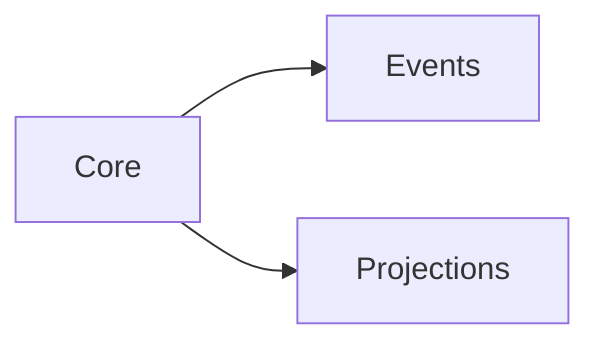

# Alt Text Standards for Whizbang Documentation

This document defines comprehensive standards for alt text in Whizbang documentation, focusing on Mermaid diagrams and code examples for maximum accessibility.

## Overview

Alt text ensures that visual content is accessible to screen readers and users with visual impairments. Since Whizbang documentation is highly technical with numerous Mermaid diagrams illustrating architectural concepts, descriptive alt text is critical for accessibility.

## Current State Analysis

**Documentation Visual Content:**
- ✅ **11 Mermaid diagrams** across 7 documentation files
- ❌ **0 traditional images** (PNG, JPG, etc.)
- 🎯 **Focus**: Architectural diagrams, sequence flows, dependency graphs

**Diagram Distribution:**
- `getting-started.md`: 4 diagrams (simple flow, sequence x2, architecture graph)
- `projections.md`: 1 diagram (sequence flow)
- `commands/command-handling.md`: 3 diagrams (sequence x2, responsibility graph)
- `package-structure.md`: 1 diagram (package dependency graph)
- `projections/projection-*.md`: 2 diagrams (context flow, subscription routing)

## Alt Text Standards for Mermaid Diagrams

### 1. Diagram Type-Specific Standards

#### **Sequence Diagrams** (`sequenceDiagram`)
**Purpose**: Show message flow and timing between components

**Alt Text Format**:
```
Sequence diagram showing [WORKFLOW_NAME] between [PARTICIPANT_COUNT] components: [PARTICIPANT_LIST]. Flow: [SIMPLIFIED_FLOW_DESCRIPTION].
```

**Example**:
```
Sequence diagram showing order placement workflow between 3 components: API Endpoint, Whizbang Mediator, and PlaceOrderHandler. Flow: API sends PlaceOrder command to mediator, mediator routes to handler, handler validates and creates order, returns OrderPlacedResult.
```

#### **Graph Diagrams** (`graph TB/LR`)
**Purpose**: Show architecture, dependencies, or hierarchical relationships

**Alt Text Format**:
```
[DIRECTION] diagram showing [RELATIONSHIP_TYPE] between [COMPONENT_COUNT] components. [GROUPED_DESCRIPTION]. Key relationships: [MAIN_CONNECTIONS].
```

**Example**:
```
Left-to-right diagram showing package dependencies between 8 Whizbang components. Core packages (mediator, event sourcing, projections) connect to ORM integrations (Entity Framework, Dapper, NHibernate) and database adapters (Postgres, SQL Server). Key relationships: Core package is foundation for all other components.
```

#### **Class/Component Diagrams**
**Purpose**: Show type relationships or component structures

**Alt Text Format**:
```
Component diagram showing [STRUCTURE_TYPE] with [ELEMENT_COUNT] elements. [HIERARCHY_DESCRIPTION]. [INTERACTION_PATTERNS].
```

### 2. Technical Content Guidelines

#### **Include These Elements**:
- **Component count** (helps users understand complexity)
- **Direction/layout** (top-to-bottom, left-to-right)
- **Primary purpose** (what the diagram demonstrates)
- **Key relationships** (main connections users need to understand)
- **Architectural layers** (when relevant)

#### **Avoid These Elements**:
- Color descriptions (diagrams work without color)
- Visual styling details (border thickness, shapes)
- Exact positioning ("in the upper left")
- Redundant framework names (unless essential to understanding)

### 3. Context-Aware Descriptions

#### **Architecture Diagrams**
Focus on:
- **Layer separation** (write side, read side, event bus)
- **Data flow direction** (commands → events → projections)
- **Responsibility boundaries** (what each component does)

#### **Process Flow Diagrams** 
Focus on:
- **Sequence of operations** (step-by-step workflow)
- **Decision points** (validation, conditional logic)
- **Data transformation** (input → processing → output)

#### **Dependency Diagrams**
Focus on:
- **Package hierarchy** (core vs extensions)
- **Integration patterns** (how packages connect)
- **Optional vs required** (which dependencies are essential)

### 4. Accessibility Best Practices

#### **Screen Reader Optimization**:
- **Lead with diagram type** (sequence, graph, flowchart)
- **Use active voice** ("Handler validates command" vs "Command is validated")
- **Logical flow order** (describe in reading sequence)
- **Avoid technical jargon** when simpler terms work

#### **Cognitive Accessibility**:
- **Progressive detail** (overview first, then specifics)
- **Familiar metaphors** (pipeline, workflow, hierarchy)
- **Consistent terminology** (use same terms as documentation)

### 5. Implementation Strategy

#### **Automated Alt Text for Mermaid**:
1. **Parse Mermaid syntax** to extract components and relationships
2. **Detect diagram type** (sequence, graph, etc.)
3. **Generate structured alt text** using templates above
4. **Validate against accessibility guidelines**

#### **Manual Review Process**:
1. **Technical accuracy** (does alt text match diagram purpose?)
2. **Accessibility compliance** (screen reader friendly?)
3. **Context relevance** (fits with surrounding documentation?)

### 6. Quality Checklist

**Every Mermaid diagram alt text should:**
- [ ] Start with diagram type (sequence, graph, flowchart)
- [ ] Include component/participant count
- [ ] Describe primary purpose/workflow
- [ ] Mention key relationships or flow direction
- [ ] Use terminology consistent with documentation
- [ ] Be 50-150 words (detailed but concise)
- [ ] Focus on functional meaning, not visual appearance
- [ ] Be understandable without seeing the diagram

### 7. Template Library

#### **Command/Event Flow**:
```
Sequence diagram illustrating [COMMAND_NAME] processing through [N] components: [LIST]. Flow shows command validation, business logic execution, event generation, and result return.
```

#### **CQRS Architecture**:
```
Architecture diagram showing CQRS separation between write side ([N] components) and read side ([N] components), connected through event bus. Demonstrates command→aggregate→event→projection data flow.
```

#### **Package Dependencies**:
```
Dependency diagram showing [N] Whizbang packages organized in [N] layers: [LAYER_NAMES]. Core packages provide foundation for specialized adapters and integrations.
```

#### **Event Subscription**:
```
Flow diagram showing event routing from [SOURCE] to [N] projection handlers. Demonstrates subscription patterns and handler priority ordering.
```

## Content Author Guidelines

### When Adding New Diagrams:

1. **Choose diagram type** based on what you're illustrating
2. **Write alt text first** (helps clarify diagram purpose)
3. **Use template from library** for consistency
4. **Test with screen reader** if possible
5. **Review against checklist** before publishing

### Example Implementation:

```markdown


**Alt text**: Left-to-right dependency diagram showing 3 Whizbang core packages. Core package provides foundation for Events and Projections packages, demonstrating modular architecture where business logic is separated from persistence and read model concerns.
```

This standard ensures all Whizbang diagrams are accessible while maintaining technical accuracy and usefulness for both sighted and non-sighted users.

## Validation and Quality Assurance

### Automated Validation Script

Run the alt text validation script to check documentation quality:

```bash
node src/scripts/validate-alt-text.mjs
```

**What it checks:**
- Missing alt text in markdown images
- Poor quality alt text (too short, generic terms)
- Complex Mermaid diagrams that need additional context
- Overall accessibility coverage

**Integration with CI/CD:**
Add this script to your build process to ensure consistent alt text quality across all documentation changes.

### Manual Review Checklist

Before publishing documentation with images or diagrams:

- [ ] All Mermaid diagrams have automated alt text generation
- [ ] Traditional images have descriptive alt text (10-50 words)
- [ ] Alt text describes function/purpose, not just appearance
- [ ] Complex diagrams have explanatory text in surrounding content
- [ ] Technical terms are used consistently with documentation
- [ ] Alt text is understandable without seeing the diagram

### Browser Testing

Test accessibility with:
- **Screen readers**: NVDA (Windows), VoiceOver (Mac), ORCA (Linux)
- **Browser tools**: Chrome DevTools Accessibility panel
- **Automated tools**: axe DevTools browser extension
- **Manual testing**: Tab navigation, high contrast mode