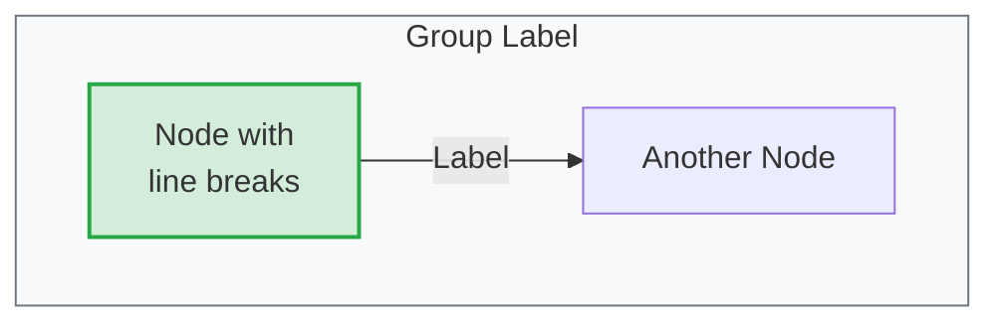
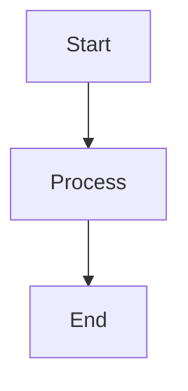
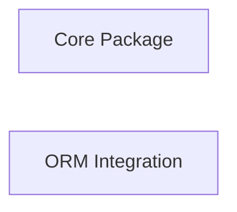

# Visual Diagrams (Mermaid)

Documentation should include **Mermaid diagrams** to provide visual understanding of architecture and workflows. Use diagrams liberally to:

- Show system architecture and component relationships
- Illustrate data flow and sequences
- Visualize hierarchies and precedence
- Demonstrate workflows and patterns

## Diagram Types to Use

1. **Graph Diagrams** (`graph TB` or `graph LR`) - For architecture, component relationships, hierarchies
2. **Sequence Diagrams** (`sequenceDiagram`) - For workflows, message flows, command→event flows
3. **Class Diagrams** (`classDiagram`) - For type hierarchies (when needed)

## Style Guidelines



## Color Coding Standards
- **Green** (`#d4edda` / `#28a745`) - Business logic layer, success states, correct examples
- **Blue** (`#cce5ff` / `#004085`) - Read model layer, projections
- **Yellow** (`#fff3cd` / `#ffc107`) - Data layer (events, commands)
- **Red** (`#f8d7da` / `#dc3545`) - Errors, warnings, incorrect examples

## Technical Setup

The site is configured to render Mermaid diagrams automatically:
- **Package**: `mermaid@11.12.0` installed in dependencies
- **Extraction**: `markdown.page.ts` extracts mermaid blocks before markdown processing
- **Parser Skip**: `code-block-parser.service.ts` skips mermaid blocks (only processes C#/other code)
- **Rendering**: `MermaidService` renders diagrams to SVG using Mermaid.js
- **Injection**: SVG diagrams replace HTML comment placeholders in rendered DOM

## Implementation Flow
1. Load markdown file with mermaid blocks
2. Code block parser skips `language === 'mermaid'` blocks
3. `parseCustomComponents()` extracts mermaid code, replaces with `<!--MERMAID_PLACEHOLDER_N-->`
4. ngx-markdown renders markdown (without mermaid blocks)
5. `renderMermaidBlocks()` finds placeholder comments in DOM
6. Mermaid.js renders code to SVG
7. Replace placeholders with rendered diagrams

Simply include Mermaid syntax in markdown files using triple backtick code blocks with `mermaid` language identifier:

````markdown

````

**Critical**: The code block parser MUST skip mermaid blocks to avoid stripping them out. This is handled in `code-block-parser.service.ts` with `if (language === 'mermaid') continue;`

## Mermaid Color Scheme Methodology

All Mermaid diagrams use a **dual-class system** for semantic meaning and visual grouping:

### 1. Semantic Layer Classes (architectural meaning)

These represent the **functional areas** of the Whizbang library architecture:

| Layer Class | Color | Hex Code | Functional Area | Usage |
|-------------|-------|----------|-----------------|-------|
| `layer-core` | 🟢 Green | `#28a745` | **Core Business Logic** | Domain functionality, mediator, handlers, core abstractions |
| `layer-event` | 🔴 Red | `#dc3545` | **Event Sourcing & Persistence** | Event stores, aggregates, event handling, data persistence |
| `layer-read` | 🔵 Blue | `#004085` | **Read Models & Queries** | Projections, read model subscriptions, query operations |
| `layer-command` | 🟡 Yellow | `#ffc107` | **Commands & Messaging** | Write operations, distributed messaging, outbox/inbox patterns |
| `layer-observability` | 🔷 Teal | `#14b8a6` | **Observability & Monitoring** | Telemetry, metrics, tracing, monitoring, dashboards |
| `layer-infrastructure` | 🟣 Purple | `#8b5cf6` | **Developer Tools** | Analyzers, testing utilities, development-time tooling |

**When to Use Functional Area Colors:**
- Package dependency diagrams (showing how packages relate architecturally)
- Component interaction diagrams (showing functional layer communication)
- Edge labels in flowcharts (colored to match source node's functional area)
- Any diagram where architectural concerns need visual distinction

### 2. Color Bucket Classes (visual grouping with coordinated line colors)
- `bucket-a` through `bucket-e` - For grouping related items with matching edge colors
- Used when diagrams have many connections to the same nodes (e.g., multiple ORMs connecting to event store)
- Each bucket colors both the node AND its connecting lines/edges for easy visual tracing

**Theme-Aware Styling:**
- All colors defined in `src/styles.scss` with both light and dark mode variants
- Light mode: Pastel backgrounds with dark text
- Dark mode: Dark backgrounds with light text and brighter borders

**Usage in Diagrams:**



**Line Color Coordination:**
Bucket classes automatically style connecting edges by ID pattern matching (e.g., `path[id*="WhizEF"]` matches edges from WhizEF nodes).

**When to Use Each:**
- **Semantic layers**: Use for packages/components representing architectural concerns
- **Color buckets**: Use for third-party integrations, adapters, or when you need distinct colors for related items with many connections

See `src/styles.scss` lines 523-994 for complete color definitions.