# Command Handling

Commands represent intent or actions in your system. Command handlers contain business logic, validate commands, apply business rules, and emit events to record what happened.

## CRITICAL: Events Can ONLY Be Emitted via Command Handling

Events are the result of command processing - they cannot be created directly. You **must** send a command to emit an event.

```mermaid
sequenceDiagram
    participant User
    participant API as API/Service
    participant Handler as Command Handler
    participant Context as CommandContext
    participant EventStore as Event Store
    participant Projection as Projections

    User->>API: Send Command<br/>(PlaceOrder)
    API->>Handler: Handle(command, context)

    Note over Handler: ✅ Validate command<br/>✅ Apply business rules<br/>✅ Make decisions

    Handler->>Context: EmitEvent(OrderPlaced)<br/>⚠️ ONLY way to create events
    Context->>Context: Populate EventContext<br/>(user, tenant, timestamp)
    Context->>EventStore: Append event
    EventStore-->>Context: Event persisted
    Context-->>Handler: Event emitted

    Handler->>Context: Send(ReserveInventory)<br/>✅ Emit follow-up commands
    Context->>API: Route command

    Handler-->>API: Return event
    API-->>User: Success

    EventStore->>Projection: Notify subscribers
    Note over Projection: ✅ Pure transformation<br/>❌ NO event emission
```



This constraint ensures:

1. **Single Source of Truth**: All events originate from command handling - clear causation
2. **Auditability**: Every event has a corresponding command that caused it
3. **Authorization**: Commands are the authorization boundary - validate before creating events
4. **Business Logic Encapsulation**: Events are created only after business rules pass
5. **Transaction Boundary**: Command handling is the transaction boundary for event emission
6. **Event Context**: CommandContext automatically populates EventContext metadata (user, tenant, etc.)

## CommandContext Structure

```csharp
public class CommandContext {
    // Command metadata
    public CommandMetadata Command { get; init; }

    // Security context (from command initiator)
    public SecurityContext Security { get; init; }

    // Emit events - ONLY way to create events
    public TEvent EmitEvent<TEvent>(TEvent @event) where TEvent : class;

    // Emit follow-up commands
    public Task Send<TCommand>(TCommand command, CancellationToken ct = default) where TCommand : class;

    // Access to stores for reading (not writing - use events for that)
    public IEventStore EventStore { get; init; }
}

public class CommandMetadata {
    public Guid CommandId { get; init; }
    public string CommandType { get; init; }
    public DateTime ReceivedAt { get; init; }
    public Guid CorrelationId { get; init; }
}
```

## Basic Command Handler

```csharp{
title: "Basic Command Handler with Event Emission"
description: "Command handler that validates, applies business logic, and emits events"
framework: "NET8"
category: "Commands"
difficulty: "BEGINNER"
tags: ["Commands", "Command Handlers", "Events", "Business Logic"]
nugetPackages: ["Whizbang.Core"]
usingStatements: ["System", "System.Threading", "System.Threading.Tasks"]
showLineNumbers: true
}
using System;
using System.Threading;
using System.Threading.Tasks;

// ✅ CORRECT: Command handler contains business logic
public class PlaceOrderHandler : ICommandHandler<PlaceOrder, OrderPlaced> {
    public async Task<OrderPlaced> Handle(
        PlaceOrder command,
        CommandContext context,  // ✅ Context for emitting events and commands
        CancellationToken ct) {

        // ✅ Business logic happens HERE
        // - Validate the order
        // - Check inventory
        // - Calculate totals
        // - Apply business rules
        // - Decide if order should be marked as expired

        var expiresAt = DateTime.UtcNow.AddDays(90);  // ✅ Business decision
        var isExpired = false;  // ✅ Business decision
        var status = "Placed";   // ✅ Business decision

        // ✅ Emit event via CommandContext - the ONLY way to create events
        var @event = context.EmitEvent(new OrderPlaced {
            OrderId = command.OrderId,
            CustomerId = command.CustomerId,
            Total = command.Total,
            ExpiresAt = expiresAt,      // ✅ Set by handler
            IsExpired = isExpired,       // ✅ Set by handler
            Status = status              // ✅ Set by handler
        });

        return @event;
    }
}

// ✅ CORRECT: Command is a POCO (Plain Old CLR Object)
public record PlaceOrder {
    public Guid OrderId { get; init; }
    public Guid CustomerId { get; init; }
    public decimal Total { get; init; }
    public List<OrderItem> Items { get; init; }
}

// ✅ CORRECT: Event is a POCO - describes what happened
public record OrderPlaced {
    public Guid OrderId { get; init; }
    public Guid CustomerId { get; init; }
    public decimal Total { get; init; }
    public DateTime ExpiresAt { get; init; }     // ✅ Data only (set by handler)
    public bool IsExpired { get; init; }         // ✅ Data only (set by handler)
    public string Status { get; init; }          // ✅ Data only (set by handler)

    // ❌ NO business logic methods like:
    // public bool ShouldExpire() => DateTime.UtcNow > ExpiresAt;
    // Events are immutable data - handlers make decisions, events record them
}

public record OrderItem {
    public Guid ProductId { get; init; }
    public int Quantity { get; init; }
}
```

## What You CAN and CANNOT Do

### ✅ In Command Handlers (Business Logic Layer)

```csharp
// ✅ CAN use DateTime.UtcNow for business decisions
var expiresAt = DateTime.UtcNow.AddDays(90);

// ✅ CAN use Random or Guid.NewGuid()
var confirmationCode = Random.Shared.Next(100000, 999999);

// ✅ CAN call external APIs
var customerData = await _customerService.GetCustomerAsync(command.CustomerId, ct);

// ✅ CAN read from databases
var product = await _productRepository.GetAsync(command.ProductId, ct);

// ✅ CAN perform calculations and validations
if (command.Total <= 0) {
    throw new InvalidOperationException("Order total must be positive");
}

// ✅ CAN make business decisions
var needsApproval = command.Total > 10000;
var discount = customer.IsPremium ? 0.10m : 0;

// ✅ CAN emit events via CommandContext
var @event = context.EmitEvent(new OrderPlaced { ... });

// ✅ CAN emit follow-up commands via CommandContext
await context.Send(new ReserveInventory { ... }, ct);
```

### ❌ Outside Command Handlers

```csharp
// ❌ CANNOT emit events directly - no CommandContext
public class SomeService {
    private readonly IEventStore _eventStore;

    public async Task DoSomething() {
        // ❌ FORBIDDEN: Cannot create events outside of command handling
        var @event = new OrderPlaced { ... };
        await _eventStore.AppendAsync(@event);  // 💥 Compile error - not allowed!

        // ✅ CORRECT: Must send a command instead
        await _whizbang.Send(new PlaceOrder { ... });
        // The command handler will emit the event via CommandContext
    }
}

// ❌ CANNOT emit events from projections
[WhizbangProjection]
public class BadProjection {
    public async Task OnOrderPlaced(
        [WhizbangSubscribe] OrderPlaced @event,
        CancellationToken ct) {

        // ❌ FORBIDDEN: Projections cannot emit events
        // No CommandContext available - projections are read-side only
        var newEvent = new OrderProcessed { ... };  // 💥 Cannot emit

        // ✅ CORRECT: If you need to trigger something, emit a command
        await _whizbang.Send(new ProcessOrder { ... });
        // The command handler will emit events
    }
}
```

## Command Emission (Sagas and Process Managers)

Handlers can emit follow-up commands to coordinate workflows:

```csharp{
title: "Command Emission in Handlers"
description: "Emitting follow-up commands for workflow coordination"
framework: "NET8"
category: "Commands"
difficulty: "INTERMEDIATE"
tags: ["Commands", "Sagas", "Workflows", "Process Managers"]
nugetPackages: ["Whizbang.Core"]
usingStatements: ["System", "System.Threading", "System.Threading.Tasks"]
showLineNumbers: true
}
using System;
using System.Threading;
using System.Threading.Tasks;

// Command handler emits both events and commands
public class PlaceOrderHandler : ICommandHandler<PlaceOrder, OrderPlaced> {
    public async Task<OrderPlaced> Handle(
        PlaceOrder command,
        CommandContext context,
        CancellationToken ct) {

        // Business logic
        var expiresAt = DateTime.UtcNow.AddDays(90);

        // ✅ Emit event via CommandContext
        var @event = context.EmitEvent(new OrderPlaced {
            OrderId = command.OrderId,
            CustomerId = command.CustomerId,
            Total = command.Total,
            ExpiresAt = expiresAt
        });

        // ✅ Emit follow-up commands to coordinate workflow
        await context.Send(new ReserveInventory {
            OrderId = command.OrderId,
            Items = command.Items
        }, ct);

        await context.Send(new NotifyCustomer {
            CustomerId = command.CustomerId,
            Message = "Your order has been placed"
        }, ct);

        return @event;
    }
}

// Saga pattern - event handlers emit commands to orchestrate workflow
public class OrderSagaHandler : IEventHandler<OrderPlaced> {
    private readonly IWhizbang _whizbang;

    public async Task Handle(OrderPlaced @event, CancellationToken ct) {
        // ✅ Event handler can emit commands (but NOT events)

        // Step 1: Reserve inventory
        await _whizbang.Send(new ReserveInventory {
            OrderId = @event.OrderId,
            Items = @event.Items
        }, ct);

        // Step 2: Authorize payment
        await _whizbang.Send(new AuthorizePayment {
            OrderId = @event.OrderId,
            Amount = @event.Total,
            CustomerId = @event.CustomerId
        }, ct);
    }
}
```

## Aggregate Command Handling

Aggregates can also emit events via CommandContext:

```csharp{
title: "Aggregate Command Handling"
description: "Using aggregates to handle commands and emit events"
framework: "NET8"
category: "Commands"
difficulty: "ADVANCED"
tags: ["Aggregates", "Commands", "Events", "DDD"]
nugetPackages: ["Whizbang.Core", "Whizbang.EventSourcing"]
usingStatements: ["System", "System.Collections.Generic", "System.Threading.Tasks"]
showLineNumbers: true
}
using System;
using System.Collections.Generic;
using System.Threading.Tasks;

// Aggregate can emit events via CommandContext
public class OrderAggregate : Aggregate {
    private Guid _orderId;
    private OrderStatus _status;
    private List<OrderItem> _items = new();

    public async Task PlaceOrder(PlaceOrder command, CommandContext context) {
        // Apply business rules
        if (_status != OrderStatus.None) {
            throw new InvalidOperationException("Order already placed");
        }

        var expiresAt = DateTime.UtcNow.AddDays(90);

        // ✅ Emit event via CommandContext
        var @event = context.EmitEvent(new OrderPlaced {
            OrderId = command.OrderId,
            CustomerId = command.CustomerId,
            Total = command.Total,
            ExpiresAt = expiresAt
        });

        // Apply event to aggregate state
        Apply(@event);

        // ✅ Aggregate can also emit follow-up commands via CommandContext
        await context.Send(new SendOrderConfirmationEmail {
            OrderId = command.OrderId,
            CustomerEmail = command.CustomerEmail
        });
    }

    public async Task ShipOrder(ShipOrder command, CommandContext context) {
        // Validate state
        if (_status != OrderStatus.Placed) {
            throw new InvalidOperationException("Order cannot be shipped in current state");
        }

        // ✅ Emit event via CommandContext
        var @event = context.EmitEvent(new OrderShipped {
            OrderId = command.OrderId,
            TrackingNumber = command.TrackingNumber
        });

        Apply(@event);

        // ✅ Emit follow-up command
        await context.Send(new NotifyCustomerOfShipment {
            OrderId = command.OrderId,
            TrackingNumber = command.TrackingNumber
        });
    }

    // Event handlers update aggregate state
    private void Apply(OrderPlaced @event) {
        _orderId = @event.OrderId;
        _status = OrderStatus.Placed;
    }

    private void Apply(OrderShipped @event) {
        _status = OrderStatus.Shipped;
    }
}

public enum OrderStatus {
    None,
    Placed,
    Shipped,
    Delivered,
    Cancelled
}
```

## Use Cases for Command Emission

1. **Sagas / Process Managers**: Orchestrate multi-step workflows across aggregates/services
2. **Command Chaining**: Break complex operations into smaller, coordinated commands
3. **Side Effects**: Trigger notifications, emails, integrations
4. **Compensating Actions**: Send rollback commands if a step fails
5. **Distributed Transactions**: Coordinate actions across multiple bounded contexts
6. **Workflow Automation**: Trigger next steps in business processes

### Saga Workflow Example


## The Three-Layer Architecture


## Commands vs Events vs Queries

| Aspect | Command | Event | Query |
|--------|---------|-------|-------|
| **Purpose** | Express intent | Record what happened | Retrieve data |
| **Tense** | Imperative (PlaceOrder) | Past tense (OrderPlaced) | Question (GetOrder) |
| **Business Logic** | Handler contains logic | NO logic - POCO | NO logic - handler reads data |
| **Side Effects** | YES - creates events | NO - immutable data | NO - read-only |
| **Can Fail** | YES - validation errors | NO - fact that happened | NO - returns null/empty |
| **Emit Events** | YES - via CommandContext | N/A | NO |
| **Emit Commands** | YES - via CommandContext | Via event handlers | NO |

## Validation and Error Handling

```csharp{
title: "Command Validation and Error Handling"
description: "Proper validation and error handling in command handlers"
framework: "NET8"
category: "Commands"
difficulty: "INTERMEDIATE"
tags: ["Validation", "Error Handling", "Commands"]
nugetPackages: ["Whizbang.Core"]
usingStatements: ["System", "System.Threading", "System.Threading.Tasks"]
showLineNumbers: true
}
using System;
using System.Threading;
using System.Threading.Tasks;

public class PlaceOrderHandler : ICommandHandler<PlaceOrder, OrderPlaced> {
    private readonly IProductRepository _products;
    private readonly ICustomerRepository _customers;

    public PlaceOrderHandler(IProductRepository products, ICustomerRepository customers) {
        _products = products;
        _customers = customers;
    }

    public async Task<OrderPlaced> Handle(
        PlaceOrder command,
        CommandContext context,
        CancellationToken ct) {

        // ✅ Validate command data
        if (command.OrderId == Guid.Empty) {
            throw new ArgumentException("OrderId is required", nameof(command.OrderId));
        }

        if (command.Items == null || command.Items.Count == 0) {
            throw new ArgumentException("Order must have at least one item", nameof(command.Items));
        }

        // ✅ Validate business rules
        var customer = await _customers.GetAsync(command.CustomerId, ct);
        if (customer == null) {
            throw new InvalidOperationException($"Customer {command.CustomerId} not found");
        }

        if (!customer.IsActive) {
            throw new InvalidOperationException("Cannot place order for inactive customer");
        }

        // ✅ Check availability
        foreach (var item in command.Items) {
            var product = await _products.GetAsync(item.ProductId, ct);
            if (product == null) {
                throw new InvalidOperationException($"Product {item.ProductId} not found");
            }

            if (product.Stock < item.Quantity) {
                throw new InvalidOperationException(
                    $"Insufficient stock for product {product.Name}. " +
                    $"Available: {product.Stock}, Requested: {item.Quantity}");
            }
        }

        // ✅ Calculate totals
        decimal total = 0;
        foreach (var item in command.Items) {
            var product = await _products.GetAsync(item.ProductId, ct);
            total += product.Price * item.Quantity;
        }

        // ✅ Apply business rules
        var discount = customer.IsPremium ? total * 0.10m : 0;
        var finalTotal = total - discount;

        // ✅ Emit event with all business decisions made
        var @event = context.EmitEvent(new OrderPlaced {
            OrderId = command.OrderId,
            CustomerId = command.CustomerId,
            Total = finalTotal,
            Discount = discount,
            ExpiresAt = DateTime.UtcNow.AddDays(90),
            IsExpired = false,
            Status = "Placed"
        });

        return @event;
    }
}
```

## Summary

- **Events can ONLY be emitted via CommandContext** during command handling
- **Command handlers contain business logic** - validation, rules, decisions
- **Events are POCOs** describing what happened (no logic)
- **Commands are POCOs** describing intent (no logic)
- **Handlers can emit follow-up commands** for sagas and workflows
- **CommandContext provides authorization boundary** - events created after validation
- **Projections cannot emit events** - they're read-side only

## Next Steps

- [Command Validation](./command-validation.md) - Advanced validation patterns
- [Sagas and Process Managers](../Workflows/sagas.md) - Workflow orchestration
- [Aggregates](../Domain/aggregates.md) - Domain-driven design with aggregates
- [Projection Purity](../Projections/projection-purity.md) - Maintaining pure projections
