# Projection Purity

**CRITICAL**: Projections must be **pure functions** and **deterministic**. The same event must ALWAYS produce the same projection state, regardless of when it's processed.

## The Purity Rule

Projections are **read-side transformations** that convert event data into queryable read models. They must:

- Be deterministic (same input = same output)
- Have no side effects
- Use only data from events or EventContext
- Never perform business logic

## Good vs Bad Projections

### ✅ Good Projection (Pure)

```csharp{
title: "Pure Projection Example"
description: "Correct projection using only event data and EventContext"
framework: "NET8"
category: "Projections"
difficulty: "INTERMEDIATE"
tags: ["Projections", "Purity", "Best Practices"]
nugetPackages: ["Whizbang.Core", "Whizbang.Projections"]
usingStatements: ["System", "System.Threading", "System.Threading.Tasks"]
showLineNumbers: true
}
using System;
using System.Threading;
using System.Threading.Tasks;

[WhizbangProjection]
public class GoodProjection {
    // ✅ CORRECT: Use event timestamp from EventContext
    public async Task OnOrderPlaced(
        [WhizbangSubscribe] OrderPlaced @event,
        ProjectionContext projection,
        EventContext eventContext,
        CancellationToken ct) {
        var summary = new OrderSummary {
            OrderId = @event.OrderId,
            PlacedAt = eventContext.System.Timestamp,  // ✅ Deterministic
            ExpiresAt = @event.ExpiresAt,              // ✅ From event (business logic set this)
            CustomerId = @event.CustomerId,
            Total = @event.Total
        };

        await projection.Store.CreateAsync(summary, ct);
    }

    // ✅ CORRECT: Business logic decision in event, not projection
    public Task OnOrderPlaced2(
        [WhizbangSubscribe] OrderPlaced @event,
        ProjectionContext projection,
        CancellationToken ct) {
        // Event already contains IsExpired flag (set by business logic)
        if (@event.IsExpired) {
            return projection.Return(ProjectionReturnType.Ignored);
        }

        // Process non-expired order
        return Task.CompletedTask;
    }

    // ✅ CORRECT: Use data from event or context
    public async Task OnOrderShipped(
        [WhizbangSubscribe] OrderShipped @event,
        ProjectionContext projection,
        EventContext eventContext,
        CancellationToken ct) {
        await projection.Store.PatchAsync<OrderSummary>(
            @event.OrderId,
            order => {
                order.Status = "Shipped";
                order.ShippedAt = eventContext.System.Timestamp;  // ✅ From context
                order.TrackingNumber = @event.TrackingNumber;      // ✅ From event
            },
            ct);
    }
}

public class OrderSummary {
    public Guid OrderId { get; set; }
    public DateTime PlacedAt { get; set; }
    public DateTime ExpiresAt { get; set; }
    public Guid CustomerId { get; set; }
    public decimal Total { get; set; }
    public string Status { get; set; }
    public DateTime? ShippedAt { get; set; }
    public string TrackingNumber { get; set; }
}
```

### ❌ Bad Projection (Impure)

```csharp{
title: "Impure Projection Example"
description: "Common purity violations and how to avoid them"
framework: "NET8"
category: "Projections"
difficulty: "INTERMEDIATE"
tags: ["Projections", "Anti-Patterns", "Common Mistakes"]
nugetPackages: ["Whizbang.Core", "Whizbang.Projections"]
usingStatements: ["System", "System.IO", "System.Threading", "System.Threading.Tasks"]
showLineNumbers: true
}
using System;
using System.IO;
using System.Threading;
using System.Threading.Tasks;

[WhizbangProjection]
public class BadProjection {
    // ❌ WRONG: DateTime.UtcNow is non-deterministic
    public async Task OnOrderPlaced(
        [WhizbangSubscribe] OrderPlaced @event,
        ProjectionContext projection,
        CancellationToken ct) {
        var summary = new OrderSummary {
            OrderId = @event.OrderId,
            PlacedAt = DateTime.UtcNow,  // ❌ NON-DETERMINISTIC - Will be different on replay!
        };

        await projection.Store.CreateAsync(summary, ct);
        // 💥 Whizbang.Analyzers will flag this as a compile error
    }

    // ❌ WRONG: Business logic in projection
    public Task OnOrderPlaced2(
        [WhizbangSubscribe] OrderPlaced @event,
        ProjectionContext projection,
        EventContext eventContext,
        CancellationToken ct) {
        // ❌ WRONG: Calculating expiration in projection is business logic
        var age = DateTime.UtcNow - eventContext.System.Timestamp;  // ❌ Non-deterministic
        if (age > TimeSpan.FromDays(90)) {
            return projection.Return(ProjectionReturnType.Ignored);
        }

        // Business logic belongs in command handler or aggregate, not projection!
        return Task.CompletedTask;
        // 💥 Whizbang.Analyzers will flag DateTime.UtcNow usage
    }

    // ❌ WRONG: Random values
    public async Task OnOrderPlaced3(
        [WhizbangSubscribe] OrderPlaced @event,
        ProjectionContext projection,
        CancellationToken ct) {
        var summary = new OrderSummary {
            OrderId = @event.OrderId,
            RandomValue = Random.Shared.Next()  // ❌ NON-DETERMINISTIC
        };

        await projection.Store.CreateAsync(summary, ct);
        // 💥 Whizbang.Analyzers will flag Random usage
    }

    // ❌ WRONG: External I/O in projection
    public async Task OnOrderPlaced4(
        [WhizbangSubscribe] OrderPlaced @event,
        ProjectionContext projection,
        HttpClient httpClient,
        CancellationToken ct) {
        // ❌ WRONG: Calling external API is non-deterministic
        var customerData = await httpClient.GetAsync($"https://api/customers/{@event.CustomerId}");

        // External data can change - not deterministic!
        // 💥 Whizbang.Analyzers will flag external I/O
    }

    // ❌ WRONG: File I/O in projection
    public async Task OnOrderPlaced5(
        [WhizbangSubscribe] OrderPlaced @event,
        CancellationToken ct) {
        // ❌ WRONG: File writes are side effects
        await File.WriteAllTextAsync("orders.log", @event.OrderId.ToString());
        // 💥 Whizbang.Analyzers will flag file I/O
    }
}

public class OrderSummary {
    public Guid OrderId { get; set; }
    public DateTime PlacedAt { get; set; }
    public int RandomValue { get; set; }
}
```

## Purity Rules

Projections must follow these rules to remain pure and deterministic:

| ❌ **NEVER Use** | ✅ **Instead Use** | **Why** |
|-----------------|-------------------|---------|
| `DateTime.UtcNow` | `eventContext.System.Timestamp` | Current time is non-deterministic |
| `DateTime.Now` | `eventContext.System.Timestamp` | Current time is non-deterministic |
| `Random` / `Guid.NewGuid()` | Data from event or context | Random values are non-deterministic |
| External API calls | Data in event | External data can change |
| Database reads (outside projection store) | Data in event | External data can change |
| File I/O | Data in event | External data can change |
| Environment variables | `eventContext` or config in event | Environment can change |
| Business logic calculations | Business logic sets flags in event | Projections transform, don't decide |

## Where Business Logic Belongs

Business logic must live in command handlers and aggregates, NOT in projections.

### ✅ Correct: Business Logic in Command Handler

```csharp{
title: "Business Logic in Command Handler"
description: "Correct placement of business logic and decision-making"
framework: "NET8"
category: "Command Handling"
difficulty: "INTERMEDIATE"
tags: ["Command Handlers", "Business Logic", "Best Practices"]
nugetPackages: ["Whizbang.Core"]
usingStatements: ["System", "System.Threading", "System.Threading.Tasks"]
showLineNumbers: true
}
using System;
using System.Threading;
using System.Threading.Tasks;

// ✅ CORRECT: Business logic in command handler or aggregate
public class PlaceOrderHandler : ICommandHandler<PlaceOrder, OrderPlaced> {
    public async Task<OrderPlaced> Handle(
        PlaceOrder command,
        CommandContext context,
        CancellationToken ct) {
        // ✅ Business logic happens HERE
        // - Validate the order
        // - Check inventory
        // - Calculate totals
        // - Apply business rules
        // - Decide if order should be marked as expired

        var expiresAt = DateTime.UtcNow.AddDays(90);  // ✅ Business decision
        var isExpired = false;  // ✅ Business decision
        var status = "Placed";   // ✅ Business decision

        // Create event POCO with results of business logic
        // Event is just a data container - NO logic in the event class itself
        var @event = context.EmitEvent(new OrderPlaced {
            OrderId = command.OrderId,
            CustomerId = command.CustomerId,
            Total = command.Total,
            ExpiresAt = expiresAt,      // ✅ Set by handler
            IsExpired = isExpired,       // ✅ Set by handler
            Status = status              // ✅ Set by handler
        });

        return @event;
    }
}

// ✅ CORRECT: Event is just a POCO (Plain Old CLR Object)
// NO business logic, NO methods (except maybe ToString for debugging)
// Just immutable data describing what happened
public record OrderPlaced {
    public Guid OrderId { get; init; }
    public Guid CustomerId { get; init; }
    public decimal Total { get; init; }
    public DateTime ExpiresAt { get; init; }     // ✅ Data only
    public bool IsExpired { get; init; }         // ✅ Data only
    public string Status { get; init; }          // ✅ Data only

    // ❌ NO business logic methods like:
    // public bool ShouldExpire() => DateTime.UtcNow > ExpiresAt;
    // public void MarkAsExpired() => IsExpired = true;
    // Events are immutable data - handlers make decisions, events record them
}

// ✅ CORRECT: Projection just transforms event data
[WhizbangProjection]
public class OrderProjection {
    public async Task OnOrderPlaced(
        [WhizbangSubscribe] OrderPlaced @event,
        ProjectionContext projection,
        CancellationToken ct) {
        // ✅ No business logic - just transform POCO event to read model
        var summary = new OrderSummary {
            OrderId = @event.OrderId,
            ExpiresAt = @event.ExpiresAt,    // ✅ Copy from event (handler set this)
            IsExpired = @event.IsExpired,     // ✅ Copy from event (handler set this)
            Status = @event.Status            // ✅ Copy from event (handler set this)
        };

        if (@event.IsExpired) {
            // Simple filtering based on event data (not a business decision)
            return projection.Return(ProjectionReturnType.Ignored);
        }

        await projection.Store.CreateAsync(summary, ct);
    }
}

public class OrderSummary {
    public Guid OrderId { get; set; }
    public DateTime ExpiresAt { get; set; }
    public bool IsExpired { get; set; }
    public string Status { get; set; }
}
```

## The Three-Layer Architecture

Whizbang enforces a clear separation of concerns:

```mermaid
graph TB
    subgraph BusinessLogic["Command Handler / Aggregate (Business Logic Layer)"]
        BL1["✅ Validates commands"]
        BL2["✅ Applies business rules"]
        BL3["✅ Makes decisions"]
        BL4["✅ Creates event POCOs with results"]
        BL5["✅ CAN emit commands (sagas)"]
        BL6["✅ CAN use DateTime.UtcNow, Random, APIs"]
    end

    subgraph DataLayer["Data Layer (POCOs - No Logic)"]
        Event["Event<br/>- Properties only<br/>- NO methods<br/>- Describes what happened"]
        Command["Command<br/>- Properties only<br/>- NO methods<br/>- Describes intent"]
    end

    subgraph ReadModel["Projection (Read Model Layer)"]
        P1["✅ Pure transformation of event data"]
        P2["❌ NO business logic"]
        P3["❌ NO DateTime.UtcNow, Random, APIs"]
        P4["✅ ONLY event data or EventContext"]
        P5["✅ Deterministic and replayable"]
    end

    BusinessLogic -->|Emits Events| Event
    BusinessLogic -->|Emits Commands| Command
    Event -->|Consumed by| ReadModel
    Command -->|Handled by| BusinessLogic

    style BusinessLogic fill:#d4edda,stroke:#28a745,stroke-width:2px
    style DataLayer fill:#fff3cd,stroke:#ffc107,stroke-width:2px
    style ReadModel fill:#cce5ff,stroke:#004085,stroke-width:2px
    style Event fill:#fff3cd,stroke:#ffc107,stroke-width:2px
    style Command fill:#fff3cd,stroke:#ffc107,stroke-width:2px
```



## Why Purity Matters

1. **Replay**: Events can be replayed to rebuild projections - must produce same result
2. **Testing**: Pure functions are easy to test - same input, same output
3. **Debugging**: Deterministic behavior makes bugs reproducible
4. **Scaling**: Multiple projection instances can process same events safely
5. **Time Travel**: Can replay events from any point in time
6. **Auditing**: Projection state is always verifiable from event stream
7. **Disaster Recovery**: Projections can be rebuilt from events after data loss
8. **Blue/Green Deployments**: New projection version can process same events

## Whizbang.Analyzers Enforcement

The `Whizbang.Analyzers` package enforces purity at compile time:

```csharp{
title: "Analyzer Enforcement Example"
description: "Compile-time purity validation with Whizbang.Analyzers"
framework: "NET8"
category: "Projections"
difficulty: "INTERMEDIATE"
tags: ["Analyzers", "Purity", "Compile-Time Validation"]
nugetPackages: ["Whizbang.Core", "Whizbang.Projections", "Whizbang.Analyzers"]
usingStatements: ["System", "System.Threading", "System.Threading.Tasks"]
showLineNumbers: true
}
using System;
using System.Threading;
using System.Threading.Tasks;

[WhizbangProjection]
public class OrderProjection {
    private readonly ILogger _logger;  // ⚠️ Warning: Injected services should be read-only

    // ✅ VALID - Pure projection handler
    public Task Handle([WhizbangSubscribe] OrderPlaced @event, EventContext context, CancellationToken ct) {
        // Pure state updates only
        var summary = new OrderSummary {
            PlacedAt = context.System.Timestamp  // ✅ OK - from context
        };
        return Task.CompletedTask;
    }

    // ❌ ERROR - Side effect detected (logging)
    public Task Handle([WhizbangSubscribe] OrderShipped @event, CancellationToken ct) {
        _logger.LogInformation("Order shipped");  // 💥 WBG001: Side effect in projection
        return Task.CompletedTask;
    }

    // ❌ ERROR - DateTime.UtcNow usage
    public Task Handle([WhizbangSubscribe] OrderCancelled @event, CancellationToken ct) {
        var cancelledAt = DateTime.UtcNow;  // 💥 WBG002: Non-deterministic time source
        return Task.CompletedTask;
    }

    // ❌ ERROR - Random value generation
    public Task Handle([WhizbangSubscribe] OrderCompleted @event, CancellationToken ct) {
        var random = Random.Shared.Next();  // 💥 WBG003: Non-deterministic random source
        return Task.CompletedTask;
    }

    // ❌ ERROR - External I/O detected
    public async Task Handle([WhizbangSubscribe] OrderRefunded @event, CancellationToken ct) {
        await File.WriteAllTextAsync("log.txt", "refunded");  // 💥 WBG004: I/O in projection
    }
}

public class OrderSummary {
    public DateTime PlacedAt { get; set; }
}
```

### Analyzer Error Codes

- **WBG001**: Side effect detected in projection (logging, console writes, etc.)
- **WBG002**: Non-deterministic time source (`DateTime.UtcNow`, `DateTime.Now`)
- **WBG003**: Non-deterministic random source (`Random`, `Guid.NewGuid()`)
- **WBG004**: I/O operation detected (file system, network, external database)
- **WBG005**: Database operation outside `ProjectionContext.Store`
- **WBG006**: Environment variable access
- **WBG007**: Complex business logic detected in projection (warning)

## Purity Checklist

Before merging projection code, verify:

- [ ] No `DateTime.UtcNow` or `DateTime.Now` usage
- [ ] No `Random` or `Guid.NewGuid()` calls
- [ ] No external API calls (HTTP, gRPC, etc.)
- [ ] No file system operations
- [ ] No logging or console writes
- [ ] No database operations outside `ProjectionContext.Store`
- [ ] No environment variable reads
- [ ] All timestamps from `EventContext.System.Timestamp`
- [ ] All business decisions from event data (not calculated in projection)
- [ ] `Whizbang.Analyzers` passes with no errors

## Summary

- **Projections = Pure transformations** of event data into read models
- **Business Logic = Command handlers and aggregates** that make decisions and emit events
- **Events = POCOs** describing what happened (no logic)
- **Determinism = Same event always produces same projection state**
- **Whizbang.Analyzers = Compile-time enforcement** of purity rules

## Next Steps

- [Projection Subscriptions](./projection-subscriptions.md) - Event subscription patterns
- [Projection Contexts](./projection-contexts.md) - EventContext and ProjectionContext injection
- [Projection Return Values](./projection-return-values.md) - Using return values for observability
