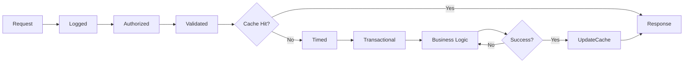

# Aspect-Oriented Programming in Whizbang

## Overview

Whizbang brings true aspect-oriented programming (AOP) to .NET messaging through source generators. Cross-cutting concerns like logging, caching, retry, and authorization are first-class citizens, not afterthoughts bolted onto your handlers.

## What Makes Whizbang's AOP Different

Traditional .NET AOP approaches suffer from:
- **Runtime reflection overhead** (Castle DynamicProxy, PostSharp)
- **Limited compile-time verification** (Attributes without validation)
- **Poor IDE support** (No IntelliSense for aspects)
- **Complex configuration** (XML files, registration ceremonies)

Whizbang solves these with:
- **Source generation** - Zero runtime overhead
- **Compile-time verification** - Catch errors during build
- **Rich IDE integration** - Full IntelliSense and refactoring
- **Convention-based** - Aspects just work

## Core Concepts

### Aspects as Attributes

```csharp
[Logged]                    // Add structured logging
[Timed]                     // Track execution time
[Cached(Duration = "5m")]   // Cache results
[Retry(3, Backoff = "exponential")]  // Retry on failure
[Authorized(Role = "Admin")]         // Enforce authorization
[Validated]                 // Validate input
[Transactional]            // Wrap in transaction
public class OrderHandler : IHandle<CreateOrder> {
    public OrderCreated Handle(CreateOrder cmd) {
        // Your business logic here
        // All aspects are automatically woven in
        return new OrderCreated(cmd.OrderId);
    }
}
```

### Aspect Execution Pipeline



## Built-in Aspects

### Logging Aspect

```csharp
[Logged(
    Level = LogLevel.Information,
    IncludeParameters = true,
    IncludeResult = true,
    IncludeDuration = true,
    Message = "Processing order {OrderId}"
)]
public class OrderHandler : IHandle<CreateOrder> {
    public OrderCreated Handle(CreateOrder cmd) {
        // Automatically logs:
        // - Method entry with parameters
        // - Method exit with result
        // - Execution duration
        // - Any exceptions
        return new OrderCreated(cmd.OrderId);
    }
}

// Generated structured log output:
// {
//   "timestamp": "2024-01-15T10:30:00Z",
//   "level": "Information",
//   "message": "Processing order 123",
//   "handler": "OrderHandler",
//   "method": "Handle",
//   "parameters": { "orderId": "123", "customerId": "456" },
//   "duration": 45,
//   "result": { "orderId": "123", "success": true }
// }
```

### Caching Aspect

```csharp
[Cached(
    Duration = "5m",                    // Cache for 5 minutes
    Key = "{CustomerId}:{OrderId}",     // Custom cache key
    Condition = "Result.Success",        // Only cache successful results
    VaryBy = ["Country", "Currency"],   // Vary cache by these parameters
    Group = "Orders"                     // Cache group for bulk invalidation
)]
public class GetOrderHandler : IHandle<GetOrder> {
    public Order Handle(GetOrder query) {
        // First call: execute and cache
        // Subsequent calls within 5min: return from cache
        return LoadOrderFromDatabase(query.OrderId);
    }
}

// Cache invalidation
[InvalidatesCache(Group = "Orders")]
public class UpdateOrderHandler : IHandle<UpdateOrder> {
    public void Handle(UpdateOrder cmd) {
        // Automatically invalidates all cached orders
    }
}
```

### Retry Aspect

```csharp
[Retry(
    MaxAttempts = 3,
    Backoff = BackoffStrategy.Exponential,
    InitialDelay = "1s",
    MaxDelay = "30s",
    RetryOn = [typeof(TransientException)],
    AbortOn = [typeof(ValidationException)],
    OnRetry = nameof(LogRetry)
)]
public class PaymentHandler : IHandle<ProcessPayment> {
    public PaymentResult Handle(ProcessPayment cmd) {
        // Automatically retries on TransientException
        // Aborts immediately on ValidationException
        return ProcessPayment(cmd);
    }
    
    private void LogRetry(Exception ex, int attempt, TimeSpan delay) {
        _logger.LogWarning($"Retry {attempt} after {delay}: {ex.Message}");
    }
}
```

### Authorization Aspect

```csharp
[Authorized(
    Roles = ["Admin", "Manager"],
    Policies = ["OrderManagement"],
    RequireAll = false,  // OR condition
    FailureMode = AuthFailureMode.ThrowException
)]
public class DeleteOrderHandler : IHandle<DeleteOrder> {
    public void Handle(DeleteOrder cmd) {
        // Only accessible to Admin or Manager roles
        // Or users with OrderManagement policy
    }
}

// Resource-based authorization
[ResourceAuthorized(
    Resource = "{OrderId}",
    Permission = "Delete",
    ResourceType = typeof(Order)
)]
public class DeleteOrderHandler : IHandle<DeleteOrder> {
    public void Handle(DeleteOrder cmd) {
        // Checks if user can delete specific order
    }
}
```

### Validation Aspect

```csharp
[Validated(
    Mode = ValidationMode.Strict,
    ThrowOnFailure = true,
    ErrorCode = "VALIDATION_FAILED"
)]
public class CreateOrderHandler : IHandle<CreateOrder> {
    public OrderCreated Handle(CreateOrder cmd) {
        // Automatically validates cmd using:
        // - Data annotations
        // - FluentValidation rules
        // - Custom validators
        return new OrderCreated(cmd.OrderId);
    }
}

// The command with validation rules
public record CreateOrder(
    [Required] Guid CustomerId,
    [MinLength(1)] List<OrderItem> Items,
    [EmailAddress] string CustomerEmail
) : ICommand<OrderCreated>;
```

### Transaction Aspect

```csharp
[Transactional(
    IsolationLevel = IsolationLevel.ReadCommitted,
    Timeout = "30s",
    ReadOnly = false,
    Propagation = Propagation.Required,
    RollbackOn = [typeof(BusinessException)]
)]
public class TransferMoneyHandler : IHandle<TransferMoney> {
    public TransferResult Handle(TransferMoney cmd) {
        // Entire operation wrapped in transaction
        // Automatically rolled back on exception
        DebitAccount(cmd.FromAccount, cmd.Amount);
        CreditAccount(cmd.ToAccount, cmd.Amount);
        return new TransferResult(cmd.TransferId);
    }
}
```

### Metrics Aspect

```csharp
[Metrics(
    Counter = "orders.created",
    Histogram = "order.processing.duration",
    Tags = ["country:{Country}", "product:{ProductType}"],
    IncludeDefaultTags = true
)]
public class CreateOrderHandler : IHandle<CreateOrder> {
    public OrderCreated Handle(CreateOrder cmd) {
        // Automatically tracks:
        // - Invocation count
        // - Duration histogram
        // - Success/failure rate
        // - Custom tags from command
        return new OrderCreated(cmd.OrderId);
    }
}
```

## Creating Custom Aspects

### Simple Custom Aspect

```csharp
[AttributeUsage(AttributeTargets.Class | AttributeTargets.Method)]
public class AuditAttribute : AspectAttribute {
    public override async Task<T> InterceptAsync<T>(
        AspectContext context, 
        Func<Task<T>> next) {
        
        var audit = new AuditEntry {
            User = context.User.Identity.Name,
            Action = context.Method.Name,
            Timestamp = DateTime.UtcNow,
            Parameters = context.Arguments
        };
        
        try {
            var result = await next();
            audit.Success = true;
            audit.Result = result;
            return result;
        }
        catch (Exception ex) {
            audit.Success = false;
            audit.Error = ex.Message;
            throw;
        }
        finally {
            await context.Services
                .GetService<IAuditLog>()
                .LogAsync(audit);
        }
    }
}
```

### Advanced Custom Aspect with Source Generator

```csharp
// Aspect definition
[AspectGenerator]
public class RateLimitAttribute : AspectAttribute {
    public int RequestsPerMinute { get; set; }
    public string Key { get; set; }
}

// Source generator creates:
public static class RateLimitAspectGenerator {
    [GeneratedCode]
    public static async Task<T> Apply<T>(
        Func<Task<T>> handler,
        RateLimitAttribute attribute,
        AspectContext context) {
        
        var rateLimiter = context.GetService<IRateLimiter>();
        var key = attribute.Key.Replace("{UserId}", context.User.Id);
        
        if (!await rateLimiter.AllowRequest(key, attribute.RequestsPerMinute)) {
            throw new RateLimitExceededException();
        }
        
        return await handler();
    }
}
```

## Aspect Composition

### Sequential Composition

```csharp
// Aspects execute in order
[First]   // Executes first
[Second]  // Executes second
[Third]   // Executes third
public class Handler : IHandle<Command> {
    // Execution order: First -> Second -> Third -> Handler -> Third -> Second -> First
}
```

### Conditional Composition

```csharp
[ConditionalAspect(When = "Environment == 'Production'", Apply = typeof(AuditAspect))]
[ConditionalAspect(When = "User.IsAdmin", Apply = typeof(AdminLoggingAspect))]
public class Handler : IHandle<Command> {
    // Aspects applied based on runtime conditions
}
```

### Composite Aspects

```csharp
// Define a composite aspect
[CompositeAspect]
[Logged]
[Timed]
[Retry(3)]
[Cached("5m")]
public class StandardHandlerAspects : AspectAttribute { }

// Use the composite
[StandardHandlerAspects]
public class OrderHandler : IHandle<CreateOrder> {
    // Gets all aspects from composite
}
```

## Compile-Time Verification

### Pure Function Enforcement

```csharp
[Pure] // Compile-time verification
public class CalculationHandler : IHandle<Calculate> {
    public Result Handle(Calculate cmd) {
        // ✅ Allowed: Pure computation
        var result = cmd.A + cmd.B;
        
        // ❌ Compile error: I/O not allowed
        // await database.SaveAsync(result);
        
        // ❌ Compile error: State mutation not allowed  
        // this.field = result;
        
        return new Result(result);
    }
}
```

### Effect Tracking

```csharp
[Effects(
    Reads = ["Database", "Cache"],
    Writes = ["Database"],
    Publishes = ["OrderEvents"],
    NetworkCalls = ["PaymentGateway"]
)]
public class OrderHandler : IHandle<ProcessOrder> {
    public async Task<Result> Handle(ProcessOrder cmd) {
        // Source generator verifies declared effects match actual usage
        var order = await ReadDatabase();      // ✅ Matches Reads
        await WriteDatabase(order);            // ✅ Matches Writes
        await PublishEvent(new OrderCreated());// ✅ Matches Publishes
        
        // await CallUndeclaredService();      // ❌ Compile error: Undeclared effect
    }
}
```

### Aspect Compatibility Checking

```csharp
// Source generator detects incompatible aspects
[Cached]        // ❌ Compile error: Cannot cache with [NoCache]
[NoCache]       
public class Handler { }

[Transactional] // ❌ Compile error: ReadOnly transaction cannot Write
[ReadOnly]
[Writes("Database")]
public class Handler { }
```

## Performance Optimizations

### Zero-Overhead Aspects

```csharp
// Source generator creates optimized code
[Logged]
[Timed]
public class Handler : IHandle<Command> {
    public Result Handle(Command cmd) => new Result();
}

// Generated code (simplified):
public class Handler_Generated : IHandle<Command> {
    private readonly Handler _handler;
    private readonly ILogger _logger;
    private readonly IMetrics _metrics;
    
    public Result Handle(Command cmd) {
        var stopwatch = ValueStopwatch.StartNew(); // Stack allocated
        _logger.LogDebug("Handling {Command}", cmd);
        
        try {
            var result = _handler.Handle(cmd);
            _logger.LogDebug("Handled {Command} in {Duration}ms", cmd, stopwatch.ElapsedMilliseconds);
            _metrics.RecordDuration("handler.duration", stopwatch.Elapsed);
            return result;
        }
        catch (Exception ex) {
            _logger.LogError(ex, "Error handling {Command}", cmd);
            _metrics.IncrementCounter("handler.errors");
            throw;
        }
    }
}
```

### Aspect Caching

```csharp
// Aspects instances are cached and reused
[Expensive] // This aspect instance is created once and reused
public class Handler : IHandle<Command> {
    // Aspect state is maintained across invocations where appropriate
}
```

## Testing with Aspects

### Unit Testing

```csharp
[Test]
public async Task Handler_WithAspects_LogsAndTimes() {
    // Arrange
    var handler = new OrderHandler();
    var context = new TestAspectContext();
    
    // Act
    var result = await AspectRunner.RunWithAspects(
        handler,
        new CreateOrder { OrderId = "123" },
        context
    );
    
    // Assert
    result.ShouldBeSuccess();
    context.Logs.ShouldContain(log => log.Message.Contains("123"));
    context.Metrics["handler.duration"].ShouldBeLessThan(100);
}
```

### Integration Testing

```csharp
[Test]
public async Task Handler_WithProductionAspects_WorksCorrectly() {
    await Whizbang.Test<OrderHandler>()
        .Given(new CreateOrder { ... })
        .WithAspects(AspectProfile.Production) // Use production aspects
        .WhenHandled()
        .Then(result => result.ShouldBeSuccess())
        .AndAspect<CacheAspect>(cache => 
            cache.ShouldHaveStored("order:123"))
        .AndAspect<LoggingAspect>(logs => 
            logs.ShouldContain(LogLevel.Info, "Order created"));
}
```

## IDE Integration

### IntelliSense Support

```csharp
// IDE suggests applicable aspects based on handler type
[Wh| // IDE suggests: WhizbangCached, WhizbangLogged, WhizbangRetry...

// IDE shows aspect execution order
[Logged]    // (1)
[Cached]    // (2)  
[Retry]     // (3)
public class Handler { 
    // IDE tooltip: "Execution order: Logged -> Cached -> Retry -> Handler"
}
```

### Refactoring Support

```csharp
// Rename aspect updates all usages
[MyCustomAspect] // F2 rename updates everywhere
public class Handler { }

// Extract aspect combination to composite
[Logged]
[Timed]
[Retry] // Right-click -> "Extract to Composite Aspect"
```

## Best Practices

### Do's

✅ **Use aspects for cross-cutting concerns**
```csharp
[Logged]
[Authorized]
[Transactional]
```

✅ **Keep aspects focused and single-purpose**
```csharp
[Cached]  // Just caching
[Logged]  // Just logging
```

✅ **Compose aspects for complex scenarios**
```csharp
[StandardSecurity]  // Composite of auth, audit, encryption
```

✅ **Test aspects independently**
```csharp
AspectTester.Test<LoggingAspect>().VerifyBehavior();
```

### Don'ts

❌ **Don't put business logic in aspects**
```csharp
[CalculateTax] // Bad: Business logic belongs in handler
```

❌ **Don't create circular aspect dependencies**
```csharp
[AspectA(DependsOn = "AspectB")]
[AspectB(DependsOn = "AspectA")] // Circular!
```

❌ **Don't overuse aspects**
```csharp
// Too many aspects obscure logic
[Aspect1][Aspect2][Aspect3][Aspect4][Aspect5]...
```

## Summary

Whizbang's AOP system brings enterprise-grade aspect-oriented programming to .NET with:
- **Zero runtime overhead** through source generation
- **Compile-time safety** with verification
- **Rich IDE support** for productivity  
- **Composable aspects** for complex scenarios
- **Testable aspects** for confidence

This enables clean separation of cross-cutting concerns from business logic while maintaining performance and type safety.

## Next Steps

- Learn about **[Return Type Semantics](/docs/core-concepts/return-type-semantics)**
- Explore **[Policy Composition](/docs/advanced/policy-composition)**
- See **[Aspect-Oriented Handlers](/docs/usage-patterns/aspect-oriented-handlers)** pattern
- Review **[Testing Strategies](/docs/advanced/testing-strategies)** for aspects