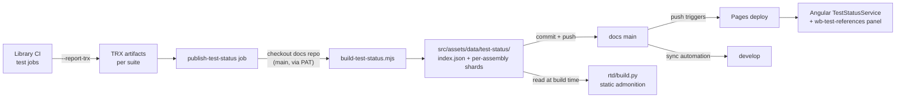

# Live Test-Status Pipeline

Doc pages declare the tests that verify them (`testReferences` frontmatter). This pipeline stitches **real CI results** into those references so the live site shows whether the referenced tests exist and pass — SpecFlow-style living documentation.

## Architecture



1. **Library CI** (`whizbang` repo): each test suite job passes `-ReportTrx` to `Run-Tests.ps1` and uploads `trx-<suite>` artifacts.
2. **publish-test-status job** (runs on `develop` pushes only, after all suites): downloads the TRX artifacts, checks out this repo's `main`, runs `src/scripts/build-test-status.mjs`, and pushes the regenerated `src/assets/data/test-status/` files.
3. **This repo**: the data commit triggers the Pages deploy; the main→develop sync automation keeps develop aligned. ReadTheDocs picks the data up at its next build and injects a static "Verified by tests" admonition per page.

## Data shapes

`src/assets/data/test-status/index.json`:

```json
{
  "run": { "runId": "123", "sha": "abc123", "branch": "develop", "libraryVersion": "0.9.4", "completedAt": "2026-07-16T20:00:00Z" },
  "total": { "passed": 8100, "failed": 2, "skipped": 40 },
  "suites": { "unit": { "passed": 5800, "failed": 0, "skipped": 12 } },
  "assemblies": { "Whizbang.Core.Tests": { "file": "Whizbang.Core.Tests.json", "passed": 5800, "failed": 0, "skipped": 12 } }
}
```

Per-assembly shard (`Whizbang.Core.Tests.json`) — keys use the **code-tests-map identity** `ShortClassName.MethodNameAsync`:

```json
{ "DispatcherTests.Dispatch_SendsMessageToCorrectReceptorAsync": { "o": "passed", "d": 12, "s": "unit" } }
```

## Rendering

- **Angular**: `TestStatusService` loads `index.json` (graceful null when absent) and lazy-loads shards; `wb-test-references` renders per-class badges at the bottom of any page with `testReferences`, with a staleness warning when results are older than 7 days (which also signals a dead token).
- **RTD**: static — `rtd/build.py` injects a `!!! success "Verified by tests"` admonition naming the referenced classes and the CI run.

## Setup (one-time)

The library repo needs a secret so CI can push data commits here:

1. Create a **fine-grained PAT**: repository access = `whizbang-lib/whizbang-lib.github.io` only, permission = **Contents: read/write**. Set a ≥6-month expiry and calendar the renewal — the staleness banner is the runtime symptom of an expired token.
2. Add it as `DOCS_REPO_PUSH_TOKEN` in the **whizbang** repo's Actions secrets.
3. The publish job no-ops gracefully when the secret is absent, so forks and PRs are unaffected.

## Failure modes

| Symptom | Cause |
|---|---|
| Panel shows "no status" on every page | `index.json` missing — pipeline never ran, or first publish pending |
| Staleness banner (>7 days) | expired/revoked PAT, or the publish job is failing — check the library repo's Actions |
| A class shows "no status" while others work | class renamed, or its suite's TRX artifact wasn't produced — re-check `-ReportTrx` on that suite's workflow |
