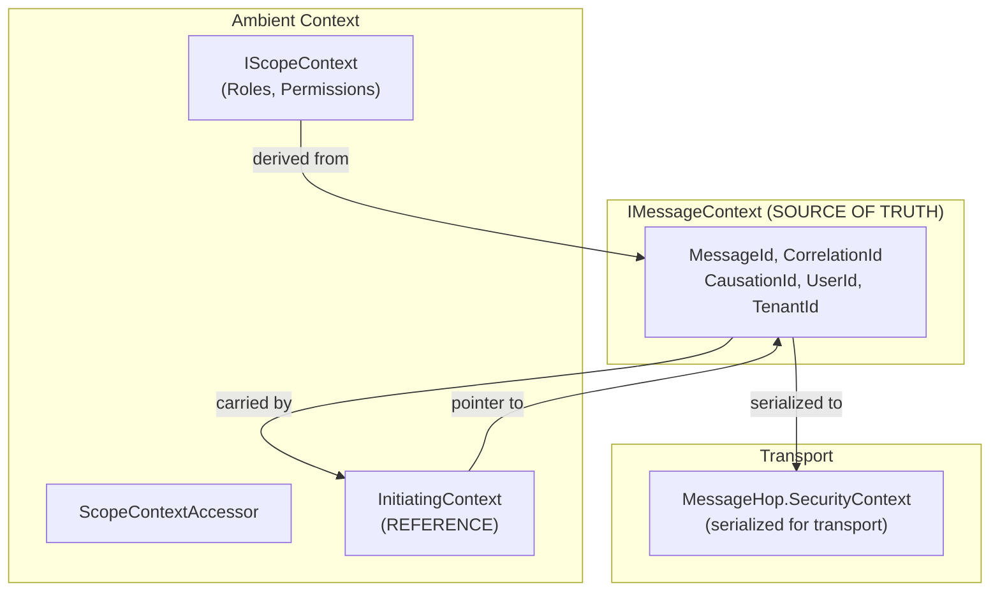
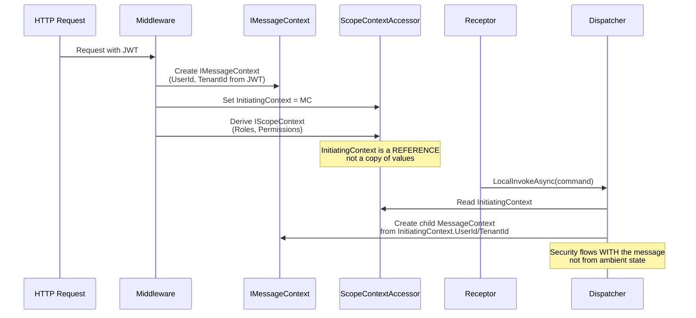
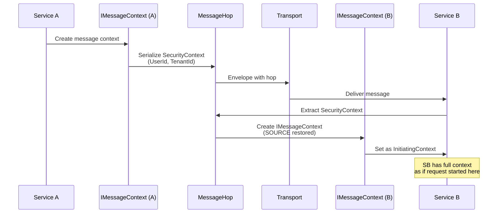
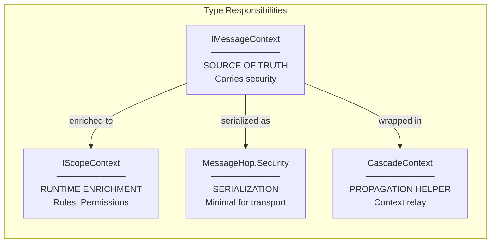

# Cascade Context

**CascadeContext** provides unified context propagation for message flows in Whizbang. It encapsulates the essential data that should cascade from parent to child messages: **CorrelationId**, **CausationId**, and **SecurityContext**.

---

## IMessageContext is Source of Truth

:::new
The **InitiatingContext** pattern establishes IMessageContext as the single source of truth for security context. This is the core architectural principle.
:::

In event-sourced systems, **messages are the source of truth**. The `IMessageContext` that initiates a scope carries the authoritative security information (UserId, TenantId). Rather than copying these values into ambient state, Whizbang stores a **reference** to the initiating message context.



### Why This Matters

| Problem | Solution |
|---------|----------|
| Security context lost when AsyncLocal scope ends | InitiatingContext carries a reference, not a copy |
| Different code paths read from different sources | Single source of truth in IMessageContext |
| Debugging is difficult with copied values | Full message context accessible for inspection |

### The InitiatingContext Property

The `IScopeContextAccessor` now exposes `InitiatingContext`:

```csharp
public interface IScopeContextAccessor {
    // The message that initiated this scope - SOURCE OF TRUTH
    IMessageContext? InitiatingContext { get; set; }

    // Rich authorization context (derived, not duplicated)
    IScopeContext? Current { get; set; }
}
```

When `MessageContext.New()` is called, it prioritizes InitiatingContext:

```csharp
// Priority 1: InitiatingContext (the IMessageContext that started this scope)
var initiatingContext = ScopeContextAccessor.CurrentInitiatingContext;
if (initiatingContext is not null) {
    userId = initiatingContext.UserId;      // Direct from source
    tenantId = initiatingContext.TenantId;  // Direct from source
}
// Priority 2: Fallback to CurrentContext.Scope (backward compatibility)
```

---

## Context Flow Diagram

This sequence shows how IMessageContext flows through the system:



---

## Transport Round-Trip

When messages cross service boundaries, security is serialized in MessageHop and restored on the other side:



---

## Type Responsibilities

Each type has a specific role in context propagation:



## The Problem (Solved)

Previously, when messages cascaded through handlers and lifecycle stages, context could be lost:

```
HTTP Request (UserId: "user-123")
    ↓
CreateOrderReceptor
    ↓
OrderCreated Event
    ↓
PostPerspectiveInline Handler
    ↓
LocalInvokeAsync(SendEmailCommand)  ← UserId was lost here!
```

**Root Cause**: `LocalInvokeAsync` read security from ambient `AsyncLocal` state, which could be stale when the original scope ended.

**Solution**: The **InitiatingContext** pattern ensures security is read from the message context reference, not ambient state. `MessageContext.New()` now prioritizes `InitiatingContext` as the source of truth.

## The Solution: CascadeContext

**CascadeContext** is a sealed record that captures context to propagate:

```csharp
public sealed record CascadeContext {
    public required CorrelationId CorrelationId { get; init; }
    public required MessageId CausationId { get; init; }
    public SecurityContext? SecurityContext { get; init; }
    public IReadOnlyDictionary<string, object>? Metadata { get; init; }
}
```

| Property | Purpose |
|----------|---------|
| `CorrelationId` | Links all messages in a workflow |
| `CausationId` | Parent message's MessageId |
| `SecurityContext` | UserId and TenantId for multi-tenant security |
| `Metadata` | Extensible key-value store for enrichers |

---

## Usage

### Creating CascadeContext from an Envelope

Use `CascadeContextFactory` to extract context from incoming messages:

```csharp
public class MyLifecycleHandler : IPostPerspectiveInlineHandler<OrderCreated> {
    private readonly IDispatcher _dispatcher;
    private readonly CascadeContextFactory _cascadeContextFactory;

    public async ValueTask HandleAsync(
        MessageEnvelope<OrderCreated> envelope,
        CancellationToken ct = default) {

        // Extract cascade context from envelope
        var cascade = _cascadeContextFactory.FromEnvelope(envelope);

        // Create MessageContext with proper security propagation
        var context = MessageContext.Create(cascade);

        // Now LocalInvokeAsync has correct UserId/TenantId
        await _dispatcher.LocalInvokeAsync<IDispatchResult>(
            new SendEmailCommand(envelope.Payload.OrderId),
            context
        );
    }
}
```

### Creating a Root CascadeContext

For entry points without a parent message:

```csharp
// From ambient security (reads from ScopeContextAccessor)
var cascade = cascadeContextFactory.NewRoot();
var context = MessageContext.Create(cascade);

// Or directly using static method
var cascade = CascadeContext.NewRootWithAmbientSecurity();
```

### Creating from IMessageContext

When you have an existing message context:

```csharp
var cascade = cascadeContextFactory.FromMessageContext(existingContext);
```

---

## CascadeContextFactory

The factory provides consistent context creation with enricher support:

```csharp
public sealed class CascadeContextFactory {
    // Create from incoming message envelope
    public CascadeContext FromEnvelope(IMessageEnvelope envelope);

    // Create from existing message context
    public CascadeContext FromMessageContext(IMessageContext messageContext);

    // Create new root context with ambient security
    public CascadeContext NewRoot();
}
```

### Dependency Injection

Register as a singleton:

```csharp
services.AddSingleton<CascadeContextFactory>();
```

The factory is automatically available when using `AddWhizbangDispatcher()`.

---

## Enrichers

Extend cascade context with custom data using `ICascadeContextEnricher`:

```csharp
public interface ICascadeContextEnricher {
    CascadeContext Enrich(CascadeContext context, IMessageEnvelope? sourceEnvelope);
}
```

### Example: Feature Flag Enricher

```csharp
public class FeatureFlagEnricher : ICascadeContextEnricher {
    private readonly IFeatureManager _features;

    public FeatureFlagEnricher(IFeatureManager features) {
        _features = features;
    }

    public CascadeContext Enrich(CascadeContext context, IMessageEnvelope? envelope) {
        var flags = new Dictionary<string, bool> {
            ["NewCheckoutFlow"] = _features.IsEnabled("NewCheckoutFlow"),
            ["BetaFeatures"] = _features.IsEnabled("BetaFeatures")
        };

        return context.WithMetadata("featureFlags", flags);
    }
}
```

### Registering Enrichers

```csharp
services.AddSingleton<ICascadeContextEnricher, FeatureFlagEnricher>();
services.AddSingleton<ICascadeContextEnricher, TenantContextEnricher>();
```

Enrichers are invoked in registration order.

---

## Security Context Extraction

`CascadeContext.GetSecurityFromAmbient()` provides consistent security extraction:

```csharp
// Extract security from ambient AsyncLocal scope
var security = CascadeContext.GetSecurityFromAmbient();
// Returns null if:
// - No ambient context
// - Context is not ImmutableScopeContext
// - Propagation is disabled (ShouldPropagate = false)
```

This is used internally by:
- `CascadeContextFactory.NewRoot()`
- `CascadeContextFactory.FromEnvelope()` (as fallback)
- `SecurityContextEventStoreDecorator`
- `Dispatcher` security propagation

---

## Metadata

Add custom metadata to cascade context:

```csharp
// Single key-value
var enriched = context.WithMetadata("requestId", requestId);

// Multiple values
var enriched = context.WithMetadata(new Dictionary<string, object> {
    ["traceId"] = traceId,
    ["spanId"] = spanId
});
```

Metadata is immutable - `WithMetadata` returns a new instance.

---

## Integration with Dispatcher

The Dispatcher automatically uses `CascadeContextFactory` for methods without explicit context:

```csharp
// These methods use CascadeContextFactory.NewRoot() internally:
await dispatcher.LocalInvokeAsync<TResult>(message);
await dispatcher.SendAsync(message);

// For cascade scenarios, pass explicit context:
var cascade = cascadeContextFactory.FromEnvelope(envelope);
var context = MessageContext.Create(cascade);
await dispatcher.LocalInvokeAsync<TResult>(message, context);
```

---

## Entry Points

Different entry points create the initial IMessageContext differently:

| Entry Point | Who Creates IMessageContext? | Example |
|-------------|------------------------------|---------|
| **HTTP Request** | Middleware extracts from JWT | `CreateOrderEndpoint` |
| **Transport Message** | Worker extracts from envelope hop | `ReceptorInvoker` |
| **Scheduled Job** | Job runner creates with system identity | `DailyReportJob` |
| **Manual Dispatch** | Explicit `MessageContext.New()` | Background tasks |

### HTTP Request Entry Point

```csharp
// Middleware establishes InitiatingContext from JWT claims
public async Task InvokeAsync(HttpContext context, RequestDelegate next) {
    var messageContext = new MessageContext {
        MessageId = MessageId.New(),
        CorrelationId = CorrelationId.New(),
        CausationId = MessageId.New(),
        UserId = context.User.FindFirst("sub")?.Value,
        TenantId = context.User.FindFirst("tenant_id")?.Value
    };

    // Set as InitiatingContext - SOURCE OF TRUTH for this scope
    scopeContextAccessor.InitiatingContext = messageContext;
    messageContextAccessor.Current = messageContext;

    await next(context);
}
```

### Transport Message Entry Point

```csharp
// ReceptorInvoker automatically sets InitiatingContext from envelope
public async ValueTask InvokeAsync(IMessageEnvelope envelope, ...) {
    var securityContext = envelope.GetCurrentSecurityContext();
    var messageContext = new MessageContext {
        MessageId = envelope.MessageId,
        CorrelationId = envelope.GetCorrelationId() ?? CorrelationId.New(),
        CausationId = envelope.GetCausationId() ?? MessageId.New(),
        UserId = securityContext?.UserId,
        TenantId = securityContext?.TenantId
    };

    // CRITICAL: Set InitiatingContext BEFORE any processing
    scopeContextAccessor.InitiatingContext = messageContext;
    // ... receptor invocation
}
```

---

## Debugging with InitiatingContext

The InitiatingContext reference enables powerful debugging:

```csharp
// Access the full initiating message context
var initiating = scopeContextAccessor.InitiatingContext;
if (initiating is not null) {
    logger.LogDebug("Initiated by message {MessageId} from user {UserId}",
        initiating.MessageId,
        initiating.UserId);

    // Full tracing context available
    logger.LogDebug("Correlation: {CorrelationId}, Causation: {CausationId}",
        initiating.CorrelationId,
        initiating.CausationId);
}
```

### Troubleshooting Context Issues

| Symptom | Cause | Solution |
|---------|-------|----------|
| UserId is null in child messages | InitiatingContext not set | Ensure entry point sets `scopeContextAccessor.InitiatingContext` |
| UserId differs from request | Wrong context source used | Check that `MessageContext.New()` reads from InitiatingContext |
| Context lost after await | AsyncLocal scope ended | InitiatingContext pattern handles this automatically |
| Different values in logs vs message | Reading from IScopeContext.Scope instead | Use InitiatingContext for source values |

---

## Best Practices

### DO ✅

- ✅ **Set InitiatingContext at entry points** (HTTP middleware, transport workers)
- ✅ **Let MessageContext.New() read from InitiatingContext** (automatic)
- ✅ Use `CascadeContextFactory.FromEnvelope()` in lifecycle handlers
- ✅ Pass explicit context to `LocalInvokeAsync` in cascade scenarios
- ✅ Register enrichers for cross-cutting concerns (feature flags, tenant context)
- ✅ Keep enrichers stateless and idempotent
- ✅ Use `WithMetadata()` for custom context data
- ✅ Use InitiatingContext for debugging and tracing

### DON'T ❌

- ❌ **Read UserId/TenantId from IScopeContext.Scope when InitiatingContext exists**
- ❌ **Copy values from IMessageContext to IScopeContext** (use reference instead)
- ❌ Rely on ambient context in PostPerspectiveInline handlers
- ❌ Create CascadeContext manually (use factory)
- ❌ Mutate metadata dictionaries (use `WithMetadata()`)
- ❌ Throw exceptions in enrichers (log and return original context)

---

## Further Reading

**Related Concepts**:
- [Message Context](../fundamentals/messages/message-context.md) - MessageId, CorrelationId, CausationId
- [Security Context Propagation](../fundamentals/security/security-context-propagation.md) - Multi-tenant security
- [Observability](../fundamentals/persistence/observability.md) - MessageEnvelope and hops
- [Scope Context](scope-context.md) - IScopeContext and authorization

**API Reference**:
- [CascadeContext](../../api/cascade-context.md)
- [CascadeContextFactory](../../api/cascade-context-factory.md)
- [ICascadeContextEnricher](../../api/cascade-context-enricher.md)
- [IScopeContextAccessor](../../api/scope-context-accessor.md)

**Test Coverage**:
- `MessageContextInitiatingContextTests.cs` - InitiatingContext prioritization tests
- `SecurityContextHelperInitiatingContextTests.cs` - Context establishment tests
- `ReceptorInvokerInitiatingContextTests.cs` - Transport entry point tests
- `CascadeContextTests.cs` - Core cascade context behavior

---

*Draft - Unified Context Propagation with InitiatingContext | Last Updated: 2026-03-07*
