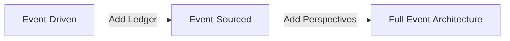
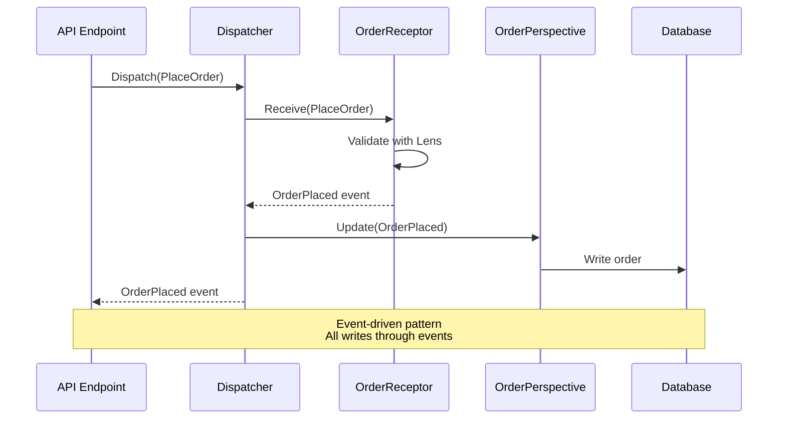
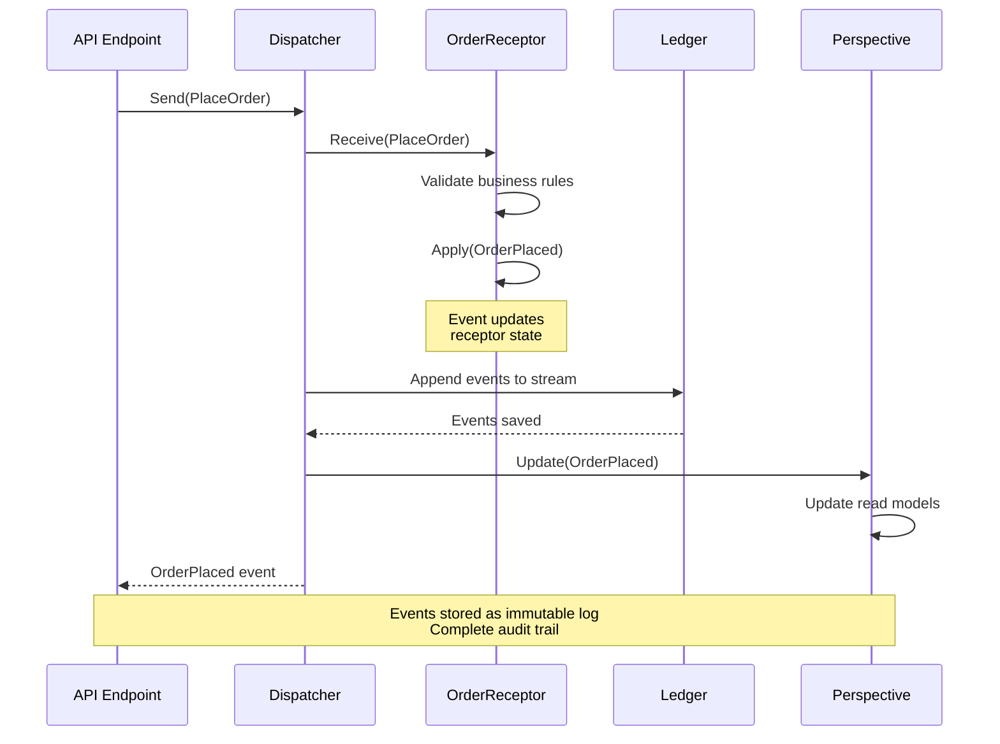
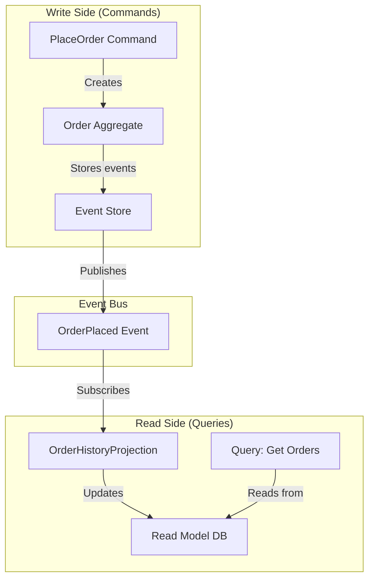

# Getting Started

**This is a hands-on tutorial** that walks you through building your first Whizbang application, starting with a simple in-process mediator and progressively adding event sourcing, projections, and distributed messaging.

**What you'll build:**

1. ✅ **Event-Driven Architecture** - Receptors, Perspectives, and Lenses with `Whizbang.Core`
2. ✅ **Event Sourcing** - Stateful receptors and ledger with `Whizbang.EventSourcing`
3. ✅ **Multiple Perspectives** - Different views of the same events for efficient queries



**Companion guides:**

- 📦 [**Package Structure**](./package-structure.md) - Reference guide for all NuGet packages, ORMs, and message broker adapters
- 🧠 [**Philosophy**](./philosophy.md) - Understand Whizbang's design principles and architectural decisions
- 📚 [**Core Concepts**](./core-concepts.md) - Deep dive into commands, events, aggregates, and projections

## Prerequisites

- **.NET 8.0 SDK** or later
- **C# 12** or later
- **Your favorite IDE** (Visual Studio, Rider, VS Code)

## Installation

> 📦 **Want to understand all available packages?** See the [**Package Structure Reference**](./package-structure.md) for a complete guide to Whizbang's NuGet packages, ORM integrations, and message broker adapters.

### Step 1: Create a New Project

```bash
dotnet new webapi -n MyApp
cd MyApp
```

### Step 2: Install Whizbang

For this tutorial, we'll start with just the core package:

```bash
dotnet add package Whizbang.Core
```

**What is Whizbang.Core?** The foundation for event-driven architecture - includes dispatcher, receptors, perspectives, and lenses. Perfect for learning event-driven patterns where all writes flow through events. We'll add event sourcing later in this tutorial.

---

## Your First Command and Receptor

Let's build a simple order system with event-driven architecture.



### Step 1: Define a Command

Create `Commands/PlaceOrder.cs`:

```csharp{
title: "PlaceOrder Command"
description: "Command to place a new order"
framework: "NET8"
category: "Getting Started"
difficulty: "BEGINNER"
tags: ["Commands", "CQRS"]
filename: "Commands/PlaceOrder.cs"
usingStatements: ["System"]
showLineNumbers: true
}
using System;

namespace MyApp.Commands;

public record PlaceOrder(
    Guid CustomerId,
    List<OrderItem> Items
);

public record OrderItem(
    Guid ProductId,
    int Quantity,
    decimal Price
);
```

### Step 2: Create a Receptor

Create `Receptors/PlaceOrderReceptor.cs`:

```csharp{
title: "PlaceOrder Receptor"
description: "Receptor that processes PlaceOrder commands"
framework: "NET8"
category: "Getting Started"
difficulty: "BEGINNER"
tags: ["Receptors", "Event-Driven", "Commands"]
filename: "Receptors/PlaceOrderReceptor.cs"
usingStatements: ["System", "Whizbang", "MyApp.Commands", "MyApp.Events"]
showLineNumbers: true
}
using System;
using Whizbang;
using MyApp.Commands;
using MyApp.Events;

namespace MyApp.Receptors;

public class PlaceOrderReceptor : IReceptor<PlaceOrder> {
    public OrderPlaced Receive(PlaceOrder command) {
        // Validate
        if (command.Items.Count == 0) {
            throw new InvalidOperationException("Order must have at least one item");
        }

        // Create event
        var orderId = Guid.NewGuid();
        var total = command.Items.Sum(i => i.Price * i.Quantity);

        // Return event - perspective will handle persistence
        return new OrderPlaced(
            orderId,
            command.CustomerId,
            DateTimeOffset.UtcNow,
            command.Items,
            total
        );
    }
}
```

### Step 3: Create a Perspective

Create `Perspectives/OrderPerspective.cs`:

```csharp{
title: "Order Perspective"
description: "Perspective that handles OrderPlaced events"
framework: "NET8"
category: "Getting Started"
difficulty: "BEGINNER"
tags: ["Perspectives", "Event-Driven", "Database"]
filename: "Perspectives/OrderPerspective.cs"
usingStatements: ["System", "System.Threading.Tasks", "Whizbang", "MyApp.Events"]
showLineNumbers: true
}
using System;
using System.Threading.Tasks;
using Whizbang;
using MyApp.Events;

namespace MyApp.Perspectives;

public class OrderPerspective : IPerspectiveOf<OrderPlaced> {
    private readonly IOrderDatabase db;
    
    public OrderPerspective(IOrderDatabase db) {
        _db = db;
    }
    
    public async Task Update(OrderPlaced @event) {
        // Perspective handles all writes
        await _db.Orders.Add(new Order {
            Id = @event.OrderId,
            CustomerId = @event.CustomerId,
            PlacedAt = @event.PlacedAt,
            Total = @event.Total,
            Status = "Placed"
        });
        await _db.SaveChanges();
    }
}
```

### Step 4: Configure Whizbang

Update `Program.cs`:

```csharp{
title: "Whizbang Configuration"
description: "Configure Whizbang dispatcher in ASP.NET Core"
framework: "NET8"
category: "Getting Started"
difficulty: "BEGINNER"
tags: ["Configuration", "Setup", "ASP.NET Core"]
filename: "Program.cs"
usingStatements: ["Whizbang", "Microsoft.Extensions.DependencyInjection"]
showLineNumbers: true
}
using Whizbang;

var builder = WebApplication.CreateBuilder(args);

// Add Whizbang dispatcher
builder.Services.AddWhizbang(options => {
    // Scan this assembly for receptors and perspectives
    options.ScanAssembly(typeof(Program).Assembly);
});

var app = builder.Build();

app.MapPost("/orders", async (PlaceOrder command, IDispatcher dispatcher) => {
    var @event = await dispatcher.Send(command);
    return Results.Ok(new { OrderId = @event.OrderId, Total = @event.Total });
});

app.Run();
```

### Step 5: Run the Application

```bash
dotnet run
```

Test with curl:

```bash
curl -X POST http://localhost:5000/orders \
  -H "Content-Type: application/json" \
  -d '{
    "customerId": "123e4567-e89b-12d3-a456-426614174000",
    "items": [
      { "productId": "prod-1", "quantity": 2, "price": 19.99 }
    ]
  }'
```

**Congratulations!** You've created your first Whizbang event-driven application with receptors and perspectives. All writes flow through events, making the transition to event sourcing seamless!

---

## Adding Event Sourcing

Let's upgrade to event sourcing with stateful receptors and a ledger for complete audit trail.



> 📦 **Learn more:** See [Whizbang.EventSourcing](./package-structure.md#whizbangeventsourcing) in the Package Structure guide for ORM options, database support, and advanced configuration.

### Step 1: Install Event Sourcing Package

```bash
dotnet add package Whizbang.EventSourcing
dotnet add package Whizbang.Postgres  # Or Whizbang.SqlServer, Whizbang.EntityFramework, etc.
```

### Step 2: Define Events

Create `Events/OrderEvents.cs`:

```csharp{
title: "Order Domain Events"
description: "Events representing order lifecycle state changes"
framework: "NET8"
category: "Event Sourcing"
difficulty: "BEGINNER"
tags: ["Events", "Event Sourcing", "Domain Events"]
filename: "Events/OrderEvents.cs"
usingStatements: ["System", "Whizbang"]
showLineNumbers: true
}
using System;
using Whizbang;

namespace MyApp.Events;

[OwnedBy("Orders")]  // This event comes from the Orders domain
public record OrderPlaced(
    Guid OrderId,
    Guid CustomerId,
    DateTimeOffset PlacedAt,
    List<OrderItem> Items,
    decimal Total
);

[OwnedBy("Orders")]
public record OrderShipped(
    Guid OrderId,
    DateTimeOffset ShippedAt,
    string TrackingNumber
);
```

### Step 3: Create a Stateful Receptor

Create `Receptors/OrderReceptor.cs`:

```csharp{
title: "Event-Sourced Order Receptor"
description: "Stateful receptor for event-sourced orders"
framework: "NET8"
category: "Event Sourcing"
difficulty: "INTERMEDIATE"
tags: ["Receptors", "Event Sourcing", "Stateful"]
filename: "Receptors/OrderReceptor.cs"
usingStatements: ["System", "Whizbang", "MyApp.Commands", "MyApp.Events"]
showLineNumbers: true
}
using System;
using Whizbang;
using MyApp.Commands;
using MyApp.Events;

namespace MyApp.Receptors;

[EventSourced]
public class OrderReceptor : 
    IReceptor<PlaceOrder>,
    IReceptor<ShipOrder> {
    
    private Guid id;
    private Guid customerId;
    private OrderStatus status;
    private List<OrderItem> items = new();
    private decimal total;

    // Command handler for new orders
    public OrderPlaced Receive(PlaceOrder command) {
        if (id != Guid.Empty) {
            throw new InvalidOperationException("Order already exists");
        }
        
        if (command.Items.Count == 0) {
            throw new InvalidOperationException("Order must have items");
        }

        var orderTotal = command.Items.Sum(i => i.Price * i.Quantity);

        return new OrderPlaced(
            Guid.NewGuid(),
            command.CustomerId,
            DateTimeOffset.UtcNow,
            command.Items,
            orderTotal
        );
    }
    
    // Command handler for shipping
    public OrderShipped Receive(ShipOrder command) {
        if (status != OrderStatus.Placed) {
            throw new InvalidOperationException("Only placed orders can be shipped");
        }

        return new OrderShipped(id, DateTimeOffset.UtcNow, command.TrackingNumber);
    }

    // Event handler - updates internal state
    public void Absorb(OrderPlaced @event) {
        id = @event.OrderId;
        customerId = @event.CustomerId;
        status = OrderStatus.Placed;
        items = @event.Items.ToList();
        total = @event.Total;
    }

    // Event handler - updates internal state
    public void Absorb(OrderShipped @event) {
        status = OrderStatus.Shipped;
    }
}

public enum OrderStatus {
    Placed,
    Shipped,
    Delivered,
    Cancelled
}

public record ShipOrder(Guid OrderId, string TrackingNumber);
```

### Step 4: Add Event Definitions

Update `Events/OrderEvents.cs` with shipping event:

```csharp{
title: "Complete Order Domain Events"
description: "Events representing complete order lifecycle"
framework: "NET8"
category: "Event Sourcing"
difficulty: "BEGINNER"
tags: ["Events", "Event Sourcing", "Domain Events"]
filename: "Events/OrderEvents.cs"
usingStatements: ["System", "Whizbang"]
showLineNumbers: true
}
using System;
using Whizbang;

namespace MyApp.Events;

[OwnedBy("Orders")]
public record OrderPlaced(
    Guid OrderId,
    Guid CustomerId,
    DateTimeOffset PlacedAt,
    List<OrderItem> Items,
    decimal Total
);

[OwnedBy("Orders")]
public record OrderShipped(
    Guid OrderId,
    DateTimeOffset ShippedAt,
    string TrackingNumber
);
```

### Step 5: Configure Event Sourcing

Update `Program.cs`:

```csharp{
title: "Event Sourcing Configuration"
description: "Configure Whizbang dispatcher with event sourcing and ledger"
framework: "NET8"
category: "Event Sourcing"
difficulty: "INTERMEDIATE"
tags: ["Configuration", "Event Sourcing", "Postgres"]
filename: "Program.cs"
usingStatements: ["Whizbang", "Microsoft.Extensions.DependencyInjection"]
showLineNumbers: true
}
using Whizbang;

var builder = WebApplication.CreateBuilder(args);

builder.Services.AddWhizbang(dispatcher => {
    dispatcher.RegisterReceptorsFromAssembly(typeof(Program).Assembly);
    dispatcher.RegisterPerspectivesFromAssembly(typeof(Program).Assembly);

    // Enable event sourcing with ledger
    dispatcher.UseEventSourcing(es => {
        es.UseLedger(ledger => {
            ledger.UsePostgres(builder.Configuration.GetConnectionString("EventStore"));
        });
    });
});

var app = builder.Build();

app.MapPost("/orders", async (PlaceOrder command, IDispatcher dispatcher) => {
    var @event = await dispatcher.Send(command);
    return Results.Ok(new { OrderId = @event.OrderId, Total = @event.Total });
});

app.Run();
```

Add connection string to `appsettings.json`:

```json
{
  "ConnectionStrings": {
    "EventStore": "Host=localhost;Database=myapp;Username=user;Password=pass"
  }
}
```

**Now you have full event sourcing!** Receptors maintain state from events stored in the ledger, providing a complete audit trail and the ability to replay state from any point in time.

---

## Adding Multiple Perspectives (Read Models)

Let's add additional perspectives to maintain different views of order data for efficient queries.



> 📦 **Learn more:** See [Whizbang.Perspectives](./package-structure.md#whizbangperspectives) in the Package Structure guide for advanced perspective patterns and database integration.

### Step 1: Create Order History Lens

Create `Lenses/IOrderLens.cs`:

```csharp{
title: "Order Lens Interface"
description: "Read-only lens for querying orders"
framework: "NET8"
category: "Lenses"
difficulty: "BEGINNER"
tags: ["Lenses", "Queries", "Read-Only"]
filename: "Lenses/IOrderLens.cs"
usingStatements: ["System", "System.Linq.Expressions"]
showLineNumbers: true
}
using System;
using System.Linq.Expressions;

namespace MyApp.Lenses;

public interface IOrderLens {
    OrderSummary Focus(Guid orderId);
    IEnumerable<OrderSummary> ViewByCustomer(Guid customerId);
    IEnumerable<OrderSummary> View(Expression<Func<OrderSummary, bool>> filter);
    bool Exists(Guid orderId);
}

public class OrderSummary {
    public Guid OrderId { get; set; }
    public Guid CustomerId { get; set; }
    public DateTimeOffset PlacedAt { get; set; }
    public DateTimeOffset? ShippedAt { get; set; }
    public decimal Total { get; set; }
    public string Status { get; set; }
}
```

### Step 2: Create Order History Perspective

Create `Perspectives/OrderHistoryPerspective.cs`:

```csharp{
title: "Order History Perspective"
description: "Perspective that maintains order history for queries"
framework: "NET8"
category: "Perspectives"
difficulty: "INTERMEDIATE"
tags: ["Perspectives", "Read Models", "Multiple Views"]
filename: "Perspectives/OrderHistoryPerspective.cs"
usingStatements: ["System", "System.Threading.Tasks", "Whizbang", "MyApp.Events", "MyApp.Lenses"]
showLineNumbers: true
}
using System;
using System.Threading.Tasks;
using Whizbang;
using MyApp.Events;
using MyApp.Lenses;

namespace MyApp.Perspectives;

public class OrderHistoryPerspective : 
    IPerspectiveOf<OrderPlaced>,
    IPerspectiveOf<OrderShipped> {
    
    private readonly IOrderHistoryDatabase db;

    public OrderHistoryPerspective(IOrderHistoryDatabase db) {
        _db = db;
    }

    public async Task Update(OrderPlaced @event) {
        await _db.OrderHistory.Add(new OrderSummary {
            OrderId = @event.OrderId,
            CustomerId = @event.CustomerId,
            PlacedAt = @event.PlacedAt,
            Total = @event.Total,
            Status = "Placed"
        });
        await _db.SaveChanges();
    }

    public async Task Update(OrderShipped @event) {
        var order = await _db.OrderHistory.Get(@event.OrderId);
        order.ShippedAt = @event.ShippedAt;
        order.Status = "Shipped";
        await _db.SaveChanges();
    }
}
```

### Step 3: Implement Order Lens

Create `Lenses/OrderLens.cs`:

```csharp{
title: "Order Lens Implementation"
description: "Lens implementation for querying order history"
framework: "NET8"
category: "Lenses"
difficulty: "INTERMEDIATE"
tags: ["Lenses", "Implementation", "Database"]
filename: "Lenses/OrderLens.cs"
usingStatements: ["System", "System.Linq.Expressions", "MyApp.Lenses"]
showLineNumbers: true
}
using System;
using System.Linq.Expressions;
using MyApp.Lenses;

namespace MyApp.Lenses;

public class OrderLens : IOrderLens {
    private readonly IOrderHistoryDatabase db;

    public OrderLens(IOrderHistoryDatabase db) {
        _db = db;
    }

    public OrderSummary Focus(Guid orderId) {
        return _db.OrderHistory.FirstOrDefault(o => o.OrderId == orderId);
    }

    public IEnumerable<OrderSummary> ViewByCustomer(Guid customerId) {
        return _db.OrderHistory
            .Where(o => o.CustomerId == customerId)
            .OrderByDescending(o => o.PlacedAt);
    }

    public IEnumerable<OrderSummary> View(Expression<Func<OrderSummary, bool>> filter) {
        return _db.OrderHistory.Where(filter);
    }

    public bool Exists(Guid orderId) {
        return _db.OrderHistory.Any(o => o.OrderId == orderId);
    }
}
```

### Step 4: Configure Multiple Perspectives

Update `Program.cs`:

```csharp{
title: "Multiple Perspectives Configuration"
description: "Configure multiple perspectives in Whizbang dispatcher"
framework: "NET8"
category: "Perspectives"
difficulty: "INTERMEDIATE"
tags: ["Configuration", "Perspectives", "Multiple Views"]
filename: "Program.cs"
usingStatements: ["Whizbang", "Microsoft.Extensions.DependencyInjection", "MyApp.Lenses"]
showLineNumbers: true
}
using Whizbang;
using MyApp.Lenses;

builder.Services.AddWhizbang(dispatcher => {
    dispatcher.RegisterReceptorsFromAssembly(typeof(Program).Assembly);
    dispatcher.RegisterPerspectivesFromAssembly(typeof(Program).Assembly);
    
    // Register lenses
    dispatcher.RegisterLensesFromAssembly(typeof(Program).Assembly);
    
    dispatcher.UseEventSourcing(es => {
        es.UseLedger(ledger => {
            ledger.UsePostgres(connectionString);
        });
    });
});

// Register lens implementations
builder.Services.AddScoped<IOrderLens, OrderLens>();
```

### Step 5: Query via Lens

Add query endpoint:

```csharp{
title: "Query Order History via Lens"
description: "Query endpoint using order lens for read operations"
framework: "NET8"
category: "Lenses"
difficulty: "BEGINNER"
tags: ["Queries", "Lenses", "API"]
filename: "Program.cs"
usingStatements: ["Microsoft.AspNetCore.Builder", "System", "MyApp.Lenses"]
showLineNumbers: true
}
app.MapGet("/customers/{customerId}/orders", (
    Guid customerId,
    IOrderLens lens
) => {
    var orders = lens.ViewByCustomer(customerId);
    return Results.Ok(orders);
});

app.MapGet("/orders/{orderId}", (
    Guid orderId,
    IOrderLens lens
) => {
    var order = lens.Focus(orderId);
    return order != null ? Results.Ok(order) : Results.NotFound();
});
```

**Now you have complete CQRS!** Commands go to receptors (decision-making), events flow to perspectives (write side), and queries use lenses (read side). Multiple perspectives can maintain different views of the same events.

---

## Next Steps

You've built a complete Event-Driven and Event-Sourced application with Whizbang! Here's what to explore next:

- [**Philosophy**](./philosophy.md) - Understand Whizbang's design principles and architectural philosophy
- [**Core Concepts**](./core-concepts.md) - Deep dive into receptors, perspectives, lenses, and events
- [**Package Structure**](./package-structure.md) - Learn about all available packages
- [**Testing**](./testing.md) - Test your event-driven and event-sourced applications
- [**Distributed Messaging**](./distributed-messaging.md) - Scale to microservices with relays and message brokers
- [**Sagas**](./sagas.md) - Coordinate long-running processes across receptors
- [**Observability**](./observability.md) - Monitor your event-driven systems
