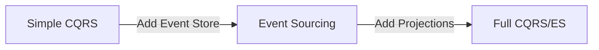
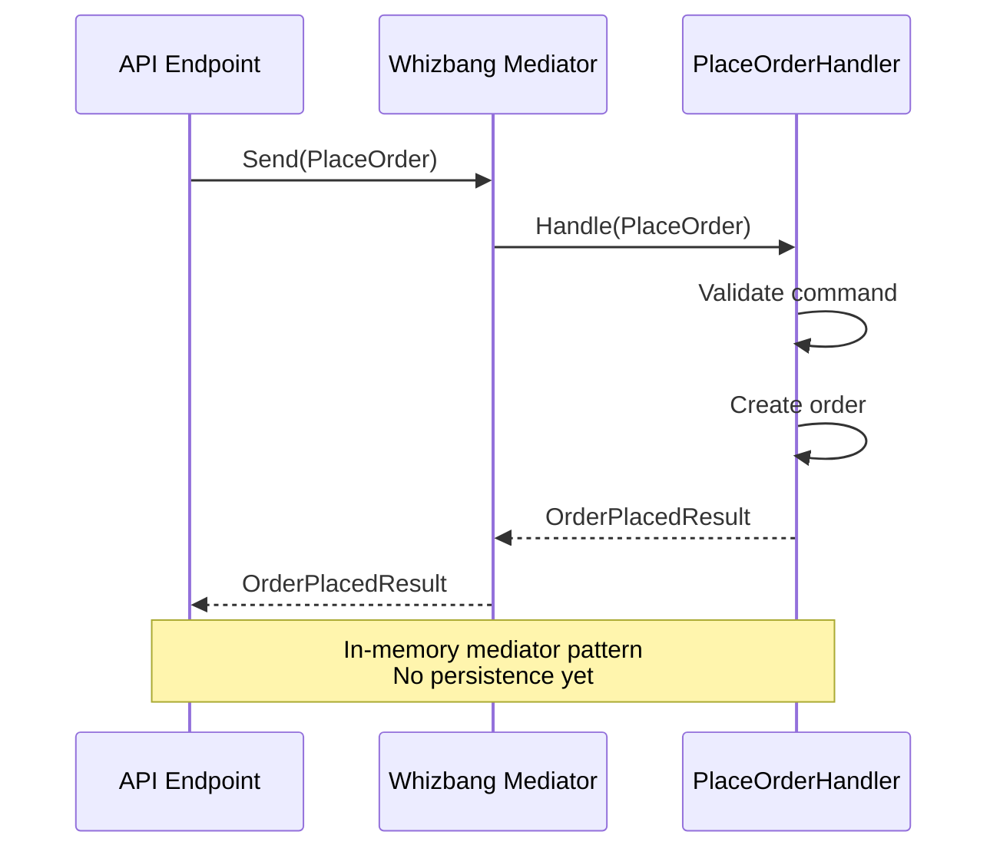
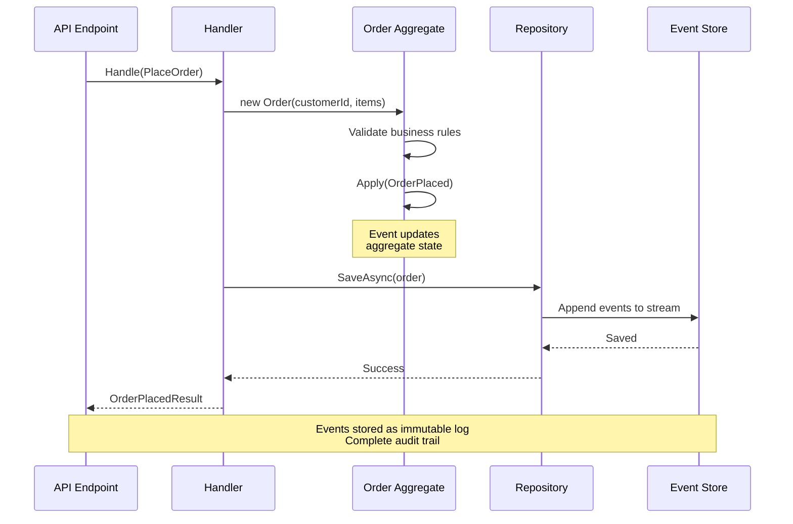
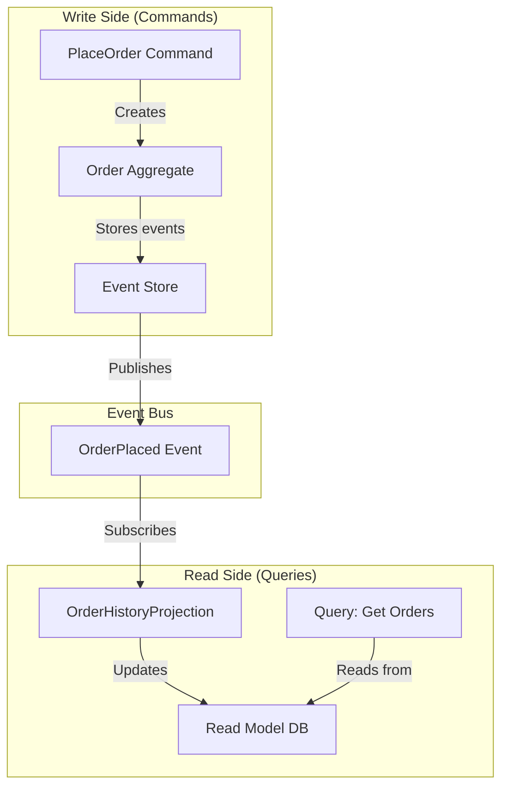

# Getting Started

**This is a hands-on tutorial** that walks you through building your first Whizbang application, starting with a simple in-process mediator and progressively adding event sourcing, projections, and distributed messaging.

**What you'll build:**

1. ✅ **Simple CQRS** - Command handlers with `Whizbang.Core` (in-process mediator)
2. ✅ **Event Sourcing** - Aggregates and event streams with `Whizbang.EventSourcing`
3. ✅ **Read Models** - Projections for efficient queries with `Whizbang.Projections`



**Companion guides:**

- 📦 [**Package Structure**](./package-structure.md) - Reference guide for all NuGet packages, ORMs, and message broker adapters
- 🧠 [**Philosophy**](./philosophy.md) - Understand Whizbang's design principles and architectural decisions
- 📚 [**Core Concepts**](./core-concepts.md) - Deep dive into commands, events, aggregates, and projections

## Prerequisites

- **.NET 8.0 SDK** or later
- **C# 12** or later
- **Your favorite IDE** (Visual Studio, Rider, VS Code)

## Installation

> 📦 **Want to understand all available packages?** See the [**Package Structure Reference**](./package-structure.md) for a complete guide to Whizbang's NuGet packages, ORM integrations, and message broker adapters.

### Step 1: Create a New Project

```bash
dotnet new webapi -n MyApp
cd MyApp
```

### Step 2: Install Whizbang

For this tutorial, we'll start with just the core package:

```bash
dotnet add package Whizbang.Core
```

**What is Whizbang.Core?** The minimal foundation - just an in-process mediator with handler routing. Perfect for learning CQRS basics. We'll add event sourcing and projections later in this tutorial.

---

## Your First Command and Handler

Let's build a simple order system with CQRS (Command Query Responsibility Segregation).



### Step 1: Define a Command

Create `Commands/PlaceOrder.cs`:

```csharp{
title: "PlaceOrder Command"
description: "Command to place a new order"
framework: "NET8"
category: "Getting Started"
difficulty: "BEGINNER"
tags: ["Commands", "CQRS"]
filename: "Commands/PlaceOrder.cs"
usingStatements: ["System"]
showLineNumbers: true
}
using System;

namespace MyApp.Commands;

public record PlaceOrder(
    Guid CustomerId,
    List<OrderItem> Items
);

public record OrderItem(
    Guid ProductId,
    int Quantity,
    decimal Price
);
```

### Step 2: Create a Handler

Create `Handlers/PlaceOrderHandler.cs`:

```csharp{
title: "PlaceOrder Handler"
description: "Handler that processes PlaceOrder commands"
framework: "NET8"
category: "Getting Started"
difficulty: "BEGINNER"
tags: ["Handlers", "CQRS", "Commands"]
filename: "Handlers/PlaceOrderHandler.cs"
usingStatements: ["System", "System.Threading.Tasks", "MyApp.Commands"]
showLineNumbers: true
}
using System;
using System.Threading.Tasks;
using MyApp.Commands;

namespace MyApp.Handlers;

public class PlaceOrderHandler {
    public async Task<OrderPlacedResult> Handle(PlaceOrder command) {
        // Validate
        if (command.Items.Count == 0) {
            throw new InvalidOperationException("Order must have at least one item");
        }

        // Create order
        var orderId = Guid.NewGuid();
        var total = command.Items.Sum(i => i.Price * i.Quantity);

        // TODO: Persist to database

        // Return result
        return new OrderPlacedResult(orderId, total);
    }
}

public record OrderPlacedResult(Guid OrderId, decimal Total);
```

### Step 3: Configure Whizbang

Update `Program.cs`:

```csharp{
title: "Whizbang Configuration"
description: "Configure Whizbang in ASP.NET Core"
framework: "NET8"
category: "Getting Started"
difficulty: "BEGINNER"
tags: ["Configuration", "Setup", "ASP.NET Core"]
filename: "Program.cs"
usingStatements: ["Whizbang", "Microsoft.Extensions.DependencyInjection"]
showLineNumbers: true
}
using Whizbang;

var builder = WebApplication.CreateBuilder(args);

// Add Whizbang
builder.Services.AddWhizbang(options => {
    // Scan this assembly for handlers
    options.ScanAssembly(typeof(Program).Assembly);
});

var app = builder.Build();

app.MapPost("/orders", async (PlaceOrder command, IWhizbang whizbang) => {
    var result = await whizbang.Send(command);
    return Results.Ok(result);
});

app.Run();
```

### Step 4: Run the Application

```bash
dotnet run
```

Test with curl:

```bash
curl -X POST http://localhost:5000/orders \
  -H "Content-Type: application/json" \
  -d '{
    "customerId": "123e4567-e89b-12d3-a456-426614174000",
    "items": [
      { "productId": "prod-1", "quantity": 2, "price": 19.99 }
    ]
  }'
```

**Congratulations!** You've created your first Whizbang command handler. Right now it's just an in-process mediator, but we'll add event sourcing next.

---

## Adding Event Sourcing

Let's upgrade to event sourcing so we have a complete audit trail of all orders.



> 📦 **Learn more:** See [Whizbang.EventSourcing](./package-structure.md#whizbangeventsourcing) in the Package Structure guide for ORM options, database support, and advanced configuration.

### Step 1: Install Event Sourcing Package

```bash
dotnet add package Whizbang.EventSourcing
dotnet add package Whizbang.Postgres  # Or Whizbang.SqlServer, Whizbang.EntityFramework, etc.
```

### Step 2: Define Events

Create `Events/OrderEvents.cs`:

```csharp{
title: "Order Domain Events"
description: "Events representing order lifecycle state changes"
framework: "NET8"
category: "Event Sourcing"
difficulty: "BEGINNER"
tags: ["Events", "Event Sourcing", "Domain Events"]
filename: "Events/OrderEvents.cs"
usingStatements: ["System", "Whizbang"]
showLineNumbers: true
}
using System;
using Whizbang;

namespace MyApp.Events;

[OwnedBy("Orders")]  // This event comes from the Orders domain
public record OrderPlaced(
    Guid OrderId,
    Guid CustomerId,
    DateTimeOffset PlacedAt,
    List<OrderItem> Items,
    decimal Total
);

[OwnedBy("Orders")]
public record OrderShipped(
    Guid OrderId,
    DateTimeOffset ShippedAt,
    string TrackingNumber
);
```

### Step 3: Create an Aggregate

Create `Domain/Order.cs`:

```csharp{
title: "Order Aggregate"
description: "Event-sourced aggregate for orders"
framework: "NET8"
category: "Event Sourcing"
difficulty: "INTERMEDIATE"
tags: ["Aggregates", "Event Sourcing", "Domain-Driven Design"]
filename: "Domain/Order.cs"
usingStatements: ["System", "Whizbang", "MyApp.Events"]
showLineNumbers: true
}
using System;
using Whizbang;
using MyApp.Events;

namespace MyApp.Domain;

public class Order : Aggregate {
    public Guid Id { get; private set; }
    public Guid CustomerId { get; private set; }
    public OrderStatus Status { get; private set; }
    public List<OrderItem> Items { get; private set; } = new();
    public decimal Total { get; private set; }

    // Constructor for new orders
    public Order(Guid customerId, List<OrderItem> items) {
        if (items.Count == 0) {
            throw new InvalidOperationException("Order must have items");
        }

        var total = items.Sum(i => i.Price * i.Quantity);

        Apply(new OrderPlaced(
            Guid.NewGuid(),
            customerId,
            DateTimeOffset.UtcNow,
            items,
            total
        ));
    }

    // Event handler - updates state when event is applied
    private void When(OrderPlaced @event) {
        Id = @event.OrderId;
        CustomerId = @event.CustomerId;
        Status = OrderStatus.Placed;
        Items = @event.Items;
        Total = @event.Total;
    }

    // Command method - ship the order
    public void Ship(string trackingNumber) {
        if (Status != OrderStatus.Placed) {
            throw new InvalidOperationException("Only placed orders can be shipped");
        }

        Apply(new OrderShipped(Id, DateTimeOffset.UtcNow, trackingNumber));
    }

    // Event handler
    private void When(OrderShipped @event) {
        Status = OrderStatus.Shipped;
    }
}

public enum OrderStatus {
    Placed,
    Shipped,
    Delivered,
    Cancelled
}
```

### Step 4: Update Handler to Use Aggregate

Update `Handlers/PlaceOrderHandler.cs`:

```csharp{
title: "Updated PlaceOrder Handler"
description: "Handler using event-sourced aggregate"
framework: "NET8"
category: "Event Sourcing"
difficulty: "INTERMEDIATE"
tags: ["Handlers", "Aggregates", "Event Sourcing"]
filename: "Handlers/PlaceOrderHandler.cs"
usingStatements: ["System", "System.Threading.Tasks", "Whizbang", "MyApp.Commands", "MyApp.Domain"]
showLineNumbers: true
}
using System;
using System.Threading.Tasks;
using Whizbang;
using MyApp.Commands;
using MyApp.Domain;

namespace MyApp.Handlers;

public class PlaceOrderHandler {
    private readonly IRepository<Order> _repository;

    public PlaceOrderHandler(IRepository<Order> repository) {
        _repository = repository;
    }

    public async Task<OrderPlacedResult> Handle(PlaceOrder command) {
        // Create aggregate (generates OrderPlaced event)
        var order = new Order(command.CustomerId, command.Items);

        // Save aggregate (events appended to event store)
        await _repository.SaveAsync(order);

        return new OrderPlacedResult(order.Id, order.Total);
    }
}
```

### Step 5: Configure Event Sourcing

Update `Program.cs`:

```csharp{
title: "Event Sourcing Configuration"
description: "Configure Whizbang with event sourcing and Postgres"
framework: "NET8"
category: "Event Sourcing"
difficulty: "INTERMEDIATE"
tags: ["Configuration", "Event Sourcing", "Postgres"]
filename: "Program.cs"
usingStatements: ["Whizbang", "Microsoft.Extensions.DependencyInjection"]
showLineNumbers: true
}
using Whizbang;

var builder = WebApplication.CreateBuilder(args);

builder.Services.AddWhizbang(options => {
    options.ScanAssembly(typeof(Program).Assembly);

    // Enable event sourcing
    options.UseEventSourcing(es => {
        es.UsePostgres(builder.Configuration.GetConnectionString("EventStore"));
    });
});

var app = builder.Build();

app.MapPost("/orders", async (PlaceOrder command, IWhizbang whizbang) => {
    var result = await whizbang.Send(command);
    return Results.Ok(result);
});

app.Run();
```

Add connection string to `appsettings.json`:

```json
{
  "ConnectionStrings": {
    "EventStore": "Host=localhost;Database=myapp;Username=user;Password=pass"
  }
}
```

**Now you have full event sourcing!** Every order is stored as a stream of events, providing a complete audit trail.

---

## Adding Projections (Read Models)

Let's add a projection to efficiently query order history.



> 📦 **Learn more:** See [Whizbang.Projections](./package-structure.md#whizbangprojections) in the Package Structure guide for advanced projection patterns, subscription options, and database integration.

### Step 1: Install Projections Package

```bash
dotnet add package Whizbang.Projections
```

### Step 2: Define Read Model

Create `Projections/OrderHistoryItem.cs`:

```csharp{
title: "Order History Read Model"
description: "Denormalized read model for querying order history"
framework: "NET8"
category: "Projections"
difficulty: "BEGINNER"
tags: ["Projections", "Read Models", "CQRS"]
filename: "Projections/OrderHistoryItem.cs"
usingStatements: ["System"]
showLineNumbers: true
}
using System;

namespace MyApp.Projections;

public class OrderHistoryItem {
    public Guid OrderId { get; set; }
    public Guid CustomerId { get; set; }
    public DateTimeOffset PlacedAt { get; set; }
    public DateTimeOffset? ShippedAt { get; set; }
    public decimal Total { get; set; }
    public string Status { get; set; }
}
```

### Step 3: Create Projection Handler

Create `Projections/OrderHistoryProjection.cs`:

```csharp{
title: "Order History Projection"
description: "Projection that builds order history from events"
framework: "NET8"
category: "Projections"
difficulty: "INTERMEDIATE"
tags: ["Projections", "Event Handlers", "CQRS"]
filename: "Projections/OrderHistoryProjection.cs"
usingStatements: ["System", "System.Threading.Tasks", "Whizbang", "MyApp.Events"]
showLineNumbers: true
}
using System;
using System.Threading.Tasks;
using Whizbang;
using MyApp.Events;

namespace MyApp.Projections;

public class OrderHistoryProjection {
    private readonly IProjectionStore<OrderHistoryItem> _store;

    public OrderHistoryProjection(IProjectionStore<OrderHistoryItem> store) {
        _store = store;
    }

    public async Task Handle(OrderPlaced @event) {
        await _store.UpsertAsync(@event.OrderId, new OrderHistoryItem {
            OrderId = @event.OrderId,
            CustomerId = @event.CustomerId,
            PlacedAt = @event.PlacedAt,
            Total = @event.Total,
            Status = "Placed"
        });
    }

    public async Task Handle(OrderShipped @event) {
        await _store.UpdateAsync(@event.OrderId, item => {
            item.ShippedAt = @event.ShippedAt;
            item.Status = "Shipped";
        });
    }
}
```

### Step 4: Configure Projection

Update `Program.cs`:

```csharp{
title: "Projection Configuration"
description: "Configure projections in Whizbang"
framework: "NET8"
category: "Projections"
difficulty: "INTERMEDIATE"
tags: ["Configuration", "Projections"]
filename: "Program.cs"
usingStatements: ["Whizbang", "Microsoft.Extensions.DependencyInjection", "MyApp.Events"]
showLineNumbers: true
}
using Whizbang;

builder.Services.AddWhizbang(options => {
    options.ScanAssembly(typeof(Program).Assembly);
    options.UseEventSourcing(es => es.UsePostgres(connectionString));

    // Add projections
    options.UseProjections(proj => {
        proj.RegisterProjection<OrderHistoryProjection>(p => {
            p.Subscribe<OrderPlaced>();
            p.Subscribe<OrderShipped>();
        });
    });
});
```

### Step 5: Query the Projection

Add query endpoint:

```csharp{
title: "Query Order History"
description: "Query endpoint for order history projection"
framework: "NET8"
category: "Projections"
difficulty: "BEGINNER"
tags: ["Queries", "Projections", "API"]
filename: "Program.cs"
usingStatements: ["Whizbang", "Microsoft.AspNetCore.Builder", "System"]
showLineNumbers: true
}
app.MapGet("/customers/{customerId}/orders", async (
    Guid customerId,
    IProjectionStore<OrderHistoryItem> store
) => {
    var orders = await store.QueryAsync(o => o.CustomerId == customerId);
    return Results.Ok(orders);
});
```

**Now you have CQRS!** Commands go to aggregates (write side), queries go to projections (read side).

---

## Next Steps

You've built a complete CQRS/Event Sourcing application with Whizbang! Here's what to explore next:

- [**Philosophy**](./philosophy.md) - Understand Whizbang's design principles and architectural philosophy
- [**Core Concepts**](./core-concepts.md) - Deep dive into events, commands, aggregates, and projections
- [**Package Structure**](./package-structure.md) - Learn about all available packages
- [**Testing**](./testing.md) - Test your event-sourced applications
- [**Distributed Messaging**](./distributed-messaging.md) - Scale to microservices with message brokers
- [**Sagas**](./sagas.md) - Coordinate long-running processes across aggregates
- [**Observability**](./observability.md) - Monitor your event-sourced systems
