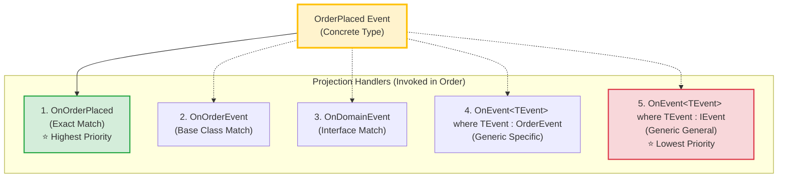
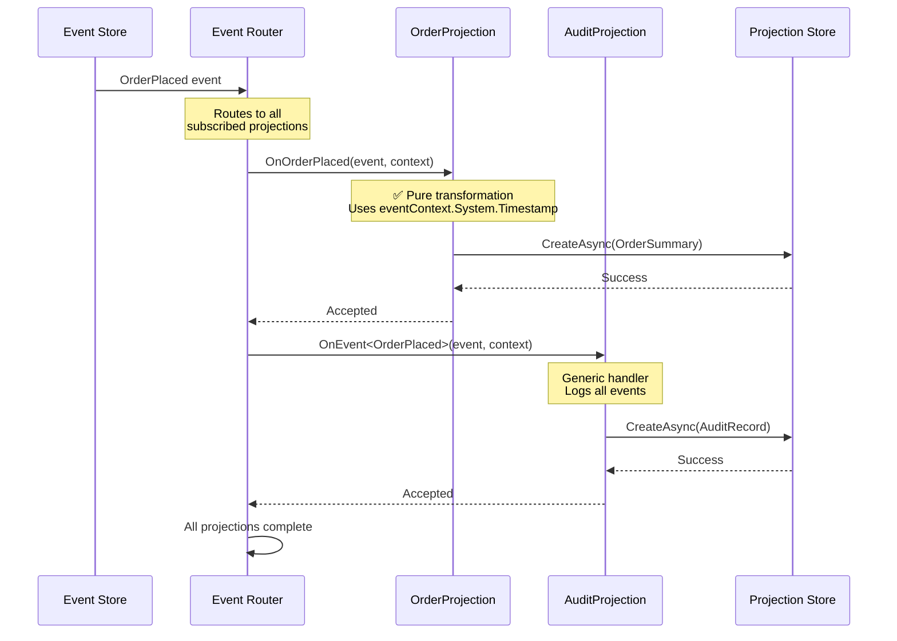

# Projection Subscriptions

Whizbang provides flexible event subscription patterns using the `[WhizbangSubscribe]` attribute. Projections can subscribe to specific event types, base classes, interfaces, or use generic methods for maximum reusability.

## Basic Subscription Pattern

Place `[WhizbangSubscribe]` directly on the method parameter representing the event:

```csharp{
title: "Basic Event Subscription"
description: "Simple event subscription pattern with flexible method naming"
framework: "NET8"
category: "Projections"
difficulty: "BEGINNER"
tags: ["Projections", "Subscriptions", "Events"]
nugetPackages: ["Whizbang.Core", "Whizbang.Projections"]
usingStatements: ["System", "System.Threading", "System.Threading.Tasks"]
showLineNumbers: true
}
using System;
using System.Threading;
using System.Threading.Tasks;

[WhizbangProjection]
public class OrderHistoryProjection {
    private readonly List<OrderSummary> _orders = new();

    // ✅ Method names are flexible - use what makes sense
    public Task Handle([WhizbangSubscribe] OrderPlaced @event, CancellationToken ct) {
        _orders.Add(new OrderSummary(@event.OrderId, "Placed"));
        return Task.CompletedTask;
    }

    public Task On([WhizbangSubscribe] OrderShipped @event, CancellationToken ct) {
        var order = _orders.First(o => o.OrderId == @event.OrderId);
        order.Status = "Shipped";
        return Task.CompletedTask;
    }

    public Task When([WhizbangSubscribe] OrderCancelled @event, CancellationToken ct) {
        _orders.RemoveAll(o => o.OrderId == @event.OrderId);
        return Task.CompletedTask;
    }

    // Descriptive names work too
    public Task OnOrderCompleted([WhizbangSubscribe] OrderCompleted @event, CancellationToken ct) {
        var order = _orders.First(o => o.OrderId == @event.OrderId);
        order.Status = "Completed";
        return Task.CompletedTask;
    }
}

public record OrderSummary(Guid OrderId, string Status) {
    public string Status { get; set; } = Status;
}
```

## Subscription Rules

- **One subscription per method**: Only one parameter can have `[WhizbangSubscribe]` attribute
- **Additional parameters allowed**: `CancellationToken`, `EventContext`, `ProjectionContext`, injected services
- **Flexible naming**: Use `Handle`, `On`, `When`, or any descriptive name
- **Auto-registration**: Source generator automatically wires subscriptions to service configuration
- **Supports polymorphism**: Subscribe to base classes or interfaces

## Polymorphic Subscriptions

### Base Class Subscriptions

Subscribe to a base class to handle all derived event types:

```csharp{
title: "Base Class Event Subscriptions"
description: "Using base classes to handle multiple event types"
framework: "NET8"
category: "Projections"
difficulty: "INTERMEDIATE"
tags: ["Projections", "Polymorphism", "Base Classes"]
nugetPackages: ["Whizbang.Core", "Whizbang.Projections"]
usingStatements: ["System", "System.Threading", "System.Threading.Tasks"]
showLineNumbers: true
}
using System;
using System.Threading;
using System.Threading.Tasks;

// Base class for all order events
public abstract record OrderEvent(Guid OrderId, DateTime Timestamp);

// Derived event types
public record OrderPlaced(Guid OrderId, DateTime Timestamp, decimal Total)
    : OrderEvent(OrderId, Timestamp);

public record OrderShipped(Guid OrderId, DateTime Timestamp, string TrackingNumber)
    : OrderEvent(OrderId, Timestamp);

public record OrderCancelled(Guid OrderId, DateTime Timestamp, string Reason)
    : OrderEvent(OrderId, Timestamp);

[WhizbangProjection]
public class OrderAuditProjection {
    private readonly List<AuditRecord> _auditLog = new();

    // Single method handles ALL OrderEvent-derived types
    public Task Handle([WhizbangSubscribe] OrderEvent @event, CancellationToken ct) {
        // Common processing for all order events
        LogAudit(@event.OrderId, @event.GetType().Name, @event.Timestamp);

        // Pattern matching for specific handling
        return @event switch {
            OrderPlaced placed => HandlePlaced(placed),
            OrderShipped shipped => HandleShipped(shipped),
            OrderCancelled cancelled => HandleCancelled(cancelled),
            _ => Task.CompletedTask
        };
    }

    private Task HandlePlaced(OrderPlaced @event) {
        _auditLog.Add(new AuditRecord("Order placed with total: " + @event.Total));
        return Task.CompletedTask;
    }

    private Task HandleShipped(OrderShipped @event) {
        _auditLog.Add(new AuditRecord("Order shipped: " + @event.TrackingNumber));
        return Task.CompletedTask;
    }

    private Task HandleCancelled(OrderCancelled @event) {
        _auditLog.Add(new AuditRecord("Order cancelled: " + @event.Reason));
        return Task.CompletedTask;
    }

    private void LogAudit(Guid orderId, string eventType, DateTime timestamp) {
        Console.WriteLine($"[{timestamp}] {eventType} - Order {orderId}");
    }
}

public record AuditRecord(string Message);
```

### Interface Subscriptions

Subscribe to an interface to handle all implementing event types:

```csharp{
title: "Interface Event Subscriptions"
description: "Using interfaces to handle multiple event types"
framework: "NET8"
category: "Projections"
difficulty: "INTERMEDIATE"
tags: ["Projections", "Polymorphism", "Interfaces"]
nugetPackages: ["Whizbang.Core", "Whizbang.Projections"]
usingStatements: ["System", "System.Collections.Generic", "System.Threading", "System.Threading.Tasks"]
showLineNumbers: true
}
using System;
using System.Collections.Generic;
using System.Threading;
using System.Threading.Tasks;

// Interface for all inventory events
public interface IInventoryEvent {
    Guid ProductId { get; }
}

// Event implementations
public record InventoryAdjusted(Guid ProductId, int Quantity) : IInventoryEvent;
public record InventoryReserved(Guid ProductId, int Quantity, Guid OrderId) : IInventoryEvent;
public record InventoryReleased(Guid ProductId, int Quantity, Guid OrderId) : IInventoryEvent;

[WhizbangProjection]
public class InventoryProjection {
    private readonly Dictionary<Guid, int> _stock = new();

    // Single method handles ALL IInventoryEvent implementations
    public Task Handle([WhizbangSubscribe] IInventoryEvent @event, CancellationToken ct) {
        return @event switch {
            InventoryAdjusted adjusted => HandleAdjusted(adjusted),
            InventoryReserved reserved => HandleReserved(reserved),
            InventoryReleased released => HandleReleased(released),
            _ => Task.CompletedTask
        };
    }

    private Task HandleAdjusted(InventoryAdjusted @event) {
        _stock[@event.ProductId] = @event.Quantity;
        return Task.CompletedTask;
    }

    private Task HandleReserved(InventoryReserved @event) {
        if (_stock.ContainsKey(@event.ProductId)) {
            _stock[@event.ProductId] -= @event.Quantity;
        }
        return Task.CompletedTask;
    }

    private Task HandleReleased(InventoryReleased @event) {
        if (_stock.ContainsKey(@event.ProductId)) {
            _stock[@event.ProductId] += @event.Quantity;
        }
        return Task.CompletedTask;
    }

    // Query method
    public int GetStock(Guid productId) {
        return _stock.TryGetValue(productId, out var stock) ? stock : 0;
    }
}
```

## Generic Method Subscriptions

Use generic methods for maximum flexibility and reusability:

```csharp{
title: "Generic Method Subscriptions"
description: "Using generic methods to handle multiple event types with shared logic"
framework: "NET8"
category: "Projections"
difficulty: "ADVANCED"
tags: ["Projections", "Generics", "Polymorphism"]
nugetPackages: ["Whizbang.Core", "Whizbang.Projections"]
usingStatements: ["System", "System.Collections.Generic", "System.Threading", "System.Threading.Tasks"]
showLineNumbers: true
}
using System;
using System.Collections.Generic;
using System.Threading;
using System.Threading.Tasks;

// Marker interface for all events
public interface IEvent {
    Guid EventId { get; }
    DateTime Timestamp { get; }
}

// Base interface for domain events
public interface IDomainEvent : IEvent {
    string Domain { get; }
}

// Example events
public abstract record OrderEvent(Guid EventId, DateTime Timestamp, string Domain) : IDomainEvent;

public record OrderPlaced(Guid EventId, DateTime Timestamp, Guid OrderId, decimal Total)
    : OrderEvent(EventId, Timestamp, "Orders");

public record OrderShipped(Guid EventId, DateTime Timestamp, Guid OrderId, string TrackingNumber)
    : OrderEvent(EventId, Timestamp, "Orders");

// Generic method with interface constraint
[WhizbangProjection]
public class EventAuditProjection {
    private readonly List<EventAuditRecord> _auditLog = new();

    // This ONE generic method handles ALL events implementing IEvent
    public Task OnEvent<TEvent>([WhizbangSubscribe] TEvent @event, EventContext context, CancellationToken ct)
        where TEvent : IEvent {
        // Source generator creates separate registration for each concrete event type:
        // - OnEvent<OrderPlaced>
        // - OnEvent<OrderShipped>
        // - OnEvent<InventoryAdjusted>
        // - etc.

        _auditLog.Add(new EventAuditRecord {
            EventId = @event.EventId,
            EventType = typeof(TEvent).Name,  // Concrete type name
            Timestamp = @event.Timestamp,
            UserId = context.Security.UserId,
            TenantId = context.Security.TenantId
        });

        return Task.CompletedTask;
    }
}

// Generic method with base class constraint
[WhizbangProjection]
public class OrderEventLogProjection {
    private readonly Dictionary<string, List<string>> _logsByDomain = new();

    // Handles all OrderEvent-derived types
    public Task LogOrderEvent<TEvent>([WhizbangSubscribe] TEvent @event, CancellationToken ct)
        where TEvent : OrderEvent {
        if (!_logsByDomain.ContainsKey(@event.Domain)) {
            _logsByDomain[@event.Domain] = new List<string>();
        }

        _logsByDomain[@event.Domain].Add(
            $"{@event.Timestamp:O} - {typeof(TEvent).Name} - {@event.EventId}"
        );

        return Task.CompletedTask;
    }
}

public record EventAuditRecord {
    public Guid EventId { get; init; }
    public string EventType { get; init; }
    public DateTime Timestamp { get; init; }
    public Guid? UserId { get; init; }
    public Guid? TenantId { get; init; }
}
```

## How Generic Methods Work

1. **Source Generator Discovers Generic Methods**: At compile time, finds all generic methods with `[WhizbangSubscribe]`

2. **Creates Registrations for Each Concrete Type**: For every event type matching the generic constraint:

   ```csharp{
   title: "Generic Method Registration Example"
   description: "How source generator creates registrations for generic subscription methods"
   framework: "NET8"
   category: "Projections"
   difficulty: "ADVANCED"
   tags: ["Projections", "Source Generation", "Generic Methods"]
   filename: "SourceGenerationExample.cs"
   usingStatements: ["System", "System.Threading", "System.Threading.Tasks"]
   showLineNumbers: true
   }
   // You write this ONE generic method:
   public Task OnEvent<TEvent>([WhizbangSubscribe] TEvent @event, CancellationToken ct)
       where TEvent : IEvent { }

   // Source generator creates registrations for ALL event types:
   services.Subscribe<OrderPlaced, EventAuditProjection>(p => p.OnEvent);
   services.Subscribe<OrderShipped, EventAuditProjection>(p => p.OnEvent);
   services.Subscribe<InventoryAdjusted, EventAuditProjection>(p => p.OnEvent);
   // ... etc.
   ```

3. **Type Safety Maintained**: Generic constraints ensure only valid event types are registered

4. **Multiple Constraints Supported**: Use `where TEvent : class, IEvent, new()` or any valid C# constraint

## Combining Generic and Specific Methods

Mix generic and specific subscriptions in the same projection:

```csharp{
title: "Hybrid Generic and Specific Subscriptions"
description: "Combining generic catch-all methods with specific handlers"
framework: "NET8"
category: "Projections"
difficulty: "ADVANCED"
tags: ["Projections", "Generics", "Hybrid Patterns"]
nugetPackages: ["Whizbang.Core", "Whizbang.Projections"]
usingStatements: ["System", "System.Threading", "System.Threading.Tasks"]
showLineNumbers: true
}
using System;
using System.Threading;
using System.Threading.Tasks;

[WhizbangProjection]
public class HybridProjection {
    // Generic catch-all for all events
    public Task OnEvent<TEvent>([WhizbangSubscribe] TEvent @event, CancellationToken ct)
        where TEvent : IEvent {
        // Log all events generically
        Console.WriteLine($"Event received: {typeof(TEvent).Name}");
        return Task.CompletedTask;
    }

    // Specific handler for OrderPlaced (takes precedence)
    public Task OnOrderPlaced([WhizbangSubscribe] OrderPlaced @event, ProjectionContext projection, CancellationToken ct) {
        // Special handling for OrderPlaced
        Console.WriteLine($"Special handling for order: {@event.OrderId}");
        return Task.CompletedTask;
    }

    // Specific handler for high-priority events
    public Task OnOrderCancelled([WhizbangSubscribe] OrderCancelled @event, CancellationToken ct) {
        // Alert handling for cancellations
        Console.WriteLine($"ALERT: Order cancelled - {@event.Reason}");
        return Task.CompletedTask;
    }
}
```

## Precedence Rules

When multiple methods can handle an event, Whizbang invokes handlers in this order:

1. **Exact type match** (e.g., `OrderPlaced @event`)
2. **Base class match** (e.g., `OrderEvent @event`)
3. **Interface match** (e.g., `IEvent @event`)
4. **Generic with specific constraint** (e.g., `TEvent where TEvent : OrderEvent`)
5. **Generic with general constraint** (e.g., `TEvent where TEvent : IEvent`)

All matching handlers are invoked in precedence order (most specific to least specific).



## Benefits of Polymorphic Subscriptions

1. **Single Entry Point**: One method handles all related events
2. **Shared Logic**: Common processing for all event types (logging, auditing, etc.)
3. **Type Safety**: Pattern matching ensures all cases are handled
4. **Flexibility**: Mix polymorphic and specific subscriptions as needed
5. **Clean Code**: Reduces boilerplate for related event types

## Benefits of Generic Methods

1. **DRY Principle**: Write once, handle many event types
2. **Shared Logic**: Common processing for all events matching constraint
3. **Type Safety**: Generic constraints enforce compile-time safety
4. **Automatic Registration**: Source generator wires up all matching event types
5. **Flexibility**: Combine with non-generic methods for specific overrides
6. **Scalability**: New event types automatically get handled without code changes

## Valid Subscription Patterns

```csharp{
title: "Valid Subscription Patterns"
description: "Examples of all valid projection subscription patterns supported by Whizbang"
framework: "NET8"
category: "Projections"
difficulty: "INTERMEDIATE"
tags: ["Projections", "Subscriptions", "Patterns", "Examples"]
filename: "SubscriptionPatterns.cs"
usingStatements: ["System", "System.Threading", "System.Threading.Tasks"]
showLineNumbers: true
}
// ✅ VALID - Specific event type
public Task Handle([WhizbangSubscribe] OrderPlaced @event, CancellationToken ct) { }

// ✅ VALID - Base class subscription
public Task OnOrderEvent([WhizbangSubscribe] OrderEvent @event, CancellationToken ct) { }

// ✅ VALID - Interface subscription
public Task HandleInventoryEvent([WhizbangSubscribe] IInventoryEvent @event, CancellationToken ct) { }

// ✅ VALID - Generic method
public Task OnEvent<TEvent>([WhizbangSubscribe] TEvent @event, CancellationToken ct)
    where TEvent : IEvent { }

// ✅ VALID - With EventContext
public Task OnOrderPlaced([WhizbangSubscribe] OrderPlaced @event, EventContext context, CancellationToken ct) { }

// ✅ VALID - With ProjectionContext
public Task OnOrderShipped([WhizbangSubscribe] OrderShipped @event, ProjectionContext projection, CancellationToken ct) { }

// ✅ VALID - With both contexts
public Task WhenOrderPlaced(
    [WhizbangSubscribe] OrderPlaced @event,
    EventContext eventContext,
    ProjectionContext projection,
    CancellationToken ct) { }

// ✅ VALID - With injected services (for querying, not mutation)
public Task ProcessOrder([WhizbangSubscribe] OrderPlaced @event, IOrderRepository repo, CancellationToken ct) { }

// ❌ INVALID - Multiple subscriptions per method (compile error)
public Task OnOrderEvents([WhizbangSubscribe] OrderPlaced order, [WhizbangSubscribe] OrderShipped shipped) { }
```

## Auto-Registration

When you use `[WhizbangSubscribe]` on a method parameter, the source generator:

1. Discovers the subscription at compile time
2. Generates registration code linking the event type to the projection method
3. Automatically configures the service to route events to this projection
4. No manual registration needed - just mark with `[WhizbangSubscribe]`



```csharp{
title: "Auto-Registration Example"
description: "How subscriptions are automatically registered by the source generator"
framework: "NET8"
category: "Projections"
difficulty: "INTERMEDIATE"
tags: ["Projections", "Auto-Registration", "Source Generation"]
filename: "AutoRegistrationExample.cs"
usingStatements: ["System", "System.Threading", "System.Threading.Tasks"]
showLineNumbers: true
}
// This subscription is automatically registered
public Task OnOrderPlaced([WhizbangSubscribe] OrderPlaced @event, CancellationToken ct) {
    // Source generator creates registration code like:
    // services.Subscribe<OrderPlaced, OrderSummaryProjection>(
    //     projection => projection.OnOrderPlaced);
}
```

## Next Steps

- [Projection Contexts](./projection-contexts.md) - EventContext and ProjectionContext injection
- [Projection Purity](./projection-purity.md) - Maintaining pure, deterministic projections
- [Projection Return Values](./projection-return-values.md) - Using return values for observability
