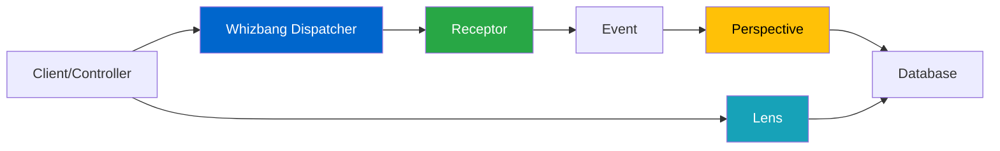

# Event-Driven Dispatcher Pattern

## Overview

The Event-Driven Dispatcher pattern is your entry point into the Whizbang library. It provides a clean way to handle commands and queries using event-driven architecture, where all state changes flow through events. This pattern is perfect for:

- Getting started with event-driven concepts
- Building applications with clear separation between reads and writes
- Learning the receptor/perspective/lens pattern
- Starting with Event-Driven mode before adding Event Sourcing

### Key Benefits

- **Progressive Enhancement**: Same code works from monolith to microservices
- **Convention Over Configuration**: Return types determine behavior
- **Aspect-Oriented**: Cross-cutting concerns via declarative attributes
- **Compile-Time Safety**: Source generators catch errors at build time
- **Zero Overhead**: Generated code performs like hand-written code

## Architecture Diagram



## Core Components

### Required Packages

```xml{
title: "Required Package Reference"
description: "Add Whizbang.Core NuGet package to your project"
framework: "NET8"
category: "Usage Patterns"
difficulty: "BEGINNER"
tags: ["Simple Mediator", "NuGet", "Installation"]
filename: "YourProject.csproj"
showLineNumbers: true
}
<PackageReference Include="Whizbang.Core" Version="1.0.0" />
```

### The Event-Driven Approach

Whizbang uses a unified event-driven pattern:

- **Receptors**: Receive commands and emit events
- **Perspectives**: React to events and update views
- **Lenses**: Provide read-only access to data
- **All writes through events**: Even in non-event-sourced mode
- **Return Type Semantics**: What you return determines what happens

## Step-by-Step Implementation

### Step 1: Define Your Messages

```csharp{
title: "Message Definitions"
description: "Simple message types - no special interfaces required"
framework: "NET8"
category: "Domain Logic"
difficulty: "BEGINNER"
tags: ["Messages", "Commands", "Queries"]
nugetPackages: ["Whizbang.Core"]
filename: "OrderMessages.cs"
showLineNumbers: true
usingStatements: ["System", "System.Collections.Generic"]
}
using System;
using System.Collections.Generic;

namespace MyApp.Orders;

// Command: A message that changes state
public record CreateOrder(
    Guid CustomerId,
    List<OrderItem> Items,
    string ShippingAddress
);

// Query: A message that reads data
public record GetOrderById(Guid OrderId);

// Event: Something that happened
public record OrderCreated(
    Guid OrderId,
    Guid CustomerId,
    decimal TotalAmount,
    DateTime CreatedAt
);

// Response types
public record OrderDetails(
    Guid OrderId,
    Guid CustomerId,
    List<OrderItem> Items,
    decimal TotalAmount,
    string Status,
    DateTime CreatedAt
);

// Domain model
public record OrderItem(
    string ProductId,
    string ProductName,
    int Quantity,
    decimal UnitPrice
);
```

### Step 2: Implement Receptors with Return Type Semantics

```csharp{
title: "Receptor Implementation - Event-Driven Approach"
description: "Receptors emit events, perspectives handle writes"
framework: "NET8"
category: "Domain Logic"
difficulty: "BEGINNER"
tags: ["Receptors", "Events", "Perspectives", "Lenses"]
nugetPackages: ["Whizbang.Core"]
filename: "OrderReceptors.cs"
showLineNumbers: true
highlightLines: [8, 13, 29, 45]
usingStatements: ["Whizbang", "System", "System.Linq"]
}
using Whizbang;
using System;
using System.Linq;

namespace MyApp.Orders.Receptors;

// Receptor with aspects - receives commands, emits events
[Logged]
[Validated]
[Transactional]
public class CreateOrderReceptor : IReceptor<CreateOrder> {
    // Return type determines behavior: OrderCreated event flows to perspectives
    public OrderCreated Receive(CreateOrder cmd, IOrderLens lens) {
        // Validate using lens (read-only)
        if (!lens.CustomerExists(cmd.CustomerId)) {
            throw new CustomerNotFoundException();
        }
        
        // Calculate total
        var totalAmount = cmd.Items.Sum(i => i.Quantity * i.UnitPrice);
        
        // Emit event - perspectives handle all writes
        return new OrderCreated(
            Guid.NewGuid(),
            cmd.CustomerId,
            totalAmount,
            DateTime.UtcNow
        );
    }
}

// Lens provides read-only queries
public class OrderLens : IOrderLens {
    private readonly IDatabase db;
    
    [Cached(Duration = "5m")]
    public OrderDetails Focus(Guid orderId) {
        var order = db.Orders.Find(orderId);
        
        if (order == null) {
            throw new NotFoundException($"Order {orderId} not found");
        }
        
        // Return read-only view
        return new OrderDetails(
            order.Id,
            order.CustomerId,
            order.Items,
            order.TotalAmount,
            order.Status,
            order.CreatedAt
        );
    }
    
    public bool CustomerExists(Guid customerId) {
        return db.Customers.Any(c => c.Id == customerId);
    }
}

// Receptor returning multiple events via tuple
public class ProcessOrderReceptor : IReceptor<ProcessOrder> {
    // Tuple return = multiple events flow to perspectives
    public (OrderProcessed, EmailQueued, InventoryReserved) Receive(ProcessOrder cmd) {
        // Make decisions, emit events
        
        return (
            new OrderProcessed(cmd.OrderId),
            new EmailQueued(cmd.CustomerEmail, "Order confirmed"),
            new InventoryReserved(cmd.Items)
        );
    }
}
```

### Step 3: Implement Perspectives for Write Operations

```csharp{
title: "Perspective Implementation - Handle All Writes"
description: "Perspectives react to events and update storage"
framework: "NET8"
category: "Domain Logic"
difficulty: "BEGINNER"
tags: ["Perspectives", "Events", "Database Updates"]
nugetPackages: ["Whizbang.Core"]
filename: "OrderPerspectives.cs"
showLineNumbers: true
usingStatements: ["Whizbang", "System", "System.Threading.Tasks"]
}
using Whizbang;
using System;
using System.Threading.Tasks;

namespace MyApp.Orders.Perspectives;

// Perspective handles all database writes
public class OrderPerspective : IPerspectiveOf<OrderCreated> {
    private readonly IDatabase db;
    
    public async Task Update(OrderCreated e) {
        // Create order in database
        await db.Orders.Add(new Order {
            Id = e.OrderId,
            CustomerId = e.CustomerId,
            Total = e.TotalAmount,
            Status = "Pending",
            CreatedAt = e.CreatedAt
        });
        
        await db.SaveChanges();
    }
}

// Multiple perspectives can react to same event
public class CustomerStatsPerspective : IPerspectiveOf<OrderCreated> {
    private readonly IDatabase db;
    
    public async Task Update(OrderCreated e) {
        await db.CustomerStats.IncrementOrderCount(e.CustomerId);
        await db.CustomerStats.UpdateLastOrderDate(e.CustomerId, e.CreatedAt);
    }
}

// Cache perspective
public class CachePerspective : IPerspectiveOf<OrderCreated> {
    private readonly ICache cache;
    
    public async Task Update(OrderCreated e) {
        // Invalidate customer cache
        await cache.Remove($"customer:{e.CustomerId}:orders");
    }
}
```

### Step 4: Wire Up Your Application

```csharp{
title: "Service Configuration"
description: "Configure dispatcher with receptors, perspectives, and lenses"
framework: "NET8"
category: "Configuration"
difficulty: "BEGINNER"
tags: ["DI", "Configuration", "Progressive Enhancement"]
nugetPackages: ["Whizbang.Core", "Microsoft.Extensions.DependencyInjection"]
filename: "Program.cs"
showLineNumbers: true
highlightLines: [8, 11, 20, 28]
usingStatements: ["Whizbang", "Microsoft.Extensions.DependencyInjection"]
}
using Whizbang;
using Microsoft.AspNetCore.Builder;
using Microsoft.Extensions.DependencyInjection;
using MyApp.Orders.Receptors;
using MyApp.Orders.Perspectives;

var builder = WebApplication.CreateBuilder(args);

// Configure Event-Driven mode
builder.Services.AddWhizbang()
    .UseDispatcher(dispatcher => {
        dispatcher.DefaultPolicy = new EventDrivenPolicy();
        
        // Register components
        dispatcher.RegisterReceptorsFromAssembly(typeof(Program).Assembly);
        dispatcher.RegisterPerspectivesFromAssembly(typeof(Program).Assembly);
        dispatcher.RegisterLensesFromAssembly(typeof(Program).Assembly);
    });

// Register lenses (read-only queries)
builder.Services.AddScoped<IOrderLens, OrderLens>();
builder.Services.AddScoped<ICustomerLens, CustomerLens>();

// When ready for Event-Sourcing
// dispatcher.ForReceptor<Order>().UsePolicy(new EventSourcedPolicy());

// When scaling to distributed
// dispatcher.UseRelay<KafkaRelay>();

builder.Services.AddControllers();

var app = builder.Build();

app.UseRouting();
app.MapControllers();

app.Run();
```

## Complete Example

```csharp{
title: "Complete Event-Driven Example"
description: "Full working example with receptors, perspectives, and lenses"
framework: "NET8"
category: "Complete Example"
difficulty: "BEGINNER"
tags: ["API", "Controller", "Dispatcher", "Event-Driven", "Complete"]
nugetPackages: ["Whizbang.Core", "Microsoft.AspNetCore.Mvc"]
filename: "OrdersController.cs"
showLineNumbers: true
highlightLines: [14, 23, 33]
testFile: "OrdersControllerTests.cs"
testMethod: "CreateOrder_ValidCommand_ReturnsOrderId"
usingStatements: ["Whizbang", "Microsoft.AspNetCore.Mvc", "System"]
}
using Whizbang;
using Microsoft.AspNetCore.Mvc;
using System;
using MyApp.Orders;

namespace MyApp.Controllers;

[ApiController]
[Route("api/[controller]")]
public class OrdersController : ControllerBase {
    private readonly IDispatcher _dispatcher;
    private readonly IOrderLens _orderLens;
    
    public OrdersController(IDispatcher dispatcher, IOrderLens orderLens) {
        _dispatcher = dispatcher;
        _orderLens = orderLens;
    }
    
    [HttpPost]
    public async Task<ActionResult<OrderCreated>> CreateOrder(
        [FromBody] CreateOrderRequest request) {
        
        // Map request to command
        var command = new CreateOrder(
            request.CustomerId,
            request.Items,
            request.ShippingAddress
        );
        
        try {
            // Dispatcher routes to receptor, event flows to perspectives
            var @event = await _dispatcher.Dispatch(command);
            return Ok(@event);
        }
        catch (ValidationException ex) {
            return BadRequest(new { error = ex.Message });
        }
        catch (InsufficientInventoryException ex) {
            return Conflict(new { error = ex.Message });
        }
    }
    
    [HttpGet("{orderId}")]
    public async Task<ActionResult<OrderDetails>> GetOrder(Guid orderId) {
        try {
            // Use lens for queries (read-only)
            var order = _orderLens.Focus(orderId);
            return Ok(order);
        }
        catch (NotFoundException ex) {
            return NotFound(new { error = ex.Message });
        }
    }
    
    [HttpPost("{orderId}/process")]
    public async Task<ActionResult> ProcessOrder(Guid orderId) {
        // Receptor returns tuple - all events flow to perspectives
        var (orderProcessed, emailQueued, inventoryReserved) = 
            await _dispatcher.Dispatch(new ProcessOrder(orderId));
        
        return Ok(new {
            orderId = orderProcessed.OrderId,
            emailQueued = emailQueued.QueueId,
            inventoryReserved = inventoryReserved.ReservationId
        });
    }
}

// Request DTOs
public record CreateOrderRequest(
    Guid CustomerId,
    List<OrderItem> Items,
    string ShippingAddress
);
```

## Testing Strategy

### Unit Testing Receptors and Perspectives

```csharp{
title: "Receptor and Perspective Unit Tests"
description: "Test receptors and perspectives in isolation"
framework: "NET8"
category: "Testing"
difficulty: "BEGINNER"
tags: ["Unit Testing", "xUnit", "Aspects"]
nugetPackages: ["Whizbang.Core", "xUnit"]
filename: "CreateOrderHandlerTests.cs"
showLineNumbers: true
highlightLines: [15, 25, 40]
usingStatements: ["Whizbang", "Xunit"]
}
using Whizbang;
using Xunit;
using System;
using System.Collections.Generic;
using MyApp.Orders;
using MyApp.Orders.Receptors;
using MyApp.Orders.Perspectives;

namespace MyApp.Tests.Orders;

public class CreateOrderReceptorTests {
    [Fact]
    public void Receive_ValidCommand_ReturnsOrderCreatedEvent() {
        // Arrange
        var receptor = new CreateOrderReceptor();
        var command = new CreateOrder(
            Guid.NewGuid(),
            new List<OrderItem> {
                new OrderItem("PROD-1", "Widget", 2, 10.00m)
            },
            "123 Main St"
        );
        
        var lens = Mock.Of<IOrderLens>(l => 
            l.CustomerExists(It.IsAny<Guid>()) == true
        );
        
        // Act - Receptor emits event
        var @event = receptor.Receive(command, lens);
        
        // Assert - Event emitted
        Assert.NotNull(@event);
        Assert.IsType<OrderCreated>(@event);
        Assert.Equal(20.00m, @event.TotalAmount);
    }
    
    [Fact]
    public void Receive_ProcessOrder_ReturnsMultipleEvents() {
        // Arrange
        var receptor = new ProcessOrderReceptor();
        var command = new ProcessOrder(Guid.NewGuid());
        
        // Act - Receptor returns tuple of events
        var (processed, emailQueued, inventoryReserved) = receptor.Receive(command);
        
        // Assert - All events emitted
        Assert.NotNull(processed);
        Assert.NotNull(emailQueued);
        Assert.NotNull(inventoryReserved);
        Assert.Equal(command.OrderId, processed.OrderId);
    }
}

// Test Perspectives
public class PerspectiveTests {
    [Fact]
    public async Task OrderPerspective_UpdatesDatabase_WhenOrderCreatedReceived() {
        // Arrange
        var db = new InMemoryDatabase();
        var perspective = new OrderPerspective(db);
        var @event = new OrderCreated {
            OrderId = Guid.NewGuid(),
            CustomerId = Guid.NewGuid(),
            TotalAmount = 100.00m
        };
        
        // Act - Perspective handles write
        await perspective.Update(@event);
        
        // Assert - Database updated
        var order = await db.Orders.Find(@event.OrderId);
        Assert.NotNull(order);
        Assert.Equal(@event.CustomerId, order.CustomerId);
        Assert.Equal(@event.TotalAmount, order.Total);
    }
    
    [Fact]
    public async Task Handler_WithLoggingAspect_LogsExecution() {
        // Test logging aspect
        await Whizbang.Test<CreateOrderHandler>()
            .Given(new CreateOrder { ... })
            .WithAspects()
            .WhenHandled()
            .ThenAspect<LoggingAspect>(logs => {
                logs.ShouldContain("Executing CreateOrderHandler");
                logs.ShouldContain("Completed in");
            });
    }
}
```

## Common Pitfalls

### Avoid Direct Handler Calls

```csharp{
title: "Proper Handler Usage Pattern"
description: "Use the dispatcher instead of injecting handlers directly"
framework: "NET8"
category: "Usage Patterns"
difficulty: "BEGINNER"
tags: ["Simple Mediator", "Best Practices", "Anti-Patterns"]
filename: "OrderService.cs"
showLineNumbers: true
usingStatements: ["Whizbang"]
}
// ❌ BAD - Don't inject and call handlers directly
public class OrderService {
    private readonly CreateOrderHandler _handler;
    
    public OrderService(CreateOrderHandler handler) {
        _handler = handler;
    }
}

// ✅ GOOD - Always use Whizbang for routing
public class OrderService {
    private readonly IWhizbang _whizbang;
    
    public OrderService(IWhizbang whizbang) {
        _whizbang = whizbang;
    }
}
```

### Use Return Types to Express Intent

```csharp{
title: "Return Type Semantics Examples"
description: "Express intent clearly through return types for proper event flow"
framework: "NET8"
category: "Usage Patterns"
difficulty: "BEGINNER"
tags: ["Simple Mediator", "Return Types", "Best Practices", "Events"]
filename: "ReturnTypeExamples.cs"
showLineNumbers: true
usingStatements: ["System"]
}
// ❌ BAD - Unclear what happens with the result
public object Handle(CreateOrder cmd) {
    return new { OrderId = Guid.NewGuid() };
}

// ✅ GOOD - Return type makes intent clear
public OrderCreated Handle(CreateOrder cmd) {
    return new OrderCreated(Guid.NewGuid());
}

// ✅ GOOD - Multiple effects via tuple
public (OrderCreated, SendEmail) Handle(CreateOrder cmd) {
    return (new OrderCreated(), new SendEmail());
}
```

### Avoid Business Logic in Controllers

```csharp{
title: "Controller Logic Separation"
description: "Keep business logic in handlers, not controllers"
framework: "NET8"
category: "Usage Patterns"
difficulty: "BEGINNER"
tags: ["Simple Mediator", "Controllers", "Separation of Concerns", "Best Practices"]
filename: "OrderController.cs"
showLineNumbers: true
usingStatements: ["Microsoft.AspNetCore.Mvc", "System.Threading.Tasks"]
}
// ❌ BAD - Business logic in controller
[HttpPost]
public async Task<IActionResult> CreateOrder(CreateOrderRequest request) {
    if (request.Items.Sum(i => i.Quantity * i.UnitPrice) > 1000) {
        // Business logic doesn't belong here!
        request.RequiresApproval = true;
    }
}

// ✅ GOOD - All logic in handler
[HttpPost]
public async Task<IActionResult> CreateOrder(CreateOrderRequest request) {
    var command = MapToCommand(request);
    var result = await _whizbang.Send(command);
    return Ok(result);
}
```

## Progressive Enhancement

### Start Simple
```csharp{
title: "Phase 1: Simple In-Process Configuration"
description: "Start with simple in-process messaging like MediatR"
framework: "NET8"
category: "Usage Patterns"
difficulty: "BEGINNER"
tags: ["Simple Mediator", "Configuration", "Progressive Enhancement", "In-Process"]
filename: "Program.cs"
showLineNumbers: true
usingStatements: ["Whizbang", "Microsoft.Extensions.DependencyInjection"]
}
// Phase 1: Simple in-process (like MediatR)
builder.Services.AddWhizbang()
    .UseInProcessMode();
```

### Add Durability When Needed
```csharp{
title: "Phase 2: Durable Mode Configuration"
description: "Add persistence and retry capabilities like Wolverine"
framework: "NET8"
category: "Usage Patterns"
difficulty: "INTERMEDIATE"
tags: ["Simple Mediator", "Configuration", "Progressive Enhancement", "Durability", "PostgreSQL"]
filename: "Program.cs"
showLineNumbers: true
usingStatements: ["Whizbang", "Microsoft.Extensions.DependencyInjection"]
}
// Phase 2: Add persistence and retry (like Wolverine)
builder.Services.AddWhizbang()
    .UseDurableMode()
    .UsePostgreSQL(connectionString)
    .WithOutbox();
```

### Scale to Distributed
```csharp{
title: "Phase 3: Distributed Mode Configuration"
description: "Scale to microservices architecture like MassTransit"
framework: "NET8"
category: "Usage Patterns"
difficulty: "INTERMEDIATE"
tags: ["Simple Mediator", "Configuration", "Progressive Enhancement", "Distributed", "Kafka", "Microservices"]
filename: "Program.cs"
showLineNumbers: true
usingStatements: ["Whizbang", "Microsoft.Extensions.DependencyInjection"]
}
// Phase 3: Microservices (like MassTransit)
builder.Services.AddWhizbang()
    .UseDistributedMode()
    .UseKafka(kafkaConfig)
    .WithSagaOrchestration();
```

### Enable Event Sourcing
```csharp{
title: "Phase 4: Event Sourcing Configuration"
description: "Enable full event sourcing capabilities unique to Whizbang"
framework: "NET8"
category: "Usage Patterns"
difficulty: "INTERMEDIATE"
tags: ["Simple Mediator", "Configuration", "Progressive Enhancement", "Event Sourcing", "Projections"]
filename: "Program.cs"
showLineNumbers: true
usingStatements: ["Whizbang", "Microsoft.Extensions.DependencyInjection"]
}
// Phase 4: Full event sourcing (unique to Whizbang)
builder.Services.AddWhizbang()
    .UseEventSourcedMode()
    .UseEventStore(eventStoreConfig)
    .WithProjections()
    .WithSnapshots();
```

**The same handler code works in ALL modes!**

## Related Patterns

- **[Event Sourcing Basics](event-sourcing-basics.md)** - Add persistence and event history
- **[CQRS Implementation](cqrs-implementation.md)** - Separate read and write models
- **[Distributed Messaging](distributed-messaging.md)** - Scale across services

## Production Considerations

### Performance
- Zero-overhead aspects via source generation
- Handler pooling for reduced allocations
- Compile-time optimizations
- Adaptive runtime optimization

### Monitoring with Aspects
```csharp{
title: "Monitoring with Aspects"
description: "Built-in observability through declarative aspects"
framework: "NET8"
category: "Usage Patterns"
difficulty: "BEGINNER"
tags: ["Simple Mediator", "Aspects", "Monitoring", "Observability", "Logging"]
filename: "OrderHandler.cs"
showLineNumbers: true
usingStatements: ["Whizbang", "System"]
}
// Built-in observability via aspects
[Observed] // Automatic telemetry
[Timed]    // Performance metrics
[Logged]   // Structured logging
public class OrderHandler : IHandle<CreateOrder> {
    public OrderCreated Handle(CreateOrder cmd) {
        // Automatically generates:
        // - Distributed trace spans
        // - Metrics (count, duration, errors)
        // - Structured logs with correlation IDs
        return new OrderCreated(cmd.OrderId);
    }
}
```

### Error Handling with Result Types
```csharp{
title: "Error Handling with Result Types"
description: "Use Result types for robust error handling without exceptions"
framework: "NET8"
category: "Usage Patterns"
difficulty: "INTERMEDIATE"
tags: ["Simple Mediator", "Error Handling", "Result Types", "Best Practices"]
filename: "OrderHandler.cs"
showLineNumbers: true
usingStatements: ["System"]
}
public Result<OrderCreated> Handle(CreateOrder cmd) {
    if (!IsValid(cmd)) {
        return Result.Failure<OrderCreated>("Validation failed");
    }
    
    try {
        var order = CreateOrder(cmd);
        return Result.Success(new OrderCreated(order.Id));
    }
    catch (Exception ex) {
        return Result.Failure<OrderCreated>(ex.Message);
    }
}
```

## Next Steps

- Explore **[Progressive Enhancement](progressive-enhancement.md)** to scale your application
- Learn about **[Aspect-Oriented Handlers](aspect-oriented-handlers.md)** for cross-cutting concerns
- Review **[Return Type Semantics](/docs/core-concepts/return-type-semantics)** for advanced patterns
- Check out **[Event Sourcing Basics](event-sourcing-basics.md)** when ready for event sourcing
- See **[CQRS Implementation](cqrs-implementation.md)** for read/write separation