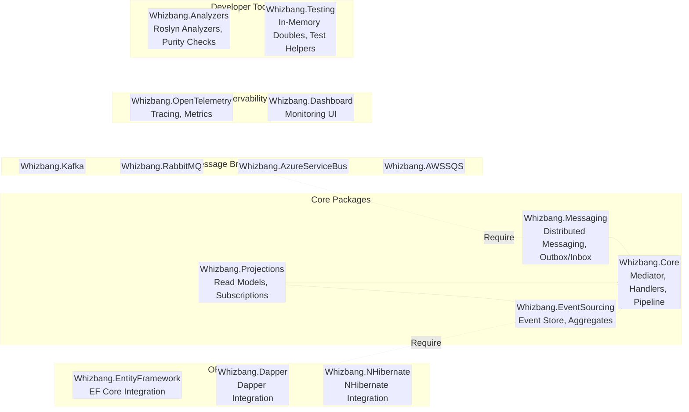

# Package Structure

**This is a reference guide** to all available Whizbang NuGet packages, their capabilities, and how to choose the right ones for your application.

> 💡 **New to Whizbang?** Start with the [**Getting Started Tutorial**](./getting-started.md) for hands-on, step-by-step learning. Come back here when you need detailed package information.

## Overview

Whizbang is distributed as a suite of NuGet packages, allowing you to install only what you need. This keeps your application lean and supports AOT compilation.

**Package Philosophy:**

- **Start minimal** - Begin with `Whizbang.Core` (just the mediator)
- **Add as needed** - Install event sourcing, projections, messaging only when required
- **Choose your stack** - Pick your preferred ORM (EF Core, Dapper, NHibernate) and message broker
- **Stay lean** - No forced dependencies, excellent for AOT compilation



### Functional Area Color Key

The diagram uses color-coded edges to indicate functional areas:

- 🟢 **Green (Core)** - Core business logic and domain functionality
- 🔴 **Red (Event)** - Event sourcing, data persistence, and event handling
- 🔵 **Blue (Read)** - Read models, projections, and query operations
- 🟡 **Yellow (Command)** - Commands, write operations, and distributed messaging
- 🔷 **Teal (Observability)** - Telemetry, metrics, tracing, and monitoring
- 🟣 **Purple (Infrastructure)** - Developer tools, analyzers, and testing utilities

## Core Packages

### Whizbang.Core

**The minimal foundation for all Whizbang applications.**

```bash{
title: "Install Whizbang.Core Package"
description: "Install the minimal foundation package for Whizbang applications"
framework: "NET8"
category: "Getting Started"
difficulty: "BEGINNER"
tags: ["Getting Started", "Packages", "Installation", "Core"]
showLineNumbers: false
}
dotnet add package Whizbang.Core
```

**Includes:**

- Message routing (commands, events, queries)
- In-memory mediator
- Handler discovery and execution
- Basic pipeline (validation, authorization hooks)
- No persistence, no external messaging

**Use when:**

- Building a simple CQRS application
- You don't need event sourcing or projections
- In-process messaging is sufficient
- Learning Whizbang

**Example:**

```csharp{
title: "Simple Mediator Setup - Complete Program.cs"
description: "Complete example showing Whizbang.Core as an in-process mediator with handler discovery"
framework: "NET8"
category: "Getting Started"
difficulty: "BEGINNER"
tags: ["Mediator", "CQRS", "Setup", "Program.cs"]
nugetPackages: ["Whizbang.Core"]
usingStatements: ["Microsoft.Extensions.DependencyInjection", "Microsoft.Extensions.Hosting", "Whizbang"]
showLineNumbers: true
collapsedLines: [1-3, 25-35]
}
// Stage 1: Imports
using Microsoft.Extensions.DependencyInjection;
using Microsoft.Extensions.Hosting;
using Whizbang;

// Stage 2: Host builder setup
var builder = Host.CreateApplicationBuilder(args);

// Stage 3: Register Whizbang mediator (in-memory only)
builder.Services.AddWhizbang(options => {
    // OPTION A: Source generator approach (recommended)
    // Handlers decorated with [WhizbangHandler] are auto-discovered at compile time
    options.RegisterGeneratedHandlers();

    // OPTION B: Explicit registration
    // Manually register each handler for fine-grained control
    // options.RegisterHandler<PlaceOrder, PlaceOrderHandler>();
    // options.RegisterHandler<CancelOrder, CancelOrderHandler>();
});

// Stage 4: Build and run
var app = builder.Build();
await app.RunAsync();

// Stage 5: Example handler decorated with [WhizbangHandler]
[WhizbangHandler]  // Source generator picks this up
public class PlaceOrderHandler : ICommandHandler<PlaceOrder, OrderResult> {
    public async Task<OrderResult> Handle(PlaceOrder command, CancellationToken ct) {
        // Business logic here
        return new OrderResult(command.OrderId);
    }
}
```

**Handler Discovery Approaches:**

Whizbang is **100% AOT-compatible** and supports **two ways** to register handlers:

1. **Source Generator (Recommended)**: Decorate handlers with `[WhizbangHandler]` attribute. At compile time, a source generator discovers all marked handlers and generates registration code. Call `options.RegisterGeneratedHandlers()` to use them.

   ```csharp
   // Handler definition
   [WhizbangHandler]
   public class PlaceOrderHandler : ICommandHandler<PlaceOrder, OrderResult> { ... }

   // Registration
   options.RegisterGeneratedHandlers();
   ```

   **Benefits:**
   - Zero runtime reflection
   - AOT-safe
   - Automatic discovery at compile time
   - No manual registration needed

2. **Explicit Registration**: Manually register each handler. Gives you full control and is AOT-safe.

   ```csharp
   options.RegisterHandler<PlaceOrder, PlaceOrderHandler>();
   options.RegisterHandler<CancelOrder, CancelOrderHandler>();
   ```

   **Benefits:**
   - Fine-grained control over registration
   - No attributes in domain code
   - Explicit and obvious
   - AOT-safe

**Note**: The `[WhizbangHandler]` attribute can be placed on:

- The handler class itself
- A base class the handler inherits from
- An interface the handler implements

The source generator will discover handlers through any of these paths.

**Attribute Naming**: All Whizbang attributes use the `Whizbang` prefix for consistency and to avoid naming collisions (`[WhizbangHandler]`, `[WhizbangProjection]`, `[WhizbangSubscribe]`).

---

### Whizbang.EventSourcing

**Event sourcing and aggregate support.**

```bash{
title: "Install Whizbang.EventSourcing Package"
description: "Add event sourcing and aggregate support to your application"
framework: "NET8"
category: "Getting Started"
difficulty: "INTERMEDIATE"
tags: ["Getting Started", "Packages", "Installation", "Event Sourcing"]
showLineNumbers: false
}
dotnet add package Whizbang.EventSourcing
```

**Includes:**

- Event store abstraction
- Aggregate base classes
- Event stream management
- Optimistic concurrency
- Event versioning
- Requires a persistence driver (see below)

**Use when:**

- You need event sourcing
- Building event-sourced aggregates
- You want complete audit trails

**Example:**

```csharp{
title: "Event Sourcing Setup - Complete Program.cs"
description: "Complete example adding event sourcing to your application"
framework: "NET8"
category: "Event Sourcing"
difficulty: "INTERMEDIATE"
tags: ["Event Sourcing", "Aggregates", "Setup", "Program.cs"]
nugetPackages: ["Whizbang.Core", "Whizbang.EventSourcing"]
usingStatements: ["Microsoft.Extensions.DependencyInjection", "Microsoft.Extensions.Hosting", "Whizbang"]
showLineNumbers: true
collapsedLines: [1-3, 7-8]
}
// Stage 1: Imports
using Microsoft.Extensions.DependencyInjection;
using Microsoft.Extensions.Hosting;
using Whizbang;

// Stage 2: Host builder setup
var builder = Host.CreateApplicationBuilder(args);

// Stage 3: Register Whizbang with event sourcing
builder.Services.AddWhizbang(options => {
    // Register handlers (using source generator)
    options.RegisterGeneratedHandlers();

    // Stage 4: Enable event sourcing
    options.UseEventSourcing(es => {
        // For production, use an ORM integration (see ORM Integrations section)
        // es.UseEntityFramework(ef => ef.UseNpgsql(connectionString));
        // es.UseDapper(d => d.UseNpgsql(connectionString));

        // For development/testing, use in-memory store
        es.UseInMemoryStore();
    });
});

// Stage 5: Build and run
var app = builder.Build();
await app.RunAsync();
```

---

### Whizbang.Projections

**Read-side projections and CQRS queries.**

```bash{
title: "Install Whizbang.Projections Package"
description: "Add read-side projections and CQRS query support"
framework: "NET8"
category: "Getting Started"
difficulty: "INTERMEDIATE"
tags: ["Getting Started", "Packages", "Installation", "Projections"]
showLineNumbers: false
}
dotnet add package Whizbang.Projections
```

**Includes:**

- Projection engine
- Event subscription management
- Checkpoint tracking
- Backfilling from event history
- Parallel processing across partitions

**Use when:**

- Building read models from events
- Implementing CQRS
- You need denormalized views for queries

**Example:**

```csharp{
title: "Projections Setup - Complete Program.cs"
description: "Complete example adding projection support with attribute-based registration"
framework: "NET8"
category: "Projections"
difficulty: "INTERMEDIATE"
tags: ["Projections", "CQRS", "Read Models", "Program.cs"]
nugetPackages: ["Whizbang.Core", "Whizbang.EventSourcing", "Whizbang.Projections"]
usingStatements: ["Microsoft.Extensions.DependencyInjection", "Microsoft.Extensions.Hosting", "Whizbang", "System.Threading.Tasks", "System.Threading"]
showLineNumbers: true
collapsedLines: [1-3, 7-8, 28-30]
}
// Stage 1: Imports
using Microsoft.Extensions.DependencyInjection;
using Microsoft.Extensions.Hosting;
using Whizbang;

// Stage 2: Host builder setup
var builder = Host.CreateApplicationBuilder(args);

// Stage 3: Register Whizbang with projections
builder.Services.AddWhizbang(options => {
    options.RegisterGeneratedHandlers();
    options.UseEventSourcing(es => es.UseInMemoryStore());

    // Stage 4: Enable projections
    options.UseProjections(proj => {
        // OPTION A: Attribute-based registration (recommended)
        // Projections decorated with [Projection] are auto-discovered
        proj.RegisterGeneratedProjections();

        // OPTION B: Manual registration
        // proj.RegisterProjection<OrderHistoryProjection>();
        // proj.RegisterProjection<CustomerSummaryProjection>();
    });
});

// Stage 5: Build and run
var app = builder.Build();
await app.RunAsync();

// Stage 6: Example projection with attribute-based event subscriptions
[WhizbangProjection]  // Source generator picks this up
public class OrderHistoryProjection {
    private readonly List<OrderSummary> _orders = new();

    // Subscribe to events using [WhizbangSubscribe] attribute on method parameter
    public Task Handle([WhizbangSubscribe] OrderPlaced @event, CancellationToken ct) {
        _orders.Add(new OrderSummary(
            @event.OrderId,
            @event.CustomerId,
            @event.Total,
            "Placed"
        ));
        return Task.CompletedTask;
    }

    public Task Handle([WhizbangSubscribe] OrderShipped @event, CancellationToken ct) {
        var order = _orders.First(o => o.OrderId == @event.OrderId);
        order.Status = "Shipped";
        return Task.CompletedTask;
    }

    // Query method (not a subscription)
    public IEnumerable<OrderSummary> GetOrders() => _orders;
}

public record OrderSummary(Guid OrderId, Guid CustomerId, decimal Total, string Status) {
    public string Status { get; set; } = Status;
}
```

**Projection Registration Approaches:**

Whizbang supports **two ways** to register projections:

1. **Attribute-Based (Recommended for AOT)**: Decorate projection classes with `[WhizbangProjection]` and mark event handler parameters with `[WhizbangSubscribe]`.

   ```csharp
   [WhizbangProjection]  // Can be on class, base class, or interface
   public class OrderHistoryProjection {
       public Task Handle([WhizbangSubscribe] OrderPlaced @event, CancellationToken ct) {
           // Handle event
       }
   }

   // Registration
   proj.RegisterGeneratedProjections();
   ```

2. **Manual Registration**: Explicitly register each projection.

   ```csharp
   proj.RegisterProjection<OrderHistoryProjection>();
   proj.RegisterProjection<CustomerSummaryProjection>();
   ```

**Event Subscription with `[WhizbangSubscribe]` Attribute:**

- Place `[WhizbangSubscribe]` directly on the method parameter representing the event
- Only **one parameter per method** can have `[WhizbangSubscribe]`
- Additional parameters (like `CancellationToken`, injected services, `EventContext`, `ProjectionContext`) are allowed
- **Method names are flexible**: Use `Handle`, `On`, `When`, or any descriptive name you prefer
- **Auto-registration**: The source generator automatically wires subscriptions to service configuration
- The source generator validates subscription rules at compile time
- **Supports polymorphism**: Subscribe to base classes or interfaces to handle multiple event types

**For complete projection documentation, see:**

- **[Projection Subscriptions](./Projections/projection-subscriptions.md)** - Event subscription patterns, polymorphism, generics, flexible method naming
- **[Projection Contexts](./Projections/projection-contexts.md)** - EventContext and ProjectionContext injection for metadata and CRUD operations
- **[Projection Purity](./Projections/projection-purity.md)** - Maintaining pure, deterministic projections with compile-time enforcement
- **[Projection Return Values](./Projections/projection-return-values.md)** - Using return values for observability and metrics

**For command handling documentation, see:**

- **[Command Handling](./Commands/command-handling.md)** - Business logic, CommandContext, event emission, sagas, and workflows

### Whizbang.Messaging

**Distributed messaging and outbox/inbox patterns.**

```bash{
title: "Install Whizbang.Messaging Package"
description: "Add distributed messaging and outbox/inbox patterns for microservices"
framework: "NET8"
category: "Getting Started"
difficulty: "ADVANCED"
tags: ["Getting Started", "Packages", "Installation", "Messaging"]
showLineNumbers: false
}
dotnet add package Whizbang.Messaging
```

**Includes:**

- Message broker abstraction
- Outbox/Inbox pattern for exactly-once delivery
- Domain ownership routing
- Saga coordination
- Requires a message broker adapter (see below)

**Use when:**

- Building microservices
- You need distributed messaging
- Commands/events cross service boundaries

**Example:**

```csharp{
title: "Distributed Messaging Setup - Complete Program.cs"
description: "Complete example configuring Whizbang for microservices with message broker"
framework: "NET8"
category: "Distributed Systems"
difficulty: "ADVANCED"
tags: ["Messaging", "Microservices", "Distributed Systems", "Program.cs"]
nugetPackages: ["Whizbang.Core", "Whizbang.Messaging", "Whizbang.Kafka"]
usingStatements: ["Microsoft.Extensions.DependencyInjection", "Microsoft.Extensions.Hosting", "Whizbang"]
showLineNumbers: true
collapsedLines: [1-3, 7-8, 36-38]
}
// Stage 1: Imports
using Microsoft.Extensions.DependencyInjection;
using Microsoft.Extensions.Hosting;
using Whizbang;

// Stage 2: Host builder setup
var builder = Host.CreateApplicationBuilder(args);

// Stage 3: Register Whizbang with distributed messaging
builder.Services.AddWhizbang(options => {
    options.RegisterGeneratedHandlers();
    options.UseEventSourcing(es => es.UseInMemoryStore());

    // Stage 4: Enable distributed messaging
    options.UseMessaging(msg => {
        // Register logical domain ownership (no URLs - services communicate via broker)
        msg.UseDomainOwnership(domains => {
            // Declare which domains THIS service owns
            domains.RegisterDomain("Orders");    // This service owns Orders domain
            domains.RegisterDomain("Payments");  // This service owns Payments domain

            // Other domains owned by other services:
            // - "Inventory" owned by Inventory service
            // - "Shipping" owned by Shipping service
        });

        // Configure message broker (how services actually communicate)
        msg.UseKafka(kafka => {
            kafka.BootstrapServers = "localhost:9092";

            // Topic routing based on domain ownership
            kafka.CommandTopicPattern = "commands.{domain}";  // commands.Orders, commands.Inventory
            kafka.EventTopicPattern = "events.{domain}";      // events.Orders, events.Payments
        });

        // Enable exactly-once semantics
        msg.UseOutbox();  // Reliable message publishing (transactional)
        msg.UseInbox();   // Idempotent message consumption (deduplication)
    });
});

// Stage 5: Build and run
var app = builder.Build();
await app.RunAsync();
```

**Domain Ownership Explained:**

Domain ownership is **logical**, not physical. Services declare which domains they own, and Whizbang routes messages based on ownership:

- **Commands** are sent TO the domain owner
- **Events** are published BY the domain owner
- Services communicate via **message broker** (not HTTP endpoints)

**Example Message Flow:**

```csharp
// Inventory service sends PlaceOrder command
// → Whizbang routes to Kafka topic "commands.Orders"
// → Orders service (domain owner) receives and handles it
await whizbang.Send(new PlaceOrder(...));

// Orders service publishes OrderPlaced event
// → Whizbang publishes to Kafka topic "events.Orders"
// → All interested services (Inventory, Shipping, etc.) receive it
await whizbang.Publish(new OrderPlaced(...));
```

**Routing Configuration:**

The message broker adapter handles physical routing. Different deployment scenarios use different configurations:

1. **In-Process (Monolith)**: All domains in one service, in-memory routing
2. **Microservices (Kafka)**: Domains in separate services, Kafka topics
3. **Kubernetes (RabbitMQ)**: Pods communicate via RabbitMQ exchanges
4. **Hybrid**: Some domains in-process, others distributed

The domain registration stays the same—only the message broker adapter configuration changes.

---

## ORM Integrations

Whizbang uses ORMs (not custom database drivers) for persistence, allowing you to leverage existing tools and database compatibility.

### Whizbang.EntityFramework

**Entity Framework Core integration for event store and projections.**

```bash{
title: "Install Whizbang.EntityFramework Package"
description: "Add Entity Framework Core integration for event store and projections"
framework: "NET8"
category: "Getting Started"
difficulty: "INTERMEDIATE"
tags: ["Getting Started", "Packages", "Installation", "Entity Framework"]
showLineNumbers: false
}
dotnet add package Whizbang.EntityFramework
```

**Features:**

- Works with ANY EF Core database provider (Postgres, SQL Server, MySQL, SQLite, Cosmos DB, etc.)
- Automatic migrations for event store schema
- DbContext integration for projections
- Change tracking for optimistic concurrency
- Full LINQ query support for projections
- Shadow properties for metadata

**Use when:**

- You're already using Entity Framework Core
- You want automatic migrations and schema management
- You need complex LINQ queries in projections
- You prefer convention-over-configuration

**Example with Postgres:**

```csharp{
title: "Entity Framework with Postgres"
description: "Using EF Core with Postgres for event store and projections"
framework: "NET8"
category: "Persistence"
difficulty: "INTERMEDIATE"
tags: ["Entity Framework", "Postgres", "Event Store", "ORM"]
nugetPackages: ["Whizbang.Core", "Whizbang.EventSourcing", "Whizbang.EntityFramework", "Npgsql.EntityFrameworkCore.PostgreSQL"]
usingStatements: ["Microsoft.Extensions.DependencyInjection", "Whizbang"]
showLineNumbers: true
}
using Microsoft.Extensions.DependencyInjection;
using Whizbang;

var services = new ServiceCollection();

services.AddWhizbang(options => {
    options.UseEventSourcing(es => {
        es.UseEntityFramework(ef => {
            // Use any EF Core database provider
            ef.UseNpgsql("Host=localhost;Database=myapp;Username=user;Password=pass");

            // Optional: customize event store schema
            ef.EventStoreSchema = "events";
            ef.EnableSensitiveDataLogging = false;
        });
    });
});
```

**Example with SQL Server:**

```csharp{
title: "Entity Framework with SQL Server"
description: "Using EF Core with SQL Server for event store"
framework: "NET8"
category: "Persistence"
difficulty: "INTERMEDIATE"
tags: ["Entity Framework", "SQL Server", "Event Store", "ORM"]
nugetPackages: ["Whizbang.Core", "Whizbang.EventSourcing", "Whizbang.EntityFramework", "Microsoft.EntityFrameworkCore.SqlServer"]
usingStatements: ["Microsoft.Extensions.DependencyInjection", "Whizbang"]
showLineNumbers: true
}
using Microsoft.Extensions.DependencyInjection;
using Whizbang;

var services = new ServiceCollection();

services.AddWhizbang(options => {
    options.UseEventSourcing(es => {
        es.UseEntityFramework(ef => {
            ef.UseSqlServer("Server=localhost;Database=myapp;Trusted_Connection=True;");
        });
    });
});
```

---

### Whizbang.Dapper

**Dapper integration for high-performance event store and projections.**

```bash{
title: "Install Whizbang.Dapper Package"
description: "Add high-performance Dapper integration for event store and projections"
framework: "NET8"
category: "Getting Started"
difficulty: "INTERMEDIATE"
tags: ["Getting Started", "Packages", "Installation", "Dapper"]
showLineNumbers: false
}
dotnet add package Whizbang.Dapper
```

**Features:**

- Works with ANY ADO.NET database provider (Postgres, SQL Server, MySQL, SQLite, Oracle, etc.)
- Minimal overhead - nearly raw SQL performance
- Explicit control over SQL queries
- Bulk insert optimizations for event batches
- Custom type handlers for domain types
- Multi-database support in single application

**Use when:**

- Performance is critical
- You want explicit control over SQL
- You're comfortable writing queries
- You need the absolute fastest event sourcing
- You're using multiple database types

**Example with Postgres:**

```csharp{
title: "Dapper with Postgres"
description: "Using Dapper with Postgres for high-performance event store"
framework: "NET8"
category: "Persistence"
difficulty: "INTERMEDIATE"
tags: ["Dapper", "Postgres", "Event Store", "Performance", "ORM"]
nugetPackages: ["Whizbang.Core", "Whizbang.EventSourcing", "Whizbang.Dapper", "Npgsql"]
usingStatements: ["Microsoft.Extensions.DependencyInjection", "Whizbang"]
showLineNumbers: true
}
using Microsoft.Extensions.DependencyInjection;
using Whizbang;

var services = new ServiceCollection();

services.AddWhizbang(options => {
    options.UseEventSourcing(es => {
        es.UseDapper(dapper => {
            dapper.UseNpgsql("Host=localhost;Database=myapp;Username=user;Password=pass");

            // Optional: customize SQL queries for specific database optimizations
            dapper.UseJsonBinaryFormat = true;  // Postgres JSONB
            dapper.BatchSize = 1000;            // Bulk insert optimization
        });
    });
});
```

**Example with SQL Server:**

```csharp{
title: "Dapper with SQL Server"
description: "Using Dapper with SQL Server for event store"
framework: "NET8"
category: "Persistence"
difficulty: "INTERMEDIATE"
tags: ["Dapper", "SQL Server", "Event Store", "Performance", "ORM"]
nugetPackages: ["Whizbang.Core", "Whizbang.EventSourcing", "Whizbang.Dapper", "Microsoft.Data.SqlClient"]
usingStatements: ["Microsoft.Extensions.DependencyInjection", "Whizbang"]
showLineNumbers: true
}
using Microsoft.Extensions.DependencyInjection;
using Whizbang;

var services = new ServiceCollection();

services.AddWhizbang(options => {
    options.UseEventSourcing(es => {
        es.UseDapper(dapper => {
            dapper.UseSqlServer("Server=localhost;Database=myapp;Trusted_Connection=True;");

            // SQL Server optimizations
            dapper.UseMemoryOptimizedTables = true;
            dapper.EnableChangeTracking = true;
        });
    });
});
```

---

### Whizbang.NHibernate

**NHibernate integration for event store and projections.**

```bash{
title: "Install Whizbang.NHibernate Package"
description: "Add NHibernate integration for event store and projections"
framework: "NET8"
category: "Getting Started"
difficulty: "ADVANCED"
tags: ["Getting Started", "Packages", "Installation", "NHibernate"]
showLineNumbers: false
}
dotnet add package Whizbang.NHibernate
```

**Features:**

- Works with ANY NHibernate-supported database (Postgres, SQL Server, MySQL, Oracle, SQLite, etc.)
- Mature ORM with extensive database support
- XML or fluent mapping configuration
- Advanced caching strategies (first-level, second-level, query cache)
- Lazy loading and eager fetching strategies
- Supports legacy database schemas

**Use when:**

- You're already using NHibernate
- You need advanced caching strategies
- You're working with legacy database schemas
- You require complex mapping scenarios
- You want mature, battle-tested ORM

**Example with Postgres:**

```csharp{
title: "NHibernate with Postgres"
description: "Using NHibernate with Postgres for event store"
framework: "NET8"
category: "Persistence"
difficulty: "ADVANCED"
tags: ["NHibernate", "Postgres", "Event Store", "ORM"]
nugetPackages: ["Whizbang.Core", "Whizbang.EventSourcing", "Whizbang.NHibernate", "NHibernate", "NHibernate.Driver.NpgsqlDriver"]
usingStatements: ["Microsoft.Extensions.DependencyInjection", "Whizbang", "NHibernate.Cfg"]
showLineNumbers: true
}
using Microsoft.Extensions.DependencyInjection;
using NHibernate.Cfg;
using Whizbang;

var services = new ServiceCollection();

services.AddWhizbang(options => {
    options.UseEventSourcing(es => {
        es.UseNHibernate(nh => {
            nh.ConfigureWith(cfg => {
                cfg.DataBaseIntegration(db => {
                    db.ConnectionString = "Host=localhost;Database=myapp;Username=user;Password=pass";
                    db.Driver<NpgsqlDriver>();
                    db.Dialect<PostgreSQLDialect>();
                });

                // Optional: enable second-level cache
                cfg.Cache(c => {
                    c.UseSecondLevelCache = true;
                    c.UseQueryCache = true;
                });
            });
        });
    });
});
```

---

### Choosing an ORM

**Entity Framework** - Best for:

- General-purpose applications
- Automatic migrations
- Convention-over-configuration
- Complex LINQ queries
- Most .NET developers (familiar)

**Dapper** - Best for:

- High-performance scenarios
- Explicit SQL control
- Minimal overhead
- Large event volumes
- Polyglot persistence (multiple databases)

**NHibernate** - Best for:

- Legacy database integration
- Advanced caching requirements
- Complex mapping scenarios
- Enterprise applications with existing NHibernate usage

---

## Message Broker Adapters

### Whizbang.Kafka

**Apache Kafka adapter for distributed messaging.**

```bash{
title: "Install Whizbang.Kafka Package"
description: "Add Apache Kafka adapter for distributed messaging"
framework: "NET8"
category: "Getting Started"
difficulty: "ADVANCED"
tags: ["Getting Started", "Packages", "Installation", "Kafka"]
showLineNumbers: false
}
dotnet add package Whizbang.Kafka
```

**Features:**

- High throughput
- Partition-aware consumers
- Compacted topics for snapshots
- Exactly-once semantics

**Use when:**

- Building event-driven microservices at scale
- You need event replay and time-travel capabilities

---

### Whizbang.RabbitMQ

**RabbitMQ adapter for distributed messaging.**

```bash{
title: "Install Whizbang.RabbitMQ Package"
description: "Add RabbitMQ adapter for distributed messaging"
framework: "NET8"
category: "Getting Started"
difficulty: "ADVANCED"
tags: ["Getting Started", "Packages", "Installation", "RabbitMQ"]
showLineNumbers: false
}
dotnet add package Whizbang.RabbitMQ
```

**Features:**

- Flexible routing
- Priority queues
- Dead-letter exchanges
- Publisher confirms

---

### Whizbang.AzureServiceBus

**Azure Service Bus adapter.**

```bash{
title: "Install Whizbang.AzureServiceBus Package"
description: "Add Azure Service Bus adapter for distributed messaging"
framework: "NET8"
category: "Getting Started"
difficulty: "ADVANCED"
tags: ["Getting Started", "Packages", "Installation", "Azure Service Bus"]
showLineNumbers: false
}
dotnet add package Whizbang.AzureServiceBus
```

**Features:**

- Managed service (no infrastructure)
- Sessions for ordered processing
- Duplicate detection
- Integration with Azure ecosystem

---

### Whizbang.AWSSQS

**AWS SQS/SNS adapter.**

```bash{
title: "Install Whizbang.AWSSQS Package"
description: "Add AWS SQS/SNS adapter for distributed messaging"
framework: "NET8"
category: "Getting Started"
difficulty: "ADVANCED"
tags: ["Getting Started", "Packages", "Installation", "AWS SQS"]
showLineNumbers: false
}
dotnet add package Whizbang.AWSSQS
```

**Features:**

- Managed service
- FIFO queues for ordering
- Integration with AWS ecosystem

---

## Observability Packages

### Whizbang.OpenTelemetry

**OpenTelemetry integration.**

```bash{
title: "Install Whizbang.OpenTelemetry Package"
description: "Add OpenTelemetry integration for tracing and metrics"
framework: "NET8"
category: "Getting Started"
difficulty: "INTERMEDIATE"
tags: ["Getting Started", "Packages", "Installation", "OpenTelemetry"]
showLineNumbers: false
}
dotnet add package Whizbang.OpenTelemetry
```

**Includes:**

- Automatic tracing for all messages
- Metrics for throughput, latency, errors
- Distributed context propagation

---

### Whizbang.Dashboard

**Web-based monitoring dashboard.**

```bash{
title: "Install Whizbang.Dashboard Package"
description: "Add web-based monitoring dashboard for Whizbang applications"
framework: "NET8"
category: "Getting Started"
difficulty: "INTERMEDIATE"
tags: ["Getting Started", "Packages", "Installation", "Dashboard"]
showLineNumbers: false
}
dotnet add package Whizbang.Dashboard
```

**Features:**

- Live message flow visualization
- Projection lag monitoring
- Error tracking
- Performance metrics

---

## Developer Packages

### Whizbang.Analyzers

**Roslyn analyzers for compile-time validation.**

```bash{
title: "Install Whizbang.Analyzers Package"
description: "Add Roslyn analyzers for compile-time validation and purity checks"
framework: "NET8"
category: "Getting Started"
difficulty: "INTERMEDIATE"
tags: ["Getting Started", "Packages", "Installation", "Analyzers"]
showLineNumbers: false
}
dotnet add package Whizbang.Analyzers
```

**Includes:**

- **Projection Purity Checks**: Enforce pure functions in projections
  - No field/property mutations outside method scope
  - No I/O operations (file system, network, database writes)
  - No static mutation
  - No logging or side effects in projection handlers
- **Handler Validation**: Enforce `[Pure]` attribute on command/query handlers
- **Domain Ownership**: Detect missing domain ownership attributes
- **Naming Conventions**: Validate event and command naming conventions
- **Async Patterns**: Check for synchronous I/O in async handlers
- **Subscription Rules**: Validate `[WhizbangSubscribe]` usage (one per method, etc.)
- **Security Context**: Warn when security-sensitive operations lack tenant/user validation

**Purity Enforcement Example:**

```csharp
[WhizbangProjection]
public class OrderProjection {
    private readonly ILogger _logger;  // ⚠️ Warning: Injected services should be read-only

    // ✅ VALID - Pure projection handler
    public Task Handle([WhizbangSubscribe] OrderPlaced @event, CancellationToken ct) {
        // Pure state updates only
        return Task.CompletedTask;
    }

    // ❌ ERROR - Side effect detected (logging)
    public Task Handle([WhizbangSubscribe] OrderShipped @event, CancellationToken ct) {
        _logger.LogInformation("Order shipped");  // 💥 Compile error: Side effect in projection
        return Task.CompletedTask;
    }

    // ❌ ERROR - I/O operation detected
    public async Task Handle([WhizbangSubscribe] OrderCancelled @event, CancellationToken ct) {
        await File.WriteAllTextAsync("log.txt", "cancelled");  // 💥 Compile error: I/O in projection
    }
}
```

---

### Whizbang.Testing

**Testing utilities and in-memory doubles.**

```bash{
title: "Install Whizbang.Testing Package"
description: "Add testing utilities and in-memory doubles for development"
framework: "NET8"
category: "Getting Started"
difficulty: "INTERMEDIATE"
tags: ["Getting Started", "Packages", "Installation", "Testing"]
showLineNumbers: false
}
dotnet add package Whizbang.Testing
```

**Includes:**

- In-memory event store
- Fake message bus
- Projection test helpers
- Aggregate test fixtures

---

## Customizable Attributes

Whizbang uses attributes for source generator discovery (`[WhizbangHandler]`, `[WhizbangProjection]`, `[WhizbangSubscribe]`), and these attributes are **customizable** to fit your team's preferences or naming conventions.

**Why the `Whizbang` prefix?** All attributes use consistent `Whizbang` prefix to:

- Avoid naming collisions with other frameworks (e.g., generic `[Handler]` attribute)
- Provide clear visual indication of framework-specific attributes
- Enable easy searching across codebase (`grep "WhizbangHandler"`)
- Maintain consistent naming convention

### Using Custom Attribute Names

You can configure Whizbang to recognize alternate attribute names:

```csharp{
title: "Custom Attribute Names Configuration"
description: "Configure Whizbang to use custom attribute names"
framework: "NET8"
category: "Configuration"
difficulty: "ADVANCED"
tags: ["Attributes", "Source Generator", "Configuration"]
nugetPackages: ["Whizbang.Core"]
usingStatements: ["Microsoft.Extensions.DependencyInjection", "Whizbang"]
showLineNumbers: true
}
using Microsoft.Extensions.DependencyInjection;
using Whizbang;

var builder = Host.CreateApplicationBuilder(args);

builder.Services.AddWhizbang(options => {
    // Configure custom attribute names
    options.Attributes(attr => {
        // Use your own handler attribute name
        attr.HandlerAttribute = "MyCompany.CommandHandlerAttribute";

        // Use your own projection attribute name
        attr.ProjectionAttribute = "MyCompany.ProjectionAttribute";

        // Use your own subscription attribute name
        attr.SubscribeAttribute = "MyCompany.EventSubscriptionAttribute";
    });

    options.RegisterGeneratedHandlers();
    options.UseProjections(proj => proj.RegisterGeneratedProjections());
});
```

### Source-Generated Attributes (Future)

In future versions, Whizbang may provide **source-generated attributes** that are automatically created in your project:

```csharp
// Auto-generated by Whizbang source generator
namespace MyCompany;

[AttributeUsage(AttributeTargets.Class | AttributeTargets.Interface)]
public class CommandHandlerAttribute : Attribute { }

[AttributeUsage(AttributeTargets.Class | AttributeTargets.Interface)]
public class ProjectionAttribute : Attribute { }

[AttributeUsage(AttributeTargets.Parameter)]
public class EventSubscriptionAttribute : Attribute { }
```

**Benefits:**

- No dependency on `Whizbang.Core` in your domain layer
- Your own namespace and naming conventions
- Still compatible with Whizbang's source generator
- Enables clean architecture (domain doesn't reference framework)

### Why Customizable Attributes?

1. **Team Conventions**: Match your existing attribute naming patterns
2. **Clean Architecture**: Keep framework attributes out of domain layer
3. **Legacy Integration**: Reuse existing attributes from other frameworks
4. **Multi-Framework**: Use same attributes with multiple frameworks

---

## Package Decision Tree

```
Do you need event sourcing?
├─ NO → Whizbang.Core (mediator only)
└─ YES → Whizbang.Core + Whizbang.EventSourcing
          └─ Choose an ORM integration:
              ├─ Whizbang.EntityFramework (recommended for most)
              ├─ Whizbang.Dapper (high performance)
              └─ Whizbang.NHibernate (enterprise/legacy)

Do you need read models?
└─ YES → Add Whizbang.Projections

Are you building microservices?
└─ YES → Add Whizbang.Messaging
          └─ Choose a message broker adapter:
              ├─ Whizbang.Kafka
              ├─ Whizbang.RabbitMQ
              ├─ Whizbang.AzureServiceBus
              └─ Whizbang.AWSSQS

Do you need observability?
└─ YES → Add Whizbang.OpenTelemetry or Whizbang.Dashboard

Are you developing/testing?
└─ YES → Add Whizbang.Testing and Whizbang.Analyzers
```

---

## Typical Configurations

### Simple Monolith

```bash{
title: "Simple Monolith Package Installation"
description: "Install packages for a simple monolithic application with event sourcing"
framework: "NET8"
category: "Getting Started"
difficulty: "BEGINNER"
tags: ["Getting Started", "Packages", "Installation", "Monolith"]
showLineNumbers: true
}
dotnet add package Whizbang.Core
dotnet add package Whizbang.EventSourcing
dotnet add package Whizbang.EntityFramework
dotnet add package Npgsql.EntityFrameworkCore.PostgreSQL
```

---

### Monolith with Read Models

```bash{
title: "Monolith with Read Models Package Installation"
description: "Install packages for a monolith with event sourcing and read model projections"
framework: "NET8"
category: "Getting Started"
difficulty: "INTERMEDIATE"
tags: ["Getting Started", "Packages", "Installation", "Monolith", "CQRS"]
showLineNumbers: true
}
dotnet add package Whizbang.Core
dotnet add package Whizbang.EventSourcing
dotnet add package Whizbang.Projections
dotnet add package Whizbang.EntityFramework
dotnet add package Npgsql.EntityFrameworkCore.PostgreSQL
```

---

### High-Performance Monolith

```bash{
title: "High-Performance Monolith Package Installation"
description: "Install packages for a high-performance monolith using Dapper for optimal speed"
framework: "NET8"
category: "Getting Started"
difficulty: "ADVANCED"
tags: ["Getting Started", "Packages", "Installation", "Performance", "Dapper"]
showLineNumbers: true
}
dotnet add package Whizbang.Core
dotnet add package Whizbang.EventSourcing
dotnet add package Whizbang.Projections
dotnet add package Whizbang.Dapper
dotnet add package Npgsql
```

---

### Microservices with Kafka

```bash{
title: "Microservices with Kafka Package Installation"
description: "Install packages for microservices architecture with Kafka messaging and observability"
framework: "NET8"
category: "Getting Started"
difficulty: "ADVANCED"
tags: ["Getting Started", "Packages", "Installation", "Microservices", "Kafka"]
showLineNumbers: true
}
dotnet add package Whizbang.Core
dotnet add package Whizbang.EventSourcing
dotnet add package Whizbang.Projections
dotnet add package Whizbang.Messaging
dotnet add package Whizbang.EntityFramework
dotnet add package Npgsql.EntityFrameworkCore.PostgreSQL
dotnet add package Whizbang.Kafka
dotnet add package Whizbang.OpenTelemetry
```

---

### Enterprise with SQL Server

```bash{
title: "Enterprise with SQL Server Package Installation"
description: "Install packages for enterprise applications using NHibernate and SQL Server"
framework: "NET8"
category: "Getting Started"
difficulty: "ADVANCED"
tags: ["Getting Started", "Packages", "Installation", "Enterprise", "SQL Server"]
showLineNumbers: true
}
dotnet add package Whizbang.Core
dotnet add package Whizbang.EventSourcing
dotnet add package Whizbang.Projections
dotnet add package Whizbang.NHibernate
dotnet add package NHibernate
dotnet add package NHibernate.Driver.MicrosoftDataSqlClientDriver
```

---

## Next Steps

- [**Getting Started**](./getting-started.md) - Build your first Whizbang application
- [**Philosophy**](./philosophy.md) - Understand Whizbang's design principles and architectural philosophy
- [**Core Concepts**](./core-concepts.md) - Deep dive into commands, events, projections, and aggregates
- [**Driver System**](./drivers.md) - Learn how to implement custom drivers
- [**Testing**](./testing.md) - Test your event-sourced applications
