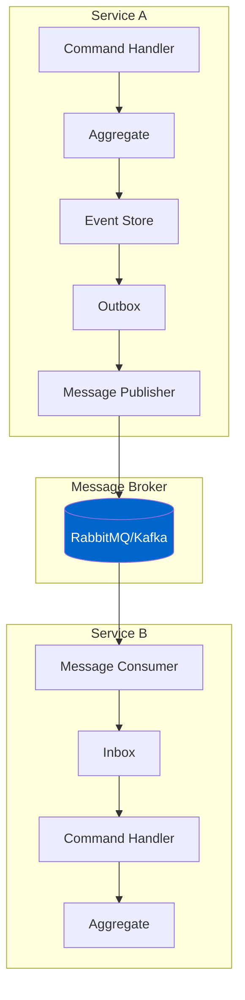

# Distributed Messaging

## Overview

Distributed Messaging enables reliable communication between services in a microservices architecture. Whizbang provides robust patterns for handling distributed transactions, ensuring message delivery, and maintaining consistency across service boundaries.

### Key Concepts

- **Outbox Pattern**: Ensure reliable message publishing
- **Inbox Pattern**: Handle duplicate messages and ensure idempotency
- **Message Routing**: Direct messages to appropriate handlers
- **Saga Coordination**: Orchestrate multi-service workflows

## Architecture Diagram

## Implementation Guide

*Documentation in progress - This page demonstrates the structure for distributed messaging patterns with Whizbang.*

### Topics to Cover:

1. **Outbox Pattern Implementation**
   - Transactional outbox
   - Message publishing
   - Retry mechanisms

2. **Inbox Pattern Implementation**
   - Duplicate detection
   - Message ordering
   - Idempotent processing

3. **Message Broker Integration**
   - RabbitMQ configuration
   - Kafka setup
   - Azure Service Bus

4. **Error Handling**
   - Dead letter queues
   - Retry policies
   - Compensation

5. **Monitoring**
   - Message tracking
   - Latency metrics
   - Health checks

## Related Patterns

- **[Event Sourcing Basics](event-sourcing-basics.md)** - Foundation for event-driven messaging
- **[Saga Orchestration](saga-orchestration.md)** - Coordinate distributed workflows
- **[Microservices Integration](microservices-integration.md)** - Complete microservices setup

## Next Steps

- Review **[Distributed Messaging Roadmap](/docs/roadmap/distributed-messaging)** for upcoming features
- Explore **[Saga Orchestration](saga-orchestration.md)** for complex workflows
- Check **[Getting Started Guide](/docs/getting-started/getting-started)** for basics