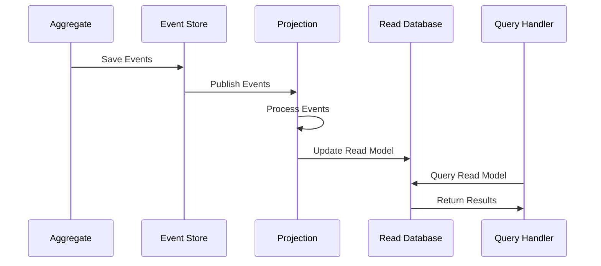

# Projections

Projections are the read-side component of CQRS in Whizbang. They create optimized, denormalized views of your data by subscribing to domain events and building read models tailored for specific query patterns.

## What are Projections?

Projections transform events from the write-side (aggregates) into read models optimized for queries:

- **Event Subscribers**: Listen to domain events as they occur
- **Read Model Builders**: Create denormalized views optimized for queries
- **Eventually Consistent**: Updated asynchronously as events are processed
- **Rebuildable**: Can be deleted and rebuilt from event history

## Key Benefits

### Query Optimization
- **Denormalized Data**: Flatten complex relationships for fast reads
- **Indexed Views**: Create optimal indexes for specific query patterns
- **Multiple Formats**: Same events can feed different projection formats

### Scalability
- **Independent Scaling**: Scale read and write sides independently
- **Caching Friendly**: Read models can be heavily cached
- **Distributed Reads**: Replicate read models across regions

### Flexibility
- **Multiple Projections**: Create different views from same events
- **Technology Choice**: Use different databases for different projections
- **Schema Evolution**: Add new projections without affecting writes

## How Projections Work



## Example Projection

```csharp
public class OrderSummaryProjection {
    private readonly IProjectionStore<OrderSummary> _store;

    public OrderSummaryProjection(IProjectionStore<OrderSummary> store) {
        _store = store;
    }

    // Event handler - creates new read model
    public async Task Handle(OrderPlacedEvent @event) {
        await _store.UpsertAsync(@event.OrderId, new OrderSummary {
            OrderId = @event.OrderId,
            CustomerId = @event.CustomerId,
            Total = @event.Total,
            Status = "Placed",
            PlacedAt = @event.PlacedAt
        });
    }

    // Event handler - updates existing read model
    public async Task Handle(OrderShippedEvent @event) {
        await _store.UpdateAsync(@event.OrderId, summary => {
            summary.Status = "Shipped";
            summary.ShippedAt = @event.ShippedAt;
            summary.TrackingNumber = @event.TrackingNumber;
        });
    }
}

public class OrderSummary {
    public Guid OrderId { get; set; }
    public Guid CustomerId { get; set; }
    public decimal Total { get; set; }
    public string Status { get; set; }
    public DateTime PlacedAt { get; set; }
    public DateTime? ShippedAt { get; set; }
    public string? TrackingNumber { get; set; }
}
```

## Projection Types

### Simple Projections
- **Single Entity**: One event stream → One read model
- **Direct Mapping**: Events map directly to read model properties
- **Use Case**: Basic CRUD operations, simple reporting

### Composite Projections
- **Multiple Streams**: Events from multiple aggregates
- **Joined Data**: Combine data from different domains
- **Use Case**: Complex reports, dashboards, analytics

### Cached Projections
- **Memory-Based**: Keep frequently accessed data in memory
- **High Performance**: Sub-millisecond query times
- **Use Case**: Real-time dashboards, autocomplete

## Configuration

```csharp
services.AddWhizbang(options => {
    options.UseProjections(proj => {
        // Register projection
        proj.RegisterProjection<OrderSummaryProjection>(p => {
            p.Subscribe<OrderPlacedEvent>();
            p.Subscribe<OrderShippedEvent>();
            p.Subscribe<OrderCancelledEvent>();
        });

        // Configure backfilling
        proj.BackfillFromBeginning = true;
        
        // Configure partitioning
        proj.PartitionBy = @event => ((dynamic)@event).OrderId;
    });
});
```

## Advanced Features

### Backfilling
- **Historical Data**: Process events from before projection was created
- **Incremental**: Resume from last processed event
- **Parallel**: Process multiple partitions concurrently

### Event Filtering
- **Selective Processing**: Only process relevant events
- **Pattern Matching**: Subscribe to events by type or properties
- **Performance**: Reduce unnecessary processing

### Schema Evolution
- **Versioning**: Handle projection schema changes
- **Migration**: Update existing read models
- **Backward Compatibility**: Support multiple projection versions

## Best Practices

### Design for Queries
- **Query-First**: Design projections around actual query needs
- **Denormalize**: Include all data needed for queries
- **Index Appropriately**: Add indexes for query patterns

### Handle Failures
- **Retry Logic**: Handle transient failures
- **Dead Letter Queues**: Capture failed events
- **Monitoring**: Track projection health and lag

### Performance Optimization
- **Batch Processing**: Process events in batches
- **Async Processing**: Use async/await throughout
- **Connection Pooling**: Optimize database connections

## Storage Options

Whizbang supports multiple projection storage backends:

- **SQL Databases**: Postgres, SQL Server, MySQL
- **Document Stores**: MongoDB, CosmosDB
- **Search Engines**: Elasticsearch, Azure Search
- **Key-Value Stores**: Redis, DynamoDB
- **Memory**: In-memory caching

## Related Topics

- [Core Concepts](./core-concepts.md) - Overview of CQRS and event sourcing
- [Projection Subscriptions](./Projections/projection-subscriptions.md) - Configuring event subscriptions
- [Projection Contexts](./Projections/projection-contexts.md) - Managing projection lifecycle
- [Getting Started](./getting-started.md) - Tutorial building your first projection

## Next Steps

This page provides an overview of projections in Whizbang. For detailed implementation patterns and advanced scenarios, explore the specialized projection documentation in the Projections section.