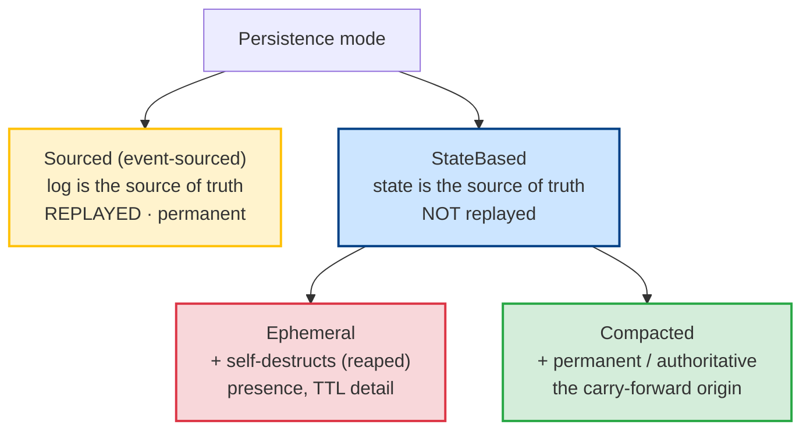

# Carry-forward / Tier-2 (Compaction)

**Archival & Compaction** (A1 — its own proposal) closed the books on **durable Sourced** streams. **E3 is its state-based twin.** Where A1's carry-forward is a durable Sourced event, E3 folds a state-based stream's detail into an authoritative **`Compacted`** carry-forward — the designated perspective's model, frozen as the new origin — and drops the folded detail. The `Compacted` head is the source of truth from there on; the compacted stream replays only back to it. This is the principled form of "snapshot-as-authority": the surviving state is a **legitimate new origin**, not a severed cache.

E3 implements the one disposition E2 declared but deferred: **`Disposition.Compact`**.

:::planned
E3 is a proposed capability (unreleased, not yet started). It consumes [E2](destruction-hooks-ttl) (the `PreDestruction` hook returns `Compact`) and reuses E1's authoritative state-based snapshots + the reap-driven snapshot step. It also introduces the **`StateBased`** base concept described below, a small refactor of E1's `[Ephemeral]` — so it lands *after* that extraction.
:::

## Two axes: replay and lifecycle — where `Compacted` fits

The naming trap E3 has to avoid: **"ephemeral" bundles two independent ideas** — *not replayed* **and** *self-destructing* — and a compaction summary is the first but the opposite of the second. So the model factors them apart. There are two axes:

- **Replay** — is state rebuilt by replaying these events? **Sourced** = yes (the log is the source of truth). **StateBased** = no (the current state / snapshot is the source of truth).
- **Lifecycle** — **permanent**, or **self-destructing** (reaped after its purpose).

|  | **replayed** (log is truth) | **not replayed** (state is truth) |
|---|---|---|
| **permanent** | **Sourced** | **`Compacted`** — the authoritative frozen carry-forward |
| **self-destructing** | *(illegal — you can't replay what deleted itself)* | **Ephemeral** — presence, TTL detail |

The `permanent × replayed` cell is `Sourced`; the `self-destructing × not-replayed` cell is `Ephemeral`; the compaction summary lives in the **`permanent × not-replayed`** cell that previously had no name. And the fourth cell is a contradiction — you cannot replay events that self-destructed — so it is unrepresentable, not merely discouraged.

That makes the base concept clean: **`StateBased`** = "not replayed, the current state is the source of truth", with two lifecycles beneath it.



Read as overlap: **`Ephemeral` and `Compacted` share `StateBased`** (neither is ever replayed from the log — both refuse `RebuildFromEvents`), and they differ only on lifecycle. **`Compacted` and `Sourced` share permanence** (both survive forever) but differ on replay. Each node owns exactly one responsibility — `StateBased` owns "no replay", `Ephemeral` owns "self-destructs", `Compacted` owns "permanent authority" — which is what makes the guardrails fall into the right place:

- **Replay guards** (no `RebuildFromEvents`, no rewind-from-zero, homogeneous streams) key off **`StateBased`**, so they cover ephemeral *and* compacted streams automatically. (Keying them off "ephemeral" would let a compacted stream slip past.)
- **The reaper** keys off **self-destruction = `Ephemeral` only**. Because `Compacted` is permanent *by mode*, the reaper never targets it — the authoritative origin is protected because of *what it is*, with no "hold it forever" workaround.
- **Homogeneity** generalizes from "all-Sourced or all-Ephemeral" to "all-Sourced or all-**StateBased**": a state-based stream of ephemeral detail with a permanent `Compacted` head is legal (no Sourced event in it), and no-laundering still holds (`Compacted` is not Sourced).

## Why Tier-2 is the well-defined fold

A1's key correction was: **a stream has no model**, so the framework can't auto-fold a Sourced stream. Tier-2 is the exception A1 named as mechanism *(c)*: a stream whose **designated perspective is authoritative**. For such a state-based stream there is exactly one canonical model (the authoritative perspective's), the events are triggers rather than durable facts, and E1 already makes the snapshot the authority (the rewind floor, never `RebuildFromEvents`). So Tier-2 compaction = **freeze the authoritative model as a `Compacted` origin, then drop the folded detail** — shrinking a state-based stream while keeping it state-based.

## The `Compacted` carry-forward

A compaction is written as a **`Compacted` event at the stream head** — the carry-forward / new origin, à la Marten's `Compacted<T>` — but typed **`[Compacted]`** (StateBased + permanent), **not `[Ephemeral]`**:

```csharp{title="Compacting a state-based stream to its authoritative summary" description="A PreDestruction hook returns Compact; the fold freezes the model as a permanent Compacted origin, then truncates the ephemeral detail." category="Architecture" difficulty="ADVANCED" tags=["state-based","compaction","carry-forward"] framework="NET10"}
// The authoritative perspective's model IS the fold. A PreDestruction hook chooses Compact:
public ValueTask<DestructionResult> OnBeforeDestructionAsync(DestructionContext ctx, CancellationToken ct) =>
  ValueTask.FromResult(DestructionResult.Proceed(Disposition.Compact));   // fold, don't just delete

// The fold appends a permanent Compacted origin carrying the model, then truncates the folded ephemeral
// detail below it. The Compacted head is [Compacted] (StateBased + permanent) so the reaper never touches it.
```

Rules (mirroring A1's coalescing, which E3 shares):

- A new `Compacted` event **truncates everything before it, including any prior `Compacted`** — a stream holds **at most one origin at its head**; successive compactions **coalesce into one**. Idempotent.
- The `Compacted` origin is **permanent StateBased**, never a Sourced event — the [E1 no-laundering invariant](ephemeral-events#ephemeral-is-viral-it-taints-derived-read-state) holds: `Compact` shrinks a state-based stream while keeping it state-based; it does not "promote to durable/Sourced".
- Replay after compaction goes back **only to the `Compacted` origin** — there is no archive (the folded detail was ephemeral). The `Compacted` head is the floor.

## Snapshot-as-authority — mostly already built

E1 already did the load-bearing work: state-based perspectives snapshot on an aggressive single-slot cadence, the reap-driven step drives a snapshot before the reap, the coverage gate holds the reap until the snapshot floor exists, and `RebuildFromEvents` is refused (rewind reads the snapshot, never replays reaped bodies). **E3 reuses all of it.** The per-perspective **snapshot** is the *local* authoritative floor; the **`Compacted` head** promotes that state to a first-class, log-visible, propagatable origin (a state-based event **does** cross service boundaries, so downstream services receive the authoritative summary). E3 adds: the `Disposition.Compact` handler that writes the snapshot as a permanent `Compacted` head, and the coalescing rule above.

## Document-style per-record versioning

Because a `Compacted` origin is authoritative and there is **no event log to rebuild from**, its schema can't evolve by replay. E3 adopts state-based storage's migration model instead — **document-style per-record versioning**:

- Each compacted record is **schema-version stamped** (reusing `SnapshotEnvelope`'s version).
- On a schema change, records are **upgraded, not rebuilt** — a developer per-record transform (`vN → vN+1`), applied by a **deploy-time batch runner** and/or **lazy-on-access**.
- This reuses the [Schema Evolution](schema-evolution) upcasting machinery, applied to the compacted record rather than to a replayable stream.

## What E3 builds on, and what it defers

**Reuses (no new mechanism):** E2's `PreDestruction` hook + `Disposition.Compact`; E1's authoritative state-based snapshots, reap-driven snapshot step, coverage gate, and rewind guard; the `SnapshotEnvelope` version stamp; the [Schema Evolution](schema-evolution) upcasting seam.

**Adds:** the **`StateBased` base concept** extracted from `[Ephemeral]` (the replay guards + homogeneity re-home onto it — see build increments); the **`[Compacted]`** mode (StateBased + permanent) + its `Compacted` event contract; the `Disposition.Compact` fold handler (freeze model → append `Compacted` head → truncate detail, coalescing); the per-record schema-version stamp + upgrade transform + a deploy-time / lazy record-upgrade runner.

**Defers / out of scope:** archival of the folded detail (there is none — the data was ephemeral; that is A1's Sourced concern); Sourced-stream compaction (A1); GDPR crypto-shred of a compacted record (G1 — orthogonal).

## Observability & tests

**OTel:** compactions attempted / succeeded; compacted-record created / size; records upgraded (batch + lazy) + duration; coalesced-compaction count; compact-point replay-floor gauge.

**Regression invariants to lock** (E1/E2 discipline — completion signals, not `Task.Delay`):
- **`StateBased`-not-ephemeral is guarded but not reaped** — a `[Compacted]` type refuses `RebuildFromEvents` / rewind-from-zero (StateBased) yet the reaper never targets it (permanent). This is the invariant that makes the whole factoring pay off.
- **Compact freezes the summary BEFORE dropping the detail** — inject a failure at the freeze-commit boundary and assert no state loss.
- **Coalescing** — successive compactions collapse to one head origin.
- **No laundering** — a `Compact` handler cannot emit a Sourced event from state-based data (analyzer + runtime).
- **Record upgrade** — a schema-changed compacted record upgrades `vN → vN+1` (batch and lazy) and never replays from events.

## Build increments (docs-first, then TDD per slice)

1. **Extract `StateBased`** — factor the "not replayed / state is truth" property out of `[Ephemeral]` into a `StateBased` base that both `[Ephemeral]` and (increment 2's) `[Compacted]` imply. Re-point the replay guards (rebuild/rewind refusal, homogeneity) from "is-ephemeral" to "is-state-based"; the reaper stays keyed on self-destruction (Ephemeral). Lock: a StateBased-but-not-ephemeral type is **guarded but not reaped**.
2. **`[Compacted]` mode + `Compacted` event** — StateBased + permanent; the reaper never targets it. The event contract carries the model JSON + a schema-version stamp.
3. **`Disposition.Compact` fold handler** — freeze the authoritative snapshot as a `Compacted` head, then truncate the folded ephemeral detail via the A1 gated-truncate. No origin-protection needed (the head is permanent by mode).
4. **Coalescing** — a `Compacted` event truncates a prior `Compacted`; successive compactions coalesce to one head origin; idempotent.
5. **Per-record versioning + upgrade runner** — schema-version stamp + `vN → vN+1` transform, deploy-time batch and lazy-on-access; reuses the schema-evolution seam.

Increment 1 is the load-bearing refactor; 2–3 deliver the fold; 4–5 make a compacted record safely evolvable.
