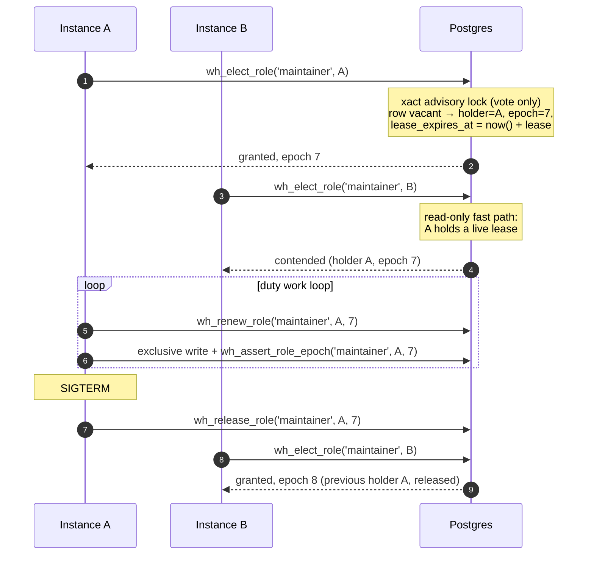

# Duty Role Assignment

**The advisory lock decides only the vote. The role is a row: a liveness-tied assignment with an epoch that exclusive work presents as a fencing token.**

:::new
**Implemented, on by default** (library migrations `173_RoleAssignments.sql` and `184_RoleAssignmentResilience.sql`, `PgRoleElector`, `DutyHolderWorker`). Tracks GitHub issue #966; the design questions are decided on #968 (section 11). The Postgres driver holds the `maintainer` and `migrator` duties and the commit-order stamper's leadership as role assignments. `Whizbang:Database:RoleAssignment:Enabled = false` returns every duty to the session-lock model described on [Capabilities and Duties](/v1.0.0/operations/startup/capabilities-and-duties). Section 10 lists the phases and what each one delivered.
:::

## 1. Why the session lock is not enough

Today a duty (`migrator`, `maintainer`) is a **session advisory lock** held on a dedicated connection for the holder's entire tenure. The capability row written by `record_capability` only reports who holds it: *the lock decides, the row reports*. That model is simple and has no timeout to tune, and it has three standing costs:

1. **One pinned direct connection per held duty.** A session lock does not survive a transaction-pooling front end, so every holder needs a connection that bypasses the pooler, and keeps it for as long as it holds the duty.
2. **No way to take a duty away from a holder that is alive but unhealthy.** The lock is released when the session ends. A holder whose event loop is blocked, or whose work connection is wedged, keeps its session and therefore keeps the duty. The same is true of a half-open TCP session after a hard kill, which holds the lock until the operating system's keepalive notices, by default two hours.
3. **A duty is consulted only when something asks for it.** A startup step with `RequiredCapability = maintainer` and `NonHolderBehavior.Skip` asks once, at that instance's startup. In a rolling deploy the old-version pod still holds the duty while every new pod starts, so each new pod is told "held elsewhere" and skips. When the old pod finally stops, nobody is asking any more, and the step never runs.

## 2. The model in one screen



Five pieces:

1. **The vote.** A single SQL function, `wh_elect_role`, run as one statement. It takes a *transaction-scoped* advisory lock keyed on the role, re-reads the assignment, voids it if it has lapsed, and assigns the caller if the role is free. The lock is released when the statement commits. Because the whole vote is one statement, a client that stalls cannot hold the vote lock: the server runs the statement to completion without a round trip to the client.
2. **The assignment.** `wh_role_assignments` has one row per role: holder instance id, epoch, `assigned_at`, `renewed_at`, `lease_expires_at`, the lease length, the election count, and the last vacancy (who, when, why). **That row is the authority from then on.** It is a virtual lock that needs no session and no pinned connection, and it survives a database restart.
3. **Liveness.** The assignment is valid while its lease is unexpired **and** the holder is registered in `wh_service_instances` **and** is not tombstoned in `wh_instance_evictions`. The lease is extended only by the holder's own work loop (`VerifyStillHeldAsync` renews it), never by a separate timer. Reaping, eviction and a lapsed lease all void the assignment at the next vote.
4. **Fencing.** Every assignment carries an **epoch**, incremented on each new assignment and never reused. Exclusive work presents `(holder, epoch)` to `wh_assert_role_epoch` in the same transaction as its writes. A stale epoch raises SQLSTATE `WHF01` and the transaction's writes roll back. The check runs in SQL, where no paused process can argue with it.
5. **Release.** A graceful shutdown releases the role (`wh_release_role`) so the next vote hands it off at once rather than after the lease lapses.

### What the advisory lock still does, and what it no longer does

| Question | Session-lock model (released) | Role-assignment model (this proposal) |
|---|---|---|
| Who decides the holder | The session lock, for the whole tenure | The vote, under a transaction lock held for milliseconds |
| What proves the holder is still the holder | The session is still open | The row: unexpired lease, registered, not tombstoned |
| Connection needed while holding | One pinned direct connection per duty | None. Every call is one statement on any pooled connection |
| A stuck-but-alive holder | Keeps the duty indefinitely | Stops renewing, lapses, loses the duty |
| A hard-killed holder on a half-open socket | Keeps the lock until TCP keepalive (up to hours), bounded only by the reaper's definitive-dead cutoff | Lapses after one lease |
| Database restart or failover | Every session lock is lost; election restarts from nothing | Rows survive; the holder renews the same epoch |
| A paused holder that wakes up after losing the duty | Its session died, so its lock is gone; its writes are not fenced | Its writes present a stale epoch and are refused in SQL |

## 3. Schema

```sql
CREATE TABLE IF NOT EXISTS __SCHEMA__.wh_role_assignments (
  role                     TEXT PRIMARY KEY,
  holder_instance_id       UUID,                 -- NULL = vacant
  epoch                    BIGINT NOT NULL DEFAULT 0,
  assigned_at              TIMESTAMPTZ,
  renewed_at               TIMESTAMPTZ,
  lease_expires_at         TIMESTAMPTZ,
  lease                    INTERVAL,
  election_count           BIGINT NOT NULL DEFAULT 0,
  last_holder_instance_id  UUID,
  last_vacated_at          TIMESTAMPTZ,
  last_vacated_reason      TEXT                  -- released | lapsed | evicted | unregistered
);
```

There is deliberately **no foreign key** to `wh_service_instances`. A cascade would delete the row and lose the epoch, and the epoch must never go backwards. A reaped holder is detected by the vote, which voids the assignment and records why.

The row is never deleted. A release or a void sets the holder to NULL and keeps the epoch, so the next assignment is `epoch + 1` whatever happened in between.

### Functions

| Function | What it does | Locking |
|---|---|---|
| `wh_elect_role(role, instance, lease, cooldown, legacy_lock_key)` | The vote. Returns `outcome` (`granted`, `held`, `contended`, `cooling_down`, `legacy_holder`, `refused`), the holder, the epoch, the lease remaining, and the previous holder and void reason when this vote replaced one | Read-only fast path when a live holder exists; otherwise `pg_advisory_xact_lock` on the role plus `FOR UPDATE` on the row |
| `wh_renew_role(role, instance, epoch)` | Extends the lease by the stored lease length, from `now()`. Refuses a lapsed lease, a wrong epoch, and a tombstoned holder | One `UPDATE … WHERE` |
| `wh_release_role(role, instance, epoch)` | Vacates the role with reason `released`, only when `(instance, epoch)` is current | One `UPDATE … WHERE` |
| `wh_assert_role_epoch(role, instance, epoch)` | The fence. Raises `WHF01` unless `(instance, epoch)` is the current, unexpired, non-tombstoned assignment. Takes `FOR SHARE` on the row, so a re-vote cannot commit between the check and the caller's commit | `FOR SHARE` on the row |
| `wh_role_assignment_status()` | One row per role with holder, epoch, timestamps, lease remaining, election count, last vacancy, and a computed `state` of `held`, `lapsed` or `vacant` | None |

The vote also writes and removes the `wh_instance_capabilities` row through `record_capability` and `release_capability`, so every surface that reads holdings today keeps working. In this model the capability row still *reports*; the difference is that the assignment row, not a session, is what it reports on.

### Added in migration 184

Migration 184 is the last word on every role function, and is a bootstrap region, because the migrator is elected before migrations run.

| Function | What it does |
|---|---|
| `wh_vote_role(role, instance, lease, cooldown, legacy_lock_key, version_key, bridge_pid)` | The vote, with the per-duty lease, the caller's version (for the drain and the newest-version preference) and its bridge session. Adds the outcomes `draining` and `deferred` |
| `wh_vote_roles(roles[], leases[], instance, cooldown, legacy_lock_keys[], version_key)` | Several votes in one statement, in role order |
| `wh_renew_role_lease(role, instance, epoch, legacy_lock_key)` | Renewal answering `renewed`, `drain` or `lost`; an unbridged holder passes the legacy key and steps aside for a session-lock holder it sees |
| `wh_mark_role_duty_backend(role, instance, epoch, mark)` | Marks, or clears, the calling backend as the one running the duty's statement (the backstop) |
| `wh_end_lapsed_bridge(role, legacy_lock_key)` | Ends a lapsed bridged holder's legacy-lock session, and only that one |
| `wh_request_role_drain(role, instance, lease, version_key)` | A bridged caller that could not take the legacy lock records its candidacy and asks an older live holder to drain; assigns nothing |
| `wh_elect_role`, `wh_renew_role` | The phase 1 entry points, kept as wrappers for an instance on the release before |

The row gained the holder's version key, the drain request, the marked duty backend, the bridge session and whether the last involuntary vacancy was fleet-wide; `wh_role_candidates` records who is voting for each role, on which version.

### The vote lock key

`pg_advisory_xact_lock((table_oid << 32) | hashtext(role))`, where `table_oid` is the oid of this schema's `wh_role_assignments`. Keying on the table's oid makes the lock schema-scoped by construction (issue #962) with no schema name handled as text, which also absorbs the two migration runners' different `__SCHEMA__` substitutions. A collision with another advisory-lock family can only make a vote wait a few milliseconds longer. It can never change the outcome, because the row, not the lock, is the authority.

## 4. Time: every bound is computed by the database

Every timestamp in the row is written with `now()` inside the statement, and every comparison is made against `now()` in the next statement. No instance clock ever reaches the table. The function returns the **remaining** lease as an interval, a duration rather than an instant, so a caller measuring against it uses its own monotonic clock and is unaffected by skew between its wall clock and the database's.

The one place two clocks meet is a database failover, when the new primary's `now()` is compared with timestamps the old primary wrote. NTP-synchronized servers keep that skew to milliseconds, against leases measured in seconds.

## 5. Liveness, lapse and hysteresis

**The lease is renewed by the work loop, not by a timer.** `IDutyGrant.VerifyStillHeldAsync` was already the call "a long-tenure holder makes before each unit of exclusive work". In this model it renews the lease. A holder whose loop is stuck, whether blocked on a thread, awaiting a wedged connection, or paused by the operating system, stops calling it and lapses. A separate renewal timer would keep a stuck holder alive, which is the failure this is meant to remove.

Renewals are throttled locally: within one `RenewInterval` of the last successful renewal, measured on the monotonic clock from the moment that request was *sent*, `VerifyStillHeldAsync` answers from memory. That is safe because the database computed the lease from a later instant than the send, and `RenewInterval` is a fraction of the lease. The throttle only saves round trips. It never lets a write through, because writes are fenced in SQL.

A renewal that fails for a transient reason (the database unreachable for a moment) answers false without giving up the grant, because the lease may still be valid and the next verify asks again. An explicit refusal (a lapsed lease, a wrong epoch, a tombstone) loses the grant for good, and a lost grant never asks the database again.

**Hysteresis** has two parts:

- **The lapse threshold is several missed beats.** `lease = RenewInterval × MissedRenewalsBeforeLapse` (defaults 5 s × 3 = 15 s). One slow renewal does not cost the role.
- **A cool-down after an involuntary lapse.** An instance whose assignment was voided as `lapsed` cannot be re-elected for `CooldownAfterLapse` (default 15 s), so a slow instance cannot win the role back the moment it recovers and bounce it again. A graceful release carries no cool-down, because it was not a health signal.

**The failover bound** after a crash is therefore one lease plus the successor's next attempt, all measured in database time.

## 6. Mixed-version fleets: never both act

During a rolling deploy, old instances hold duties with session locks and new instances use rows. The two must never both act. They cannot see each other's mechanism unless one of them bridges, and old code cannot be changed, so the new code bridges in both directions:

| Direction | Mechanism |
|---|---|
| **New defers to old** | Bridge on (`HoldLegacySessionLock = true`, the default in this release): a new instance first takes the legacy session lock (`DutyLockKey`, the same key the old elector uses; the stamper's leader lock for the `commit-stamper` role) and votes only if it won. If an old instance holds it, the attempt is `Contended` and no assignment is written. Bridge off: the vote itself checks `pg_locks` for the legacy key held by another backend and answers `legacy_holder` |
| **Old defers to new** | Bridge on: the new holder keeps holding the legacy session lock for as long as it holds the role, so an old instance's `pg_try_advisory_lock` fails exactly as it would against an old holder. Bridge off: a holder's renewal also looks for the legacy lock, so an old instance that took it after the vote is seen within one renewal and the assignment steps aside (`last_vacated_reason = legacy_holder`) |

While bridged, the holder checks its bridge session on every verify, not only when it renews: once that session dies, an old instance can take the session lock, so "still held" can no longer be answered from memory. The bridge lock is released explicitly before its connection is closed, because a pooled connection returns to the pool with its session, and its advisory locks, still alive.

The bridge costs the pinned connection the new model exists to remove, so it is temporary. It is **on by default in this release**, because consumers upgrading from much older builds roll through it, and it will default to off in a later release. Turn it off early with `Whizbang__Database__RoleAssignment__HoldLegacySessionLock=false` once no instance older than role assignment remains. A bridged instance that loses the legacy lock still records its candidacy and can still ask an older holder to drain (`wh_request_role_drain`), so the bridge costs neither the drain nor the newest-version preference. With the bridge off, the `pg_locks` check still refuses a vote while an old holder is visible, and a holder steps aside within one renewal once it sees one, but an old instance that takes the session lock *after* the vote acts alongside the new holder for up to that one renew interval. The chaos suite runs this deploy both ways.

While the bridge is on, a stuck new holder keeps its bridge session, so the session lock would block every other instance until that session died. Decision 4 of #968 removes that wait: once the assignment row says the holder has lapsed, the next would-be winner ends that holder's legacy-lock session, and only that one (section 11).

### Migration path from `PgDutyElector`

1. **Phases 1 and 2.** Migration 173 is additive. `PgRoleElector` shipped beside `PgDutyElector`, opt-in through `AddWhizbangRoleAssignment()`, with the acquisition hook (section 7).
2. **Phases 3 and 4, shipped together.** Role assignment is the Postgres driver's default registration, still bridged, and the migrator is held by assignment. The session-lock elector remains as the delegate for any duty that is not a role, and as the whole elector when `Enabled = false`.

3. **A later release.** The bridge defaults to off.

**Upgrading.** A rolling deploy from a release that held duties by session lock needs nothing: the bridge is on by default. A deploy from a release that already had role assignment on needs nothing: the phase 1 entry points (`wh_elect_role`, `wh_renew_role`) keep working for the old instances, which count as the oldest version, so the role moves to the new release (section 11, decisions 2 and 3).

**The migrator** moved in phase 4. Its vote is part of the schema bootstrap closure (migration 184 is a bootstrap region), so the assignment table and functions exist before the first migration. Migrator waiters watch the assignment row (`MigratorWatch`), and the duty's session lock too, for a migrator on an older release. The migrator holds its role for one migration and releases it, so the holder loop never holds it and the `roles` health component reports it only when it lapsed mid-run.

## 7. The acquisition hook and "pending until done"

When an instance *becomes* the holder, whether at startup, on a lapse, or on a hand-off, duty-bound work that is still pending runs **then**. That is what closes the rolling-deploy gap: the new pod that finally wins `maintainer` runs the rewrite the old pod never ran.

For the new holder to know what is pending, a duty-bound step declares its pending state durably: a pending-work row keyed by (role, step), written when the work becomes owed and cleared only when it is confirmed done. The table-rewrite requests already follow this pattern: a request is cleared only after the ratio is confirmed to have dropped. The hook reads the owed rows for the role it just won and runs their steps with the grant's epoch. Work must be idempotent and resumable, because a hand-off can interrupt it.

### As built (phase 2)

- **Owing.** `wh_owe_role_work(role, work_key)` is idempotent: owing again moves `last_owed_at` and keeps `first_owed_at`. A startup step with `NonHolderBehavior.Skip` that an instance skips as a non-holder is owed automatically, so every new pod in a rolling deploy owes the step, and the pod that wins the role runs it once.
- **Running.** `DutyHolderWorker` is the holder loop. Each pass verifies the role it holds (which renews the lease, so the loop is the liveness signal), or votes for one it does not, then runs every due piece of owed work it has a handler for. A pass runs once per renew interval and at once when `wh_role_released` announces a release. On stop, it releases what it holds.
- **Completing.** `wh_complete_role_work` is fenced by `(holder, epoch)` and deletes the row only if nobody owed it again after the holder listed it. `wh_fail_role_work` records the error and backs the work off, doubling from `OwedWorkRetryBase` and capped at one hour. If the fence refuses either call, the loop drops the grant at once.
- **One process, one tenure.** A second acquisition of a role this instance already holds returns another handle on the same tenure, so the holder loop and a startup step can hold the role together; the last handle to close releases it.
- **Deferring.** A step owed while this instance's own startup pipeline is still running is deferred, not failed, so the loop never blocks and its lease keeps moving.

## 8. Several roles, "no holder", and observability

**Several roles.** Each role is its own row with its own epoch and lease, so an instance can hold `maintainer` while another holds the `commit-stamper` role for the same schema, and a lapse of one never disturbs the other. The holder loop votes for every role it does not hold in one call, which the elector turns into one statement (`wh_vote_roles`), voting in role order so two instances voting for overlapping sets take the vote locks in the same order. A bridged elector votes one role at a time, because each role's legacy lock has to be taken first.

**No holder at all.** `wh_role_assignment_status()` reports `vacant` or `lapsed` for a role nobody validly holds, and how much work is owed to it. The `roles` health component reports *role unassigned* with the reason (vacant and why it was last vacated, lapsed and why, or never elected), Degraded rather than Faulted; a read that fails is Degraded too. A caller that cannot reach the vote gets `Unavailable` or a transient failure, never a grant, so nothing ever runs everywhere at once by default.

**Observability.** The current holder, epoch, last renewal, election count, any drain request and whether the duty backend is running a statement are one query. Each hand-off is logged **once**, by the winning instance only, since exactly one vote produces each epoch, with the previous holder and the void reason. A lost grant is logged by the instance that lost it, a drain by the instance that drained, and an ended bridge session by the instance that ended it. Meter `Whizbang.Roles`: `whizbang.roles.elections`, `whizbang.roles.handoffs{reason}`, `whizbang.roles.lost`, `whizbang.roles.released`, `whizbang.roles.held` (up/down), `whizbang.roles.work_runs{outcome}` (completed, left_owed, fenced), `whizbang.roles.drains` and `whizbang.roles.bridge_sessions_ended`, all tagged by role. `IRoleAssignmentReader.ReadAssignmentsAsync` returns the same snapshot the health component reads.

## 9. The resilience requirements, mechanism by mechanism

| # | Requirement | Mechanism | Test (phase) |
|---|---|---|---|
| 1 | Never two holders acting at once | Epoch per assignment; `wh_assert_role_epoch(role, holder, epoch)` in the writer's transaction raises `WHF01` for a stale epoch; `FOR SHARE` keeps a re-vote from committing mid-write; holder is part of the fence, so an epoch reissued after an async-replica failover still fails | Stale epoch refused in SQL, its write rolled back (1) |
| 2 | Holder crash or `kill -9` | Lease lapses in database time; the next vote voids it (`lapsed`) and assigns a new epoch. No session or TCP timeout is involved | Crashed holder voids after the lapse bound, time advanced in the database (1); kill -9 chaos run, work finished once by the next holder (4) |
| 3 | Holder alive but stuck | Lease renewed only by `VerifyStillHeldAsync` from the work loop; no renewal thread. One long statement is covered by the duty-backend backstop, not by a timer | Unrenewed lease lapses although the instance still heartbeats (1); SIGSTOP mid-duty and partition chaos runs (4) |
| 4 | Clock skew | Every timestamp is `now()` in the statement; remaining lease is returned as a duration | Time advanced only in the database, never on the instance (1); an instance clock hours ahead neither extends nor shortens the lease (4) |
| 5 | Flapping | Lease = several renew intervals; cool-down after an involuntary lapse, except a fleet-wide one | Lapsed holder refused during cool-down, another instance wins (1); a fleet-wide lapse skips the cool-down, one holder's own lapse keeps it (3) |
| 6 | Graceful shutdown | Grant disposal and host shutdown call `wh_release_role`; no cool-down for a release; the release NOTIFY wakes waiters | Release hands off at once, no lapse wait (1); NOTIFY delivered, loop wakes (2) |
| 7 | Work interrupted mid-duty | Acquisition hook (`DutyHolderWorker`) plus pending-work rows; completion fenced and guarded against re-owing | Rolling-deploy gap closed end to end; interrupted work finished once by the next holder, stale write refused (2) |
| 8 | Database failover or restart | Assignment is a row, so it survives; the grant holds no connection; every vote re-evaluates liveness against `now()` | Assignment and epoch survive every connection being terminated (1); the server restarted for real, the holder keeps its epoch and the owed work runs once (4) |
| 9 | No holder at all | `wh_role_assignment_status()` state `vacant` / `lapsed`; `roles` health component "role unassigned"; no grant without a vote | Status reports vacant after release (1); health source and reader (2) |
| 10 | Observability | Status function and reader; one hand-off log line by the winner; `Whizbang.Roles` meters | Status reflects holder, epoch, count (1); reader and meters (2) |

### The chaos suite (phase 4)

Kill the holder; pause it (`SIGSTOP`) mid-duty; partition it from the database; skew its clock; lose the database for longer than a lease; restart the database server; run a rolling deploy from the session-lock release (bridged and not) and from an older role-assignment release; start ten instances at once. In every case: at most one epoch writes, a new holder appears once the lease lapses in database time and not before, and pending duty work completes exactly once.

Each simulated instance is its own elector, owed-work store and holder loop over its own connections. The work writes its effect under the epoch fence in the same transaction, which is what "at most one epoch writes" counts. Database time is advanced by shifting stored instants back, a pause is a gate the test opens, a partition is a TCP forwarder the test cuts and heals, and the restart is a real one, of a server started for that test alone, whose readiness is read from its own log. Nothing sleeps. Tests: `RoleAssignmentChaosTests`, `RoleAssignmentDatabaseRestartChaosTests`.

## 10. Phases

| Phase | Delivered |
|---|---|
| **1** | Migration 173; vote, renew, release, fence and status SQL; `PgRoleElector` behind `IDutyElector` with epoch on the grant, renew-on-verify, release on dispose and on shutdown, and the legacy-lock bridge; opt-in registration |
| **2** | Acquisition hook and pending-work rows; health component "role unassigned"; metrics; release NOTIFY so waiters retry at once |
| **3** | Default registration, with the options bound from `Whizbang:Database:RoleAssignment`; the commit-order stamper's leader as the `commit-stamper` role, renewed by its stamping loop, every stamp fenced; per-duty leases and the duty-backend backstop for one long statement; the multi-role vote; cooperative drain and the newest-version preference |
| **4** | The chaos suite; the bridge kept on by default for this release (off by default later), with a renewal-time legacy check for when it is turned off; the migrator held by assignment, its vote in the bootstrap closure (migration 184), its waiters watching the row; ending a lapsed bridged holder's lock session; the fleet-wide lapse exempt from the cool-down |

### The stamper's leader as a role

The commit-order stamper used a session advisory lock per schema to make one instance stamp. With role assignment on, its leader is the `commit-stamper` role instead, one per schema because the assignment table is per schema. The stamping loop is the renewer: each iteration verifies the grant before it stamps, and the loop never waits longer than one renew interval, so a stamper that stops looping stops renewing. Every stamp runs in a transaction with `wh_assert_role_epoch`, so a stamper that lost the role cannot stamp: its stamp is refused and rolled back, and it stops leading. A non-holder votes on `LeaderElectionRetry` and at once when the role's release is announced. A newer-version instance asking for the role gets it after the stamp in progress. The stamp itself already skipped rows another stamper had locked, so the fence makes the singleton exact rather than making the stamp correct.

## 11. Decisions (#968)

Phase 1 left five questions open; they were decided on #968 and built in phases 3 and 4.

1. **A long single statement against the lease: both.** Each duty can declare its own lease (`RoleAssignmentOptions.RoleLeases`; the migrator's default is 30 seconds), and the vote also treats a holder as live while the backend it marked for its duty is running a statement, as a backstop. The holder marks the backend that is about to run the statement (`PgRoleElector.MarkDutyBackendAsync`, `wh_mark_role_duty_backend`) and clears the mark when the statement's scope ends, so a pooled connection reused for other work never keeps the role. The mark names the backend by pid **and** backend start, so a reused pid never counts, and only the `active` state counts: an idle backend, or one whose client stopped between statements, does not. The fence treats the holder as live exactly when the vote does. The migrator marks its DDL connection and renews between phases. Tests: `RoleAssignmentResilienceSqlTests.Vote_TreatsAnExpiredHolderAsLive_WhileItsMarkedDutyBackendRunsAStatementAsync`, `RoleAssignmentResilienceE2ETests.MarkDutyBackend_KeepsTheRoleThroughAStatementThatOutlastsTheLeaseAsync`.
2. **Hand-off while alive: cooperative drain.** Every vote presents the caller's library version (`LibraryVersionKey`, an integer array in SemVer order). A caller on a newer version than a live holder asks it to drain, once; the vote answers `draining`. The holder learns it on its next renewal (`wh_renew_role_lease` answers `drain`, and `IDutyGrant.DrainRequested` turns true), finishes the step it is on, starts no other, and releases. Tests: `Vote_ByANewerCaller_AsksTheOlderHolderToDrain_OnceAsync`, `DutyHolderWorkerTests.ADrainRequest_FinishesTheStepInHand_ThenReleasesTheRoleAsync`, `CommitOrderStamperRoleTests.ALeaderAskedToDrain_ReleasesTheRole_AndTheNewerInstanceTakesItAsync`.
3. **A vacant role prefers the newest library version; among equals, the first valid caller.** Every vote records the caller's candidacy (`wh_role_candidates`). A caller is `deferred` while a live candidate on a newer version is voting for the same role. A candidate is live while it voted within the lease, is registered and is not tombstoned, and one that is cooling down does not count, so a stopped or slow newer instance holds the role up for at most one lease. Tests: `Vote_ForAVacantRole_DefersToALiveCandidateOnANewerVersionAsync` and the two `StopsDeferring` tests.
4. **A stuck holder while bridged: end its lock session.** A grant records the holder's bridge session (pid and backend start). When a bridged would-be winner cannot take the legacy lock and the row says the holder has lapsed, `wh_end_lapsed_bridge` ends that session, and only that one: it must still hold this role's legacy lock, and the vote lock serializes the request, so a fleet asking together ends it once. It waits for the session to exit, so the lock is free when it returns. The winner logs it and counts it in `whizbang.roles.bridge_sessions_ended`. Tests: `EndLapsedBridge_EndsOnlyTheLapsedHoldersLockSession_AndOnlyOnceAsync`, `ABridgedVoter_EndsALapsedBridgedHoldersLockSession_AndWinsAsync`.
5. **A fleet-wide lapse skips the cool-down.** When every holder lapsed together, the database was at fault, so duties resume as soon as it is back. The vote decides it when it voids a lapsed assignment: the lapse is fleet-wide when other assignments were held when the holder last renewed, and none of them shows the database was reachable during the holder's final lease (none was held through it, and none was granted or vacated inside it). Only an assignment whose lease is no longer than that window can testify to being held through it. With no other assignment to bear witness, a lapse is the holder's own, and the cool-down applies. Tests: `Vote_AfterEveryHolderLapsedTogether_SkipsTheCooldownAsync`, `Vote_AfterOneHolderLapsedWhileAnotherKeptRenewing_KeepsTheCooldownAsync`, `RoleAssignmentChaosTests.DatabaseOutageLongerThanALease_EveryHolderLapses_AndDutiesResumeWithoutTheCooldownAsync`.

## Related

- [Capabilities and Duties](/v1.0.0/operations/startup/capabilities-and-duties): the released session-lock model
- [The Startup Pipeline](/v1.0.0/operations/startup/startup-pipeline): where duties decide who runs an exclusive step
- [Instance Liveness](/v1.0.0/fundamentals/workers/instance-liveness): the heartbeat, the alive lock, and the eviction tombstone
- [Fleet Startup Orchestration](fleet-startup-orchestration)
