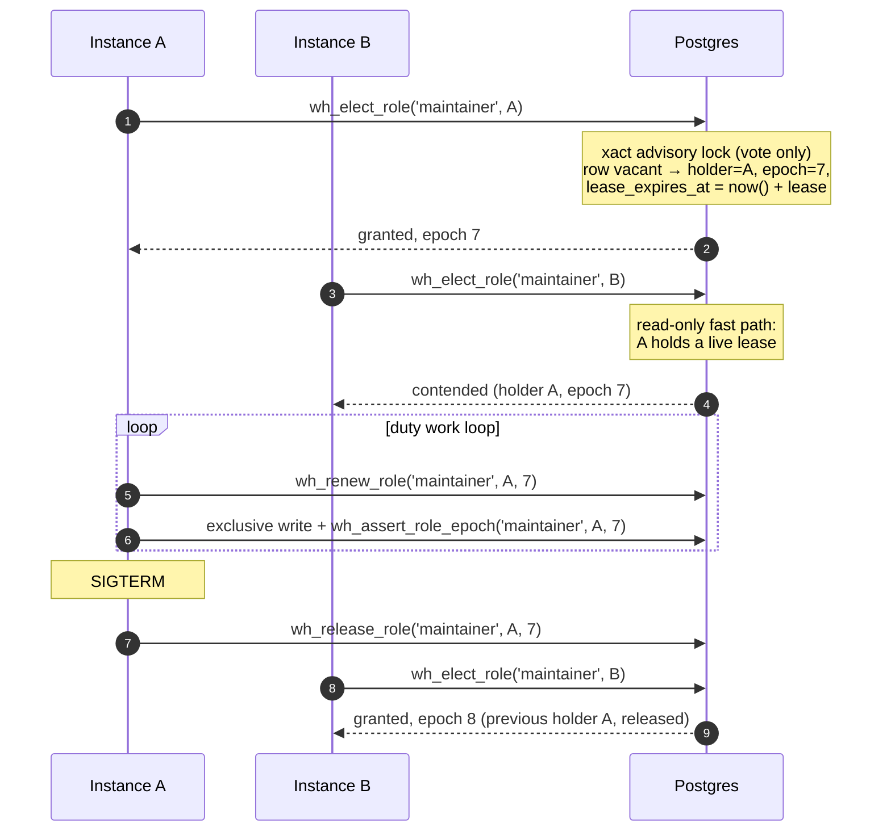

# Duty Role Assignment

**The advisory lock decides only the vote. The role is a row: a liveness-tied assignment with an epoch that exclusive work presents as a fencing token.**

:::planned
**Proposed, phase 1 in flight** (library migration `173_RoleAssignments.sql`, `PgRoleElector`, opt-in through `AddWhizbangRoleAssignment()`). Tracks GitHub issue #966. The released model, a session advisory lock held for the whole tenure, is described on [Capabilities and Duties](/v1.0.0/operations/startup/capabilities-and-duties) and keeps working unchanged until an application opts in. Section 9 lists the phases and what each one delivers.
:::

## 1. Why the session lock is not enough

Today a duty (`migrator`, `maintainer`) is a **session advisory lock** held on a dedicated connection for the holder's entire tenure. The capability row written by `record_capability` only reports who holds it: *the lock decides, the row reports*. That model is simple and has no timeout to tune, and it has three standing costs:

1. **One pinned direct connection per held duty.** A session lock does not survive a transaction-pooling front end, so every holder needs a connection that bypasses the pooler, and keeps it for as long as it holds the duty.
2. **No way to take a duty away from a holder that is alive but unhealthy.** The lock is released when the session ends. A holder whose event loop is blocked, or whose work connection is wedged, keeps its session and therefore keeps the duty. The same is true of a half-open TCP session after a hard kill, which holds the lock until the operating system's keepalive notices, by default two hours.
3. **A duty is consulted only when something asks for it.** A startup step with `RequiredCapability = maintainer` and `NonHolderBehavior.Skip` asks once, at that instance's startup. In a rolling deploy the old-version pod still holds the duty while every new pod starts, so each new pod is told "held elsewhere" and skips. When the old pod finally stops, nobody is asking any more, and the step never runs.

## 2. The model in one screen



Five pieces:

1. **The vote.** A single SQL function, `wh_elect_role`, run as one statement. It takes a *transaction-scoped* advisory lock keyed on the role, re-reads the assignment, voids it if it has lapsed, and assigns the caller if the role is free. The lock is released when the statement commits. Because the whole vote is one statement, a client that stalls cannot hold the vote lock: the server runs the statement to completion without a round trip to the client.
2. **The assignment.** `wh_role_assignments` has one row per role: holder instance id, epoch, `assigned_at`, `renewed_at`, `lease_expires_at`, the lease length, the election count, and the last vacancy (who, when, why). **That row is the authority from then on.** It is a virtual lock that needs no session and no pinned connection, and it survives a database restart.
3. **Liveness.** The assignment is valid while its lease is unexpired **and** the holder is registered in `wh_service_instances` **and** is not tombstoned in `wh_instance_evictions`. The lease is extended only by the holder's own work loop (`VerifyStillHeldAsync` renews it), never by a separate timer. Reaping, eviction and a lapsed lease all void the assignment at the next vote.
4. **Fencing.** Every assignment carries an **epoch**, incremented on each new assignment and never reused. Exclusive work presents `(holder, epoch)` to `wh_assert_role_epoch` in the same transaction as its writes. A stale epoch raises SQLSTATE `WHF01` and the transaction's writes roll back. The check runs in SQL, where no paused process can argue with it.
5. **Release.** A graceful shutdown releases the role (`wh_release_role`) so the next vote hands it off at once rather than after the lease lapses.

### What the advisory lock still does, and what it no longer does

| Question | Session-lock model (released) | Role-assignment model (this proposal) |
|---|---|---|
| Who decides the holder | The session lock, for the whole tenure | The vote, under a transaction lock held for milliseconds |
| What proves the holder is still the holder | The session is still open | The row: unexpired lease, registered, not tombstoned |
| Connection needed while holding | One pinned direct connection per duty | None. Every call is one statement on any pooled connection |
| A stuck-but-alive holder | Keeps the duty indefinitely | Stops renewing, lapses, loses the duty |
| A hard-killed holder on a half-open socket | Keeps the lock until TCP keepalive (up to hours), bounded only by the reaper's definitive-dead cutoff | Lapses after one lease |
| Database restart or failover | Every session lock is lost; election restarts from nothing | Rows survive; the holder renews the same epoch |
| A paused holder that wakes up after losing the duty | Its session died, so its lock is gone; its writes are not fenced | Its writes present a stale epoch and are refused in SQL |

## 3. Schema

```sql
CREATE TABLE IF NOT EXISTS __SCHEMA__.wh_role_assignments (
  role                     TEXT PRIMARY KEY,
  holder_instance_id       UUID,                 -- NULL = vacant
  epoch                    BIGINT NOT NULL DEFAULT 0,
  assigned_at              TIMESTAMPTZ,
  renewed_at               TIMESTAMPTZ,
  lease_expires_at         TIMESTAMPTZ,
  lease                    INTERVAL,
  election_count           BIGINT NOT NULL DEFAULT 0,
  last_holder_instance_id  UUID,
  last_vacated_at          TIMESTAMPTZ,
  last_vacated_reason      TEXT                  -- released | lapsed | evicted | unregistered
);
```

There is deliberately **no foreign key** to `wh_service_instances`. A cascade would delete the row and lose the epoch, and the epoch must never go backwards. A reaped holder is detected by the vote, which voids the assignment and records why.

The row is never deleted. A release or a void sets the holder to NULL and keeps the epoch, so the next assignment is `epoch + 1` whatever happened in between.

### Functions

| Function | What it does | Locking |
|---|---|---|
| `wh_elect_role(role, instance, lease, cooldown, legacy_lock_key)` | The vote. Returns `outcome` (`granted`, `held`, `contended`, `cooling_down`, `legacy_holder`, `refused`), the holder, the epoch, the lease remaining, and the previous holder and void reason when this vote replaced one | Read-only fast path when a live holder exists; otherwise `pg_advisory_xact_lock` on the role plus `FOR UPDATE` on the row |
| `wh_renew_role(role, instance, epoch)` | Extends the lease by the stored lease length, from `now()`. Refuses a lapsed lease, a wrong epoch, and a tombstoned holder | One `UPDATE … WHERE` |
| `wh_release_role(role, instance, epoch)` | Vacates the role with reason `released`, only when `(instance, epoch)` is current | One `UPDATE … WHERE` |
| `wh_assert_role_epoch(role, instance, epoch)` | The fence. Raises `WHF01` unless `(instance, epoch)` is the current, unexpired, non-tombstoned assignment. Takes `FOR SHARE` on the row, so a re-vote cannot commit between the check and the caller's commit | `FOR SHARE` on the row |
| `wh_role_assignment_status()` | One row per role with holder, epoch, timestamps, lease remaining, election count, last vacancy, and a computed `state` of `held`, `lapsed` or `vacant` | None |

The vote also writes and removes the `wh_instance_capabilities` row through `record_capability` and `release_capability`, so every surface that reads holdings today keeps working. In this model the capability row still *reports*; the difference is that the assignment row, not a session, is what it reports on.

### The vote lock key

`pg_advisory_xact_lock((table_oid << 32) | hashtext(role))`, where `table_oid` is the oid of this schema's `wh_role_assignments`. Keying on the table's oid makes the lock schema-scoped by construction (issue #962) with no schema name handled as text, which also absorbs the two migration runners' different `__SCHEMA__` substitutions. A collision with another advisory-lock family can only make a vote wait a few milliseconds longer. It can never change the outcome, because the row, not the lock, is the authority.

## 4. Time: every bound is computed by the database

Every timestamp in the row is written with `now()` inside the statement, and every comparison is made against `now()` in the next statement. No instance clock ever reaches the table. The function returns the **remaining** lease as an interval, a duration rather than an instant, so a caller measuring against it uses its own monotonic clock and is unaffected by skew between its wall clock and the database's.

The one place two clocks meet is a database failover, when the new primary's `now()` is compared with timestamps the old primary wrote. NTP-synchronized servers keep that skew to milliseconds, against leases measured in seconds.

## 5. Liveness, lapse and hysteresis

**The lease is renewed by the work loop, not by a timer.** `IDutyGrant.VerifyStillHeldAsync` was already the call "a long-tenure holder makes before each unit of exclusive work". In this model it renews the lease. A holder whose loop is stuck, whether blocked on a thread, awaiting a wedged connection, or paused by the operating system, stops calling it and lapses. A separate renewal timer would keep a stuck holder alive, which is the failure this is meant to remove.

Renewals are throttled locally: within one `RenewInterval` of the last successful renewal, measured on the monotonic clock from the moment that request was *sent*, `VerifyStillHeldAsync` answers from memory. That is safe because the database computed the lease from a later instant than the send, and `RenewInterval` is a fraction of the lease. The throttle only saves round trips. It never lets a write through, because writes are fenced in SQL.

**Hysteresis** has two parts:

- **The lapse threshold is several missed beats.** `lease = RenewInterval × MissedRenewalsBeforeLapse` (defaults 5 s × 3 = 15 s). One slow renewal does not cost the role.
- **A cool-down after an involuntary lapse.** An instance whose assignment was voided as `lapsed` cannot be re-elected for `CooldownAfterLapse` (default 15 s), so a slow instance cannot win the role back the moment it recovers and bounce it again. A graceful release carries no cool-down, because it was not a health signal.

**The failover bound** after a crash is therefore one lease plus the successor's next attempt, all measured in database time.

## 6. Mixed-version fleets: never both act

During a rolling deploy, old instances hold duties with session locks and new instances use rows. The two must never both act. They cannot see each other's mechanism unless one of them bridges, and old code cannot be changed, so the new code bridges in both directions:

| Direction | Mechanism |
|---|---|
| **New defers to old** | Bridge on (`HoldLegacySessionLock = true`, the default): a new instance first takes the legacy session lock (`DutyLockKey`, the same key the old elector uses) and votes only if it won. If an old instance holds it, the attempt is `Contended` and no assignment is written. Bridge off: the vote itself checks `pg_locks` for the legacy key held by another backend and answers `legacy_holder` |
| **Old defers to new** | Bridge on: the new holder keeps holding the legacy session lock for as long as it holds the role, so an old instance's `pg_try_advisory_lock` fails exactly as it would against an old holder |

The bridge costs the pinned connection the new model exists to remove, so it is temporary: turn it off (`HoldLegacySessionLock = false`) once no instance older than the role-assignment release remains in the fleet. With the bridge off, the `pg_locks` check still refuses a vote while an old holder is visible, but it cannot stop an old instance from taking the session lock *after* the vote, so turning the bridge off with old instances still running is unsafe, and the option says so.

While the bridge is on, a stuck new holder keeps its bridge session, so the session lock still blocks every other instance until that session dies. Stuck-holder detection therefore takes full effect only once the bridge is off. That is the price of never both acting while old instances remain.

### Migration path from `PgDutyElector`

1. **Release N (phase 1).** Migration 173 is additive. `PgRoleElector` ships beside `PgDutyElector` and is opt-in through `AddWhizbangRoleAssignment()`. When enabled it manages the roles in `RoleAssignmentOptions.Roles` (default: `maintainer`) with the bridge on, and delegates every other duty, `migrator` included, to the session-lock elector unchanged.
2. **Release N+1.** Role assignment becomes the default registration, still bridged. The acquisition hook (section 7) ships, which is what makes the rolling-deploy gap close.
3. **Release N+2.** The bridge defaults to off, and the session-lock elector is kept only for `migrator` until that duty moves (below).

`migrator` stays on the session lock for now for two reasons. It is elected *before* migrations run, so its table would have to join the schema bootstrap closure. And migrator waiters watch the duty's session lock through `AdvisoryLockProbe`, so they would have to watch the assignment row instead.

## 7. The acquisition hook and "pending until done" (later phase)

When an instance *becomes* the holder, whether at startup, on a lapse, or on a hand-off, duty-bound work that is still pending runs **then**. That is what closes the rolling-deploy gap: the new pod that finally wins `maintainer` runs the rewrite the old pod never ran.

For the new holder to know what is pending, a duty-bound step declares its pending state durably: a pending-work row keyed by (role, step), written when the work becomes owed and cleared only when it is confirmed done. The table-rewrite requests already follow this pattern: a request is cleared only after the ratio is confirmed to have dropped. The hook reads the owed rows for the role it just won and runs their steps with the grant's epoch. Work must be idempotent and resumable, because a hand-off can interrupt it.

## 8. Several roles, "no holder", and observability

**Several roles.** Each role is its own row with its own epoch and lease, so an instance can hold `maintainer` while another holds a stamper role for the same schema, and a lapse of one never disturbs the other. Batching several roles into one vote transaction is an optimization for later. It is not needed for correctness.

**No holder at all.** `wh_role_assignment_status()` reports `vacant` or `lapsed` for a role nobody validly holds. The health surface (phase 2) reports it as *role unassigned*, degraded rather than failed. A caller that cannot reach the vote gets `Unavailable` or a transient failure, never a grant, so nothing ever runs everywhere at once by default.

**Observability.** The current holder, epoch, last renewal and election count per role are one query. Each hand-off is logged **once**, by the winning instance only, since exactly one vote produces each epoch, with the previous holder and the void reason. A lost grant is logged by the instance that lost it. Metrics (`whizbang.roles.elections`, `whizbang.roles.handoffs{reason}`, `whizbang.roles.lost`, and a held-roles gauge) follow in phase 2.

## 9. The resilience requirements, mechanism by mechanism

| # | Requirement | Mechanism | Test (phase) |
|---|---|---|---|
| 1 | Never two holders acting at once | Epoch per assignment; `wh_assert_role_epoch(role, holder, epoch)` in the writer's transaction raises `WHF01` for a stale epoch; `FOR SHARE` keeps a re-vote from committing mid-write; holder is part of the fence, so an epoch reissued after an async-replica failover still fails | Stale epoch refused in SQL, its write rolled back (1) |
| 2 | Holder crash or `kill -9` | Lease lapses in database time; the next vote voids it (`lapsed`) and assigns a new epoch. No session or TCP timeout is involved | Crashed holder voids after the lapse bound, time advanced in the database (1) |
| 3 | Holder alive but stuck | Lease renewed only by `VerifyStillHeldAsync` from the work loop; no renewal thread | Unrenewed lease lapses although the instance still heartbeats (1); stuck-loop chaos run (4) |
| 4 | Clock skew | Every timestamp is `now()` in the statement; remaining lease is returned as a duration | Time advanced only in the database, never on the instance (1) |
| 5 | Flapping | Lease = several renew intervals; cool-down after an involuntary lapse | Lapsed holder refused during cool-down, another instance wins (1) |
| 6 | Graceful shutdown | Grant disposal and host shutdown call `wh_release_role`; no cool-down for a release | Release hands off at once, no lapse wait (1) |
| 7 | Work interrupted mid-duty | Acquisition hook plus durable pending-work rows; idempotent, resumable steps | Phase 2 |
| 8 | Database failover or restart | Assignment is a row, so it survives; the grant holds no connection; every vote re-evaluates liveness against `now()` | Assignment and epoch survive every connection being terminated (1) |
| 9 | No holder at all | `wh_role_assignment_status()` state `vacant` / `lapsed`; health "role unassigned"; no grant without a vote | Status reports vacant after release (1); health (2) |
| 10 | Observability | Status function; one hand-off log line by the winner; metrics | Status reflects holder, epoch, count (1); metrics (2) |

### Chaos plan (phase 4)

Kill the holder; pause it (`SIGSTOP`); partition it from the database; skew its clock; restart the database; run a rolling deploy with old and new versions; start ten instances at once. In every case: at most one epoch writes, a new holder appears within the bound, and pending duty work completes exactly once.

## 10. Phases

| Phase | Delivers |
|---|---|
| **1** | Migration 173; vote, renew, release, fence and status SQL; `PgRoleElector` behind `IDutyElector` with epoch on the grant, renew-on-verify, release on dispose and on shutdown, and the legacy-lock bridge; opt-in registration |
| **2** | Acquisition hook and pending-work rows; health component "role unassigned"; metrics; release NOTIFY so waiters retry at once |
| **3** | Default registration; stamper leader moved to a role; progress-tied renewal for long single statements; multi-role vote |
| **4** | Chaos suite; bridge off by default; `migrator` moved into the bootstrap closure |

## 11. Open questions

- **Long single statements.** A `VACUUM FULL` or a large migration statement can outlast a lease, and the loop cannot renew while it waits. Candidates: size the lease for the longest statement, or renew while the duty's own backend is observed `active` in `pg_stat_activity`, which ties liveness to the work's progress rather than to a timer.
- **Hand-off while alive.** Should a newer-version instance be able to ask a live older holder to drain and hand over, rather than waiting for its shutdown?
- **Selection policy.** Candidates nominate themselves, and the first valid caller wins a vacant role. Should the vote prefer the newest library version, or the longest-lived instance?
- **The bridge while a new holder is stuck.** Should a winner of the vote be allowed to terminate a lapsed bridge holder's session, or is waiting for the session to die the right trade?
- **Cool-down after a database outage.** An outage longer than the lease lapses every holder, which then pays the cool-down although the database was at fault.

## Related

- [Capabilities and Duties](/v1.0.0/operations/startup/capabilities-and-duties): the released session-lock model
- [The Startup Pipeline](/v1.0.0/operations/startup/startup-pipeline): where duties decide who runs an exclusive step
- [Instance Liveness](/v1.0.0/fundamentals/workers/instance-liveness): the heartbeat, the alive lock, and the eviction tombstone
- [Fleet Startup Orchestration](fleet-startup-orchestration)
