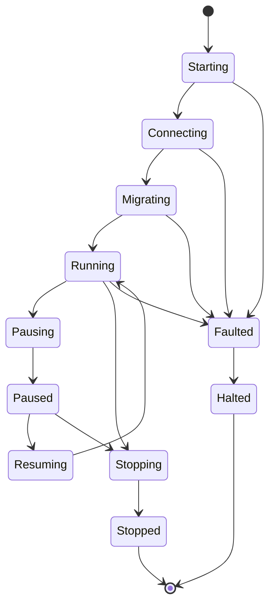

# Managed-Resource Control Plane — Lifecycle, Run-Control & Health

Whizbang manages a set of infrastructure resources on the consumer's behalf — the event-store
database, the message transport, the body-offload store, the worker pipeline, schema
initialization, the signal bus, the temporal engine. Today, whether those resources are "healthy"
is decided by whatever ad-hoc `IHealthCheck` a consumer wires up — usually a naive probe (a `SELECT
count(*)`, a connectivity ping) that has **no idea what state Whizbang is intentionally in**. So a
resource that is *intentionally* migrating, connecting, or paused gets reported as **Unhealthy**,
and everything downstream — Kubernetes readiness, a deploy pipeline's rollout gate — treats a
by-design state as a failure.

But observing is only half of it. Whizbang doesn't just *report* on these resources — it *controls*
whether each one is **allowed to run** at all: workers wait on the schema gate, the transport
consumer can be drained, an offload can be disabled. So the managed-resource abstraction has **two
symmetric faces**, and both are driven by **one thing**: a single lifecycle **state machine** that
Whizbang owns and advances.

- **Run-control** — the framework broadcasts the current lifecycle state; **each resource interprets
  it** and does the right thing (stay up, pause, drain, stop). The enforcement face.
- **Health** — **each resource reports** its state, *knowing the current lifecycle state*, so a
  resource that is intentionally paused reports healthy-by-design and a resource the current state
  *depends on* reports its real health. The observe face.

The key design decision this proposal locks: **the resource owns both faces.** Whizbang is the
**state authority** (it owns the machine, advances it, and documents what each state means) and the
**aggregator** (it folds the reports into liveness/readiness). It is **not** a central table that
decides, per component, what "migrating" means — the DB, the workers, the transport each know what a
state means *for them*, so they interpret it and report it themselves against a documented contract.
`ISchemaReadyGate` is today's single, hard-wired sliver of this (gate whether *workers* may run);
this proposal generalizes it to **every** managed resource and to the **whole lifecycle**.

:::planned
Proposed capability (unreleased). It generalizes the health signal introduced with the opt-in
non-blocking schema init (`ISchemaReadyGate` + `SchemaReadyHealthCheck` +
`DatabaseAvailabilityMiddleware`): that shipped a single, binary "schema ready?" check hard-wired to
report **Unhealthy** while migrating. This proposal reframes that as one instance of a general rule,
corrects the default so *migrating is healthy*, and adds the run-control face that partners it.
:::

## The problem — health with no notion of state

A concrete, common failure mode (no consumer specifics — this is generic Kubernetes + a large
one-time migration):

1. A service ships a schema change whose one-time migration is longer than the k8s startup-probe
   budget. With non-blocking schema init the pod binds its port and answers `/alive` immediately, so
   k8s does **not** kill it. Good.
2. But the pod's **readiness** (`/health`) stays red for the whole migration — by our own design,
   plus because the naive DB/transport health checks query tables that are mid-rebuild (locked, or
   not created yet) and **time out**.
3. The deploy orchestrator (Helm `--wait --timeout` / `--atomic`, `kubectl rollout status`) waits
   on readiness, times out, and **rolls the deployment back** — killing the migration pod
   mid-flight. On a large store this loops: the migration never gets to finish.

The startup-probe kill was fixed by keeping `/alive` green. The rollback is a *different* actor
(the deploy pipeline) watching a *different* signal (readiness) — and the root cause is that
**"migrating" and "connecting" are reported as "unhealthy" when they are neither.** A migration in
progress is a service operating **correctly for the state it is intentionally in**.

## The principle

> Health is not "is every subsystem fully operational." Health is **"is this resource operating
> correctly for the state the system is intentionally in right now."** Only the resource can say
> whether it is *broken*; the resource is *told* what state the system is in; and the resource — not
> a central rulebook — decides what that state means for it, on both faces.

Two rules keep it honest:

- **Intentional ≠ broken.** A resource that is *meant to be off* in the current state reports
  healthy-by-design. A worker paused during `Migrating` is fine; a transport disconnected during
  `Stopping` is fine.
- **A depended-on resource is never masked.** A resource the current state *needs* reports its
  **real** health, and a fault **counts**. The DB during `Migrating` is *running* (the migration is
  calling into it), so a DB fault mid-migration is a genuine `Faulted` — you never mask the very
  dependency the current operation requires. This is also how a wedged migration surfaces: the thing
  it is stuck on reports broken.

## One lifecycle state machine

Whizbang owns a single lifecycle state and advances it. Each state is either **settled** (a resting
point) or **transitional** (Whizbang has broadcast a change and is waiting for every resource to
acknowledge — see [coordinated transitions](#coordinated-transitions)).

```csharp
/// <docs>resilience/managed-resource-run-control</docs>
public enum LifecyclePhase {
  // — startup (transitional) —
  Starting,     // process booted, host constructing
  Connecting,   // network warmup: DB / transport / offload connections coming up
  Migrating,    // schema / data migration in progress (needs the DB connection from Connecting)

  // — operational (settled) —
  Running,      // fully operational

  // — pause (transitional ⇄ settled) —
  Pausing,      // broadcast "pause", awaiting acks
  Paused,       // settled, resumable
  Resuming,     // broadcast "resume", awaiting acks

  // — graceful shutdown —
  Stopping,     // broadcast "stop"; resources drain in-flight, awaiting acks
  Stopped,      // settled graceful stop

  // — fault path —
  Faulted,      // a fault occurred; a bounded window to record / report / emit before dying
  Halted        // terminal dead state (k8s will replace the pod); reachable ONLY from Faulted
}
```



Two states earn a note:

- **`Connecting`** is the network-warmup phase — the DB, transport, and (where it connects eagerly)
  the offload store are opening connections. It sits *before* `Migrating` because the migration
  needs a live DB connection. A resource that is still connecting is `Starting`-healthy, not broken.
- **`Faulted → Halted`** is deliberately a two-step death. On a fault we don't drop dead instantly:
  `Faulted` is a **bounded window to record and report** — log the fault, emit telemetry, flush
  what's flushable — *then* the machine transitions to `Halted`, the terminal state. Kubernetes will
  replace the pod regardless, so `Faulted` is our chance to say *why* before it does. `Halted` is
  reachable **only** from `Faulted` (a graceful shutdown ends in `Stopped`, never `Halted`).

`Running` is the operational steady state (it replaces the old probe-flavored name "Ready" —
readiness is the *probe*, a different axis, and the phase shouldn't collide with it).

## Coordinated transitions — every resource must acknowledge {#coordinated-transitions}

State changes are **coordinated**, not fire-and-forget. This is what makes the whole thing safe.

- **Every managed resource MUST respond to every state change** — even a no-op returns "applied." So
  Whizbang *knows* the change reached all of them; no resource silently ignores a transition.
- **The response is the acknowledgement** — an async `ValueTask`; completing it *is* the ack. A
  resource with nothing to do returns a completed task.
- **Timeout → error.** Each resource's response is bounded by a **configurable** timeout; a resource
  that doesn't ack in time raises an error (which, by default, faults the system — see below).
- **Barrier.** Whizbang waits for **all** resources to ack the current change before applying the
  next one.
- **Queue.** Changes that arrive mid-transition **queue** and apply serially — one coordinated
  transition at a time.

This is the same "fire once all have reported" shape Whizbang already uses for lifecycle
coordination (`WhenAll` gating, completion signals) — a transitional state *is* the "broadcast sent,
awaiting acks" window; the settled state on the other side *is* "all acked."

```csharp
/// The single source of truth for the system's lifecycle phase.
public interface IWhizbangLifecycleState {
  LifecyclePhase Current { get; }
}

/// Every managed resource implements this. The coordinator invokes it on each transition and
/// awaits the returned task (with a configurable per-resource timeout) as the acknowledgement.
public interface IWhizbangRunControl {
  /// Same component id space as the health source: "event-store", "transport", "workers", ...
  string Component { get; }
  /// Interpret the phase for THIS resource, do the work, and ack by completing. Mandatory — a
  /// resource that has nothing to do for this phase returns a completed task.
  ValueTask OnPhaseAsync(LifecyclePhase phase, CancellationToken cancellationToken);
}
```

A resource **faults** the system in one of two ways: its `OnPhaseAsync` throws or times out during a
transition, or its health source reports `Faulted` while the system is `Running` (a real dependency
fault). Either drives the machine to `Faulted` → (record window) → `Halted`.

## The run-control face — each resource interprets the phase

There is **no central `(component × phase) → RunState` table.** Whizbang broadcasts the phase; each
resource decides what it means for itself, because only it knows. `Running`/`Paused`/`Stopped` can't
even express "drain" (finish in-flight, take no new) — that's a worker-specific behavior only the
worker can perform. The resource owns it.

The framework **documents** the general expectation per resource-role per phase (the contract each
implementation codes to); the implementations own executing it correctly:

| Phase | event-store / DB | workers | transport / offload / temporal / signal-bus |
|---|---|---|---|
| `Connecting` | opening connection | not yet started | opening connection |
| `Migrating` | **up** — the migration needs it | paused, no new work | paused intake, no new activity |
| `Running` | up | pumping | active |
| `Pausing` → `Paused` | up (or paused if a full quiesce) | pause, no new work | pause intake |
| `Stopping` → `Stopped` | up until stopped, then close | **drain** — finish in-flight, reject new | stop intake, flush outstanding, disconnect |
| `Faulted` | record/report, then release | record/report, stop | record/report, disconnect |

**`Paused` / `Stopped` double as the coarse operational override.** The nuance above lives in how
each resource interprets each *distinct* phase — during `Migrating` the DB stays up while workers
pause; during `Paused` (the operator's blunt "pause everything") every resource, DB included,
interprets it as a full quiesce. Same machine, same "interpret the phase" rule; the operator just
forces the transition out of band. A finer **per-component operator override** (drain *one*
transport for maintenance while the system stays `Running`) pins a single component's behavior
independent of the system phase.

## The health face — each resource reports, phase-aware

The same resource reports its health, and it reports **correctly for the current phase** because it
reads the same lifecycle state. Whizbang does not centrally "override" a raw report — the resource
already knows whether, in this phase, it is *supposed to be running* (report real health) or
*supposed to be off* (report healthy-by-design).

```csharp
/// <docs>resilience/managed-resource-health</docs>
public interface IWhizbangHealthSource {
  /// Stable component id: "event-store", "transport", "offload", "workers", "schema", "signal-bus", ...
  string Component { get; }
  /// Reports intrinsic state, judged against the current LifecyclePhase (injected).
  ValueTask<ComponentHealth> ReportAsync(CancellationToken cancellationToken);
}

public readonly record struct ComponentHealth(ComponentState State, string? Detail = null);

public enum ComponentState {
  Operational,      // running normally
  Starting,         // coming up (Starting/Connecting) — intentional, transient
  Migrating,        // schema/data migration in progress — intentional
  PausedByDesign,   // gated/drained on purpose in this phase
  Draining,         // finishing in-flight for a graceful stop — intentional
  Degraded,         // working but impaired (slow, partial) — still serves
  Faulted           // genuinely broken — a real fault
}
```

The judgement each source makes, driven by whether the phase **needs** it:

| Component | Reports real health when… | …reporting | Healthy-by-design when… |
|---|---|---|---|
| **event-store / DB** | any phase from `Connecting` on (always depended-on) | `Migrating`+reachable ⇒ healthy; `Migrating`+unreachable ⇒ **`Faulted`** | — (the DB is essentially always needed) |
| **transport** | `Running` (broker must be connected) | dropped while `Running` ⇒ `Faulted` | `Connecting`, `Paused`, `Stopping` (drained) |
| **offload** | `Running` (store must answer) | unreachable while `Running` ⇒ `Faulted` | `Connecting`, `Paused` |
| **workers** | `Running` (pump must be alive) | crash-looping while `Running` ⇒ `Faulted` | `Migrating`, `Paused` (held on gate) |
| **schema / migration** | `Migrating` (must be progressing) | progressing ⇒ `Migrating`; stalled/failed ⇒ **`Faulted`** | after `Running` (done) |
| **signal bus / temporal** | `Running` (must be listening/scheduling) | channel dead while `Running` ⇒ `Faulted` | `Connecting`, `Paused` |

Nobody writes a `SELECT count(*)` against Whizbang's own tables to infer messaging health — the
transport source reports the *transport's* state, and the event-store source reports `Migrating`
instead of letting a locked table read as a fault. And crucially, the DB source **does** report
during migration — because the migration needs it — so a migration wedged on a dead DB shows up as
`Faulted` rather than sitting green forever.

## The framework aggregates — a trivial policy

Because the resources already judge intentional-vs-real themselves, all the framework does is
aggregate every source (worst-wins) and map `ComponentState → HealthStatus` for **liveness** and
**readiness** separately:

```csharp
public sealed class WhizbangHealthOptions {
  public HealthPolicy Default { get; set; } = HealthPolicy.Lenient;
  // Per-component overrides, e.g. keep offload strict even at startup.
  public IDictionary<string, HealthPolicy> Components { get; } = new Dictionary<string, HealthPolicy>();
}

// Lenient (default): Operational/Starting/Migrating/PausedByDesign/Draining => Healthy on BOTH probes;
//                    Degraded => Healthy on liveness, Degraded on readiness; Faulted => Unhealthy on readiness.
// Strict:            Migrating/Starting => Unhealthy on readiness (held out of rotation),
//                    still Healthy on liveness (never let a probe kill a progressing pod).
```

The **default is Lenient** — the behavior this proposal argues for: *migrating is healthy, so the
pod is Ready and serving during migration.* An operator who wants the max-safe "out of rotation
until fully migrated" posture flips the schema/DB component (or everything) to Strict.

**Liveness is never gated on an intentional state under any policy.** A `Starting`, `Connecting`,
`Migrating`, `PausedByDesign`, or `Draining` resource is *alive*; only a truly wedged process should
fail liveness (which is why the [stall guard](#the-stall-guard) — not a fixed timeout — is what
turns a stalled migration into `Faulted`).

Whizbang ships the aggregating liveness/readiness contributions that plug into the ASP.NET health
system, so a consumer registers **one** Whizbang health contributor. App-specific checks (a SignalR
backplane, the consumer's own dependencies) remain the consumer's and compose alongside.

## What this resolves

- **The rollback goes away without touching the deploy pipeline.** With the Lenient default the pod
  reports **Ready during migration** (its DB/transport sources report intentional states, not
  faults), so the rollout completes and the migration finishes in place.
- **Workers stay gated by design** — event processing is paused, reported `PausedByDesign` = healthy,
  *not* "not running = broken."
- **Reads serve; writes/processing wait.** The event-store body-split touches the log tables, not
  the read-model (`wh_per_*`) tables, so read traffic is served while the migration runs; write and
  processing paths stay gated. See [selective availability](#selective-availability).
- **A wedged migration is caught, not masked.** The DB reports real health during `Migrating`, and
  the schema source flips to `Faulted` when progress stalls — so a stuck migration fails readiness
  and the rollout ends cleanly instead of the pod sitting green on a broken schema.

## Related pieces that read the same lifecycle state {#selective-availability}

- **Selective availability middleware.** `DatabaseAvailabilityMiddleware` today returns `503` for
  *every* non-probe path while the gate is closed. It becomes **opt-in / selective**: gate only the
  configured schema-dependent paths (or, simplest, "block mutations, allow reads"), reading the
  lifecycle state rather than a raw gate bool. Reads flow during migration; writes get a clean
  `503 { "reason": "schema_migrating" }`.
- **The stall guard.** {#the-stall-guard} The schema source reports `Migrating` while it is *making
  progress*, and only flips to `Faulted` when progress **stalls** past a configured window — a
  no-progress watchdog, not a fixed total-time ceiling. This is what makes "a migration may take as
  long as it needs, as long as it is progressing" a real guarantee: an unbounded-but-progressing
  migration stays healthy; a genuinely wedged one (deadlock, lock-wait) is caught, faults, and the
  rollout ends cleanly. It requires the long backfill steps to emit a progress heartbeat (batched
  work + a step/row counter), surfaced as a metric and in the health `Detail`.

## Configuration

```jsonc
// appsettings — defaults shown; every service inherits Lenient unless it opts out.
"Whizbang": {
  "Lifecycle": {
    "TransitionAckTimeoutSeconds": 30     // per-resource ack budget on each coordinated transition
  },
  "Health": {
    "Default": "Lenient",                 // Migrating/Starting/PausedByDesign/Draining => Healthy on both probes
    "Components": {
      "offload": "Strict"                 // e.g. never consider the blob store "healthy" while it can't be reached
    },
    "MigrationStallSeconds": 300          // no-progress window before Migrating => Faulted
  }
}
```

## Build increments (docs-first → strict TDD → PR)

Everything hangs off **one lifecycle state machine + coordinator** (generalized from
`ISchemaReadyGate`); run-control reads it to act, health reads it to report.

1. **Lifecycle state machine + coordinator.** `LifecyclePhase` (settled/transitional),
   `IWhizbangLifecycleState`, and the coordinator: broadcast → await-all-ack (configurable timeout) →
   queue → advance. Fault path (`Faulted` record-window → `Halted`).
2. **Run-control participant contract.** `IWhizbangRunControl.OnPhaseAsync` (interpret + ack).
   Generalize `ISchemaReadyGate` (workers-wait-on-schema) into the first participant.
3. **Health source contract + aggregator + policy.** `IWhizbangHealthSource` (phase-injected),
   `ComponentHealth`/`ComponentState`, `WhizbangHealthOptions` (Lenient default), the aggregator, and
   the liveness/readiness contributions wired into the ASP.NET health system.
4. **Per-resource implementations (both faces).** Each managed resource implements the participant
   *and* the health source, interpreting/reporting per the documented contract: **schema**,
   **workers**, **event-store/DB**, **transport**, **offload**, **signal-bus/temporal**. The
   schema+DB pair is the increment that reverses the deploy-rollback failure mode; it lets consumers
   delete their naive DB/messaging readiness checks. *Delivered:* real probes for **schema** +
   **workers** (phase-based), **event-store/DB** (`SELECT 1`, Postgres driver), **transport**
   (`ITransport.CheckConnectivityAsync` — RabbitMQ `IConnection.IsOpen`, Service Bus `!IsClosed`), and
   **offload** (`IMessageBodyStore.CheckConnectivityAsync` — a blob round-trip). Each is registered
   smartly (real probe when the driver is present, `ConnectivityHealthSource.AssumedHealthy` when it
   isn't). **signal-bus** stays assumed-healthy — its dependency is the same Postgres the event-store
   source probes. *Remaining follow-up:* a dedicated notify-connection liveness probe for signal-bus.
5. **Selective availability middleware** + **stall guard / progress heartbeat**, both reading the
   shared lifecycle state.
6. **Operator control.** Global coarse `Pause`/`Stop` (operator-forced phase transitions) and the
   per-component override (pin one component independent of the system phase), via config + a runtime
   signal on the signal bus.

## Invariants to lock (regression tests)

*Lifecycle & coordination:*

- Every registered participant's `OnPhaseAsync` is invoked on every transition; the next transition
  does not begin until all have acked (barrier).
- A participant that throws or exceeds the ack timeout drives the system to `Faulted`.
- `Halted` is reachable only from `Faulted`; a graceful shutdown ends in `Stopped`, never `Halted`.
- Queued transitions apply serially in order.

*Run-control:*

- During `Migrating`, the DB participant stays up while workers/transport participants pause; during
  `Stopping`, workers drain (finish in-flight, take no new) then ack.
- A per-component operator override pins that component regardless of phase; clearing it returns the
  component to the phase-driven behavior.

*Health:*

- Liveness never fails for `Starting` / `Connecting` / `Migrating` / `PausedByDesign` / `Draining`
  under **any** policy.
- Lenient default: a `Migrating` schema source ⇒ readiness **Healthy**; a `Faulted` (or
  stall-detected) schema source ⇒ readiness **Unhealthy**.
- The DB source reports **real** health during `Migrating` — reachable ⇒ Healthy, unreachable ⇒
  `Faulted` (readiness Unhealthy). The depended-on dependency is never masked.
- A genuine fault outside an intentional state (transport dropped while `Running`, offload
  unreachable while running) ⇒ **Unhealthy** — the policy never masks a real fault.
- Strict override on a single component changes only that component's mapping; others stay Lenient.
