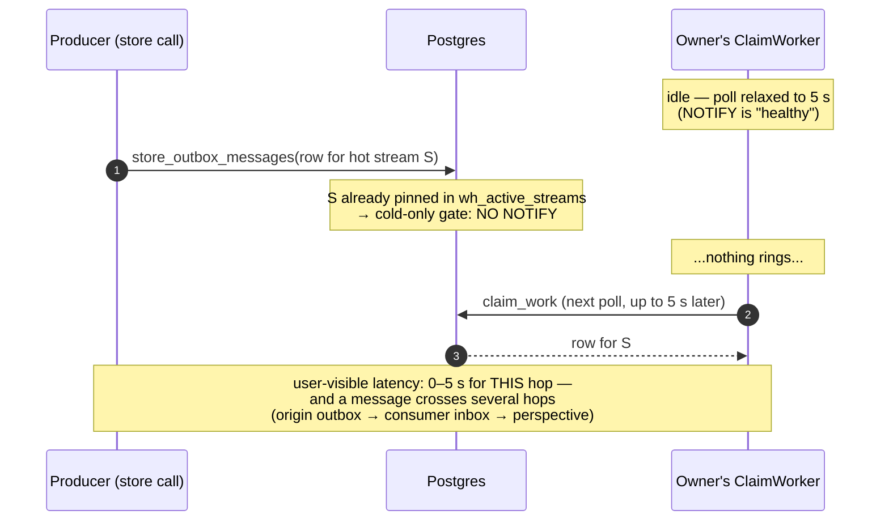
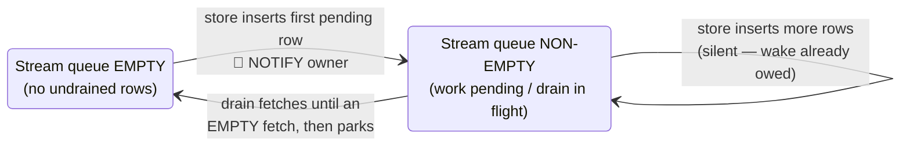
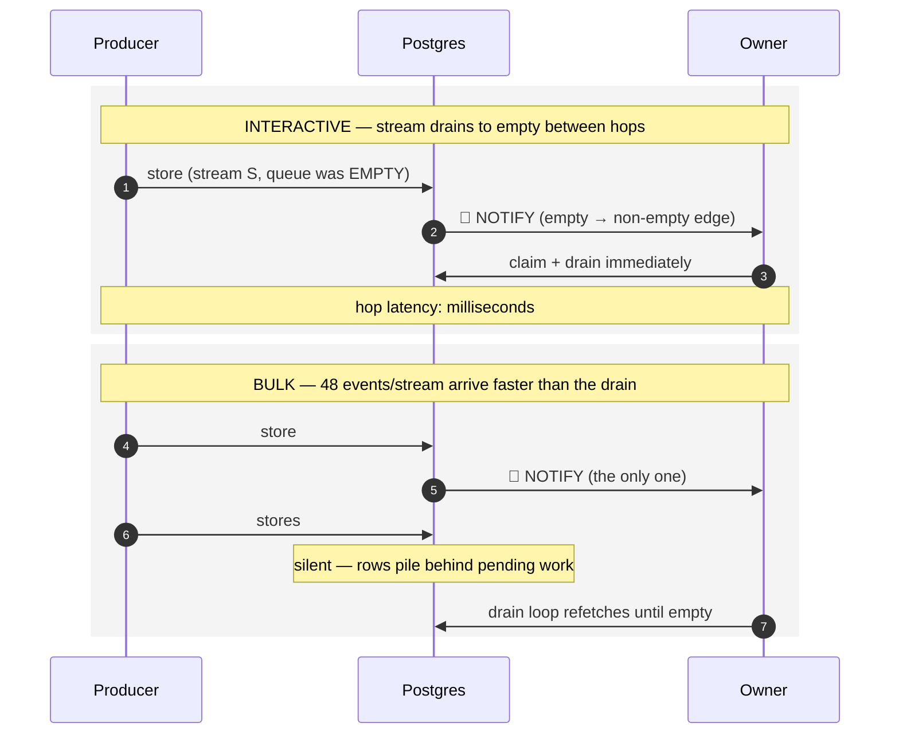
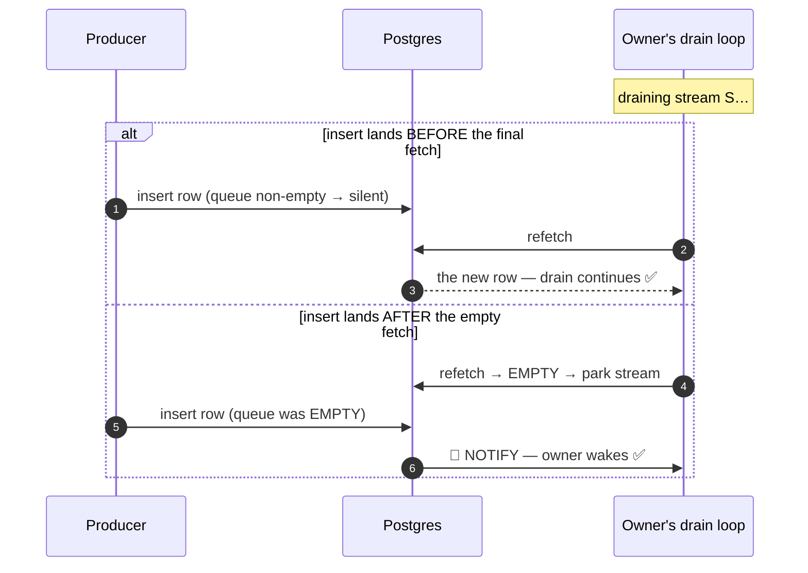

# Notify on the True Edge

**Store-level doorbell semantics: wake the owner when a stream's queue goes empty → non-empty.**

:::planned
This is a design proposal under discussion (unreleased). It changes only the NOTIFY *emission* condition inside `store_outbox_messages` / `store_inbox_messages` — no schema, no configuration, no worker code, and no change to `notify_instance_owners` routing.
:::

## 1. The problem: two optimizations, each assuming the other

Whizbang's work pump wakes on a Postgres `NOTIFY` doorbell, with a periodic claim poll as the safety net. Two changes — each correct for the workload in front of it — combined into a latency hole for a workload neither was looking at:

| Version | Change | Optimized for | Cost paid by |
|---|---|---|---|
| v0.685 | No store-level NOTIFY; safety-net poll only | — | Everyone (cold-start gap) |
| v0.686 | Unconditional NOTIFY on every store call | Interactive latency | Bulk throughput (17k stores → 17k notifies, ~1–2 ms + LWLock contention each) |
| v0.686.1 | **Cold-only gate**: NOTIFY only when the store *pins* the stream (first ever store); hot streams silent | Bulk throughput (17k → ~350 notifies) | **Interactive latency** |
| (independently) | `ClaimWorker` relaxes its poll to 5 s when NOTIFY is healthy (~10 s bus-wired backstop) | Idle DB load | Whoever depends on the poll |

The contradiction: the cold-only gate assumes *"the pinned owner's worker picks up new rows on its own claim cycle"* — and the claim cycle assumes *"NOTIFY carries all wakeups, so I can relax to 5 s."* **Neither side covers hot streams.** A bulk import never notices (its claim loop always has work in hand), but an interactive stream — idle between hops, someone watching each hop — pays 0–5 s **per hop**:

Multiply by the hops in one user action and the worst case stacks past 10 s. The chain is healthy — every component is doing exactly what it was told.

### Why it is not the connection topology

A LISTEN connection misrouted through a transaction-pooling proxy *fails the signaling self-test*, which flips the gate to unavailable — and `ClaimWorker` then deliberately **tightens** to its 250 ms base poll. Broken NOTIFY means *faster* polling. The 5 s cadence appears only when NOTIFY is healthy, which is precisely the condition under which the cold-only gate leaves hot streams with no wake source at all.

---

## 2. The design: ring the doorbell on the queue's real edge

The doorbell should ring exactly when it carries information: when a stream's pending work transitions from **empty to non-empty**. Pending rows already waiting mean a wake is already owed and the drain loop is already coming — another notify adds nothing. This is the classic wake condition of every mailbox protocol (eventcounts, parked channel readers, well-built `SKIP LOCKED` queues).

**Store-side rule** (per category — `outbox`, `inbox`, `perspective`): after inserting, check whether the stream had pending undrained rows *before* this call, using the same predicate the drain fetch uses. Pre-existing pending work → silent. This call created the first pending row → notify the owner.

Both workloads now get exactly what they need, from the same rule, with **zero configuration**:

| | v0.686 unconditional | v0.686.1 cold-only (today) | Debounce window (considered) | **Empty→non-empty edge (proposed)** |
|---|---|---|---|---|
| Bulk import (17k events / 350 streams) | 17k notifies ❌ | ~350 notifies ✅ | ~350–1.4k (window-dependent) ✅ | **~350 notifies ✅** |
| Interactive hop latency | ~ms ✅ | 0–5 s per hop ❌ | ~ms after idle ✅ | **~ms ✅** |
| Configuration | none | none | window knob + clock ❌ | **none ✅** |
| New state | none | none | `last_notified_at` column ❌ | **none ✅** |
| Notify decision keys on | every store | stream *lifetime* edge (wrong edge) | elapsed time (proxy) | **actual queue state (the real edge)** |

The cold-only gate rings on the wrong edge — a stream's *first store ever*. The debounce rings on a time edge — a clock standing in for consumer state. The queue-emptiness edge is the condition both were approximating.

### The edge resets — resume-after-idle is instant

The wake condition is **queue emptiness, not stream age**. The cold-only gate rings once per stream *lifetime* (only a brand-new stream is "cold" — an interactive session is instant for its first message and poll-paced forever after). The emptiness edge rings once per *quiet period*: every time the consumer catches up, the next store — whenever it arrives — is an empty→non-empty transition again.

| Moment | Pending queue just before the store | Doorbell |
|---|---|---|
| First message of a new session | empty (stream doesn't exist yet) | 🔔 rings |
| Reply seconds later (previous hop drained) | empty | 🔔 rings |
| Message after 45 minutes idle | empty — drained long ago | 🔔 rings |
| Message after a week idle | empty | 🔔 rings |
| Burst while the consumer is mid-drain | non-empty | silent — the in-flight drain's refetch picks it up |

Nothing in the rule is time-based, so idle duration cannot matter: an idle stream *is* a drained stream, and the next store re-arms the edge. The only silent case is work already pending — where a wake is already owed and latency is governed by processing, never by a sleeping owner. Stranded pending work (a crashed worker's row) would suppress the doorbell, but that is the crash-recovery scenario the safety-net poll and lease-expiry orphan reclaim already own — unchanged from today.

---

## 3. Correctness: the lost-wakeup race is already covered

Every edge-triggered wake protocol has one race to close: the producer inserts *just as* the consumer decides to park. The standard fix is a consumer-side double-check — and Whizbang's drain loop **already performs it**: a drain never parks a stream until a fetch comes back *empty* (the refetch-until-empty loop).

Whichever side of the final fetch the insert lands on, exactly one mechanism catches it. No timing assumptions, no window to tune. The 5 s safety-net poll remains — demoted to what it should have been all along: a **crash/orphan backstop**, never a latency path.

One implementation invariant makes this airtight: the store-side "pending" predicate must **mirror the drain fetch's predicate exactly** (minus the rows being inserted). If the two ever disagree on what counts as undrained, a row could be invisible to both mechanisms. This is a single shared definition, and the test suite locks it.

---

## 4. What changes, what doesn't

**Changes** — one migration re-creating the two store functions (and the emit chain's `perspective` notify) with the emptiness check replacing the cold-only gate. An indexed `EXISTS` probe per stream per store call, against the same partial index the drain fetch already uses.

**Does not change** — no schema, no settings, no C# worker code, no transport behavior, no claim/lease semantics. `notify_instance_owners` routing (pinned owner via Step 1, deterministic cold-start target via Step 2) is untouched.

### Alternatives considered

| Option | Verdict |
|---|---|
| **Debounce window** (`hot_stream_notify_window_ms`, `last_notified_at` on the pin UPSERT) | Works, but it's a knob managing the trade-off rather than dissolving it: any window value is wrong for someone, and a clock is a proxy for the consumer state the queue already holds. |
| **Consumer idle-flag** on `wh_active_streams` (owner marks idle when parking; producer notifies idle streams only) | Same semantics as the edge, but duplicates state the queue already encodes and adds a write per idle transition. Reach for it only if the `EXISTS` probe measurably hurts the hot path. |
| **Tighten the notify-healthy poll** (5 s → 1 s) | Fleet-wide idle load on a shared database to shave a symptom; average latency still ~500 ms per hop. |
| **Per-workload declaration** (mark interactive types always-notify) | New config surface asking developers to classify workloads; the edge gets the same discrimination from data. Priority/work-classes remain valuable — for *contention* latency — as a separate proposal. |

### Explicitly out of scope: priority

This proposal fixes **idle latency** (nothing rings while the owner sleeps). **Contention latency** — an interactive hop queued behind a bulk import that is actively draining — needs work-class priority: declared per message type, ordering *between* streams (never within one), plus a reserved drain lane. That composes with this design and is proposed separately.

---

## 5. Test plan: one suite states the whole trade

All coverage lives in `NotifyAfterStoreSqlTests` so the bulk protection and the interactive contract can never drift apart silently:

- **Unchanged, green** — the v0.686 cold-start locks (first store notifies the pinned caller; both `outbox` + `perspective` payloads; null-stream and non-event guards) and the `notify_instance_owners` perf-shape locks.
- **Green by construction** — the v0.686.1 burst locks (`SecondCallSameStream…`, `MixedColdAndHot…`): their second store lands behind still-pending rows, so the edge design keeps them silent for the same reason the cold-only gate did.
- **RED → GREEN, the new contract** — pin a stream, drain its pending row (simulate the consumer catching up), store again: the owner **must** be notified (`inbox` variant; `outbox` variant asserting both `outbox` and `perspective` payloads — read-model freshness is the latency users actually see).
- **End-to-end lock** — pinned stream, safety poll effectively disabled, store → the owner's claim fires promptly on the doorbell alone (completion-signal, no sleeps). This is the "interactive hops are not poll-paced" guarantee, stated as a test.
- **Predicate-mirror lock** — the store-side emptiness check and the drain fetch agree on what "pending" means.

## 6. Rollout

Pre-1.0: the store functions are re-created in place by a normal numbered migration (no data migration, no backfill). Behavior on live systems changes only in one direction — hot streams that drained to empty start waking their owners immediately instead of waiting for the poll.
