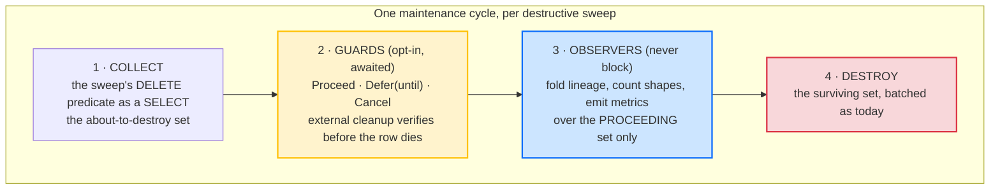
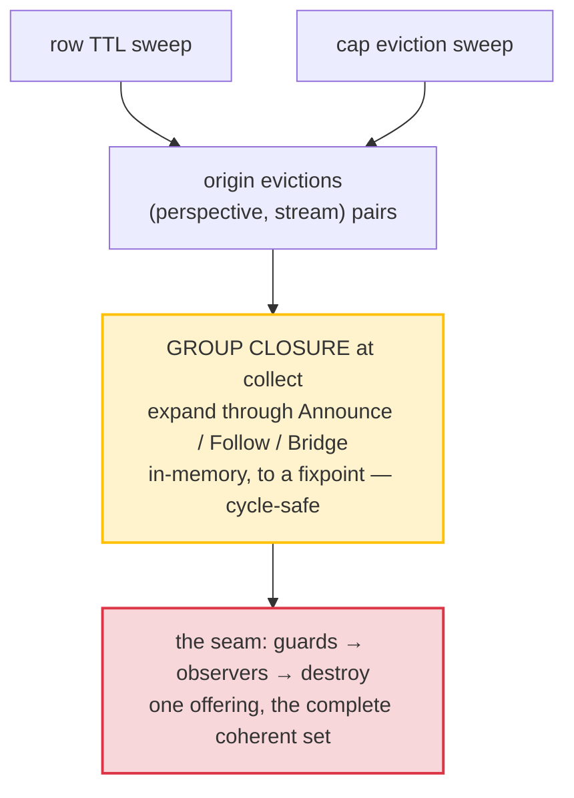

# The Pre-Destruction Seam

Row retention taught Whizbang to delete things. Rows expire on a sliding window, caps evict the coldest, reapers collect consumed ephemeral bodies, deep maintenance prunes ancient pointers, and a stream close truncates a log. Every one of those is a *destructive sweep*, and every one of them currently destroys without offering anyone a last look.

Three otherwise-unrelated features turn out to need exactly that last look, at exactly the same moment:

1. **External-resource cleanup** — a `Download` row references a blob; deleting the row orphans the blob. The blob must be verifiably gone *before* the row is.
2. **Coherent group eviction** — when a stream is evicted from one perspective, its rows in declared sibling perspectives should leave in the same sweep, not strand as satellites on independent clocks.
3. **Apply-stack lineage** — the ordered event path that built each stream is analytical gold, and destruction is the last moment it exists. Fold it into an aggregate on the way out, or lose it.

Rather than three ad-hoc pre-steps, this proposal defines **one seam**: a well-defined moment before every destructive sweep where the about-to-be-destroyed set is offered to registered participants. Two of the framework's existing mechanisms — the reap-driven snapshot step and the ephemeral destruction hooks — are already this pattern, built twice independently. This generalizes what they proved.

:::planned
Proposed capability, unreleased. It builds on the destruction-hook contract from [Destruction Hooks & TTL](destruction-hooks-ttl) — whose `DestructionGranularity.PerspectiveRow` member has existed since the contract was defined and has never been wired — plus the row-retention sweeps, the association registry, and the maintenance worker's established pre-step pattern.
:::

## The seam

Every destructive sweep gains the same three-phase shape:

**Guards** may veto or postpone. They are the existing `IDestructionHook` contract — `Proceed` / `Defer(until)` / `Cancel` — applied at row and stream granularity, not just event granularity. Opt-in per perspective: a perspective with no guard keeps today's pure-SQL fast path, untouched. A guard that throws gets the existing failure ladder (retry with backoff, then the configured `OnDestroyFailure` policy), never fail-open into deleting a row whose external resource wasn't cleaned.

**Observers** run after guards decide, over the *proceeding* set only — a deferred row is not dead, and must not be counted as dead. Observers can never block destruction; an observer failure is logged and the sweep continues. Lineage folding is an observer.

**Ordering matters and is fixed**: collect → guards → observers → destroy. Guards before observers, because observers record what *actually* dies.

The seam applies uniformly to all five destructive sweeps: row TTL expiry, cap eviction, ephemeral body reap (already partially hooked), ancient pointer prune, and stream close. The group cascade (consumer 2) is deliberately *not* a sixth sweep — it expands the collect set of the row sweeps, so a cascaded row passes through the same guards and observers as the row whose eviction triggered it. A `Download` row orphans its blob identically whether TTL expired it, a cap evicted it, or a group cascaded it — so a guard registered once must fire on all paths.

## Consumer 1 — external-resource cleanup (the row guard)

The motivating case: `Download` and upload perspectives whose models carry blob references. Their retention is blocked today precisely because the row reapers are pure SQL — the row would die with the reference inside it, orphaning the blob forever.

With the seam:

1. The collect phase hands the guard the batch of about-to-reap rows (stream ids + model payloads).
2. The guard deletes the blobs, **verifies** deletion, and returns `Proceed` for verified rows and `Defer` for the rest.
3. The database row outlives the blob, never the reverse — a dangling ticket beats an orphaned blob.

`Defer` maps onto the existing per-row `expires_at`: bumping it *is* the hold, zero new schema, and the effective-expiry ladder already honors it. Batched offering (one call per sweep with the whole set) lets a blob guard bulk-delete instead of chattering per row.

## Consumer 2 — perspective stream groups (the coherent cascade)

Per-perspective row TTLs age each row on its own clock. A chat stream feeds a dozen perspectives; cap-evicting its list row strands its satellites — per-conversation machinery rows whose own windows won't expire for weeks — and write-once satellite rows (extracted facts serving as per-conversation memory) would vanish from *still-active* conversations under any independent sliding window, because their `updated_at` never advances and reads wake nothing. Satellites should not age independently at all: they should leave **when the stream leaves the perspectives that decide such things**.

An earlier draft declared a stream TTL on the event contracts. That locus is deliberately reversed here. Retention duration is an *operational tuning value*, not a semantic property of an event — the same reasoning that keeps TTL out of the type-definition settings hash — and a contract-level declaration forces one policy onto every consuming service, when a BFF mirror may legitimately want a different window than the owning service. Retention already lives on perspective models (`RowTtl`, `RowCap`); coherence belongs beside it. Events keep semantic lifecycle (ephemerality); perspectives keep operational retention. Groups are **service-local** — a mirror in another service declares its own group.

**The declaration is a group membership.** A perspective model carries one or more `[StreamGroup("key")]` attributes; same key within a service = one group. Each *membership* — not the perspective — carries three dials:

| Dial | Default | Meaning |
|---|---|---|
| `Announce` | on | my **own-origin** evictions (my row TTL, my cap, my explicit purge) are announced to this group |
| `Follow` | on | when this group announces a stream, my row for it dies too |
| `Bridge` | **off** | evictions I *received* through another group are re-announced into this one |

The own-origin/received distinction is load-bearing. A perspective in two groups announces its own evictions to both — that is not bridging. Whether an eviction *received* from one group propagates through a shared member into the other is `Bridge`, default off so two groups sharing a member don't silently weld into one transitive deletion graph. A perspective with no membership is untouchable by cascades regardless of what streams it shares — deliberately long-retention perspectives simply don't join.

Concretely, with `g1 = {a, b}`, `g2 = {b, d, e}`, and `c` ungrouped with its own long `RowTtl`:

| Origin eviction of stream S | Effect |
|---|---|
| `a` evicts S | `b` follows via g1; `d`, `e` only if `b`'s g2 membership bridges; `c` untouched |
| `b` evicts S (own TTL/cap) | `a`, `d`, `e` all follow — own-origin announces to both groups, no bridging involved |
| `d` evicts S | `b`, `e` follow via g2; `a` only if `b`'s g1 membership bridges |
| `c` evicts S | nothing else — `c` is in no group |

**Decisions, not rules.** An eviction decision is irreducibly local to the perspective that made it: its sliding clock is stamped by *its own* applies (perspectives over the same stream apply different event subsets and hold different last-activity times for the same stream), its cap is a ranking over *its own* rows, its defer state is its own. No sibling can recompute the rule — siblings consume the rule's **outputs**, of which there are exactly two: the eviction *event* (the live cascade) and the surviving *row set* (presence, for rebuilds). Nothing in this design derives an "effective group TTL"; no such thing exists.

**The cascade happens at collect.** Origin evictions come from the existing sweeps, unchanged. The group closure — expanding the evicted `(perspective, stream)` set through memberships honoring the dials, to a fixpoint — is in-memory set arithmetic inserted at the seam's collect phase, so guards see the *complete* coherent set in one offering and cyclic bridged groups converge trivially (each pair enters the set at most once).

Guard deferral stays **per-row**: if one member's row defers (its blob delete failed), the rest of the group's rows proceed and coherence converges when the defer retries — the row-outlives-blob invariant is per-row and outranks group atomicity.

**Cascade-only; no group clock.** The group controls *togetherness*, not *whether*. Something must still evict first, so at least one member carries a real evictor — and every member should keep its own backstop `RowTtl`, because a group whose only trigger died via a non-bridged cascade would otherwise linger forever.

**The event store is not touched.** This is read-model coherence, not stream death. An evicted stream re-folds everywhere on its next event (resurrection-on-wake) — correct, because activity means alive. Stream death — carry-forward, gated truncate, archive — is the close-the-books machinery, scheduled and explicit; and once a truly-dead stream is closed at the log, rebuilds have nothing left to resurrect. Two tiers, two cadences, same seam.

**Rebuilds are staged.** Cascades are edge-triggered, and that breaks naive rebuilds two ways: rebuilding a follower alone resurrects rows whose eviction event fired long ago and cannot re-fire (the origin rows are gone), and mid-rebuild, absence in a sibling's table is ambiguous — "evicted" vs "not folded yet." Symmetric groups (mutual `Follow`) have no rebuild order that avoids reading a table in flux, so ordering tricks cannot fix this; a barrier does. The rebuild of any grouped perspective gains an explicit eviction stage:

1. **Fold** — every perspective in the rebuild set folds to completion. A perspective may inline-skip streams using rules it *owns* (its own absolute TTL against its own business time); it may never consume a sibling's decision here, because those don't all exist until the barrier.
2. **Evict** — one seam invocation over settled data: each rebuilt perspective's own evictors run (a cap is unrankable until its fold completes, so caps *require* this stage); origin evictions cascade through the closure; then a **presence anti-join** across group members drops streams no reachable announcer holds, catching decisions that predate the rebuild. Post-barrier absence is unambiguous — every table read is either a completed fold or a live table that was never rebuilding — so partial rebuilds work identically.
3. **Swap** (blue-green) — eviction already ran against the green tables, so the swap never exposes resurrected dead streams.

Rewind needs nothing: it fires only when an event touches the stream, a touched stream is alive, and resurrection is the correct outcome.

**The purity invariant, scoped.** Each perspective's evictors must be a pure function of *its own* apply history — business time, never wall clock — so its own sweep after a rebuild reproduces its own decisions. Per-perspective self-consistency is all convergence requires; cross-perspective purity is neither required nor possible.

**Analyzer.** Three checks: (1) *drift* — the association registry knows which perspectives share stream-feeding event types, so a perspective sharing them with a group's members while joining no group gets a warning, acknowledged by an explicit isolation marker so "I chose to keep these streams" is distinguishable from "I forgot"; (2) a group with no announcing evictor anywhere is inert, flagged; (3) `Bridge` on a membership in a single-member group is meaningless, flagged.

**Cost.** Perspective rows are keyed by stream id, so collect and destroy are `= ANY(@evicted)` index hits — group-size extra single-row deletes per evicted stream. The closure is in-memory. The presence anti-join is the one operation that scans, and it runs only inside rebuild stage 2, never on the maintenance cadence.

**Regression locks** — the invariants the implementation pins as tests (RED before GREEN, code↔docs↔tests maps regenerated as each lands):

- an own-origin eviction announces to *all* memberships; a received cascade crosses groups only when `Bridge` is set
- a non-member perspective sharing the same streams is never cascaded
- cyclic bridged groups converge — fixpoint, no row offered twice
- guards receive the full closure in one batch; a `Defer` holds that row only and retries to coherence
- rebuild-then-sweep converges to the identical evicted set (business-time purity, per perspective)
- a follower rebuilt alone: the presence pass drops streams its announcers evicted before the rebuild
- an announcer rebuilt alone: its own sweep re-evicts and the cascade no-ops idempotently on absent follower rows
- blue-green: no evicted stream is visible after swap — the eviction stage precedes it
- an inline fold-skip derived from a sibling's rule is a bug the tests must catch, not an optimization

## Consumer 3 — apply-stack lineage (the observer)

Every stream's row in a perspective was built by applying an ordered sequence of events. That sequence — the *apply stack* — is fully persisted already: event-store pointers carry `(stream_id, version, event_type)`, version **is** the apply order, and the association registry defines each perspective's filtered view of it. Nothing new needs capturing. What's missing is the aggregate: **counts of the stacks themselves**, so the shapes streams take through a perspective can be seen, compared, and acted on — rendered as the familiar before/after flow graph (pick an anchor event type, see the weighted paths N steps either side, long tail collapsed).

The aggregate is a **path-signature table**:

| | |
|---|---|
| Row | `(scope, path_hash, path, stream_count, first_seen, last_seen)` |
| `path` | `array_agg(event_type ORDER BY version)`, run-length collapsed (`StatusUpdated×47` → `StatusUpdated+`), first-K/last-K elision for pathological lengths |
| Size | scales with *distinct shapes*, not streams or events |
| Derived views | the anchored ±N flow graph, pairwise edges, funnels, terminal-type detection — all projections of this one table |

The compute splits on a boundary that happens to be exactly the retention boundary:

- **Settled streams** (terminal type at head, or idle past a window) fold **once** into the signature counts and are never revisited. **Fold-before-discard**: when the pointer prune or a stream close is about to destroy a stream's pointers, the observer folds its path first. *The stream dies; its shape survives.*
- **Live streams** are queried on demand — the industry approach (the flow-graph tooling this imitates computes at view time over a random sample and extrapolates; its own UI admits the sampling). The live set is recent and small; sample it if it isn't.

Exact counts land precisely where retention decisions are made — settled streams — and approximation only ever touches streams that wouldn't be cleaned yet. Nothing runs on the hot path.

What the graph buys back for retention closes the loop: **terminal-path detection** (event types nothing ever follows) turns group-membership candidate selection from hand-picking perspectives into a data-derived decision; **path archetypes** ("completed-saga shape", "import residue", "stalled mid-pattern") let retention policy attach to a shape instead of a table; and a stalled-mid-pattern stream is an *anomaly to surface*, not residue to delete — the same graph that justifies deletion also protects against it.

**Serving the view.** The flow view is not only a maintenance input — it is queried *interactively*: by the VS Code extension during local development (an anchored flow visual of the apply stacks, in the Application Insights style) and against deployed environments over an exposed API. The query surface therefore ships as a first-class, opt-in facility with the same enablement shape as the service-status endpoint:

- **One query contract in core** — anchored ±N view, signature listing, stream drill-in — returning aggregates, path signatures, and event-type names only, never event payloads.
- **Thin host adapters** expose it over the host's preferred stack: raw ASP.NET minimal-API mapping (the zero-dependency default), FastEndpoints, or Hot Chocolate — adapter packages, so no HTTP framework leaks into core and AOT stays clean.
- **Disabled by default.** Enabling it in a deployed environment is an explicit choice with the host's own auth in front, and results are scope-filtered — a tenant-scoped caller sees only its own shapes.
- **The extension is environment-configured** — named environments with URLs — and its *local* mode may connect to the local API, query the dev database directly, or read an offline cache of a previous result. All four transports (env API, local API, direct DB, cache) speak the same contract shape, so the query contract defines the result model once and every consumer renders the same graph.

## Why one seam and not three features

Because they are one moment. The guard, the coherent sweep, and the fold all need "the set about to be destroyed, before it is destroyed, off the hot path" — and the framework has already built that moment twice (reap-driven snapshots, ephemeral destruction hooks), each time as a one-off. A third, fourth, and fifth one-off would each re-answer batching, failure policy, ordering, and opt-in registration slightly differently. The seam answers them once:

- **Batched**, one offer per sweep per participant
- **Opt-in**, per perspective (guards) or globally registered (observers); non-participants cost nothing
- **Guards before observers before destruction**, always
- **Guard failure** → the existing retry-then-policy ladder; **observer failure** → logged, never blocking
- **All destruction paths**, uniformly — TTL, cap, group cascade, body reap, pointer prune, stream close

## What this is not

- **Not a general event bus.** The seam fires only inside maintenance sweeps, on the maintenance cadence, in the maintenance worker's scope.
- **Not a veto over the event log.** Guards hold *read-model rows and satellite resources*. Event-log truncation keeps its own machinery (close gates, carry-forward guards).
- **Not message-causation lineage.** Hop chains (causation/correlation ids) are a different graph on a different axis — message flow, not apply order. A causal-descendant overlay ("what did this stream cause?") is a possible later addition to the flow view, not part of this.
- **Not new capture on the hot path.** Everything the three consumers need is either already persisted (pointers, associations) or computed inside maintenance.

## Open questions

- **Atomic-group defer.** Default is per-row defer with eventual coherence. Is an opt-in "one defer holds the stream across the whole group" mode worth having for consumers where partial presence is worse than lingering?
- **Group-level idle clock.** v1 is cascade-only. A later `[StreamGroup("k", IdleTtl = …)]` could evict on group-wide idleness — deferred until a real need, since it reintroduces the "whose clock?" question the dials deliberately avoid.
- **Observed apply order.** Version order is canonical and free. Actual arrival order (before rewinds converge it) is capturable by folding perspective work items before their purge — worth it as an opt-in second signature kind whose divergence from version order is itself a rewind-health signal?
- **Adoption gating for groups.** Row retention's acknowledge-before-enforce and backlog preview need group-scoped equivalents — "which streams would cascade, from which origin" — and the preview could *be* the flow graph.
- **Guard time budget.** A guard doing external I/O (blob deletes) inside the maintenance cycle needs a budget so one slow provider can't stall the whole cycle; deferred work self-heals next cycle either way.

## Build sequence

1. **The flow view, read-only** — the on-demand path query over pointers (no fold, no seam, no schema). Immediately useful for understanding stream makeup, validates the signature/RLE design against real data before anything persists, and defines the query contract every serving transport reuses.
2. **The apply-stack API** — the opt-in host adapters (raw ASP.NET / FastEndpoints / Hot Chocolate) over the step-1 contract, service-status-style enablement; the VS Code extension consumes the same surface (env URL, local API, direct DB, or offline cache). Needs only step 1.
3. **The seam contract** — generalize the two existing pre-steps (snapshot step, ephemeral hooks) onto collect → guards → observers → destroy, behavior-preserving. The row sweeps gain their collect queries.
4. **The row guard** (consumer 1) — unblocks retention on blob-referencing perspectives. Smallest consumer, highest immediate value.
5. **The signature fold** (consumer 3, persistent half) — settled-stream folding + fold-before-discard observers on the sweeps that destroy pointers.
6. **Stream groups** (consumer 2) — the `[StreamGroup]` attribute + membership dials, the closure at collect, the staged rebuild (fold → barrier → evict → swap) with the presence pass, and the analyzer checks; candidate groups informed by the now-existing flow data.

Step 1 ships value with zero risk; each later step consumes the ones before it. Every step lands docs-first with strict TDD — its regression locks written RED before the mechanism exists — and with `<docs>`/`<tests>` linking plus regenerated code↔docs↔tests maps, so the docs, the code, and the invariant tests stay navigable from each other.
