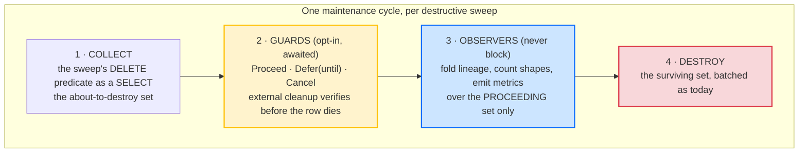
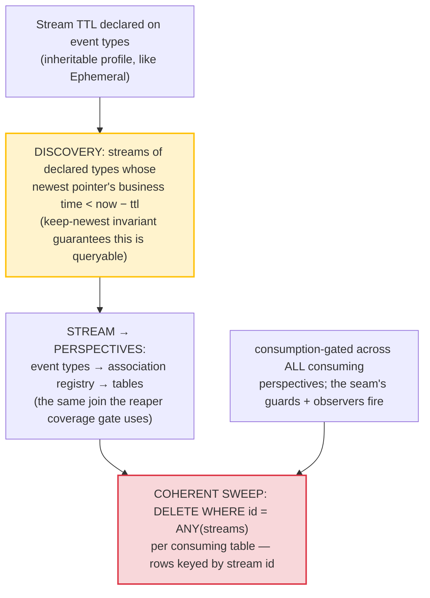

# The Pre-Destruction Seam

Row retention taught Whizbang to delete things. Rows expire on a sliding window, caps evict the coldest, reapers collect consumed ephemeral bodies, deep maintenance prunes ancient pointers, and a stream close truncates a log. Every one of those is a *destructive sweep*, and every one of them currently destroys without offering anyone a last look.

Three otherwise-unrelated features turn out to need exactly that last look, at exactly the same moment:

1. **External-resource cleanup** — a `Download` row references a blob; deleting the row orphans the blob. The blob must be verifiably gone *before* the row is.
2. **Stream-scoped TTL** — a stream that expires should take every perspective row it owns with it, coherently, in one sweep.
3. **Apply-stack lineage** — the ordered event path that built each stream is analytical gold, and destruction is the last moment it exists. Fold it into an aggregate on the way out, or lose it.

Rather than three ad-hoc pre-steps, this proposal defines **one seam**: a well-defined moment before every destructive sweep where the about-to-be-destroyed set is offered to registered participants. Two of the framework's existing mechanisms — the reap-driven snapshot step and the ephemeral destruction hooks — are already this pattern, built twice independently. This generalizes what they proved.

:::planned
Proposed capability, unreleased. It builds on the destruction-hook contract from [Destruction Hooks & TTL](destruction-hooks-ttl) — whose `DestructionGranularity.PerspectiveRow` member has existed since the contract was defined and has never been wired — plus the row-retention sweeps, the association registry, and the maintenance worker's established pre-step pattern.
:::

## The seam

Every destructive sweep gains the same three-phase shape:

**Guards** may veto or postpone. They are the existing `IDestructionHook` contract — `Proceed` / `Defer(until)` / `Cancel` — applied at row and stream granularity, not just event granularity. Opt-in per perspective: a perspective with no guard keeps today's pure-SQL fast path, untouched. A guard that throws gets the existing failure ladder (retry with backoff, then the configured `OnDestroyFailure` policy), never fail-open into deleting a row whose external resource wasn't cleaned.

**Observers** run after guards decide, over the *proceeding* set only — a deferred row is not dead, and must not be counted as dead. Observers can never block destruction; an observer failure is logged and the sweep continues. Lineage folding is an observer.

**Ordering matters and is fixed**: collect → guards → observers → destroy. Guards before observers, because observers record what *actually* dies.

The seam applies uniformly to all five destructive sweeps: row TTL expiry, cap eviction, ephemeral body reap (already partially hooked), ancient pointer prune, and stream close/TTL. A `Download` row orphans its blob identically whether TTL expired it, a cap evicted it, or its stream died — so a guard registered once must fire on all paths.

## Consumer 1 — external-resource cleanup (the row guard)

The motivating case: `Download` and upload perspectives whose models carry blob references. Their retention is blocked today precisely because the row reapers are pure SQL — the row would die with the reference inside it, orphaning the blob forever.

With the seam:

1. The collect phase hands the guard the batch of about-to-reap rows (stream ids + model payloads).
2. The guard deletes the blobs, **verifies** deletion, and returns `Proceed` for verified rows and `Defer` for the rest.
3. The database row outlives the blob, never the reverse — a dangling ticket beats an orphaned blob.

`Defer` maps onto the existing per-row `expires_at`: bumping it *is* the hold, zero new schema, and the effective-expiry ladder already honors it. Batched offering (one call per sweep with the whole set) lets a blob guard bulk-delete instead of chattering per row.

## Consumer 2 — stream-scoped TTL (the coherent sweep)

Per-perspective row TTLs age each row on its own clock. A chat stream feeds a dozen perspectives; its rows expire at different times, cap-evicting its list row strands its satellites, and write-once satellite rows (extracted facts serving as per-conversation memory) would vanish from *still-active* conversations under any independent sliding window — their `updated_at` never advances and reads wake nothing. Row TTL is the wrong shape for satellites of a living stream. They should die **with the stream**.

A stream TTL is declared on the **contracts** — an inheritable attribute or profile on the stream's event types, the same mechanism ephemeral profiles use — so it resolves virally to every consuming perspective, including cross-service mirrors that per-perspective attributes only reach today by hand-duplication.

Resolution is event-type-keyed end to end, and every piece already exists:

The only new cost is discovery — "streams whose last business activity is past the window" — and it is bounded twice: only streams of *declared* types are ever scanned (the same type-filter trick as the ephemeral reaper's flag test), and the deep-maintenance keep-newest-pointer invariant means max-business-time-per-stream stays queryable forever.

**Precedence**: the stream TTL is a *floor* — nothing a stream owns outlives the stream. A per-perspective `[RowTtl]` may only be shorter. Declaring a longer per-row window than the stream's is a contradiction the analyzer should flag.

**The sweep respects the consumption gate per perspective**: a stream expired for one perspective may still hold unprocessed work items in another; the coherent sweep waits for all of them.

## Consumer 3 — apply-stack lineage (the observer)

Every stream's row in a perspective was built by applying an ordered sequence of events. That sequence — the *apply stack* — is fully persisted already: event-store pointers carry `(stream_id, version, event_type)`, version **is** the apply order, and the association registry defines each perspective's filtered view of it. Nothing new needs capturing. What's missing is the aggregate: **counts of the stacks themselves**, so the shapes streams take through a perspective can be seen, compared, and acted on — rendered as the familiar before/after flow graph (pick an anchor event type, see the weighted paths N steps either side, long tail collapsed).

The aggregate is a **path-signature table**:

| | |
|---|---|
| Row | `(scope, path_hash, path, stream_count, first_seen, last_seen)` |
| `path` | `array_agg(event_type ORDER BY version)`, run-length collapsed (`StatusUpdated×47` → `StatusUpdated+`), first-K/last-K elision for pathological lengths |
| Size | scales with *distinct shapes*, not streams or events |
| Derived views | the anchored ±N flow graph, pairwise edges, funnels, terminal-type detection — all projections of this one table |

The compute splits on a boundary that happens to be exactly the retention boundary:

- **Settled streams** (terminal type at head, or idle past a window) fold **once** into the signature counts and are never revisited. **Fold-before-discard**: when the pointer prune, a stream close, or the stream TTL is about to destroy a stream's pointers, the observer folds its path first. *The stream dies; its shape survives.*
- **Live streams** are queried on demand — the industry approach (the flow-graph tooling this imitates computes at view time over a random sample and extrapolates; its own UI admits the sampling). The live set is recent and small; sample it if it isn't.

Exact counts land precisely where retention decisions are made — settled streams — and approximation only ever touches streams that wouldn't be cleaned yet. Nothing runs on the hot path.

What the graph buys back for retention closes the loop: **terminal-path detection** (event types nothing ever follows) turns stream-TTL candidate selection from hand-picking perspectives into a data-derived decision; **path archetypes** ("completed-saga shape", "import residue", "stalled mid-pattern") let retention policy attach to a shape instead of a table; and a stalled-mid-pattern stream is an *anomaly to surface*, not residue to delete — the same graph that justifies deletion also protects against it.

## Why one seam and not three features

Because they are one moment. The guard, the coherent sweep, and the fold all need "the set about to be destroyed, before it is destroyed, off the hot path" — and the framework has already built that moment twice (reap-driven snapshots, ephemeral destruction hooks), each time as a one-off. A third, fourth, and fifth one-off would each re-answer batching, failure policy, ordering, and opt-in registration slightly differently. The seam answers them once:

- **Batched**, one offer per sweep per participant
- **Opt-in**, per perspective (guards) or globally registered (observers); non-participants cost nothing
- **Guards before observers before destruction**, always
- **Guard failure** → the existing retry-then-policy ladder; **observer failure** → logged, never blocking
- **All destruction paths**, uniformly — TTL, cap, body reap, pointer prune, stream close/TTL

## What this is not

- **Not a general event bus.** The seam fires only inside maintenance sweeps, on the maintenance cadence, in the maintenance worker's scope.
- **Not a veto over the event log.** Guards hold *read-model rows and satellite resources*. Event-log truncation keeps its own machinery (close gates, carry-forward guards).
- **Not message-causation lineage.** Hop chains (causation/correlation ids) are a different graph on a different axis — message flow, not apply order. A causal-descendant overlay ("what did this stream cause?") is a possible later addition to the flow view, not part of this.
- **Not new capture on the hot path.** Everything the three consumers need is either already persisted (pointers, associations) or computed inside maintenance.

## Open questions

- **Cap-eviction cascade.** When a capped list row is evicted, is that *stream* eviction (satellites go too) or *row* eviction (today's semantics)? Leaning: a distinct, explicitly-declared stream-eviction behavior — not silently widened cap semantics.
- **Observed apply order.** Version order is canonical and free. Actual arrival order (before rewinds converge it) is capturable by folding perspective work items before their purge — worth it as an opt-in second signature kind whose divergence from version order is itself a rewind-health signal?
- **Adoption gating for stream TTL.** Row retention's acknowledge-before-enforce and backlog preview need stream-scoped equivalents — and the preview could *be* the flow graph.
- **Guard time budget.** A guard doing external I/O (blob deletes) inside the maintenance cycle needs a budget so one slow provider can't stall the whole cycle; deferred work self-heals next cycle either way.

## Build sequence

1. **The flow view, read-only** — the on-demand path query over pointers (no fold, no seam, no schema). Immediately useful for understanding stream makeup, and validates the signature/RLE design against real data before anything persists.
2. **The seam contract** — generalize the two existing pre-steps (snapshot step, ephemeral hooks) onto collect → guards → observers → destroy, behavior-preserving. The row sweeps gain their collect queries.
3. **The row guard** (consumer 1) — unblocks retention on blob-referencing perspectives. Smallest consumer, highest immediate value.
4. **The signature fold** (consumer 3, persistent half) — settled-stream folding + fold-before-discard observers on the sweeps that destroy pointers.
5. **Stream TTL** (consumer 2) — declaration, discovery, coherent sweep, riding the now-existing seam; candidate selection informed by the now-existing flow data.

Step 1 ships value with zero risk; each later step consumes the ones before it.
