# The Startup Pipeline

Whizbang has startup *stages* but no startup *pipeline*. The lifecycle phases report progress accurately; nothing sequences the work they report on. Ordering is an emergent property of DI registration order plus a single boolean gate, and everything that gate does not cover races.

This proposal makes startup an explicit, ordered, individually-controllable sequence of declared steps — so that "run this after that", "run this on exactly one instance", and "run this last" become things the framework can express instead of things a comment claims.

:::planned
Proposed capability, unreleased. It is the sibling of [Fleet Startup Orchestration](fleet-startup-orchestration), which answers *which instance* does startup work. This one answers *in what order, under what control, and how do we know it finished*. Both build on machinery that already exists — the schema-ready gate, the lifecycle phase machine, the `wh_settings` compare-and-swap watermark.
:::

## Current state

There is exactly one ordering primitive: `ISchemaReadyGate`, a sticky completion signal opened once by the database initializer. Twenty-three hosted services take it, and thirteen background services do not. Everything else about startup order is incidental.

`LifecyclePhaseWorker` is the whole state machine:

```csharp
AdvanceTo(Connecting);
AdvanceTo(Migrating);
await _schemaReadyGate.WaitForReadyAsync();
AdvanceTo(Running);
```

It **observes** one signal and narrates it. No worker waits on the *phase* — they each independently await the same gate. The phases are a faithful report of schema readiness, not a controller of anything.

For its actual purpose that scope is correct, and the fail-closed behaviour is real: if initialization never completes, the gate never opens, the phase stays `Migrating`, and the availability filter keeps refusing writes. That part works.


### What that costs

These are not independent defects. Each is the same missing abstraction surfacing somewhere different.

| Symptom | Consequence |
|---|---|
| `PerspectiveWorker` never takes the gate, yet its `ExecuteAsync` immediately runs orphan-lifecycle reconcile and rewind repair against the database | On a cold database both silently no-op inside a catch-all, and that boot's rewind repair simply does not happen. A comment in the same file asserts the gate "has already been awaited" — it has not. |
| Thirteen background services bypass the gate, including the whole notification stack | The durable-signal tail reads `wh_signals` and the lifecycle monitor scans `wh_service_instances`, tables that may not exist yet on first boot |
| Two services block host startup *and* skip the gate | Work issued against a possibly-unmigrated schema, while also delaying every other service's start |
| The type-definition reconciler starts on gate-open and can still be reclassifying history | It races the perspective worker already draining events of those same types |
| Transport consumers provision and subscribe independently of the gate | Brokers can deliver before the schema is ready |
| The claim worker performs a redundant heartbeat write | Purely to paper over a race with the heartbeat worker registering the instance row — a race patched instead of sequenced |
| The HTTP availability gate keys on the same single boolean, at the wrong layer | Keyed on HTTP verb, it cannot express "only reads that touch a perspective" — and cannot express it at all for GraphQL, where every field shares one route — see [Serving traffic during startup](#serving-traffic-during-startup) |
| Nothing means "finished" | `Running` means *the schema is ready*, not *startup is complete*. Health can answer the first question and has no way to answer the second. |
| Nothing outside the framework can observe any of it | A consumer cannot see which step is running, what it did, or how long it took. There is no seam to hang a diagnostic, a gauge, or a deployment gate on. |

A subtler one, and the reason this matters beyond tidiness: **a step that silently does nothing is indistinguishable from a step that succeeded.** Rewind repair skipped by a cold-database catch-all reports exactly what rewind repair that found nothing to do reports.

### Two seams already exist and are unused

`IHostedLifecycleService` — with `StartingAsync` / `StartedAsync` / `StoppingAsync` / `StoppedAsync` — is referenced nowhere in the framework, and neither is `IHostApplicationLifetime.ApplicationStarted`. `StartedAsync` runs after every `StartAsync` has returned. The hook that would mean "after everything" is available and has never been claimed.

## Final state

Startup becomes a declared pipeline. Each step states what it is, what it needs, who runs it, and whether the system is allowed to be considered ready without it.

```mermaid
graph TB
    subgraph Register["1 · Register"]
        G1["receptor registrars · hook binders<br/>retention config · warm-ups &nbsp;&nbsp;(no I/O)"]
    end
    subgraph Connect["2 · Connect"]
        C1["pool warm · database reachable"]
    end
    subgraph Elect["3 · Elect"]
        E1["leased slot over wh_settings CAS<br/>ONE instance proceeds to exclusive steps"]
    end
    subgraph Migrate["4 · Migrate &nbsp;&nbsp;[fleet-exclusive]"]
        M1["schema init · ledger · version stamp<br/>registry reconciles (in-transaction)"]
    end
    subgraph Identify["5 · Identify"]
        I1["instance row in wh_service_instances<br/>first heartbeat"]
    end
    subgraph Reconcile["6 · Reconcile"]
        R1["type definitions · associations<br/>retention sync"]
    end
    subgraph Repair["7 · Repair"]
        P1["orphaned lifecycles · rewind scan"]
    end
    subgraph Provision["8 · Provision"]
        V1["transport discovery · subscribe<br/>notification stack"]
    end
    subgraph Ready["9 · Ready"]
        Y1["health flips · workers unpause<br/>availability gate opens"]
    end
    subgraph Post["10 · Post-ready &nbsp;&nbsp;(observed, never awaited)"]
        Z1["requested table rewrites &nbsp;[fleet-exclusive]<br/>cross-service manifest exchange"]
    end

    Register --> Connect --> Elect --> Migrate --> Identify --> Reconcile --> Repair --> Provision --> Ready --> Post

    style Migrate fill:#cce5ff,stroke:#0d6efd,stroke-width:2px
    style Post fill:#e2e3e5,stroke:#6c757d,stroke-width:2px
    style Ready fill:#d4edda,stroke:#28a745,stroke-width:2px
```



Blue steps run on exactly one instance per fleet. The rest run everywhere. The grey band is reported but never awaited — see [Steps that cannot block](#steps-that-cannot-block).

Three steps are new relative to the shape the framework has today, and each exists because real startup work currently has nowhere to live:

- **`Register`** covers the in-process wiring that happens before any I/O — receptor registrars, hook binders, retention configuration, warm-ups. Roughly eight services do this today, ordered only by DI registration position. One of them documents that dependency in prose: *"runs before the worker pipeline processes anything (hosted services start in registration order)."* That is an ordering guarantee asserted by comment, which is the thing this proposal exists to replace.
- **`Identify`** owns "this instance exists in `wh_service_instances`". Nothing owns it today, which is why the claim worker performs a redundant heartbeat write to paper over the race — and why `Elect`, which needs a registered instance to lease a slot, has no declared predecessor.
- **`Migrate`** is drawn as containing the perspective-registry and message-type-registry reconciles, because that is where they actually run: inside the advisory lock and inside the migration transaction, alongside the DDL that creates the tables they populate. Pulling them into `Reconcile` would cost them that atomicity. Naming them here is honest about the granularity question below rather than drawing a picture the code does not match.

### The step contract

Every step declares, rather than implies:

- **Identity** — a stable name that appears in logs, metrics and health detail
- **Dependencies** — by name, not by registration position
- **Exclusivity** — `Fleet` (one instance, via the leased slot) or `EveryInstance`
- **Blocking** — must complete before `Ready`, or runs after it
- **Enablement** — individually switchable, so an operator can skip one step without disabling the worker that hosts it
- **Outcome** — `Completed` / `Skipped` / `Failed`, with duration and reason
- **Progress** — optional, while the step is running: a message, and a `(current, total)` pair when the step knows its own size

The outcome field is load-bearing on its own. It is what makes "this step found nothing to do" distinguishable from "this step could not run", which today it is not.

Progress is what makes a long step legible instead of merely long. The framework already assumes this exists — `ComponentHealth`'s own documentation offers `"migrating: step 7/12, 420k/1.35M rows"` as its example of health detail — but there is no mechanism behind the example. Two rules keep it honest: progress is **optional**, because a step that cannot estimate its size must not invent a denominator; and **absent progress is not stalled progress**, so anything consuming it has to distinguish "this step reports nothing" from "this step reported nothing since 09:14".

### Steps that cannot block

Some startup work has no completion an instance can observe, because completing depends on the rest of the fleet. The clearest case is the **cross-service manifest exchange**: the integrity audit asks each known origin for its digests and compares the answers when they arrive. Whether that finishes depends on other services being up and answering — it is a fleet property, not an instance property. An instance that waited for it would wait on peers that may be waiting on it.

Such steps are declared `Blocking = false` and live in the post-ready band. They are still **steps**: they have identity, dependencies, outcome, duration, and they raise the same events as any other. They simply never gate `Ready`.

This is a contract, not a footnote. A step whose completion is not locally decidable must be declared non-blocking, or the pipeline deadlocks on a distributed condition.

The manifest exchange also shows why the outcome field has to carry a *reason*. Its origin set is in-memory and empty at boot, populated only by inbound checkpoints. A first cycle that fires before any peer has checkpointed asks nobody, and today that is indistinguishable from a cycle that asked everyone and found no gaps — with the next attempt a full interval away. `Skipped("no origins known yet")` is a different fact from `Completed(0 gaps)`, and only one of them warrants retrying sooner.

### Hooks

The pipeline is the first thing in the framework with a startup story worth subscribing to, so it publishes one. Two seams, both explicit — no assembly scanning, consistent with the zero-reflection and native-AOT constraints.

**Observation.** An implementation of `IStartupStepObserver`, registered in DI, is called as each step starts and finishes:

```csharp
public interface IStartupStepObserver {
  ValueTask OnStepStartingAsync(StartupStepContext context, CancellationToken ct);
  ValueTask OnStepCompletedAsync(StartupStepResult result, CancellationToken ct);
  ValueTask OnPipelineCompletedAsync(StartupSummary summary, CancellationToken ct);
}
```

`StartupStepResult` carries the step identity, its outcome, duration and reason. Observers are advisory: one that throws is logged and does not fail the step, because a diagnostic must not be able to break a boot. The framework's own logging and metrics are written as observers, so the built-in path and the consumer path are the same path — the usual guard against a public seam that quietly gets less care than the internal one.

**Interrogation.** `IStartupPipelineState` answers questions at any moment, for code that needs to make a decision rather than watch a transition:

```csharp
public interface IStartupPipelineState {
  bool IsComplete { get; }
  StartupStepStatus StatusOf(string stepName);
  IReadOnlyList<StartupStepResult> Completed { get; }
  Task WaitForAsync(string stepName, CancellationToken ct);
}
```

`WaitForAsync` is what lets a consumer's own hosted service say "after `Migrate`" instead of guessing at registration order — and it is what the framework's thirteen ungated services should have been able to say all along.

Whether consumers may *contribute* steps is still open (see below). Observing and interrogating are safe to commit to now; contributing is a public extension contract with versioning obligations, and nothing forces that decision yet.

### How the existing machinery folds in

Nothing is replaced.

- **The lifecycle phase machine stays.** Phases become the observable projection of pipeline progress rather than a hand-written four-liner. `Connecting` / `Migrating` / `Running` keep their current meanings; `Ready` is added as a distinct state that means the blocking steps drained.
- **`ISchemaReadyGate` stays**, demoted from *the* global barrier to the completion signal of the `Migrate` step. Workers then wait on the step they actually depend on rather than all waiting on the same one.
- **Election comes from [Fleet Startup Orchestration](fleet-startup-orchestration)**, whose first increment is admission control with leased slots over the `wh_settings` compare-and-swap. This proposal consumes that; it does not redesign it.
- **Health gains a real answer.** `Running` continues to mean the schema is ready. `Ready` means the pipeline drained, composed from the blocking steps plus signals that already exist but nothing consumes — transport subscription readiness among them.

### Serving traffic during startup

The framework already binds an HTTP pipeline while startup work is still running, and by default it *serves reads* into it. Three defaults compose into that:

- `NonBlockingSchemaInit` defaults to **true**, so `StartAsync` returns immediately and initialization continues in the background. The host binds its port and starts serving during `Migrate`. (The initializer's own XML doc still describes blocking as the default — it is stale, and worth fixing regardless of this proposal.)
- The availability gate is injected turnkey by a startup filter and defaults to `MutationsOnly` — writes get 503 while the schema initializes; `GET` / `HEAD` / `OPTIONS` pass through.
- The gate's only input is `ISchemaReadyGate.IsReady`, one boolean.

The stated rationale for letting reads through is that they "hit the read-model tables, untouched by an event-store migration". That holds for **upgrading an already-initialized database**. It does not hold on a **cold boot**: perspective tables are created *inside* the very initialization the gate is waiting on. A lens query served during `Migrate` on a fresh database reads a relation that does not exist yet.

There is a second, quieter window after that one. Once the schema is ready the gate opens completely, but perspectives may still be draining history — cursors behind, rewind repair unfinished. A lens query answered then returns results that are *structurally valid and semantically wrong*: empty or stale, and indistinguishable from a legitimately empty result. This is the same silent-skip pathology as the rest of the proposal, surfacing on the read path where a caller sees it.

#### Gate the lens, not the route

The work that is unsafe during startup is **reading a perspective**, so that is what gets gated — not "reads", not "non-exempt paths". Health and liveness endpoints keep answering. So does everything of the consumer's own that never touches a lens.

That distinction cannot be drawn at the HTTP layer, which is why the current verb-based mode is a proxy rather than an answer:

- **GraphQL multiplexes.** Every field lives behind one route. A middleware can 503 `/graphql` or pass it, and neither is right when one query selects a lens-backed field beside a static one.
- **Routes are not a reliable signal of what runs.** A consumer's own endpoint may call a lens internally; a Whizbang-shaped route may not touch one at all.
- **Verbs are wrong in both directions.** A `GET` can read a perspective; a `POST` can be a search that reads one; neither fact is visible from the method.

So the check belongs at the lens execution seam — `ILensQuery<TModel>` — where the thing being protected actually happens. One check, and every caller inherits it:

| Caller | Behaviour while the read model is not serve-able |
|---|---|
| Minimal-API / FastEndpoints lens endpoint | `503` with `Retry-After` |
| HotChocolate lens field | A field error with a machine-readable code, so non-lens fields in the same query still resolve |
| Consumer code calling a lens directly | A typed exception naming the step it is waiting on |
| Health, liveness, version | Unaffected — they never run a lens |
| Consumer endpoints that touch no lens | Unaffected |

Writes keep the coarse protection they have today: the availability gate continues to refuse mutations while the schema initializes. Lens gating is added beside that, not in place of it.

The window this closes is wider than the cold-boot case that motivates it. Gating on *the read model being serve-able* rather than on *the schema existing* also covers the second window — schema ready, perspectives still draining — where a lens answers with results that are structurally valid and semantically wrong. Serving those is not a performance optimization; it is a 500 dressed as a 200.

#### Health reports the stage, and the state of that stage

Probes answer from pipeline state rather than from one boolean:

| Pipeline state | Liveness | Readiness | Detail reported |
|---|---|---|---|
| Before `Migrate` completes | Healthy | Not ready | current step, elapsed, progress if the step reports it |
| `Migrate` … `Ready` | Healthy | Not ready | as above |
| After `Ready` | Healthy | Ready | complete, with per-step outcomes |
| Post-ready steps running | Healthy | Ready | complete, plus which post-ready steps are still going |

Liveness stays `Healthy` in every row. That invariant is already correct and this proposal does not touch it — restarting a process cannot finish a migration, it can only discard the progress that was making one.

Most of the machinery for the detail column exists. `IWhizbangHealthSource` reports a `ComponentState` and a free-text `Detail`; the aggregator maps state through a per-component `HealthPolicy`; `WhizbangManagedHealthCheck` already surfaces every component's state and detail into the ASP.NET health result. What is missing is a source that reports *the pipeline* — its current step and that step's progress. Adding one is a small, additive change that makes every existing health consumer more informative without touching the aggregator.

Two type gaps have to close for the table above to be expressible, both small and both load-bearing:

- `ComponentState` has no member between `Migrating` and `Operational`, so a distinct `Ready` has nowhere to land. It needs one, plus the matching `HealthPolicy` row.
- `HealthProbe` has only `Liveness` and `Readiness`. Kubernetes' startup probe — the one that exists precisely so a slow boot does not get killed by liveness — has no representation. Adding it is what lets a long `Migrate` be *correctly* slow rather than *suspiciously* slow.

`SchemaReadyHealthCheck` keeps working unchanged; it answers a narrower question (is the schema initialized) that stays meaningful once the pipeline can answer the broader one.

### Extensions must be able to ask

The availability gate is one consumer of pipeline state; it should not be the only one that can be written. Anything layered over Whizbang — an API surface, a GraphQL resolver, a background job, another library — needs to be able to ask *"is the thing I depend on ready?"* and get a real answer.

That is what `IStartupPipelineState` is for. An extension that reads perspectives waits on `Provision`; one that only appends events waits on `Migrate`. Today the only available answer is the single schema-ready gate, which is why so much code either takes it (and waits longer than it needs to) or skips it (and races). A per-step query replaces one over-broad barrier with the dependency each caller actually has.

### Startup as an API surface

The question people actually ask during a slow boot is *"what is it doing right now?"*, and today the only way to answer it is to read the logs of a pod that may not be serving yet. The pipeline can answer it directly, over the host's own API surface — plain ASP.NET, or either of the two API extensions the framework ships.

**The surfaces are opt-in.** Unlike the availability gate — which self-wires through `IStartupFilter` because it is a safety behaviour every host wants — a status endpoint publishes internal state, and publishing is a decision the host should make rather than inherit from a package reference. Each surface is one explicit call:

- **ASP.NET / minimal API** — `MapWhizbangStartupStatus()`, in the ASP.NET hosting integration so it is available to every ASP.NET host regardless of which transport extensions are in play.
- **FastEndpoints** — an endpoint registered through the package's own conventions, so it participates in FastEndpoints' security model and preprocessors rather than sitting beside them.
- **HotChocolate** — a `whizbangStartup` query field contributed by a type extension on the request-executor builder.

All three project the same shape: current step, ordered step list with outcome and duration, progress where a step reports it, and whether the pipeline is complete.

**They inherit the host's authentication rather than defining their own.** The framework contributes no authorization model here; it returns the host's own extension point and stops:

- `MapWhizbangStartupStatus()` returns `IEndpointConventionBuilder`, so `.RequireAuthorization(…)`, `.RequireHost(…)` and `.AllowAnonymous()` chain as on any endpoint — and mounting it inside an already-secured route group inherits that group's conventions with no extra call.
- The FastEndpoints endpoint honours that package's `Roles()` / `Permissions()` / `AccessControl()` configuration.
- The GraphQL field is an ordinary field, so `[Authorize]` and the existing Whizbang GraphQL security integration apply to it exactly as they do elsewhere.

The default route is **`/whizbang/startup`**, and it is overridable — `MapWhizbangStartupStatus("/ops/boot")` mounts it wherever the host prefers. The namespaced default is chosen so that a single edge rule against `/whizbang/*` covers this endpoint and anything added beside it later, which is the property an operator actually needs; overridability means a host with a conflicting route or its own convention is never stuck with it. Because the surfaces are opt-in, the default is a starting point rather than a global path claimed on every consumer's behalf.

One route is worth ruling out explicitly. **`/.well-known/` is the wrong home for this**, however tempting its collision-freedom. That prefix is routinely allowlisted past authentication at CDNs, ingress controllers and reverse proxies so ACME HTTP-01 challenges can reach the origin, and those rules are usually written against the whole prefix rather than the one sub-path that needs it. Mounting an access-controlled diagnostic there places it where infrastructure has most likely already decided authentication does not apply — an exemption invisible from the application's own configuration. It is also a registry rather than a free namespace (RFC 8615 expects IANA-registered suffixes), it is the first place automated scanners enumerate, and some edges serve it from static storage without reaching the application at all. Its purpose is third-party-discoverable site metadata; an internal diagnostic is the opposite of that.

Three constraints are not negotiable, and each is a way this feature could ship broken:

**It must not share a failure domain with what it reports on.** A startup endpoint that cannot answer until startup finishes is worthless precisely when it is wanted. Three specific hazards:

- The availability gate 503s non-exempt paths while the schema initializes, so whatever route the host mounts must be added to the exempt set alongside `/alive`, `/health` and `/version`. Mapping the endpoint should register its own exemption rather than leaving that as a step the caller can forget.
- A GraphQL schema whose build touches Whizbang lens types may not be buildable during `Migrate` at all. That asymmetry makes the **minimal-API surface the primary one** and the GraphQL field a convenience — a diagnostic reachable only through the subsystem under diagnosis is not a diagnostic.
- **The authentication in front of it must not depend on Whizbang having started.** Whizbang's own permission model is safe here: it is claims-based off the token, with no database round-trip. A consumer-supplied policy that resolves roles from the database is not — it would block on the migration the endpoint exists to report on. Worth stating in the guidance, because the failure looks like a hang rather than a misconfiguration.

**It must not become an information-disclosure surface.** The split that matters is not "less detail versus more" but **content the framework authors versus content it does not control**. The default projection is entirely the former: step names, states, durations, progress counters — every value a framework constant. The `reason` field is the latter: reasons originate in exception messages, which routinely carry schema names, table names, constraint names and raw driver error text. Those are therefore a separate opt-in level, not a verbosity dial. A host that has secured the endpoint may reasonably turn them on; one that has mounted it anonymously for a load balancer should not have them by default.

**It must degrade honestly.** Before the pipeline has started, the endpoint reports *not started*, not `200 {}`. An empty step list and a pipeline that has not begun must not serialize identically.

Push-based progress — streaming stage transitions over the existing SignalR integration rather than polling — is a natural extension of the observer seam and deliberately out of scope here. Poll first; the shape of the data is the same either way.

### What moves

The repair work currently sitting ungated inside `PerspectiveWorker.ExecuteAsync` becomes a declared `Repair` step that genuinely cannot begin before `Migrate` completes — which is what the comment in that file already claims and the code does not do. The reconciler becomes a `Reconcile` step ordered before perspective drain rather than racing it. Transport provisioning becomes `Provision`.

Table rewrites — the blocking, space-reclaiming `VACUUM FULL` that a migration can request — become a post-ready step: fleet-exclusive, non-blocking with respect to `Ready`, and deliberately unbounded, because a half-finished rewrite is worse than a slow one. Today that work runs on the *runtime* maintenance cadence, taking an exclusive lock mid-traffic; the pipeline gives it the window it should always have had.

The cross-service manifest exchange joins them there. It does not move — it already runs on its own timer after the gate opens — but it gains a declared identity, an outcome and a reason, so "asked no origins" stops reading as "found no gaps". Nothing waits on it, and the fleet-level question of *when* an instance may run it stays with [Fleet Startup Orchestration](fleet-startup-orchestration), which already names the deep audit as admitted work. The jittered startup delay it hand-rolls today is a stand-in for exactly that admission control.

Startup maintenance is the one piece that should move and shrink. `perform_maintenance` and a four-table `VACUUM ANALYZE` currently run on **every** boot, unconditionally — the fast path skips the DDL but not the maintenance tail that follows it. As a declared step it becomes conditional, attributable, and skippable.

## What this is not

- **Not a replacement for the phase machine or the health system.** Both keep their current contracts; the pipeline gives them something more accurate to report. The liveness invariant — `Healthy` in every state — is untouched.
- **Not fleet coordination.** *Which* instance runs an exclusive step is [Fleet Startup Orchestration](fleet-startup-orchestration)'s problem. This proposal only says a step *is* exclusive.
- **Not reflection-based discovery.** Steps register explicitly, consistent with the framework's zero-reflection and native-AOT constraints. No assembly scanning.
- **Not a general workflow engine.** The pipeline runs once, at startup, in one process. Recurring work stays where it is.
- **Not a completion contract for cross-service work.** The manifest exchange and anything else whose completion depends on peers is reported, never awaited.

## Open questions

- **Failure policy per step.** Should a failed non-blocking step degrade readiness, or only be reported? A failed `Repair` is arguably survivable; a failed `Reconcile` may not be.
- **Consumer-declared steps.** Observation and interrogation are settled — consumers get both. Whether they may *add* steps is not: that turns the descriptor into a public extension contract with the versioning obligations that implies.
- **Granularity of `Migrate`.** Schema initialization is one opaque step containing seven internal phases, two of which are registry reconciles that other steps arguably depend on. Exposing the phases individually would let those dependencies be declared instead of assumed, at the cost of a much larger surface — and of committing to phase names that are currently free to change.
- **Which step makes the read model serve-able.** Gating lens reads is settled; the barrier they wait on is not. `Migrate` is too early — the tables exist but perspectives have not drained. `Ready` is defensible but couples every read to steps a lens does not care about, such as transport provisioning. The honest answer is probably a dedicated read-model barrier, which argues for finer `Migrate` granularity and ties back to the question above it.
- **Startup-probe adoption.** Adding `HealthProbe.Startup` is only useful if the turnkey wiring emits it and the documentation tells operators to bind it. A probe nobody binds is worse than none, because it looks like coverage.
- **Whether `reason` detail should be enableable per-environment rather than per-host.** The opt-in level is a single switch today. A host that wants failure detail in staging and terse output in production can already achieve that through configuration, but nothing stops the two drifting apart — and the environment where the detail matters most is the one where it is least safe.
- **Does progress belong in health detail too?** `ComponentHealth` already has a free-text detail field whose documented example is a progress string. Feeding pipeline progress into it would make every existing health consumer better for free, at the cost of putting a moving value in a field some consumers may treat as stable.

## Build sequence

1. **Step contract and registry** — the descriptor, explicit registration, and a runner that resolves declared dependencies into an execution order. Inert: every existing step registers with its current behaviour and current (accidental) ordering, so nothing changes yet.
2. **Observability and hooks** — per-step duration, outcome and reason; `IStartupStepObserver` and `IStartupPipelineState`, with the framework's own logging and metrics written as observers. This alone makes the silent-skip class visible, before any behaviour moves, and gives consumers something to build on while the rest lands.
3. **Adopt the real barriers** — `ISchemaReadyGate` becomes `Migrate`'s completion signal; the thirteen bypassing services declare what they actually depend on. This is where the ordering defects get fixed, one declared dependency at a time.
4. **`Ready` as a composite** — the terminal signal, on the unused `IHostedLifecycleService.StartedAsync` seam, composed from blocking-step completion. Carries the `ComponentState` addition and the `HealthPolicy` row.
5. **Status endpoints** — opt-in surfaces over `IStartupPipelineState`: the minimal-API mapping at `/whizbang/startup` (overridable, self-exempting from the availability gate, returning `IEndpointConventionBuilder` so host auth applies), then the FastEndpoints and HotChocolate equivalents. Terse by default, `reason` detail opt-in. Depends only on increments 1–2, so it can land early and pay for itself while the behavioural increments are still in flight.
6. **Health and the read path** — a pipeline health source so probes report the current step and its progress, plus the `ComponentState` addition and `HealthProbe.Startup` if adopted; and the lens-level barrier, so `ILensQuery` refuses while the read model is not serve-able and every surface inherits one check.
7. **Exclusivity** — consume the leased slot from [Fleet Startup Orchestration](fleet-startup-orchestration) so `Fleet` steps mean something. Until this lands, `Fleet` degrades to `EveryInstance` and must be documented as such.
8. **Move the rewrites** — requested table rewrites become a post-ready step; the runtime maintenance cycle stops executing them and records requests instead.

Increments 1, 2 and 5 are additive and independently valuable — they make the current state legible without changing it. Increments 3, 4 and 6 onward change behaviour and want the regression coverage that implies. Increment 6 is the one with a visible blast radius: it changes what a running service does with an in-flight request, and wants its own deliberate rollout.

### Fixes that do not wait

Mapping the current behaviour turned up defects that are real today and independently shippable. None of them should be held hostage to the architecture that would have prevented them; each is listed here so the pipeline work does not become the reason they went unfixed.

**The migration advisory lock excluded nothing.** The key was derived from `string.GetHashCode`, which .NET seeds randomly per process — so every instance computed a different key, every instance acquired its own private lock, and all of them entered the migration path together. Only the in-lock hash re-check and `IF NOT EXISTS` stood between that and concurrent DDL, and neither covers `CREATE OR REPLACE FUNCTION` or settings-gated data migrations. Fixed ahead of this proposal with a process-stable key; noted here because `Migrate` being genuinely fleet-exclusive is an assumption the rest of the pipeline rests on.

**The initializer's documentation contradicts its default.** `NonBlockingSchemaInit` defaults to `true`, while the XML doc on `WhizbangDatabaseInitializerService` describes blocking as the default. Anyone reasoning about startup from that doc reaches the wrong conclusion about the most consequential question there is — whether the host is serving traffic while migrations run. A documentation fix with no behaviour change, and it should not wait for increment 6 to arrive and make the same point.

**A cold-start audit can ask nobody and not retry for a day.** The cross-service manifest exchange draws its origin set from an in-memory tracker that is empty at boot and filled only by inbound checkpoints on a 60-second cadence, while the first audit fires 30 seconds plus up to five minutes of jitter after the gate opens. On a cold fleet start those windows overlap: the cross-service half iterates an empty collection, asks nothing, logs nothing, reports success, and falls through to the 1440-minute interval. The failure is worst in exactly the scenario [Fleet Startup Orchestration](fleet-startup-orchestration) was written about — when peers are slow to migrate, their checkpoints are late, and the audit that would find missing events is the thing most likely to no-op.

The narrow fix is available now: a cycle that had no origins to ask should re-arm the startup window rather than the full interval. The pipeline completes it rather than replacing it — once a step reports outcome and reason, "asked nobody" is a distinct `Skipped` result that a retry policy can key on, instead of a special case bolted to one worker.
