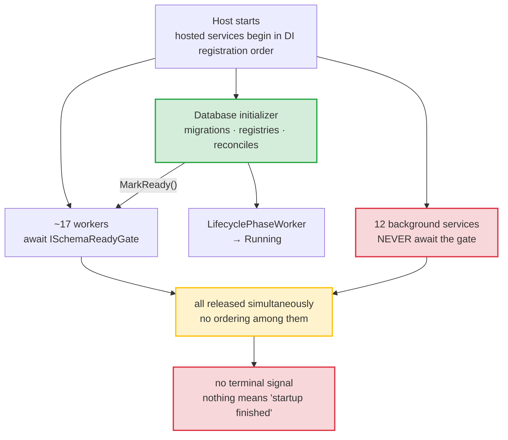
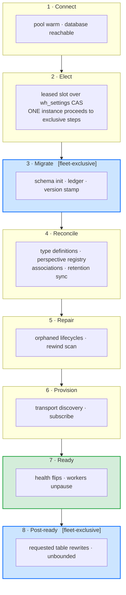

# The Startup Pipeline

Whizbang has startup *stages* but no startup *pipeline*. The lifecycle phases report progress accurately; nothing sequences the work they report on. Ordering is an emergent property of DI registration order plus a single boolean gate, and everything that gate does not cover races.

This proposal makes startup an explicit, ordered, individually-controllable sequence of declared steps — so that "run this after that", "run this on exactly one instance", and "run this last" become things the framework can express instead of things a comment claims.

:::planned
Proposed capability, unreleased. It is the sibling of [Fleet Startup Orchestration](fleet-startup-orchestration), which answers *which instance* does startup work. This one answers *in what order, under what control, and how do we know it finished*. Both build on machinery that already exists — the schema-ready gate, the lifecycle phase machine, the `wh_settings` compare-and-swap watermark.
:::

## Current state

There is exactly one ordering primitive: `ISchemaReadyGate`, a sticky completion signal opened once by the database initializer. Around thirty types reference it. Everything else about startup order is incidental.

`LifecyclePhaseWorker` is the whole state machine:

```csharp
AdvanceTo(Connecting);
AdvanceTo(Migrating);
await _schemaReadyGate.WaitForReadyAsync();
AdvanceTo(Running);
```

It **observes** one signal and narrates it. No worker waits on the *phase* — they each independently await the same gate. The phases are a faithful report of schema readiness, not a controller of anything.

For its actual purpose that scope is correct, and the fail-closed behaviour is real: if initialization never completes, the gate never opens, the phase stays `Migrating`, and the availability filter keeps refusing writes. That part works.



### What that costs

These are not independent defects. Each is the same missing abstraction surfacing somewhere different.

| Symptom | Consequence |
|---|---|
| `PerspectiveWorker` never takes the gate, yet its `ExecuteAsync` immediately runs orphan-lifecycle reconcile and rewind repair against the database | On a cold database both silently no-op inside a catch-all, and that boot's rewind repair simply does not happen. A comment in the same file asserts the gate "has already been awaited" — it has not. |
| Twelve background services bypass the gate, including the whole notification stack | The durable-signal tail reads `wh_signals` and the lifecycle monitor scans `wh_service_instances`, tables that may not exist yet on first boot |
| Two services block host startup *and* skip the gate | Work issued against a possibly-unmigrated schema, while also delaying every other service's start |
| The type-definition reconciler starts on gate-open and can still be reclassifying history | It races the perspective worker already draining events of those same types |
| Transport consumers provision and subscribe independently of the gate | Brokers can deliver before the schema is ready |
| The claim worker performs a redundant heartbeat write | Purely to paper over a race with the heartbeat worker registering the instance row — a race patched instead of sequenced |
| Nothing means "finished" | `Running` means *the schema is ready*, not *startup is complete*. Health can answer the first question and has no way to answer the second. |

A subtler one, and the reason this matters beyond tidiness: **a step that silently does nothing is indistinguishable from a step that succeeded.** Rewind repair skipped by a cold-database catch-all reports exactly what rewind repair that found nothing to do reports.

### Two seams already exist and are unused

`IHostedLifecycleService` — with `StartingAsync` / `StartedAsync` / `StoppingAsync` / `StoppedAsync` — is referenced nowhere in the framework, and neither is `IHostApplicationLifetime.ApplicationStarted`. `StartedAsync` runs after every `StartAsync` has returned. The hook that would mean "after everything" is available and has never been claimed.

## Final state

Startup becomes a declared pipeline. Each step states what it is, what it needs, who runs it, and whether the system is allowed to be considered ready without it.



Blue steps run on exactly one instance per fleet. The rest run everywhere.

### The step contract

Every step declares, rather than implies:

- **Identity** — a stable name that appears in logs, metrics and health detail
- **Dependencies** — by name, not by registration position
- **Exclusivity** — `Fleet` (one instance, via the leased slot) or `EveryInstance`
- **Blocking** — must complete before `Ready`, or runs after it
- **Enablement** — individually switchable, so an operator can skip one step without disabling the worker that hosts it
- **Outcome** — `Completed` / `Skipped` / `Failed`, with duration and reason

The outcome field is load-bearing on its own. It is what makes "this step found nothing to do" distinguishable from "this step could not run", which today it is not.

### How the existing machinery folds in

Nothing is replaced.

- **The lifecycle phase machine stays.** Phases become the observable projection of pipeline progress rather than a hand-written four-liner. `Connecting` / `Migrating` / `Running` keep their current meanings; `Ready` is added as a distinct state that means the blocking steps drained.
- **`ISchemaReadyGate` stays**, demoted from *the* global barrier to the completion signal of the `Migrate` step. Workers then wait on the step they actually depend on rather than all waiting on the same one.
- **Election comes from [Fleet Startup Orchestration](fleet-startup-orchestration)**, whose first increment is admission control with leased slots over the `wh_settings` compare-and-swap. This proposal consumes that; it does not redesign it.
- **Health gains a real answer.** `Running` continues to mean the schema is ready. `Ready` means the pipeline drained, composed from the blocking steps plus signals that already exist but nothing consumes — transport subscription readiness among them.

### What moves

The repair work currently sitting ungated inside `PerspectiveWorker.ExecuteAsync` becomes a declared `Repair` step that genuinely cannot begin before `Migrate` completes — which is what the comment in that file already claims and the code does not do. The reconciler becomes a `Reconcile` step ordered before perspective drain rather than racing it. Transport provisioning becomes `Provision`.

Table rewrites — the blocking, space-reclaiming `VACUUM FULL` that a migration can request — become the final step: fleet-exclusive, non-blocking with respect to `Ready`, and deliberately unbounded, because a half-finished rewrite is worse than a slow one. Today that work runs on the *runtime* maintenance cadence, taking an exclusive lock mid-traffic; the pipeline gives it the window it should always have had.

## What this is not

- **Not a replacement for the phase machine or the health system.** Both keep their current contracts; the pipeline gives them something more accurate to report.
- **Not fleet coordination.** *Which* instance runs an exclusive step is [Fleet Startup Orchestration](fleet-startup-orchestration)'s problem. This proposal only says a step *is* exclusive.
- **Not reflection-based discovery.** Steps register explicitly, consistent with the framework's zero-reflection and native-AOT constraints. No assembly scanning.
- **Not a general workflow engine.** The pipeline runs once, at startup, in one process. Recurring work stays where it is.

## Open questions

- **Failure policy per step.** Should a failed non-blocking step degrade readiness, or only be reported? A failed `Repair` is arguably survivable; a failed `Reconcile` may not be.
- **Consumer-declared steps.** Should applications be able to add their own steps to the pipeline, or is it framework-internal? Consumer steps would make it a public contract with the versioning obligations that implies.
- **Granularity of `Migrate`.** Schema initialization is currently one opaque step containing seven internal phases. Exposing them individually would improve observability at the cost of a much larger surface.
- **Does `Ready` gate traffic differently from `Running`?** Today the availability filter refuses writes while migrating. Whether it should also refuse them between `Running` and `Ready` is a product decision, not a technical one.

## Build sequence

1. **Step contract and registry** — the descriptor, explicit registration, and a runner that resolves declared dependencies into an execution order. Inert: every existing step registers with its current behaviour and current (accidental) ordering, so nothing changes yet.
2. **Observability first** — per-step duration, outcome and reason, surfaced in logs and health detail. This alone makes the silent-skip class visible, before any behaviour moves.
3. **Adopt the real barriers** — `ISchemaReadyGate` becomes `Migrate`'s completion signal; the twelve bypassing services declare what they actually depend on. This is where the ordering defects get fixed, one declared dependency at a time.
4. **`Ready` as a composite** — the terminal signal, on the unused `IHostedLifecycleService.StartedAsync` seam, composed from blocking-step completion.
5. **Exclusivity** — consume the leased slot from [Fleet Startup Orchestration](fleet-startup-orchestration) so `Fleet` steps mean something. Until this lands, `Fleet` degrades to `EveryInstance` and must be documented as such.
6. **Move the rewrites** — requested table rewrites become the final step; the runtime maintenance cycle stops executing them and records requests instead.

Increments 1 and 2 are additive and independently valuable — they make the current state legible without changing it. Increments 3 onward change behaviour and want the regression coverage that implies.
