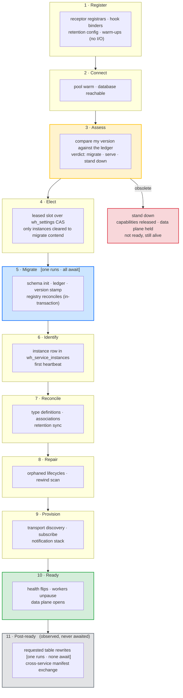
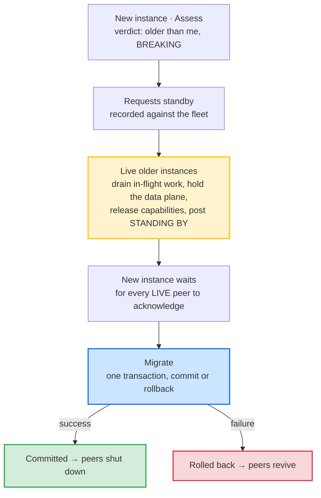

# The Startup Pipeline

Whizbang has startup *stages* but no startup *pipeline*. The lifecycle phases report progress accurately; nothing sequences the work they report on. Ordering is an emergent property of DI registration order plus a single boolean gate, and everything that gate does not cover races.

This proposal makes startup an explicit, ordered, individually-controllable sequence of declared steps — so that "run this after that", "run this on exactly one instance", and "run this last" become things the framework can express instead of things a comment claims.

:::planned
Proposed capability, unreleased. It is the sibling of [Fleet Startup Orchestration](fleet-startup-orchestration), which answers *which instance* does startup work. This one answers *in what order, under what control, and how do we know it finished*. Both build on machinery that already exists — the schema-ready gate, the lifecycle phase machine, the `wh_settings` compare-and-swap watermark.
:::

## Current state

There is exactly one ordering primitive: `ISchemaReadyGate`, a sticky completion signal opened once by the database initializer. Twenty-three hosted services take it, and thirteen background services do not. Everything else about startup order is incidental.

`LifecyclePhaseWorker` is the whole state machine:

```csharp
AdvanceTo(Connecting);
AdvanceTo(Migrating);
await _schemaReadyGate.WaitForReadyAsync();
AdvanceTo(Running);
```

It **observes** one signal and narrates it. No worker waits on the *phase* — they each independently await the same gate. The phases are a faithful report of schema readiness, not a controller of anything.

For its actual purpose that scope is correct, and the fail-closed behaviour is real: if initialization never completes, the gate never opens, the phase stays `Migrating`, and the availability filter keeps refusing writes. That part works.


### What that costs

These are not independent defects. Each is the same missing abstraction surfacing somewhere different.

| Symptom | Consequence |
|---|---|
| `PerspectiveWorker` never takes the gate, yet its `ExecuteAsync` immediately runs orphan-lifecycle reconcile and rewind repair against the database | On a cold database both silently no-op inside a catch-all, and that boot's rewind repair simply does not happen. A comment in the same file asserts the gate "has already been awaited" — it has not. |
| Thirteen background services bypass the gate, including the whole notification stack | The durable-signal tail reads `wh_signals` and the lifecycle monitor scans `wh_service_instances`, tables that may not exist yet on first boot |
| Two services block host startup *and* skip the gate | Work issued against a possibly-unmigrated schema, while also delaying every other service's start |
| The type-definition reconciler starts on gate-open and can still be reclassifying history | It races the perspective worker already draining events of those same types |
| Transport consumers provision and subscribe independently of the gate | Brokers can deliver before the schema is ready |
| The claim worker performs a redundant heartbeat write | Purely to paper over a race with the heartbeat worker registering the instance row — a race patched instead of sequenced |
| The HTTP availability gate keys on the same single boolean, at the wrong layer | Keyed on HTTP verb, it cannot express "only reads that touch a perspective" — and cannot express it at all for GraphQL, where every field shares one route — see [Serving traffic during startup](#serving-traffic-during-startup) |
| Nothing means "finished" | `Running` means *the schema is ready*, not *startup is complete*. Health can answer the first question and has no way to answer the second. |
| Nothing outside the framework can observe any of it | A consumer cannot see which step is running, what it did, or how long it took. There is no seam to hang a diagnostic, a gauge, or a deployment gate on. |

A subtler one, and the reason this matters beyond tidiness: **a step that silently does nothing is indistinguishable from a step that succeeded.** Rewind repair skipped by a cold-database catch-all reports exactly what rewind repair that found nothing to do reports.

### Two seams already exist and are unused

`IHostedLifecycleService` — with `StartingAsync` / `StartedAsync` / `StoppingAsync` / `StoppedAsync` — is referenced nowhere in the framework, and neither is `IHostApplicationLifetime.ApplicationStarted`. `StartedAsync` runs after every `StartAsync` has returned. The hook that would mean "after everything" is available and has never been claimed.

## Final state

Startup becomes a declared pipeline. Each step states what it is, what it needs, who runs it, and whether the system is allowed to be considered ready without it.



Blue steps require an exclusive capability, so exactly one instance executes them. **Every other step runs on every instance**, including all of `Identify` through `Ready` — exclusivity follows the capability a step requires, not a mode the pipeline enters at `Migrate` and stays in. `Identify` is the clearest case: each instance registers its own row.

The linear chain above is the order of steps, not a single thread of control. Every instance walks the whole pipeline; what differs is what it does at an exclusive step. The grey band is reported but never awaited — see [Steps that cannot block](#steps-that-cannot-block).

Four steps are new relative to the shape the framework has today, and each exists because real startup work currently has nowhere to live:

- **`Assess`** compares this instance's version against what the ledger says is already applied, and produces a verdict before anything is changed: *migrate*, *serve without migrating*, or *stand down*. It runs on **every instance**, unlike `Migrate` — an instance that will never win the migrator duty still needs to know whether it is obsolete. It sits before `Elect` so that an instance cleared only to serve never contends for a duty it must not perform. It is a read against the ledger: no lock, no transaction, cheap enough that every instance doing it costs nothing.

- **`Register`** covers the in-process wiring that happens before any I/O — receptor registrars, hook binders, retention configuration, warm-ups. Roughly eight services do this today, ordered only by DI registration position. One of them documents that dependency in prose: *"runs before the worker pipeline processes anything (hosted services start in registration order)."* That is an ordering guarantee asserted by comment, which is the thing this proposal exists to replace.
- **`Identify`** owns "this instance exists in `wh_service_instances`". Nothing owns it today, which is why the claim worker performs a redundant heartbeat write to paper over the race — and why `Elect`, which needs a registered instance to lease a slot, has no declared predecessor.
- **`Migrate`** is drawn as containing the perspective-registry and message-type-registry reconciles, because that is where they actually run: inside the advisory lock and inside the migration transaction, alongside the DDL that creates the tables they populate. Pulling them into `Reconcile` would cost them that atomicity. Naming them here is honest about the granularity question below rather than drawing a picture the code does not match.

### The step contract

Every step declares, rather than implies:

- **Identity** — a stable name that appears in logs, metrics and health detail
- **Dependencies** — by name, not by registration position
- **Required capability** — the capability an instance must hold to run this step. An exclusive capability (a *duty*) means one instance runs it; a shared capability means every instance does. Defaults to the universal shared capability, so a step that says nothing runs everywhere
- **Non-runner behaviour** — where the required capability is a duty, what the instances that did *not* win it do: `Await` the holder's completion, or `Skip` and carry on
- **Blocking** — must complete before `Ready`, or runs after it
- **Enablement** — individually switchable, so an operator can skip one step without disabling the worker that hosts it
- **Outcome** — `Completed` / `Skipped` / `Failed`, with duration and reason
- **Progress** — optional, while the step is running: a message, and a `(current, total)` pair when the step knows its own size

The outcome field is load-bearing on its own. It is what makes "this step found nothing to do" distinguishable from "this step could not run", which today it is not.

The required capability and non-runner behaviour stay separate fields, because the two duties in this proposal want opposite answers and one flag cannot express both:

- **`Migrate` requires the `migrator` duty, and non-holders `Await`.** One instance migrates; the others cannot proceed to `Reconcile` before the schema exists, so they wait for the winner rather than skipping ahead. That is already the behaviour the advisory lock produces — losing instances block, then re-check hashes, find nothing to do, and continue — so this formalizes what the code does rather than changing it.
- **The post-ready table rewrite requires the `maintainer` duty, and non-holders `Skip`.** One instance rewrites; nobody blocks on a `VACUUM FULL`, which is the entire reason it is post-ready and unbounded.

Collapsing these would either make every instance wait on a rewrite or let every instance race past an unfinished migration. Both are worse than the status quo.

#### Capabilities

"Exactly one instance does this" has already been hand-rolled three separate times — the migration advisory lock, the commit-order stamper's session lock, and the integrity audit's settings-CAS claim. Three mechanisms, three shapes, and no name for the thing they have in common.

A **capability** names it. A capability is something an instance **holds**, acquired by winning it, and an instance holds several at once. Nothing declares in advance which instances may hold what: every instance attempts everything, exactly as today. What changes is that holding becomes a named, recorded fact instead of an implicit consequence of winning a lock.

That capabilities are *won* rather than *assigned* is what keeps the failure path free. There is no durable "this one is the migrator" flag to orphan: an instance that dies releases its advisory lock server-side on disconnect, its transaction rolls back, and the next instance picks the capability up on its next attempt. Reassignment is automatic and needs no reaper — which a statically-assigned capability would.

Capabilities come in two kinds, and the distinction is one the pipeline already needs:

- **Exclusive capabilities** are held by one instance at a time — `migrator`, `maintainer`. Election decides which. An exclusive capability is a **duty**.
- **Shared capabilities** are held by every instance at once — the ordinary worker and serving capabilities.

Which means **step exclusivity is not a separate property at all — it falls out of the capability a step requires.** A step needing a duty runs on one instance; a step needing a shared capability runs on all of them. That removes a field from the descriptor and, more usefully, removes the possibility of declaring a contradiction — a step cannot claim to be fleet-exclusive while requiring a capability every instance holds.

Because every instance attempts every capability, this introduces no way to misconfigure a fleet into deadlock: a duty nobody currently holds is always one that somebody is about to take. That is a deliberate limit. Restricting *which* instances may attempt a capability — a dedicated migration job, an API-only host that starts no workers — is a real want and a natural later addition, and it is purely additive: an absent restriction means everyone attempts, which is precisely the behaviour defined here. Nothing in the model or the schema has to change to allow it later.

#### How instances coordinate at an exclusive step

Within the eligible set, no instance is *told* to proceed and the waiters do not poll application state. Every eligible instance calls the same step; the difference is what the call returns.

For `Migrate` the mechanism already exists and the pipeline formalizes rather than replaces it. Eligible instances attempt the advisory lock. One acquires it and migrates; the rest block in the retry loop. The winner's commit atomically releases the lock *and* publishes the durable evidence — the content hashes in `wh_schema_migrations`. A waiter then acquires the freed lock, re-checks those hashes, finds nothing to do, commits and continues.

The step therefore reports a different **outcome** per instance: `Completed` on the instance that migrated, `Skipped` with reason *"completed by another instance"* on the rest, and `Skipped` with reason *"capability not held"* on an instance that lost the race. Those are three genuinely different facts, and an operator needs to tell them apart.

**Stage state does not belong in the database by default.** Steps that run on every instance are local facts — they belong in memory and are served by that instance's own status surface. Only a step whose required capability is a duty and whose non-holders `Await` needs cross-instance completion state, and for `Migrate` that state already exists durably in the migration ledger.

#### Election is not membership

These are two different problems and they want two different mechanisms. Conflating them is how exclusivity designs acquire split-brain.

| Concern | Mechanism | Why |
|---|---|---|
| **Election** — who performs an exclusive duty | Database primitive: advisory lock, or CAS on `wh_settings` | Linearizable against the authority every instance already depends on. Self-healing, no timeout to tune, no split-brain window |
| **Membership** — who is alive, and which capabilities they hold | Heartbeat plus the `wh_instance_alive` session lock | Already built. Drives rebalancing, observability, and prompt re-attempt after a holder dies |

The framework has already reached this conclusion once, and written it down: the instance-liveness migration notes that a dropped connection releases its session lock so peers "detect the death within seconds rather than 30 s of heartbeat-table staleness", with the heartbeat table kept as the *fallback*. Server-side session death beats heartbeat staleness, because the server observes the failure directly instead of inferring it from silence.

That is also why leader liveness should not be re-derived from heartbeats for election purposes. A leader that is alive but briefly slow or partitioned gets declared dead by peers watching a timeout; they elect a replacement; two instances now believe they hold the duty. For `Migrate` that is two instances running DDL at once — the exact failure a process-stable lock key was introduced to prevent. Swapping a mechanism with no split-brain window for one with a tunable window is a regression.

Membership still matters, and for a reason sharper than observability: it is how the fleet notices a holder that died **without** cleanly releasing its lock. That case is real — a pod killed for memory can leave a half-open session whose advisory lock lingers — and it is why the heartbeat is a correctness backstop here rather than a convenience. It is simply not election.

#### Noticing a capability has come free

Capability holdings are **recorded**, but never **consulted to decide**. The distinction is the whole design:

> **The lock decides; the row reports.** An instance acquires a capability by attempting the primitive, not by reading a table. If the record and the lock ever disagree, the lock is right and the record is stale.

Treating a stored assignment as authoritative is what would reintroduce orphaned state — a dead instance's row goes on claiming a capability until something reaps it, and nobody may proceed until that happens. Treating it as *derived* state costs nothing and buys a great deal, which is why it is worth storing.

It also needs no new staleness machinery. `wh_service_instances` already carries a lease, a heartbeat and a reaper; held capabilities ride the same rails, so a dead instance's claims expire exactly as its liveness does.

Holdings live in their own table keyed by *(instance, capability)* rather than as a column on the instance row, for two reasons that both come from what already exists. An instance holds several capabilities at once, and the relationship carries its own data — `acquired_at` is the field that answers "how long has this instance been the migrator", which is the question a stored record is for. And the heartbeat's UPDATE is deliberately **skipped when the last one was under ten seconds ago**, a guard added against "millions of UPDATEs on a tiny table" in production. Writing holdings onto that row would either be swallowed by that guard for up to ten seconds — inside the takeover window, exactly when the record matters — or would have to bypass it and re-create the write amplification it exists to prevent. A separate table has neither problem: capability writes are small, independent, and on their own cadence. Reaping stays free, because stale instances are genuinely `DELETE`d and the foreign key cascades.

**Each instance also records its own state.** `LifecyclePhase` exists today but lives only in process memory, so no instance can see any other's. The handshake requires exactly that visibility — an instance cannot wait for its peers to reach standby unless reaching standby is something a peer can observe. Persisting the phase alongside the heartbeat makes the handshake possible, and incidentally gives the status surface a fleet-wide answer to "what is everyone doing right now", which is the question during a stalled rollout.

One caveat carries over from capabilities: a state *transition* must bypass the heartbeat's ten-second freshness guard. The guard exists to stop liveness ticks from writing constantly, and a transition is not a tick — it is the one write that must not be deferred, since the whole handshake turns on peers seeing it promptly.

What is otherwise recorded is simply **which capabilities each live instance currently holds**, and when it acquired them. That is enough to answer the questions that matter during an incident — which instance is the migrator right now, how long it has been, whether a duty is currently unheld — as a query rather than a broadcast to instances that may not be answering. It also settles how the status surface reports fleet-level state: a join, not a fan-out.

Later lifecycle work inherits the same record. Maintenance and operational commands can address *the instance holding capability X* rather than guessing, which is the reason to store what is held rather than merely elect it.

#### Takeover

An instance never looks up whether it has been *assigned* a capability — it **attempts acquisition**, and the primitive grants or refuses. Takeover therefore needs no coordination beyond that attempt:

1. The holder holds its session lock, and its record names the capability it holds.
2. The holder dies. On a clean session termination PostgreSQL releases the lock **immediately**, server-side, with no timeout to wait out.
3. Its record is briefly stale, still claiming the capability.
4. Another eligible instance attempts the lock: because it was already blocked on it, on its next poll, or prompted by `InstanceDiedSignal`.
5. It acquires the lock and **is the holder from that instant**, whatever any row still says.
6. Its next heartbeat records the capability; the dead instance's rows are reaped at lease expiry.

The record is inconsistent only between steps 2 and 6, and that is the heartbeat lease window the system already has. Storing capabilities adds no new class of staleness — it inherits one that is already reaped.

**Clean session termination is not the only way an instance dies.** A pod killed for exceeding memory can leave a half-open TCP session that PostgreSQL has not yet noticed, and its advisory lock can then linger for hours — long enough that waiters block indefinitely on a holder that no longer exists. The framework already carries the answer: `cleanup_stale_instances` takes a definitive-dead cutoff that deliberately overrides the alive-lock guard, on the reasoning that a heartbeat hours old is better evidence than a socket the server still believes is open.

Capability takeover inherits that override, and it is the reason heartbeat-based liveness is a **correctness backstop here rather than a latency optimization**. The lock is the fast, precise path and handles every clean failure; the heartbeat cutoff is what bounds the pathological one. Neither alone is sufficient, which is why both exist.

That leaves one question worth engineering: after a holder dies, how quickly does another instance attempt again? Three layers, only one of which carries correctness:

| Layer | Purpose | Load-bearing |
|---|---|---|
| **Attempt** — try to acquire | Authoritative | Yes — correct entirely on its own |
| **Signal** — `InstanceDiedSignal` prompts an immediate re-attempt | Cuts failover latency | No |
| **Poll backstop** — periodic re-attempt | Bounds latency when a notification is dropped | The floor beneath the signal |

The middle and lower layers already exist and should be consumed rather than reinvented. `PgInstanceLifecycleMonitor` scans `wh_service_instances` for expired leases and emits a durable `InstanceDiedSignal`, delivered Broadcast + Durable specifically so that, in its own words, the fast-path NOTIFY reaches subscribers instantly while the durable log carries the signal across NOTIFY drops. It already drives orphan takeover; capability re-attempt is the same shape of reaction to the same event.

One detail inverts the usual reading of "notify with a poll backstop". PostgreSQL has no trigger on advisory-lock release, and a dying instance cannot announce its own death — so the notification is itself *produced by a poll*, the monitor's periodic scan. The value is not that polling is avoided but that one instance polls and the rest are told, and failover latency is bounded by heartbeat expiry plus scan interval rather than by each instance's own retry cadence.

Which makes the common case cost nothing. `Migrate` failover needs none of these layers when the holder dies cleanly: the instances waiting on it are already blocked on the advisory lock, PostgreSQL releases it as the session ends, and a waiter acquires immediately. The pathological case — a half-open socket whose lock outlives the process — is what the heartbeat cutoff below exists for. The duty with the tightest failover requirement has the fastest failover in the system and requires no detection machinery at all — which is fortunate, because it is acquired before `wh_signals` exists and could not have used the bus regardless. The duties that do rely on signal-plus-poll — `maintainer`, and the existing stamper and audit duties — are precisely the ones for which tens of seconds is immaterial.

#### Leaving room for quorum

Instance-level agreement does have a home: the case where the database itself is degraded, which is [Fleet Startup Orchestration](fleet-startup-orchestration)'s later increments. That proposal already binds it correctly — transport election stays **advisory**, deciding who coordinates, never who owns a stream, with the database remaining the authority for anything requiring exactly-once semantics. `Migrate` requires exactly-once, so it stays on the database primitive permanently.

To keep that path open without building it now, election is abstracted behind a seam rather than called directly:

```csharp
public interface IDutyElector {
  Task<IDutyLease?> TryAcquireAsync(string duty, CancellationToken ct);
  Task WaitForCompletionAsync(string duty, CancellationToken ct);
}
```

Three implementations then escalate behind one contract, and adopting a stronger one becomes a registration change rather than a redesign:

1. **Advisory lock** — the default, and the permanent answer for correctness-critical duties.
2. **Leased slot over the `wh_settings` CAS** — the fleet proposal's admission control, adding concurrency budgets and deferral.
3. **Transport-backed advisory election** — for a degraded database, advisory only.

One safety requirement belongs in the record now, because it is easy to miss later: **anything lease-based needs fencing.** An advisory lock is safe because it is held on the same session performing the work — if the session dies, that work's transaction dies with it. A lease with an expiry has no such coupling: a holder that stalls past expiry and resumes still believes it holds the duty. Implementations 2 and 3 therefore need fencing tokens, or must keep the database lock as an inner guard.

One constraint bounds the options here permanently: **the signal bus cannot announce migration completion**, because it reads `wh_signals` — a table the migration creates. Coordination for `Migrate` must work on a database that has not been migrated yet, which is precisely why a Postgres advisory lock (a server primitive requiring no table) is the correct tool and a durable notification is not. Any future exclusive step that runs before its own storage exists inherits the same constraint.

#### Per-instance steps must be scoped like per-instance work

If a step runs on every instance, it has to be scoped to what that instance owns — otherwise "runs everywhere" means N replicas doing identical work against the same rows.

The steady-state path already does this: claimed work is scoped by `partition_number` on `wh_inbox`, `wh_outbox` and `wh_active_streams`, recomputed at initialization. Startup repair is not held to the same standard, and the two current cases differ:

- **The rewind startup scan is fine.** It queries every cursor flagged `RewindRequired`, but only to log and then wait until the count reaches zero. The repair itself flows through the claimed, partition-scoped path. Unscoped observation, scoped work.
- **The orphaned-lifecycle reconcile is not.** Its query filters by hosted event types and age with a `LIMIT`, and carries no ownership predicate, no `FOR UPDATE SKIP LOCKED`, and no claim — yet it performs the replay inline. Every replica draws the same rows and advances the same lifecycles concurrently. Only idempotent completion recording and a per-orphan `catch` keep that from being visibly broken.

So `Repair` becomes a declared step that both waits for `Migrate` and claims what it works on. The scoping requirement generalizes into the step contract: an `EveryInstance` step that touches shared rows must claim them, and the pipeline is the place to state that rule once rather than rediscover it per worker.

Progress is what makes a long step legible instead of merely long. The framework already assumes this exists — `ComponentHealth`'s own documentation offers `"migrating: step 7/12, 420k/1.35M rows"` as its example of health detail — but there is no mechanism behind the example. Two rules keep it honest: progress is **optional**, because a step that cannot estimate its size must not invent a denominator; and **absent progress is not stalled progress**, so anything consuming it has to distinguish "this step reports nothing" from "this step reported nothing since 09:14".

### Steps that cannot block

Some startup work has no completion an instance can observe, because completing depends on the rest of the fleet. The clearest case is the **cross-service manifest exchange**: the integrity audit asks each known origin for its digests and compares the answers when they arrive. Whether that finishes depends on other services being up and answering — it is a fleet property, not an instance property. An instance that waited for it would wait on peers that may be waiting on it.

Such steps are declared `Blocking = false` and live in the post-ready band. They are still **steps**: they have identity, dependencies, outcome, duration, and they raise the same events as any other. They simply never gate `Ready`.

This is a contract, not a footnote. A step whose completion is not locally decidable must be declared non-blocking, or the pipeline deadlocks on a distributed condition.

The manifest exchange also shows why the outcome field has to carry a *reason*. Its origin set is in-memory and empty at boot, populated only by inbound checkpoints. A first cycle that fires before any peer has checkpointed asks nobody, and today that is indistinguishable from a cycle that asked everyone and found no gaps — with the next attempt a full interval away. `Skipped("no origins known yet")` is a different fact from `Completed(0 gaps)`, and only one of them warrants retrying sooner.

### Hooks

The pipeline is the first thing in the framework with a startup story worth subscribing to, so it publishes one. Two seams, both explicit — no assembly scanning, consistent with the zero-reflection and native-AOT constraints.

**Observation.** An implementation of `IStartupStepObserver`, registered in DI, is called as each step starts and finishes:

```csharp
public interface IStartupStepObserver {
  ValueTask OnStepStartingAsync(StartupStepContext context, CancellationToken ct);
  ValueTask OnStepCompletedAsync(StartupStepResult result, CancellationToken ct);
  ValueTask OnPipelineCompletedAsync(StartupSummary summary, CancellationToken ct);
}
```

`StartupStepResult` carries the step identity, its outcome, duration and reason. Observers are advisory: one that throws is logged and does not fail the step, because a diagnostic must not be able to break a boot. The framework's own logging and metrics are written as observers, so the built-in path and the consumer path are the same path — the usual guard against a public seam that quietly gets less care than the internal one.

**Interrogation.** `IStartupPipelineState` answers questions at any moment, for code that needs to make a decision rather than watch a transition:

```csharp
public interface IStartupPipelineState {
  bool IsComplete { get; }
  StartupStepStatus StatusOf(string stepName);
  IReadOnlyList<StartupStepResult> Completed { get; }
  Task WaitForAsync(string stepName, CancellationToken ct);
}
```

`WaitForAsync` is what lets a consumer's own hosted service say "after `Migrate`" instead of guessing at registration order — and it is what the framework's thirteen ungated services should have been able to say all along.

Whether consumers may *contribute* steps is still open (see below). Observing and interrogating are safe to commit to now; contributing is a public extension contract with versioning obligations, and nothing forces that decision yet.

### How the existing machinery folds in

Nothing is replaced.

- **The lifecycle phase machine stays.** Phases become the observable projection of pipeline progress rather than a hand-written four-liner. `Connecting` / `Migrating` / `Running` keep their current meanings; `Ready` is added as a distinct state that means the blocking steps drained.
- **`ISchemaReadyGate` stays**, demoted from *the* global barrier to the completion signal of the `Migrate` step. Workers then wait on the step they actually depend on rather than all waiting on the same one.
- **Election comes from [Fleet Startup Orchestration](fleet-startup-orchestration)**, whose first increment is admission control with leased slots over the `wh_settings` compare-and-swap. This proposal consumes that; it does not redesign it.
- **Health gains a real answer.** `Running` continues to mean the schema is ready. `Ready` means the pipeline drained, composed from the blocking steps plus signals that already exist but nothing consumes — transport subscription readiness among them.

### Serving traffic during startup

The framework already binds an HTTP pipeline while startup work is still running, and by default it *serves reads* into it. Three defaults compose into that:

- `NonBlockingSchemaInit` defaults to **true**, so `StartAsync` returns immediately and initialization continues in the background. The host binds its port and starts serving during `Migrate`. (The initializer's own XML doc still describes blocking as the default — it is stale, and worth fixing regardless of this proposal.)
- The availability gate is injected turnkey by a startup filter and defaults to `MutationsOnly` — writes get 503 while the schema initializes; `GET` / `HEAD` / `OPTIONS` pass through.
- The gate's only input is `ISchemaReadyGate.IsReady`, one boolean.

The stated rationale for letting reads through is that they "hit the read-model tables, untouched by an event-store migration". That holds for **upgrading an already-initialized database**. It does not hold on a **cold boot**: perspective tables are created *inside* the very initialization the gate is waiting on. A lens query served during `Migrate` on a fresh database reads a relation that does not exist yet.

There is a second, quieter window after that one. Once the schema is ready the gate opens completely, but perspectives may still be draining history — cursors behind, rewind repair unfinished. A lens query answered then returns results that are *structurally valid and semantically wrong*: empty or stale, and indistinguishable from a legitimately empty result. This is the same silent-skip pathology as the rest of the proposal, surfacing on the read path where a caller sees it.

#### The data plane does not run while migrations do

The rule is one sentence: **while `Migrate` is underway, no Whizbang data-plane work runs** — no lens read, no command or event dispatch, no transport consumption, no worker. What keeps answering is everything that is not Whizbang data-plane work: health, liveness, version, and every endpoint of the consumer's own that never touches the framework.

That single rule needs two different mechanisms, because the work arrives in two different ways.

**Self-initiated work simply does not start.** Workers, transport consumers and the notification stack are not refused — they are *ordered*. Nothing has to say no to a worker; the worker waits on the step it depends on, which is what increments 3 and the `Provision` step exist to arrange. Thirteen background services skip that today and start regardless.

**Inbound work has to be refused**, because a request that has already arrived cannot be un-started. That refusal belongs at the seams where framework work actually begins — `ILensQuery<TModel>` for reads and `IDispatcher` for commands and events — not at the HTTP layer, which cannot see what a request is about to do:

- **GraphQL multiplexes.** Every query and mutation shares one route. A middleware can 503 `/graphql` or pass it, and neither is right when one operation selects a lens-backed field beside a static one.
- **Routes are not a reliable signal of what runs.** A consumer's own endpoint may query a lens or dispatch a command internally; a Whizbang-shaped route may do neither.
- **Verbs are wrong in both directions.** A `GET` can read a perspective; a `POST` can be a search that only reads. The method does not say.

Checking at the seam instead means one implementation and no way to route around it:

| Caller | Behaviour while the data plane is not running |
|---|---|
| Minimal-API / FastEndpoints lens or mutation endpoint | `503` with `Retry-After` |
| HotChocolate field or mutation | A field error with a machine-readable code, so unaffected fields in the same operation still resolve |
| Consumer code calling a lens or dispatching directly | A typed exception naming the step it is waiting on |
| Health, liveness, version | Unaffected — no framework work involved |
| Consumer endpoints that touch no lens and dispatch nothing | Unaffected |

The existing HTTP availability gate keeps its place as a coarse outer guard — it is cheap, it answers before a request reaches application code, and it needs no knowledge of what the endpoint does. It stops being the *mechanism*, though, because verb-shaped approximation is exactly what let reads through on a cold boot in the first place.

The window this closes is wider than the cold-boot case that motivates it. Keying on *the data plane being serve-able* rather than on *the schema existing* also covers the second window — schema ready, perspectives still draining — where a lens answers with results that are structurally valid and semantically wrong. Serving those is not a performance optimization; it is a 500 dressed as a 200.

#### Health reports the stage, and the state of that stage

Probes answer from pipeline state rather than from one boolean:

| Pipeline state | Liveness | Readiness | Detail reported |
|---|---|---|---|
| Before `Migrate` completes | Healthy | Not ready | current step, elapsed, progress if the step reports it |
| `Migrate` … `Ready` | Healthy | Not ready | as above |
| After `Ready` | Healthy | Ready | complete, with per-step outcomes |
| Post-ready steps running | Healthy | Ready | complete, plus which post-ready steps are still going |

Liveness stays `Healthy` in every row. That invariant is already correct and this proposal does not touch it — restarting a process cannot finish a migration, it can only discard the progress that was making one.

Most of the machinery for the detail column exists. `IWhizbangHealthSource` reports a `ComponentState` and a free-text `Detail`; the aggregator maps state through a per-component `HealthPolicy`; `WhizbangManagedHealthCheck` already surfaces every component's state and detail into the ASP.NET health result. What is missing is a source that reports *the pipeline* — its current step and that step's progress. Adding one is a small, additive change that makes every existing health consumer more informative without touching the aggregator.

Two type gaps have to close for the table above to be expressible, both small and both load-bearing:

- `ComponentState` has no member between `Migrating` and `Operational`, so a distinct `Ready` has nowhere to land. It needs one, plus the matching `HealthPolicy` row.
- `HealthProbe` has only `Liveness` and `Readiness`. Kubernetes' startup probe — the one that exists precisely so a slow boot does not get killed by liveness — has no representation. Adding it is what lets a long `Migrate` be *correctly* slow rather than *suspiciously* slow.

`SchemaReadyHealthCheck` keeps working unchanged; it answers a narrower question (is the schema initialized) that stays meaningful once the pipeline can answer the broader one.

### Extensions must be able to ask

The availability gate is one consumer of pipeline state; it should not be the only one that can be written. Anything layered over Whizbang — an API surface, a GraphQL resolver, a background job, another library — needs to be able to ask *"is the thing I depend on ready?"* and get a real answer.

That is what `IStartupPipelineState` is for. An extension that reads perspectives waits on `Provision`; one that only appends events waits on `Migrate`. Today the only available answer is the single schema-ready gate, which is why so much code either takes it (and waits longer than it needs to) or skips it (and races). A per-step query replaces one over-broad barrier with the dependency each caller actually has.

### Startup as an API surface

The question people actually ask during a slow boot is *"what is it doing right now?"*, and today the only way to answer it is to read the logs of a pod that may not be serving yet. The pipeline can answer it directly, over the host's own API surface — plain ASP.NET, or either of the two API extensions the framework ships.

**The surfaces are opt-in.** Unlike the availability gate — which self-wires through `IStartupFilter` because it is a safety behaviour every host wants — a status endpoint publishes internal state, and publishing is a decision the host should make rather than inherit from a package reference. Each surface is one explicit call:

- **ASP.NET / minimal API** — `MapWhizbangStartupStatus()`, in the ASP.NET hosting integration so it is available to every ASP.NET host regardless of which transport extensions are in play.
- **FastEndpoints** — an endpoint registered through the package's own conventions, so it participates in FastEndpoints' security model and preprocessors rather than sitting beside them.
- **HotChocolate** — a `whizbangStartup` query field contributed by a type extension on the request-executor builder.

All three project the same shape: current step, ordered step list with outcome and duration, progress where a step reports it, and whether the pipeline is complete.

**They inherit the host's authentication rather than defining their own.** The framework contributes no authorization model here; it returns the host's own extension point and stops:

- `MapWhizbangStartupStatus()` returns `IEndpointConventionBuilder`, so `.RequireAuthorization(…)`, `.RequireHost(…)` and `.AllowAnonymous()` chain as on any endpoint — and mounting it inside an already-secured route group inherits that group's conventions with no extra call.
- The FastEndpoints endpoint honours that package's `Roles()` / `Permissions()` / `AccessControl()` configuration.
- The GraphQL field is an ordinary field, so `[Authorize]` and the existing Whizbang GraphQL security integration apply to it exactly as they do elsewhere.

The default route is **`/whizbang/startup`**, and it is overridable — `MapWhizbangStartupStatus("/ops/boot")` mounts it wherever the host prefers. The namespaced default is chosen so that a single edge rule against `/whizbang/*` covers this endpoint and anything added beside it later, which is the property an operator actually needs; overridability means a host with a conflicting route or its own convention is never stuck with it. Because the surfaces are opt-in, the default is a starting point rather than a global path claimed on every consumer's behalf.

One route is worth ruling out explicitly. **`/.well-known/` is the wrong home for this**, however tempting its collision-freedom. That prefix is routinely allowlisted past authentication at CDNs, ingress controllers and reverse proxies so ACME HTTP-01 challenges can reach the origin, and those rules are usually written against the whole prefix rather than the one sub-path that needs it. Mounting an access-controlled diagnostic there places it where infrastructure has most likely already decided authentication does not apply — an exemption invisible from the application's own configuration. It is also a registry rather than a free namespace (RFC 8615 expects IANA-registered suffixes), it is the first place automated scanners enumerate, and some edges serve it from static storage without reaching the application at all. Its purpose is third-party-discoverable site metadata; an internal diagnostic is the opposite of that.

Three constraints are not negotiable, and each is a way this feature could ship broken:

**It must not share a failure domain with what it reports on.** A startup endpoint that cannot answer until startup finishes is worthless precisely when it is wanted. Three specific hazards:

- The availability gate 503s non-exempt paths while the schema initializes, so whatever route the host mounts must be added to the exempt set alongside `/alive`, `/health` and `/version`. Mapping the endpoint should register its own exemption rather than leaving that as a step the caller can forget.
- A GraphQL schema whose build touches Whizbang lens types may not be buildable during `Migrate` at all. That asymmetry makes the **minimal-API surface the primary one** and the GraphQL field a convenience — a diagnostic reachable only through the subsystem under diagnosis is not a diagnostic.
- **The authentication in front of it must not depend on Whizbang having started.** Whizbang's own permission model is safe here: it is claims-based off the token, with no database round-trip. A consumer-supplied policy that resolves roles from the database is not — it would block on the migration the endpoint exists to report on. Worth stating in the guidance, because the failure looks like a hang rather than a misconfiguration.

**It must not become an information-disclosure surface.** The split that matters is not "less detail versus more" but **content the framework authors versus content it does not control**. The default projection is entirely the former: step names, states, durations, progress counters — every value a framework constant. The `reason` field is the latter: reasons originate in exception messages, which routinely carry schema names, table names, constraint names and raw driver error text. Those are therefore a separate opt-in level, not a verbosity dial. A host that has secured the endpoint may reasonably turn them on; one that has mounted it anonymously for a load balancer should not have them by default.

**It must degrade honestly.** Before the pipeline has started, the endpoint reports *not started*, not `200 {}`. An empty step list and a pipeline that has not begun must not serialize identically.

Push-based progress — streaming stage transitions over the existing SignalR integration rather than polling — is a natural extension of the observer seam and deliberately out of scope here. Poll first; the shape of the data is the same either way.

### Rolling upgrades: two versions against one schema

A rolling deployment runs two versions of the library — and of the consumer's application — against one database at the same time, by design. The pipeline has to have an answer for that, and today there is none.

**Nothing compares versions.** `wh_schema_versions` records `library_version` and `application_version` on every initialization and is never read back. There is no minimum-compatible-version, no mismatch detection, and no way for an instance to discover that the schema it just connected to is newer than the code it is running.

**The ledger cannot tell an upgrade from a downgrade.** The applier's rule is `existing_hash != computed_hash → run`, and hash inequality is symmetric. Combined with the pre-v1 convention that migration files are *edited in place*, that produces a live hazard:

1. A new instance applies the edited file and records its hash.
2. An older instance restarts — a rollback, a surge replacement, a killed pod.
3. It computes the hash of *its* embedded copy, finds it different, and re-applies the **older** definition through `CREATE OR REPLACE`.
4. The schema is now downgraded beneath the newer instances still running against it, and nothing has raised an error.

The redefinition closure does not cover this. It expands a replay to every *later* file defining the same objects, and an older instance does not have the later files. The closure solved the same failure shape *within* a version — its own rationale describes procedures reverting to a pre-flags definition and silently persisting wrong values — and the cross-version case remains open.

#### The fence has to run backwards

The intuitive protection is for the migrating instance to wait until older instances are gone. That can never resolve:

- the new instance is not `Ready` until it has migrated;
- the orchestrator will not retire old instances until the new one is `Ready`;
- migrating is not safe while old instances are running.

Three conditions, each waiting on another. So the direction has to invert: **an instance that finds itself older than the schema stands itself down** rather than being waited for. That composes with the machinery this proposal already introduces — it releases its capabilities, holds its data plane, and reports not-ready-while-alive, which is precisely the state that tells an orchestrator to replace it and a load balancer to stop sending it traffic. Nothing new is required to *act* on the decision; what is missing is the decision itself.

#### What the signature should be

The data is already recorded. `wh_schema_migrations.version_id` references `wh_schema_versions`, so every applied object already carries the library version that applied it. Two rules follow, and neither needs new state:

- **Never apply older content over newer.** An instance whose library version is behind the version recorded against a migration must not re-apply its own copy. Today it does, unconditionally.
- **Refuse, do not proceed, when the gap is breaking.** Whether a gap is breaking cannot be inferred from a hash — a hash says *different*, never *incompatible*. It has to be declared: a migration states whether it is backward-compatible with instances running the previous version. Most are, because most follow expand-then-contract by construction; the ones that are not are exactly the ones that matter. The framework ships breaking migrations of its own — a later migration structurally drops columns an earlier version reads — so this is not a hypothetical imposed on consumers.

Application version matters too, and has more of an answer already: perspective schema hashes and the message-type registry both carry drift detection, and the pinned-id ledger governs renames. Those mechanisms report drift without deciding what to do about it, which is the same gap in a different place.

#### `Assess` — deciding before changing anything

The verdict is a step of its own rather than a branch inside `Migrate`, because the two have different audiences. Migration is a duty: one instance performs it. Assessment is universal: every instance needs to know where it stands, including the ones that will never migrate — those are exactly the instances at risk of being obsolete. Placing it before `Elect` also means an instance cleared only to serve never contends for the migrator duty in the first place.

It is a read. No lock, no transaction, no DDL — compare the library version this process is running against the versions recorded in the ledger, and decide:

| What the ledger says | Verdict | What the instance does |
|---|---|---|
| Nothing — fresh database | Migrate | Contend for the `migrator` duty |
| Older than me, compatible | Migrate | Contend for the duty |
| Same as me | Serve | Skip to the rest of the pipeline |
| Newer than me, compatible | **Serve, never migrate** | Proceed without applying anything — this is the case the current applier gets wrong |
| Newer than me, breaking | **Stand down** | Release capabilities, hold the data plane, report not-ready-while-alive |
| Older than me, breaking | Migrate, after a handshake | Ask live peers to stand by, wait for their acknowledgement, then migrate — see below |

The last row needs more than a verdict, because "proceed and let peers work it out" is only safe when they notice in time. A breaking migration applied while an older peer is mid-transaction corrupts that peer's work. It needs a handshake.

#### The standby handshake

A breaking migration is a **planned outage**. That is not a flaw in the design; it is the honest description of what a breaking schema change is. The framework's job is to convert an outage that today is silent and corrupting into one that is bounded, announced and observable.

The sequence:



**Standby is not termination**, and that is what keeps this from deadlocking. A standing-by instance stays alive and keeps passing liveness; it simply stops serving. The orchestrator is never asked to retire anything, so the handshake completes without needing the very readiness it is blocking on.

**Only live peers must acknowledge.** Waiting for *every* recorded instance would hang the rollout on a wedged pod forever. Liveness already has a lease and a reaper, so an instance that stops heartbeating stops counting — the wait is bounded by lease expiry rather than by the goodwill of a process that may already be dead. This is the difference between a handshake that completes and one that becomes its own outage.

**Revival is not a second pipeline.** The migration runs as a single transaction: it commits or it rolls back, and a rollback leaves the ledger exactly as the standing-by instances last read it. So "has the database changed?" is answerable precisely, and the answer is the one `Assess` already computes. Coming out of standby is therefore **re-entering the pipeline at `Assess`** — the verdict comes back *same as me*, `Migrate` finds matching hashes and no-ops, capabilities are re-acquired, the data plane reopens. Nothing new is needed except that the pipeline be willing to run a second time.

That is a real constraint, and it is cheaper to honour from the start than to retrofit: **the pipeline runner must be re-entrant, not one-shot.** Increment 1 should build it that way even though nothing re-enters it yet.

#### Disregarding an instance is not the same as stopping it

Bounding the wait by liveness handles the *decision* — a peer that stopped heartbeating stops counting. It does not handle the *process*, which may still be running.

Today, reaping is not fencing. `cleanup_stale_instances` deletes the stale row and releases its work, but `register_instance_heartbeat` is an unguarded upsert: the reaped instance's next heartbeat re-inserts it and it rejoins as though nothing happened, holding whatever it believed it owned. A pod that was merely paused — a long stop-the-world collection, a brief partition, a throttled node — comes back and carries on against a schema that has since moved.

For most work that is survivable; the claim primitives are built to tolerate it. For a breaking migration it is not, which is why the decision deserves a stronger instrument than being ignored.

**Eviction** is that instrument: a durable, explicit record that this instance may no longer act. Three properties make it work.

It is a **tombstone, not a deletion**. Deleting a row is precisely what the zombie undoes on its next heartbeat. Eviction has to be a fact that survives and that the instance itself consults.

It is **delivered through the heartbeat**, which is the elegant part — the same call that today lets a reaped instance quietly rejoin becomes the one that tells it it may not. Every instance already makes that call on a fixed cadence, so eviction needs no new channel, no new polling, and no working signal bus; notice is bounded by one heartbeat interval, and it works precisely when the notification path is the thing that is broken.

It **fences a process, not a pod**. Instance ids are generated per process, so a restarted pod draws a new id and is unevicted — correct, because a restart means fresh state — while the zombie keeps its id and stays fenced. Eviction cannot poison a deployment slot permanently.

Two distinctions keep this from becoming its own hazard:

- **Disregarding is automatic; evicting is deliberate.** Staleness already means an instance stops counting, and that stays inferred from the lease. Eviction is an *act* — taken by the migrator during a breaking handshake, or by an operator — never an automatic consequence of slowness. Evicting a healthy-but-slow instance is itself an outage.
- **Noticing is not the same as being unable to act.** A revived instance learns of its eviction on its next heartbeat, which bounds the damage window but does not close it. The fence therefore also belongs where effect happens: acquiring a capability and claiming work should both refuse an evicted instance. That is what turns eviction from a request into a guarantee.

Because it forcibly stops a process, an eviction should record who issued it, when, and why. An operator finding a stopped instance needs that answer without archaeology — and operator-initiated eviction is a useful instrument in its own right, well beyond migrations.

**A standing-by instance also watches the migrator.** If the migrating instance dies rather than failing cleanly, the outcome its peers are waiting for never arrives. The same membership machinery answers it: when the migrator's own instance record goes stale, the wait ends and revival begins. Every path out of standby is therefore bounded — success, clean failure, or a dead migrator.

Which has a consequence worth stating plainly: **the verdict cannot be a startup-only fact.** An instance that was current when it booted becomes obsolete the moment a newer peer migrates underneath it. So `Assess` establishes the verdict, and a lightweight watcher maintains it — re-checking on the same signal-plus-poll footing as capability re-attempt, with the migrator publishing the new version on the bus (which exists by then) as the fast path and a periodic re-read as the floor. Standing down is not a startup decision an instance makes once; it is a state it can enter at any time.

#### What this proposal commits to

Full version negotiation — declaring per-migration compatibility, and what a consumer's own application version means — is its own piece of work and is not folded in here. What the pipeline owes it is the seam, and `Assess` is that seam: a declared step whose verdict the capability model already knows how to act on. The two defects above are worth fixing on their own account, before anything negotiates anything, and the smaller of them is precisely `Assess` in miniature — never apply older content over newer.

### What moves

The repair work currently sitting ungated inside `PerspectiveWorker.ExecuteAsync` becomes a declared `Repair` step that genuinely cannot begin before `Migrate` completes — which is what the comment in that file already claims and the code does not do. The reconciler becomes a `Reconcile` step ordered before perspective drain rather than racing it. Transport provisioning becomes `Provision`.

Table rewrites — the blocking, space-reclaiming `VACUUM FULL` that a migration can request — become a post-ready step: fleet-exclusive, non-blocking with respect to `Ready`, and deliberately unbounded, because a half-finished rewrite is worse than a slow one. Today that work runs on the *runtime* maintenance cadence, taking an exclusive lock mid-traffic; the pipeline gives it the window it should always have had.

The cross-service manifest exchange joins them there. It does not move — it already runs on its own timer after the gate opens — but it gains a declared identity, an outcome and a reason, so "asked no origins" stops reading as "found no gaps". Nothing waits on it, and the fleet-level question of *when* an instance may run it stays with [Fleet Startup Orchestration](fleet-startup-orchestration), which already names the deep audit as admitted work. The jittered startup delay it hand-rolls today is a stand-in for exactly that admission control.

Startup maintenance is the one piece that should move and shrink. `perform_maintenance` and a four-table `VACUUM ANALYZE` currently run on **every** boot, unconditionally — the fast path skips the DDL but not the maintenance tail that follows it. As a declared step it becomes conditional, attributable, and skippable.

## What this is not

- **Not a replacement for the phase machine or the health system.** Both keep their current contracts; the pipeline gives them something more accurate to report. The liveness invariant — `Healthy` in every state — is untouched.
- **Not fleet coordination.** *Which* instance runs an exclusive step is [Fleet Startup Orchestration](fleet-startup-orchestration)'s problem. This proposal only says a step *is* exclusive.
- **Not reflection-based discovery.** Steps register explicitly, consistent with the framework's zero-reflection and native-AOT constraints. No assembly scanning.
- **Not a general workflow engine.** The pipeline runs once, at startup, in one process. Recurring work stays where it is.
- **Not a completion contract for cross-service work.** The manifest exchange and anything else whose completion depends on peers is reported, never awaited.

## Open questions

- **Failure policy per step.** Should a failed non-blocking step degrade readiness, or only be reported? A failed `Repair` is arguably survivable; a failed `Reconcile` may not be.
- **Consumer-declared steps.** Observation and interrogation are settled — consumers get both. Whether they may *add* steps is not: that turns the descriptor into a public extension contract with the versioning obligations that implies.
- **Granularity of `Migrate`.** Schema initialization is one opaque step containing seven internal phases, two of which are registry reconciles that other steps arguably depend on. Exposing the phases individually would let those dependencies be declared instead of assumed, at the cost of a much larger surface — and of committing to phase names that are currently free to change.
- **Which step releases each seam.** That the data plane holds during `Migrate` is settled; which barrier each seam waits on is not, and reads and writes may not want the same one. A dispatch needs the event store and outbox, which `Migrate` provides. A lens needs perspectives drained, which is later than `Migrate` and earlier than `Ready` — coupling it to `Ready` would make reads wait on transport provisioning they do not use. That argues for a dedicated read-model barrier, and ties back to the `Migrate` granularity question above.
- **How far the eviction fence should reach.** Delivering it through the heartbeat bounds the notice window; refusing an evicted instance at capability acquisition closes it for exclusive work. Extending the check to every work claim would close it entirely, at the cost of a guard on a hot path — worth measuring before deciding.
- **Whether capability rows want a lease of their own.** They are reaped by cascade when the instance row goes, which covers instance death. It does not cover an instance that is alive but has lost a capability it still has a row for — a narrow window, and possibly one that only matters once a duty can be relinquished without the process exiting.
- **Startup-probe adoption.** Adding `HealthProbe.Startup` is only useful if the turnkey wiring emits it and the documentation tells operators to bind it. A probe nobody binds is worse than none, because it looks like coverage.
- **Whether `reason` detail should be enableable per-environment rather than per-host.** The opt-in level is a single switch today. A host that wants failure detail in staging and terse output in production can already achieve that through configuration, but nothing stops the two drifting apart — and the environment where the detail matters most is the one where it is least safe.
- **Does progress belong in health detail too?** `ComponentHealth` already has a free-text detail field whose documented example is a progress string. Feeding pipeline progress into it would make every existing health consumer better for free, at the cost of putting a moving value in a field some consumers may treat as stable.

## Build sequence

1. **Step contract and registry** — the descriptor, explicit registration, and a runner that resolves declared dependencies into an execution order. The runner is **re-entrant from the start**: nothing re-enters it yet, but revival from standby will, and that is far cheaper to honour now than to retrofit. Inert otherwise: every existing step registers with its current behaviour and current (accidental) ordering, so nothing changes yet.
2. **Observability and hooks** — per-step duration, outcome and reason; `IStartupStepObserver` and `IStartupPipelineState`, with the framework's own logging and metrics written as observers. This alone makes the silent-skip class visible, before any behaviour moves, and gives consumers something to build on while the rest lands.
3. **Adopt the real barriers** — `ISchemaReadyGate` becomes `Migrate`'s completion signal; the thirteen bypassing services declare what they actually depend on; `Assess` lands as the step before `Elect`, initially with only the never-downgrade verdict it needs to fix the ledger defect. This is where the ordering defects get fixed, one declared dependency at a time.
4. **`Ready` as a composite** — the terminal signal, on the unused `IHostedLifecycleService.StartedAsync` seam, composed from blocking-step completion. Carries the `ComponentState` addition and the `HealthPolicy` row.
5. **Status endpoints** — opt-in surfaces over `IStartupPipelineState`: the minimal-API mapping at `/whizbang/startup` (overridable, self-exempting from the availability gate, returning `IEndpointConventionBuilder` so host auth applies), then the FastEndpoints and HotChocolate equivalents. Terse by default, `reason` detail opt-in. Depends only on increments 1–2, so it can land early and pay for itself while the behavioural increments are still in flight.
6. **Health and the data plane** — a pipeline health source so probes report the current step and its progress, plus the `ComponentState` addition and `HealthProbe.Startup` if adopted; and the seam-level barrier, so `ILensQuery` and `IDispatcher` refuse while the data plane is not running and every surface inherits one check.
7. **Capabilities and election** — held-by-election capabilities, the recorded holdings table, and the `IDutyElector` seam over the leased slot from [Fleet Startup Orchestration](fleet-startup-orchestration), so duties mean something. Until this lands, a duty degrades to a shared capability — survivable only because both exclusive steps are individually idempotent and separately guarded (the migration by its advisory lock, the rewrite by its request record), and it must be documented as such.
8. **Move the rewrites** — requested table rewrites become a post-ready step; the runtime maintenance cycle stops executing them and records requests instead.

Increments 1, 2 and 5 are additive and independently valuable — they make the current state legible without changing it. Increments 3, 4 and 6 onward change behaviour and want the regression coverage that implies. Increment 6 is the one with a visible blast radius: it changes what a running service does with an in-flight request, and wants its own deliberate rollout.

### Fixes that do not wait

Mapping the current behaviour turned up defects that are real today and independently shippable. None of them should be held hostage to the architecture that would have prevented them; each is listed here so the pipeline work does not become the reason they went unfixed.

**An older instance silently downgrades the schema.** The migration applier runs a file whenever its computed hash differs from the recorded one, and inequality is symmetric — it cannot tell newer content from older. Since pre-v1 migration files are edited in place, an instance from the previous version that restarts after a newer one has migrated will re-apply its own older definitions over the newer ones, through `CREATE OR REPLACE`, with no error raised. The redefinition closure does not reach this case: it re-runs *later* files defining the same objects, and an older instance does not have them. The fix is to read a version that is already being written — `wh_schema_migrations.version_id` already references the library version that applied each object — and refuse to apply older content over newer.

**The migration advisory lock excluded nothing.** The key was derived from `string.GetHashCode`, which .NET seeds randomly per process — so every instance computed a different key, every instance acquired its own private lock, and all of them entered the migration path together. Only the in-lock hash re-check and `IF NOT EXISTS` stood between that and concurrent DDL, and neither covers `CREATE OR REPLACE FUNCTION` or settings-gated data migrations. Fixed ahead of this proposal with a process-stable key; noted here because `Migrate` being genuinely fleet-exclusive is an assumption the rest of the pipeline rests on.

**The initializer's documentation contradicts its default.** `NonBlockingSchemaInit` defaults to `true`, while the XML doc on `WhizbangDatabaseInitializerService` describes blocking as the default. Anyone reasoning about startup from that doc reaches the wrong conclusion about the most consequential question there is — whether the host is serving traffic while migrations run. A documentation fix with no behaviour change, and it should not wait for increment 6 to arrive and make the same point.

**A cold-start audit can ask nobody and not retry for a day.** The cross-service manifest exchange draws its origin set from an in-memory tracker that is empty at boot and filled only by inbound checkpoints on a 60-second cadence, while the first audit fires 30 seconds plus up to five minutes of jitter after the gate opens. On a cold fleet start those windows overlap: the cross-service half iterates an empty collection, asks nothing, logs nothing, reports success, and falls through to the 1440-minute interval. The failure is worst in exactly the scenario [Fleet Startup Orchestration](fleet-startup-orchestration) was written about — when peers are slow to migrate, their checkpoints are late, and the audit that would find missing events is the thing most likely to no-op.

The narrow fix is available now: a cycle that had no origins to ask should re-arm the startup window rather than the full interval. The pipeline completes it rather than replacing it — once a step reports outcome and reason, "asked nobody" is a distinct `Skipped` result that a retry policy can key on, instead of a special case bolted to one worker.
