# Subject-Scoped Data Protection (GDPR / Crypto-Shred)

An event-sourced log is **append-only and immutable** — which collides head-on with a legal *right to erasure*. You cannot honour "delete this person's data" by deleting the events: the log stops replaying, and the bytes survive anyway in WAL, PITR backups, and read replicas. The industry-universal answer is **crypto-shredding**: encrypt each subject's sensitive fields with a *subject-scoped key* (in this design, one per *(subject, data class)* — see below), keep the key *outside* the event store, and **destroy the key** to erase. The ciphertext stays in the log (replay still works structurally), but it can never be read again — the data is gone without ever mutating a single event.

Whizbang generalizes this one step further, at the user's direction: the mechanism is not PII-specific. A **subject** is any protected entity (a person, a company, an organization, or a class not yet imagined); **protected data** is any sensitive classification (PII, health, financial, or a custom class you define). The feature is **subject-scoped cryptographic data protection**; GDPR / personal-data is its flagship preset. Crypto-shredding is the engine underneath.

:::planned
G1 is a proposed capability (unreleased, the final phase of the ephemeral/retention initiative). Crypto-shred is **orthogonal** to the Sourced ↔ Ephemeral axis: it erases *any* subject-data — because every event persists (so its bytes reach WAL, replicas, and PITR backups) and only destroying the key reaches those retained bytes. [Ephemeral Events](ephemeral-events) *self-destruct* for storage economy, but a physical delete is **not** erasure (it can't reach WAL/backup/replica), so ephemeral subject-data is crypto-shredded too. G1 reuses foundations already built: the [Temporal Engine](temporal-engine) (scheduled erasure), the destruction reaper and retention limits from [Destruction Hooks & TTL](destruction-hooks-ttl), the system signal bus (cache invalidation), `PerspectiveScope` (subject-id propagation), the rebuild infrastructure (rebuild-on-erasure), and the [Type-Definition Fingerprint](type-definition-fingerprint) (locating protected-bearing events). The erasure *mechanism* — key destruction — stays distinct from ephemeral self-destruct, which is a storage-lifecycle concern, not an erasure one.
:::

## Why crypto-shred, not delete

Physical deletion of events is the wrong tool for privacy, for three independent reasons:

- **It breaks replay.** Deleting a subject's events from a stream that a projection rebuilds from silently corrupts that projection — the exact hazard every mature event store warns about. Crypto-shred leaves the event *structurally* intact; only the protected fields read back null.
- **It doesn't even erase.** WAL, point-in-time-recovery backups, and streaming replicas all retain deleted rows for their retention windows. "Immutable store + delete" is, as EventStoreDB's docs put it, *fire and water*. Destroying a key held in a separate store erases everywhere the ciphertext ever traveled at once — events, projections rebuilt from them, snapshots, backups.
- **It's coarse.** A subject's data is usually a few fields inside events that also carry non-subject facts. You want to forget the *person*, not void the *order*. Field-level encryption keyed by subject erases exactly the subject's slice.

This is the settled industry pattern (Axon's Data Protection Module, RailsEventStore, the Confluent/Kafka guidance): **crypto-shred + a separate key store**, with queryability preserved by decrypting into read models and rebuilding-then-redacting on erasure.

Crypto-shred is therefore the erasure mechanism for subject-data **whatever its consistency mode** — because every event persists to the store (and so to WAL, replicas, and PITR backups), and only key-destruction reaches those retained bytes. Ephemerality changes the *storage lifecycle* and the *projection-redaction path*, **not** whether erasure destroys a key:

| Concern | Sourced subject-data | Ephemeral subject-data |
|---|---|---|
| **Erase the persisted bytes** | crypto-shred — destroy the *(subject, class)* key → ciphertext in the log / WAL / backup / replica reads back unreadable | **crypto-shred, identically** — an ephemeral event persists too, so a physical `DELETE` can't reach WAL / backup / replica |
| **Live-storage lifecycle** | kept until archived or compacted | self-destructs — consumption-gated / TTL reaper ([E1](ephemeral-events)); storage *economy*, **not** erasure |
| **Projection redaction on erasure** | rebuild affected streams → re-project redacted (missing-key decrypt → `null`) | **direct purge** of the projection row — authoritative ephemeral state isn't rebuildable |

The reaper's physical `DELETE` is **not** an erasure mechanism — as *"it doesn't even erase"* above says, it leaves the bytes in WAL/backup/replica. Crypto-shred is. So an ephemeral event carrying `[Protected]` data is encrypted at rest exactly like a Sourced one, and its *(subject, class)* key **outlives the reaped event** — destroying it later renders even a long-gone ephemeral event's WAL/backup remnants unreadable. Ephemerality only means the event *also* self-destructs for economy, and its authoritative projection is purged directly rather than rebuilt-redacted (there is no log to replay).

## The model — subjects and protected data

Two attributes declare the contract at compile time (read by the source generator + analyzer; AOT-safe, zero reflection at runtime):

```csharp{title="Declaring a subject and its protected fields" description="[DataSubject]/[DataSubjectId] identify the protected entity; [Protected] marks fields to encrypt, with a classification" category="Core Concepts" difficulty="ADVANCED" tags=["gdpr","crypto-shred","data-protection"] framework="NET10"}
// A subject = any protected entity. The classification is open — PersonalData is the GDPR preset.
public sealed record CustomerRegistered(
    [DataSubjectId] Guid CustomerId,                   // WHO this event's protected data belongs to
    [Protected(DataClass.PersonalData)] string FullName,
    [Protected(DataClass.PersonalData)] string Email,
    [Protected(DataClass.Financial)]    string TaxId,
    string CountryCode                                 // NOT protected — a plain fact, stays readable
) : IEvent;
```

No `[property: …]` specifier is needed. These attributes are declared `AttributeTargets.Parameter | AttributeTargets.Property | AttributeTargets.Field`, and the generator reads the **union** of a member's parameter- *and* property-targeted attributes. On a positional record a bare attribute binds to the constructor parameter (C#'s default) — the generator finds it there; on a class with declared properties it binds to the property — found there too. `[property: Protected(…)]` stays valid (it's what `System.Text.Json` users reach for reflexively), just optional. Reading both targets is deliberate for a *security* attribute: a `[Protected]` field must never be silently left unencrypted because the attribute happened to land on the parameter rather than the property.

- **`[DataSubjectId]`** marks the member (record parameter or property) that identifies the subject the event's protected data belongs to. It is the erasure key: "find everything scoped to *this* subject." One event may reference more than one subject (e.g. a transfer between two parties) — multiple `[DataSubjectId]` members are allowed, and the event is tagged with each.
- **`[DataSubject]`** (type-level) marks a *type* as representing a subject entity — used for the subject registry and analyzer guidance.
- **`[Protected(classification)]`** marks a field whose value must be encrypted at rest. Variants mirror Axon's module: `Protected` (a scalar), `DeepProtected` (recurse into a nested object graph), `SerializedProtected` (encrypt the serialized blob of a complex value). `DataClass` is an **open** classification with turnkey members — `PersonalData`, `Health`, `Financial`, and a catch-all **`Other`** — plus any you define. It is more than an audit label: it is (part of) the **unit of the encryption key** — a field is encrypted under its subject's *(subject, class)* key (below), so a class can be erased or retained independently of the subject's other classes. `Other` is the escape hatch when no named class fits and you don't want to mint a custom one; pair it with a `purpose` (next) to keep the arbitrary buckets it collects independently erasable.
- **`purpose` — the optional third key axis, declared per field.** `[Protected(class, purpose: "…")]` gives that field its own key *within* the class, so fields sharing a subject and class can still crypto-delete independently — the per-purpose / per-consent case (GDPR is fundamentally *purpose-of-processing* based: lawful basis, consent, and retention obligations are all per-purpose). Fields with the **same** `purpose` share a key; fields with **no** `purpose` share the class's default key. It's a **per-field** parameter — one event can spread its protected fields across several purposes — deliberately *not* an event-wide marker. Keep `purpose` a **bounded** label (a processing purpose / consent / retention basis), *not* a per-record id: high cardinality explodes the key store and defeats key-caching (per-record crypto-delete is possible, just pay for it deliberately).

The generator emits, per protected-bearing type, the encrypt-on-serialize / decrypt-on-deserialize glue — no reflection, matching how every other Whizbang metadata facility is generated. A second, compact example — one subject and one class, but a marketing-consent slice that erases on its own:

```csharp{title="Per-field purpose keys within one class" description="purpose: gives a subset of fields their own (subject, class, purpose) key — withdraw one consent, keep the rest" category="Core Concepts" difficulty="ADVANCED" tags=["gdpr","crypto-shred","data-protection"] framework="NET10"}
public sealed record CustomerProfileUpdated(
    [DataSubjectId] Guid CustomerId,
    [Protected(DataClass.PersonalData)] string FullName,                          // (customer, PersonalData) — default key
    [Protected(DataClass.PersonalData)] string Email,                            // (customer, PersonalData) — default key
    [Protected(DataClass.PersonalData, purpose: "Marketing")] string AdInterests, // its own key
    [Protected(DataClass.PersonalData, purpose: "Marketing")] string TrackingId   // same key as AdInterests
) : IEvent;
// withdraw marketing consent → destroy (CustomerId, PersonalData, "Marketing"):
// AdInterests + TrackingId go dark; FullName + Email are retained.
```

## Where the key lives — `ISubjectKeyStore` + `wh_subjects`

The whole guarantee rests on the key being held **outside** the event store, so destroying it is meaningful:

```csharp{title="The subject key store abstraction" description="Independent per-(subject, class, purpose) keys held outside the event store; single + bulk ops; DB-table default, pluggable to KMS/Vault" category="Core Concepts" difficulty="ADVANCED" tags=["gdpr","key-store","crypto-shred"] framework="NET10"}
public interface ISubjectKeyStore {
  // ── Single key — the per-field hot path ──────────────────────────────────────
  /// The key for this (subject, class, purpose), generating + persisting one on the first protected write.
  /// purpose defaults to null → the class's default (no-purpose) key. Keys are INDEPENDENT per
  /// (subject, class, purpose) — never derived from a shared master — so destroying one can never leave
  /// another re-derivable. Cached.
  ValueTask<SubjectKey> GetOrCreateAsync(SubjectId subject, DataClass dataClass, string? purpose = null, CancellationToken ct = default);

  /// The key if it still exists; null once that (subject, class, purpose) has been erased (→ redacted read).
  ValueTask<SubjectKey?> TryGetAsync(SubjectId subject, DataClass dataClass, string? purpose = null, CancellationToken ct = default);

  // Every Destroy* returns the keys it removed — the audit record of the shred. Pass dryRun:true to PREVIEW:
  // it returns exactly what it WOULD remove and changes nothing (crypto-shred is irreversible — look first).
  // Idempotent: an already-erased key is simply absent from the returned set.

  /// Purpose-scoped crypto-shred: destroy ONE (subject, class, purpose) key — e.g. a withdrawn consent.
  ValueTask<IReadOnlyList<SubjectKeyRef>> DestroyPurposeAsync(SubjectId subject, DataClass dataClass, string purpose, bool dryRun = false, CancellationToken ct = default);

  /// Class-scoped: destroy every purpose key under (subject, class) — e.g. all PersonalData, keep Financial.
  ValueTask<IReadOnlyList<SubjectKeyRef>> DestroyAsync(SubjectId subject, DataClass dataClass, bool dryRun = false, CancellationToken ct = default);

  /// Full erasure: destroy EVERY key for the subject (all classes, all purposes) — forget them entirely.
  ValueTask<IReadOnlyList<SubjectKeyRef>> DestroyAllAsync(SubjectId subject, bool dryRun = false, CancellationToken ct = default);

  // ── Bulk — one round-trip to the KMS; rebuilds, batch decrypts, retention sweeps ─
  /// Resolve a precise set of keys in as few provider calls as possible — the batch-prefetch shape: warm
  /// exactly the (subject, class, purpose) keys a drain batch will use before any decrypt. Absent keys omitted.
  ValueTask<IReadOnlyDictionary<SubjectKeyRef, SubjectKey>> GetManyAsync(IReadOnlyCollection<SubjectKeyRef> refs, CancellationToken ct = default);

  /// Same, but resolve everything a selector matches — the broad warm for a rebuild or bulk op over many
  /// subjects, when you don't have the exact ref set in hand.
  ValueTask<IReadOnlyDictionary<SubjectKeyRef, SubjectKey>> GetManyAsync(SubjectKeySelector selector, CancellationToken ct = default);

  /// List the (subject, class, purpose) keys a selector matches — no key material, read-only. The DSAR
  /// "what do we hold about this subject?" inventory (GDPR Art. 15). (A dry-run destroy returns the same
  /// shape for its selector; reach for Describe when there is no destroy in flight — e.g. a report.)
  ValueTask<IReadOnlyList<SubjectKeyRef>> DescribeAsync(SubjectKeySelector selector, CancellationToken ct = default);

  /// Bulk crypto-shred: destroy every key the selector matches; returns the keys removed (dryRun:true previews,
  /// changing nothing). The selector MUST constrain at least one axis — a fully-open selector throws, so
  /// "erase everyone" is never an accident.
  ValueTask<IReadOnlyList<SubjectKeyRef>> DestroyManyAsync(SubjectKeySelector selector, bool dryRun = false, CancellationToken ct = default);
}

/// Identifies one key. (Purpose null = the class's default key.)
public readonly record struct SubjectKeyRef(SubjectId Subject, DataClass Class, string? Purpose);

/// Narrows a bulk op on any axis — "these subjects", "…with these purposes", "…in these classes", or any
/// combination. A null set means "all values on that axis"; at least one axis must be non-null.
public sealed record SubjectKeySelector {
  public IReadOnlyCollection<SubjectId>? Subjects { get; init; }   // e.g. a batch being offboarded
  public IReadOnlyCollection<DataClass>? Classes  { get; init; }   // e.g. [Financial] for a retention sweep
  public IReadOnlyCollection<string>?    Purposes { get; init; }   // e.g. ["Marketing"] to cease a purpose org-wide
}
```

- The key identity is the **(subject, `DataClass`, purpose) composite** — with purpose optional (defaulting to none, so the everyday key is just `(subject, class)`). A **`wh_subjects`** table holds one row per triple — `(subject_id, data_class, purpose, key, created_at, erased_at)`, PK `(subject_id, data_class, purpose)` (purpose defaults to `''`). `key` is an **independent** data-encryption key (DEK); in production it is wrapped by a key-encryption-key in a KMS/Vault (envelope encryption).
- **Why the composite:** it makes `DataClass` (and, when needed, the purpose) the *unit of erasure and retention*, not just an audit label. That lets you **erase one slice while retaining another under a different legal basis** — destroy a subject's `PersonalData` on an erasure request while keeping their `Financial` records for a 7-year tax/audit retention obligation (GDPR Art. 17(3)(b)); or, within `PersonalData`, drop a withdrawn marketing consent while retaining the rest. Each slice can also carry its own **retention schedule** and **key-management policy** (e.g. `Financial`/`Health` in an HSM-backed KMS, `PersonalData` in the DB-table default), and blast radius is isolated — a compromised key exposes only its slice.
- **Default provider = the DB table**; pluggable to HashiCorp Vault, AWS KMS, or Azure Key Vault via `ISubjectKeyStore`. The docs will carry a "move the key store off the DB for production" runbook — a DB-table key store next to the ciphertext is convenient but weaker than a dedicated KMS.
- **Erasure hierarchy — subject ⊃ class ⊃ purpose.** `DestroyPurposeAsync` (one purpose), `DestroyAsync` (a whole class = every purpose under it), `DestroyAllAsync` (the whole subject). All flip `erased_at` and wipe/tombstone the key material. Idempotent.
- **Bulk operations aren't optional at scale — they're load-bearing.** A rebuild or a batch decrypt touches *many* subjects, and against a KMS a per-key round-trip is a latency-and-cost killer; erasure is likewise often bulk (a retention sweep over a class, ceasing a processing purpose org-wide, offboarding a batch of subjects). `GetManyAsync` / `DescribeAsync` / `DestroyManyAsync` take a **`SubjectKeySelector`** that narrows on any axis — *these subjects*, *…with these purposes*, *…in these classes*, or any mix — symmetric for reading and shredding, exactly as the single-key ops are. The DB-table provider turns a selector into set-based SQL (`WHERE subject_id = ANY(…) AND purpose = ANY(…)`); a KMS provider batches its API calls. Guards against an irreversible mistake: a **fully-open selector throws** (no accidental "erase everyone"), and **every destroy takes `dryRun: true`** — it returns the exact `SubjectKeyRef` set it *would* shred and changes nothing, so an operator (or an automated approval gate) always looks before an unrecoverable key-destroy. A real destroy returns that same set as its **audit record** of what was removed; `DescribeAsync` is the read-only inventory for reporting when no destroy is in flight. The higher-level erasure cascade (below) exposes **matching bulk entry points** — erase a batch of subjects, or a purpose across all subjects — which destroy keys by selector *and then* drive the rebuild/purge over every affected stream; its own dry-run previews **both** the keys and the streams that would be rebuilt/purged.

### Pseudonymizing the key-store identity (optional, provider-level)

The `ISubjectKeyStore` API always speaks **plaintext** `(subject, class, purpose)` — `SubjectKeyRef` is plaintext and audit records stay meaningful. But a *provider* may pseudonymize how it **stores** the row identity, so an isolated leak of the key store (a stray backup of just the key DB, a KMS-adjacent dump) reveals neither *whose* keys these are nor *how many distinct subjects* exist — a form of GDPR pseudonymization (Art. 4(5)).

The right primitive is a **keyed hash (HMAC) with a secret *pepper* held outside the store** (in the KMS / app secret) — **not a stored per-row salt**. A salt written next to the row can't be used to look a row *up* (you'd need it before you have the row), and, sitting right there, protects nothing. The pepper both preserves deterministic lookup (`HMAC(pepper, …)` is repeatable) and defeats brute-forcing the low-entropy `class` / `purpose` space.

To keep **every** bulk/DSAR operation working, hash **only the subject-id** and keep `data_class` / `purpose` as plaintext columns:

- `wh_subjects` PK becomes `(subject_hash, data_class, purpose)`, where `subject_hash = HMAC(pepper, subject_id)`.
- Point lookup, `DestroyAllAsync(subject)`, and DSAR-by-known-subject still work — you *have* the subject, so you hash it and query `WHERE subject_hash = …`. Selector ops by `purpose`/`class` filter the plaintext columns; selector ops by subject hash their inputs.
- What's lost is exactly what you want gone: nobody can reverse the rows to real subject-ids, or enumerate the subject set, without the pepper. (`class`/`purpose` stay plaintext as a deliberate trade — they're needed for querying and are lower-sensitivity than *who*.)

**Why it's an option, not a default (the "weigh against your backend" part).** The subject-id is *still* plaintext in event **scope** — it must be, it's the lookup key and the analyzer forbids protecting it — so this does **not** hide subjects from anyone who also reads the event store; its value is **compartmentalizing the key store as a separate blast radius**. If your backend is already a real KMS/Vault (opaque key-ids + its own access control), much of it is redundant. Costs: the pepper becomes a critical secret (its leak voids the pseudonymization, though the KEK-wrapped keys stay protected), and rotating it re-hashes every identity (a migration). So it's a per-provider hardening toggle, **off by default**.

## Encrypt on serialize, decrypt on deserialize

Protection is a **JSON-pipeline concern**, not a call-site concern — a `[Protected]`-aware converter encrypts on the way into `wh_event_store` and decrypts on the way out, so application code never sees ciphertext:

- **Write:** on serialize, each `[Protected]` field is encrypted with its **(subject, class, purpose) key** — the class and `purpose:` from the field's own `[Protected(…)]`, the subject from the event's `[DataSubjectId]`; fetched via `GetOrCreateAsync`, cached. The field lands in the event body as ciphertext + a small envelope of **`{ dek-id, key-version, algorithm-id, nonce }`** — a *stable, opaque* DEK-id (+ version), **not** the raw `(subject, class, purpose)` (that decoupling is what keeps migration and rotation cheap — see below). A non-protected field is written as-is. A single event can carry fields under several different keys.
- **Read:** on deserialize, each `[Protected]` field is decrypted with its **(subject, class, purpose) key**. If that key is **gone** (that slice erased for the subject), the field reads back as a **redacted tombstone** — `null`, or a typed "[redacted]" marker — *not* an exception. Fields under other keys on the same event still decrypt normally. The event always materializes; only the forgotten fields are blank.

That graceful missing-key behavior is what makes rebuild-on-erasure correct-by-construction (below): a projection re-applying a post-erasure event naturally writes redacted values because the decrypt path handed it nulls.

## Performance & the key boundary

Crypto sits in the hot path — every event applied, every protected field read — so *where* the key lives and *how often* you touch it decide whether this is viable at volume.

**The crypto runs client-side: the DB never holds a key or sees a plaintext protected field.** That is SQL Server's *Always Encrypted* posture, and it is a security feature in its own right — the engine, its query logs, a DBA, a memory dump of the server, and every backup all stay blind to keys *and* plaintext. Performance comes from three levers, none of which weakens the erasure guarantee:

- **A per-instance in-app key cache.** Each Whizbang instance caches unwrapped DEKs in process memory with a **configurable, sliding TTL** (`SubjectKeyCacheOptions.Ttl` — a default of a few minutes, overridable per deployment). The KMS/Vault round-trip is paid **once per (subject, class, purpose) per idle-TTL**, amortized across a whole batch and across concurrent work for the same subject. A cache *hit* re-fetches nothing — it touches the entry to slide the expiry (details below). Erasure **evicts immediately** via the `SubjectErased` signal — the TTL only bounds staleness, it is *not* the erasure mechanism.
- **Bulk warm** — `GetManyAsync` preloads every key a rebuild or multi-stream drain batch will need in one provider call, so a batch never trickles fetches one at a time.
- **Hardware AES** — with AES-NI the encrypt/decrypt itself is ~GB/s per core, negligible next to the I/O and JSON already in the path. Once keys are cached the crypto CPU all but disappears — **measure before optimizing further.**

### Cache lifetime — sliding expiry, in-use holds, and erasure

Two refinements keep the cache both efficient and correct:

- **Sliding expiry.** A cache *hit* never re-fetches — it **touches** the entry, resetting its idle timer, so a hot key stays warm for as long as it's in active use and only ages out after it has been idle for the full TTL.
- **In-use holds.** A unit of work (a `PerspectiveWorker` batch) takes a **hold** on the keys it needs: `ISubjectKeyCache.AcquireAsync(refs)` returns an `IKeyLease` that both warms the set and **pins it against idle/size eviction** until the lease is disposed at batch end. This is deliberately an explicit hold rather than trusting that "the TTL is longer than a batch" — it makes *"a key in use is never evicted"* a hard invariant, not a timing assumption, the same completion-signal-over-sleeps discipline used everywhere else in Whizbang. Holds are **ref-counted**, so concurrent batches for the same subject keep the key until the last one releases; the sliding-idle timer starts from that release.

```csharp{title="The in-app key cache" description="Sliding-expiry cache over ISubjectKeyStore with ref-counted in-use holds; erasure revokes regardless of holds" category="Core Concepts" difficulty="ADVANCED" tags=["gdpr","key-store","crypto-shred","performance"] framework="NET10"}
public interface ISubjectKeyCache {          // wraps ISubjectKeyStore; TTL / slide / holds live here
  /// Warm + HOLD the given keys for a unit of work (fetching any miss via the store's bulk GetMany).
  /// The lease pins them against idle/size eviction; dispose to release — the sliding-idle timer then
  /// (re)starts. Ref-counted across concurrent holders of the same key.
  ValueTask<IKeyLease> AcquireAsync(IReadOnlyCollection<SubjectKeyRef> refs, CancellationToken ct = default);
}

public interface IKeyLease : IAsyncDisposable {
  SubjectKey? this[SubjectKeyRef key] { get; }   // null once erased mid-hold → that field redacts
}
```

**Erasure overrides every hold.** A hold defers *idle* eviction, never *erasure*: when `SubjectErased` fires, the entry is revoked **immediately, regardless of outstanding holds** — a compliance erasure must never be blockable by in-flight processing. A batch already holding the DEK finishes with the copy it *already* had resident (so no *new* plaintext is exposed — it was in memory before the erasure arrived), and the erasure cascade's rebuild-redact then corrects the durable projection. A lease lookup for a revoked key returns `null`, so anything that touches it *after* the revocation redacts rather than decrypts.

### Transparent, batch-aligned crypto

Developers never hand-encrypt. The generated `[Protected]` glue plugs into the seams Whizbang already uses for transparent field handling — the JSON pipeline for events, and an **EF materialization interceptor** for perspective rows (the same mechanism split-mode physical/vector fields use) — so **`Apply` code and lens consumers always see plaintext**. It rides Whizbang's existing per-batch model lifecycle, which is what keeps it cheap. A `PerspectiveWorker` batch for a stream already **loads the model once, applies N events, saves once**; the crypto hangs off exactly those points:

1. **Batch start — decrypt.** The events being applied are deserialized with their `[Protected]` fields decrypted; all events for the stream share **one cached subject key**, so it's one fetch plus a cheap per-field AES each. If the perspective *model* persists a protected field as ciphertext (the end-to-end option below), it is decrypted on load — **once**.
2. **Apply ×N.** The developer's `Apply(model, event)` runs entirely on plaintext, with **no crypto between applies**.
3. **Batch end — encrypt.** Any ciphertext model field is re-encrypted and the row is upserted **once** — not once per event.

So model decrypt/encrypt each happen **once per batch**, and the subject key is fetched **once per batch** (usually already cached) — exactly the amortization you want across a run of same-stream events.

**Plaintext vs ciphertext, per field (the queryability trade, unchanged).** By default a protected field lands in the projection as **plaintext** so lenses can filter/sort/index it, and erasure **rebuilds-redacts** it. A field you'll **never query** can instead be stored **ciphertext end-to-end** — then a single key-destroy erases it in the projection too (no rebuild), and it takes the batch decrypt-on-load / encrypt-on-save path above. Lenses can't filter a ciphertext field, by construction. The subject-id rides every row **in the clear** (it's an identifier, never protected — the analyzer enforces that), so the load path always knows which key to fetch.

### When keys are fetched — prefetch at the batch boundary

The crypto happens in **several places** — event decrypt on apply, perspective model decrypt-on-load / encrypt-on-save, lens materialization of ciphertext fields, snapshot load/save, and rebuild/replay — but the **fetch** should not. Every touchpoint resolves its key through the one in-app cache, so the cache is the **single fetch chokepoint**: a `(subject, class, purpose)` key is pulled from the KMS at most once per TTL no matter how many places use it. The remaining question is *when* to warm it, and the answer is: **as early as the batch's subjects are known, in one bulk call — before any decrypt.**

That "as early as" point is well-defined because **the subject-id is never encrypted** — it's the identifier you look the key up *by*, and the analyzer forbids protecting it, so it rides the event's scope/metadata **in the clear**. Walking the pipeline:

- **Claim** (`ClaimWorker`) is the earliest the instance knows it will process a given stream — but it returns stream-ids only (the hot poll path), not yet subjects.
- **Drain fetch** (the per-stream drainer) reads the batch's event pointers, whose **scope carries the subject-ids** — *before* the encrypted bodies are touched. This is the natural prefetch point: extract the batch's **distinct `(subject, class, purpose)` set** (subjects from the scope at runtime × the protected `(class, purpose)`s each event type declares at compile time) and **`AcquireAsync(refs)`** — one call that warms the cache (via the store's bulk `GetMany` for any miss) **and takes the hold** for the batch, released when the batch's lease is disposed. Because the pointers are read before the bodies, the prefetch **overlaps the body fetch** — the KMS latency hides behind I/O you're already doing.
- **Apply / load / save** then run entirely on cache hits — one warm per batch covers every event decrypt, the model's decrypt-on-load and encrypt-on-save, and any snapshot it writes.

So: one prefetch per batch, at drain time, overlapping the fetch, covering every downstream crypto touchpoint. (Pushing subject discovery all the way into the claim query — so the prefetch could start a step earlier — is possible but adds a join to the hot poll path; drain-time prefetch is early enough that the latency is already hidden.) Rebuilds and bulk erasures warm the same way over their whole working set via a selector.

## Finding a subject's data — subject-id in scope

Erasure must locate every stream carrying a subject's data. Whizbang already propagates a `PerspectiveScope` through events → perspectives; G1 rides it:

> Every event carrying `[Protected]` data **tags its `[DataSubjectId]`(s)** into scope/metadata. Erasure then queries "which streams contain an event scoped to subject S?" and has its rebuild work-list. The [Type-Definition Fingerprint](type-definition-fingerprint)'s optional per-event body-hash facility is the finer-grained locator when a subject must be found by *content* rather than scope.

An analyzer (band-mate of the ephemeral WHIZ1xx rules) **warns if a `[Protected]`-typed value is used as a stream-id or key** — PII must never be an identifier (identifiers are not erasable), a rule the industry states universally.

## The erasure cascade — event-store-only encryption + rebuild-on-erasure

The load-bearing decision (resolved): **encrypt in the event store only; keep projections in plaintext; rebuild affected streams on erasure.**

```mermaid
flowchart TD
  A[Erasure request: subject S<br/>full, OR scoped to a class or purpose] --> B[ISubjectKeyStore: destroy the<br/>target key&#40;s&#41; — irreversibly gone]
  B --> C[Signal bus: SubjectErased&#40;S&#41;<br/>every instance drops cached key + decrypted PII]
  B --> D[Find streams tagged with subject-id S]
  D --> E[Rebuild those streams]
  E --> F[Re-apply events → decrypt path returns null<br/>&#40;key gone&#41; → projections re-project REDACTED]
  F --> G[Audit tombstone: subject S erased at T]
```



Why plaintext projections + rebuild, rather than encrypting end-to-end into the read models:

- **Projections stay queryable and indexable.** Read models hold decrypted values, so lenses filter/sort/index on them normally — the whole point of CQRS read models. End-to-end ciphertext in `wh_per_*` rows would make them opaque to queries.
- **One key destruction still covers everything** — because erasure *rebuilds* the affected projections, and the rebuild re-projects redacted (the decrypt path hands the projector nulls once the key is gone). No projection can retain decrypted PII past an erasure, because it is re-derived after the key is destroyed.
- **It reuses the rebuild infrastructure** already built for schema evolution — no new "reach into every projection and scrub" machinery.

The considered alternative — **encrypt `[Protected]` end-to-end** so ciphertext flows into perspective rows and snapshots too — makes a single key-destroy cover events + projections + snapshots + backups *without* a rebuild, but sacrifices queryability of the protected fields (they're ciphertext everywhere). We take **rebuild-on-erasure** as the default (queryability wins; erasure is rare and can afford a rebuild), and leave end-to-end as a documented per-field opt-in for fields that are never queried.

**Ephemeral streams take the same cascade with a different last step.** An ephemeral stream is not rebuildable — its events self-destruct, and E1's rebuild guard refuses it — so its authoritative projection can't be rebuilt-redacted. The key-destroy and the `SubjectErased` signal are identical; only "rebuild → re-project redacted" becomes **direct purge of the affected ephemeral projection rows** (`ModelAction.Purge`), legitimate because ephemeral state is a directly-mutable read model we own, not a replay-derived cache. (An un-erased ephemeral row self-destructs on its own anyway; the purge just makes erasure immediate rather than waiting for the reaper.) The event bytes are still crypto-shredded by the same key-destroy, so their WAL/backup/replica remnants are erased regardless of whether the reaper has run.

## Erasure triggers

- **On-demand** — an erasure command/request at any level of the hierarchy: `EraseSubjectAsync(subjectId)` (full), `EraseSubjectClassAsync(subjectId, dataClass)` (one class), or `EraseSubjectPurposeAsync(subjectId, dataClass, purpose)` (one purpose — e.g. a withdrawn consent), e.g. a data-subject access-request handler.
- **Bulk** — the same cascade over a `SubjectKeySelector`: `EraseManyAsync(selector)` erases a batch of subjects, or a purpose (or class) across all subjects, in one operation — offboarding a set of subjects, or ceasing a processing purpose org-wide. It destroys the matched keys in bulk, then rebuilds/purges every affected stream.
- **Scheduled / retention-based** — via the [Temporal Engine](temporal-engine): "erase 30 days after account closure" is a one-shot schedule on the subject. Because keys are per (class, purpose), **each slice can carry its own retention clock** — `PersonalData` erased on request, `Financial` on a 7-year schedule, a marketing consent on its own deadline — as independent scheduled erasures. Recurring retention sweeps reuse the same engine (a periodic bulk erasure by selector). This is why G1 sequences *after* F2.
- Either trigger emits a **`SubjectErased` signal** on the system signal bus so every instance invalidates its cached key + any cached decrypted values (crypto on the critical path is mitigated by key caching; the cache must be dropped on erasure — the signal does that).

## Shared plumbing, separate mechanism

G1 is *"work in GDPR now since it shares code paths, but it's a separate mechanism"* — a second consumer of one foundation:

| Shared with the ephemeral/retention foundation | Distinct to G1 |
|---|---|
| Temporal engine (scheduled erasure / retention sweeps) | Per-subject key store + envelope encryption |
| Destruction retention limits (defense-in-depth) | `[DataSubject]` / `[Protected]` + generated crypto glue |
| System signal bus (cache invalidation) | Rebuild-**redact**-on-erasure cascade |
| `PerspectiveScope` (subject-id propagation) | Subject registry (`wh_subjects`) + audit-of-erasure |
| Rebuild infrastructure (rebuild-on-erasure) | Key destruction as the erasure act (vs physical delete) |

## Hard problems, and how G1 answers them

- **Derived data escapes shredding** (projections/snapshots that cached decrypted PII). → **Rebuild-on-erasure** re-derives them after the key is destroyed, so none can retain plaintext. Snapshots below the erasure point are invalidated and rebuilt from the (now-redacted) events.
- **Crypto on the critical path** (per-subject encrypt/decrypt latency). → **Key caching** (in-memory, TTL-bounded), invalidated on erasure via the signal bus. Encrypt/decrypt is amortized; the cache is the hot path.
- **"Encrypted PII is still PII"** (a legal, not technical, position). → Crypto-shred is the *mechanism*; legal sufficiency is the operator's determination. Pair it with **retention limits** (reusing the reaper) as defense-in-depth, and document the stance plainly.
- **PII must never be an identifier** (identifiers aren't erasable). → An **analyzer warning** when a `[Protected]` value is used as a stream-id or key.
- **Computed/aggregated non-PII** derived from PII can't be un-computed. → **Data-minimization guidance** in the docs; the framework can't retract a number it no longer has the inputs for.

## Providers, migration & key rotation

### Extensibility — the seams

Every moving part is a **DI-registered interface with a shipped default you can override** — the same ladder as the rest of Whizbang:

- **`ISubjectKeyStore`** — where DEKs live and how they are KEK-wrapped (the big one: DB table, cloud KMS, Vault).
- **`IFieldCipher`** — the AEAD that turns `(plaintext, DEK)` into ciphertext (AES-GCM by default). The envelope records an **algorithm id**, so a new cipher can be introduced without breaking old data (crypto-agility).
- **`ISubjectIdentityMapper`** — maps `(subject, class, purpose)` to the stored row identity: **passthrough** (plaintext, default) or **HMAC-pepper** (the pseudonymization hook above). Custom mappers plug in here.
- **`ISubjectKeyCache`** — the in-app cache (default in-memory, sliding + holds); a deployment can supply its own.
- **secret sources** — the pepper and any KEK references come from an injectable secret provider (config / KMS).

### What ships in G1

- **Core, zero external dependencies:** the abstractions, the **DB-table key store** (`wh_subjects`, DEKs envelope-wrapped by a KEK), the **AES-GCM cipher** (BCL, AES-NI), the **passthrough + HMAC-pepper identity mappers**, and the **in-memory cache** — batteries-included, works everywhere, no cloud account required.
- **Opt-in companion packages (pull the cloud SDK only if you use them):** AWS KMS, Azure Key Vault, HashiCorp Vault key stores — kept out of core so the core library stays dependency-light and AOT-clean; a deployment adds the one it needs.

### The envelope — what makes migration and rotation cheap

Each ciphertext field's envelope is a **stable, opaque `dek-id` (+ version)**, never the raw `(subject, class, purpose)`. That decoupling is the load-bearing choice:

- **Data is insulated from identity/storage changes.** Rotating the pepper, turning on pseudonymization, or migrating the key store touches only the key store's own index — never the millions of ciphertext envelopes in events, projections, and snapshots.
- **The envelope pins the version it was written with**, so old ciphertext always decrypts with the exact DEK version that produced it, even after the current version has moved on.

### Migrating between key stores

Moving DB-table → Vault → KMS is a **re-wrap of the DEKs, not a re-encryption of data**: enumerate the keys (`DescribeAsync` over an everything-selector), unwrap each from the old backend, wrap + store in the new. Because the DEK identity and material are unchanged, **no ciphertext field is touched** — the cost is bounded by the *number of keys*, not the volume of data. Run it dual-read (new store first, old as fallback) during the transition, then cut over and decommission the old store.

### Key rotation — two levels

**KEK rotation (routine, cheap).** Rotating the *wrapping* key — the usual "rotate keys every N days" control — **re-wraps the DEKs and never touches data**: unwrap each DEK with the old KEK, wrap with the new. Bounded by the number of keys; cloud KMS backends often automate it. This satisfies most rotation policies on its own.

**DEK rotation (per subject / class / purpose).** Replacing a subject's *data* key comes in two flavors:

- **Lazy / versioned (default).** Mint a new DEK version; new writes use it; existing ciphertext keeps its pinned older version (retained). Cheap, no data rewrite. Erasure destroys **all** versions, so it stays a clean shred.
- **Eager / re-encrypt (opt-in, for a *compromised* DEK).** Re-encrypt existing ciphertext from the old version to the new, then **retire (destroy) the old version** so the old ciphertext — including copies in WAL and backups — is unreadable. This is the only flavor that needs to *find* every ciphertext field a `(subject, class, purpose)` produced.

**Locating the "leaves" for eager re-encryption — reuse the erasure locator, don't build a bespoke map.** The instinct is a stored `subject → {every field location}` map, but that costs write-time bookkeeping on every protected write and can drift out of sync. It isn't needed: crypto-shred **already** requires every event/row carrying protected data to **tag its subject-id in scope** (that's how rebuild-on-erasure finds streams), and the **type metadata already knows which fields of which types are protected** and under which `(class, purpose)`. So eager rotation reuses the **same locator the erasure cascade uses** — find the subject's events/rows via scope, decrypt each protected field with the old version, re-encrypt with the new, save — just "re-encrypt" instead of "redact." Re-encryption is a controlled, deliberate mutation of the ciphertext bytes (like the reclassification backfill), leaving each event's identity, version, and commit-sequence anchors intact. A dedicated per-field location map stays an **optional optimization** for rotation at extreme scale, not a default.

## Build increments (docs-first → TDD each)

1. **Attributes + classification** — `[DataSubject]`, `[DataSubjectId]`, `[Protected(DataClass, purpose?)]` (+ `DeepProtected`/`SerializedProtected`), the per-field `purpose:` axis, `DataClass` open classification (turnkey `PersonalData`/`Health`/`Financial`/`Other` + custom). All target `Parameter | Property | Field`, read as the union of parameter- and property-targeted attributes (so `[property: …]` is optional on records and a protected field is never silently missed). Analyzer for "PII as identifier". Metadata-only, inert.
2. **`wh_subjects` + `ISubjectKeyStore`** — the registry table (PK `(subject_id, data_class, purpose)`) + the abstraction, DB-table default provider, envelope-encryption shape. **Independent** DEK per `(subject, class, purpose)` (never derived from a shared master, so a scoped destroy truly erases). Single ops `GetOrCreate`/`TryGet` (purpose optional) / `DestroyPurpose` / `Destroy` (a class) / `DestroyAll` (a subject); **bulk ops** `GetMany`/`Describe`/`DestroyMany` over a `SubjectKeySelector` (set-based SQL in the DB provider, batched calls in a KMS provider; fully-open selector throws); **every destroy takes `dryRun` and returns the `SubjectKeyRef` set it (would) remove** (preview + audit record). Plus the **per-instance in-app DEK cache** (`ISubjectKeyCache` over the store) — `SubjectKeyCacheOptions.Ttl` (configurable, default a few minutes), keyed by `(subject, class, purpose)`, **sliding** on hit, with **ref-counted in-use holds** (`AcquireAsync → IKeyLease`, warm + pin, released at batch end) so an in-use key is never idle/size-evicted; the `SubjectErased` signal **revokes regardless of holds** (compliance erasure is never blockable — in-flight finishes with the resident DEK, the cascade rebuild corrects the durable result). **Optional provider hardening:** pseudonymize the stored row identity via `subject_hash = HMAC(pepper, subject_id)` (pepper in the KMS, `class`/`purpose` kept plaintext for querying) — off by default, weighed against the backend.
3. **Generated crypto glue — transparent + batch-aligned** — source generator emits encrypt-on-serialize / decrypt-on-deserialize for protected-bearing types via the `IFieldCipher` (AES-GCM default), stamping each field with its `{ dek-id, key-version, algorithm-id, nonce }` envelope; missing-key → redacted tombstone. Wired into the JSON pipeline at the event-store boundary (event decrypt on read) **and** an EF materialization interceptor for perspective rows (decrypt-on-load / encrypt-on-save, **once per PerspectiveWorker batch** — not per apply). Lens reads see plaintext (queryable) fields directly; ciphertext (never-queried) fields decrypt on materialization. Developers/lens consumers always see plaintext. **Key prefetch:** the drainer extracts the batch's distinct `(subject, class, purpose)` refs (subjects from the pointer scope, `(class, purpose)`s from the event types' generated metadata) and issues one `GetManyAsync(refs)` before decrypt, overlapping the body fetch — every downstream touchpoint is then a cache hit.
4. **Subject-id tagging + locator** — `[DataSubjectId]` tags scope/metadata at emit; a "streams for subject S" query (scope-based, with the fingerprint body-hash as the fine-grained locator).
5. **Erasure cascade** — `EraseSubjectAsync` (full) / `EraseSubjectClassAsync` (class) / `EraseSubjectPurposeAsync` (purpose): destroy the target key(s) → `SubjectErased` signal (cache drop) → find streams → **Sourced:** rebuild → redacted re-projection; **Ephemeral:** purge the projection rows (not rebuildable) → audit tombstone. The correctness lock: inject an erasure and assert (a) Sourced projections rebuild-redacted and the log still replays structurally, (b) ephemeral projections are purged, (c) a protected field reads back unreadable after key-destroy in both — including a still-persisted-but-reaper-pending ephemeral event, (d) **a scoped erasure leaves the subject's *other* slices still decryptable** — the tax-retention case (destroy `PersonalData`, keep `Financial`) *and* the per-purpose case (drop a withdrawn marketing consent, keep the rest of `PersonalData`), and (e) **`dryRun: true` changes nothing and returns exactly the set a real destroy then removes** (preview ≡ effect).
6. **Scheduled + bulk erasure + retention** — retention-based erasure via the temporal engine, **per (subject, class, purpose)** so each slice carries an independent clock (PersonalData on request, Financial on a 7-year schedule, a marketing consent on its own deadline); recurring retention sweeps run as **bulk erasures by selector**; `EraseManyAsync(selector)` for offboarding a batch or ceasing a purpose org-wide (bulk key-destroy → cascade). OTel meters (erasure requests by level/bulk, keys destroyed by class/purpose, streams rebuilt + duration, decrypt-fail/redaction counts, key-cache hit/miss).
7. **Providers + store migration** *(follow-on)* — the companion-package pattern for cloud backends (AWS KMS / Azure Key Vault / Vault key stores, opt-in, out of core), and the **re-wrap migration tool** (enumerate keys → unwrap-old → wrap-into-new → dual-read → cutover). Data untouched; bounded by key count. Lock: a migrated store decrypts every field the old store could, byte-for-byte.
8. **Key rotation** *(follow-on)* — **KEK rotation** (re-wrap all DEKs, data untouched); **DEK lazy/versioned** (new version for new writes, old versions retained + pinned by the envelope, erasure destroys all versions); **DEK eager re-encrypt** (opt-in: re-encrypt old→new via the erasure locator, then retire the old version). Locks: old ciphertext still decrypts after a lazy rotation; after an eager rotation + old-version retire, the old ciphertext is unreadable while the new decrypts; erasure still shreds all versions.

## Relationship to the rest of the initiative

G1 is the last phase because it *composes* everything before it: it forgets subject-data of **any** consistency mode (crypto-shred reaches the persisted bytes — WAL, backups, replicas — that the [ephemeral](ephemeral-events) reaper's physical delete cannot), on a **schedule** (the temporal engine), with **cache coherence** (the signal bus), by **rebuilding** (the rebuild infra) and **redacting** (the generated decrypt path), **locating** subjects via scope and the [fingerprint](type-definition-fingerprint). Archival (A1) and carry-forward compaction (E3) are orthogonal siblings — crypto-shred applies to hot **or** archived data, and to **ephemeral** subject-data too (which self-destructs for economy but is still crypto-shredded to erase, since delete alone never reaches WAL/backup/replica). The result is a complete retention story: keep-forever (Sourced), keep-then-summarize (compaction), keep-then-archive (archival), self-destruct (ephemeral), and **keep-but-forget (crypto-shred)**.
