# Subject-Scoped Data Protection (GDPR / Crypto-Shred)

An event-sourced log is **append-only and immutable** — which collides head-on with a legal *right to erasure*. You cannot honour "delete this person's data" by deleting the events: the log stops replaying, and the bytes survive anyway in WAL, PITR backups, and read replicas. The industry-universal answer is **crypto-shredding**: encrypt each subject's sensitive fields with a *per-subject key*, keep the key *outside* the event store, and **destroy the key** to erase. The ciphertext stays in the log (replay still works structurally), but it can never be read again — the data is gone without ever mutating a single event.

Whizbang generalises this one step further, at the user's direction: the mechanism is not PII-specific. A **subject** is any protected entity (a person, a company, an organisation, or a class not yet imagined); **protected data** is any sensitive classification (PII, health, financial, or a custom class you define). The feature is **subject-scoped cryptographic data protection**; GDPR / personal-data is its flagship preset. Crypto-shredding is the engine underneath.

:::planned
G1 is a proposed capability (unreleased, the final phase of the ephemeral/retention initiative). It is **orthogonal** to the Sourced ↔ Ephemeral axis — you crypto-shred *durable Sourced* data you must keep-but-forget, whereas [Ephemeral Events](ephemeral-events) *self-destruct* transient data by physical delete. G1 reuses foundations already built: the [Temporal Engine](temporal-engine) (scheduled erasure), the destruction reaper and retention limits from [Destruction Hooks & TTL](destruction-hooks-ttl), the system signal bus (cache invalidation), `PerspectiveScope` (subject-id propagation), the rebuild infrastructure (rebuild-on-erasure), and the [Type-Definition Fingerprint](type-definition-fingerprint) (locating protected-bearing events). The *mechanism* — key destruction on durable data — stays distinct from ephemeral self-destruct.
:::

## Why crypto-shred, not delete

Physical deletion of events is the wrong tool for privacy, for three independent reasons:

- **It breaks replay.** Deleting a subject's events from a stream that a projection rebuilds from silently corrupts that projection — the exact hazard every mature event store warns about. Crypto-shred leaves the event *structurally* intact; only the protected fields read back null.
- **It doesn't even erase.** WAL, point-in-time-recovery backups, and streaming replicas all retain deleted rows for their retention windows. "Immutable store + delete" is, as EventStoreDB's docs put it, *fire and water*. Destroying a key held in a separate store erases everywhere the ciphertext ever travelled at once — events, projections rebuilt from them, snapshots, backups.
- **It's coarse.** A subject's data is usually a few fields inside events that also carry non-subject facts. You want to forget the *person*, not void the *order*. Field-level encryption keyed by subject erases exactly the subject's slice.

This is the settled industry pattern (Axon's Data Protection Module, RailsEventStore, the Confluent/Kafka guidance): **crypto-shred + a separate key store**, with queryability preserved by decrypting into read models and rebuilding-then-redacting on erasure.

| Mechanism | Applies to | How it erases | Data survives as | Reversible? |
|---|---|---|---|---|
| **Crypto-shred** (G1) | durable **Sourced** subject-data | destroy the per-subject key | unreadable ciphertext in the log | No (key gone) |
| **Ephemeral delete** ([E1](ephemeral-events)) | transient **Ephemeral** subject-data | consumption-gated physical `DELETE` | nothing — it's gone | No |

The split is clean and complete: **Sourced subject-data → crypto-shred; Ephemeral subject-data → delete.** We own the ephemeral data's whole lifecycle, so for it erasure *is* just a delete.

## The model — subjects and protected data

Two attributes declare the contract at compile time (read by the source generator + analyzer; AOT-safe, zero reflection at runtime):

```csharp{title="Declaring a subject and its protected fields" description="[DataSubject]/[DataSubjectId] identify the protected entity; [Protected] marks fields to encrypt, with a classification" category="Core Concepts" difficulty="ADVANCED" tags=["gdpr","crypto-shred","data-protection"] framework="NET10"}
// A subject = any protected entity. The classification is open — PersonalData is the GDPR preset.
public sealed record CustomerRegistered(
    [property: DataSubjectId] Guid CustomerId,        // WHO this event's protected data belongs to
    [property: Protected(DataClass.PersonalData)] string FullName,
    [property: Protected(DataClass.PersonalData)] string Email,
    [property: Protected(DataClass.Financial)]    string TaxId,
    string CountryCode                                // NOT protected — a plain fact, stays readable
) : IEvent;
```

- **`[DataSubjectId]`** marks the property that identifies the subject the event's protected data belongs to. It is the erasure key: "find everything scoped to *this* subject." One event may reference more than one subject (e.g. a transfer between two parties) — multiple `[DataSubjectId]` properties are allowed, and the event is tagged with each.
- **`[DataSubject]`** (type-level) marks a *type* as representing a subject entity — used for the subject registry and analyzer guidance.
- **`[Protected(classification)]`** marks a field whose value must be encrypted at rest. Variants mirror Axon's module: `Protected` (a scalar), `DeepProtected` (recurse into a nested object graph), `SerializedProtected` (encrypt the serialized blob of a complex value). `DataClass` is an open classification (`PersonalData`, `Health`, `Financial`, or your own) so a data-protection officer can audit "what classes do we hold for a subject?"

The generator emits, per protected-bearing type, the encrypt-on-serialize / decrypt-on-deserialize glue — no reflection, matching how every other Whizbang metadata facility is generated.

## Where the key lives — `ISubjectKeyStore` + `wh_subjects`

The whole guarantee rests on the key being held **outside** the event store, so destroying it is meaningful:

```csharp{title="The subject key store abstraction" description="Per-subject keys held outside the event store; DB-table default, pluggable to KMS/Vault" category="Core Concepts" difficulty="ADVANCED" tags=["gdpr","key-store","crypto-shred"] framework="NET10"}
public interface ISubjectKeyStore {
  /// Returns the subject's key, generating + persisting one on first protected write. Cached.
  ValueTask<SubjectKey> GetOrCreateAsync(SubjectId subject, CancellationToken ct = default);

  /// Returns the key if it still exists; null once the subject has been erased (→ redacted read).
  ValueTask<SubjectKey?> TryGetAsync(SubjectId subject, CancellationToken ct = default);

  /// Crypto-shred: irreversibly destroy the subject's key. After this, all ciphertext is unreadable.
  ValueTask DestroyAsync(SubjectId subject, CancellationToken ct = default);
}
```

- A **`wh_subjects`** registry table holds each subject's `(subject_id, classification, key, created_at, erased_at)`. `key` is a per-subject data-encryption key (DEK); in production it is itself wrapped by a key-encryption-key in a KMS/Vault (envelope encryption).
- **Default provider = the DB table**; pluggable to HashiCorp Vault, AWS KMS, or Azure Key Vault via `ISubjectKeyStore`. The docs will carry a "move the key store off the DB for production" runbook — a DB-table key store next to the ciphertext is convenient but weaker than a dedicated KMS.
- **Erasure = `DestroyAsync`** flips `erased_at` and wipes/tombstones the key material. Idempotent.

## Encrypt on serialize, decrypt on deserialize

Protection is a **JSON-pipeline concern**, not a call-site concern — a `[Protected]`-aware converter encrypts on the way into `wh_event_store` and decrypts on the way out, so application code never sees ciphertext:

- **Write:** on serialize, each `[Protected]` field is encrypted with the subject's key (fetched via `GetOrCreateAsync`, cached). The field lands in the event body as ciphertext + a small envelope (key id, algorithm, nonce). A non-protected field is written as-is.
- **Read:** on deserialize, each `[Protected]` field is decrypted with the subject's key. If the key is **gone** (subject erased), the field reads back as a **redacted tombstone** — `null`, or a typed "[redacted]" marker — *not* an exception. The event still materialises; only the forgotten fields are blank.

That graceful missing-key behaviour is what makes rebuild-on-erasure correct-by-construction (below): a projection re-applying a post-erasure event naturally writes redacted values because the decrypt path handed it nulls.

## Finding a subject's data — subject-id in scope

Erasure must locate every stream carrying a subject's data. Whizbang already propagates a `PerspectiveScope` through events → perspectives; G1 rides it:

> Every event carrying `[Protected]` data **tags its `[DataSubjectId]`(s)** into scope/metadata. Erasure then queries "which streams contain an event scoped to subject S?" and has its rebuild work-list. The [Type-Definition Fingerprint](type-definition-fingerprint)'s optional per-event body-hash facility is the finer-grained locator when a subject must be found by *content* rather than scope.

An analyzer (band-mate of the ephemeral WHIZ1xx rules) **warns if a `[Protected]`-typed value is used as a stream-id or key** — PII must never be an identifier (identifiers are not erasable), a rule the industry states universally.

## The erasure cascade — event-store-only encryption + rebuild-on-erasure

The load-bearing decision (resolved): **encrypt in the event store only; keep projections in plaintext; rebuild affected streams on erasure.**

```mermaid
flowchart TD
  A[Erasure request for subject S<br/>on-demand command OR scheduled] --> B[ISubjectKeyStore.DestroyAsync&#40;S&#41;<br/>key irreversibly gone]
  B --> C[Signal bus: SubjectErased&#40;S&#41;<br/>every instance drops cached key + decrypted PII]
  B --> D[Find streams tagged with subject-id S]
  D --> E[Rebuild those streams]
  E --> F[Re-apply events → decrypt path returns null<br/>&#40;key gone&#41; → projections re-project REDACTED]
  F --> G[Audit tombstone: subject S erased at T]
```



Why plaintext projections + rebuild, rather than encrypting end-to-end into the read models:

- **Projections stay queryable and indexable.** Read models hold decrypted values, so lenses filter/sort/index on them normally — the whole point of CQRS read models. End-to-end ciphertext in `wh_per_*` rows would make them opaque to queries.
- **One key destruction still covers everything** — because erasure *rebuilds* the affected projections, and the rebuild re-projects redacted (the decrypt path hands the projector nulls once the key is gone). No projection can retain decrypted PII past an erasure, because it is re-derived after the key is destroyed.
- **It reuses the rebuild infrastructure** already built for schema evolution — no new "reach into every projection and scrub" machinery.

The considered alternative — **encrypt `[Protected]` end-to-end** so ciphertext flows into perspective rows and snapshots too — makes a single key-destroy cover events + projections + snapshots + backups *without* a rebuild, but sacrifices queryability of the protected fields (they're ciphertext everywhere). We take **rebuild-on-erasure** as the default (queryability wins; erasure is rare and can afford a rebuild), and leave end-to-end as a documented per-field opt-in for fields that are never queried.

## Erasure triggers

- **On-demand** — an erasure command/request (`EraseSubjectAsync(subjectId)`), e.g. a data-subject access-request handler.
- **Scheduled / retention-based** — via the [Temporal Engine](temporal-engine): "erase 30 days after account closure" is a one-shot schedule on the subject; recurring retention sweeps reuse the same engine. This is why G1 sequences *after* F2.
- Either trigger emits a **`SubjectErased` signal** on the system signal bus so every instance invalidates its cached key + any cached decrypted values (crypto on the critical path is mitigated by key caching; the cache must be dropped on erasure — the signal does that).

## Shared plumbing, separate mechanism

G1 is *"work in GDPR now since it shares code paths, but it's a separate mechanism"* — a second consumer of one foundation:

| Shared with the ephemeral/retention foundation | Distinct to G1 |
|---|---|
| Temporal engine (scheduled erasure / retention sweeps) | Per-subject key store + envelope encryption |
| Destruction retention limits (defence-in-depth) | `[DataSubject]` / `[Protected]` + generated crypto glue |
| System signal bus (cache invalidation) | Rebuild-**redact**-on-erasure cascade |
| `PerspectiveScope` (subject-id propagation) | Subject registry (`wh_subjects`) + audit-of-erasure |
| Rebuild infrastructure (rebuild-on-erasure) | Key destruction as the erasure act (vs physical delete) |

## Hard problems, and how G1 answers them

- **Derived data escapes shredding** (projections/snapshots that cached decrypted PII). → **Rebuild-on-erasure** re-derives them after the key is destroyed, so none can retain plaintext. Snapshots below the erasure point are invalidated and rebuilt from the (now-redacted) events.
- **Crypto on the critical path** (per-subject encrypt/decrypt latency). → **Key caching** (in-memory, TTL-bounded), invalidated on erasure via the signal bus. Encrypt/decrypt is amortised; the cache is the hot path.
- **"Encrypted PII is still PII"** (a legal, not technical, position). → Crypto-shred is the *mechanism*; legal sufficiency is the operator's determination. Pair it with **retention limits** (reusing the reaper) as defence-in-depth, and document the stance plainly.
- **PII must never be an identifier** (identifiers aren't erasable). → An **analyzer warning** when a `[Protected]` value is used as a stream-id or key.
- **Computed/aggregated non-PII** derived from PII can't be un-computed. → **Data-minimisation guidance** in the docs; the framework can't retract a number it no longer has the inputs for.

## Build increments (docs-first → TDD each)

1. **Attributes + classification** — `[DataSubject]`, `[DataSubjectId]`, `[Protected(DataClass)]` (+ `DeepProtected`/`SerializedProtected`), `DataClass` open classification. Analyzer for "PII as identifier". Metadata-only, inert.
2. **`wh_subjects` + `ISubjectKeyStore`** — the registry table + the abstraction, DB-table default provider, envelope-encryption shape. `GetOrCreate`/`TryGet`/`Destroy`, key caching.
3. **Generated crypto glue** — source generator emits encrypt-on-serialize / decrypt-on-deserialize for protected-bearing types; missing-key → redacted tombstone. Wire into the JSON pipeline at the event-store boundary.
4. **Subject-id tagging + locator** — `[DataSubjectId]` tags scope/metadata at emit; a "streams for subject S" query (scope-based, with the fingerprint body-hash as the fine-grained locator).
5. **Erasure cascade** — `EraseSubjectAsync`: destroy key → `SubjectErased` signal (cache drop) → find streams → rebuild → redacted re-projection → audit tombstone. The correctness lock: inject an erasure, rebuild, assert projections read redacted and the log still replays structurally.
6. **Scheduled erasure + retention** — retention-based erasure via the temporal engine; recurring subject-retention sweeps; OTel meters (erasure requests, keys destroyed, streams rebuilt + duration, decrypt-fail/redaction counts, key-cache hit/miss).

## Relationship to the rest of the initiative

G1 is the last phase because it *composes* everything before it: it forgets **durable** data (so it needs crypto-shred, not the [ephemeral](ephemeral-events) reaper), on a **schedule** (the temporal engine), with **cache coherence** (the signal bus), by **rebuilding** (the rebuild infra) and **redacting** (the generated decrypt path), **locating** subjects via scope and the [fingerprint](type-definition-fingerprint). Archival (A1) and carry-forward compaction (E3) are orthogonal siblings — crypto-shred applies to hot **or** archived data, and an ephemeral subject just deletes. The result is a complete retention story: keep-forever (Sourced), keep-then-summarise (compaction), keep-then-archive (archival), self-destruct (ephemeral), and **keep-but-forget (crypto-shred)**.
