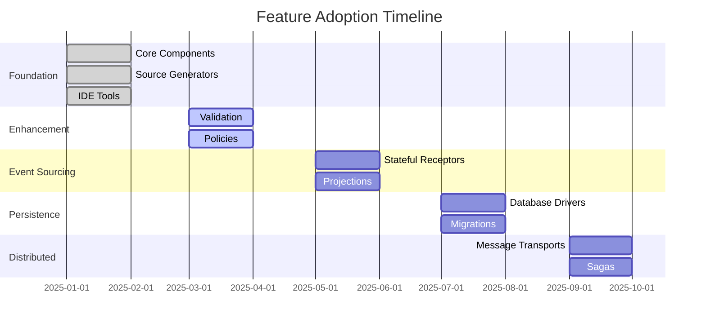

# Feature Evolution Matrix

## Overview

This matrix tracks how each Whizbang feature evolves across versions, showing clear progression from foundation to production-ready implementations.

## Legend

- :::new **New** - Feature introduced in this version
- :::updated **Enhanced** - Feature improved from previous version
- :::updated{type="major"} **Major Update** - Significant enhancement
- :::deprecated **Deprecated** - Feature being phased out
- :::planned **Planned** - Coming in future version
- `-` No changes in this version

## Core Components Evolution

### Dispatcher
| Version | Status | Key Features | Breaking Changes | Documentation |
|---------|--------|--------------|------------------|---------------|
| v0.1.0 | :::new **New** | • In-memory routing • Source-generated dispatch tables • Basic pipeline | - | [View →](../v0.1.0/components/dispatcher.md) |
| v0.2.0 | :::updated **Enhanced** | • Parallel dispatch • Batch operations • Enhanced context | None | [View →](../v0.2.0/enhancements/dispatcher.md) |
| v0.3.0 | :::updated **Enhanced** | • Event store integration • Replay support | None | [View →](../v0.3.0/features/dispatcher.md) |
| v0.4.0 | :::updated **Enhanced** | • Database persistence • Transaction support | None | [View →](../v0.4.0/drivers/dispatcher.md) |
| v0.5.0 | :::updated{type="major"} **Major** | • Distributed routing • Saga coordination | None | [View →](../v0.5.0/messaging/dispatcher.md) |

### Receptors
| Version | Status | Key Features | Breaking Changes | Documentation |
|---------|--------|--------------|------------------|---------------|
| v0.1.0 | :::new **New** | • Stateless receptors • Basic interface • Command handling | - | [View →](../v0.1.0/components/receptors.md) |
| v0.2.0 | :::updated **Enhanced** | • Validation attributes • Parameter injection • Async support | None | [View →](../v0.2.0/enhancements/receptors.md) |
| v0.3.0 | :::updated{type="major"} **Major** | • Stateful receptors • Event sourcing • State hydration | None | [View →](../v0.3.0/features/stateful-receptors.md) |
| v0.4.0 | - | No changes | - | - |
| v0.5.0 | :::updated **Enhanced** | • Distributed execution • Remote receptors | None | [View →](../v0.5.0/messaging/receptors.md) |

### Perspectives
| Version | Status | Key Features | Breaking Changes | Documentation |
|---------|--------|--------------|------------------|---------------|
| v0.1.0 | :::new **New** | • Event handling • In-memory updates • Basic interface | - | [View →](../v0.1.0/components/perspectives.md) |
| v0.2.0 | :::updated **Enhanced** | • Batch updates • Parallel execution • Error handling | None | [View →](../v0.2.0/enhancements/perspectives.md) |
| v0.3.0 | :::updated{type="major"} **Major** | • Projection support • Rebuild capability • Checkpoints | None | [View →](../v0.3.0/features/projections.md) |
| v0.4.0 | :::updated **Enhanced** | • Database backing • Optimized queries | None | [View →](../v0.4.0/drivers/perspectives.md) |
| v0.5.0 | :::updated **Enhanced** | • Distributed perspectives • Partitioned processing | None | [View →](../v0.5.0/messaging/perspectives.md) |

### Lenses
| Version | Status | Key Features | Breaking Changes | Documentation |
|---------|--------|--------------|------------------|---------------|
| v0.1.0 | :::new **New** | • Query interface • Focus, View, Glimpse • In-memory queries | - | [View →](../v0.1.0/components/lenses.md) |
| v0.2.0 | :::updated **Enhanced** | • Pagination • Async enumeration • Query optimization | None | [View →](../v0.2.0/enhancements/lenses.md) |
| v0.3.0 | :::updated **Enhanced** | • Projection queries • Time-travel queries | None | [View →](../v0.3.0/features/lenses.md) |
| v0.4.0 | :::updated{type="major"} **Major** | • SQL generation • Index usage • Query caching | None | [View →](../v0.4.0/drivers/lenses.md) |
| v0.5.0 | :::updated **Enhanced** | • Distributed queries • Federated lenses | None | [View →](../v0.5.0/messaging/lenses.md) |

### Policy Engine
| Version | Status | Key Features | Breaking Changes | Documentation |
|---------|--------|--------------|------------------|---------------|
| v0.1.0 | :::new **New** | • Retry • Timeout • Cache • CircuitBreaker | - | [View →](../v0.1.0/components/policy-engine.md) |
| v0.2.0 | :::updated **Enhanced** | • Bulkhead • Rate limiting • Policy composition | None | [View →](../v0.2.0/enhancements/policies.md) |
| v0.3.0 | :::updated **Enhanced** | • Stateful policies • Policy persistence | None | [View →](../v0.3.0/features/policies.md) |
| v0.4.0 | - | No changes | - | - |
| v0.5.0 | :::updated **Enhanced** | • Distributed policies • Policy synchronization | None | [View →](../v0.5.0/messaging/policies.md) |
| v0.6.0 | :::planned **Planned** | • Authorization • Audit policies • Compliance policies | None | [View →](../future/v0.6.0-production.md) |

### Ledger (Event Store)
| Version | Status | Key Features | Breaking Changes | Documentation |
|---------|--------|--------------|------------------|---------------|
| v0.1.0 | :::new **New** | • Event store interface • In-memory storage • Basic streams | - | [View →](../v0.1.0/components/ledger.md) |
| v0.2.0 | :::updated **Enhanced** | • Event metadata • Stream categories | None | [View →](../v0.2.0/enhancements/ledger.md) |
| v0.3.0 | :::updated{type="major"} **Major** | • Snapshots • Projections • Event versioning | None | [View →](../v0.3.0/features/event-store.md) |
| v0.4.0 | :::updated{type="major"} **Major** | • Database persistence • JSONB storage • Indexes | None | [View →](../v0.4.0/drivers/event-store.md) |
| v0.5.0 | :::updated **Enhanced** | • Distributed streams • Partitioning | None | [View →](../v0.5.0/messaging/event-store.md) |

### Drivers
| Version | Status | Key Features | Breaking Changes | Documentation |
|---------|--------|--------------|------------------|---------------|
| v0.1.0 | :::new **New** | • Driver interface • In-memory driver | - | [View →](../v0.1.0/components/drivers.md) |
| v0.2.0 | - | No changes | - | - |
| v0.3.0 | :::updated **Enhanced** | • Transaction support • Batch operations | None | [View →](../v0.3.0/features/drivers.md) |
| v0.4.0 | :::updated{type="major"} **Major** | • PostgreSQL driver • SQL Server driver • SQLite driver | None | [View →](../v0.4.0/drivers/README.md) |
| v0.5.0 | :::updated **Enhanced** | • Connection pooling • Failover support | None | [View →](../v0.5.0/messaging/drivers.md) |

### Transports
| Version | Status | Key Features | Breaking Changes | Documentation |
|---------|--------|--------------|------------------|---------------|
| v0.1.0 | :::new **New** | • Transport interface • In-memory transport | - | [View →](../v0.1.0/components/transports.md) |
| v0.2.0 | - | No changes | - | - |
| v0.3.0 | - | No changes | - | - |
| v0.4.0 | :::updated **Enhanced** | • Outbox pattern prep | None | [View →](../v0.4.0/drivers/transports.md) |
| v0.5.0 | :::updated{type="major"} **Major** | • Kafka transport • RabbitMQ transport • Azure Service Bus | None | [View →](../v0.5.0/messaging/README.md) |

## Developer Experience Evolution

### Source Generators
| Version | Features | Performance Impact |
|---------|----------|-------------------|
| v0.1.0 | • Handler discovery • Routing tables • Service registration | < 1s for 1000 handlers |
| v0.2.0 | • Validation generation • Policy weaving | < 1.5s for 1000 handlers |
| v0.3.0 | • Serialization generation • State machines | < 2s for 1000 handlers |
| v0.4.0 | • SQL generation • Migration scripts | < 2.5s for 1000 handlers |
| v0.5.0 | • Message contracts • Saga orchestration | < 3s for 1000 handlers |

### IDE Tools
| Version | Features | Enhancements |
|---------|----------|--------------|
| v0.1.0 | • CodeLens references • Basic navigation • Analyzer warnings | Foundation |
| v0.2.0 | • Enhanced traceability • Quick fixes • Refactoring support | +50% features |
| v0.3.0 | • Time-travel debugging • Event replay • State inspection | +30% features |
| v0.4.0 | • Query optimization hints • Index suggestions | +20% features |
| v0.5.0 | • Distributed tracing • Message flow viz | +40% features |

### Testing Support
| Version | Features | Test Types |
|---------|----------|------------|
| v0.1.0 | • TUnit integration • Bogus scenarios • In-memory doubles | Unit, Integration |
| v0.2.0 | • Behavior specs • Property testing | + BDD, Property |
| v0.3.0 | • Event sourcing helpers • Time travel testing | + Event Testing |
| v0.4.0 | • Database testing • Migration testing | + Database |
| v0.5.0 | • Distributed testing • Chaos engineering | + Distributed |

## Migration Complexity

### Version Upgrade Paths
| From → To | Complexity | Breaking Changes | Migration Guide |
|-----------|------------|------------------|-----------------|
| v0.1.0 → v0.2.0 | ⭐ Easy | None | [Guide →](../v0.2.0/migration-guide.md) |
| v0.2.0 → v0.3.0 | ⭐⭐ Moderate | None | [Guide →](../v0.3.0/migration-guide.md) |
| v0.3.0 → v0.4.0 | ⭐⭐ Moderate | None | [Guide →](../v0.4.0/migration-guide.md) |
| v0.4.0 → v0.5.0 | ⭐⭐⭐ Complex | None | [Guide →](../v0.5.0/migration-guide.md) |

## Feature Adoption Timeline

## Success Metrics by Version

| Version | Adoption Target | Performance Target | Quality Target |
|---------|----------------|-------------------|----------------|
| v0.1.0 | 100+ developers | < 1ms operations | 100% test coverage |
| v0.2.0 | 500+ developers | < 1ms operations | 100% test coverage |
| v0.3.0 | 1,000+ developers | < 10ms operations | 95% test coverage |
| v0.4.0 | 5,000+ developers | < 10ms operations | 95% test coverage |
| v0.5.0 | 10,000+ developers | < 100ms operations | 90% test coverage |

## Navigation

- [Back to Roadmap](README.md)
- [v0.1.0 Documentation](../v0.1.0/README.md)
- [Success Metrics](success-metrics.md)
- [Session Context](SESSION-CONTEXT.md)