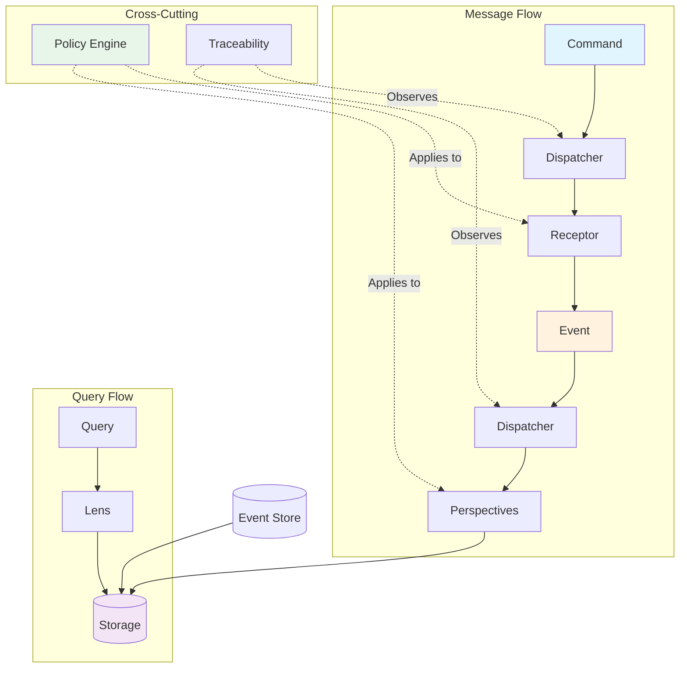

# Architecture Overview

## Component Architecture



## Core Components

### 1. Dispatcher
**The nervous system of Whizbang**

```csharp
public interface IDispatcher {
    // Commands go to exactly one receptor
    Task<TResult> Send<TResult>(ICommand<TResult> command);
    
    // Events go to all interested perspectives
    Task Publish<TEvent>(TEvent @event);
    
    // Queries go through lenses
    TLens GetLens<TLens>() where TLens : ILens;
}
```

The Dispatcher:
- Routes messages based on compile-time generated tables
- Manages execution pipeline
- Applies policies
- Tracks correlation and causation
- Provides traceability hooks

### 2. Receptors
**Command receivers and decision makers**

```csharp
public interface IReceptor<TCommand> {
    object Receive(TCommand command);
}
```

Receptors:
- Receive commands from the dispatcher
- Make decisions based on business rules
- Emit events representing decisions
- Can be stateless (Event-Driven) or stateful (Event-Sourced)
- Never perform side effects directly

### 3. Perspectives
**Event handlers that update views**

```csharp
public interface IPerspectiveOf<TEvent> {
    Task Update(TEvent @event);
}
```

Perspectives:
- React to events from receptors
- Update databases, caches, search indexes
- Maintain different views of the same data
- Execute all write operations
- Can be synchronous or asynchronous

### 4. Lenses
**Read-only query interfaces**

```csharp
public interface ILens {
    T Focus<T>(object id);                              // Single item
    IEnumerable<T> View<T>(Expression<Func<T, bool>> filter);  // Filtered set
    TSummary Glimpse<TSummary>(object id);             // Partial view
    bool Exists(object id);                            // Existence check
    IAsyncEnumerable<T> Scan<T>();                     // Full scan
}
```

Lenses:
- Provide read-only access to data
- Focus on specific query needs
- Abstract storage mechanism
- Support different view shapes
- Enable query optimization

### 5. Policy Engine
**Cross-cutting concerns as composable policies**

```csharp
[Retry(3, BackoffStrategy.Exponential)]
[Timeout(5000)]
[Cache(Duration = 300)]
[CircuitBreaker(0.5, 10)]
public class PaymentReceptor : IReceptor<ProcessPayment> { }
```

Policies include:
- **Resilience**: Retry, Circuit Breaker, Timeout, Fallback
- **Performance**: Cache, Batch, Throttle
- **Security**: Authorize, Audit, Encrypt
- **Observability**: Trace, Metric, Log

### 6. Ledger (Event Store)
**The source of truth for events**

```csharp
public interface ILedger {
    // Append events to a stream
    Task<long> Append(string stream, IEnumerable<object> events, long? expectedVersion = null);
    
    // Load events from a stream
    IAsyncEnumerable<IEvent> Load(string stream, long from = 0);
    
    // Subscribe to events
    IDisposable Subscribe(string stream, Func<IEvent, Task> handler);
    
    // Snapshot support
    Task SaveSnapshot(string stream, object snapshot);
    Task<T?> LoadSnapshot<T>(string stream);
}
```

### 7. Drivers
**Storage abstraction layer**

```csharp
public interface IDriver {
    // Execute queries
    Task<T> Query<T>(IQuery<T> query);
    
    // Execute commands
    Task Execute(ICommand command);
    
    // Transaction support
    Task<T> Transaction<T>(Func<ITransaction, Task<T>> action);
    
    // Migration support
    Task Migrate(IMigration migration);
}
```

Drivers available:
- **InMemoryDriver**: Development and testing
- **PostgreSQLDriver**: JSONB support
- **SqlServerDriver**: JSON columns
- **SQLiteDriver**: Edge scenarios
- **Custom**: Implement IDriver

### 8. Transports
**Message broker abstraction**

```csharp
public interface ITransport {
    // Send messages
    Task Send<T>(string destination, T message);
    
    // Subscribe to messages
    IDisposable Subscribe<T>(string source, Func<T, Task> handler);
    
    // Request-Reply pattern
    Task<TResponse> Request<TRequest, TResponse>(string destination, TRequest request);
}
```

Transports available:
- **InMemoryTransport**: Development and testing
- **KafkaTransport**: High-throughput streaming
- **RabbitMQTransport**: Reliable messaging
- **AzureServiceBusTransport**: Cloud-native
- **Custom**: Implement ITransport

## Message Flow Patterns

### 1. Command Flow (Event-Driven Mode)
```
Command → Dispatcher → Receptor → Event → Perspectives → Storage
                          ↓
                        Lens ← Query
```

### 2. Command Flow (Event-Sourced Mode)
```
Command → Dispatcher → Receptor → Event → Ledger
                                     ↓
                              Perspectives → Read Models
                                     ↓
                                   Lens ← Query
```

### 3. Query Flow
```
Query → Lens → Storage → Result
```

### 4. Saga Flow
```
Event → Saga Coordinator → Command → Receptor
          ↓                   ↓
      Saga State          New Event → Continue/Complete
```

## Progressive Enhancement Path

### Level 1: In-Process Event-Driven
```csharp
services.AddWhizbang()
    .UseInMemory();  // Everything in-memory
```
- Commands → Receptors → Events → Perspectives
- All synchronous, in-process
- Perfect for development

### Level 2: Event-Sourced
```csharp
services.AddWhizbang()
    .UseEventSourcing()
    .UseInMemory();  // In-memory event store
```
- Add event store (Ledger)
- Support stateful receptors
- Enable projections

### Level 3: Persistent
```csharp
services.AddWhizbang()
    .UseEventSourcing()
    .UsePostgreSQL("connection-string");
```
- Real database persistence
- Production-ready storage
- Schema migrations

### Level 4: Distributed
```csharp
services.AddWhizbang()
    .UseEventSourcing()
    .UsePostgreSQL("connection-string")
    .UseKafka("bootstrap-servers");
```
- Distributed messaging
- Microservices ready
- Saga orchestration

## Component Relationships

### Compile-Time Relationships
- **Source Generators** discover and wire components
- **Analyzers** validate relationships
- **Generated Code** creates efficient dispatch tables

### Runtime Relationships
- **Dispatcher** coordinates all message flow
- **Policy Engine** wraps component execution
- **Traceability** observes all operations
- **Ledger** persists all events

### Testing Relationships
- **In-Memory Implementations** serve as test doubles
- **Test Harness** provides scenario execution
- **Verification** uses recorded interactions

## Key Design Decisions

### Why Receptors Instead of Handlers?
- Receptors emphasize decision-making over handling
- They're the same interface for stateless and stateful
- They make the event-driven nature explicit
- They separate concerns better than traditional handlers

### Why Perspectives Instead of Projections?
- Perspectives are more general than projections
- They handle all write operations, not just read models
- They can update multiple stores
- They emphasize the "view" nature of the data

### Why Lenses for Queries?
- Lenses are composable
- They're purely functional
- They separate query concerns from storage
- They enable query optimization

### Why Policies Instead of Aspects?
- Policies are more explicit
- They're composable and configurable
- They're testable in isolation
- They avoid AOP magic

## Extension Points

### Custom Components
- Implement `IReceptor<T>` for custom command handling
- Implement `IPerspectiveOf<T>` for custom event handling
- Implement `ILens` for custom queries
- Implement `IPolicyOf<T>` for custom policies

### Custom Drivers
- Implement `IDriver` for new databases
- Implement `ITransport` for new message brokers
- Implement `ILedger` for custom event stores

### Source Generator Extensions
- Add custom attributes for discovery
- Generate specialized dispatch code
- Create domain-specific optimizations

## Performance Architecture

### Compile-Time Optimizations
- Generated dispatch tables (no reflection)
- Inlined serialization code
- Pre-compiled expressions
- AOT-friendly code

### Runtime Optimizations
- Object pooling for messages
- Zero-allocation patterns
- Efficient async state machines
- Minimal boxing/unboxing

### Storage Optimizations
- Batch operations
- Prepared statements
- Connection pooling
- Query plan caching

This architecture provides a solid foundation that scales from simple in-process messaging to complex distributed event-sourced systems, all while maintaining the same programming model.