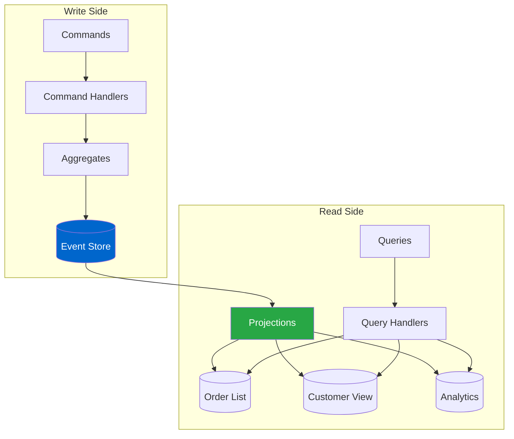

# CQRS Implementation

## Overview

Command Query Responsibility Segregation (CQRS) is a pattern that uses separate models for reading and writing data. Whizbang provides first-class support for CQRS, allowing you to optimize reads and writes independently while maintaining consistency through event-driven projections.

### What is CQRS?

CQRS separates your application into two distinct paths:
- **Command Side**: Handles writes, enforces business rules, generates events
- **Query Side**: Handles reads from optimized, denormalized read models

### Benefits of CQRS

- **Performance**: Optimize reads and writes independently
- **Scalability**: Scale read and write sides separately
- **Flexibility**: Different storage technologies for different needs
- **Simplicity**: Simpler models focused on specific tasks
- **Evolution**: Change read models without affecting writes

## Architecture Diagram



## Core Components

### Required Packages

```xml{
title: "Required NuGet Packages"
description: "Core packages needed for CQRS implementation with Whizbang"
framework: "NET8"
category: "Usage Patterns"
difficulty: "BEGINNER"
tags: ["Usage Patterns", "CQRS", "NuGet Packages"]
filename: "ProjectFile.csproj"
showLineNumbers: true
}
<PackageReference Include="Whizbang.Core" Version="1.0.0" />
<PackageReference Include="Whizbang.EventSourcing" Version="1.0.0" />
<PackageReference Include="Whizbang.Projections" Version="1.0.0" />
```

### Key Concepts

- **Write Model**: Aggregates that enforce business rules
- **Read Model**: Denormalized views optimized for queries
- **Projection**: Process that builds read models from events
- **Eventually Consistent**: Read models update asynchronously
- **Query Handler**: Returns data from read models

## Step-by-Step Implementation

### Step 1: Define Read Models

```csharp{
title: "Read Model Definitions"
description: "Create denormalized read models optimized for specific queries"
framework: "NET8"
category: "CQRS"
difficulty: "INTERMEDIATE"
tags: ["Read Models", "Projections", "Query Models"]
nugetPackages: ["Whizbang.Projections"]
filename: "OrderReadModels.cs"
showLineNumbers: true
highlightLines: [9, 25, 41]
usingStatements: ["Whizbang.Projections", "System", "System.Collections.Generic"]
}
using Whizbang.Projections;
using System;
using System.Collections.Generic;

namespace MyApp.Orders.ReadModels;

// Read model for order list/search
[ReadModel("OrderList")]
public class OrderListItem {
    public Guid OrderId { get; set; }
    public Guid CustomerId { get; set; }
    public string CustomerName { get; set; }
    public decimal TotalAmount { get; set; }
    public string Status { get; set; }
    public DateTime CreatedAt { get; set; }
    public DateTime? ShippedAt { get; set; }
    
    // Denormalized data for fast queries
    public int ItemCount { get; set; }
    public string FirstItemName { get; set; }
    public bool IsHighValue { get; set; } // TotalAmount > 1000
}

// Read model for customer order history
[ReadModel("CustomerOrders")]
public class CustomerOrderSummary {
    public Guid CustomerId { get; set; }
    public string CustomerName { get; set; }
    public int TotalOrders { get; set; }
    public int CompletedOrders { get; set; }
    public int PendingOrders { get; set; }
    public decimal LifetimeValue { get; set; }
    public DateTime LastOrderDate { get; set; }
    public List<RecentOrder> RecentOrders { get; set; } = new();
}

public class RecentOrder {
    public Guid OrderId { get; set; }
    public decimal Amount { get; set; }
    public string Status { get; set; }
    public DateTime Date { get; set; }
}

// Read model for order details
[ReadModel("OrderDetails")]
public class OrderDetailsView {
    public Guid OrderId { get; set; }
    public Guid CustomerId { get; set; }
    
    // Customer info (denormalized)
    public string CustomerName { get; set; }
    public string CustomerEmail { get; set; }
    public string CustomerPhone { get; set; }
    
    // Order info
    public List<OrderLineView> Lines { get; set; } = new();
    public decimal SubTotal { get; set; }
    public decimal TaxAmount { get; set; }
    public decimal ShippingCost { get; set; }
    public decimal TotalAmount { get; set; }
    
    // Shipping info
    public string ShippingAddress { get; set; }
    public string TrackingNumber { get; set; }
    public string Carrier { get; set; }
    
    // Status and dates
    public string Status { get; set; }
    public DateTime CreatedAt { get; set; }
    public DateTime? ShippedAt { get; set; }
    public DateTime? DeliveredAt { get; set; }
    
    // Audit trail
    public List<OrderEvent> EventHistory { get; set; } = new();
}

public class OrderLineView {
    public string ProductId { get; set; }
    public string ProductName { get; set; }
    public string ProductImageUrl { get; set; } // Enriched data
    public int Quantity { get; set; }
    public decimal UnitPrice { get; set; }
    public decimal LineTotal { get; set; }
}

public class OrderEvent {
    public string EventType { get; set; }
    public DateTime OccurredAt { get; set; }
    public string Description { get; set; }
}
```

### Step 2: Create Projections

```csharp{
title: "Projection Implementation"
description: "Build projections that update read models from events"
framework: "NET8"
category: "CQRS"
difficulty: "INTERMEDIATE"
tags: ["Projections", "Event Handlers", "Read Model Updates"]
nugetPackages: ["Whizbang.Projections"]
filename: "OrderProjections.cs"
showLineNumbers: true
highlightLines: [15, 35, 55, 75]
usingStatements: ["Whizbang.Projections", "System", "System.Threading.Tasks"]
}
using Whizbang.Projections;
using System;
using System.Linq;
using System.Threading;
using System.Threading.Tasks;
using MyApp.Orders.Events;
using MyApp.Orders.ReadModels;

namespace MyApp.Orders.Projections;

[Projection("OrderListProjection")]
public class OrderListProjection : IProjection {
    private readonly IReadModelStore<OrderListItem> _store;
    private readonly ICustomerService _customerService;
    
    public OrderListProjection(
        IReadModelStore<OrderListItem> store,
        ICustomerService customerService) {
        _store = store;
        _customerService = customerService;
    }
    
    [Subscribe]
    public async Task Handle(
        OrderCreated @event,
        EventMetadata metadata,
        CancellationToken cancellationToken) {
        
        // Enrich with customer data
        var customer = await _customerService.GetCustomer(
            @event.CustomerId,
            cancellationToken
        );
        
        // Create read model
        var item = new OrderListItem {
            OrderId = @event.OrderId,
            CustomerId = @event.CustomerId,
            CustomerName = customer?.Name ?? "Unknown",
            TotalAmount = @event.TotalAmount,
            Status = "Pending",
            CreatedAt = @event.CreatedAt,
            ItemCount = @event.Items.Count,
            FirstItemName = @event.Items.FirstOrDefault()?.ProductName,
            IsHighValue = @event.TotalAmount > 1000
        };
        
        await _store.Add(item.OrderId, item, cancellationToken);
    }
    
    [Subscribe]
    public async Task Handle(
        OrderShipped @event,
        EventMetadata metadata,
        CancellationToken cancellationToken) {
        
        await _store.Update(
            @event.OrderId,
            item => {
                item.Status = "Shipped";
                item.ShippedAt = @event.ShippedAt;
            },
            cancellationToken
        );
    }
    
    [Subscribe]
    public async Task Handle(
        OrderCancelled @event,
        EventMetadata metadata,
        CancellationToken cancellationToken) {
        
        await _store.Update(
            @event.OrderId,
            item => item.Status = "Cancelled",
            cancellationToken
        );
    }
}

[Projection("CustomerOrdersProjection")]
public class CustomerOrdersProjection : IProjection {
    private readonly IReadModelStore<CustomerOrderSummary> _store;
    
    public CustomerOrdersProjection(IReadModelStore<CustomerOrderSummary> store) {
        _store = store;
    }
    
    [Subscribe]
    public async Task Handle(
        OrderCreated @event,
        EventMetadata metadata,
        CancellationToken cancellationToken) {
        
        var summary = await _store.GetById(@event.CustomerId, cancellationToken) 
            ?? new CustomerOrderSummary { 
                CustomerId = @event.CustomerId 
            };
        
        // Update summary
        summary.TotalOrders++;
        summary.PendingOrders++;
        summary.LifetimeValue += @event.TotalAmount;
        summary.LastOrderDate = @event.CreatedAt;
        
        // Add to recent orders (keep last 10)
        summary.RecentOrders.Insert(0, new RecentOrder {
            OrderId = @event.OrderId,
            Amount = @event.TotalAmount,
            Status = "Pending",
            Date = @event.CreatedAt
        });
        
        if (summary.RecentOrders.Count > 10) {
            summary.RecentOrders.RemoveAt(10);
        }
        
        await _store.Upsert(
            summary.CustomerId, 
            summary, 
            cancellationToken
        );
    }
    
    [Subscribe]
    public async Task Handle(
        OrderShipped @event,
        EventMetadata metadata,
        CancellationToken cancellationToken) {
        
        // Update customer summary when order ships
        await _store.Update(
            @event.CustomerId,
            summary => {
                summary.PendingOrders--;
                summary.CompletedOrders++;
                
                var recentOrder = summary.RecentOrders
                    .FirstOrDefault(o => o.OrderId == @event.OrderId);
                if (recentOrder != null) {
                    recentOrder.Status = "Shipped";
                }
            },
            cancellationToken
        );
    }
}
```

### Step 3: Implement Query Handlers

```csharp{
title: "Query Handler Implementation"
description: "Query handlers that read from optimized read models"
framework: "NET8"
category: "CQRS"
difficulty: "INTERMEDIATE"
tags: ["Query Handlers", "Read Operations", "Performance"]
nugetPackages: ["Whizbang.Projections"]
filename: "OrderQueryHandlers.cs"
showLineNumbers: true
highlightLines: [18, 40, 65]
usingStatements: ["Whizbang.Projections", "System", "System.Linq", "System.Threading.Tasks"]
}
using Whizbang;
using Whizbang.Projections;
using System;
using System.Collections.Generic;
using System.Linq;
using System.Threading;
using System.Threading.Tasks;
using MyApp.Orders.Queries;
using MyApp.Orders.ReadModels;

namespace MyApp.Orders.Handlers;

public class GetOrderListHandler : IQueryHandler<GetOrderListQuery, PagedResult<OrderListItem>> {
    private readonly IReadModelStore<OrderListItem> _store;
    
    public GetOrderListHandler(IReadModelStore<OrderListItem> store) {
        _store = store;
    }
    
    public async Task<PagedResult<OrderListItem>> Handle(
        GetOrderListQuery query,
        CancellationToken cancellationToken) {
        
        // Query read model with filtering, sorting, paging
        var items = await _store.Query(
            filter: item => {
                var matches = true;
                
                if (query.CustomerId.HasValue) {
                    matches &= item.CustomerId == query.CustomerId;
                }
                
                if (!string.IsNullOrEmpty(query.Status)) {
                    matches &= item.Status == query.Status;
                }
                
                if (query.MinAmount.HasValue) {
                    matches &= item.TotalAmount >= query.MinAmount;
                }
                
                if (query.IsHighValue.HasValue) {
                    matches &= item.IsHighValue == query.IsHighValue;
                }
                
                return matches;
            },
            orderBy: query.SortBy switch {
                "date" => items => query.SortDescending 
                    ? items.OrderByDescending(i => i.CreatedAt)
                    : items.OrderBy(i => i.CreatedAt),
                "amount" => items => query.SortDescending
                    ? items.OrderByDescending(i => i.TotalAmount)
                    : items.OrderBy(i => i.TotalAmount),
                _ => items => items.OrderByDescending(i => i.CreatedAt)
            },
            skip: (query.Page - 1) * query.PageSize,
            take: query.PageSize,
            cancellationToken: cancellationToken
        );
        
        var totalCount = await _store.Count(cancellationToken);
        
        return new PagedResult<OrderListItem> {
            Items = items,
            Page = query.Page,
            PageSize = query.PageSize,
            TotalCount = totalCount,
            TotalPages = (int)Math.Ceiling(totalCount / (double)query.PageSize)
        };
    }
}

public class GetCustomerOrdersHandler : IQueryHandler<GetCustomerOrdersQuery, CustomerOrderSummary> {
    private readonly IReadModelStore<CustomerOrderSummary> _store;
    private readonly ICustomerService _customerService;
    
    public GetCustomerOrdersHandler(
        IReadModelStore<CustomerOrderSummary> store,
        ICustomerService customerService) {
        _store = store;
        _customerService = customerService;
    }
    
    public async Task<CustomerOrderSummary> Handle(
        GetCustomerOrdersQuery query,
        CancellationToken cancellationToken) {
        
        // Get from read model
        var summary = await _store.GetById(query.CustomerId, cancellationToken);
        
        if (summary == null) {
            // No orders yet, return empty summary
            var customer = await _customerService.GetCustomer(
                query.CustomerId,
                cancellationToken
            );
            
            return new CustomerOrderSummary {
                CustomerId = query.CustomerId,
                CustomerName = customer?.Name ?? "Unknown",
                TotalOrders = 0,
                CompletedOrders = 0,
                PendingOrders = 0,
                LifetimeValue = 0,
                RecentOrders = new List<RecentOrder>()
            };
        }
        
        return summary;
    }
}

public class SearchOrdersHandler : IQueryHandler<SearchOrdersQuery, List<OrderListItem>> {
    private readonly IReadModelStore<OrderListItem> _store;
    private readonly ISearchService _searchService;
    
    public SearchOrdersHandler(
        IReadModelStore<OrderListItem> store,
        ISearchService searchService) {
        _store = store;
        _searchService = searchService;
    }
    
    public async Task<List<OrderListItem>> Handle(
        SearchOrdersQuery query,
        CancellationToken cancellationToken) {
        
        // Use search service for full-text search
        var orderIds = await _searchService.SearchOrders(
            query.SearchTerm,
            limit: query.MaxResults,
            cancellationToken: cancellationToken
        );
        
        // Get read models for matching orders
        var orders = new List<OrderListItem>();
        foreach (var orderId in orderIds) {
            var order = await _store.GetById(orderId, cancellationToken);
            if (order != null) {
                orders.Add(order);
            }
        }
        
        return orders;
    }
}
```

### Step 4: Configure CQRS

```csharp{
title: "CQRS Configuration"
description: "Configure Whizbang with CQRS pattern and projection processing"
framework: "NET8"
category: "Configuration"
difficulty: "INTERMEDIATE"
tags: ["Configuration", "CQRS Setup", "Projections"]
nugetPackages: ["Whizbang.Projections", "Whizbang.EventSourcing"]
filename: "Program.cs"
showLineNumbers: true
highlightLines: [9, 16, 23, 33]
usingStatements: ["Whizbang", "Whizbang.Projections", "Microsoft.Extensions.DependencyInjection"]
}
using Whizbang;
using Whizbang.Projections;
using Microsoft.AspNetCore.Builder;
using Microsoft.Extensions.DependencyInjection;

var builder = WebApplication.CreateBuilder(args);

// Configure Whizbang with CQRS
builder.Services.AddWhizbang(config => {
    // Configure event sourcing for write side
    config.UseEventSourcing(options => {
        options.UsePostgreSQL(builder.Configuration.GetConnectionString("EventStore"));
    });
    
    // Configure projections for read side
    config.UseProjections(options => {
        // Use separate database for read models
        options.UsePostgreSQL(builder.Configuration.GetConnectionString("ReadModels"));
        
        // Configure projection processing
        options.ProcessingMode = ProjectionProcessingMode.Async;
        options.RetryPolicy = RetryPolicy.Exponential(3, TimeSpan.FromSeconds(1));
        
        // Register projections
        options.RegisterProjectionsFromAssembly(typeof(Program).Assembly);
        
        // Configure read model stores
        options.ConfigureStore<OrderListItem>(store => {
            store.TableName = "order_list";
            store.EnableCaching(TimeSpan.FromMinutes(5));
        });
        
        options.ConfigureStore<CustomerOrderSummary>(store => {
            store.TableName = "customer_orders";
            store.EnableCaching(TimeSpan.FromMinutes(10));
        });
        
        options.ConfigureStore<OrderDetailsView>(store => {
            store.TableName = "order_details";
            store.EnableCaching(TimeSpan.FromMinutes(2));
        });
    });
    
    // Register handlers
    config.RegisterHandlersFromAssembly(typeof(Program).Assembly);
});

// Register services
builder.Services.AddScoped<ICustomerService, CustomerService>();
builder.Services.AddScoped<ISearchService, ElasticsearchService>();

builder.Services.AddControllers();

var app = builder.Build();

// Initialize projection infrastructure
await app.InitializeProjections();

// Start projection processor
app.UseProjectionProcessor();

app.UseRouting();
app.MapControllers();

app.Run();
```

## Complete Example

```csharp{
title: "Complete CQRS Implementation"
description: "Full working example showing CQRS from commands to queries"
framework: "NET8"
category: "Complete Example"
difficulty: "INTERMEDIATE"
tags: ["CQRS", "Complete", "API", "Commands", "Queries"]
nugetPackages: ["Whizbang.Projections", "Microsoft.AspNetCore.Mvc"]
filename: "CQRSOrdersController.cs"
showLineNumbers: true
highlightLines: [22, 36, 51, 66, 81]
testFile: "CQRSOrdersTests.cs"
testMethod: "CreateOrder_UpdatesReadModel_QueryReturnsData"
usingStatements: ["Whizbang", "Microsoft.AspNetCore.Mvc", "System.Threading.Tasks"]
}
using Whizbang;
using Microsoft.AspNetCore.Mvc;
using System;
using System.Threading;
using System.Threading.Tasks;
using MyApp.Orders.Commands;
using MyApp.Orders.Queries;
using MyApp.Orders.ReadModels;

namespace MyApp.Controllers;

[ApiController]
[Route("api/[controller]")]
public class OrdersController : ControllerBase {
    private readonly IMediator _mediator;
    
    public OrdersController(IMediator mediator) {
        _mediator = mediator;
    }
    
    // COMMAND SIDE - Write operations
    [HttpPost]
    public async Task<ActionResult<OrderCreatedResult>> CreateOrder(
        [FromBody] CreateOrderRequest request,
        CancellationToken cancellationToken) {
        
        var command = new CreateOrderCommand(
            request.CustomerId,
            request.Items,
            request.ShippingAddress
        );
        
        var result = await _mediator.Send(command, cancellationToken);
        return CreatedAtAction(nameof(GetOrderDetails), new { orderId = result.OrderId }, result);
    }
    
    [HttpPost("{orderId}/ship")]
    public async Task<ActionResult<ShipmentResult>> ShipOrder(
        Guid orderId,
        CancellationToken cancellationToken) {
        
        var command = new ShipOrderCommand(orderId);
        var result = await _mediator.Send(command, cancellationToken);
        return Ok(result);
    }
    
    // QUERY SIDE - Read operations from optimized read models
    
    [HttpGet]
    public async Task<ActionResult<PagedResult<OrderListItem>>> GetOrders(
        [FromQuery] int page = 1,
        [FromQuery] int pageSize = 20,
        [FromQuery] string status = null,
        [FromQuery] decimal? minAmount = null,
        [FromQuery] string sortBy = "date",
        [FromQuery] bool sortDescending = true,
        CancellationToken cancellationToken = default) {
        
        var query = new GetOrderListQuery {
            Page = page,
            PageSize = pageSize,
            Status = status,
            MinAmount = minAmount,
            SortBy = sortBy,
            SortDescending = sortDescending
        };
        
        var result = await _mediator.Send(query, cancellationToken);
        return Ok(result);
    }
    
    [HttpGet("{orderId}")]
    public async Task<ActionResult<OrderDetailsView>> GetOrderDetails(
        Guid orderId,
        CancellationToken cancellationToken) {
        
        var query = new GetOrderDetailsQuery(orderId);
        var result = await _mediator.Send(query, cancellationToken);
        
        if (result == null) {
            return NotFound();
        }
        
        return Ok(result);
    }
    
    [HttpGet("customer/{customerId}")]
    public async Task<ActionResult<CustomerOrderSummary>> GetCustomerOrders(
        Guid customerId,
        CancellationToken cancellationToken) {
        
        var query = new GetCustomerOrdersQuery(customerId);
        var result = await _mediator.Send(query, cancellationToken);
        return Ok(result);
    }
    
    [HttpGet("search")]
    public async Task<ActionResult<List<OrderListItem>>> SearchOrders(
        [FromQuery] string q,
        [FromQuery] int maxResults = 50,
        CancellationToken cancellationToken = default) {
        
        if (string.IsNullOrWhiteSpace(q)) {
            return BadRequest("Search term is required");
        }
        
        var query = new SearchOrdersQuery {
            SearchTerm = q,
            MaxResults = maxResults
        };
        
        var result = await _mediator.Send(query, cancellationToken);
        return Ok(result);
    }
    
    // Analytics queries from specialized read models
    [HttpGet("analytics/top-customers")]
    public async Task<ActionResult<List<TopCustomer>>> GetTopCustomers(
        [FromQuery] int count = 10,
        CancellationToken cancellationToken = default) {
        
        var query = new GetTopCustomersQuery(count);
        var result = await _mediator.Send(query, cancellationToken);
        return Ok(result);
    }
    
    [HttpGet("analytics/sales-by-day")]
    public async Task<ActionResult<List<DailySales>>> GetSalesByDay(
        [FromQuery] DateTime startDate,
        [FromQuery] DateTime endDate,
        CancellationToken cancellationToken = default) {
        
        var query = new GetSalesByDayQuery(startDate, endDate);
        var result = await _mediator.Send(query, cancellationToken);
        return Ok(result);
    }
}

// Query definitions
public record GetOrderListQuery {
    public int Page { get; set; } = 1;
    public int PageSize { get; set; } = 20;
    public Guid? CustomerId { get; set; }
    public string Status { get; set; }
    public decimal? MinAmount { get; set; }
    public bool? IsHighValue { get; set; }
    public string SortBy { get; set; } = "date";
    public bool SortDescending { get; set; } = true;
}

public record SearchOrdersQuery {
    public string SearchTerm { get; set; }
    public int MaxResults { get; set; } = 50;
}
```

## Testing Strategy

### Testing Projections

```csharp{
title: "Projection Tests"
description: "Test that projections correctly update read models from events"
framework: "NET8"
category: "Testing"
difficulty: "INTERMEDIATE"
tags: ["Unit Testing", "Projections", "Read Models"]
nugetPackages: ["Whizbang.Projections", "xUnit", "Moq"]
filename: "OrderProjectionTests.cs"
showLineNumbers: true
usingStatements: ["Whizbang.Projections", "Xunit", "Moq"]
}
using Whizbang.Projections;
using Xunit;
using Moq;
using System;
using System.Threading;
using System.Threading.Tasks;
using MyApp.Orders.Events;
using MyApp.Orders.Projections;
using MyApp.Orders.ReadModels;

namespace MyApp.Tests.Orders;

public class OrderListProjectionTests {
    private readonly Mock<IReadModelStore<OrderListItem>> _storeMock;
    private readonly Mock<ICustomerService> _customerServiceMock;
    private readonly OrderListProjection _projection;
    
    public OrderListProjectionTests() {
        _storeMock = new Mock<IReadModelStore<OrderListItem>>();
        _customerServiceMock = new Mock<ICustomerService>();
        _projection = new OrderListProjection(
            _storeMock.Object,
            _customerServiceMock.Object
        );
    }
    
    [Fact]
    public async Task Handle_OrderCreated_CreatesReadModel() {
        // Arrange
        var @event = new OrderCreated(
            Guid.NewGuid(),
            Guid.NewGuid(),
            new List<OrderItem> {
                new OrderItem("P1", "Widget", 2, 500.00m)
            },
            1000.00m,
            "123 Main St",
            DateTime.UtcNow
        );
        
        _customerServiceMock
            .Setup(x => x.GetCustomer(It.IsAny<Guid>(), It.IsAny<CancellationToken>()))
            .ReturnsAsync(new Customer { Name = "John Doe" });
        
        // Act
        await _projection.Handle(
            @event,
            new EventMetadata(),
            CancellationToken.None
        );
        
        // Assert
        _storeMock.Verify(x => x.Add(
            @event.OrderId,
            It.Is<OrderListItem>(item =>
                item.OrderId == @event.OrderId &&
                item.TotalAmount == 1000.00m &&
                item.Status == "Pending" &&
                item.IsHighValue == true &&
                item.CustomerName == "John Doe"
            ),
            It.IsAny<CancellationToken>()
        ), Times.Once);
    }
    
    [Fact]
    public async Task Handle_OrderShipped_UpdatesStatus() {
        // Arrange
        var orderId = Guid.NewGuid();
        var @event = new OrderShipped(
            orderId,
            "TRACK123",
            "FedEx",
            DateTime.UtcNow
        );
        
        // Act
        await _projection.Handle(
            @event,
            new EventMetadata(),
            CancellationToken.None
        );
        
        // Assert
        _storeMock.Verify(x => x.Update(
            orderId,
            It.IsAny<Action<OrderListItem>>(),
            It.IsAny<CancellationToken>()
        ), Times.Once);
    }
}
```

## Common Pitfalls

### Don't Query Write Models

```csharp{
title: "Don't Query Write Models"
description: "Avoid querying aggregates for read operations - use optimized read models instead"
framework: "NET8"
category: "Usage Patterns"
difficulty: "INTERMEDIATE"
tags: ["Usage Patterns", "CQRS", "Anti-Patterns", "Best Practices"]
filename: "ReadModelVsAggregate.cs"
showLineNumbers: true
usingStatements: ["System", "System.Collections.Generic", "System.Linq", "System.Threading.Tasks"]
}
// ❌ BAD - Querying aggregates for read operations
public async Task<List<Order>> GetOrders() {
    var aggregates = await _repository.GetAll<OrderAggregate>();
    return aggregates.Select(a => MapToDto(a)).ToList();
}

// ✅ GOOD - Query optimized read models
public async Task<List<OrderListItem>> GetOrders() {
    return await _readModelStore.Query<OrderListItem>();
}
```

### Handle Eventual Consistency

```csharp{
title: "Handle Eventual Consistency"
description: "Account for eventual consistency between write and read models in CQRS"
framework: "NET8"
category: "Usage Patterns"
difficulty: "INTERMEDIATE"
tags: ["Usage Patterns", "CQRS", "Eventual Consistency", "Best Practices"]
filename: "EventualConsistency.cs"
showLineNumbers: true
usingStatements: ["System", "System.Threading.Tasks"]
}
// ❌ BAD - Expecting immediate consistency
var orderId = await CreateOrder(command);
var order = await GetOrder(orderId); // May not exist yet!

// ✅ GOOD - Handle eventual consistency
var orderId = await CreateOrder(command);
await Task.Delay(100); // Or use polling/SignalR for real-time updates
var order = await GetOrder(orderId);
```

### Avoid Complex Projections

```csharp{
title: "Avoid Complex Projections"
description: "Keep projections focused on single responsibility rather than doing multiple things"
framework: "NET8"
category: "Usage Patterns"
difficulty: "INTERMEDIATE"
tags: ["Usage Patterns", "CQRS", "Projections", "Single Responsibility", "Best Practices"]
filename: "ProjectionResponsibility.cs"
showLineNumbers: true
usingStatements: ["System", "System.Threading.Tasks"]
}
// ❌ BAD - Projection doing too much
public async Task Handle(OrderCreated @event) {
    await UpdateOrderList();
    await UpdateCustomerSummary();
    await SendEmail();
    await UpdateInventory();
}

// ✅ GOOD - Single responsibility projections
public class OrderListProjection { /* Updates order list only */ }
public class CustomerSummaryProjection { /* Updates customer summary only */ }
public class EmailNotificationHandler { /* Sends emails only */ }
```

## Progressive Enhancement

### Add Multiple Read Stores

```csharp{
title: "Multiple Read Stores"
description: "Configure different storage technologies for different read model needs"
framework: "NET8"
category: "Usage Patterns"
difficulty: "ADVANCED"
tags: ["Usage Patterns", "CQRS", "Multiple Stores", "Storage Options"]
filename: "MultipleStoresConfiguration.cs"
showLineNumbers: true
usingStatements: ["System", "Whizbang.Projections"]
}
// Configure different stores for different needs
config.UseProjections(options => {
    // PostgreSQL for transactional queries
    options.AddStore<OrderListItem>()
        .UsePostgreSQL(connString)
        .WithCaching(TimeSpan.FromMinutes(5));
    
    // MongoDB for document queries
    options.AddStore<OrderDetailsView>()
        .UseMongoDB(mongoConnection)
        .WithIndexes("CustomerId", "Status");
    
    // Elasticsearch for search
    options.AddStore<OrderSearchDocument>()
        .UseElasticsearch(elasticUri)
        .WithFullTextSearch();
});
```

### Implement Sagas for Complex Workflows

See **[Saga Orchestration](saga-orchestration.md)** for coordinating multi-aggregate operations.

### Add Real-Time Updates

```csharp{
title: "Real-Time Updates with SignalR"
description: "Add real-time notifications to CQRS projections using SignalR"
framework: "NET8"
category: "Usage Patterns"
difficulty: "ADVANCED"
tags: ["Usage Patterns", "CQRS", "SignalR", "Real-Time", "Notifications"]
filename: "RealTimeNotifications.cs"
showLineNumbers: true
usingStatements: ["Microsoft.AspNetCore.SignalR", "System", "System.Threading.Tasks"]
}
// SignalR for real-time notifications
public class OrderHub : Hub {
    public async Task SubscribeToOrders(Guid customerId) {
        await Groups.AddToGroupAsync(Context.ConnectionId, $"customer-{customerId}");
    }
}

// In projection
public async Task Handle(OrderCreated @event) {
    await UpdateReadModel(@event);
    await _hubContext.Clients
        .Group($"customer-{@event.CustomerId}")
        .SendAsync("OrderCreated", @event);
}
```

## Related Patterns

- **[Event Sourcing Basics](event-sourcing-basics.md)** - Foundation for CQRS write side
- **[Simple Mediator Pattern](simple-mediator.md)** - Simpler alternative without separation
- **[Distributed Messaging](distributed-messaging.md)** - Scale CQRS across services

## Production Considerations

### Read Model Rebuild

```csharp{
title: "Read Model Rebuild"
description: "Rebuild read models from events for data recovery or schema changes"
framework: "NET8"
category: "Usage Patterns"
difficulty: "INTERMEDIATE"
tags: ["Usage Patterns", "CQRS", "Projections", "Rebuild", "Maintenance"]
filename: "ReadModelRebuild.cs"
showLineNumbers: true
usingStatements: ["System", "System.Threading.Tasks"]
}
// Rebuild read models from events
await projectionManager.RebuildProjection<OrderListProjection>(
    fromPosition: EventPosition.Start,
    toPosition: EventPosition.End
);
```

### Monitoring and Health Checks

```csharp{
title: "Monitoring and Health Checks"
description: "Monitor CQRS projection health and performance"
framework: "NET8"
category: "Usage Patterns"
difficulty: "INTERMEDIATE"
tags: ["Usage Patterns", "CQRS", "Monitoring", "Health Checks", "Production"]
filename: "CQRSMonitoring.cs"
showLineNumbers: true
usingStatements: ["Microsoft.Extensions.DependencyInjection"]
}
// Monitor projection lag
services.AddHealthChecks()
    .AddCheck<ProjectionLagHealthCheck>("projection-lag")
    .AddCheck<ReadModelConsistencyCheck>("read-consistency");
```

### Performance Optimization

- Use appropriate indexes on read models
- Implement caching strategies
- Consider materialized views for complex queries
- Monitor query performance

## Next Steps

- Explore **[Saga Orchestration](saga-orchestration.md)** for complex workflows
- Learn about **[Distributed Messaging](distributed-messaging.md)** for microservices
- Review **[Projections Documentation](/docs/projections/projection-contexts)** for advanced patterns
- Check out **[Query Optimization](/docs/advanced/configuration)** techniques