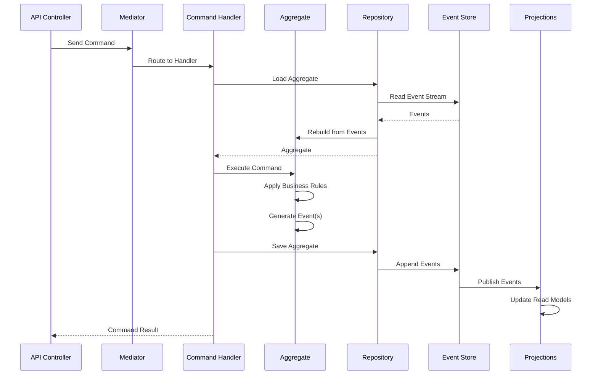

# Event Sourcing Basics

## Overview

Event Sourcing is a powerful pattern where instead of storing the current state of your domain objects, you store the sequence of events that led to that state. Whizbang makes event sourcing approachable and practical for .NET applications.

### What is Event Sourcing?

Instead of updating a record in place, event sourcing:
1. Captures every state change as an immutable event
2. Stores events in an append-only log
3. Rebuilds current state by replaying events
4. Provides a complete audit trail and time-travel capabilities

### When to Use Event Sourcing

Event sourcing is ideal when you need:
- **Complete audit trails** - Every change is recorded with who, what, when
- **Time travel** - Ability to see state at any point in time
- **Event replay** - Rebuild state, fix bugs, or create new projections
- **Complex workflows** - Track multi-step processes with compensation
- **Compliance** - Immutable history for regulatory requirements

## Architecture Diagram



## Core Components

### Required Packages

```xml
<PackageReference Include="Whizbang.Core" Version="1.0.0" />
<PackageReference Include="Whizbang.EventSourcing" Version="1.0.0" />
```

### Key Concepts

- **Event** - Immutable record of something that happened
- **Aggregate** - Domain object that enforces business rules
- **Event Stream** - Ordered sequence of events for an aggregate
- **Event Store** - Database optimized for append-only event storage
- **Snapshot** - Periodic state capture to optimize replay

## Step-by-Step Implementation

### Step 1: Define Your Events

```csharp{
title: "Event Definitions"
description: "Define domain events that represent state changes"
framework: "NET8"
category: "Event Sourcing"
difficulty: "INTERMEDIATE"
tags: ["Events", "Domain Events", "Event Sourcing"]
nugetPackages: ["Whizbang.EventSourcing"]
filename: "OrderEvents.cs"
showLineNumbers: true
highlightLines: [10, 19, 27]
usingStatements: ["Whizbang.EventSourcing", "System"]
}
using Whizbang.EventSourcing;
using System;
using System.Collections.Generic;

namespace MyApp.Orders.Events;

// Base event with common metadata
public abstract record OrderEvent : DomainEvent;

// Event: Order was created
public record OrderCreated(
    Guid OrderId,
    Guid CustomerId,
    List<OrderItem> Items,
    decimal TotalAmount,
    string ShippingAddress,
    DateTime CreatedAt
) : OrderEvent;

// Event: Item was added to order
public record OrderItemAdded(
    Guid OrderId,
    OrderItem Item,
    decimal NewTotalAmount
) : OrderEvent;

// Event: Order was shipped
public record OrderShipped(
    Guid OrderId,
    string TrackingNumber,
    string Carrier,
    DateTime ShippedAt
) : OrderEvent;

// Event: Order was cancelled
public record OrderCancelled(
    Guid OrderId,
    string Reason,
    DateTime CancelledAt
) : OrderEvent;

// Value objects
public record OrderItem(
    string ProductId,
    string ProductName,
    int Quantity,
    decimal UnitPrice
);
```

### Step 2: Create Your Aggregate

```csharp{
title: "Aggregate Implementation"
description: "Build an aggregate that applies events and enforces business rules"
framework: "NET8"
category: "Event Sourcing"
difficulty: "INTERMEDIATE"
tags: ["Aggregate", "Domain Model", "Business Rules"]
nugetPackages: ["Whizbang.EventSourcing"]
filename: "OrderAggregate.cs"
showLineNumbers: true
highlightLines: [25, 44, 67, 82]
usingStatements: ["Whizbang.EventSourcing", "System", "System.Collections.Generic"]
}
using Whizbang.EventSourcing;
using System;
using System.Collections.Generic;
using System.Linq;
using MyApp.Orders.Events;

namespace MyApp.Orders.Aggregates;

public class OrderAggregate : Aggregate {
    // Current state (rebuilt from events)
    public Guid CustomerId { get; private set; }
    public List<OrderItem> Items { get; private set; } = new();
    public decimal TotalAmount { get; private set; }
    public string ShippingAddress { get; private set; }
    public OrderStatus Status { get; private set; }
    public string TrackingNumber { get; private set; }
    public DateTime? ShippedAt { get; private set; }
    
    // Constructor for existing aggregate (loaded from events)
    public OrderAggregate() { }
    
    // Constructor for new aggregate
    public OrderAggregate(Guid orderId, Guid customerId, List<OrderItem> items, string shippingAddress) {
        if (items == null || !items.Any()) {
            throw new DomainException("Order must have at least one item");
        }
        
        var totalAmount = items.Sum(i => i.Quantity * i.UnitPrice);
        
        // Apply event (this both raises it and updates our state)
        Apply(new OrderCreated(
            orderId,
            customerId,
            items,
            totalAmount,
            shippingAddress,
            DateTime.UtcNow
        ));
    }
    
    // Command: Add item to order
    public void AddItem(OrderItem item) {
        if (Status != OrderStatus.Pending) {
            throw new DomainException($"Cannot add items to {Status} order");
        }
        
        if (item.Quantity <= 0) {
            throw new DomainException("Quantity must be positive");
        }
        
        var newTotal = TotalAmount + (item.Quantity * item.UnitPrice);
        
        Apply(new OrderItemAdded(Id, item, newTotal));
    }
    
    // Command: Ship the order
    public void Ship(string trackingNumber, string carrier) {
        if (Status != OrderStatus.Pending) {
            throw new DomainException($"Cannot ship order in {Status} status");
        }
        
        if (string.IsNullOrEmpty(trackingNumber)) {
            throw new DomainException("Tracking number is required");
        }
        
        Apply(new OrderShipped(Id, trackingNumber, carrier, DateTime.UtcNow));
    }
    
    // Command: Cancel the order
    public void Cancel(string reason) {
        if (Status == OrderStatus.Shipped) {
            throw new DomainException("Cannot cancel shipped order");
        }
        
        if (Status == OrderStatus.Cancelled) {
            return; // Idempotent
        }
        
        Apply(new OrderCancelled(Id, reason, DateTime.UtcNow));
    }
    
    // Event handlers - Update state when events are applied
    protected void When(OrderCreated @event) {
        Id = @event.OrderId;
        CustomerId = @event.CustomerId;
        Items = @event.Items.ToList();
        TotalAmount = @event.TotalAmount;
        ShippingAddress = @event.ShippingAddress;
        Status = OrderStatus.Pending;
    }
    
    protected void When(OrderItemAdded @event) {
        Items.Add(@event.Item);
        TotalAmount = @event.NewTotalAmount;
    }
    
    protected void When(OrderShipped @event) {
        Status = OrderStatus.Shipped;
        TrackingNumber = @event.TrackingNumber;
        ShippedAt = @event.ShippedAt;
    }
    
    protected void When(OrderCancelled @event) {
        Status = OrderStatus.Cancelled;
    }
}

public enum OrderStatus {
    Pending,
    Shipped,
    Delivered,
    Cancelled
}
```

### Step 3: Implement Command Handlers

```csharp{
title: "Event-Sourced Command Handler"
description: "Command handlers that work with aggregates and event stores"
framework: "NET8"
category: "Event Sourcing"
difficulty: "INTERMEDIATE"
tags: ["Command Handler", "Event Store", "Repository"]
nugetPackages: ["Whizbang.EventSourcing"]
filename: "CreateOrderHandler.cs"
showLineNumbers: true
highlightLines: [20, 25, 28]
usingStatements: ["Whizbang.EventSourcing", "System", "System.Threading.Tasks"]
}
using Whizbang.EventSourcing;
using System;
using System.Threading;
using System.Threading.Tasks;
using MyApp.Orders.Aggregates;
using MyApp.Orders.Commands;

namespace MyApp.Orders.Handlers;

public class CreateOrderHandler : ICommandHandler<CreateOrderCommand, OrderCreatedResult> {
    private readonly IAggregateRepository<OrderAggregate> _repository;
    private readonly IInventoryService _inventoryService;
    
    public CreateOrderHandler(
        IAggregateRepository<OrderAggregate> repository,
        IInventoryService inventoryService) {
        _repository = repository;
        _inventoryService = inventoryService;
    }
    
    public async Task<OrderCreatedResult> Handle(
        CreateOrderCommand command,
        CancellationToken cancellationToken) {
        
        // Check inventory before creating order
        await _inventoryService.ValidateAvailability(command.Items, cancellationToken);
        
        // Create new aggregate (generates OrderCreated event)
        var orderId = Guid.NewGuid();
        var order = new OrderAggregate(
            orderId,
            command.CustomerId,
            command.Items,
            command.ShippingAddress
        );
        
        // Save aggregate (persists events to event store)
        await _repository.SaveAsync(order, cancellationToken);
        
        // Reserve inventory (side effect after event is saved)
        await _inventoryService.ReserveItems(orderId, command.Items, cancellationToken);
        
        return new OrderCreatedResult(
            orderId,
            order.TotalAmount,
            EstimateDelivery(command.ShippingAddress)
        );
    }
    
    private DateTime EstimateDelivery(string address) {
        // Simple estimation logic
        return DateTime.UtcNow.AddDays(3);
    }
}

public class ShipOrderHandler : ICommandHandler<ShipOrderCommand, ShipmentResult> {
    private readonly IAggregateRepository<OrderAggregate> _repository;
    private readonly IShippingService _shippingService;
    
    public ShipOrderHandler(
        IAggregateRepository<OrderAggregate> repository,
        IShippingService shippingService) {
        _repository = repository;
        _shippingService = shippingService;
    }
    
    public async Task<ShipmentResult> Handle(
        ShipOrderCommand command,
        CancellationToken cancellationToken) {
        
        // Load aggregate from event store
        var order = await _repository.GetByIdAsync(command.OrderId, cancellationToken);
        
        if (order == null) {
            throw new NotFoundException($"Order {command.OrderId} not found");
        }
        
        // Request shipment
        var shipment = await _shippingService.CreateShipment(
            order.Id,
            order.ShippingAddress,
            cancellationToken
        );
        
        // Apply ship command to aggregate (generates OrderShipped event)
        order.Ship(shipment.TrackingNumber, shipment.Carrier);
        
        // Save aggregate (appends new event to stream)
        await _repository.SaveAsync(order, cancellationToken);
        
        return new ShipmentResult(
            shipment.TrackingNumber,
            shipment.Carrier,
            shipment.EstimatedDelivery
        );
    }
}
```

### Step 4: Configure Event Store

```csharp{
title: "Event Store Configuration"
description: "Configure Whizbang with event sourcing and storage"
framework: "NET8"
category: "Configuration"
difficulty: "INTERMEDIATE"
tags: ["Configuration", "Event Store", "PostgreSQL"]
nugetPackages: ["Whizbang.EventSourcing", "Whizbang.PostgreSQL"]
filename: "Program.cs"
showLineNumbers: true
highlightLines: [9, 14, 19]
usingStatements: ["Whizbang.EventSourcing", "Microsoft.Extensions.DependencyInjection"]
}
using Whizbang.EventSourcing;
using Microsoft.AspNetCore.Builder;
using Microsoft.Extensions.DependencyInjection;
using MyApp.Orders.Handlers;

var builder = WebApplication.CreateBuilder(args);

// Configure Whizbang with event sourcing
builder.Services.AddWhizbang(config => {
    // Use event sourcing with PostgreSQL
    config.UseEventSourcing(options => {
        options.UsePostgreSQL(builder.Configuration.GetConnectionString("EventStore"));
        
        // Configure snapshots (optional optimization)
        options.EnableSnapshots(snapshot => {
            snapshot.Frequency = 10; // Create snapshot every 10 events
            snapshot.KeepSnapshots = 3; // Keep last 3 snapshots
        });
        
        // Configure event serialization
        options.UseJsonSerialization(json => {
            json.UseSystemTextJson();
            json.IncludeTypeInformation = true;
        });
    });
    
    // Register handlers
    config.RegisterHandlersFromAssembly(typeof(Program).Assembly);
    
    // Add projections (read models)
    config.RegisterProjectionsFromAssembly(typeof(Program).Assembly);
});

// Register domain services
builder.Services.AddScoped<IInventoryService, InventoryService>();
builder.Services.AddScoped<IShippingService, ShippingService>();

builder.Services.AddControllers();

var app = builder.Build();

// Initialize event store schema
await app.InitializeEventStore();

app.UseRouting();
app.MapControllers();

app.Run();
```

## Complete Example

```csharp{
title: "Complete Event Sourcing Example"
description: "Full working example showing event sourcing from API to persistence"
framework: "NET8"
category: "Complete Example"
difficulty: "INTERMEDIATE"
tags: ["Event Sourcing", "Complete", "API", "Aggregate"]
nugetPackages: ["Whizbang.EventSourcing", "Microsoft.AspNetCore.Mvc"]
filename: "EventSourcedOrdersController.cs"
showLineNumbers: true
highlightLines: [22, 35, 50, 68]
testFile: "EventSourcedOrdersTests.cs"
testMethod: "CreateOrder_StoresEvents_AndRebuildsState"
usingStatements: ["Whizbang.EventSourcing", "Microsoft.AspNetCore.Mvc", "System.Threading.Tasks"]
}
using Whizbang.EventSourcing;
using Microsoft.AspNetCore.Mvc;
using System;
using System.Threading;
using System.Threading.Tasks;
using MyApp.Orders.Commands;
using MyApp.Orders.Queries;

namespace MyApp.Controllers;

[ApiController]
[Route("api/[controller]")]
public class OrdersController : ControllerBase {
    private readonly IMediator _mediator;
    private readonly IEventStore _eventStore;
    
    public OrdersController(IMediator mediator, IEventStore eventStore) {
        _mediator = mediator;
        _eventStore = eventStore;
    }
    
    [HttpPost]
    public async Task<ActionResult<OrderCreatedResult>> CreateOrder(
        [FromBody] CreateOrderRequest request,
        CancellationToken cancellationToken) {
        
        var command = new CreateOrderCommand(
            request.CustomerId,
            request.Items,
            request.ShippingAddress
        );
        
        var result = await _dispatcher.Send(command, cancellationToken);
        
        return CreatedAtAction(
            nameof(GetOrder),
            new { orderId = result.OrderId },
            result
        );
    }
    
    [HttpPost("{orderId}/ship")]
    public async Task<ActionResult<ShipmentResult>> ShipOrder(
        Guid orderId,
        [FromBody] ShipOrderRequest request,
        CancellationToken cancellationToken) {
        
        var command = new ShipOrderCommand(orderId, "", ""); // TODO: Get tracking details
        var result = await _dispatcher.Send(command, cancellationToken);
        
        return Ok(result);
    }
    
    [HttpGet("{orderId}")]
    public async Task<ActionResult<OrderDetails>> GetOrder(
        Guid orderId,
        CancellationToken cancellationToken) {
        
        // Query uses projection (read model)
        var query = new GetOrderByIdQuery(orderId);
        var result = await _mediator.Send(query, cancellationToken);
        
        if (result == null) {
            return NotFound();
        }
        
        return Ok(result);
    }
    
    [HttpGet("{orderId}/history")]
    public async Task<ActionResult<OrderHistory>> GetOrderHistory(
        Guid orderId,
        CancellationToken cancellationToken) {
        
        // Get all events for this aggregate
        var events = await _eventStore.GetEvents(
            $"Order-{orderId}",
            cancellationToken
        );
        
        // Map events to history entries
        var history = events.Select(e => new HistoryEntry {
            EventType = e.GetType().Name,
            OccurredAt = e.OccurredAt,
            Data = e,
            Version = e.Version
        }).ToList();
        
        return Ok(new OrderHistory {
            OrderId = orderId,
            Events = history,
            CurrentVersion = events.LastOrDefault()?.Version ?? 0
        });
    }
    
    [HttpGet("{orderId}/at/{timestamp}")]
    public async Task<ActionResult<OrderSnapshot>> GetOrderAtPointInTime(
        Guid orderId,
        DateTime timestamp,
        CancellationToken cancellationToken) {
        
        // Replay events up to specific point in time
        var events = await _eventStore.GetEvents(
            $"Order-{orderId}",
            upTo: timestamp,
            cancellationToken
        );
        
        // Rebuild aggregate state at that point
        var aggregate = new OrderAggregate();
        aggregate.LoadFromHistory(events);
        
        return Ok(new OrderSnapshot {
            OrderId = orderId,
            AsOf = timestamp,
            State = aggregate,
            Version = events.LastOrDefault()?.Version ?? 0
        });
    }
}
```

## Testing Strategy

### Testing Aggregates

```csharp{
title: "Aggregate Unit Tests"
description: "Test aggregate behavior and event generation"
framework: "NET8"
category: "Testing"
difficulty: "INTERMEDIATE"
tags: ["Unit Testing", "Aggregates", "Events"]
nugetPackages: ["Whizbang.EventSourcing", "xUnit"]
filename: "OrderAggregateTests.cs"
showLineNumbers: true
usingStatements: ["Whizbang.EventSourcing", "Xunit", "System"]
}
using Whizbang.EventSourcing;
using Xunit;
using System;
using System.Collections.Generic;
using System.Linq;
using MyApp.Orders.Aggregates;
using MyApp.Orders.Events;

namespace MyApp.Tests.Orders;

public class OrderAggregateTests {
    [Fact]
    public void Constructor_ValidOrder_GeneratesOrderCreatedEvent() {
        // Arrange
        var orderId = Guid.NewGuid();
        var customerId = Guid.NewGuid();
        var items = new List<OrderItem> {
            new OrderItem("PROD-1", "Widget", 2, 10.00m)
        };
        
        // Act
        var aggregate = new OrderAggregate(orderId, customerId, items, "123 Main St");
        
        // Assert
        var events = aggregate.GetUncommittedEvents();
        Assert.Single(events);
        
        var createdEvent = Assert.IsType<OrderCreated>(events.First());
        Assert.Equal(orderId, createdEvent.OrderId);
        Assert.Equal(customerId, createdEvent.CustomerId);
        Assert.Equal(20.00m, createdEvent.TotalAmount);
    }
    
    [Fact]
    public void Ship_ValidOrder_GeneratesOrderShippedEvent() {
        // Arrange
        var aggregate = CreateTestAggregate();
        
        // Act
        aggregate.Ship("TRACK123", "FedEx");
        
        // Assert
        var events = aggregate.GetUncommittedEvents();
        var shippedEvent = Assert.IsType<OrderShipped>(events.Last());
        Assert.Equal("TRACK123", shippedEvent.TrackingNumber);
        Assert.Equal(OrderStatus.Shipped, aggregate.Status);
    }
    
    [Fact]
    public void Cancel_ShippedOrder_ThrowsException() {
        // Arrange
        var aggregate = CreateTestAggregate();
        aggregate.Ship("TRACK123", "FedEx");
        aggregate.MarkEventsAsCommitted();
        
        // Act & Assert
        var exception = Assert.Throws<DomainException>(
            () => aggregate.Cancel("Customer request")
        );
        Assert.Contains("Cannot cancel shipped order", exception.Message);
    }
    
    [Fact]
    public void LoadFromHistory_RebuildsState() {
        // Arrange
        var orderId = Guid.NewGuid();
        var events = new List<DomainEvent> {
            new OrderCreated(
                orderId,
                Guid.NewGuid(),
                new List<OrderItem> { new OrderItem("P1", "Widget", 1, 10.00m) },
                10.00m,
                "123 Main St",
                DateTime.UtcNow
            ),
            new OrderItemAdded(
                orderId,
                new OrderItem("P2", "Gadget", 2, 5.00m),
                20.00m
            ),
            new OrderShipped(
                orderId,
                "TRACK123",
                "UPS",
                DateTime.UtcNow
            )
        };
        
        // Act
        var aggregate = new OrderAggregate();
        aggregate.LoadFromHistory(events);
        
        // Assert
        Assert.Equal(orderId, aggregate.Id);
        Assert.Equal(2, aggregate.Items.Count);
        Assert.Equal(20.00m, aggregate.TotalAmount);
        Assert.Equal(OrderStatus.Shipped, aggregate.Status);
        Assert.Equal("TRACK123", aggregate.TrackingNumber);
    }
    
    private OrderAggregate CreateTestAggregate() {
        return new OrderAggregate(
            Guid.NewGuid(),
            Guid.NewGuid(),
            new List<OrderItem> { new OrderItem("P1", "Widget", 1, 10.00m) },
            "123 Main St"
        );
    }
}
```

## Common Pitfalls

### Don't Modify Events After Creation

```csharp
// ❌ BAD - Events are immutable
var @event = new OrderCreated(...);
@event.TotalAmount = 100; // Compiler error - records are immutable

// ✅ GOOD - Create new event with correct data
var @event = new OrderCreated(..., TotalAmount: 100, ...);
```

### Avoid Side Effects in Event Handlers

```csharp
// ❌ BAD - Side effects in When method
protected void When(OrderShipped @event) {
    Status = OrderStatus.Shipped;
    EmailService.SendNotification(...); // NO! Side effects don't belong here
}

// ✅ GOOD - Pure state updates only
protected void When(OrderShipped @event) {
    Status = OrderStatus.Shipped;
    TrackingNumber = @event.TrackingNumber;
}
```

### Don't Query in Receptors

```csharp
// ❌ BAD - Receptor querying external data
public class OrderReceptor : IReceptor<ShipOrderCommand> {
    public async Task<OrderShipped> Receive(ShipOrderCommand cmd) {
        var inventory = await _inventoryService.Check(); // NO! Receptors should be pure
    }
}

// ✅ GOOD - Use lenses for validation or pass data in command
public OrderShipped Receive(ShipOrderCommand cmd, IInventoryLens lens) {
    if (!lens.IsAvailable(cmd.OrderId)) {
        throw new DomainException("Insufficient inventory");
    }
    return new OrderShipped(...);
}
```

## Progressive Enhancement

### Add Snapshots for Performance

```csharp
// Configure snapshot strategy
ledger.EnableSnapshots(snapshot => {
    snapshot.Frequency = 10; // Every 10 events
    snapshot.Strategy = SnapshotStrategy.Automatic;
});

// Implement snapshot interface on receptor
[EventSourced]
public class OrderReceptor : IReceptor<CreateOrderCommand>, ISnapshotable {
    // ... receptor implementation ...
    
    public Snapshot TakeSnapshot() {
        return new OrderSnapshot {
            Id = id,
            CustomerId = customerId,
            Items = items.ToList(),
            Status = status,
            Version = GetVersion()
        };
    }
    
    public void RestoreFromSnapshot(Snapshot snapshot) {
        var orderSnapshot = (OrderSnapshot)snapshot;
        id = orderSnapshot.Id;
        customerId = orderSnapshot.CustomerId;
        items = orderSnapshot.Items;
        status = orderSnapshot.Status;
        SetVersion(orderSnapshot.Version);
    }
}
```

### Add Perspectives for Queries

See **[Perspectives Documentation](/docs/core-concepts/perspectives)** for detailed perspective patterns.

### Scale with Event Streams

```csharp
// Configure multiple streams
dispatcher.UseEventSourcing(es => {
    es.UseLedger(ledger => {
        ledger.ConfigureStreams(streams => {
            streams.PartitionBy<OrderReceptor>(r => r.CustomerId);
            streams.EnableParallelProcessing(maxDegree: 4);
        });
    });
});
```

## Related Patterns

- **[Event-Driven Dispatcher Pattern](simple-mediator.md)** - Start without event sourcing
- **[Perspectives Documentation](/docs/core-concepts/perspectives)** - Optimize reads with multiple views
- **[Saga Orchestration](saga-orchestration.md)** - Coordinate multi-receptor workflows

## Production Considerations

### Event Schema Evolution

```csharp
// Version your events
public record OrderCreatedV2(
    // New fields...
) : OrderEvent, IUpgradeFrom<OrderCreated> {
    public OrderCreatedV2 UpgradeFrom(OrderCreated old) {
        // Migration logic
    }
}
```

### Event Store Maintenance

- Regular backups of event store
- Monitor stream sizes
- Archive old events if needed
- Index frequently queried streams

### Performance Optimization

- Use snapshots for aggregates with many events
- Implement caching for frequently accessed aggregates
- Consider async projections for read models
- Monitor event replay times

## Next Steps

- Learn about **[Perspectives](/docs/core-concepts/perspectives)** for read model optimization
- Explore **[Saga Orchestration](saga-orchestration.md)** for complex workflows
- Review **[Receptors Documentation](/docs/core-concepts/receptors)** for advanced patterns
- Check out **[Lenses](/docs/core-concepts/lenses)** for building query interfaces