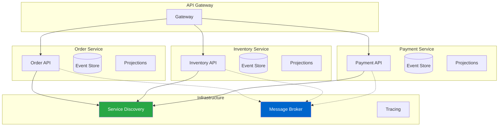

# Microservices Integration

## Overview

Whizbang provides first-class support for building microservices with .NET Aspire, Microsoft's opinionated stack for cloud-native applications. This pattern shows how to structure, deploy, and operate Whizbang-based microservices in production.

### Key Components

- **Service Boundaries**: Define bounded contexts and aggregates
- **.NET Aspire Integration**: Orchestration and observability
- **Service Discovery**: Automatic service registration and discovery
- **Health Monitoring**: Liveness and readiness probes
- **Distributed Tracing**: End-to-end request tracking

## Architecture Diagram



## Implementation Guide

*Documentation in progress - This page demonstrates the structure for microservices integration patterns with Whizbang.*

### Topics to Cover:

1. **Service Design**
   - Bounded context definition
   - API contracts
   - Event contracts
   - Shared kernels

2. **.NET Aspire Setup**
   - App host configuration
   - Service registration
   - Resource provisioning
   - Environment configuration

3. **Service Communication**
   - Synchronous HTTP calls
   - Asynchronous messaging
   - gRPC integration
   - Circuit breakers

4. **Data Management**
   - Database per service
   - Event store partitioning
   - Cross-service queries
   - Data consistency

5. **Deployment Strategies**
   - Kubernetes deployment
   - Container orchestration
   - Blue-green deployments
   - Canary releases

## Example: Aspire Configuration

```csharp
// Placeholder for Aspire app host configuration
var builder = DistributedApplication.CreateBuilder(args);

// Service configuration coming soon
```

## Related Patterns

- **[Distributed Messaging](distributed-messaging.md)** - Service communication patterns
- **[Saga Orchestration](saga-orchestration.md)** - Multi-service workflows
- **[Event Sourcing Basics](event-sourcing-basics.md)** - Service data patterns

## Production Considerations

### Observability
- Distributed tracing with OpenTelemetry
- Centralized logging with structured logs
- Metrics aggregation and alerting
- Service dependency mapping

### Resilience
- Circuit breaker patterns
- Retry policies with exponential backoff
- Bulkhead isolation
- Timeout configuration

### Security
- Service-to-service authentication
- API gateway security
- Secret management
- Network policies

## Next Steps

- Review **[.NET Aspire Integration](/docs/getting-started/aspire-integration)** for setup details
- Explore **[Advanced Configuration](/docs/advanced/configuration)** for production settings
- Check **[Dashboard Documentation](/docs/observability/dashboard)** for monitoring