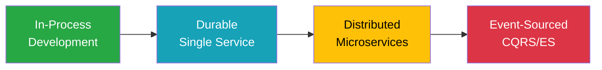

# Progressive Enhancement

## Overview

Progressive Enhancement is Whizbang's superpower - the ability to evolve your application from a simple monolith to a distributed, event-sourced system **without changing your handler code**. This pattern allows you to start simple and add complexity only when needed, maintaining the same business logic throughout your application's growth.

## The Journey



## The Same Handler, Every Mode

This is the key insight - **one handler implementation works across all modes**:

```csharp{
title: "Universal Handler"
description: "This exact handler works in ALL deployment modes"
framework: "NET8"
category: "Core Concept"
difficulty: "BEGINNER"
tags: ["Handler", "Universal", "Progressive Enhancement"]
nugetPackages: ["Whizbang.Core"]
filename: "OrderHandler.cs"
showLineNumbers: true
highlightLines: [1, 2, 3]
usingStatements: ["Whizbang", "System"]
}
[Logged]
[Validated]
[Transactional]
public class OrderHandler : IHandle<CreateOrder> {
    public OrderCreated Handle(CreateOrder cmd, IOrderRepository repository) {
        // This EXACT code works in:
        // ✅ Local development (in-process)
        // ✅ Production monolith (durable)
        // ✅ Microservices (distributed)
        // ✅ Event-sourced system (CQRS/ES)
        
        var order = new Order {
            Id = Guid.NewGuid(),
            CustomerId = cmd.CustomerId,
            Items = cmd.Items,
            Total = cmd.Items.Sum(i => i.Quantity * i.Price),
            Status = OrderStatus.Pending,
            CreatedAt = DateTime.UtcNow
        };
        
        repository.Save(order);
        
        return new OrderCreated(
            order.Id,
            order.CustomerId,
            order.Total,
            order.CreatedAt
        );
    }
}
```

## Mode 1: In-Process (Development)

### Configuration

```csharp{
title: "In-Process Mode Configuration"
description: "Perfect for development and testing - zero infrastructure"
framework: "NET8"
category: "Configuration"
difficulty: "BEGINNER"
tags: ["In-Process", "Development", "Configuration"]
nugetPackages: ["Whizbang.Core"]
filename: "Program.InProcess.cs"
showLineNumbers: true
usingStatements: ["Whizbang", "Microsoft.Extensions.DependencyInjection"]
}
// Program.cs - Development mode
var builder = WebApplication.CreateBuilder(args);

builder.Services.AddWhizbang()
    .UseInProcessMode()  // Everything runs in-memory
    .RegisterHandlersFromAssembly(typeof(Program).Assembly);

// No database required for development
builder.Services.AddSingleton<IOrderRepository, InMemoryOrderRepository>();

var app = builder.Build();

app.MapPost("/orders", async (CreateOrder cmd, IWhizbang whizbang) => {
    // Executes immediately, synchronously
    var result = await whizbang.Send(cmd);
    return Results.Ok(result);
});

app.Run();
```

### Characteristics

```csharp{
title: "In-Process Mode Behavior"
description: "How handlers execute in development mode"
framework: "NET8"
category: "Behavior"
difficulty: "BEGINNER"
tags: ["In-Process", "Execution", "Development"]
nugetPackages: ["Whizbang.Core"]
filename: "InProcessBehavior.cs"
showLineNumbers: true
usingStatements: ["Whizbang", "System.Diagnostics"]
}
public class InProcessExample {
    public async Task DemonstrateInProcess(IWhizbang whizbang) {
        var stopwatch = Stopwatch.StartNew();
        
        // Immediate, synchronous execution
        var result = await whizbang.Send(new CreateOrder {
            CustomerId = Guid.NewGuid(),
            Items = new[] { new OrderItem("SKU-1", 2, 10.00m) }
        });
        
        // Handler executed in same thread
        Console.WriteLine($"Thread: {Thread.CurrentThread.ManagedThreadId}");
        Console.WriteLine($"Duration: {stopwatch.ElapsedMilliseconds}ms");
        // Output: Thread: 1, Duration: 5ms
        
        // Events published synchronously
        // All subscribers notified immediately
        // No persistence, no retries
    }
}

// Testing is simple
[Fact]
public async Task InProcessMode_ExecutesImmediately() {
    var whizbang = new WhizbangBuilder()
        .UseInProcessMode()
        .Build();
    
    var result = await whizbang.Send(new CreateOrder());
    
    Assert.NotNull(result);
    Assert.IsType<OrderCreated>(result);
}
```

### When to Use

- **Local development** - Fast feedback loop
- **Unit testing** - No infrastructure dependencies
- **Prototyping** - Rapid iteration
- **Simple applications** - When you don't need durability

## Mode 2: Durable (Single Service)

### Configuration

```csharp{
title: "Durable Mode Configuration"
description: "Add persistence and retry capabilities to your monolith"
framework: "NET8"
category: "Configuration"
difficulty: "INTERMEDIATE"
tags: ["Durable", "Persistence", "Monolith"]
nugetPackages: ["Whizbang.Core", "Whizbang.PostgreSQL"]
filename: "Program.Durable.cs"
showLineNumbers: true
highlightLines: [5, 6, 7, 8]
usingStatements: ["Whizbang", "Microsoft.Extensions.DependencyInjection"]
}
// Program.cs - Production monolith
var builder = WebApplication.CreateBuilder(args);

builder.Services.AddWhizbang()
    .UseDurableMode()  // Adds persistence and retry
    .UsePostgreSQL(connectionString)
    .WithOutbox()  // Ensures message delivery
    .WithRetry(3, backoff: "exponential")
    .RegisterHandlersFromAssembly(typeof(Program).Assembly);

// Real database for production
builder.Services.AddScoped<IOrderRepository, PostgresOrderRepository>();

// Background service for processing
builder.Services.AddHostedService<WhizbangProcessor>();

var app = builder.Build();

app.MapPost("/orders", async (CreateOrder cmd, IWhizbang whizbang) => {
    // Queued for durable processing
    await whizbang.Publish(cmd);
    return Results.Accepted();  // Returns immediately
});

app.Run();
```

### Message Flow

```csharp{
title: "Durable Mode Message Flow"
description: "How messages are persisted and processed"
framework: "NET8"
category: "Message Flow"
difficulty: "INTERMEDIATE"
tags: ["Durability", "Outbox", "Retry"]
nugetPackages: ["Whizbang.Core"]
filename: "DurableFlow.cs"
showLineNumbers: true
usingStatements: ["Whizbang", "System"]
}
public class DurableExample {
    public async Task DemonstrateDurable(IWhizbang whizbang) {
        // 1. Message persisted to outbox
        await whizbang.Publish(new CreateOrder { ... });
        // Returns immediately after persisting
        
        // 2. Background processor picks up message
        // - Dequeues from outbox
        // - Executes handler
        // - On success: Marks complete
        // - On failure: Retries with backoff
        
        // 3. Events from handler also go through outbox
        // - Ensures exactly-once delivery
        // - Maintains order guarantees
    }
}

// Automatic retry on failure
[Retry(3, Backoff = "exponential")]
public class ResilientHandler : IHandle<ProcessPayment> {
    public PaymentProcessed Handle(ProcessPayment cmd) {
        // If this fails, automatically retried
        // 1st retry: 1 second delay
        // 2nd retry: 2 second delay  
        // 3rd retry: 4 second delay
        return ProcessPaymentWithGateway(cmd);
    }
}
```

### Database Schema

```sql
-- Outbox table for durable messaging
CREATE TABLE whizbang_outbox (
    id BIGSERIAL PRIMARY KEY,
    message_id UUID NOT NULL UNIQUE,
    message_type VARCHAR(500) NOT NULL,
    payload JSONB NOT NULL,
    created_at TIMESTAMPTZ NOT NULL DEFAULT NOW(),
    processed_at TIMESTAMPTZ,
    attempts INT NOT NULL DEFAULT 0,
    error TEXT
);

-- Inbox for idempotency
CREATE TABLE whizbang_inbox (
    message_id UUID PRIMARY KEY,
    processed_at TIMESTAMPTZ NOT NULL,
    handler_type VARCHAR(500) NOT NULL
);
```

### When to Use

- **Production monoliths** - Reliability without distribution
- **High-value operations** - Can't afford to lose messages
- **Background processing** - Decouple API from processing
- **Retry requirements** - Handle transient failures

## Mode 3: Distributed (Microservices)

### Configuration

```csharp{
title: "Distributed Mode Configuration"
description: "Scale across multiple services with message brokers"
framework: "NET8"
category: "Configuration"
difficulty: "ADVANCED"
tags: ["Distributed", "Microservices", "Kafka"]
nugetPackages: ["Whizbang.Core", "Whizbang.Kafka"]
filename: "Program.Distributed.cs"
showLineNumbers: true
highlightLines: [5, 6, 7, 8, 9]
usingStatements: ["Whizbang", "Microsoft.Extensions.DependencyInjection"]
}
// Program.cs - Orders Service
var builder = WebApplication.CreateBuilder(args);

builder.Services.AddWhizbang()
    .UseDistributedMode()
    .UseKafka(config => {
        config.BootstrapServers = "kafka:9092";
        config.ConsumerGroup = "orders-service";
    })
    .UsePostgreSQL(connectionString)  // Local event store
    .WithSagaOrchestration()          // Distributed transactions
    .WithDistributedTracing()         // OpenTelemetry
    .RegisterHandlersFromAssembly(typeof(Program).Assembly);

// Domain ownership configuration
builder.Services.ConfigureDomain("Orders", domain => {
    domain.OwnsAggregate<Order>();
    domain.PublishesEvents<OrderCreated, OrderShipped, OrderCancelled>();
    domain.HandlesCommands<CreateOrder, ShipOrder, CancelOrder>();
});

var app = builder.Build();

// Health checks for service discovery
app.MapHealthChecks("/health");

app.Run();
```

### Service Communication

```csharp{
title: "Cross-Service Communication"
description: "How services communicate in distributed mode"
framework: "NET8"
category: "Communication"
difficulty: "ADVANCED"
tags: ["Service Communication", "Events", "Commands"]
nugetPackages: ["Whizbang.Core"]
filename: "DistributedCommunication.cs"
showLineNumbers: true
usingStatements: ["Whizbang", "System"]
}
// Orders Service - Publishes events
[OwnedBy("Orders")]
public class OrderHandler : IHandle<CreateOrder> {
    public OrderCreated Handle(CreateOrder cmd) {
        var order = CreateOrder(cmd);
        
        // This event is automatically published to Kafka
        // Other services can subscribe
        return new OrderCreated(order.Id, order.Total);
    }
}

// Inventory Service - Subscribes to events
[Service("Inventory")]
public class InventoryHandler : IHandle<OrderCreated> {
    public InventoryReserved Handle(OrderCreated @event) {
        // Receives event from Kafka
        // Reserves inventory for the order
        var reservation = ReserveInventory(@event.OrderId);
        
        // Publishes its own event
        return new InventoryReserved(
            @event.OrderId, 
            reservation.Id
        );
    }
}

// Payment Service - Part of saga
[Service("Payment")]
public class PaymentSaga : Saga<PaymentState> {
    public SagaAction Handle(OrderCreated @event) {
        State.OrderId = @event.OrderId;
        State.Amount = @event.Total;
        
        // Orchestrate payment process
        return SagaAction
            .Send(new ChargeCard(State.Amount))
            .OnSuccess(new PaymentCompleted(State.OrderId))
            .OnFailure(new PaymentFailed(State.OrderId))
            .WithTimeout(TimeSpan.FromMinutes(5));
    }
}
```

### Service Discovery

```csharp{
title: "Service Discovery and Routing"
description: "Automatic service discovery and message routing"
framework: "NET8"
category: "Service Discovery"
difficulty: "ADVANCED"
tags: ["Service Discovery", "Routing", "Consul"]
nugetPackages: ["Whizbang.Core", "Whizbang.ServiceDiscovery"]
filename: "ServiceDiscovery.cs"
showLineNumbers: true
usingStatements: ["Whizbang", "System"]
}
// Automatic service registration
builder.Services.AddWhizbang()
    .UseDistributedMode()
    .UseServiceDiscovery(options => {
        options.UseConsul("http://consul:8500");
        options.ServiceName = "orders-service";
        options.ServiceId = Environment.MachineName;
        options.HealthCheckInterval = TimeSpan.FromSeconds(10);
    });

// Commands routed to owning service
public class OrderClient {
    private readonly IWhizbang _whizbang;
    
    public async Task<OrderCreated> CreateOrder(CreateOrder cmd) {
        // Whizbang knows Orders service owns this command
        // Automatically routes via service discovery
        return await _whizbang.Send(cmd);
    }
}

// Load balancing across instances
[LoadBalanced(Strategy = "round-robin")]
public class DistributedQuery : IHandle<GetOrderStatus> {
    public OrderStatus Handle(GetOrderStatus query) {
        // Queries can be handled by any instance
        return GetStatus(query.OrderId);
    }
}
```

### When to Use

- **Microservice architecture** - Independent service scaling
- **Team boundaries** - Different teams own different services  
- **Technology diversity** - Services in different languages
- **Geographic distribution** - Services in different regions

## Mode 4: Event-Sourced (CQRS/ES)

### Configuration

```csharp{
title: "Event-Sourced Mode Configuration"
description: "Full event sourcing with projections and time travel"
framework: "NET8"
category: "Configuration"
difficulty: "ADVANCED"
tags: ["Event Sourcing", "CQRS", "Projections"]
nugetPackages: ["Whizbang.Core", "Whizbang.EventStore"]
filename: "Program.EventSourced.cs"
showLineNumbers: true
highlightLines: [5, 6, 7, 8, 9, 10]
usingStatements: ["Whizbang", "Microsoft.Extensions.DependencyInjection"]
}
// Program.cs - Event-sourced system
var builder = WebApplication.CreateBuilder(args);

builder.Services.AddWhizbang()
    .UseEventSourcedMode()
    .UseEventStore(config => {
        config.ConnectionString = eventStoreConnection;
        config.SnapshotFrequency = 100;  // Snapshot every 100 events
    })
    .UseProjections(config => {
        config.UsePostgreSQL(readModelConnection);
        config.RebuildOnStartup = false;
    })
    .WithTimeTravel()  // Enable historical queries
    .RegisterHandlersFromAssembly(typeof(Program).Assembly);

// Register aggregates
builder.Services.RegisterAggregate<Order>();
builder.Services.RegisterAggregate<Customer>();

// Register projections
builder.Services.RegisterProjection<OrderListProjection>();
builder.Services.RegisterProjection<CustomerOrderHistoryProjection>();
builder.Services.RegisterProjection<RevenueProjection>();

var app = builder.Build();

// Projection management endpoints
app.MapProjectionManagement("/projections");

app.Run();
```

### Event-Sourced Aggregates

```csharp{
title: "Event-Sourced Aggregate"
description: "Domain aggregates that emit events"
framework: "NET8"
category: "Aggregates"
difficulty: "ADVANCED"
tags: ["Aggregates", "Domain", "Events"]
nugetPackages: ["Whizbang.Core"]
filename: "OrderAggregate.cs"
showLineNumbers: true
highlightLines: [1, 10, 20, 30]
usingStatements: ["Whizbang", "System"]
}
[EventSourced]
public class Order : Aggregate {
    public Guid CustomerId { get; private set; }
    public List<OrderItem> Items { get; private set; }
    public decimal Total { get; private set; }
    public OrderStatus Status { get; private set; }
    
    // Command handler - returns events
    public OrderCreated Handle(CreateOrder cmd) {
        if (cmd.Items?.Any() != true) {
            throw new InvalidOperationException("Order must have items");
        }
        
        var total = cmd.Items.Sum(i => i.Quantity * i.Price);
        
        // Return event - automatically appended to event stream
        return new OrderCreated {
            OrderId = Guid.NewGuid(),
            CustomerId = cmd.CustomerId,
            Items = cmd.Items,
            Total = total,
            CreatedAt = DateTime.UtcNow
        };
    }
    
    // Event handler - updates state
    [Pure]  // No side effects allowed
    public void Apply(OrderCreated @event) {
        Id = @event.OrderId;
        CustomerId = @event.CustomerId;
        Items = @event.Items.ToList();
        Total = @event.Total;
        Status = OrderStatus.Pending;
    }
    
    // Another command
    public OrderShipped Ship(ShipOrder cmd) {
        if (Status != OrderStatus.Paid) {
            throw new InvalidOperationException("Can only ship paid orders");
        }
        
        return new OrderShipped {
            OrderId = Id,
            ShippedAt = DateTime.UtcNow,
            TrackingNumber = cmd.TrackingNumber
        };
    }
    
    public void Apply(OrderShipped @event) {
        Status = OrderStatus.Shipped;
    }
}
```

### Projections

```csharp{
title: "Event Projections"
description: "Building read models from event streams"
framework: "NET8"
category: "Projections"
difficulty: "ADVANCED"
tags: ["Projections", "Read Models", "CQRS"]
nugetPackages: ["Whizbang.Core"]
filename: "Projections.cs"
showLineNumbers: true
usingStatements: ["Whizbang", "System"]
}
// Order list projection
[Projection("OrderList")]
public class OrderListProjection : 
    IProject<OrderCreated>,
    IProject<OrderShipped>,
    IProject<OrderCancelled> {
    
    private readonly IDocumentStore _store;
    
    public async Task Project(OrderCreated @event) {
        await _store.Upsert(new OrderListItem {
            OrderId = @event.OrderId,
            CustomerId = @event.CustomerId,
            Total = @event.Total,
            Status = "Created",
            CreatedAt = @event.CreatedAt
        });
    }
    
    public async Task Project(OrderShipped @event) {
        await _store.Update<OrderListItem>(@event.OrderId, item => {
            item.Status = "Shipped";
            item.ShippedAt = @event.ShippedAt;
        });
    }
    
    public async Task Project(OrderCancelled @event) {
        await _store.Update<OrderListItem>(@event.OrderId, item => {
            item.Status = "Cancelled";
            item.CancelledAt = @event.CancelledAt;
        });
    }
}

// Revenue projection with time windows
[Projection("Revenue")]
public class RevenueProjection : IProject<OrderCreated> {
    public async Task Project(OrderCreated @event) {
        // Update daily revenue
        await _store.Increment(
            $"revenue:daily:{@event.CreatedAt:yyyy-MM-dd}",
            @event.Total
        );
        
        // Update monthly revenue
        await _store.Increment(
            $"revenue:monthly:{@event.CreatedAt:yyyy-MM}",
            @event.Total
        );
        
        // Update customer lifetime value
        await _store.Increment(
            $"customer:ltv:{@event.CustomerId}",
            @event.Total
        );
    }
}
```

### Time Travel Queries

```csharp{
title: "Time Travel and Historical Queries"
description: "Query system state at any point in time"
framework: "NET8"
category: "Time Travel"
difficulty: "ADVANCED"
tags: ["Time Travel", "Historical", "Debugging"]
nugetPackages: ["Whizbang.Core"]
filename: "TimeTravel.cs"
showLineNumbers: true
usingStatements: ["Whizbang", "System"]
}
public class TimeTravelExample {
    private readonly IWhizbang _whizbang;
    
    public async Task<Order> GetOrderAtPointInTime(
        Guid orderId, 
        DateTime pointInTime) {
        
        // Replay events up to specific time
        var order = await _whizbang
            .AsOf(pointInTime)
            .Get<Order>(orderId);
        
        return order;
    }
    
    public async Task<decimal> GetRevenueOnDate(DateTime date) {
        // Query projection as it was on specific date
        var revenue = await _whizbang
            .AsOf(date.AddDays(1).AddSeconds(-1))
            .Query<RevenueProjection>()
            .GetDailyRevenue(date);
        
        return revenue;
    }
    
    public async Task DebugOrderHistory(Guid orderId) {
        // Get all events for an aggregate
        var events = await _whizbang
            .EventStream(orderId)
            .ToListAsync();
        
        Console.WriteLine($"Order {orderId} history:");
        foreach (var @event in events) {
            Console.WriteLine($"  {@event.Timestamp}: {@event.GetType().Name}");
            
            // Replay to this point
            var orderAtPoint = await _whizbang
                .AsOf(@event.Timestamp)
                .Get<Order>(orderId);
            
            Console.WriteLine($"    Status: {orderAtPoint.Status}");
            Console.WriteLine($"    Total: {orderAtPoint.Total}");
        }
    }
}
```

### When to Use

- **Audit requirements** - Complete history of all changes
- **Complex domains** - Rich business logic with many state transitions
- **Debugging needs** - Replay events to understand issues
- **Analytics** - Build new projections from historical data
- **Compliance** - Prove system state at any point in time

## Migration Strategies

### From In-Process to Durable

```csharp{
title: "Migrating to Durable Mode"
description: "Steps to add durability to existing application"
framework: "NET8"
category: "Migration"
difficulty: "INTERMEDIATE"
tags: ["Migration", "Durability", "Evolution"]
nugetPackages: ["Whizbang.Core"]
filename: "MigrateToDurable.cs"
showLineNumbers: true
usingStatements: ["Whizbang", "Microsoft.Extensions.DependencyInjection"]
}
// Step 1: Change configuration (no handler changes!)
// Before:
builder.Services.AddWhizbang()
    .UseInProcessMode();

// After:
builder.Services.AddWhizbang()
    .UseDurableMode()
    .UsePostgreSQL(connectionString);

// Step 2: Add background processor
builder.Services.AddHostedService<WhizbangProcessor>();

// Step 3: Update message sending (optional)
// Change from Send (synchronous) to Publish (async)
// Before:
var result = await whizbang.Send(command);

// After (for background processing):
await whizbang.Publish(command);

// Your handlers remain EXACTLY the same!
```

### From Durable to Distributed

```csharp{
title: "Migrating to Distributed Mode"
description: "Steps to split monolith into microservices"
framework: "NET8"
category: "Migration"
difficulty: "ADVANCED"
tags: ["Migration", "Microservices", "Distribution"]
nugetPackages: ["Whizbang.Core", "Whizbang.Kafka"]
filename: "MigrateToDistributed.cs"
showLineNumbers: true
usingStatements: ["Whizbang", "Microsoft.Extensions.DependencyInjection"]
}
// Step 1: Define service boundaries
// Orders Service
builder.Services.ConfigureDomain("Orders", domain => {
    domain.OwnsAggregate<Order>();
    domain.HandlesCommands<CreateOrder, ShipOrder>();
});

// Inventory Service  
builder.Services.ConfigureDomain("Inventory", domain => {
    domain.OwnsAggregate<Product>();
    domain.HandlesCommands<ReserveStock, ReleaseStock>();
});

// Step 2: Add message broker
builder.Services.AddWhizbang()
    .UseDistributedMode()
    .UseKafka(kafkaConfig);

// Step 3: Deploy services independently
// Each service has its own database
// Communication via Kafka

// Handlers remain EXACTLY the same!
```

### From Distributed to Event-Sourced

```csharp{
title: "Migrating to Event Sourcing"
description: "Steps to add event sourcing to existing system"
framework: "NET8"
category: "Migration"
difficulty: "ADVANCED"
tags: ["Migration", "Event Sourcing", "CQRS"]
nugetPackages: ["Whizbang.Core", "Whizbang.EventStore"]
filename: "MigrateToEventSourced.cs"
showLineNumbers: true
usingStatements: ["Whizbang", "System"]
}
// Step 1: Convert entities to aggregates
// Before:
public class Order {
    public void UpdateStatus(OrderStatus status) {
        Status = status;
        repository.Save(this);
    }
}

// After:
[EventSourced]
public class Order : Aggregate {
    public OrderStatusChanged UpdateStatus(ChangeOrderStatus cmd) {
        // Return event instead of saving directly
        return new OrderStatusChanged(Id, cmd.NewStatus);
    }
    
    public void Apply(OrderStatusChanged @event) {
        Status = @event.NewStatus;
    }
}

// Step 2: Update configuration
builder.Services.AddWhizbang()
    .UseEventSourcedMode()
    .UseEventStore(config);

// Step 3: Build projections for queries
builder.Services.RegisterProjection<OrderListProjection>();

// Step 4: Migrate historical data (optional)
await migrator.MigrateToEventStore(existingOrders);

// Core handler logic remains similar!
```

## Testing Across Modes

```csharp{
title: "Testing Progressive Enhancement"
description: "Verify handlers work correctly in all modes"
framework: "NET8"
category: "Testing"
difficulty: "INTERMEDIATE"
tags: ["Testing", "Cross-Mode", "Verification"]
nugetPackages: ["Whizbang.Core", "xUnit"]
filename: "ProgressiveTests.cs"
showLineNumbers: true
usingStatements: ["Whizbang.Testing", "Xunit"]
}
public class CrossModeTests {
    private readonly CreateOrder _command = new() {
        CustomerId = Guid.NewGuid(),
        Items = new[] { new OrderItem("SKU-1", 2, 10.00m) }
    };
    
    [Theory]
    [InlineData("InProcess")]
    [InlineData("Durable")]
    [InlineData("Distributed")]
    [InlineData("EventSourced")]
    public async Task Handler_WorksInAllModes(string mode) {
        // Arrange
        var whizbang = BuildWhizbang(mode);
        
        // Act
        var result = await whizbang.Send(_command);
        
        // Assert - Same expectations regardless of mode
        Assert.NotNull(result);
        Assert.IsType<OrderCreated>(result);
        var orderCreated = (OrderCreated)result;
        Assert.Equal(_command.CustomerId, orderCreated.CustomerId);
        Assert.Equal(20.00m, orderCreated.Total);
    }
    
    private IWhizbang BuildWhizbang(string mode) {
        return mode switch {
            "InProcess" => new WhizbangBuilder()
                .UseInProcessMode()
                .Build(),
                
            "Durable" => new WhizbangBuilder()
                .UseDurableMode()
                .UseInMemoryPersistence()
                .Build(),
                
            "Distributed" => new WhizbangBuilder()
                .UseDistributedMode()
                .UseInMemoryMessageBroker()
                .Build(),
                
            "EventSourced" => new WhizbangBuilder()
                .UseEventSourcedMode()
                .UseInMemoryEventStore()
                .Build(),
                
            _ => throw new ArgumentException($"Unknown mode: {mode}")
        };
    }
}

// Performance comparison across modes
[Benchmark]
public class ModeBenchmarks {
    [Params("InProcess", "Durable", "Distributed", "EventSourced")]
    public string Mode { get; set; }
    
    private IWhizbang _whizbang;
    
    [GlobalSetup]
    public void Setup() {
        _whizbang = BuildWhizbang(Mode);
    }
    
    [Benchmark]
    public async Task ProcessOrder() {
        await _whizbang.Send(new CreateOrder { ... });
    }
}
```

## Best Practices

### Do's

✅ **Start with the simplest mode that works**
```csharp
// Development: UseInProcessMode()
// Production: Start with UseDurableMode()
// Scale when needed
```

✅ **Keep handlers focused on business logic**
```csharp
public OrderCreated Handle(CreateOrder cmd) {
    // Only business logic, no infrastructure
}
```

✅ **Use aspects for cross-cutting concerns**
```csharp
[Logged]
[Validated]
[Transactional]
public class OrderHandler : IHandle<CreateOrder>
```

✅ **Test handlers independently of mode**
```csharp
[Theory]
[InlineData("InProcess")]
[InlineData("Durable")]
public async Task TestAcrossModes(string mode)
```

### Don'ts

❌ **Don't add mode-specific logic to handlers**
```csharp
// BAD
if (IsDistributedMode()) {
    // Special distributed logic
}
```

❌ **Don't skip modes unnecessarily**
```csharp
// BAD: Jumping straight to event sourcing
// GOOD: Progress through modes as needed
```

❌ **Don't mix modes in same deployment**
```csharp
// BAD: Some handlers durable, others distributed
// GOOD: Consistent mode across application
```

## Real-World Evolution

```csharp{
title: "E-Commerce Platform Evolution"
description: "Real example of progressive enhancement over time"
framework: "NET8"
category: "Real World"
difficulty: "ADVANCED"
tags: ["Case Study", "E-Commerce", "Evolution"]
nugetPackages: ["Whizbang.Core"]
filename: "ECommercePlatform.cs"
showLineNumbers: true
usingStatements: ["Whizbang", "System"]
}
// Year 1: Startup - In-Process Mode
// Simple monolith, 100 orders/day
public class StartupPhase {
    public void Configure(IServiceCollection services) {
        services.AddWhizbang()
            .UseInProcessMode()
            .RegisterHandlers();
        
        // Simple, fast, easy to debug
        // No infrastructure complexity
    }
}

// Year 2: Growth - Durable Mode
// Need reliability, 1,000 orders/day
public class GrowthPhase {
    public void Configure(IServiceCollection services) {
        services.AddWhizbang()
            .UseDurableMode()
            .UsePostgreSQL(connectionString)
            .WithOutbox()
            .WithRetry();
        
        // Same handlers, added durability
        // Background processing for emails
        // Retry for payment processing
    }
}

// Year 3: Scale - Distributed Mode
// Multiple teams, 10,000 orders/day
public class ScalePhase {
    // Orders Service
    public class OrdersService {
        public void Configure(IServiceCollection services) {
            services.AddWhizbang()
                .UseDistributedMode()
                .UseKafka(kafkaConfig)
                .ConfigureDomain("Orders");
        }
    }
    
    // Inventory Service (different team)
    public class InventoryService {
        public void Configure(IServiceCollection services) {
            services.AddWhizbang()
                .UseDistributedMode()
                .UseKafka(kafkaConfig)
                .ConfigureDomain("Inventory");
        }
    }
    
    // Same handler code, now distributed
    // Independent deployment and scaling
}

// Year 4: Enterprise - Event-Sourced Mode
// Compliance requirements, 100,000 orders/day
public class EnterprisePhase {
    public void Configure(IServiceCollection services) {
        services.AddWhizbang()
            .UseEventSourcedMode()
            .UseEventStore(eventStoreConfig)
            .UseProjections(projectionConfig)
            .WithTimeTravel()
            .WithSnapshots();
        
        // Complete audit trail
        // Time-travel debugging
        // Complex analytics from event stream
        // STILL the same handler patterns!
    }
}
```

## Summary

Progressive Enhancement in Whizbang allows you to:
- **Start simple** with in-process mode
- **Add durability** when you need reliability
- **Scale to microservices** when teams grow
- **Embrace event sourcing** when the domain demands it

All without changing your handler code. This is the power of Whizbang's unified architecture - write once, scale infinitely.

## Next Steps

- Review **[Simple Mediator Pattern](simple-mediator.md)** to start with basics
- Explore **[Event Sourcing Basics](event-sourcing-basics.md)** for advanced patterns
- Learn about **[Distributed Messaging](distributed-messaging.md)** for microservices
- See **[CQRS Implementation](cqrs-implementation.md)** for read/write separation