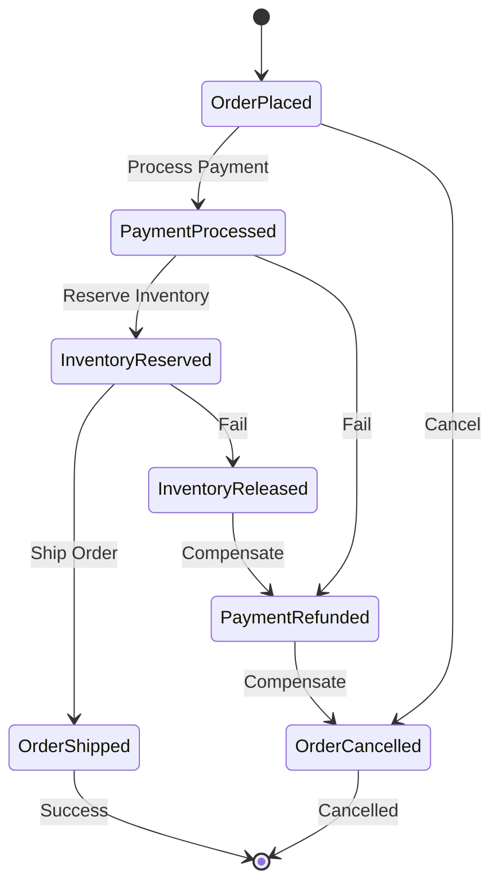

# Saga Orchestration

## Overview

The Saga pattern manages long-running business transactions that span multiple aggregates or services. Whizbang provides comprehensive support for both orchestration and choreography-based sagas, with built-in compensation for handling failures.

### What is a Saga?

A saga is a sequence of local transactions where each transaction updates data within a single service. If a step fails, the saga executes compensating transactions to undo the impact of preceding transactions.

### When to Use Sagas

- **Multi-step workflows**: Order fulfillment, payment processing
- **Cross-service transactions**: Operations spanning multiple bounded contexts
- **Long-running processes**: Approval workflows, batch processing
- **Compensatable operations**: Actions that can be reversed or compensated

## Architecture Diagram



## Implementation Guide

*Documentation in progress - This page demonstrates the structure for saga orchestration patterns with Whizbang.*

### Topics to Cover:

1. **Saga Definition**
   - State machine configuration
   - Step definitions
   - Compensation logic

2. **Orchestration Pattern**
   - Central coordinator
   - State management
   - Step execution

3. **Choreography Pattern**
   - Event-driven coordination
   - Decentralized flow
   - Event subscriptions

4. **Compensation Strategies**
   - Backward recovery
   - Forward recovery
   - Pivot transactions

5. **Error Handling**
   - Timeout management
   - Retry policies
   - Manual intervention

## Example: Order Fulfillment Saga

```csharp{
title: "Order Fulfillment Saga Example"
description: "Placeholder for comprehensive saga implementation example"
framework: "NET8"
category: "Usage Patterns"
difficulty: "ADVANCED"
tags: ["Sagas", "Orchestration", "Workflow"]
nugetPackages: ["Whizbang.Sagas"]
usingStatements: ["Whizbang.Sagas"]
showLineNumbers: true
}
// Placeholder for comprehensive saga implementation example
public class OrderFulfillmentSaga : Saga<OrderFulfillmentState> {
    // Implementation details coming soon
}
```

## Related Patterns

- **[Event Sourcing Basics](event-sourcing-basics.md)** - Event-driven foundation
- **[CQRS Implementation](cqrs-implementation.md)** - Query side for saga state
- **[Distributed Messaging](distributed-messaging.md)** - Cross-service communication

## Next Steps

- Explore **[Microservices Integration](microservices-integration.md)** for deployment patterns
- Review **[Advanced Scenarios](/docs/advanced/advanced-scenarios)** for production tips
- Check **[Command Handling](/docs/commands/command-handling)** for command patterns