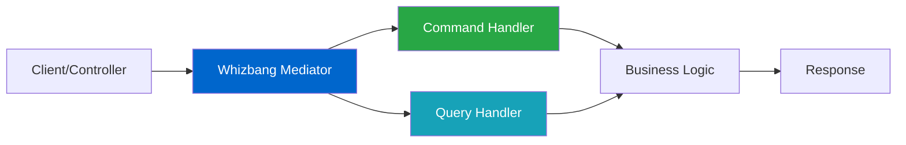

# Simple Mediator Pattern

## Overview

The Simple Mediator pattern is your entry point into the Whizbang library. It provides a clean way to handle commands and queries in your application using the mediator pattern, without the complexity of event sourcing or persistence. This pattern is perfect for:

- Getting started with CQRS concepts
- Building simple applications with clear separation of concerns
- Refactoring existing code to use command/query patterns
- Learning Whizbang's core concepts before adding complexity

### Key Benefits

- **Decoupling**: Handlers are independent of controllers/UI
- **Testability**: Easy to unit test individual handlers
- **Simplicity**: No persistence or event sourcing complexity
- **Flexibility**: Easy to add cross-cutting concerns later

## Architecture Diagram



## Core Components

### Required Packages

```xml
<PackageReference Include="Whizbang.Core" Version="1.0.0" />
```

### Key Interfaces

- `ICommand<TResult>` - Represents an action that changes state
- `IQuery<TResult>` - Represents a request for data
- `ICommandHandler<TCommand, TResult>` - Handles command execution
- `IQueryHandler<TQuery, TResult>` - Handles query execution
- `IMediator` - Routes commands and queries to handlers

## Step-by-Step Implementation

### Step 1: Define Your Commands and Queries

```csharp{
title: "Command and Query Definitions"
description: "Define strongly-typed commands and queries for your operations"
framework: "NET8"
category: "Domain Logic"
difficulty: "BEGINNER"
tags: ["Commands", "Queries", "CQRS"]
nugetPackages: ["Whizbang.Core"]
filename: "OrderCommands.cs"
showLineNumbers: true
usingStatements: ["Whizbang", "System", "System.Collections.Generic"]
}
using Whizbang;
using System;
using System.Collections.Generic;

namespace MyApp.Orders;

// Command: Changes state, returns a result
public record CreateOrderCommand(
    Guid CustomerId,
    List<OrderItem> Items,
    string ShippingAddress
) : ICommand<OrderCreatedResult>;

// Query: Reads data, no side effects
public record GetOrderByIdQuery(
    Guid OrderId
) : IQuery<OrderDetails>;

// Command result
public record OrderCreatedResult(
    Guid OrderId,
    decimal TotalAmount,
    DateTime EstimatedDelivery
);

// Query result
public record OrderDetails(
    Guid OrderId,
    Guid CustomerId,
    List<OrderItem> Items,
    decimal TotalAmount,
    string Status,
    DateTime CreatedAt
);

// Shared domain model
public record OrderItem(
    string ProductId,
    string ProductName,
    int Quantity,
    decimal UnitPrice
);
```

### Step 2: Implement Command Handlers

```csharp{
title: "Command Handler Implementation"
description: "Handle commands with business logic and validation"
framework: "NET8"
category: "Domain Logic"
difficulty: "BEGINNER"
tags: ["Command Handler", "Business Logic", "Validation"]
nugetPackages: ["Whizbang.Core"]
filename: "CreateOrderHandler.cs"
showLineNumbers: true
highlightLines: [15, 20, 28]
usingStatements: ["Whizbang", "System", "System.Threading.Tasks"]
}
using Whizbang;
using System;
using System.Linq;
using System.Threading;
using System.Threading.Tasks;

namespace MyApp.Orders.Handlers;

public class CreateOrderHandler : ICommandHandler<CreateOrderCommand, OrderCreatedResult> {
    private readonly IOrderService _orderService;
    private readonly IInventoryService _inventoryService;
    
    public CreateOrderHandler(
        IOrderService orderService, 
        IInventoryService inventoryService) {
        _orderService = orderService;
        _inventoryService = inventoryService;
    }
    
    public async Task<OrderCreatedResult> Handle(
        CreateOrderCommand command, 
        CancellationToken cancellationToken) {
        
        // Validate command
        if (command.Items == null || !command.Items.Any()) {
            throw new ValidationException("Order must have at least one item");
        }
        
        // Check inventory
        foreach (var item in command.Items) {
            var available = await _inventoryService.CheckAvailability(
                item.ProductId, 
                item.Quantity,
                cancellationToken);
                
            if (!available) {
                throw new InsufficientInventoryException(
                    $"Product {item.ProductName} is out of stock");
            }
        }
        
        // Calculate total
        var totalAmount = command.Items.Sum(i => i.Quantity * i.UnitPrice);
        
        // Create order (in-memory for this example)
        var orderId = Guid.NewGuid();
        var order = new Order {
            Id = orderId,
            CustomerId = command.CustomerId,
            Items = command.Items,
            TotalAmount = totalAmount,
            ShippingAddress = command.ShippingAddress,
            Status = "Pending",
            CreatedAt = DateTime.UtcNow
        };
        
        // Save order
        await _orderService.SaveOrder(order, cancellationToken);
        
        // Reserve inventory
        await _inventoryService.ReserveItems(
            command.Items, 
            orderId,
            cancellationToken);
        
        // Calculate estimated delivery
        var estimatedDelivery = DateTime.UtcNow.AddDays(3);
        
        return new OrderCreatedResult(
            orderId,
            totalAmount,
            estimatedDelivery
        );
    }
}
```

### Step 3: Implement Query Handlers

```csharp{
title: "Query Handler Implementation"
description: "Handle queries to retrieve data without side effects"
framework: "NET8"
category: "Domain Logic"
difficulty: "BEGINNER"
tags: ["Query Handler", "Read Model", "Data Access"]
nugetPackages: ["Whizbang.Core"]
filename: "GetOrderByIdHandler.cs"
showLineNumbers: true
usingStatements: ["Whizbang", "System", "System.Threading.Tasks"]
}
using Whizbang;
using System;
using System.Threading;
using System.Threading.Tasks;

namespace MyApp.Orders.Handlers;

public class GetOrderByIdHandler : IQueryHandler<GetOrderByIdQuery, OrderDetails> {
    private readonly IOrderService _orderService;
    
    public GetOrderByIdHandler(IOrderService orderService) {
        _orderService = orderService;
    }
    
    public async Task<OrderDetails> Handle(
        GetOrderByIdQuery query, 
        CancellationToken cancellationToken) {
        
        // Retrieve order
        var order = await _orderService.GetOrder(query.OrderId, cancellationToken);
        
        if (order == null) {
            throw new NotFoundException($"Order {query.OrderId} not found");
        }
        
        // Map to query result
        return new OrderDetails(
            order.Id,
            order.CustomerId,
            order.Items,
            order.TotalAmount,
            order.Status,
            order.CreatedAt
        );
    }
}
```

### Step 4: Configure Dependency Injection

```csharp{
title: "Service Configuration"
description: "Register mediator and handlers with dependency injection"
framework: "NET8"
category: "Configuration"
difficulty: "BEGINNER"
tags: ["DI", "Configuration", "ASP.NET Core"]
nugetPackages: ["Whizbang.Core", "Microsoft.Extensions.DependencyInjection"]
filename: "Program.cs"
showLineNumbers: true
highlightLines: [8, 11]
usingStatements: ["Whizbang", "Microsoft.Extensions.DependencyInjection"]
}
using Whizbang;
using Microsoft.AspNetCore.Builder;
using Microsoft.Extensions.DependencyInjection;
using MyApp.Orders.Handlers;

var builder = WebApplication.CreateBuilder(args);

// Add Whizbang mediator
builder.Services.AddWhizbang(config => {
    config.RegisterHandlersFromAssembly(typeof(Program).Assembly);
    config.UseSimpleMediator(); // No persistence, just routing
});

// Register your services
builder.Services.AddScoped<IOrderService, OrderService>();
builder.Services.AddScoped<IInventoryService, InventoryService>();

// Add controllers
builder.Services.AddControllers();

var app = builder.Build();

app.UseRouting();
app.MapControllers();

app.Run();
```

## Complete Example

```csharp{
title: "Complete Mediator Pattern Example"
description: "Full working example with API controller using the mediator pattern"
framework: "NET8"
category: "Complete Example"
difficulty: "BEGINNER"
tags: ["API", "Controller", "Mediator", "Complete"]
nugetPackages: ["Whizbang.Core", "Microsoft.AspNetCore.Mvc"]
filename: "OrdersController.cs"
showLineNumbers: true
highlightLines: [15, 24, 36, 48]
testFile: "OrdersControllerTests.cs"
testMethod: "CreateOrder_ValidCommand_ReturnsOrderId"
usingStatements: ["Whizbang", "Microsoft.AspNetCore.Mvc", "System.Threading.Tasks"]
}
using Whizbang;
using Microsoft.AspNetCore.Mvc;
using System;
using System.Threading;
using System.Threading.Tasks;
using MyApp.Orders;

namespace MyApp.Controllers;

[ApiController]
[Route("api/[controller]")]
public class OrdersController : ControllerBase {
    private readonly IMediator _mediator;
    
    public OrdersController(IMediator mediator) {
        _mediator = mediator;
    }
    
    [HttpPost]
    public async Task<ActionResult<OrderCreatedResult>> CreateOrder(
        [FromBody] CreateOrderRequest request,
        CancellationToken cancellationToken) {
        
        // Map request to command
        var command = new CreateOrderCommand(
            request.CustomerId,
            request.Items,
            request.ShippingAddress
        );
        
        try {
            // Send command through mediator
            var result = await _mediator.Send(command, cancellationToken);
            
            return Ok(result);
        }
        catch (ValidationException ex) {
            return BadRequest(new { error = ex.Message });
        }
        catch (InsufficientInventoryException ex) {
            return Conflict(new { error = ex.Message });
        }
    }
    
    [HttpGet("{orderId}")]
    public async Task<ActionResult<OrderDetails>> GetOrder(
        Guid orderId,
        CancellationToken cancellationToken) {
        
        // Create query
        var query = new GetOrderByIdQuery(orderId);
        
        try {
            // Send query through mediator
            var result = await _mediator.Send(query, cancellationToken);
            
            return Ok(result);
        }
        catch (NotFoundException ex) {
            return NotFound(new { error = ex.Message });
        }
    }
}

// Request DTOs
public record CreateOrderRequest(
    Guid CustomerId,
    List<OrderItem> Items,
    string ShippingAddress
);
```

## Testing Strategy

### Unit Testing Handlers

```csharp{
title: "Handler Unit Tests"
description: "Test handlers in isolation with mocked dependencies"
framework: "NET8"
category: "Testing"
difficulty: "BEGINNER"
tags: ["Unit Testing", "xUnit", "Moq"]
nugetPackages: ["Whizbang.Core", "xUnit", "Moq"]
filename: "CreateOrderHandlerTests.cs"
showLineNumbers: true
usingStatements: ["Whizbang", "Xunit", "Moq"]
}
using Whizbang;
using Xunit;
using Moq;
using System;
using System.Collections.Generic;
using System.Threading;
using System.Threading.Tasks;
using MyApp.Orders;
using MyApp.Orders.Handlers;

namespace MyApp.Tests.Orders;

public class CreateOrderHandlerTests {
    private readonly Mock<IOrderService> _orderServiceMock;
    private readonly Mock<IInventoryService> _inventoryServiceMock;
    private readonly CreateOrderHandler _handler;
    
    public CreateOrderHandlerTests() {
        _orderServiceMock = new Mock<IOrderService>();
        _inventoryServiceMock = new Mock<IInventoryService>();
        _handler = new CreateOrderHandler(
            _orderServiceMock.Object,
            _inventoryServiceMock.Object
        );
    }
    
    [Fact]
    public async Task Handle_ValidCommand_CreatesOrder() {
        // Arrange
        var command = new CreateOrderCommand(
            Guid.NewGuid(),
            new List<OrderItem> {
                new OrderItem("PROD-1", "Widget", 2, 10.00m)
            },
            "123 Main St"
        );
        
        _inventoryServiceMock
            .Setup(x => x.CheckAvailability(
                It.IsAny<string>(), 
                It.IsAny<int>(), 
                It.IsAny<CancellationToken>()))
            .ReturnsAsync(true);
        
        // Act
        var result = await _handler.Handle(command, CancellationToken.None);
        
        // Assert
        Assert.NotEqual(Guid.Empty, result.OrderId);
        Assert.Equal(20.00m, result.TotalAmount);
        Assert.True(result.EstimatedDelivery > DateTime.UtcNow);
        
        _orderServiceMock.Verify(
            x => x.SaveOrder(It.IsAny<Order>(), It.IsAny<CancellationToken>()), 
            Times.Once);
    }
    
    [Fact]
    public async Task Handle_EmptyItems_ThrowsValidationException() {
        // Arrange
        var command = new CreateOrderCommand(
            Guid.NewGuid(),
            new List<OrderItem>(),
            "123 Main St"
        );
        
        // Act & Assert
        await Assert.ThrowsAsync<ValidationException>(
            () => _handler.Handle(command, CancellationToken.None)
        );
    }
}
```

## Common Pitfalls

### Avoid Direct Handler Calls

```csharp
// ❌ BAD - Don't inject and call handlers directly
public class OrderService {
    private readonly CreateOrderHandler _handler;
    
    public OrderService(CreateOrderHandler handler) {
        _handler = handler;
    }
}

// ✅ GOOD - Always use the mediator
public class OrderService {
    private readonly IMediator _mediator;
    
    public OrderService(IMediator mediator) {
        _mediator = mediator;
    }
}
```

### Don't Mix Commands and Queries

```csharp
// ❌ BAD - Command returning data it modified
public record CreateOrderCommand(...) : ICommand<Order>;

// ✅ GOOD - Command returns minimal result, use query for full data
public record CreateOrderCommand(...) : ICommand<OrderCreatedResult>;
public record GetOrderByIdQuery(Guid OrderId) : IQuery<Order>;
```

### Avoid Business Logic in Controllers

```csharp
// ❌ BAD - Business logic in controller
[HttpPost]
public async Task<IActionResult> CreateOrder(CreateOrderRequest request) {
    if (request.Items.Sum(i => i.Quantity * i.UnitPrice) > 1000) {
        // Business logic doesn't belong here!
        request.RequiresApproval = true;
    }
}

// ✅ GOOD - All logic in handler
[HttpPost]
public async Task<IActionResult> CreateOrder(CreateOrderRequest request) {
    var command = MapToCommand(request);
    var result = await _mediator.Send(command);
    return Ok(result);
}
```

## Progressive Enhancement

### Start Simple
1. Begin with basic command/query handlers
2. Add validation as needed
3. Implement error handling patterns

### Add Cross-Cutting Concerns
```csharp
// Add logging behavior
config.AddBehavior<LoggingBehavior>();

// Add validation behavior  
config.AddBehavior<ValidationBehavior>();

// Add caching for queries
config.AddBehavior<CachingBehavior>();
```

### Evolve to Event Sourcing
When ready for event sourcing:
1. Change `ICommand` to `IEventSourcedCommand`
2. Add event definitions
3. Implement aggregates
4. Switch to `UseEventSourcing()` configuration

## Related Patterns

- **[Event Sourcing Basics](event-sourcing-basics.md)** - Add persistence and event history
- **[CQRS Implementation](cqrs-implementation.md)** - Separate read and write models
- **[Distributed Messaging](distributed-messaging.md)** - Scale across services

## Production Considerations

### Performance
- Handlers are resolved per request (scoped lifetime)
- Consider async/await for I/O operations
- Profile handler execution time

### Monitoring
```csharp
// Add telemetry
config.AddBehavior<TelemetryBehavior>();

// Track metrics
config.OnCommandExecuted(async (command, result, duration) => {
    await metrics.RecordCommandExecution(command.GetType().Name, duration);
});
```

### Error Handling
- Use specific exception types
- Log errors with correlation IDs
- Return appropriate HTTP status codes

## Next Steps

- Explore **[Event Sourcing Basics](event-sourcing-basics.md)** to add persistence
- Learn about **[CQRS Implementation](cqrs-implementation.md)** for read/write separation
- Review the **[Getting Started Guide](/docs/getting-started/getting-started)** for more examples
- Check out **[Command Handling](/docs/commands/command-handling)** for advanced patterns