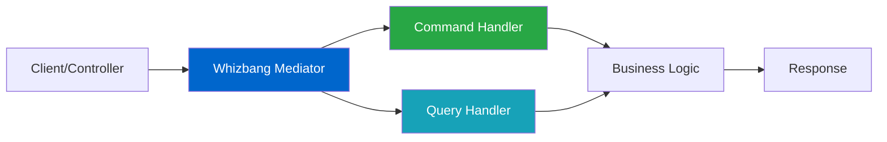

# Simple Mediator Pattern

## Overview

The Simple Mediator pattern is your entry point into the Whizbang library. It provides a clean way to handle commands and queries in your application using the mediator pattern, without the complexity of event sourcing or persistence. This pattern is perfect for:

- Getting started with CQRS concepts
- Building simple applications with clear separation of concerns
- Refactoring existing code to use command/query patterns
- Learning Whizbang's core concepts before adding complexity

### Key Benefits

- **Progressive Enhancement**: Same code works from monolith to microservices
- **Convention Over Configuration**: Return types determine behavior
- **Aspect-Oriented**: Cross-cutting concerns via declarative attributes
- **Compile-Time Safety**: Source generators catch errors at build time
- **Zero Overhead**: Generated code performs like hand-written code

## Architecture Diagram



## Core Components

### Required Packages

```xml
<PackageReference Include="Whizbang.Core" Version="1.0.0" />
```

### The Unified Approach

Whizbang uses a single, simple pattern for all handlers:

- **One Interface**: `IHandle<T>` for all message types
- **Return Type Semantics**: What you return determines what happens
- **Aspect Attributes**: Declarative cross-cutting concerns
- **No Ceremony**: No base classes, no complex registration

## Step-by-Step Implementation

### Step 1: Define Your Messages

```csharp{
title: "Message Definitions"
description: "Simple message types - no special interfaces required"
framework: "NET8"
category: "Domain Logic"
difficulty: "BEGINNER"
tags: ["Messages", "Commands", "Queries"]
nugetPackages: ["Whizbang.Core"]
filename: "OrderMessages.cs"
showLineNumbers: true
usingStatements: ["System", "System.Collections.Generic"]
}
using System;
using System.Collections.Generic;

namespace MyApp.Orders;

// Command: A message that changes state
public record CreateOrder(
    Guid CustomerId,
    List<OrderItem> Items,
    string ShippingAddress
);

// Query: A message that reads data
public record GetOrderById(Guid OrderId);

// Event: Something that happened
public record OrderCreated(
    Guid OrderId,
    Guid CustomerId,
    decimal TotalAmount,
    DateTime CreatedAt
);

// Response types
public record OrderDetails(
    Guid OrderId,
    Guid CustomerId,
    List<OrderItem> Items,
    decimal TotalAmount,
    string Status,
    DateTime CreatedAt
);

// Domain model
public record OrderItem(
    string ProductId,
    string ProductName,
    int Quantity,
    decimal UnitPrice
);
```

### Step 2: Implement Handlers with Return Type Semantics

```csharp{
title: "Handler Implementation - Unified Approach"
description: "Simple handlers with return type semantics and aspects"
framework: "NET8"
category: "Domain Logic"
difficulty: "BEGINNER"
tags: ["Handlers", "Return Types", "Aspects"]
nugetPackages: ["Whizbang.Core"]
filename: "OrderHandlers.cs"
showLineNumbers: true
highlightLines: [8, 13, 29, 45]
usingStatements: ["Whizbang", "System", "System.Linq"]
}
using Whizbang;
using System;
using System.Linq;

namespace MyApp.Orders.Handlers;

// Command handler with aspects
[Logged]
[Validated]
[Transactional]
public class CreateOrderHandler : IHandle<CreateOrder> {
    private readonly IOrderRepository _repository;
    
    // Return type determines behavior: OrderCreated event will be published
    public OrderCreated Handle(CreateOrder cmd, IOrderRepository repository) {
        // Calculate total
        var totalAmount = cmd.Items.Sum(i => i.Quantity * i.UnitPrice);
        
        // Create order
        var order = new Order {
            Id = Guid.NewGuid(),
            CustomerId = cmd.CustomerId,
            Items = cmd.Items,
            TotalAmount = totalAmount,
            ShippingAddress = cmd.ShippingAddress,
            Status = "Pending",
            CreatedAt = DateTime.UtcNow
        };
        
        // Save order
        repository.Save(order);
        
        // Return event - Whizbang publishes it automatically
        return new OrderCreated(
            order.Id,
            order.CustomerId,
            order.TotalAmount,
            order.CreatedAt
        );
    }
}

// Query handler with caching aspect
[Cached(Duration = "5m")]
public class GetOrderByIdHandler : IHandle<GetOrderById> {
    // Return type is inferred from query
    public OrderDetails Handle(GetOrderById query, IOrderRepository repository) {
        var order = repository.GetById(query.OrderId);
        
        if (order == null) {
            throw new NotFoundException($"Order {query.OrderId} not found");
        }
        
        // Map to response
        return new OrderDetails(
            order.Id,
            order.CustomerId,
            order.Items,
            order.TotalAmount,
            order.Status,
            order.CreatedAt
        );
    }
}

// Handler returning multiple effects via tuple
public class ProcessOrderHandler : IHandle<ProcessOrder> {
    // Tuple return = multiple cascading messages
    public (OrderProcessed, SendEmail, UpdateInventory) Handle(ProcessOrder cmd) {
        // Process order logic...
        
        return (
            new OrderProcessed(cmd.OrderId),
            new SendEmail(cmd.CustomerEmail, "Order confirmed"),
            new UpdateInventory(cmd.Items)
        );
    }
}
```

### Step 3: Wire Up Your Application

```csharp{
title: "Service Configuration"
description: "Progressive enhancement - start simple, scale when needed"
framework: "NET8"
category: "Configuration"
difficulty: "BEGINNER"
tags: ["DI", "Configuration", "Progressive Enhancement"]
nugetPackages: ["Whizbang.Core", "Microsoft.Extensions.DependencyInjection"]
filename: "Program.cs"
showLineNumbers: true
highlightLines: [8, 11, 20, 28]
usingStatements: ["Whizbang", "Microsoft.Extensions.DependencyInjection"]
}
using Whizbang;
using Microsoft.AspNetCore.Builder;
using Microsoft.Extensions.DependencyInjection;
using MyApp.Orders.Handlers;

var builder = WebApplication.CreateBuilder(args);

// Start simple - In-process mode (like MediatR)
builder.Services.AddWhizbang()
    .RegisterHandlersFromAssembly(typeof(Program).Assembly)
    .UseInProcessMode();  // No infrastructure needed

// Register your services
builder.Services.AddScoped<IOrderRepository, OrderRepository>();
builder.Services.AddScoped<IInventoryService, InventoryService>();

// When ready for durability (like Wolverine)
// builder.Services.AddWhizbang()
//     .UseDurableMode()
//     .UsePostgreSQL(connectionString);

// When scaling to microservices (like MassTransit)
// builder.Services.AddWhizbang()
//     .UseDistributedMode()
//     .UseKafka(kafkaConfig);

// When you need event sourcing (unique to Whizbang)
// builder.Services.AddWhizbang()
//     .UseEventSourcedMode()
//     .UseEventStore(eventStoreConfig);

builder.Services.AddControllers();

var app = builder.Build();

app.UseRouting();
app.MapControllers();

app.Run();
```

## Complete Example

```csharp{
title: "Complete Mediator Pattern Example"
description: "Full working example with API controller using the unified approach"
framework: "NET8"
category: "Complete Example"
difficulty: "BEGINNER"
tags: ["API", "Controller", "Mediator", "Complete"]
nugetPackages: ["Whizbang.Core", "Microsoft.AspNetCore.Mvc"]
filename: "OrdersController.cs"
showLineNumbers: true
highlightLines: [14, 23, 33]
testFile: "OrdersControllerTests.cs"
testMethod: "CreateOrder_ValidCommand_ReturnsOrderId"
usingStatements: ["Whizbang", "Microsoft.AspNetCore.Mvc", "System"]
}
using Whizbang;
using Microsoft.AspNetCore.Mvc;
using System;
using MyApp.Orders;

namespace MyApp.Controllers;

[ApiController]
[Route("api/[controller]")]
public class OrdersController : ControllerBase {
    private readonly IWhizbang _whizbang;
    
    public OrdersController(IWhizbang whizbang) {
        _whizbang = whizbang;
    }
    
    [HttpPost]
    public async Task<ActionResult<OrderCreated>> CreateOrder(
        [FromBody] CreateOrderRequest request) {
        
        // Map request to command
        var command = new CreateOrder(
            request.CustomerId,
            request.Items,
            request.ShippingAddress
        );
        
        try {
            // Send command - return type determines behavior
            var result = await _whizbang.Send(command);
            return Ok(result);
        }
        catch (ValidationException ex) {
            return BadRequest(new { error = ex.Message });
        }
        catch (InsufficientInventoryException ex) {
            return Conflict(new { error = ex.Message });
        }
    }
    
    [HttpGet("{orderId}")]
    public async Task<ActionResult<OrderDetails>> GetOrder(Guid orderId) {
        // Create query
        var query = new GetOrderById(orderId);
        
        try {
            // Send query through whizbang
            var result = await _whizbang.Send(query);
            return Ok(result);
        }
        catch (NotFoundException ex) {
            return NotFound(new { error = ex.Message });
        }
    }
    
    [HttpPost("{orderId}/process")]
    public async Task<ActionResult> ProcessOrder(Guid orderId) {
        // Handler returns tuple - all messages are processed
        var (orderProcessed, emailSent, inventoryUpdated) = 
            await _whizbang.Send(new ProcessOrder(orderId));
        
        return Ok(new {
            orderId = orderProcessed.OrderId,
            emailSent = emailSent.Sent,
            inventoryUpdated = inventoryUpdated.UpdatedCount
        });
    }
}

// Request DTOs
public record CreateOrderRequest(
    Guid CustomerId,
    List<OrderItem> Items,
    string ShippingAddress
);
```

## Testing Strategy

### Unit Testing Handlers

```csharp{
title: "Handler Unit Tests"
description: "Test handlers with aspects in isolation"
framework: "NET8"
category: "Testing"
difficulty: "BEGINNER"
tags: ["Unit Testing", "xUnit", "Aspects"]
nugetPackages: ["Whizbang.Core", "xUnit"]
filename: "CreateOrderHandlerTests.cs"
showLineNumbers: true
highlightLines: [15, 25, 40]
usingStatements: ["Whizbang", "Xunit"]
}
using Whizbang;
using Xunit;
using System;
using System.Collections.Generic;
using MyApp.Orders;
using MyApp.Orders.Handlers;

namespace MyApp.Tests.Orders;

public class CreateOrderHandlerTests {
    [Fact]
    public void Handle_ValidCommand_ReturnsOrderCreatedEvent() {
        // Arrange
        var handler = new CreateOrderHandler();
        var command = new CreateOrder(
            Guid.NewGuid(),
            new List<OrderItem> {
                new OrderItem("PROD-1", "Widget", 2, 10.00m)
            },
            "123 Main St"
        );
        
        var repository = new FakeOrderRepository();
        
        // Act - Handler with dependency injection
        var result = handler.Handle(command, repository);
        
        // Assert - Return type determines behavior
        Assert.NotNull(result);
        Assert.IsType<OrderCreated>(result);
        Assert.Equal(20.00m, result.TotalAmount);
        Assert.True(repository.WasCalled);
    }
    
    [Fact]
    public void Handle_MultipleEffects_ReturnsTuple() {
        // Arrange
        var handler = new ProcessOrderHandler();
        var command = new ProcessOrder(Guid.NewGuid());
        
        // Act - Handler returns tuple
        var (processed, email, inventory) = handler.Handle(command);
        
        // Assert - All effects returned
        Assert.NotNull(processed);
        Assert.NotNull(email);
        Assert.NotNull(inventory);
        Assert.Equal(command.OrderId, processed.OrderId);
    }
}

// Test with aspects
public class AspectTests {
    [Fact]
    public async Task Handler_WithCacheAspect_CachesResult() {
        // Arrange
        var test = await Whizbang.Test<GetOrderByIdHandler>()
            .WithAspects() // Include production aspects
            .Given(new GetOrderById(Guid.NewGuid()))
            .WhenHandled();
        
        // First call
        var result1 = test.Result;
        
        // Second call - should be cached
        var result2 = await test.HandleAgain();
        
        // Assert
        test.Aspect<CacheAspect>()
            .ShouldHaveHit("order:*")
            .WithinDuration("5m");
        
        Assert.Same(result1, result2); // Same instance from cache
    }
    
    [Fact]
    public async Task Handler_WithLoggingAspect_LogsExecution() {
        // Test logging aspect
        await Whizbang.Test<CreateOrderHandler>()
            .Given(new CreateOrder { ... })
            .WithAspects()
            .WhenHandled()
            .ThenAspect<LoggingAspect>(logs => {
                logs.ShouldContain("Executing CreateOrderHandler");
                logs.ShouldContain("Completed in");
            });
    }
}
```

## Common Pitfalls

### Avoid Direct Handler Calls

```csharp
// ❌ BAD - Don't inject and call handlers directly
public class OrderService {
    private readonly CreateOrderHandler _handler;
    
    public OrderService(CreateOrderHandler handler) {
        _handler = handler;
    }
}

// ✅ GOOD - Always use Whizbang for routing
public class OrderService {
    private readonly IWhizbang _whizbang;
    
    public OrderService(IWhizbang whizbang) {
        _whizbang = whizbang;
    }
}
```

### Use Return Types to Express Intent

```csharp
// ❌ BAD - Unclear what happens with the result
public object Handle(CreateOrder cmd) {
    return new { OrderId = Guid.NewGuid() };
}

// ✅ GOOD - Return type makes intent clear
public OrderCreated Handle(CreateOrder cmd) {
    return new OrderCreated(Guid.NewGuid());
}

// ✅ GOOD - Multiple effects via tuple
public (OrderCreated, SendEmail) Handle(CreateOrder cmd) {
    return (new OrderCreated(), new SendEmail());
}
```

### Avoid Business Logic in Controllers

```csharp
// ❌ BAD - Business logic in controller
[HttpPost]
public async Task<IActionResult> CreateOrder(CreateOrderRequest request) {
    if (request.Items.Sum(i => i.Quantity * i.UnitPrice) > 1000) {
        // Business logic doesn't belong here!
        request.RequiresApproval = true;
    }
}

// ✅ GOOD - All logic in handler
[HttpPost]
public async Task<IActionResult> CreateOrder(CreateOrderRequest request) {
    var command = MapToCommand(request);
    var result = await _whizbang.Send(command);
    return Ok(result);
}
```

## Progressive Enhancement

### Start Simple
```csharp
// Phase 1: Simple in-process (like MediatR)
builder.Services.AddWhizbang()
    .UseInProcessMode();
```

### Add Durability When Needed
```csharp
// Phase 2: Add persistence and retry (like Wolverine)
builder.Services.AddWhizbang()
    .UseDurableMode()
    .UsePostgreSQL(connectionString)
    .WithOutbox();
```

### Scale to Distributed
```csharp
// Phase 3: Microservices (like MassTransit)
builder.Services.AddWhizbang()
    .UseDistributedMode()
    .UseKafka(kafkaConfig)
    .WithSagaOrchestration();
```

### Enable Event Sourcing
```csharp
// Phase 4: Full event sourcing (unique to Whizbang)
builder.Services.AddWhizbang()
    .UseEventSourcedMode()
    .UseEventStore(eventStoreConfig)
    .WithProjections()
    .WithSnapshots();
```

**The same handler code works in ALL modes!**

## Related Patterns

- **[Event Sourcing Basics](event-sourcing-basics.md)** - Add persistence and event history
- **[CQRS Implementation](cqrs-implementation.md)** - Separate read and write models
- **[Distributed Messaging](distributed-messaging.md)** - Scale across services

## Production Considerations

### Performance
- Zero-overhead aspects via source generation
- Handler pooling for reduced allocations
- Compile-time optimizations
- Adaptive runtime optimization

### Monitoring with Aspects
```csharp
// Built-in observability via aspects
[Observed] // Automatic telemetry
[Timed]    // Performance metrics
[Logged]   // Structured logging
public class OrderHandler : IHandle<CreateOrder> {
    public OrderCreated Handle(CreateOrder cmd) {
        // Automatically generates:
        // - Distributed trace spans
        // - Metrics (count, duration, errors)
        // - Structured logs with correlation IDs
        return new OrderCreated(cmd.OrderId);
    }
}
```

### Error Handling with Result Types
```csharp
public Result<OrderCreated> Handle(CreateOrder cmd) {
    if (!IsValid(cmd)) {
        return Result.Failure<OrderCreated>("Validation failed");
    }
    
    try {
        var order = CreateOrder(cmd);
        return Result.Success(new OrderCreated(order.Id));
    }
    catch (Exception ex) {
        return Result.Failure<OrderCreated>(ex.Message);
    }
}
```

## Next Steps

- Explore **[Progressive Enhancement](progressive-enhancement.md)** to scale your application
- Learn about **[Aspect-Oriented Handlers](aspect-oriented-handlers.md)** for cross-cutting concerns
- Review **[Return Type Semantics](/docs/core-concepts/return-type-semantics)** for advanced patterns
- Check out **[Event Sourcing Basics](event-sourcing-basics.md)** when ready for event sourcing
- See **[CQRS Implementation](cqrs-implementation.md)** for read/write separation