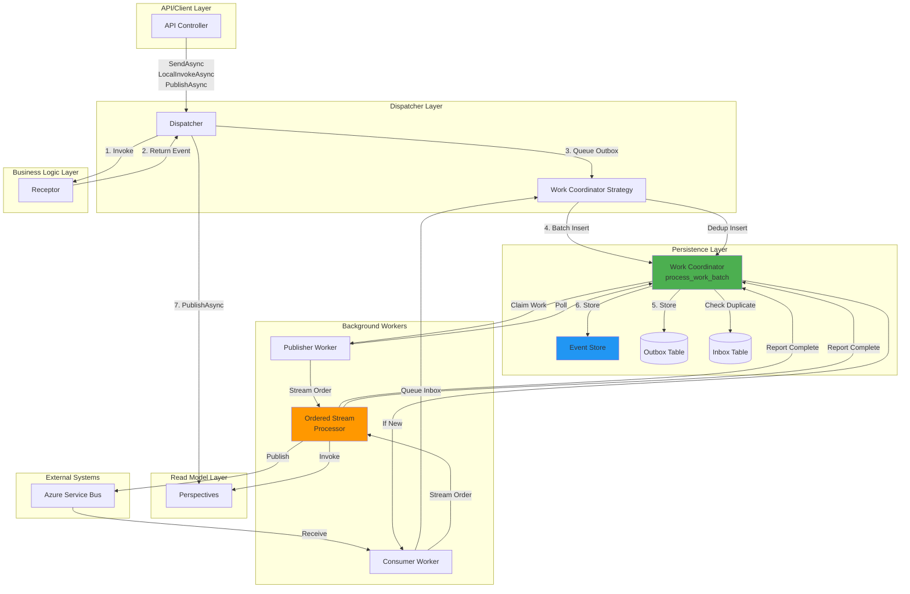
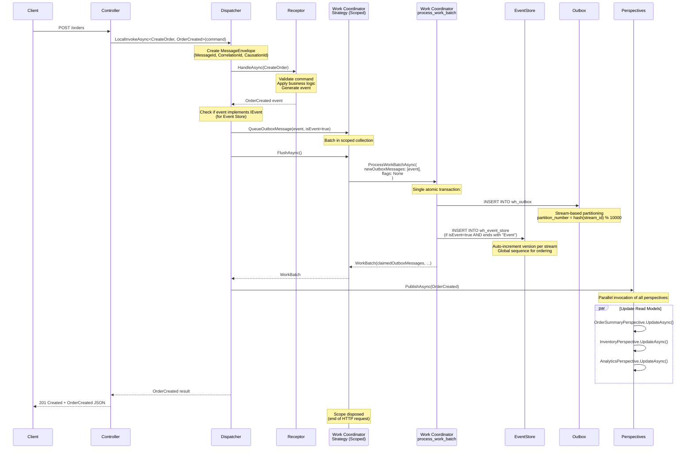
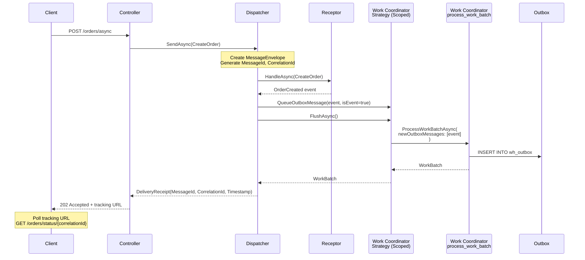
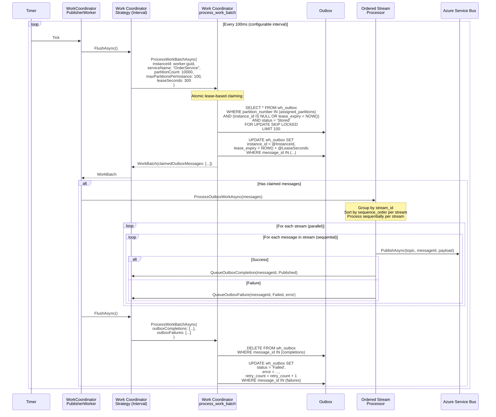
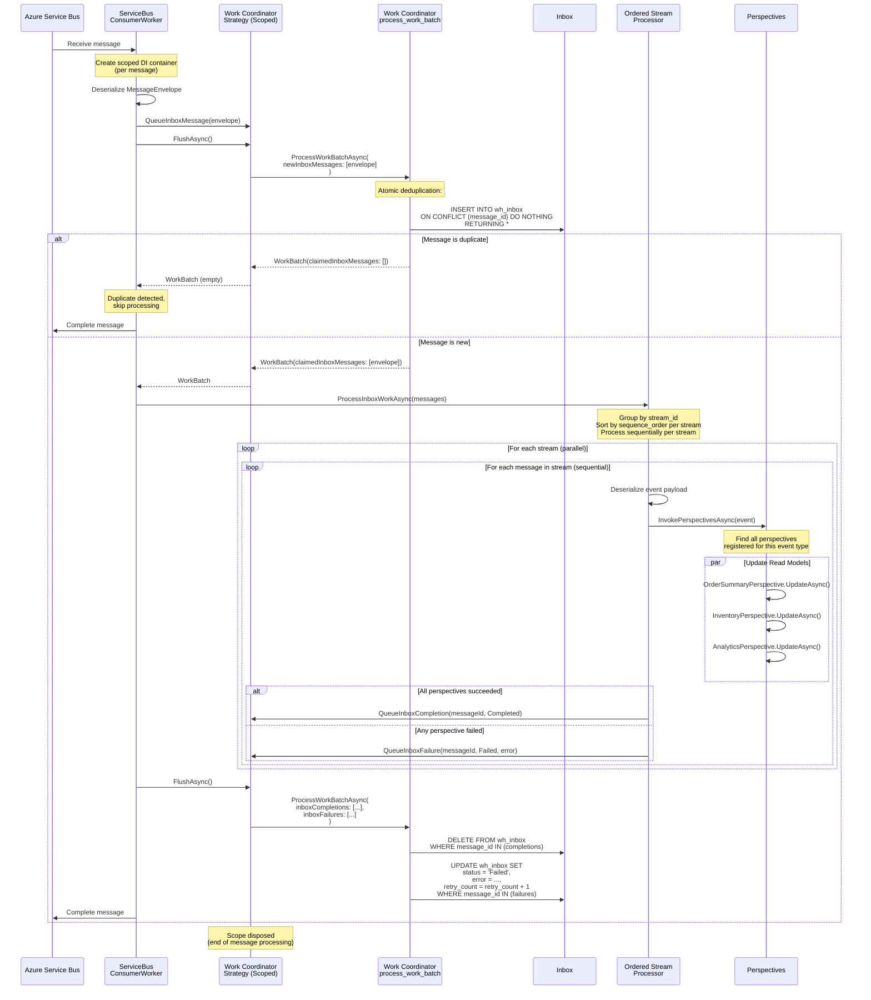
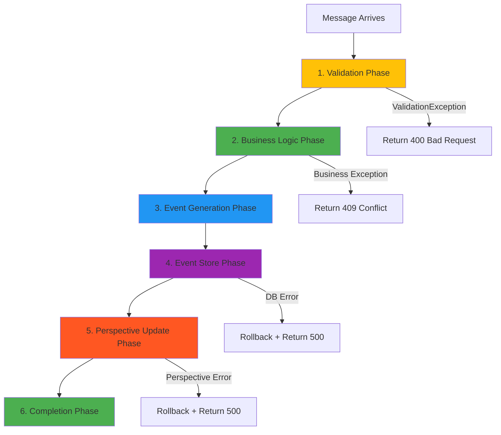

# Message Lifecycle & Architecture

This document provides a complete view of how messages flow through Whizbang from initial dispatch through outbox publishing, including all the integration points with Receptors, Perspectives, Event Store, and the Work Coordinator.

---

## Architecture Overview



---

## Command Flow (Synchronous)

### Pattern: LocalInvokeAsync

**Use Case**: API endpoint needs immediate typed response



**Key Points**:
1. **Synchronous semantics**: Controller waits for result
2. **Atomic Event Store + Outbox**: Both persisted in single transaction
3. **Stream-based partitioning**: Ensures same stream_id always maps to same partition
4. **Perspective update**: Happens before response (read-your-writes consistency)
5. **Scoped strategy**: Batches operations per HTTP request, flushes on disposal

---

## Command Flow (Asynchronous)

### Pattern: SendAsync

**Use Case**: Long-running operation, return receipt for tracking



**Key Points**:
1. **Asynchronous semantics**: Receipt doesn't mean processing complete
2. **Tracking via CorrelationId**: Client polls status endpoint
3. **Outbox guarantees delivery**: Event will be published eventually
4. **No perspective update**: Happens asynchronously via background workers

---

## Event Flow (Publishing from Outbox)

### Background Worker: WorkCoordinatorPublisherWorker



**Key Points**:
1. **Interval strategy**: Polls every 100ms (configurable)
2. **Partition-based distribution**: Each worker claims subset of partitions (max 100)
3. **Lease-based coordination**: Prevents duplicate processing across workers
4. **Stream ordering via OrderedStreamProcessor**: Events from same stream processed sequentially
5. **Parallel streams**: Different streams can process concurrently
6. **Atomic completion reporting**: Deletes completed, updates failed

---

## Event Flow (Consuming from Inbox)

### Background Worker: ServiceBusConsumerWorker



**Key Points**:
1. **Scoped strategy**: One scope per message
2. **Atomic deduplication**: INSERT ... ON CONFLICT ensures exactly-once semantics
3. **Stream ordering**: OrderedStreamProcessor ensures events from same stream process sequentially
4. **Perspective invocation**: All registered perspectives updated in parallel
5. **Completion reporting**: Atomic delete (success) or update (failure)
6. **Service Bus completion**: Only after database commit

---

## Receptor Lifecycle Hooks

Receptors have several integration points throughout the message lifecycle:



### Phase 1: Validation

```csharp
public async ValueTask<OrderCreated> HandleAsync(
    CreateOrder message,
    CancellationToken ct = default) {

    // HOOK 1: Input Validation
    if (message.Items.Length == 0) {
        throw new ValidationException("Order must contain at least one item");
    }

    if (message.Items.Any(i => i.Quantity <= 0)) {
        throw new ValidationException("All items must have quantity > 0");
    }

    // ... continue to business logic
}
```

**Hook**: Validate inputs **before** any database operations
**Result**: If validation fails, throw `ValidationException` → 400 Bad Request
**Guarantees**: No side effects (no database writes)

### Phase 2: Business Logic

```csharp
public async ValueTask<OrderCreated> HandleAsync(
    CreateOrder message,
    CancellationToken ct = default) {

    // Validation phase (above)
    // ...

    // HOOK 2: Business Logic
    await using var conn = _db.CreateConnection();

    // Check customer exists
    var customer = await conn.QuerySingleOrDefaultAsync<Customer>(
        "SELECT * FROM customers WHERE customer_id = @CustomerId",
        new { message.CustomerId },
        ct
    );

    if (customer is null) {
        throw new NotFoundException($"Customer {message.CustomerId} not found");
    }

    // Check inventory
    var hasStock = await _inventory.CheckStockAsync(message.Items, ct);
    if (!hasStock) {
        throw new InvalidOperationException("Insufficient inventory");
    }

    // ... continue to event generation
}
```

**Hook**: Execute business logic, load state, check invariants
**Result**: If business rules fail, throw appropriate exception
**Guarantees**: No state changes yet (read-only operations)

### Phase 3: Event Generation

```csharp
public async ValueTask<OrderCreated> HandleAsync(
    CreateOrder message,
    CancellationToken ct = default) {

    // Validation and business logic phases (above)
    // ...

    // HOOK 3: Event Generation
    var orderId = Guid.CreateVersion7();  // Time-ordered GUID
    var total = message.Items.Sum(i => i.Quantity * i.UnitPrice);

    var @event = new OrderCreated(
        OrderId: orderId,
        CustomerId: message.CustomerId,
        Items: message.Items,
        Total: total,
        CreatedAt: DateTimeOffset.UtcNow
    );

    return @event;
}
```

**Hook**: Generate event representing **fact of what happened**
**Result**: Return strongly-typed event
**Guarantees**: Event is immutable (record type), contains all relevant data

### Phase 4: Event Store (Automatic)

This phase is **automatic** - no receptor code needed:

```csharp
// Inside Dispatcher.SendAsync():
await _workCoordinatorStrategy.QueueOutboxMessage(
    new NewOutboxMessage {
        MessageId = envelope.MessageId.Value,
        StreamId = ExtractStreamId(envelope),  // From aggregate ID
        IsEvent = payload is IEvent,  // ← Automatic detection
        // ...
    }
);
```

**Hook**: Dispatcher checks if `payload is IEvent`
**Result**: If true, `process_work_batch` automatically inserts to `wb_event_store`
**Guarantees**: Event Store + Outbox insert in **same atomic transaction**

### Phase 5: Perspective Update

**Automatic via `PublishAsync()`**:

```csharp
// Inside Dispatcher after receptor returns
if (result is not null) {
    await PublishAsync(result, cancellationToken);
}
```

**Hook**: Dispatcher finds all `IPerspectiveOf<TEvent>` registrations
**Result**: All perspectives invoked in parallel
**Guarantees**: Read models updated before HTTP response

### Phase 6: Completion

**Automatic scope disposal**:

```csharp
// Inside HTTP request handler
await using var scope = _scopeFactory.CreateAsyncScope();
var dispatcher = scope.ServiceProvider.GetRequiredService<IDispatcher>();

var result = await dispatcher.LocalInvokeAsync<CreateOrder, OrderCreated>(command);

// Scope disposal triggers:
// 1. WorkCoordinatorStrategy.FlushAsync()
// 2. process_work_batch (commit transaction)
// 3. DbContext.SaveChangesAsync() (if using EF Core)
```

**Hook**: Scope disposal at end of request
**Result**: All queued work flushed to database
**Guarantees**: Atomic commit of all operations

---

## Strategy Pattern: Three Execution Models

### 1. Immediate Strategy (Lowest Latency)

```csharp
public class ImmediateWorkCoordinatorStrategy : IWorkCoordinatorStrategy {
    public async Task QueueOutboxMessage(NewOutboxMessage message) {
        _pendingOutbox.Add(message);

        // Flush immediately (no batching)
        await FlushAsync();
    }
}
```

**Use Case**: Real-time critical operations
**Latency**: ~10ms (1 DB call per message)
**DB Load**: High (1 call per message)

### 2. Scoped Strategy (Per-Request Batching)

```csharp
public class ScopedWorkCoordinatorStrategy : IWorkCoordinatorStrategy, IAsyncDisposable {
    public async Task QueueOutboxMessage(NewOutboxMessage message) {
        _pendingOutbox.Add(message);
        // Don't flush yet - batch until scope disposal
    }

    public async ValueTask DisposeAsync() {
        // Flush on scope disposal (end of HTTP request)
        await FlushAsync();
    }
}
```

**Use Case**: Web APIs, per-request batching
**Latency**: ~50ms (1 DB call per request)
**DB Load**: Medium (1 call per HTTP request)

### 3. Interval Strategy (Highest Throughput)

```csharp
public class IntervalWorkCoordinatorStrategy : IWorkCoordinatorStrategy {
    public async Task QueueOutboxMessage(NewOutboxMessage message) {
        _pendingOutbox.Add(message);
        // Don't flush - timer will flush every 100ms
    }

    private async Task TimerCallback() {
        while (!_cts.IsCancellationRequested) {
            await Task.Delay(_options.IntervalMilliseconds, _cts.Token);
            await FlushAsync();  // Batch flush
        }
    }
}
```

**Use Case**: Background workers, high throughput
**Latency**: ~100ms (1 DB call per interval)
**DB Load**: Low (1 call per 100ms, regardless of message count)

---

## Work Coordinator: Atomic Operations

All operations in `process_work_batch` are **atomic** (single transaction):

```sql
CREATE OR REPLACE FUNCTION process_work_batch(...)
RETURNS TABLE (...) AS $$
BEGIN
    -- 1. Delete completed outbox messages
    DELETE FROM wh_outbox
    WHERE message_id IN (SELECT message_id FROM jsonb_array_elements(p_outbox_completions));

    -- 2. Update failed outbox messages
    UPDATE wh_outbox SET
        status = 'Failed',
        error = ...,
        retry_count = retry_count + 1
    WHERE message_id IN (...);

    -- 3. Insert new outbox messages (with partition assignment)
    INSERT INTO wh_outbox (message_id, stream_id, partition_number, ...)
    SELECT
        (elem->>'message_id')::UUID,
        (elem->>'stream_id')::UUID,
        abs(hashtext((elem->>'stream_id')::TEXT)) % p_partition_count,  -- Partition
        ...
    FROM jsonb_array_elements(p_new_outbox_messages) AS elem;

    -- 4. Insert to event store (if IsEvent = true)
    INSERT INTO wb_event_store (event_id, stream_id, aggregate_type, version, ...)
    SELECT
        (elem->>'message_id')::UUID,
        (elem->>'stream_id')::UUID,
        ExtractAggregateType((elem->>'message_type')::TEXT),  -- "Order" from "OrderCreated"
        COALESCE(
            (SELECT MAX(version) + 1 FROM wb_event_store WHERE stream_id = (elem->>'stream_id')::UUID),
            1
        ),
        ...
    FROM jsonb_array_elements(p_new_outbox_messages) AS elem
    WHERE (elem->>'is_event')::BOOLEAN = TRUE
      AND (elem->>'message_type')::TEXT LIKE '%Event';  -- Convention-based

    -- 5-8. Similar atomic operations for inbox
    -- ...

    -- 9. Claim new outbox work (lease-based)
    UPDATE wh_outbox
    SET
        instance_id = p_instance_id,
        lease_expiry = NOW() + (p_lease_seconds || ' seconds')::INTERVAL
    WHERE message_id IN (
        SELECT message_id FROM wh_outbox
        WHERE partition_number IN (SELECT * FROM assigned_partitions)
          AND (instance_id IS NULL OR lease_expiry < NOW())
          AND status = 'Stored'
        ORDER BY sequence_order
        LIMIT 100
        FOR UPDATE SKIP LOCKED  -- Non-blocking claim
    )
    RETURNING *;

    -- COMMIT (all operations succeed or fail together)
END;
$$ LANGUAGE plpgsql;
```

**Guarantees**:
1. ✅ **Atomicity**: All operations succeed together or fail together
2. ✅ **No race conditions**: Lease-based claiming prevents duplicate work
3. ✅ **Stream ordering**: Partition assignment ensures same stream → same worker
4. ✅ **Event Store consistency**: Event version conflicts detected automatically
5. ✅ **Deduplication**: INSERT ... ON CONFLICT prevents duplicate inbox processing

---

## Further Reading

**Core Concepts**:
- [Dispatcher Deep Dive](../core-concepts/dispatcher.md) - Three dispatch patterns
- [Receptors Guide](../core-concepts/receptors.md) - Message handlers and business logic
- [Perspectives Guide](../core-concepts/perspectives.md) - Event listeners for read models

**Messaging Patterns**:
- [Work Coordinator](../messaging/work-coordinator.md) - Atomic batch processing
- [Outbox Pattern](../messaging/outbox-pattern.md) - Reliable event publishing
- [Inbox Pattern](../messaging/inbox-pattern.md) - Exactly-once processing

**Components**:
- [Ordered Stream Processor](../components/ordered-stream-processor.md) - Stream-based ordering guarantees

**Examples**:
- [ECommerce: Order Service](../examples/ecommerce/order-service.md) - Real-world implementation

---

*Version 0.1.0 - Foundation Release | Last Updated: 2024-12-21*
