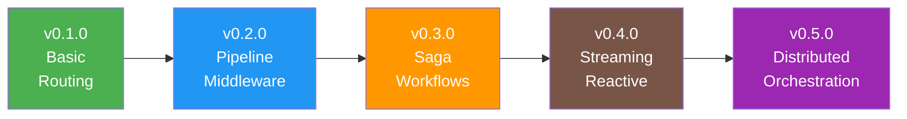

# Dispatcher Component


## Version History

:::new
**New in v0.1.0**: Basic message dispatcher with handler discovery and in-process routing
:::

:::planned
**Coming in v0.2.0**: 
- Pipeline middleware support
- Handler prioritization
- Parallel execution

[See pipeline features →](../../v0.2.0/enhancements/dispatcher.md)
:::

:::planned
**Coming in v0.3.0**: 
- Saga orchestration
- Workflow support
- Compensation patterns

[See orchestration features →](../../v0.3.0/features/dispatcher.md)
:::

## Evolution Timeline



## Overview

The Dispatcher is the heart of Whizbang - it routes messages to handlers, orchestrates component interactions, and ensures proper execution flow. In v0.1.0, it provides basic handler discovery and routing with support for commands, events, and queries.

## What is a Dispatcher?

A Dispatcher:
- **Routes** messages to appropriate handlers
- **Orchestrates** component interactions
- **Manages** execution flow and dependencies
- **Coordinates** between receptors, perspectives, and lenses

Think of the dispatcher as the conductor of an orchestra - it ensures each component plays its part at the right time.

## Core Interface (v0.1.0)

:::new
The fundamental dispatcher interface:
:::

```csharp
public interface IDispatcher {
    // Send command to exactly one receptor
    Task<TResult> Send<TResult>(ICommand<TResult> command);
    
    // Publish event to all interested perspectives
    Task Publish<TEvent>(TEvent @event);
    
    // Get lens for queries
    TLens GetLens<TLens>() where TLens : ILens;
    
    // Advanced: Send with context
    Task<TResult> Send<TResult>(ICommand<TResult> command, IMessageContext context);
    
    // Advanced: Batch operations
    Task<IEnumerable<TResult>> SendMany<TResult>(IEnumerable<ICommand<TResult>> commands);
}
```

## In-Memory Implementation

```csharp
public class InMemoryDispatcher : IDispatcher {
    private readonly Dictionary<Type, Delegate> _handlers;
    private readonly Dictionary<Type, List<Delegate>> _eventHandlers;
    private readonly IServiceProvider _serviceProvider;
    
    public InMemoryDispatcher(IServiceProvider serviceProvider) {
        _serviceProvider = serviceProvider;
        _handlers = WhizbangGenerated.GetCommandHandlers();  // Source-generated
        _eventHandlers = WhizbangGenerated.GetEventHandlers();  // Source-generated
    }
    
    public async Task<TResult> Send<TResult>(ICommand<TResult> command) {
        var commandType = command.GetType();
        
        if (!_handlers.TryGetValue(commandType, out var handler)) {
            throw new HandlerNotFoundException(commandType);
        }
        
        // Apply policies (generated code handles this)
        var receptor = _serviceProvider.GetRequiredService(handler.Method.DeclaringType);
        var result = await handler.DynamicInvoke(receptor, command);
        
        // If result is an event, publish it
        if (result is IEvent @event) {
            await Publish(@event);
        }
        
        return (TResult)result;
    }
    
    public async Task Publish<TEvent>(TEvent @event) {
        var eventType = @event.GetType();
        
        if (_eventHandlers.TryGetValue(eventType, out var handlers)) {
            var tasks = handlers.Select(async handler => {
                var perspective = _serviceProvider.GetRequiredService(handler.Method.DeclaringType);
                await handler.DynamicInvoke(perspective, @event);
            });
            
            await Task.WhenAll(tasks);
        }
    }
    
    public TLens GetLens<TLens>() where TLens : ILens {
        return _serviceProvider.GetRequiredService<TLens>();
    }
}
```

## Source-Generated Routing

The source generator creates efficient routing tables:

```csharp
// Generated by Whizbang.Generators
public static partial class WhizbangGenerated {
    public static Dictionary<Type, Delegate> GetCommandHandlers() {
        return new Dictionary<Type, Delegate> {
            [typeof(CreateOrder)] = (Func<OrderReceptor, CreateOrder, Task<OrderCreated>>)
                ((receptor, cmd) => receptor.Receive(cmd)),
                
            [typeof(CancelOrder)] = (Func<OrderReceptor, CancelOrder, Task<OrderCancelled>>)
                ((receptor, cmd) => receptor.Cancel(cmd)),
                
            // ... all discovered handlers
        };
    }
    
    public static Dictionary<Type, List<Delegate>> GetEventHandlers() {
        return new Dictionary<Type, List<Delegate>> {
            [typeof(OrderCreated)] = new List<Delegate> {
                (Func<OrderPerspective, OrderCreated, Task>)
                    ((perspective, e) => perspective.Update(e)),
                    
                (Func<InventoryPerspective, OrderCreated, Task>)
                    ((perspective, e) => perspective.Update(e)),
            },
            
            // ... all discovered event handlers
        };
    }
}
```

## Message Context

Every message carries context for traceability:

```csharp
public class MessageContext : IMessageContext {
    public Guid MessageId { get; init; } = Guid.NewGuid();
    public Guid CorrelationId { get; init; }
    public Guid CausationId { get; init; }
    public DateTimeOffset Timestamp { get; init; } = DateTimeOffset.UtcNow();
    public string UserId { get; init; }
    public Dictionary<string, object> Metadata { get; init; } = new();
    public ISpan? Span { get; init; }  // OpenTelemetry span
}
```

## Policy Application

The dispatcher applies policies through generated decorators:

```csharp
// Source-generated decorator for policies
public class PolicyAwareDispatcher : IDispatcher {
    private readonly IDispatcher _inner;
    private readonly IPolicyEngine _policies;
    
    public async Task<TResult> Send<TResult>(ICommand<TResult> command) {
        // Get policies for this command type (compile-time determined)
        var policies = WhizbangGenerated.GetPoliciesFor(command.GetType());
        
        // Apply policies in order
        return await _policies.Execute(policies, async () => {
            return await _inner.Send(command);
        });
    }
}
```

## Traceability Integration

The dispatcher provides hooks for traceability:

```csharp
public class TraceableDispatcher : IDispatcher {
    private readonly IDispatcher _inner;
    private readonly ITraceabilityService _traceability;
    
    public async Task<TResult> Send<TResult>(ICommand<TResult> command) {
        var span = _traceability.StartSpan($"Send {command.GetType().Name}");
        
        try {
            var result = await _inner.Send(command);
            
            _traceability.RecordSuccess(span, command, result);
            
            // Update IDE overlay
            _traceability.UpdateOverlay(command.GetType(), result?.GetType());
            
            return result;
        }
        catch (Exception ex) {
            _traceability.RecordError(span, command, ex);
            throw;
        }
        finally {
            span.End();
        }
    }
}
```

## Error Handling

The dispatcher provides comprehensive error information:

```csharp
public class HandlerNotFoundException : Exception {
    public Type CommandType { get; }
    
    public HandlerNotFoundException(Type commandType) 
        : base(FormatMessage(commandType)) {
        CommandType = commandType;
    }
    
    private static string FormatMessage(Type commandType) {
        return $@"
No handler found for command '{commandType.Name}'.

To fix this:
1. Create a receptor that implements IReceptor<{commandType.Name}>
2. Add the [WhizbangHandler] attribute to the receptor
3. Ensure the receptor is in a scanned assembly

Example:
[WhizbangHandler]
public class {commandType.Name.Replace("Command", "")}Receptor : IReceptor<{commandType.Name}, {commandType.Name.Replace("Command", "")}Result> {{
    public async Task<{commandType.Name.Replace("Command", "")}Result> Receive({commandType.Name} command) {{
        // Handle command
    }}
}}

Quick Fix: Press Ctrl+. to generate the handler automatically.
";
    }
}
```

## Configuration

```csharp
public class DispatcherOptions {
    /// <summary>
    /// Maximum time to wait for a handler (milliseconds)
    /// </summary>
    public int DefaultTimeout { get; set; } = 30000;
    
    /// <summary>
    /// Enable parallel event publishing
    /// </summary>
    public bool ParallelEventPublishing { get; set; } = true;
    
    /// <summary>
    /// Maximum degree of parallelism for events
    /// </summary>
    public int MaxEventParallelism { get; set; } = 10;
    
    /// <summary>
    /// Enable traceability hooks
    /// </summary>
    public bool EnableTraceability { get; set; } = true;
    
    /// <summary>
    /// Record performance metrics
    /// </summary>
    public bool EnableMetrics { get; set; } = true;
}
```

## Testing

```csharp
[Test]
public class DispatcherTests {
    private IDispatcher _dispatcher;
    
    [SetUp]
    public void Setup() {
        var services = new ServiceCollection();
        services.AddWhizbang(o => o.UseInMemory());
        
        var provider = services.BuildServiceProvider();
        _dispatcher = provider.GetRequiredService<IDispatcher>();
    }
    
    [Test]
    public async Task Send_Command_Should_Return_Result() {
        // Arrange
        var command = new CreateOrder(
            CustomerId: Guid.NewGuid(),
            Items: new[] { new OrderItem("SKU-001", 2, 29.99m) }
        );
        
        // Act
        var result = await _dispatcher.Send(command);
        
        // Assert
        Assert.IsType<OrderCreated>(result);
        Assert.NotEqual(Guid.Empty, result.OrderId);
    }
    
    [Test]
    public async Task Publish_Event_Should_Notify_All_Perspectives() {
        // Arrange
        var @event = new OrderCreated(Guid.NewGuid(), Guid.NewGuid());
        var notificationCount = 0;
        
        // Subscribe to notifications
        _dispatcher.Subscribe<OrderCreated>(e => {
            notificationCount++;
            return Task.CompletedTask;
        });
        
        // Act
        await _dispatcher.Publish(@event);
        
        // Assert
        Assert.Greater(notificationCount, 0);
    }
}
```

## Performance Characteristics

| Operation | Target | Actual (v0.1.0) |
|-----------|--------|-----------------|
| Command Routing | < 100ns | TBD |
| Event Publishing (1 handler) | < 1μs | TBD |
| Event Publishing (10 handlers) | < 10μs | TBD |
| Context Creation | < 50ns | TBD |
| Policy Application | < 1μs per policy | TBD |

## IDE Integration

The dispatcher provides real-time information to the IDE:

```csharp
// IDE shows: "5 commands routed | 23 events published | Last: 2ms ago"
public interface IDispatcher { }

// IDE shows: "Routed 15 times | Avg: 1.2ms | Last: CreateOrder"
public async Task<TResult> Send<TResult>(ICommand<TResult> command);
```

## Limitations in v0.1.0

:::info
These limitations are addressed in future versions:
:::

- **No middleware** - Cannot inject cross-cutting concerns
- **Sequential execution** - Perspectives run one at a time
- **No saga support** - Cannot coordinate multi-step workflows
- **No retry logic** - Failed operations aren't retried
- **Single instance** - No distributed coordination

## Migration Path

### To v0.2.0 (Pipeline & Middleware)

:::planned
v0.2.0 adds pipeline processing:
:::

```csharp
// v0.2.0 - Middleware pipeline
services.AddWhizbangDispatcher(dispatcher => {
    dispatcher.AddMiddleware<LoggingMiddleware>();
    dispatcher.AddMiddleware<ValidationMiddleware>();
    dispatcher.AddMiddleware<MetricsMiddleware>();
});
```

### To v0.3.0 (Saga Orchestration)

:::planned
v0.3.0 adds workflow support:
:::

```csharp
// v0.3.0 - Saga orchestration
public class OrderSaga : ISaga<CreateOrder> {
    public async Task<SagaResult> Execute(CreateOrder command) {
        // Multi-step workflow with compensation
    }
}
```

## Best Practices

1. **Keep dispatcher thin** - Logic belongs in handlers, not dispatcher
2. **Handle errors gracefully** - Don't let one perspective failure break all
3. **Use dependency injection** - Let DI container manage lifetimes
4. **Monitor performance** - Track dispatch times and success rates
5. **Test handler discovery** - Ensure all handlers are registered
6. **Design for async** - All operations should be async

## Related Documentation

- [Receptors](receptors.md) - Command handlers
- [Perspectives](perspectives.md) - Event handlers
- [Lenses](lenses.md) - Query handlers
- [Ledger](ledger.md) - Event storage
- [Feature Evolution](../../roadmap/FEATURE-EVOLUTION.md) - How dispatcher evolves

## Next Steps

- See [v0.2.0 Pipeline](../../v0.2.0/enhancements/dispatcher.md) for middleware support
- See [v0.3.0 Orchestration](../../v0.3.0/features/dispatcher.md) for saga patterns
- Review [Examples](../examples/dispatcher-patterns.md) for usage patterns