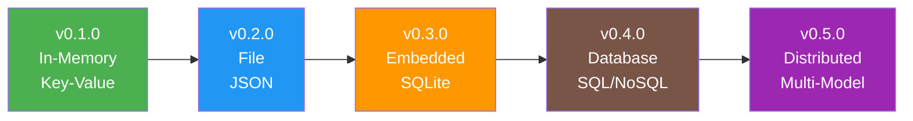

# Drivers Component


## Version History

:::new
**New in v0.1.0**: Basic in-memory driver with simple key-value storage abstraction
:::

:::planned
**Coming in v0.2.0**: 
- File-based driver for persistence
- JSON serialization support
- Basic indexing capabilities

[See file storage features →](../../v0.2.0/enhancements/drivers.md)
:::

:::planned
**Coming in v0.4.0**: 
- SQL database drivers (PostgreSQL, SQL Server)
- NoSQL drivers (MongoDB, Redis)
- JSONB support for flexible schemas

[See database features →](../../v0.4.0/database/drivers.md)
:::

## Evolution Timeline



## Overview

Drivers provide the storage abstraction layer in Whizbang, allowing the framework to work with different storage backends without changing application code. In v0.1.0, we provide a simple in-memory driver perfect for development, testing, and prototyping.

## What is a Driver?

A Driver:
- **Abstracts** storage implementation details
- **Provides** a consistent interface for data operations
- **Handles** serialization and deserialization
- **Manages** connections and resources

Think of drivers as adapters that allow Whizbang to speak different storage "languages" while maintaining a consistent programming model.

## Core Interface (v0.1.0)

:::new
The basic driver interface for storage operations:
:::

```csharp
public interface IDriver {
    // Basic CRUD operations
    Task<T?> Get<T>(string key) where T : class;
    Task Set<T>(string key, T value) where T : class;
    Task<bool> Delete(string key);
    Task<bool> Exists(string key);
    
    // Collection operations
    Task<IEnumerable<T>> GetAll<T>(string prefix = "") where T : class;
    Task Clear(string prefix = "");
    
    // Driver metadata
    string Name { get; }
    DriverCapabilities Capabilities { get; }
}

public enum DriverCapabilities {
    None = 0,
    Persistence = 1,
    Transactions = 2,
    Queries = 4,
    Indexing = 8,
    Streaming = 16
}
```

## In-Memory Driver

:::new
The default in-memory driver for v0.1.0:
:::

```csharp
[WhizbangDriver("InMemory")]
public class InMemoryDriver : IDriver {
    private readonly ConcurrentDictionary<string, object> _store = new();
    private readonly ReaderWriterLockSlim _lock = new();
    
    public string Name => "InMemory";
    public DriverCapabilities Capabilities => DriverCapabilities.None;
    
    public Task<T?> Get<T>(string key) where T : class {
        _lock.EnterReadLock();
        try {
            if (_store.TryGetValue(key, out var value)) {
                return Task.FromResult(value as T);
            }
            return Task.FromResult<T?>(null);
        }
        finally {
            _lock.ExitReadLock();
        }
    }
    
    public Task Set<T>(string key, T value) where T : class {
        _lock.EnterWriteLock();
        try {
            _store[key] = value;
            return Task.CompletedTask;
        }
        finally {
            _lock.ExitWriteLock();
        }
    }
    
    public Task<bool> Delete(string key) {
        _lock.EnterWriteLock();
        try {
            return Task.FromResult(_store.TryRemove(key, out _));
        }
        finally {
            _lock.ExitWriteLock();
        }
    }
    
    public Task<bool> Exists(string key) {
        _lock.EnterReadLock();
        try {
            return Task.FromResult(_store.ContainsKey(key));
        }
        finally {
            _lock.ExitReadLock();
        }
    }
    
    public Task<IEnumerable<T>> GetAll<T>(string prefix = "") where T : class {
        _lock.EnterReadLock();
        try {
            var results = _store
                .Where(kvp => string.IsNullOrEmpty(prefix) || kvp.Key.StartsWith(prefix))
                .Select(kvp => kvp.Value)
                .OfType<T>();
            
            return Task.FromResult<IEnumerable<T>>(results.ToList());
        }
        finally {
            _lock.ExitReadLock();
        }
    }
    
    public Task Clear(string prefix = "") {
        _lock.EnterWriteLock();
        try {
            if (string.IsNullOrEmpty(prefix)) {
                _store.Clear();
            } else {
                var keysToRemove = _store.Keys
                    .Where(k => k.StartsWith(prefix))
                    .ToList();
                
                foreach (var key in keysToRemove) {
                    _store.TryRemove(key, out _);
                }
            }
            return Task.CompletedTask;
        }
        finally {
            _lock.ExitWriteLock();
        }
    }
}
```

## Driver Registration

Drivers are registered at startup and discovered by source generators:

```csharp
// Manual registration
services.AddWhizbangDrivers(options => {
    options.UseInMemory();
});

// Or with configuration
services.AddWhizbangDrivers(options => {
    options.UseDriver<InMemoryDriver>("default");
    options.UseDriver<InMemoryDriver>("cache");
});

// Source generated registration
public static partial class WhizbangGenerated {
    public static void RegisterDrivers(IServiceCollection services) {
        services.AddSingleton<IDriver, InMemoryDriver>();
    }
}
```

## Store Abstraction

:::new
Higher-level store abstraction built on drivers:
:::

```csharp
public interface IStore<T> where T : class {
    Task<T?> GetById(string id);
    Task Save(string id, T entity);
    Task Delete(string id);
    Task<IEnumerable<T>> GetAll();
}

public class DriverStore<T> : IStore<T> where T : class {
    private readonly IDriver _driver;
    private readonly string _prefix;
    
    public DriverStore(IDriver driver) {
        _driver = driver;
        _prefix = $"{typeof(T).Name}:";
    }
    
    public Task<T?> GetById(string id) {
        return _driver.Get<T>($"{_prefix}{id}");
    }
    
    public Task Save(string id, T entity) {
        return _driver.Set($"{_prefix}{id}", entity);
    }
    
    public Task Delete(string id) {
        return _driver.Delete($"{_prefix}{id}");
    }
    
    public Task<IEnumerable<T>> GetAll() {
        return _driver.GetAll<T>(_prefix);
    }
}
```

## Using Drivers in Components

### In Perspectives

```csharp
public class OrderPerspective : IPerspectiveOf<OrderCreated> {
    private readonly IStore<Order> _orderStore;
    
    public OrderPerspective(IDriver driver) {
        _orderStore = new DriverStore<Order>(driver);
    }
    
    public async Task Update(OrderCreated @event) {
        var order = new Order {
            Id = @event.OrderId,
            CustomerId = @event.CustomerId,
            Items = @event.Items,
            Total = @event.Total,
            Status = OrderStatus.Created
        };
        
        await _orderStore.Save(@event.OrderId.ToString(), order);
    }
}
```

### In Lenses

```csharp
public class OrderLens : IOrderLens {
    private readonly IStore<Order> _orderStore;
    
    public OrderLens(IDriver driver) {
        _orderStore = new DriverStore<Order>(driver);
    }
    
    public async Task<Order> Focus(Guid orderId) {
        return await _orderStore.GetById(orderId.ToString());
    }
    
    public async Task<IEnumerable<Order>> ViewAll() {
        return await _orderStore.GetAll();
    }
}
```

## Testing with Drivers

```csharp
[Test]
public class DriverTests {
    private InMemoryDriver _driver;
    
    [SetUp]
    public void Setup() {
        _driver = new InMemoryDriver();
    }
    
    [Test]
    public async Task SetAndGet_ShouldStoreAndRetrieve() {
        // Arrange
        var testObject = new TestEntity { 
            Id = "test-1", 
            Name = "Test Entity" 
        };
        
        // Act
        await _driver.Set("test-1", testObject);
        var retrieved = await _driver.Get<TestEntity>("test-1");
        
        // Assert
        Assert.NotNull(retrieved);
        Assert.Equal("Test Entity", retrieved.Name);
    }
    
    [Test]
    public async Task GetAll_WithPrefix_ShouldFilterResults() {
        // Arrange
        await _driver.Set("order:1", new Order { Id = Guid.NewGuid() });
        await _driver.Set("order:2", new Order { Id = Guid.NewGuid() });
        await _driver.Set("customer:1", new Customer { Id = Guid.NewGuid() });
        
        // Act
        var orders = await _driver.GetAll<Order>("order:");
        
        // Assert
        Assert.Equal(2, orders.Count());
    }
    
    [Test]
    public async Task Clear_WithPrefix_ShouldOnlyRemoveMatching() {
        // Arrange
        await _driver.Set("temp:1", new object());
        await _driver.Set("temp:2", new object());
        await _driver.Set("keep:1", new object());
        
        // Act
        await _driver.Clear("temp:");
        
        // Assert
        Assert.False(await _driver.Exists("temp:1"));
        Assert.False(await _driver.Exists("temp:2"));
        Assert.True(await _driver.Exists("keep:1"));
    }
}
```

## Driver Selection Strategy

```csharp
public interface IDriverSelector {
    IDriver GetDriver(string name);
    IDriver GetDriverForType<T>();
}

public class DriverSelector : IDriverSelector {
    private readonly Dictionary<string, IDriver> _drivers;
    
    public IDriver GetDriver(string name) {
        return _drivers.TryGetValue(name, out var driver) 
            ? driver 
            : _drivers["default"];
    }
    
    public IDriver GetDriverForType<T>() {
        // Can implement type-based routing
        var typeName = typeof(T).Name;
        
        return typeName switch {
            "Order" or "Customer" => GetDriver("primary"),
            "Cache" or "Session" => GetDriver("cache"),
            _ => GetDriver("default")
        };
    }
}
```

## IDE Features

```csharp
// IDE shows: "Driver: InMemory | Objects: 234 | Memory: 5.2MB"
public interface IDriver { }

// IDE shows: "Called 45 times | Avg: 0.1ms | Hit rate: 92%"
public Task<T?> Get<T>(string key) { }

// IDE shows: "Warning: No persistence - data lost on restart"
public class InMemoryDriver : IDriver { }
```

## Performance Characteristics

| Operation | Target | Actual |
|-----------|--------|--------|
| Get | < 100ns | TBD |
| Set | < 500ns | TBD |
| Delete | < 200ns | TBD |
| GetAll (1000 items) | < 1ms | TBD |
| Clear | < 100μs | TBD |

## Limitations in v0.1.0

:::info
These limitations are addressed in future versions:
:::

- **No persistence** - Data lost on restart
- **No queries** - Only key-based lookups
- **No transactions** - No atomicity guarantees
- **No indexing** - Linear scans for GetAll
- **Memory only** - Limited by available RAM

## Migration Path

### To v0.2.0 (File Storage)

:::planned
v0.2.0 adds persistent file storage:
:::

```csharp
// v0.2.0 - File-based driver
services.AddWhizbangDrivers(options => {
    options.UseFileDriver(file => {
        file.DataDirectory = "./data";
        file.Format = SerializationFormat.Json;
        file.Compression = true;
    });
});
```

### To v0.4.0 (Database Drivers)

:::planned
v0.4.0 adds real database support:
:::

```csharp
// v0.4.0 - SQL and NoSQL drivers
services.AddWhizbangDrivers(options => {
    options.UsePostgreSQL("Host=localhost;Database=whizbang");
    options.UseMongoDB("mongodb://localhost:27017/whizbang");
    options.UseRedis("localhost:6379");
});
```

## Best Practices

1. **Use abstractions** - Depend on IDriver, not concrete implementations
2. **Plan for persistence** - Design assuming data will persist
3. **Use prefixes** - Organize keys with consistent prefixes
4. **Handle nulls** - Always check for null returns from Get
5. **Test with different drivers** - Ensure code works with any driver
6. **Consider capabilities** - Check driver capabilities before using features

## Related Documentation

- [Perspectives](perspectives.md) - Using drivers for write models
- [Lenses](lenses.md) - Using drivers for read models
- [Testing](../testing/foundation.md) - Testing with in-memory driver
- [Feature Evolution](../../roadmap/FEATURE-EVOLUTION.md) - How drivers evolve

## Next Steps

- See [v0.2.0 File Storage](../../v0.2.0/enhancements/drivers.md) for persistence
- See [v0.4.0 Databases](../../v0.4.0/database/drivers.md) for SQL/NoSQL support
- Review [Examples](../examples/storage-patterns.md) for driver patterns