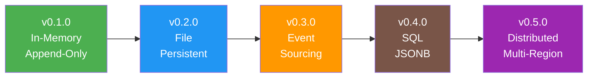

# Ledger Component


## Version History

:::new
**New in v0.1.0**: Basic in-memory event store with append-only semantics
:::

:::planned
**Coming in v0.2.0**: 
- Persistent file-based storage
- Event streams and versioning
- Basic snapshots

[See persistence features →](../../v0.2.0/enhancements/ledger.md)
:::

:::planned
**Coming in v0.3.0**: 
- Full event sourcing with projections
- Time-travel queries
- Event replay

[See event sourcing features →](../../v0.3.0/features/ledger.md)
:::

## Evolution Timeline



## Overview

The Ledger is Whizbang's append-only event store, providing an immutable audit trail of all events in your system. In v0.1.0, it's a simple in-memory store that captures events and allows basic retrieval. This foundation will evolve into a full event sourcing system.

## What is a Ledger?

A Ledger:
- **Stores** events in append-only fashion
- **Preserves** the complete history of state changes
- **Provides** an immutable audit trail
- **Enables** event replay and debugging

Think of the ledger as your system's permanent memory - every significant action is recorded and can never be altered or deleted.

## Core Interface (v0.1.0)

:::new
The basic ledger interface for event storage:
:::

```csharp
public interface ILedger {
    // Append an event to the ledger
    Task<long> Append(IEvent @event);
    
    // Read events from the ledger
    IEnumerable<IEvent> Read(long fromPosition = 0);
    
    // Read events of a specific type
    IEnumerable<T> Read<T>(long fromPosition = 0) where T : IEvent;
    
    // Get the current position (last event number)
    long GetPosition();
}
```

## Basic Implementation

:::new
In v0.1.0, the ledger uses in-memory storage:
:::

```csharp
[WhizbangLedger]
public class InMemoryLedger : ILedger {
    private readonly List<StoredEvent> _events = new();
    private readonly object _lock = new();
    private long _position = 0;
    
    public Task<long> Append(IEvent @event) {
        lock (_lock) {
            var position = ++_position;
            
            _events.Add(new StoredEvent {
                Position = position,
                EventType = @event.GetType().Name,
                Event = @event,
                Timestamp = DateTimeOffset.UtcNow
            });
            
            return Task.FromResult(position);
        }
    }
    
    public IEnumerable<IEvent> Read(long fromPosition = 0) {
        lock (_lock) {
            return _events
                .Where(e => e.Position > fromPosition)
                .Select(e => e.Event);
        }
    }
    
    public IEnumerable<T> Read<T>(long fromPosition = 0) where T : IEvent {
        return Read(fromPosition).OfType<T>();
    }
    
    public long GetPosition() {
        lock (_lock) {
            return _position;
        }
    }
}
```

## Event Storage

### Event Structure

```csharp
public interface IEvent {
    Guid Id { get; }
    DateTimeOffset Timestamp { get; }
    string AggregateId { get; }
    int Version { get; }
}

// Stored event wrapper
internal class StoredEvent {
    public long Position { get; set; }
    public string EventType { get; set; }
    public IEvent Event { get; set; }
    public DateTimeOffset Timestamp { get; set; }
}
```

### Appending Events

:::new
Events are automatically appended by the dispatcher:
:::

```csharp
// Events flow from receptors through dispatcher to ledger
public class OrderReceptor : IReceptor<CreateOrder> {
    public OrderCreated Receive(CreateOrder cmd) {
        return new OrderCreated {
            Id = Guid.NewGuid(),
            Timestamp = DateTimeOffset.UtcNow,
            AggregateId = cmd.OrderId.ToString(),
            Version = 1,
            CustomerId = cmd.CustomerId,
            Items = cmd.Items,
            Total = cmd.Total
        };
        // Event automatically appended to ledger by dispatcher
    }
}
```

### Reading Events

:::new
Basic event retrieval in v0.1.0:
:::

```csharp
public class EventReader {
    private readonly ILedger _ledger;
    
    // Read all events
    public void ReadAllEvents() {
        var events = _ledger.Read();
        foreach (var @event in events) {
            Console.WriteLine($"{@event.Timestamp}: {@event.GetType().Name}");
        }
    }
    
    // Read specific event types
    public void ReadOrderEvents() {
        var orderEvents = _ledger.Read<OrderCreated>();
        foreach (var order in orderEvents) {
            Console.WriteLine($"Order {order.AggregateId}: {order.Total}");
        }
    }
    
    // Read from checkpoint
    public void ReadNewEvents(long lastPosition) {
        var newEvents = _ledger.Read(fromPosition: lastPosition);
        foreach (var @event in newEvents) {
            ProcessEvent(@event);
        }
    }
}
```

## Integration with Dispatcher

The ledger is automatically integrated with the dispatcher:

```csharp
// Source generated registration
public static partial class WhizbangGenerated {
    public static void RegisterLedger(IServiceCollection services) {
        services.AddSingleton<ILedger, InMemoryLedger>();
    }
}

// Dispatcher automatically appends events
public class Dispatcher : IDispatcher {
    private readonly ILedger _ledger;
    
    public async Task<TResult> Dispatch<TCommand, TResult>(TCommand command) 
        where TResult : IEvent {
        
        // Execute receptor
        var result = await ExecuteReceptor(command);
        
        // Append to ledger
        await _ledger.Append(result);
        
        // Update perspectives
        await UpdatePerspectives(result);
        
        return result;
    }
}
```

## Debugging with the Ledger

:::new
The ledger enables powerful debugging capabilities:
:::

```csharp
public class LedgerDebugger {
    private readonly ILedger _ledger;
    
    // Show event timeline
    public void ShowTimeline(DateTime from, DateTime to) {
        var events = _ledger.Read()
            .Where(e => e.Timestamp >= from && e.Timestamp <= to)
            .OrderBy(e => e.Timestamp);
        
        foreach (var @event in events) {
            Console.WriteLine($"{@event.Timestamp:HH:mm:ss.fff} " +
                            $"[{@event.GetType().Name}] " +
                            $"Aggregate: {@event.AggregateId}");
        }
    }
    
    // Analyze event patterns
    public void AnalyzePatterns() {
        var events = _ledger.Read();
        
        var stats = events
            .GroupBy(e => e.GetType().Name)
            .Select(g => new {
                EventType = g.Key,
                Count = g.Count(),
                FirstOccurred = g.Min(e => e.Timestamp),
                LastOccurred = g.Max(e => e.Timestamp)
            });
        
        foreach (var stat in stats) {
            Console.WriteLine($"{stat.EventType}: {stat.Count} events");
        }
    }
}
```

## Testing with the Ledger

```csharp
[Test]
public class LedgerTests {
    private InMemoryLedger _ledger;
    
    [SetUp]
    public void Setup() {
        _ledger = new InMemoryLedger();
    }
    
    [Test]
    public async Task Append_ShouldReturnIncrementingPosition() {
        // Arrange
        var event1 = new TestEvent { Id = Guid.NewGuid() };
        var event2 = new TestEvent { Id = Guid.NewGuid() };
        
        // Act
        var pos1 = await _ledger.Append(event1);
        var pos2 = await _ledger.Append(event2);
        
        // Assert
        Assert.Equal(1, pos1);
        Assert.Equal(2, pos2);
    }
    
    [Test]
    public async Task Read_ShouldReturnEventsInOrder() {
        // Arrange
        var events = new[] {
            new TestEvent { Id = Guid.NewGuid() },
            new TestEvent { Id = Guid.NewGuid() },
            new TestEvent { Id = Guid.NewGuid() }
        };
        
        foreach (var @event in events) {
            await _ledger.Append(@event);
        }
        
        // Act
        var readEvents = _ledger.Read().ToList();
        
        // Assert
        Assert.Equal(3, readEvents.Count);
        Assert.Equal(events[0].Id, readEvents[0].Id);
        Assert.Equal(events[2].Id, readEvents[2].Id);
    }
    
    [Test]
    public async Task Read_FromPosition_ShouldSkipEarlierEvents() {
        // Arrange
        for (int i = 0; i < 5; i++) {
            await _ledger.Append(new TestEvent());
        }
        
        // Act
        var events = _ledger.Read(fromPosition: 3).ToList();
        
        // Assert
        Assert.Equal(2, events.Count); // Only events 4 and 5
    }
}
```

## IDE Features

```csharp
// IDE shows: "Events stored: 1,234 | Size: 5.2MB | Last: 2s ago"
public interface ILedger { }

// IDE shows: "Appended 45 times | Avg: 0.1ms"
public Task<long> Append(IEvent @event) { }

// IDE shows: "Warning: Reading all events can be expensive"
public IEnumerable<IEvent> Read(long fromPosition = 0) { }
```

## Performance Characteristics

| Operation | Target | Actual |
|-----------|--------|--------|
| Append | < 1μs | TBD |
| Read (1000 events) | < 1ms | TBD |
| Read by type | < 2ms | TBD |
| Get position | < 100ns | TBD |

## Limitations in v0.1.0

:::info
These limitations are addressed in future versions:
:::

- **In-memory only** - Events lost on restart
- **No streaming** - Must load all events at once
- **No snapshots** - Can't optimize long event streams
- **Single stream** - No concept of aggregate streams
- **No queries** - Basic sequential read only

## Migration Path

### To v0.2.0 (Persistence)

:::planned
v0.2.0 adds persistent storage:
:::

```csharp
// v0.2.0 - File-based persistence
public interface ILedger {
    Task<long> Append(string streamId, IEvent @event);
    IAsyncEnumerable<IEvent> ReadStream(string streamId);
    Task<Snapshot> CreateSnapshot(string streamId);
}
```

### To v0.3.0 (Event Sourcing)

:::planned
v0.3.0 adds full event sourcing:
:::

```csharp
// v0.3.0 - Event sourcing with projections
public interface IEventStore : ILedger {
    Task<T> LoadAggregate<T>(string aggregateId) where T : IAggregate;
    Task SaveAggregate<T>(T aggregate) where T : IAggregate;
    Task<ProjectionState> GetProjection(string projectionName);
    Task RebuildProjection(string projectionName, DateTime? from = null);
}
```

## Best Practices

1. **Events are immutable** - Never modify events after creation
2. **Use meaningful event names** - OrderCreated not Event1
3. **Include all relevant data** - Events should be self-contained
4. **Keep events small** - Large payloads impact performance
5. **Version your events** - Plan for schema evolution
6. **Test with the ledger** - Verify event flow in tests

## Related Documentation

- [Receptors](receptors.md) - Where events come from
- [Dispatcher](dispatcher.md) - How events reach the ledger
- [Perspectives](perspectives.md) - How events update views
- [Testing](../testing/foundation.md) - Testing with the ledger
- [Feature Evolution](../../roadmap/FEATURE-EVOLUTION.md) - How the ledger evolves

## Next Steps

- See [v0.2.0 Persistence](../../v0.2.0/enhancements/ledger.md) for file-based storage
- See [v0.3.0 Event Sourcing](../../v0.3.0/features/ledger.md) for full ES/CQRS
- Review [Examples](../examples/event-patterns.md) for event design patterns