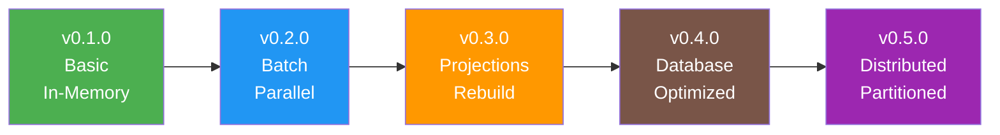
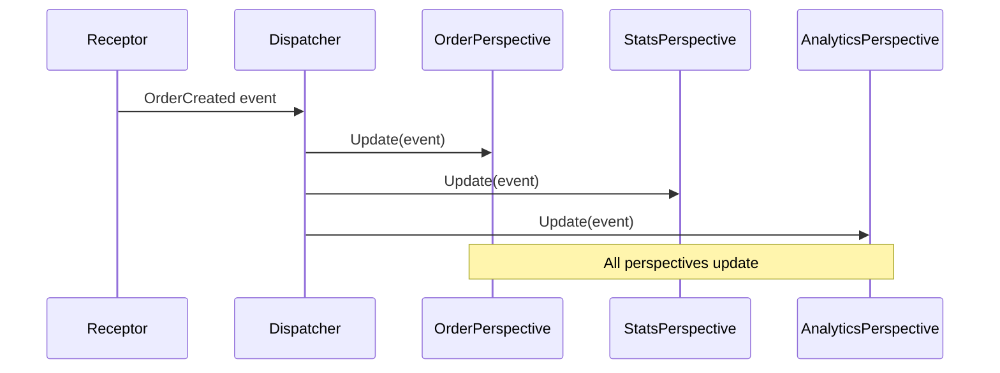

# Perspectives Component


## Version History

:::new
**New in v0.1.0**: Basic event handling with in-memory updates for multiple views
:::

:::planned
**Coming in v0.2.0**: 
- Batch update support for performance
- Parallel perspective execution
- Enhanced error handling with dead letter queues

[See planned enhancements →](../../v0.2.0/enhancements/perspectives.md)
:::

:::planned
**Coming in v0.3.0**: 
- Full projection support with rebuild capability
- Checkpoint management for event replay
- Subscription management

[See projection features →](../../v0.3.0/features/projections.md)
:::

## Evolution Timeline



## Overview

Perspectives are the components that react to events and update various views of your data. They handle all write operations in Whizbang, ensuring that state changes flow consistently from events to storage. In v0.1.0, perspectives work with in-memory storage and provide the foundation for more advanced features.

## What is a Perspective?

A Perspective:
- **Reacts** to events emitted by receptors
- **Updates** data stores (in-memory in v0.1.0)
- **Maintains** different views of the same data
- **Executes** all write operations in the system

Think of perspectives as event handlers that maintain materialized views. Each perspective provides a different "perspective" on the events flowing through your system.

## Core Interface (v0.1.0)

:::new
The fundamental perspective interface for handling events:
:::

```csharp
public interface IPerspectiveOf<TEvent> {
    Task Update(TEvent @event);
}
```

Simple, yet powerful - perspectives react to specific events and update their views accordingly.

## Basic Implementation

:::new
In v0.1.0, perspectives work with in-memory storage:
:::

```csharp
[WhizbangHandler]  // Source generator discovers this
public class OrderPerspective : IPerspectiveOf<OrderCreated> {
    private readonly Dictionary<Guid, Order> _orders;
    
    public OrderPerspective(IInMemoryStore<Order> store) {
        _orders = store.Collection;
    }
    
    public Task Update(OrderCreated @event) {
        _orders[@event.OrderId] = new Order {
            Id = @event.OrderId,
            CustomerId = @event.CustomerId,
            Items = @event.Items,
            Total = @event.Total,
            Status = OrderStatus.Created,
            CreatedAt = @event.Timestamp
        };
        
        return Task.CompletedTask;
    }
}
```

## Multiple Perspectives Pattern

:::new
Different perspectives can handle the same event to create different views:
:::

```csharp
// Order list for display
[WhizbangHandler]
public class OrderListPerspective : IPerspectiveOf<OrderCreated> {
    private readonly List<OrderListItem> _orderList;
    
    public async Task Update(OrderCreated @event) {
        _orderList.Add(new OrderListItem {
            Id = @event.OrderId,
            CustomerName = await GetCustomerName(@event.CustomerId),
            Total = @event.Total,
            Status = "New",
            CreatedAt = @event.Timestamp
        });
    }
}

// Customer statistics
[WhizbangHandler]
public class CustomerStatsPerspective : IPerspectiveOf<OrderCreated> {
    private readonly Dictionary<Guid, CustomerStats> _stats;
    
    public Task Update(OrderCreated @event) {
        if (!_stats.TryGetValue(@event.CustomerId, out var stats)) {
            stats = _stats[@event.CustomerId] = new CustomerStats();
        }
        
        stats.OrderCount++;
        stats.TotalSpent += @event.Total;
        stats.LastOrderDate = @event.Timestamp;
        
        return Task.CompletedTask;
    }
}

// Analytics perspective
[WhizbangHandler]
public class AnalyticsPerspective : IPerspectiveOf<OrderCreated> {
    private readonly IAnalyticsStore _analytics;
    
    public Task Update(OrderCreated @event) {
        _analytics.RecordMetric("orders.created", 1);
        _analytics.RecordMetric("orders.value", @event.Total);
        return Task.CompletedTask;
    }
}
```

## Event Flow

### How Events Reach Perspectives



## Handling Multiple Event Types

A perspective can handle multiple event types:

```csharp
[WhizbangHandler]
public class OrderPerspective : 
    IPerspectiveOf<OrderCreated>,
    IPerspectiveOf<OrderUpdated>,
    IPerspectiveOf<OrderShipped>,
    IPerspectiveOf<OrderCancelled> {
    
    private readonly Dictionary<Guid, Order> _orders;
    
    public Task Update(OrderCreated @event) {
        _orders[@event.OrderId] = new Order { 
            Status = OrderStatus.Created 
        };
        return Task.CompletedTask;
    }
    
    public Task Update(OrderUpdated @event) {
        _orders[@event.OrderId].UpdatedAt = @event.Timestamp;
        return Task.CompletedTask;
    }
    
    public Task Update(OrderShipped @event) {
        _orders[@event.OrderId].Status = OrderStatus.Shipped;
        _orders[@event.OrderId].ShippedAt = @event.Timestamp;
        return Task.CompletedTask;
    }
    
    public Task Update(OrderCancelled @event) {
        _orders[@event.OrderId].Status = OrderStatus.Cancelled;
        return Task.CompletedTask;
    }
}
```

## Error Handling

:::new
Basic error handling in v0.1.0:
:::

```csharp
public class ResilientPerspective : IPerspectiveOf<OrderCreated> {
    private readonly ILogger<ResilientPerspective> _logger;
    
    public async Task Update(OrderCreated @event) {
        try {
            // Update logic
            await UpdateDatabase(@event);
        }
        catch (Exception ex) {
            _logger.LogError(ex, "Failed to update perspective for order {OrderId}", 
                @event.OrderId);
            
            // In v0.1.0, errors are logged but not retried
            // v0.2.0 adds retry policies and dead letter queues
            throw;
        }
    }
}
```

## Policy Application

:::new
Policies can be applied to perspectives:
:::

```csharp
[Retry(3)]
[Timeout(5000)]
public class OrderPerspective : IPerspectiveOf<OrderCreated> {
    public async Task Update(OrderCreated @event) {
        // Policies are applied automatically by the dispatcher
        await UpdateDatabase(@event);
    }
}
```

## Source Generation

:::new
Perspectives are discovered at compile time:
:::

```csharp
// Generated by Whizbang.Generators
public static partial class WhizbangGenerated {
    public static void RegisterPerspectives(IServiceCollection services) {
        services.AddScoped<IPerspectiveOf<OrderCreated>, OrderPerspective>();
        services.AddScoped<IPerspectiveOf<OrderCreated>, CustomerStatsPerspective>();
        services.AddScoped<IPerspectiveOf<OrderCreated>, AnalyticsPerspective>();
    }
    
    public static Dictionary<Type, List<Type>> GetEventPerspectives() {
        return new() {
            [typeof(OrderCreated)] = new() {
                typeof(OrderPerspective),
                typeof(CustomerStatsPerspective),
                typeof(AnalyticsPerspective)
            }
        };
    }
}
```

## Testing Perspectives

```csharp
[Test]
public class OrderPerspectiveTests {
    private OrderPerspective _perspective;
    private InMemoryStore<Order> _store;
    
    [SetUp]
    public void Setup() {
        _store = new InMemoryStore<Order>();
        _perspective = new OrderPerspective(_store);
    }
    
    [Test]
    public async Task Update_OrderCreated_ShouldStoreOrder() {
        // Arrange
        var @event = new OrderCreated(
            OrderId: Guid.NewGuid(),
            CustomerId: Guid.NewGuid(),
            Items: new[] { new OrderItem("SKU-001", 2, 29.99m) },
            Total: 59.98m,
            Timestamp: DateTimeOffset.UtcNow
        );
        
        // Act
        await _perspective.Update(@event);
        
        // Assert
        Assert.True(_store.Collection.ContainsKey(@event.OrderId));
        var order = _store.Collection[@event.OrderId];
        Assert.Equal(@event.CustomerId, order.CustomerId);
        Assert.Equal(@event.Total, order.Total);
        Assert.Equal(OrderStatus.Created, order.Status);
    }
}
```

## IDE Features

```csharp
// IDE shows: "Handles: OrderCreated, OrderUpdated, OrderShipped | Updated by: 3 dispatchers"
public class OrderPerspective : IPerspectiveOf<OrderCreated> { }

// IDE shows: "Published to: 3 perspectives"
public record OrderCreated(Guid OrderId);

// IDE shows: "Updates triggered: 127 times | Avg: 2.3ms | Last: 5s ago"
public async Task Update(OrderCreated @event) { }
```

## Performance Characteristics

| Operation | Target | Actual |
|-----------|--------|--------|
| Update invocation | < 1μs | TBD |
| In-memory write | < 100ns | TBD |
| Multiple perspectives | < 10μs | TBD |
| Error handling | < 1ms | TBD |

## Limitations in v0.1.0

:::info
These limitations are addressed in future versions:
:::

- **No batch updates** - Each event processed individually
- **Sequential execution** - Perspectives run one at a time
- **Basic error handling** - No retry or dead letter queues
- **In-memory only** - No database persistence

## Migration Path

### To v0.2.0 (Enhanced Features)

:::planned
v0.2.0 adds performance and reliability features:
:::

```csharp
// v0.2.0 - Batch updates
public class OrderPerspective : IBatchPerspective<OrderCreated> {
    public async Task UpdateBatch(IEnumerable<OrderCreated> events) {
        // Process multiple events efficiently
        await BulkInsert(events);
    }
}

// v0.2.0 - Parallel execution
[ParallelExecution(MaxDegree = 4)]
public class AnalyticsPerspective : IPerspectiveOf<OrderCreated> { }
```

### To v0.3.0 (Projections)

:::planned
v0.3.0 transforms perspectives into full projections:
:::

```csharp
// v0.3.0 - Projection with rebuild
[Projection("OrderSummary")]
public class OrderProjection : IProjection {
    public async Task Handle(OrderCreated @event) {
        // Same as perspective but with checkpoint tracking
    }
    
    [Rebuild]
    public async Task RebuildFrom(DateTime from) {
        // Rebuild projection from event history
    }
}
```

## Best Practices

1. **Keep perspectives focused** - One concern per perspective
2. **Avoid complex logic** - Perspectives should be simple updates
3. **Handle errors gracefully** - Log and continue when possible
4. **Design for idempotency** - Same event twice = same result
5. **Use multiple perspectives** - Different views for different needs
6. **Test with events** - Test perspectives with real event data

## Related Documentation

- [Receptors](receptors.md) - Where events come from
- [Dispatcher](dispatcher.md) - How events reach perspectives
- [Lenses](lenses.md) - Reading the data perspectives write
- [Testing](../testing/foundation.md) - Testing perspectives
- [Feature Evolution](../../roadmap/FEATURE-EVOLUTION.md) - How perspectives evolve

## Next Steps

- See [v0.2.0 Enhancements](../../v0.2.0/enhancements/perspectives.md) for batch and parallel features
- See [v0.3.0 Projections](../../v0.3.0/features/projections.md) for full projection support
- Review [Examples](../examples/multiple-perspectives.md) for practical patterns