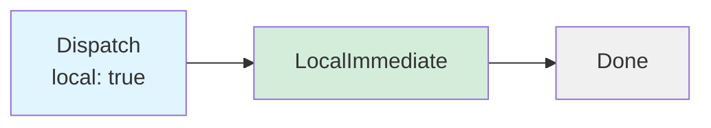
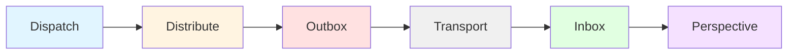
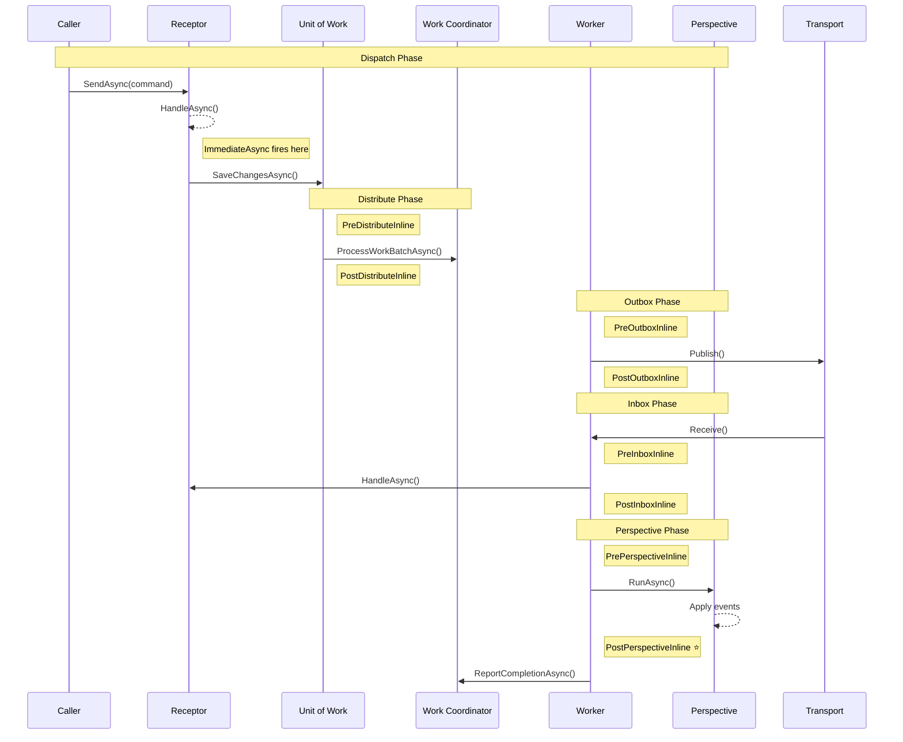

# Lifecycle Stages

Whizbang provides **20 lifecycle stages** where custom logic can execute during message processing. Lifecycle stages enable observability, metrics collection, test synchronization, and custom side effects without modifying core framework code.

## Core Concept

Messages flow through **two mutually exclusive paths**:

### Local Path (Mediator Pattern)



**Local dispatch** acts as an in-memory mediator - no persistence, no transport. Messages are processed immediately.

### Distributed Path (Outbox/Inbox)



**Distributed dispatch** persists to outbox, publishes via transport (RabbitMQ, Service Bus), and processes in inbox on receiver side.

---

## Two Mutually Exclusive Paths

:::new
Understanding the two dispatch paths is critical for using lifecycle stages correctly.
:::

| Path | Description | Default Stages | Persistence |
|------|-------------|---------------|-------------|
| **Local** | `DispatchAsync(msg, local: true)` | `LocalImmediateInline` | ❌ None (mediator) |
| **Distributed** | `DispatchAsync(msg)` or via transport | `PreOutboxInline` (sender) + `PostInboxInline` (receiver) | ✅ Outbox/Inbox |

**Key Points**:
- A message goes through ONE path, not both
- Default receptors (no `[FireAt]`) fire ONCE per path
- `[FireAt]` attributes opt into specific stages and OUT of default behavior

At each stage, **lifecycle receptors** can execute to:
- Track metrics and telemetry
- Log diagnostic information
- Synchronize integration tests
- Trigger custom business logic
- Implement cross-cutting concerns

---

## All 20 Lifecycle Stages

### Immediate Stage

#### `ImmediateAsync`

**Timing**: Immediately after receptor `HandleAsync()` returns, before any database operations.

**Use Cases**:
- Log command execution timing
- Track user activity
- Record metrics before persistence

**Guarantees**:
- Fires in same transaction scope as receptor
- No database writes have occurred yet
- Errors propagate to caller

**Example**:
```csharp
[FireAt(LifecycleStage.ImmediateAsync)]
public class CommandMetricsReceptor : IReceptor<ICommand> {
    private readonly IMetricsCollector _metrics;

    public ValueTask HandleAsync(ICommand cmd, CancellationToken ct) {
        _metrics.RecordCommand(cmd.GetType().Name);
        return ValueTask.CompletedTask;
    }
}
```

---

### LocalImmediate Stages (2 stages) ⭐ NEW

:::new
LocalImmediate stages are new in v0.1.0 and enable in-memory mediator-style message handling.
:::

#### `LocalImmediateInline` ⭐ **Default Stage for Local Path**

**Timing**: After `DispatchAsync(message, local: true)` completes, blocking.

**Use Cases**:
- **Business logic receptors** (this is where your command handlers fire!)
- Request-response patterns in same process
- In-memory mediator workflows
- Synchronous local dispatch

**Guarantees**:
- **Blocking** - dispatch waits for completion
- **NO persistence** - message never hits outbox/inbox
- **Default stage** for receptors WITHOUT `[FireAt]` on local path
- Errors propagate to caller

**Example**:
```csharp
// Receptor WITHOUT [FireAt] fires here when dispatched locally!
public class CreateTenantCommandHandler : IReceptor<CreateTenantCommand, TenantCreatedEvent> {
    public async ValueTask<TenantCreatedEvent> HandleAsync(CreateTenantCommand cmd, CancellationToken ct) {
        // Business logic executes at LocalImmediateInline stage
        var tenant = new Tenant(cmd.Name);
        await _dbContext.Tenants.AddAsync(tenant, ct);
        return new TenantCreatedEvent(tenant.Id);
    }
}

// Use local dispatch for in-process handling
await dispatcher.DispatchAsync(new CreateTenantCommand("Acme"), local: true);
```

#### `LocalImmediateAsync`

**Timing**: After `DispatchAsync(message, local: true)` completes, non-blocking.

**Use Cases**:
- Non-critical logging after local dispatch
- Fire-and-forget metrics
- Background notifications

**Guarantees**:
- **Non-blocking** - dispatch returns immediately
- **NO persistence** - message never hits outbox/inbox
- Runs via `Task.Run`
- Errors logged but don't affect caller

**Example**:
```csharp
[FireAt(LifecycleStage.LocalImmediateAsync)]
public class LocalDispatchLogger : IReceptor<ICommand> {
    public ValueTask HandleAsync(ICommand cmd, CancellationToken ct) {
        Console.WriteLine($"Local dispatch completed for {cmd.GetType().Name}");
        return ValueTask.CompletedTask;
    }
}
```

---

### Distribute Stages (5 stages)

#### `PreDistributeInline`

**Timing**: Before `ProcessWorkBatchAsync()` call in unit of work strategy.

**Use Cases**:
- Pre-processing before batch distribution
- Validation before work coordination

**Guarantees**:
- Blocking - distribution waits for completion
- Runs before any work is sent to coordinator

#### `PreDistributeAsync`

**Timing**: Before `ProcessWorkBatchAsync()` call in unit of work strategy (non-blocking, backgrounded).

**Use Cases**:
- Non-critical logging before batch distribution
- Async metrics collection
- Pre-distribution notifications

**Guarantees**:
- Non-blocking - fires in background via `Task.Run`
- Errors are logged but don't affect distribution
- May still be running when distribution occurs

#### `DistributeAsync`

**Timing**: In parallel with `ProcessWorkBatchAsync()` call (non-blocking, backgrounded).

**Use Cases**:
- Side effects that don't need to block (notifications, caching)
- Fire-and-forget operations
- Background metrics collection

**Guarantees**:
- Non-blocking - fires in background via `Task.Run`
- Errors are logged but don't affect distribution
- May complete after distribution finishes

#### `PostDistributeAsync`

**Timing**: After `ProcessWorkBatchAsync()` completes (non-blocking, backgrounded).

**Use Cases**:
- Post-distribution metrics
- Cleanup operations
- Async notifications

**Guarantees**:
- Non-blocking - fires in background via `Task.Run`
- Errors are logged but don't affect next steps
- Work has been queued to coordinator

#### `PostDistributeInline`

**Timing**: After `ProcessWorkBatchAsync()` completes (blocking).

**Use Cases**:
- Synchronization points in tests
- Critical post-distribution validation

**Guarantees**:
- Blocking - next step waits for completion
- Work has been queued to coordinator

---

### Outbox Stages (4 stages)

#### `PreOutboxInline` ⭐ **Default Stage for Distributed Sender**

**Timing**: Before publishing message to transport (Service Bus, RabbitMQ, etc.).

**Use Cases**:
- **Business logic receptors** (this is where your command handlers fire on sender side!)
- Pre-publish validation
- Message enrichment
- Transport-specific preparation

**Guarantees**:
- **Blocking** - publish waits for completion
- Message not yet sent to transport
- **Default stage** for receptors WITHOUT `[FireAt]` on distributed path (sender side)

#### `PreOutboxAsync`

**Timing**: Parallel with transport publish (non-blocking).

**Use Cases**:
- Async logging of outbound messages
- Non-critical metrics

**Guarantees**:
- Non-blocking - publish continues in parallel
- Message may already be sent when receptor completes

#### `PostOutboxAsync`

**Timing**: After message published to transport (non-blocking).

**Use Cases**:
- Delivery confirmation logging
- Success metrics

**Guarantees**:
- Non-blocking
- Message successfully published to transport

#### `PostOutboxInline`

**Timing**: After message published to transport (blocking).

**Use Cases**:
- Test synchronization for message publishing
- Critical post-publish operations

**Guarantees**:
- Blocking
- Message successfully published to transport

---

### Inbox Stages (4 stages)

#### `PreInboxInline`

**Timing**: Before invoking local receptor for received message.

**Use Cases**:
- Pre-processing received messages
- Validation before handler invocation
- Message deduplication checks

**Guarantees**:
- Blocking - receptor invocation waits
- Message received from transport but not yet processed

#### `PreInboxAsync`

**Timing**: Parallel with receptor invocation (non-blocking).

**Use Cases**:
- Async logging of inbound messages
- Non-critical metrics

**Guarantees**:
- Non-blocking - receptor invocation continues in parallel
- Receptor may complete before this stage finishes

#### `PostInboxAsync`

**Timing**: After receptor completes (non-blocking).

**Use Cases**:
- Post-processing metrics
- Success logging

**Guarantees**:
- Non-blocking
- Receptor has completed successfully

#### `PostInboxInline` ⭐ **Default Stage for Distributed Receiver**

**Timing**: After message received from transport and stored in inbox (blocking).

**Use Cases**:
- **Business logic receptors** (this is where your command handlers fire on receiver side!)
- Test synchronization for message reception
- Critical post-processing

**Guarantees**:
- **Blocking** - completion waits for all handlers
- Message stored in inbox and deduplicated
- **Default stage** for receptors WITHOUT `[FireAt]` on distributed path (receiver side)

---

### Perspective Stages (4 stages)

:::new
Perspective lifecycle stages are new in v0.1.0 and enable deterministic test synchronization.
:::

#### `PrePerspectiveInline`

**Timing**: Before perspective `RunAsync()` processes events.

**Use Cases**:
- Pre-processing before perspective updates
- Checkpoint validation
- Event enrichment

**Guarantees**:
- Blocking - perspective processing waits
- No events processed yet

**Hook Location**: Generated perspective runner (from `PerspectiveRunnerTemplate.cs`) before event processing loop begins

#### `PrePerspectiveAsync`

**Timing**: Parallel with perspective `RunAsync()` (non-blocking).

**Use Cases**:
- Async logging
- Non-critical metrics

**Guarantees**:
- Non-blocking - perspective continues in parallel
- Perspective may complete before this stage finishes

**Hook Location**: Generated perspective runner (from `PerspectiveRunnerTemplate.cs`) before event processing loop begins

#### `PostPerspectiveAsync`

**Timing**: After perspective completes, before checkpoint reported (non-blocking).

**Use Cases**:
- Post-processing metrics
- Event logging
- Custom indexing

**Guarantees**:
- Non-blocking
- Perspective has processed all events
- Checkpoint not yet reported to coordinator

**Hook Location**: Generated perspective runner (from `PerspectiveRunnerTemplate.cs`) during event processing loop, after `Apply()` and before checkpoint save

**Example**:
```csharp
[FireAt(LifecycleStage.PostPerspectiveAsync)]
public class PerspectiveMetricsReceptor : IReceptor<IEvent> {
    private readonly IMetricsCollector _metrics;

    public ValueTask HandleAsync(IEvent evt, CancellationToken ct) {
        _metrics.RecordPerspectiveUpdate(evt.GetType().Name);
        return ValueTask.CompletedTask;
    }
}
```

#### `PostPerspectiveInline` ⭐ **Critical for Testing**

**Timing**: After perspective completes, before checkpoint reported (blocking).

**Use Cases**:
- **Test synchronization** - wait for perspective data to be saved
- Critical post-processing that must complete before checkpoint

**Guarantees**:
- **Blocking** - checkpoint reporting waits for completion
- Perspective has processed all events
- **Database writes are committed** - safe to query perspective data
- Checkpoint not yet reported to coordinator

**Hook Location**: Generated perspective runner (from `PerspectiveRunnerTemplate.cs`) during event processing loop, after `Apply()` and before checkpoint save

**Example** (Test Synchronization):
```csharp
[FireAt(LifecycleStage.PostPerspectiveInline)]
public class PerspectiveCompletionReceptor<TEvent> : IReceptor<TEvent>
    where TEvent : IEvent {

    private readonly TaskCompletionSource<bool> _completion;

    public ValueTask HandleAsync(TEvent evt, CancellationToken ct) {
        _completion.SetResult(true);  // Signal test to proceed
        return ValueTask.CompletedTask;
    }
}
```

See [Lifecycle Synchronization](../testing/lifecycle-synchronization.md) for complete test patterns.

---

## Lifecycle Stage Timing Diagram



---

## Async vs Inline Stages

Most lifecycle stages come in pairs:

| Stage Type | Timing | Blocks Next Step | Use Case |
|------------|--------|------------------|----------|
| `*Inline` | Before/After | ✅ Yes | Critical operations, test sync |
| `*Async` | Parallel | ❌ No | Metrics, logging, non-critical |

**Guidelines**:
- **Use Inline** for: Test synchronization, validation, critical operations
- **Use Async** for: Logging, metrics, observability

---

## Registering Lifecycle Receptors

### Compile-Time (Production)

Use `[FireAt]` attribute for compile-time registration:

```csharp
[FireAt(LifecycleStage.PostPerspectiveAsync)]
public class MyMetricsReceptor : IReceptor<ProductCreatedEvent> {
    public ValueTask HandleAsync(ProductCreatedEvent evt, CancellationToken ct) {
        // Track metrics
        return ValueTask.CompletedTask;
    }
}
```

Source generators discover and wire these automatically.

### Runtime (Testing)

Use `ILifecycleReceptorRegistry` for dynamic registration:

```csharp
var registry = host.Services.GetRequiredService<ILifecycleReceptorRegistry>();
var receptor = new PerspectiveCompletionReceptor<ProductCreatedEvent>(completionSource);

registry.Register<ProductCreatedEvent>(receptor, LifecycleStage.PostPerspectiveInline);
try {
    // Dispatch command
    await dispatcher.SendAsync(command);

    // Wait for completion
    await completionSource.Task;
} finally {
    registry.Unregister<ProductCreatedEvent>(receptor, LifecycleStage.PostPerspectiveInline);
}
```

See [Lifecycle Receptors](lifecycle-receptors.md) for API details.

---

## Performance Considerations

**Lifecycle receptors execute synchronously in the message processing path**. Keep them fast:

✅ **Good Practices**:
- Quick in-memory operations
- Async logging (non-blocking)
- Metrics collection
- Test signaling

❌ **Avoid**:
- Database queries
- HTTP calls
- Heavy computation
- Blocking operations (in Async stages)

**Exception Handling**:
- Lifecycle receptor errors are logged but don't fail message processing
- Checkpoint progress continues even if lifecycle receptors fail
- Critical operations should use Inline stages to detect failures

---

## Hook Locations in Source Code

| Stage | File | Method/Location |
|-------|------|-----------------|
| `ImmediateAsync` | `Dispatcher.cs` | After receptor `HandleAsync()` |
| `PreDistribute*` / `DistributeAsync` / `PostDistribute*` | `*WorkCoordinatorStrategy.cs` | Around `ProcessWorkBatchAsync()` (Immediate/Scoped/Interval) |
| `PreOutbox*` / `PostOutbox*` | `WorkCoordinatorPublisherWorker.cs` | Around `ProcessOutboxWorkAsync()` |
| `PreInbox*` / `PostInbox*` | `ServiceBusConsumerWorker.cs` | Around `ProcessInboxWorkAsync()` |
| `PrePerspective*` | `PerspectiveRunnerTemplate.cs` | Before event processing loop |
| `PostPerspective*` | `PerspectiveRunnerTemplate.cs` | During event processing loop (after `Apply()`, before checkpoint save) |

---

## Related Topics

- [Lifecycle Receptors API](lifecycle-receptors.md) - Using `[FireAt]` and `ILifecycleContext`
- [Receptors Guide](receptors.md) - Core receptor concepts
- [Testing: Lifecycle Synchronization](../testing/lifecycle-synchronization.md) - Test patterns with lifecycle hooks
- [PerspectiveWorker](../workers/perspective-worker.md) - Perspective processing worker
- [Work Coordination](../workers/work-coordination.md) - Distributed work coordination

---

## Summary

- **20 lifecycle stages** across 6 phases (Immediate, LocalImmediate, Distribute, Outbox, Inbox, Perspective)
- **Two mutually exclusive paths**: Local (mediator) and Distributed (outbox/inbox)
- **Default stages** for receptors without `[FireAt]`:
  - **Local path**: `LocalImmediateInline`
  - **Distributed path**: `PreOutboxInline` (sender) + `PostInboxInline` (receiver)
- **Inline stages** block next step - use for critical operations
- **Async stages** run in parallel - use for metrics and logging
- **`PostPerspectiveInline`** is critical for test synchronization
- **Compile-time registration** via `[FireAt]` attribute
- **Runtime registration** via `ILifecycleReceptorRegistry` for tests
- **Zero reflection** - fully AOT-compatible via `IReceptorInvoker` and `IReceptorRegistry`
- **Performance** - keep lifecycle receptors fast and lightweight
