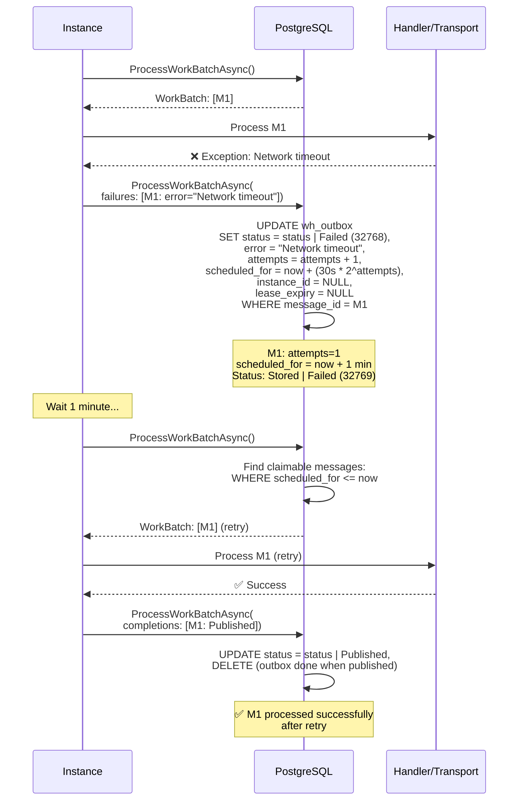
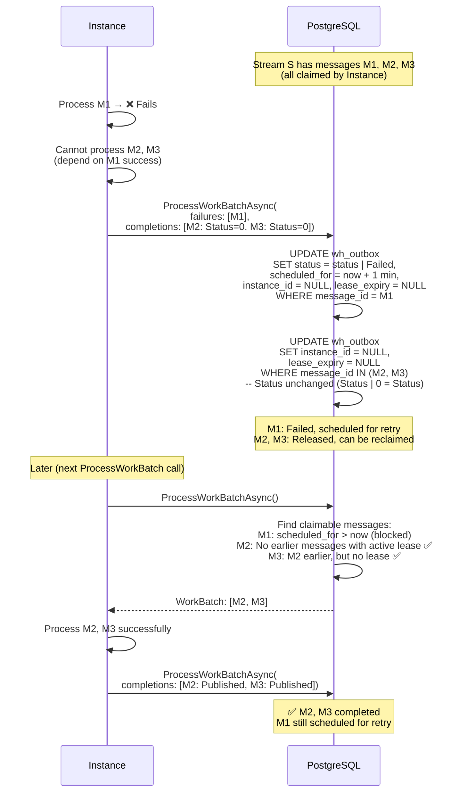

# Failure Handling

## Overview

Whizbang implements sophisticated failure handling mechanisms including exponential backoff retry scheduling, stream-based failure cascades, and poison message detection. This document details how failures are tracked, scheduled for retry, and how they impact stream processing.

## Core Concepts

### Message Processing Status

Messages track their processing state using bitwise flags in the `status` column:

```csharp
[Flags]
public enum MessageProcessingStatus {
    Stored = 1,         // Bit 0: Message stored in database
    EventStored = 2,    // Bit 1: Event persisted to event store
    Published = 4,      // Bit 2: Message published to transport
    Failed = 32768      // Bit 15: Processing failed
}
```

**Key Properties**:
- **Bitwise Flags**: Multiple states can coexist (e.g., `Stored | Failed = 32769`)
- **Status Progression**: `Stored → EventStored → Published` (outbox)
- **Failure Overlay**: `Failed` flag added via bitwise OR when message fails
- **Partial Completion**: `CompletedStatus` tracks what was accomplished before failure

### Failure Classification

```csharp
public enum MessageFailureReason {
    Unknown = 99,                    // Default (not classified)
    TransportUnavailable = 1,        // Network/transport issues
    HandlerException = 2,            // Handler threw exception
    ValidationFailure = 3,           // Message validation failed
    TimeoutExceeded = 4,             // Processing timeout
    SerializationError = 5,          // Cannot deserialize message
    DependencyFailure = 6,           // External dependency unavailable
    PoisonMessage = 7                // Exceeded retry limit
}
```

**Purpose**:
- Enable typed filtering (e.g., "retry only TransportUnavailable failures")
- Support different retry strategies per failure type
- Metrics and monitoring (failure classification dashboards)

### Retry Scheduling

**Exponential Backoff Formula**:
```
scheduled_for = now + (base_interval * 2^attempts)

Base interval: 30 seconds
Attempts:
- 0: First attempt (no backoff)
- 1: 30s * 2^1 = 1 minute
- 2: 30s * 2^2 = 2 minutes
- 3: 30s * 2^3 = 4 minutes
- 4: 30s * 2^4 = 8 minutes
- 5: 30s * 2^5 = 16 minutes
- ...
```

## Failure Processing Flow {#failure-flow}

### Basic Failure and Retry



### Retry Schedule Timeline

```
Time →
0s              60s             120s            180s            240s
│               │               │               │               │
M1 ━━━━━━━━━┃ Fail (attempts=0)
           │
           ├→ scheduled_for = now + 30s * 2^1 = now + 1 min
           │
           ├──── Cannot claim (scheduled_for > now)
           │
           │               Retry #1
           │               ┃ Fail (attempts=1)
           │               │
           │               ├→ scheduled_for = now + 30s * 2^2 = now + 2 min
           │               │
           │               ├──── Cannot claim
           │               │
           │               │                               Retry #2
           │               │                               ┃ Success
           │               │                               │
           │               │                               └→ Published
```

## Stream-Based Failure Cascades {#failure-cascade}

### Problem: Blocking Entire Stream

When message M1 in stream S fails, what happens to messages M2, M3, M4 that come after it?

**Options**:
1. **Block all**: M2, M3, M4 stuck until M1 succeeds (could wait forever)
2. **Continue**: Process M2, M3, M4 anyway (violates stream ordering)
3. **Cascade release**: Allow releasing M2, M3, M4 to unblock stream

**Whizbang's Approach**: Cascade release with explicit control

### Status=0 Release Pattern

**Mechanism**: Completing a message with `Status = 0` clears its lease without changing status flags, allowing it to be reprocessed.

```csharp
// Release messages M2, M3 (let them be retried)
await coordinator.ProcessWorkBatchAsync(
    // ...
    outboxCompletions: [
        new MessageCompletion { MessageId = message2Id, Status = 0 },  // Release
        new MessageCompletion { MessageId = message3Id, Status = 0 }   // Release
    ],
    outboxFailures: [
        new MessageFailure {
            MessageId = message1Id,
            CompletedStatus = MessageProcessingStatus.Stored,
            Error = "Processing failed"
        }
    ]
);
```

**Effect**:
- M1: Marked as failed, scheduled for retry
- M2, M3: Leases cleared (`instance_id = NULL`, `lease_expiry = NULL`)
- M2, M3: Status unchanged (still `Stored`)
- M2, M3: Can be reclaimed by any instance

### Cascade Release Sequence Diagram



### Cascade Decision Matrix

| M1 State | M2 Lease Cleared? | M2 Claimable? | Ordering Impact |
|---|---|---|---|
| Failed, scheduled | No | ❌ Blocked | M2 waits for M1 retry |
| Failed, scheduled | Yes (Status=0) | ✅ Can claim | Stream continues without M1 |
| Failed, not scheduled | Yes | ✅ Can claim | Stream continues (M1 poisoned?) |
| Processing (active lease) | N/A | ❌ Blocked | Normal stream ordering |
| Completed | N/A | ✅ Can claim | Normal progression |

### Use Cases for Cascade Release

**1. Independent Events**:
```
M1: CustomerCreated (fails due to validation)
M2: CustomerAddressUpdated (can proceed without M1)
M3: CustomerEmailUpdated (can proceed without M1)

→ Release M2, M3 to continue processing
```

**2. Retry Later Strategy**:
```
M1: SendEmail (fails due to SMTP unavailable)
M2: LogEmailSent (depends on M1)
M3: UpdateCustomerPreferences (independent)

→ Release M3, keep M2 blocked
```

**3. Poison Message Handling**:
```
M1: ProcessLargeFile (exceeds memory, always fails)
M2, M3, M4: Other events (independent)

→ Mark M1 as poison (manual intervention)
→ Release M2, M3, M4 to continue stream
```

## Poison Message Detection {#poison-messages}

### What is a Poison Message?

**Definition**: A message that repeatedly fails processing and cannot succeed, blocking the queue.

**Characteristics**:
- High retry count (e.g., `attempts > 10`)
- Consistent failure reason (e.g., SerializationError)
- Blocks stream processing
- Requires manual intervention

### Detection Criteria

```sql
-- Find potential poison messages
SELECT message_id, destination, event_type, attempts, error,
       scheduled_for, created_at
FROM wh_outbox
WHERE attempts >= 10  -- High retry count
  AND (status & 32768) = 32768  -- Failed flag set
  AND scheduled_for IS NOT NULL  -- Still scheduled for retry
ORDER BY attempts DESC, created_at ASC;
```

### Handling Strategies

**1. Dead Letter Queue** (recommended):
```csharp
// Move to dead letter queue after N attempts
if (message.Attempts >= 10) {
    await MoveToDeadLetterQueueAsync(message);

    // Complete with Status=0 to prevent re-claiming
    await coordinator.ProcessWorkBatchAsync(
        outboxCompletions: [
            new MessageCompletion { MessageId = message.MessageId, Status = 0 }
        ]
    );
}
```

**2. Manual Intervention**:
- Set `scheduled_for = NULL` (prevents retry)
- Set custom `FailureReason = PoisonMessage`
- Alert operations team
- Release downstream messages (Status=0)

**3. Circuit Breaker**:
- Detect repeated failures of same type
- Temporarily stop processing that message type
- Alert and investigate root cause

## Partial Completion Tracking {#partial-completion}

### CompletedStatus Field

When a message fails, it may have completed some steps before failing. The `CompletedStatus` field tracks what was accomplished.

```csharp
public record MessageFailure {
    public required Guid MessageId { get; init; }
    public required MessageProcessingStatus CompletedStatus { get; init; }
    public required string Error { get; init; }
}
```

**Example**:
```csharp
// Message M1: Store to DB ✅, Store to Event Store ✅, Publish to Transport ❌
await coordinator.ProcessWorkBatchAsync(
    outboxFailures: [
        new MessageFailure {
            MessageId = message1Id,
            CompletedStatus = MessageProcessingStatus.Stored | MessageProcessingStatus.EventStored,
            Error = "Transport unavailable"
        }
    ]
);

// Result:
// status = (Stored | EventStored) | (Stored | EventStored) | Failed
//        = Stored | EventStored | Failed
```

### SQL Update Logic

```sql
UPDATE wh_outbox
SET status = (status | v_failure.status_flags | 32768),  -- Add completed flags + Failed flag
    error = v_failure.error_message,
    attempts = attempts + 1,
    scheduled_for = now + (INTERVAL '30 seconds' * POWER(2, attempts + 1))
WHERE message_id = v_failure.msg_id;
```

**Rationale**:
- Avoid re-executing already completed steps on retry
- Idempotency: Bitwise OR ensures flags only add, never remove
- Resume from failure point

## Failure Metrics and Monitoring

### Key Metrics to Track

**1. Retry Count Distribution**:
```sql
SELECT attempts, COUNT(*) as message_count
FROM wh_outbox
WHERE (status & 32768) = 32768  -- Failed messages
GROUP BY attempts
ORDER BY attempts;
```

**2. Failure Reasons**:
```sql
SELECT failure_reason, COUNT(*) as count
FROM wh_outbox
WHERE (status & 32768) = 32768
GROUP BY failure_reason
ORDER BY count DESC;
```

**3. Scheduled Retry Backlog**:
```sql
SELECT COUNT(*) as scheduled_count,
       MIN(scheduled_for) as next_retry,
       MAX(scheduled_for) as latest_retry
FROM wh_outbox
WHERE scheduled_for IS NOT NULL
  AND scheduled_for > NOW();
```

**4. Poison Message Candidates**:
```sql
SELECT COUNT(*) as poison_candidates
FROM wh_outbox
WHERE attempts >= 10
  AND (status & 32768) = 32768;
```

## Configuration and Tuning

### Retry Configuration

**Base Interval** (default: 30 seconds):
- Shorter: Faster retries, higher load
- Longer: Slower recovery, lower load
- Recommended: 30-60 seconds

**Max Attempts** (application-defined):
- Low (5-10): Quick poison message detection
- High (20+): Aggressive retry (long outages)
- Recommended: 10 attempts

**Backoff Cap** (optional):
```csharp
// Cap exponential backoff at 1 hour
var backoffSeconds = Math.Min(
    30 * Math.Pow(2, attempts),
    3600  // 1 hour max
);
```

### Stream Ordering vs. Availability

**Trade-off**:
- **Strict Ordering**: Block stream on failure (wait for M1 to succeed)
- **High Availability**: Release downstream messages (allow M2, M3 to proceed)

**Decision Matrix**:

| Scenario | Strategy | Rationale |
|---|---|---|
| Financial transactions | Strict ordering | Cannot process M2 without M1 |
| Audit logs | Strict ordering | Preserve temporal order |
| Notifications | High availability | Independent messages, release OK |
| Analytics events | High availability | Eventually consistent, release OK |

## Troubleshooting

### Problem: Message Stuck in Retry Loop

**Symptoms**:
- Message has high `attempts` count
- `scheduled_for` keeps advancing
- Never succeeds

**Diagnostic Steps**:
1. Check error message:
   ```sql
   SELECT message_id, attempts, error, scheduled_for
   FROM wh_outbox
   WHERE message_id = '<stuck_message_id>';
   ```

2. Check failure reason classification:
   ```sql
   SELECT failure_reason FROM wh_outbox WHERE message_id = '<stuck_message_id>';
   ```

3. Inspect message data:
   ```sql
   SELECT event_data FROM wh_outbox WHERE message_id = '<stuck_message_id>';
   ```

**Common Causes**:
- Malformed message (SerializationError)
- Validation failure (will never pass)
- External dependency permanently unavailable
- Message too large (always exceeds limits)

**Solutions**:
- Move to dead letter queue
- Fix underlying issue and reset `attempts = 0`
- Release downstream messages (Status=0 cascade)

### Problem: Stream Completely Blocked

**Symptoms**:
- No messages in stream are processing
- All messages have `scheduled_for` in future
- Backlog growing

**Diagnostic Steps**:
1. Find blocking message:
   ```sql
   SELECT message_id, created_at, attempts, scheduled_for
   FROM wh_outbox
   WHERE stream_id = '<blocked_stream_id>'
   ORDER BY created_at ASC
   LIMIT 1;
   ```

2. Check if it's a poison message:
   ```sql
   SELECT attempts FROM wh_outbox WHERE message_id = '<blocking_message_id>';
   ```

**Solutions**:
- Release blocking message to dead letter queue
- Reset `scheduled_for = NOW()` to trigger immediate retry
- Cascade release downstream messages (Status=0)

## Related Documentation

- [Work Coordination](work-coordination.md) - Overview and architecture
- [Multi-Instance Coordination](multi-instance-coordination.md) - Cross-instance scenarios
- [Idempotency Patterns](idempotency-patterns.md) - Deduplication strategies
- [Outbox Pattern](outbox-pattern.md) - Transactional outbox implementation
- [Inbox Pattern](inbox-pattern.md) - Deduplication and handler invocation

## Implementation

### PostgreSQL Function

See: `014_CreateProcessWorkBatchFunction.sql`

**Key Sections**:
- Lines 158-195: Failure processing with exponential backoff
- Lines 728-738 (outbox), 770-780 (inbox): Scheduled retry blocking via NOT EXISTS

### C# Records

See: `Whizbang.Core/Messaging/MessageFailure.cs`

```csharp
public record MessageFailure {
    public required Guid MessageId { get; init; }
    public required MessageProcessingStatus CompletedStatus { get; init; }
    public required string Error { get; init; }
}
```

### Integration Tests

See: `Whizbang.Data.EFCore.Postgres.Tests/EFCoreWorkCoordinatorTests.cs`

**Test Cases**:
- `ProcessWorkBatch_FailsOutboxMessages_MarksAsFailedWithErrorAsync` - Basic failure
- `ProcessWorkBatch_StreamBasedFailureCascade_ReleasesLaterMessagesInSameStreamAsync` - Cascade release
- `ProcessWorkBatch_ScheduledRetry_BlocksLaterMessagesInStreamAsync` - Scheduled retry blocking
- `ProcessWorkBatch_ScheduledRetryExpires_UnblocksStreamAsync` - Time-based unblocking
