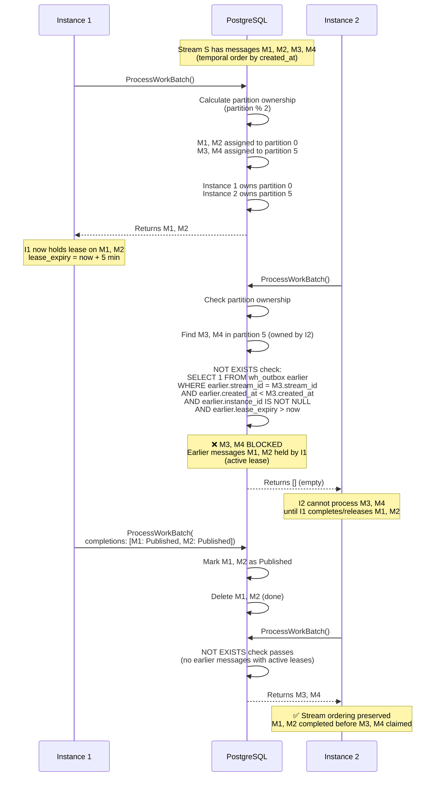
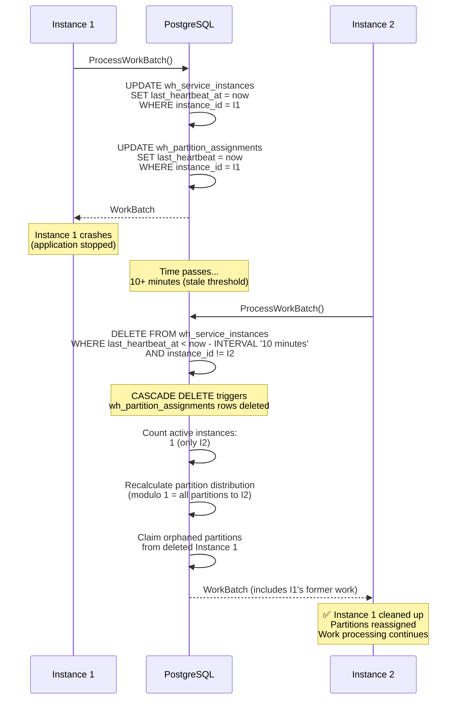
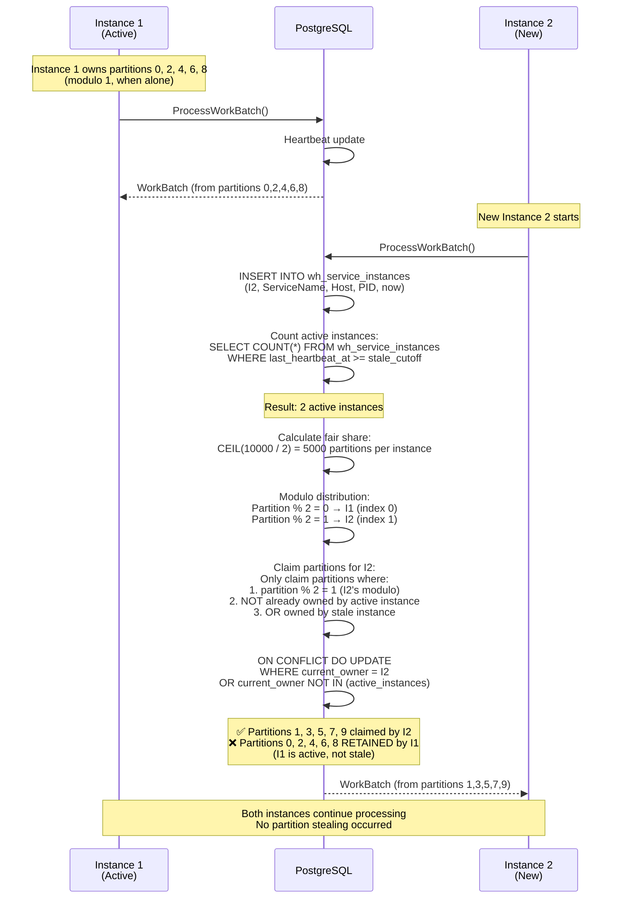
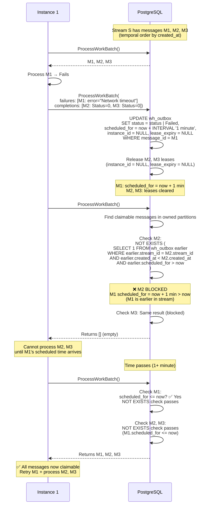
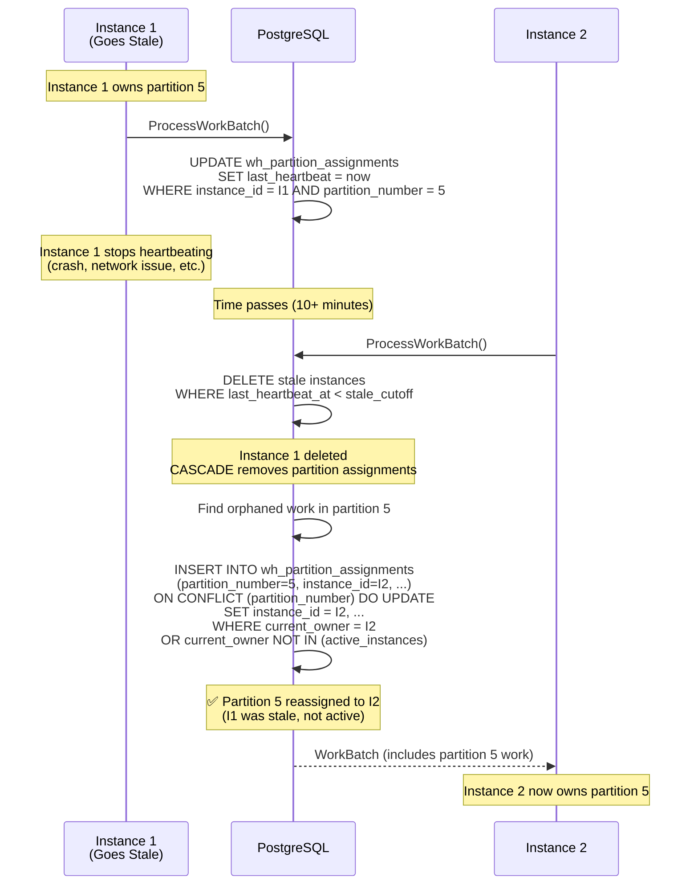
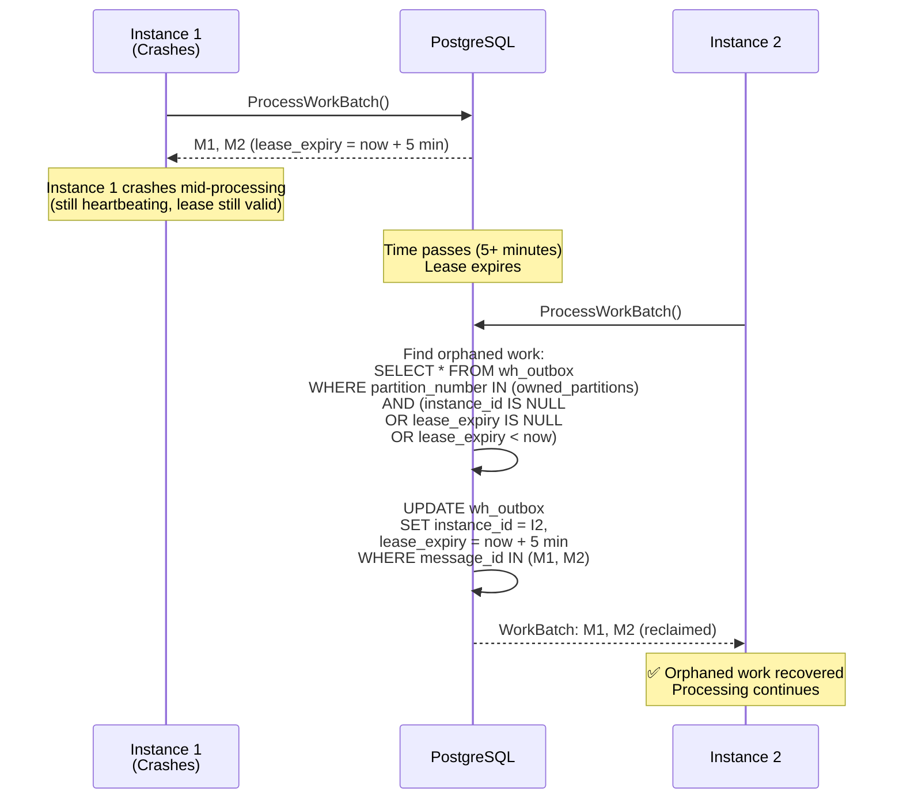
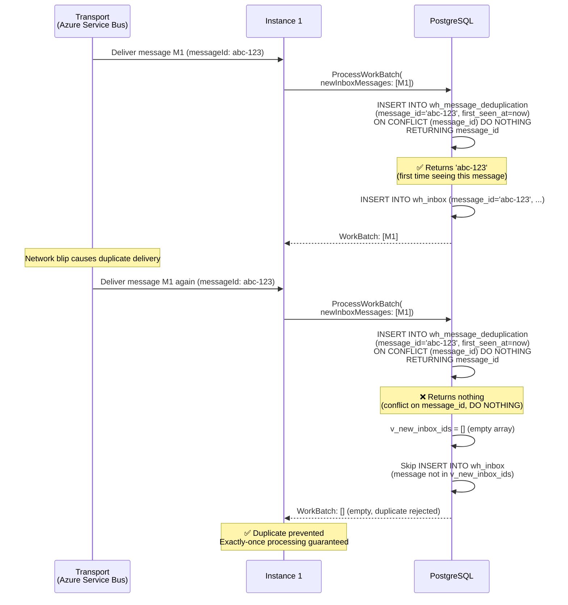
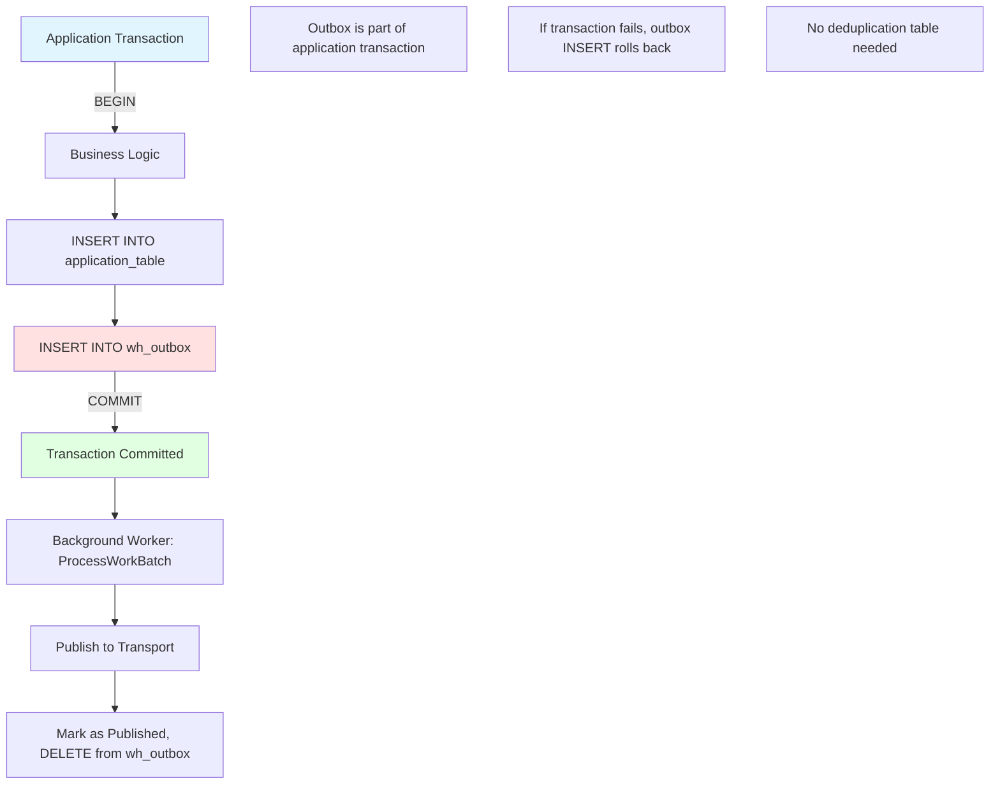

# Multi-Instance Coordination

## Overview

Multi-instance coordination ensures reliable, ordered message processing across multiple service instances. This document details the coordination mechanisms, decision points, and timing guarantees that enable distributed message processing.

## Core Coordination Mechanisms

### 1. Cross-Instance Stream Ordering {#cross-instance-stream-ordering}

**Rule**: When Instance A holds message M1 from stream S, Instance B cannot claim later messages (M2, M3, M4) from the same stream until Instance A completes or releases M1.

**Why This Matters**: Prevents out-of-order processing when messages from the same stream are distributed across multiple instances via partition assignment.

#### Sequence Diagram



**Decision Matrix**:

| Earlier Message State | Later Messages Claimable? | Reason |
|---|---|---|
| No lease (`instance_id = NULL`) | ✅ Yes | Message not claimed |
| Expired lease (`lease_expiry < now`) | ✅ Yes | Message orphaned |
| Active lease (other instance) | ❌ No | Stream ordering protection |
| Completed/deleted | ✅ Yes | Message finished |
| Scheduled for retry | ❌ No | See [Scheduled Retry Blocking](#scheduled-retry-blocking) |

### 2. Stale Instance Cleanup {#stale-instance-cleanup}

**Rule**: Instances that stop heartbeating for longer than the stale threshold (default: 10 minutes) are automatically removed, releasing their partitions.

#### Sequence Diagram



**Timing Diagram**:

```
Time →
0s         300s        600s        610s        620s
│          │           │           │           │
I1 ━━━━━━━━━━━━━━━━━━━━┃ Crash
                       │
                       ├──── Heartbeat valid (10 min window)
                       │
                       │                       I2 calls ProcessWorkBatch
                       │                       │
                       ├─ Stale threshold ────→│
                       │                       │
                       │                       ├→ I1 deleted (CASCADE)
                       │                       ├→ Partitions released
                       │                       └→ I2 claims partitions
```

**Decision Matrix**:

| Heartbeat Age | Instance State | Partitions | Action |
|---|---|---|---|
| < 10 minutes | Active | Retained | Normal operation |
| > 10 minutes (same instance) | Active | Retained | Self-exception (don't delete self) |
| > 10 minutes (other instance) | Stale | Released | DELETE instance, CASCADE partitions |

### 3. New Instance Joining {#new-instance-joining}

**Rule**: When a new instance joins, it claims only unassigned partitions or partitions from stale instances. Active instances retain their partition assignments.

#### Sequence Diagram



**Partition Ownership Table**:

| Partition | Before (1 instance) | After (2 instances) | Reassigned? |
|---|---|---|---|
| 0 | Instance 1 | Instance 1 | No (I1 active) |
| 1 | Instance 1 | Instance 2 | Yes (unassigned for I2) |
| 2 | Instance 1 | Instance 1 | No (I1 active) |
| 3 | Instance 1 | Instance 2 | Yes (unassigned for I2) |
| 4 | Instance 1 | Instance 1 | No (I1 active) |
| ... | ... | ... | ... |

### 4. Scheduled Retry Blocking {#scheduled-retry-blocking}

**Rule**: When message M1 fails and is scheduled for retry (e.g., `scheduled_for = now + 5 minutes`), all later messages in the same stream are blocked until the scheduled time passes.

#### Sequence Diagram



**Timing Diagram**:

```
Time →
0s              60s             120s
│               │               │
M1 ━━━━━━━━━┃ Fail
           │
           ├→ scheduled_for = now + 60s
           │
M2, M3     ├→ Leases cleared (Status=0)
blocked    │
           │
           ├──── M2, M3 cannot be claimed
           │
           │               ProcessWorkBatch
           │               │
           └─ Scheduled ──→│
                           │
                           ├→ M1 claimable (scheduled_for <= now)
                           └→ M2, M3 claimable (no blocking)
```

**Decision Matrix**:

| Earlier Message State | scheduled_for | Later Messages Claimable? | Reason |
|---|---|---|---|
| Failed | now + 5 min (future) | ❌ No | Scheduled retry blocks stream |
| Failed | now - 1 min (past) | ✅ Yes | Scheduled time passed |
| Failed | NULL | ✅ Yes | No schedule (poison message?) |
| Processing | N/A | ❌ No | Active lease blocks |
| Completed | N/A | ✅ Yes | Message done |

### 5. Partition Reassignment {#partition-reassignment}

**Rule**: Partition ownership only changes when assigned to a stale instance or when unassigned. Active instances retain partitions.

#### Sequence Diagram



**ON CONFLICT Decision Logic**:

```sql
INSERT INTO wh_partition_assignments (...)
ON CONFLICT (partition_number) DO UPDATE
SET instance_id = EXCLUDED.instance_id
WHERE
  -- Allow update if:
  wh_partition_assignments.instance_id = p_instance_id  -- Already own it (self)
  OR wh_partition_assignments.instance_id NOT IN (      -- Or owner is stale
    SELECT instance_id FROM wh_service_instances
    WHERE last_heartbeat_at >= v_stale_cutoff
  );
```

| Current Owner | New Claimant | Heartbeat Status | Reassignment | Reason |
|---|---|---|---|---|
| Instance 1 | Instance 1 | Active | ✅ Allow | Self-update (heartbeat) |
| Instance 1 | Instance 2 | Active (I1) | ❌ Block | I1 is active (no stealing) |
| Instance 1 | Instance 2 | Stale (I1) | ✅ Allow | I1 is stale (reassignment) |
| NULL | Instance 2 | N/A | ✅ Allow | Unassigned partition |

### 6. Lease Expiry and Orphaned Work {#lease-expiry}

**Rule**: Messages with expired leases (`lease_expiry < now`) can be claimed by any instance, enabling automatic recovery from instance failures.

#### Sequence Diagram



**Lease State Machine**:

```
No Lease                Active Lease              Expired Lease
(instance_id = NULL) →  (lease_expiry > now)  →  (lease_expiry < now)
                        ↓                         ↓
                        Processing                Orphaned (reclaimable)
                        ↓
                        Completed/Failed
                        (lease cleared)
```

### 7. Idempotency - Inbox Deduplication {#idempotency-inbox}

**Rule**: The `wh_message_deduplication` table permanently tracks all inbox message IDs. Duplicate messages are rejected via `ON CONFLICT DO NOTHING`.

#### Sequence Diagram



**Deduplication Table**:

```sql
CREATE TABLE wh_message_deduplication (
  message_id UUID PRIMARY KEY,  -- Idempotency key
  first_seen_at TIMESTAMPTZ NOT NULL
);

-- Permanent record (never deleted)
-- Enables exactly-once inbox processing
```

### 8. Idempotency - Outbox Transactional Boundary {#idempotency-outbox}

**Rule**: Outbox does NOT use the deduplication table. Duplicate prevention is the caller's responsibility (transactional outbox pattern).

#### Diagram



**Why No Deduplication?**:
- Outbox is part of the application's transaction boundary
- If the same message is inserted twice, it's because the application logic called it twice
- The application should handle deduplication (e.g., idempotent commands, unique constraints)
- Whizbang's responsibility: Ensure at-least-once delivery (once in outbox → delivered to transport)

## Testing Scenarios

Each coordination mechanism has corresponding integration tests that validate the behavior under various conditions:

### Instance Lifecycle Tests
- **Stale instance cleanup** - `ProcessWorkBatch_StaleInstance_CleanedUpAndPartitionsReleasedAsync`
- **Lease expiry recovery** - `ProcessWorkBatch_InstanceCrashes_MessagesReclaimedAfterLeaseExpiryAsync`
- **Active instance counting** - `ProcessWorkBatch_MultipleActiveInstances_AllCountedInDistributionAsync`

### Partition Stability Tests
- **New instance joining** - `ProcessWorkBatch_NewInstanceJoins_DoesNotStealActivePartitionsAsync`
- **Partition reassignment rules** - `ProcessWorkBatch_PartitionReassignment_OnlyFromStaleInstancesAsync`
- **Lease-based ownership** - `ProcessWorkBatch_ActiveLease_PreventsCrossInstanceStealingAsync`

### Stream Ordering Tests
- **Cross-instance blocking** - `ProcessWorkBatch_CrossInstanceStreamOrdering_PreventsClaimingWhenEarlierMessagesHeldAsync`
- **Scheduled retry blocking** - `ProcessWorkBatch_ScheduledRetry_BlocksLaterMessagesInStreamAsync`
- **Scheduled retry expiry** - `ProcessWorkBatch_ScheduledRetryExpires_UnblocksStreamAsync`

### Idempotency Tests
- **Inbox deduplication** - `ProcessWorkBatch_DuplicateInboxMessage_DeduplicationPreventsAsync`
- **Outbox transactional** - `ProcessWorkBatch_OutboxNoDuplication_TransactionalBoundaryAsync`

## Configuration Guidelines

### Lease Duration

Choose based on maximum expected processing time:

| Processing Time | Recommended Lease | Rationale |
|---|---|---|
| < 30 seconds | 2 minutes | Quick recovery, minimal orphaning risk |
| 30s - 2 minutes | 5 minutes (default) | Balanced recovery and stability |
| 2 - 5 minutes | 10 minutes | Long-running tasks, prioritize stability |
| > 5 minutes | Use lease renewal | Extend lease for long-running operations |

### Stale Threshold

Set to accommodate temporary network issues:

| Environment | Recommended Threshold | Rationale |
|---|---|---|
| Development/Testing | 10 seconds | Fast feedback, quick recovery |
| Production (stable network) | 10 minutes (default) | Handles brief network issues |
| Production (unreliable network) | 20 minutes | Prevents false stale detection |

**Rule of Thumb**: Stale threshold should be ≥ 2x lease duration

### Partition Count

Higher counts enable finer-grained distribution:

| Instance Count | Recommended Partitions | Distribution Granularity |
|---|---|---|
| 1-5 instances | 1,000 | 200-1000 partitions per instance |
| 5-20 instances | 10,000 (default) | 500-2000 partitions per instance |
| 20-100 instances | 50,000 | 500-2500 partitions per instance |
| 100+ instances | 100,000 | 1000+ partitions per instance |

## Troubleshooting Guide

### Problem: Messages Stuck (Not Being Claimed)

**Diagnostic Steps**:

1. **Check instance heartbeat**:
   ```sql
   SELECT instance_id, last_heartbeat_at,
          now() - last_heartbeat_at AS age
   FROM wh_service_instances;
   ```

2. **Check partition ownership**:
   ```sql
   SELECT partition_number, instance_id, last_heartbeat
   FROM wh_partition_assignments
   WHERE partition_number = <stuck_message_partition>;
   ```

3. **Check stream ordering**:
   ```sql
   SELECT message_id, created_at, instance_id, lease_expiry,
          scheduled_for, status
   FROM wh_outbox
   WHERE stream_id = <stream_id>
   ORDER BY created_at;
   ```

4. **Check lease status**:
   ```sql
   SELECT message_id, instance_id,
          lease_expiry,
          lease_expiry < now() AS is_expired
   FROM wh_outbox
   WHERE message_id = <stuck_message_id>;
   ```

**Common Causes**:
- Earlier message in stream has active lease (other instance)
- Earlier message in stream is scheduled for future retry
- Message not in partition owned by any active instance
- All instances stopped heartbeating (all stale)

### Problem: Out-of-Order Processing

**Diagnostic Steps**:

1. **Verify stream IDs are set correctly**:
   ```sql
   SELECT message_id, stream_id, created_at
   FROM wh_outbox
   ORDER BY stream_id, created_at;
   ```

2. **Check for lease bypass (should not happen)**:
   ```sql
   -- Find messages processed out of order
   SELECT later.message_id AS later_msg,
          later.processed_at AS later_processed,
          earlier.message_id AS earlier_msg,
          earlier.processed_at AS earlier_processed
   FROM wh_outbox later
   JOIN wh_outbox earlier
     ON later.stream_id = earlier.stream_id
     AND later.created_at > earlier.created_at
   WHERE later.processed_at < earlier.processed_at;
   ```

**Common Causes**:
- Stream IDs not set (NULL) → no ordering constraint
- Temporal order incorrect (created_at not sequential)
- Bug in NOT EXISTS logic (report if found!)

## Related Documentation

- [Work Coordination](work-coordination.md) - Overview and architecture
- [Idempotency Patterns](idempotency-patterns.md) - Deduplication strategies
- [Failure Handling](failure-handling.md) - Retry scheduling and cascades
- [Outbox Pattern](outbox-pattern.md) - Transactional outbox implementation
- [Inbox Pattern](inbox-pattern.md) - Deduplication and handler invocation

## Implementation

### PostgreSQL Function (Core Logic)

See: `014_CreateProcessWorkBatchFunction.sql`

**Key Sections**:
- Lines 114-128: Instance heartbeat and stale cleanup
- Lines 130-149: Dynamic partition calculation
- Lines 151-154: Partition heartbeat update
- Lines 406-484: Partition claiming with modulo distribution
- Lines 614-788: Orphaned work claiming with stream ordering protection

### C# Coordinator

See: `Whizbang.Data.EFCore.Postgres/EFCoreWorkCoordinator.cs`

**Responsibilities**:
- Serialize work batch parameters to JSON
- Call PostgreSQL `process_work_batch` function
- Deserialize returned work batch
- Map database columns to C# types

### Integration Tests

See: `Whizbang.Data.EFCore.Postgres.Tests/EFCoreWorkCoordinatorTests.cs`

**Test Categories**:
- Instance lifecycle (heartbeat, stale cleanup)
- Partition stability (scaling, reassignment)
- Stream ordering (cross-instance, scheduled retry)
- Idempotency (inbox deduplication, outbox transactional)
- Failure recovery (lease expiry, orphaned work)
