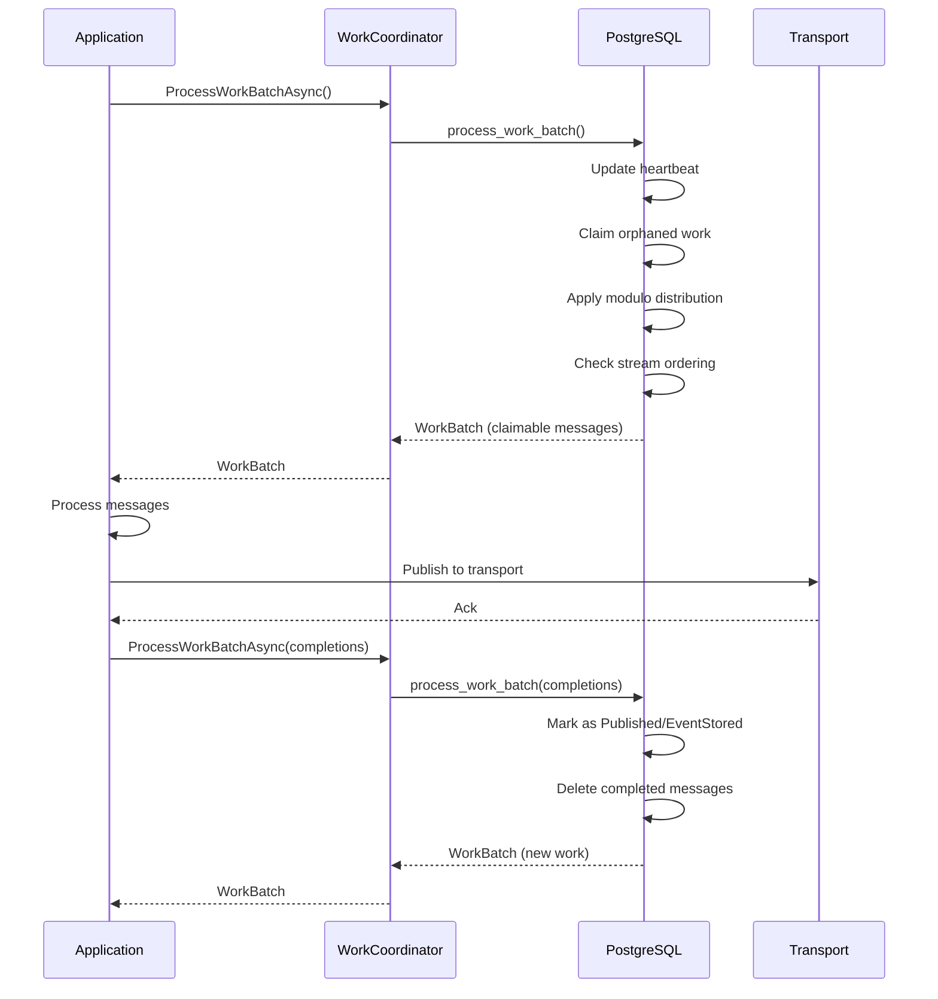
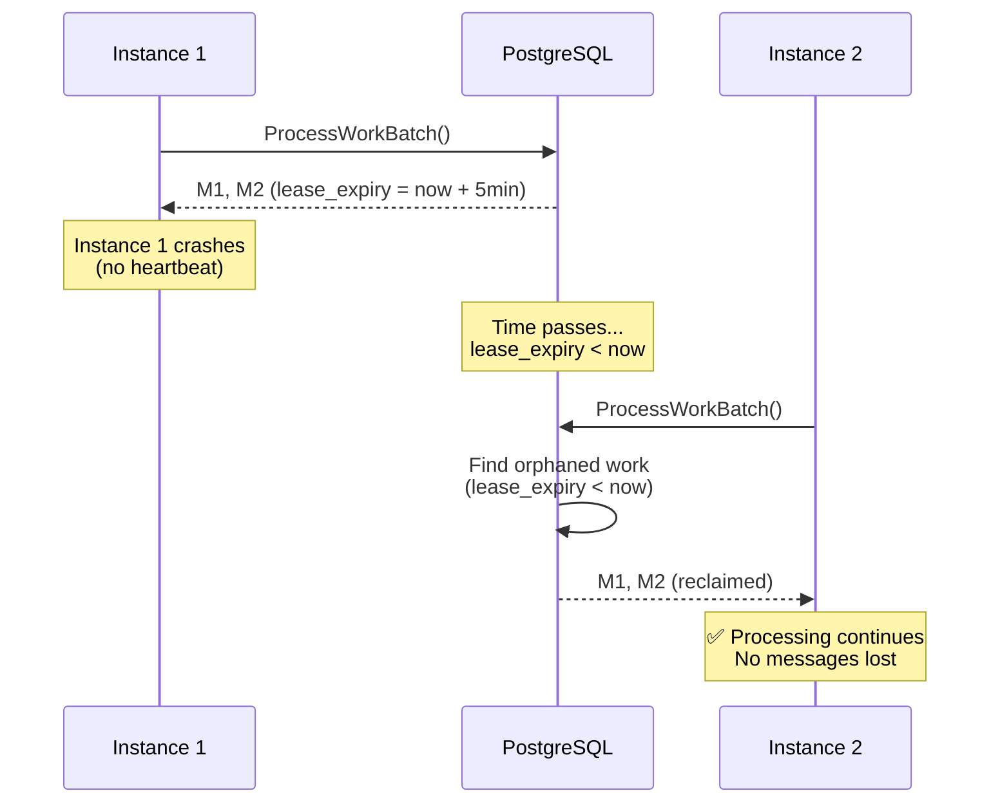

# Work Coordination

## Overview

Work coordination is the foundation of Whizbang's distributed message processing architecture. It ensures reliable, ordered, and efficient message processing across multiple service instances through lease-based coordination, partition-based distribution, and stream ordering guarantees.

## Core Concepts

### Lease-Based Coordination

Messages are claimed using time-limited leases to prevent duplicate processing and enable automatic recovery from instance failures.

**Key Properties:**
- **Lease Duration**: Configurable time window (default: 5 minutes) during which an instance has exclusive rights to process a message
- **Lease Expiry**: UTC timestamp when the lease expires
- **Orphaned Work Recovery**: Messages with expired leases can be reclaimed by any active instance
- **Atomic Claiming**: Lease acquisition happens atomically in the database via the `process_work_batch` function

### Virtual Partition Distribution

Work is distributed across instances using consistent hashing on UUIDv7 identifiers - **no partition assignments table required**.

**How It Works:**
1. Each message's `stream_id` is hashed to determine its partition number (0-9999 by default)
2. Instance ownership calculated algorithmically: `hashtext(stream_id::TEXT) % active_instance_count = hashtext(instance_id::TEXT) % active_instance_count`
3. Each message stores `instance_id` when claimed to preserve assignment
4. No `wh_partition_assignments` table - purely algorithmic

**Benefits:**
- **Fair Distribution**: Work evenly distributed via consistent hashing
- **Sticky Assignment**: Same stream always maps to same instance (until rebalancing)
- **Automatic Rebalancing**: Adding/removing instances triggers hash redistribution
- **Self-Contained**: No external state - assignment based on UUID properties
- **Fault Tolerance**: Failed instances release messages via lease expiry

### Stream Ordering Guarantees

Messages within the same stream are processed in strict temporal order, even across multiple instances.

**Ordering Rules:**
1. Messages in the same stream must be processed in `created_at` (outbox) or `received_at` (inbox) order
2. If Instance A holds message M1 from stream S, Instance B cannot claim later messages M2, M3, M4 from stream S
3. Scheduled retries block all later messages in the same stream until the scheduled time passes
4. This guarantee holds across instance failures, scaling events, and partition reassignments

## Architecture Components

### Database Tables

**`wh_service_instances`** - Active instance registry
- Tracks all service instances with heartbeat timestamps
- Used to determine active instance count for virtual partition distribution
- Stale instances (no heartbeat > threshold) are automatically removed

**`wh_outbox`** - Outbound message queue
- Messages awaiting publication to external transports
- Includes partition number, lease information, and processing status
- Done when `Published` flag is set

**`wh_inbox`** - Inbound message queue
- Messages awaiting handler invocation
- Includes deduplication tracking via `wh_message_deduplication`
- Done when `EventStored` flag is set

**`wh_message_deduplication`** - Inbox deduplication
- Permanent record of all inbox message IDs seen
- Prevents duplicate processing of the same message
- Outbox does not use this table (transactional boundary responsibility)

### PostgreSQL Function

**`process_work_batch`** - Atomic work coordination
- Single PostgreSQL function handling all coordination operations
- Minimizes database round-trips and ensures atomicity
- Returns claimable work in a single result set

**Operations Performed:**
1. Register/update instance with heartbeat
2. Clean up stale instances (expired heartbeats)
3. Mark completed/failed messages (outbox and inbox)
4. Update receptor processing and perspective checkpoints
5. Store new messages (with partition assignment)
6. Claim orphaned work (expired leases)
7. Renew leases for buffered messages
8. Return claimable work (respecting stream ordering)

**Parameters:**
- Instance identification (ID, service name, host, process ID)
- Completion/failure tracking (outbox, inbox, receptors, perspectives)
- New messages to store
- Lease renewal IDs
- Configuration (lease seconds, stale threshold, partition count)

## Processing Flow

### Normal Operation



### Failure Recovery



## Key Features

### Atomic Operations

All coordination operations happen in a single database transaction:
- Heartbeat updates
- Message completions
- Message failures
- New message storage
- Lease claims
- Work return

This ensures consistency even under high concurrency and instance failures.

### Stale Instance Detection

Instances that stop heartbeating are automatically detected and cleaned up:
- **Stale Threshold**: Default 10 minutes (configurable)
- **Heartbeat Update**: Every `ProcessWorkBatch` call updates `last_heartbeat_at`
- **Cleanup**: Stale instances deleted, their partitions released (CASCADE)

### Partition Stability

Partition ownership is stable across instance scaling:
- **New Instances**: Claim only unassigned partitions or partitions from stale instances
- **Active Instances**: Partitions are NOT reassigned from active instances
- **Modulo Distribution**: Ensures fair work distribution as instances join/leave

### Idempotency

**Inbox**: Permanent deduplication via `wh_message_deduplication` table
- Duplicate messages are rejected via `ON CONFLICT DO NOTHING`
- Ensures exactly-once processing guarantee

**Outbox**: Transactional boundary responsibility
- No deduplication table (duplicate prevention is the caller's responsibility)
- Outbox is part of the application's transaction boundary

## Configuration Options

### Lease Configuration

```csharp
await coordinator.ProcessWorkBatchAsync(
    instanceId,
    serviceName,
    hostName,
    processId,
    metadata,
    // ... other parameters
    leaseSeconds: 300,  // 5 minutes (default)
    staleThresholdSeconds: 600  // 10 minutes (default)
);
```

### Partition Configuration

```csharp
await coordinator.ProcessWorkBatchAsync(
    // ... other parameters
    partitionCount: 10000,  // Total partitions (default)
    maxPartitionsPerInstance: null  // NULL = unlimited, or set explicit limit
);
```

### Testing Configuration

For fast tests, use short lease and stale times:

```csharp
await coordinator.ProcessWorkBatchAsync(
    // ... other parameters
    leaseSeconds: 2,  // 2 seconds for fast tests
    staleThresholdSeconds: 10  // 10 seconds for fast tests
);
```

## Performance Characteristics

### Single Database Call

All coordination operations happen in one `process_work_batch` call:
- Minimizes network round-trips
- Reduces database connection overhead
- Ensures atomic consistency

### Efficient Querying

The function uses optimized queries:
- Index-based partition lookups
- Efficient NOT EXISTS checks for stream ordering
- Batch operations for completions/failures

### Scalability

Horizontal scaling through partition distribution:
- Add instances → automatic partition redistribution
- Remove instances → automatic partition reassignment
- No manual coordination required

## Related Documentation

- [Multi-Instance Coordination](multi-instance-coordination.md) - Detailed scenarios and sequence diagrams
- [Idempotency Patterns](idempotency-patterns.md) - Deduplication strategies
- [Failure Handling](failure-handling.md) - Retry scheduling and failure cascades
- [Outbox Pattern](outbox-pattern.md) - Transactional outbox implementation
- [Inbox Pattern](inbox-pattern.md) - Deduplication and handler invocation

## Implementation

### C# Interface

```csharp
public interface IWorkCoordinator<TDbContext> where TDbContext : DbContext {
    Task<WorkBatch> ProcessWorkBatchAsync(
        Guid instanceId,
        string serviceName,
        string hostName,
        int processId,
        Dictionary<string, JsonElement>? metadata,

        MessageCompletion[] outboxCompletions,
        MessageFailure[] outboxFailures,
        MessageCompletion[] inboxCompletions,
        MessageFailure[] inboxFailures,

        ReceptorProcessingCompletion[] receptorCompletions,
        ReceptorProcessingFailure[] receptorFailures,
        PerspectiveCheckpointCompletion[] perspectiveCompletions,
        PerspectiveCheckpointFailure[] perspectiveFailures,

        OutboxMessage[] newOutboxMessages,
        InboxMessage[] newInboxMessages,

        Guid[] renewOutboxLeaseIds,
        Guid[] renewInboxLeaseIds,

        WorkBatchFlags flags = WorkBatchFlags.None,
        int partitionCount = 10000,
        int? maxPartitionsPerInstance = null,
        int leaseSeconds = 300,
        int staleThresholdSeconds = 600,
        CancellationToken cancellationToken = default
    );
}
```

### PostgreSQL Implementation

See: `014_CreateProcessWorkBatchFunction.sql`

The PostgreSQL function is the authoritative implementation of all coordination logic.

## Testing

Comprehensive integration tests validate all coordination scenarios:
- Instance lifecycle (heartbeat, stale cleanup)
- Partition stability (scaling, reassignment)
- Stream ordering (cross-instance, scheduled retry)
- Idempotency (inbox deduplication, outbox transactional)
- Failure recovery (lease expiry, orphaned work)

See: `Whizbang.Data.EFCore.Postgres.Tests/EFCoreWorkCoordinatorTests.cs`

## Best Practices

### Heartbeat Frequency

Call `ProcessWorkBatchAsync` frequently to maintain heartbeat:
- Recommended: Every 30-60 seconds minimum
- Ensures instances are not marked as stale
- Enables quick partition reassignment on failures

### Lease Duration

Choose lease duration based on maximum processing time:
- Too short: Messages become orphaned during normal processing
- Too long: Delayed recovery from instance failures
- Recommended: 5 minutes (covers most processing scenarios)

### Stale Threshold

Set stale threshold to allow for temporary network issues:
- Should be significantly longer than lease duration
- Recommended: 2x lease duration minimum (10 minutes for 5-minute leases)

### Partition Count

Higher partition counts enable finer-grained distribution:
- Default: 10,000 partitions (works well for most scenarios)
- More partitions = more even distribution across instances
- Trade-off: More partition assignments to track

## Troubleshooting

### Messages Not Being Claimed

**Check:**
- Instance is heartbeating (calls `ProcessWorkBatchAsync` regularly)
- Partition ownership (is instance assigned the message's partition?)
- Stream ordering (is an earlier message blocking this message?)
- Lease status (is message already claimed by another instance?)

### Stale Instance Not Cleaned Up

**Check:**
- Last heartbeat timestamp (`wh_service_instances.last_heartbeat_at`)
- Stale threshold configuration (default: 10 minutes)
- System time synchronization across instances

### Partition Not Reassigning

**Check:**
- Instance is actually stale (heartbeat > threshold)
- Partition ownership (`wh_partition_assignments`)
- Active instance count (should redistribute partitions)

### Out-of-Order Processing

**Check:**
- Stream ID is set correctly on all messages
- Temporal order (created_at/received_at timestamps)
- Cross-instance lease coordination (NOT EXISTS logic)
