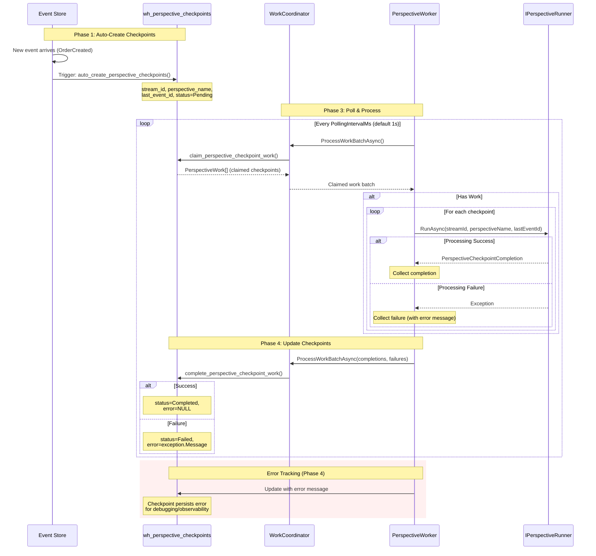
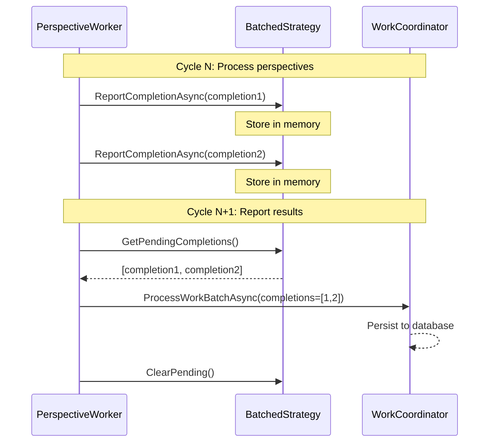
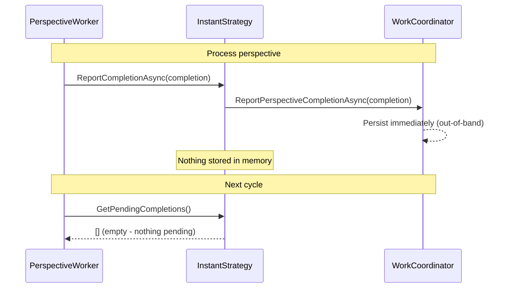

# Perspective Worker

The **PerspectiveWorker** is a background service (BackgroundService) that continuously processes perspective checkpoints by polling for new events, invoking perspective runners, and tracking progress. It implements a complete 4-phase checkpoint system with automatic creation, fuzzy type matching, checkpoint updates, and error tracking.

## Overview

### What the Perspective Worker Does

The PerspectiveWorker orchestrates the entire perspective checkpoint lifecycle:

1. **Polls** for perspective checkpoint work via `IWorkCoordinator`
2. **Resolves** appropriate `IPerspectiveRunner` for each checkpoint
3. **Invokes** runners to process events since last checkpoint
4. **Tracks** completions and failures
5. **Updates** checkpoint records with latest event IDs and errors
6. **Coordinates** with other instances via lease-based distribution

**Key Insight**: The PerspectiveWorker is the runtime engine that makes perspective checkpoints work. It transforms the compile-time perspective discovery (source generators) into a running system that processes events reliably.

---

## The 4-Phase Checkpoint System

The PerspectiveWorker implements a complete checkpoint system built across four database migrations:

### **Phase 1: Auto-Creation on Event Arrival** (Migration 004)

When a new event arrives in the event store, perspective checkpoints are **automatically created** for all matching perspectives.

```sql
-- Migration 004: Auto-create checkpoints when events arrive
CREATE OR REPLACE FUNCTION auto_create_perspective_checkpoints()
RETURNS TRIGGER AS $$
BEGIN
  -- Find all perspectives that handle this event type (fuzzy matching)
  INSERT INTO wh_perspective_checkpoints (
    stream_id,
    perspective_name,
    last_event_id,
    status,
    created_at,
    updated_at
  )
  SELECT
    NEW.stream_id,
    pm.perspective_name,
    NEW.event_id,
    'Pending',  -- Ready for processing
    NOW(),
    NOW()
  FROM wh_perspective_mappings pm
  WHERE pm.event_type_pattern ~* ('^' || NEW.event_type || '$')  -- Fuzzy type match
  ON CONFLICT (stream_id, perspective_name) DO NOTHING;

  RETURN NEW;
END;
$$ LANGUAGE plpgsql;
```

**What this means**:
- Event `OrderCreated` arrives → All perspectives handling `OrderCreated` get a checkpoint
- Checkpoint status starts as `Pending` (ready to process)
- If checkpoint already exists, skip (idempotent)

### **Phase 2: Fuzzy Type Matching** (Migration 004)

Perspectives are matched to events using **fuzzy type matching** via `wh_perspective_mappings`:

```sql
-- Perspective mappings table (populated by source generator registration)
CREATE TABLE wh_perspective_mappings (
  perspective_name VARCHAR(200) NOT NULL,
  event_type_pattern VARCHAR(500) NOT NULL,  -- Regex pattern for matching
  PRIMARY KEY (perspective_name, event_type_pattern)
);

-- Example data:
-- perspective_name            | event_type_pattern
-- ----------------------------+-------------------
-- OrderSummaryPerspective     | .*OrderCreated.*
-- CustomerStatsPerspective    | .*Order.*
-- InventoryPerspective        | .*OrderCreated.*
```

**Why fuzzy matching?**
- Handles event type name variations (`OrderCreated` vs `MyApp.Events.OrderCreated`)
- Supports namespace changes without re-registering perspectives
- Flexible enough for generator-discovered perspectives

### **Phase 3: Checkpoint Processing** (Migration 005)

The PerspectiveWorker **polls** for pending checkpoints and processes them:

```sql
-- Migration 005: Claim checkpoint work for processing
CREATE OR REPLACE FUNCTION claim_perspective_checkpoint_work(
  p_instance_id UUID,
  p_service_name VARCHAR(255),
  p_max_checkpoints INT DEFAULT 10
)
RETURNS TABLE (
  stream_id UUID,
  perspective_name VARCHAR(200),
  last_processed_event_id UUID,
  status SMALLINT
) AS $$
BEGIN
  -- Claim up to p_max_checkpoints pending checkpoints
  -- Uses lease-based coordination to prevent conflicts
  RETURN QUERY
  UPDATE wh_perspective_checkpoints
  SET
    instance_id = p_instance_id,
    service_name = p_service_name,
    lease_expiry = NOW() + INTERVAL '5 minutes',
    status = 'Processing'
  WHERE (stream_id, perspective_name) IN (
    SELECT stream_id, perspective_name
    FROM wh_perspective_checkpoints
    WHERE status = 'Pending'
       OR (status = 'Processing' AND lease_expiry < NOW())  -- Reclaim expired leases
    ORDER BY created_at
    LIMIT p_max_checkpoints
    FOR UPDATE SKIP LOCKED  -- Prevents conflicts between workers
  )
  RETURNING stream_id, perspective_name, last_event_id, status;
END;
$$ LANGUAGE plpgsql;
```

**Workflow**:
1. Worker polls via `IWorkCoordinator.ProcessWorkBatchAsync()`
2. Work Coordinator calls `claim_perspective_checkpoint_work()`
3. Worker receives checkpoints to process
4. Worker invokes `IPerspectiveRunner.RunAsync()` for each checkpoint
5. Runner processes events since `last_processed_event_id`
6. Worker collects completions/failures

### **Phase 4: Error Tracking** (Migration 005a)

When processing completes (success or failure), the checkpoint is **updated** with results:

```sql
-- Migration 005a: Complete checkpoint work (with error tracking)
CREATE OR REPLACE FUNCTION complete_perspective_checkpoint_work(
  p_stream_id UUID,
  p_perspective_name VARCHAR(200),
  p_last_event_id UUID,
  p_status SMALLINT,
  p_error_message TEXT DEFAULT NULL  -- NEW: Error tracking
)
RETURNS VOID AS $$
BEGIN
  UPDATE wh_perspective_checkpoints
  SET
    last_event_id = p_last_event_id,
    status = p_status,
    error = p_error_message,  -- NEW: Persisting error messages
    updated_at = NOW(),
    instance_id = NULL,  -- Release lease
    lease_expiry = NULL
  WHERE stream_id = p_stream_id
    AND perspective_name = p_perspective_name;
END;
$$ LANGUAGE plpgsql;
```

**Error Handling**:
- **Success**: Status = `Completed`, error = NULL
- **Failure**: Status = `Failed`, error = exception message
- Failed checkpoints are **retried** on next poll (status = `Pending` again)
- Error messages are **persisted** for debugging and observability

---

## Perspective Checkpoint Processing Flow



**Key Phases**:
1. **Phase 1** (Auto-Create): Event arrives → checkpoints auto-created
2. **Phase 2** (Fuzzy Match): Perspectives matched via regex patterns
3. **Phase 3** (Process): Worker polls → claims → processes → collects results
4. **Phase 4** (Track): Results persisted (completions or errors)

---

## Startup Processing

The PerspectiveWorker processes pending checkpoints **IMMEDIATELY** on startup (before the first polling delay):

**PerspectiveWorker.cs:82-94**:
```csharp
// Process any pending perspective checkpoints IMMEDIATELY on startup (before first polling delay)
try {
  _logger.LogDebug("Checking for pending perspective checkpoints on startup...");
  var isDatabaseReady = await _databaseReadinessCheck.IsReadyAsync(stoppingToken);
  if (isDatabaseReady) {
    await ProcessWorkBatchAsync(stoppingToken);
    _logger.LogDebug("Initial perspective checkpoint processing complete");
  } else {
    _logger.LogWarning("Database not ready on startup - skipping initial perspective checkpoint processing");
  }
} catch (Exception ex) when (ex is not OperationCanceledException) {
  _logger.LogError(ex, "Error processing initial perspective checkpoints on startup");
}
```

**Why important?**
- ✅ **Immediate Processing**: No delay waiting for first poll interval
- ✅ **Startup Responsiveness**: Events processed as soon as worker starts
- ✅ **Database Coordination**: Waits for database readiness before processing
- ✅ **Graceful Failure**: Logs error but continues (doesn't crash worker)

**Example Timeline**:
```
t=0ms:    Worker starts
t=5ms:    Check database readiness → Ready
t=10ms:   ProcessWorkBatchAsync() → 5 checkpoints claimed
t=500ms:  All 5 checkpoints processed
t=1000ms: First regular poll begins (PollingIntervalMs)
```

---

## Database Readiness Checks

The PerspectiveWorker integrates with `IDatabaseReadinessCheck` to coordinate startup:

**PerspectiveWorker.cs:98-121**:
```csharp
while (!stoppingToken.IsCancellationRequested) {
  try {
    // Check database readiness before attempting work coordinator call
    var isDatabaseReady = await _databaseReadinessCheck.IsReadyAsync(stoppingToken);
    if (!isDatabaseReady) {
      // Database not ready - skip ProcessWorkBatchAsync
      Interlocked.Increment(ref _consecutiveDatabaseNotReadyChecks);

      _logger.LogInformation(
        "Database not ready, skipping perspective checkpoint processing (consecutive checks: {ConsecutiveCount})",
        _consecutiveDatabaseNotReadyChecks
      );

      // Warn if database has been continuously unavailable
      if (_consecutiveDatabaseNotReadyChecks > 10) {
        _logger.LogWarning(
          "Database not ready for {ConsecutiveCount} consecutive polling cycles. Perspective worker is paused.",
          _consecutiveDatabaseNotReadyChecks
        );
      }

      await Task.Delay(_options.PollingIntervalMilliseconds, stoppingToken);
      continue;
    }

    // Database is ready - reset consecutive counter
    Interlocked.Exchange(ref _consecutiveDatabaseNotReadyChecks, 0);

    await ProcessWorkBatchAsync(stoppingToken);
  } catch (Exception ex) when (ex is not OperationCanceledException) {
    _logger.LogError(ex, "Error processing perspective checkpoints");
  }
}
```

**Pattern**:
- Check database readiness **before** attempting work coordination
- If not ready, **skip processing** and wait
- Track **consecutive failures** for observability
- **Reset counter** when database becomes ready

**Use Cases**:
- **Startup**: Database not yet initialized (migrations pending)
- **Maintenance**: Database temporarily unavailable (connection pool exhausted)
- **Failure**: Database down (network issue, server restart)

See [Database Readiness](database-readiness.md) for full details on `IDatabaseReadinessCheck` pattern.

---

## Error Tracking & Retry

The PerspectiveWorker implements comprehensive error tracking:

**PerspectiveWorker.cs:233-248**:
```csharp
} catch (Exception ex) {
  _logger.LogError(
    ex,
    "Error processing perspective checkpoint: {PerspectiveName} for stream {StreamId}",
    perspectiveWork.PerspectiveName,
    perspectiveWork.StreamId
  );

  _failures.Add(new PerspectiveCheckpointFailure {
    StreamId = perspectiveWork.StreamId,
    PerspectiveName = perspectiveWork.PerspectiveName,
    LastEventId = perspectiveWork.LastProcessedEventId ?? Guid.Empty,
    Status = PerspectiveProcessingStatus.Failed,
    Error = ex.Message  // Error message captured here
  });
}
```

**Error Workflow**:
1. Exception thrown during perspective processing
2. Error logged with full context (stream ID, perspective name)
3. Failure record created with **error message**
4. Next poll: Worker reports failure to Work Coordinator
5. Work Coordinator persists error to `wh_perspective_checkpoints.error` column
6. Checkpoint status set to `Failed`
7. Future poll: Checkpoint retried (status reset to `Pending`)

**Example Error Record**:
```sql
-- wh_perspective_checkpoints after failure
stream_id                           | perspective_name           | status | error
------------------------------------|----------------------------|--------|------------------
order-abc-123                       | OrderSummaryPerspective    | Failed | Null reference exception: customerId
```

**Retry Strategy**:
- Failed checkpoints are **automatically retried** on next poll
- No manual intervention required
- Error message persisted for debugging
- Observability: Monitor `status='Failed'` count

---

## Lease-Based Coordination

The PerspectiveWorker uses **lease-based coordination** to distribute work across multiple instances:

### How Leases Work

**Claim**:
```sql
-- Worker A claims checkpoint
UPDATE wh_perspective_checkpoints
SET
    instance_id = 'worker-a-uuid',
    service_name = 'OrderService',
    lease_expiry = NOW() + INTERVAL '5 minutes',
    status = 'Processing'
WHERE (stream_id, perspective_name) = ('order-123', 'OrderSummaryPerspective')
```

**Release** (on completion):
```sql
-- Worker A completes and releases
UPDATE wh_perspective_checkpoints
SET
    instance_id = NULL,
    lease_expiry = NULL,
    status = 'Completed',
    last_event_id = 'event-uuid-003'
WHERE (stream_id, perspective_name) = ('order-123', 'OrderSummaryPerspective')
```

**Reclaim** (on lease expiry):
```sql
-- Worker B reclaims expired lease (5 minutes passed)
UPDATE wh_perspective_checkpoints
SET
    instance_id = 'worker-b-uuid',
    service_name = 'OrderService',
    lease_expiry = NOW() + INTERVAL '5 minutes',
    status = 'Processing'
WHERE (stream_id, perspective_name) = ('order-123', 'OrderSummaryPerspective')
  AND lease_expiry < NOW()  -- Lease expired
```

**Benefits**:
- ✅ **Fault Tolerance**: If worker crashes, lease expires and work is reclaimed
- ✅ **Scalability**: Multiple workers process different checkpoints simultaneously
- ✅ **No Conflicts**: `FOR UPDATE SKIP LOCKED` prevents duplicate processing
- ✅ **Observability**: `instance_id` tracks which worker is processing

---

## Configuration

**PerspectiveWorkerOptions.cs**:
```csharp
public class PerspectiveWorkerOptions {
  /// <summary>
  /// Milliseconds to wait between polling for perspective checkpoint work.
  /// Default: 1000 (1 second)
  /// </summary>
  public int PollingIntervalMilliseconds { get; set; } = 1000;

  /// <summary>
  /// Lease duration in seconds.
  /// Perspective checkpoints claimed will be locked for this duration.
  /// Default: 300 (5 minutes)
  /// </summary>
  public int LeaseSeconds { get; set; } = 300;

  /// <summary>
  /// Stale instance threshold in seconds.
  /// Instances that haven't sent a heartbeat for this duration will be removed.
  /// Default: 600 (10 minutes)
  /// </summary>
  public int StaleThresholdSeconds { get; set; } = 600;

  /// <summary>
  /// Keep completed checkpoints for debugging (default: false).
  /// When enabled, completed checkpoints are preserved instead of deleted.
  /// </summary>
  public bool DebugMode { get; set; } = false;

  /// <summary>
  /// Number of partitions for work distribution.
  /// Default: 10000
  /// </summary>
  public int PartitionCount { get; set; } = 10_000;

  /// <summary>
  /// Number of consecutive empty work polls required to trigger OnWorkProcessingIdle callback.
  /// Default: 2
  /// </summary>
  public int IdleThresholdPolls { get; set; } = 2;

  /// <summary>
  /// Number of events to process in a single batch before saving model + checkpoint.
  /// Higher values = fewer database writes but longer transactions.
  /// Lower values = more frequent saves but higher DB overhead.
  /// Default: 100
  /// </summary>
  public int PerspectiveBatchSize { get; set; } = 100;
}
```

**Configuration Example**:
```csharp
// Program.cs
builder.Services.Configure<PerspectiveWorkerOptions>(options => {
  options.PollingIntervalMilliseconds = 500;  // Poll every 500ms (more responsive)
  options.LeaseSeconds = 600;  // 10-minute leases (longer processing time)
  options.DebugMode = true;  // Keep completed checkpoints for debugging
  options.PerspectiveBatchSize = 50;  // Smaller batches for faster commits
});
```

**Tuning Guidelines**:
- **Low Latency**: `PollingIntervalMs = 100` (poll every 100ms)
- **High Throughput**: `PerspectiveBatchSize = 1000` (larger batches)
- **Fault Tolerance**: `LeaseSeconds = 60` (shorter leases, faster recovery)
- **Long Processing**: `LeaseSeconds = 1800` (30-minute leases for slow perspectives)

---

## Completion Strategy Pattern

The PerspectiveWorker uses a **completion strategy pattern** to control when and how perspective checkpoint results are reported to the Work Coordinator. This provides flexibility for different environments (production vs testing) and processing patterns.

### Strategy Interface

**IPerspectiveCompletionStrategy**:
```csharp
public interface IPerspectiveCompletionStrategy {
  /// <summary>
  /// Reports a perspective checkpoint completion.
  /// </summary>
  Task ReportCompletionAsync(
    PerspectiveCheckpointCompletion completion,
    IWorkCoordinator coordinator,
    CancellationToken cancellationToken);

  /// <summary>
  /// Reports a perspective checkpoint failure.
  /// </summary>
  Task ReportFailureAsync(
    PerspectiveCheckpointFailure failure,
    IWorkCoordinator coordinator,
    CancellationToken cancellationToken);

  /// <summary>
  /// Gets pending completions that have been collected but not yet reported.
  /// </summary>
  PerspectiveCheckpointCompletion[] GetPendingCompletions();

  /// <summary>
  /// Gets pending failures that have been collected but not yet reported.
  /// </summary>
  PerspectiveCheckpointFailure[] GetPendingFailures();

  /// <summary>
  /// Clears all pending completions and failures.
  /// </summary>
  void ClearPending();
}
```

### Built-In Strategies

#### BatchedCompletionStrategy (Default)

**Purpose**: Collects completions in memory and reports them on the **next poll cycle**.

**How it works**:


**When to use**:
- ✅ **Production environments** - Minimizes database round-trips
- ✅ **High throughput** - Batches multiple completions per poll
- ✅ **Normal latency tolerance** - Completions appear after next poll cycle

**Example**:
```csharp
// Program.cs (production)
builder.Services.AddHostedService<PerspectiveWorker>();  // Uses BatchedCompletionStrategy by default
```

**Trade-offs**:
- **PRO**: Fewer database calls (better performance)
- **CON**: Results delayed until next poll cycle (~1 second with default polling interval)

#### InstantCompletionStrategy

**Purpose**: Reports completions **immediately** via out-of-band coordinator methods.

**How it works**:


**When to use**:
- ✅ **Test environments** - Immediate consistency for assertions
- ✅ **Low latency requirements** - Results visible immediately
- ✅ **Interactive scenarios** - User-facing queries need instant data

**Example**:
```csharp
// Test fixture or low-latency service
var strategy = new InstantCompletionStrategy();
var worker = new PerspectiveWorker(
  instanceProvider,
  scopeFactory,
  Options.Create(new PerspectiveWorkerOptions { PollingIntervalMilliseconds = 100 }),
  completionStrategy: strategy,  // ← Inject instant strategy
  databaseReadinessCheck,
  logger
);
```

**Trade-offs**:
- **PRO**: Zero delay - completions visible immediately
- **CON**: More database calls (one per completion)

### Out-of-Band Reporting Methods

The `InstantCompletionStrategy` uses lightweight out-of-band methods on `IWorkCoordinator`:

**ReportPerspectiveCompletionAsync**:
```csharp
// Lightweight method that ONLY updates perspective checkpoint
// Does NOT affect heartbeats, work claiming, or other coordination
await coordinator.ReportPerspectiveCompletionAsync(
  new PerspectiveCheckpointCompletion {
    StreamId = streamId,
    PerspectiveName = "OrderSummaryPerspective",
    LastEventId = lastEventId,
    Status = PerspectiveProcessingStatus.Completed
  },
  cancellationToken
);

// Calls SQL function directly:
// SELECT complete_perspective_checkpoint_work(
//   stream_id, perspective_name, last_event_id, status, error
// );
```

**ReportPerspectiveFailureAsync**:
```csharp
await coordinator.ReportPerspectiveFailureAsync(
  new PerspectiveCheckpointFailure {
    StreamId = streamId,
    PerspectiveName = "OrderSummaryPerspective",
    LastEventId = lastEventId,
    Status = PerspectiveProcessingStatus.Failed,
    Error = ex.Message
  },
  cancellationToken
);
```

**Key Difference from `ProcessWorkBatchAsync`**:
- **Out-of-band methods**: ONLY update perspective checkpoint (fast, focused)
- **ProcessWorkBatchAsync**: Updates checkpoints + heartbeats + claims work + renews leases (comprehensive, heavier)

### Choosing a Strategy

| Factor | BatchedCompletionStrategy | InstantCompletionStrategy |
|--------|---------------------------|---------------------------|
| **Database Load** | ✅ Low (batched) | ⚠️ Higher (per-completion) |
| **Latency** | ⚠️ Delayed (~1 poll cycle) | ✅ Immediate |
| **Best For** | Production | Tests, low-latency |
| **Throughput** | ✅ High | ⚠️ Lower |
| **Simplicity** | ✅ Default behavior | Requires injection |

**General Guidance**:
- **Production**: Use `BatchedCompletionStrategy` (default) for best performance
- **Tests**: Use `InstantCompletionStrategy` for immediate consistency
- **Low-Latency Services**: Use `InstantCompletionStrategy` if sub-second visibility is required

### Custom Strategies

You can implement custom strategies for advanced scenarios:

```csharp
public sealed class UnitOfWorkCompletionStrategy : IPerspectiveCompletionStrategy {
  private readonly List<PerspectiveCheckpointCompletion> _completions = [];
  private readonly List<PerspectiveCheckpointFailure> _failures = [];
  private readonly int _batchSize;

  public UnitOfWorkCompletionStrategy(int batchSize = 10) {
    _batchSize = batchSize;
  }

  public async Task ReportCompletionAsync(
    PerspectiveCheckpointCompletion completion,
    IWorkCoordinator coordinator,
    CancellationToken cancellationToken) {
    _completions.Add(completion);

    // Flush when batch size reached
    if (_completions.Count >= _batchSize) {
      await FlushAsync(coordinator, cancellationToken);
    }
  }

  // ... implement FlushAsync, GetPendingCompletions, etc.
}
```

**Use Cases**:
- **Time-based batching**: Flush after N seconds
- **Unit-of-work batching**: Flush after logical group of work
- **Adaptive batching**: Adjust batch size based on load
- **Custom persistence**: Write to alternative storage (Redis, etc.)

---

## Integration with Work Coordinator

The PerspectiveWorker calls `IWorkCoordinator.ProcessWorkBatchAsync()` on every poll:

**PerspectiveWorker.cs:161-184**:
```csharp
var workBatch = await workCoordinator.ProcessWorkBatchAsync(
  _instanceProvider.InstanceId,
  _instanceProvider.ServiceName,
  _instanceProvider.HostName,
  _instanceProvider.ProcessId,
  metadata: _options.InstanceMetadata,
  outboxCompletions: [],
  outboxFailures: [],
  inboxCompletions: [],
  inboxFailures: [],
  receptorCompletions: [],
  receptorFailures: [],
  perspectiveCompletions: perspectiveCompletions,  // ← Previous results
  perspectiveFailures: perspectiveFailures,        // ← Previous errors
  newOutboxMessages: [],
  newInboxMessages: [],
  renewOutboxLeaseIds: [],
  renewInboxLeaseIds: [],
  flags: _options.DebugMode ? WorkBatchFlags.DebugMode : WorkBatchFlags.None,
  partitionCount: _options.PartitionCount,
  leaseSeconds: _options.LeaseSeconds,
  staleThresholdSeconds: _options.StaleThresholdSeconds,
  cancellationToken: cancellationToken
);
```

**What Happens**:
1. **Report Results**: Perspective completions/failures from previous poll
2. **Heartbeat**: Update instance heartbeat (alive signal)
3. **Claim Work**: Get new perspective checkpoints to process
4. **Return Batch**: Work Coordinator returns `PerspectiveWork[]`

**Atomic Operations**:
- All operations happen in a **single database transaction**
- Completions are persisted **atomically** with new work claims
- Prevents data loss even if worker crashes mid-poll

See [Work Coordinator](../messaging/work-coordinator.md) for full details on atomic batch processing.

---

## Observability

### Metrics

**PerspectiveWorker.cs exposes**:
```csharp
public int ConsecutiveDatabaseNotReadyChecks { get; }  // Database availability tracking
public int ConsecutiveEmptyPolls { get; }              // Work availability tracking
public bool IsIdle { get; }                            // Worker state
```

**Work Coordinator provides**:
```csharp
workBatch.PerspectiveWork.Count  // Number of checkpoints claimed
perspectiveCompletions.Length    // Number of checkpoints completed
perspectiveFailures.Length       // Number of checkpoints failed
```

**Example Logging**:
```csharp
_logger.LogInformation(
  "Perspective batch: Claimed={Claimed}, completed={Completed}, failed={Failed}",
  workBatch.PerspectiveWork.Count,
  perspectiveCompletions.Length,
  perspectiveFailures.Length
);
```

### Events

**OnWorkProcessingStarted**:
- Fired when work appears after idle state
- Indicates perspective processing has begun

**OnWorkProcessingIdle**:
- Fired after N consecutive empty polls (default 2)
- Indicates all checkpoints are caught up
- Useful for integration tests (wait for idle before asserting)

**Example Usage**:
```csharp
var worker = serviceProvider.GetRequiredService<PerspectiveWorker>();

worker.OnWorkProcessingIdle += () => {
  Console.WriteLine("All perspective checkpoints processed!");
};
```

### Database Queries

**Check checkpoint status**:
```sql
SELECT
  perspective_name,
  COUNT(*) FILTER (WHERE status = 'Pending') AS pending,
  COUNT(*) FILTER (WHERE status = 'Processing') AS processing,
  COUNT(*) FILTER (WHERE status = 'Completed') AS completed,
  COUNT(*) FILTER (WHERE status = 'Failed') AS failed
FROM wh_perspective_checkpoints
GROUP BY perspective_name;
```

**Find failed checkpoints**:
```sql
SELECT
  stream_id,
  perspective_name,
  error,
  updated_at
FROM wh_perspective_checkpoints
WHERE status = 'Failed'
ORDER BY updated_at DESC;
```

**Check worker health**:
```sql
SELECT
  instance_id,
  service_name,
  last_heartbeat,
  NOW() - last_heartbeat AS time_since_heartbeat
FROM wh_service_instances
WHERE service_name = 'PerspectiveWorker'
ORDER BY last_heartbeat DESC;
```

---

## Best Practices

### DO ✅

- ✅ **Start worker immediately** - Process pending checkpoints on startup
- ✅ **Check database readiness** - Coordinate with `IDatabaseReadinessCheck`
- ✅ **Track errors** - Persist error messages for debugging
- ✅ **Monitor failed checkpoints** - Alert on `status='Failed'` count
- ✅ **Use appropriate lease duration** - Balance fault tolerance vs processing time
- ✅ **Configure batch size** - Tune `PerspectiveBatchSize` for your workload
- ✅ **Log poll results** - Track claimed/completed/failed counts
- ✅ **Use DebugMode** - Enable for troubleshooting in non-production

### DON'T ❌

- ❌ Skip database readiness checks (worker will fail on startup)
- ❌ Set lease duration too short (thrashing, duplicate work)
- ❌ Set lease duration too long (slow recovery from crashes)
- ❌ Ignore failed checkpoints (silent data loss)
- ❌ Skip monitoring (blind to failures)
- ❌ Process checkpoints outside worker (breaks coordination)
- ❌ Manually modify checkpoint records (breaks consistency)

---

## Troubleshooting

### Problem: Checkpoints Not Processing

**Symptoms**: `status='Pending'` checkpoints remain unprocessed.

**Causes**:
1. PerspectiveWorker not running
2. Database not ready (`IDatabaseReadinessCheck.IsReadyAsync() = false`)
3. `IPerspectiveRunnerRegistry` not registered
4. No `IPerspectiveRunner` found for perspective name

**Solution**:
```csharp
// 1. Ensure worker is registered
builder.Services.AddHostedService<PerspectiveWorker>();

// 2. Ensure database is ready
builder.Services.AddSingleton<IDatabaseReadinessCheck, PostgresDatabaseReadinessCheck>();

// 3. Ensure perspective runners are registered
builder.Services.AddPerspectiveRunners();  // Generated by source generator

// 4. Check logs for missing runners
// "No IPerspectiveRunner found for perspective {PerspectiveName}"
```

### Problem: Duplicate Processing

**Symptoms**: Same checkpoint processed multiple times.

**Causes**:
1. Multiple workers without lease coordination
2. Lease duration too short
3. Clock skew between database and application servers

**Solution**:
```csharp
// Increase lease duration
builder.Services.Configure<PerspectiveWorkerOptions>(options => {
  options.LeaseSeconds = 600;  // 10 minutes (longer)
});

// Ensure `FOR UPDATE SKIP LOCKED` is used (built into migration 005)
// Check database server time vs application server time
SELECT NOW();  -- Database time
Console.WriteLine(DateTimeOffset.UtcNow);  -- Application time
```

### Problem: Failed Checkpoints Accumulating

**Symptoms**: Many checkpoints with `status='Failed'`.

**Causes**:
1. Perspective runner throwing exceptions
2. Invalid data in events
3. Database connection issues
4. Timeout during processing

**Solution**:
```sql
-- Find most common errors
SELECT
  error,
  COUNT(*) AS count
FROM wh_perspective_checkpoints
WHERE status = 'Failed'
GROUP BY error
ORDER BY count DESC;

-- Fix underlying issue (e.g., null reference, invalid data)
-- Clear failed checkpoints to retry
UPDATE wh_perspective_checkpoints
SET status = 'Pending', error = NULL
WHERE status = 'Failed';
```

### Problem: Only One Service Processing Work (Multi-Service Setup)

:::new{type="fix" version="v0.1.1"}
**FIXED IN v0.1.1**: This issue was resolved by ensuring all SQL migrations properly qualify `wh_active_streams` table references with the `__SCHEMA__` placeholder. Each service now has schema-qualified `wh_active_streams` tables (e.g., `inventory.wh_active_streams`, `bff.wh_active_streams`), allowing multiple services to independently process the same streams, matching Azure Service Bus behavior where each service has its own subscription.

**Historical Context**: Earlier versions had unqualified `wh_active_streams` references causing a "last writer wins" race condition where both services would update a shared table, leaving only the last writer with stream ownership.

**Affected Migrations**: 008_1 (table creation), 020 (store_outbox_messages), 021 (store_inbox_messages), 023 (cleanup_completed_streams), 024-026 (claim_orphaned_*), 027 (claim_orphaned_perspective_events).
:::

**Symptoms**: In a multi-service setup (e.g., InventoryWorker and BFF), only one service processes perspective work while the other remains idle. Perspective tables for the idle service remain empty.

**Causes**:
1. **Shared instance ID** - Multiple services using the same `IServiceInstanceProvider.InstanceId`
2. Work coordinator treats multiple services as a single instance
3. Only one service claims and processes work

**Diagnostic Steps**:
```csharp
// Enable diagnostic logging to check instance IDs
builder.Logging.SetMinimumLevel(LogLevel.Debug);

// Check logs for instance ID collision
// Look for: "Perspective worker starting: Instance {InstanceId} ({ServiceName}@{HostName})"
// If multiple services show the same InstanceId, you have a collision
```

**Solution**:
```csharp
// WRONG: Shared instance ID (causes collision)
private readonly Guid _sharedInstanceId = Guid.CreateVersion7();
builder.Services.AddSingleton<IServiceInstanceProvider>(sp =>
  new TestServiceInstanceProvider(_sharedInstanceId, "InventoryWorker"));  // Same ID for both!

// CORRECT: Unique instance IDs per service
private readonly Guid _inventoryInstanceId = Guid.CreateVersion7();
private readonly Guid _bffInstanceId = Guid.CreateVersion7();

// InventoryWorker host
inventoryBuilder.Services.AddSingleton<IServiceInstanceProvider>(sp =>
  new TestServiceInstanceProvider(_inventoryInstanceId, "InventoryWorker"));

// BFF host
bffBuilder.Services.AddSingleton<IServiceInstanceProvider>(sp =>
  new TestServiceInstanceProvider(_bffInstanceId, "BFF.API"));
```

**Verification**:
```sql
-- Check that both services are active
SELECT
  instance_id,
  service_name,
  last_heartbeat
FROM wh_service_instances
WHERE service_name IN ('InventoryWorker', 'BFF.API')
ORDER BY service_name;

-- Should show TWO distinct instance_id values (one per service)
```

**Related**: This issue commonly occurs in test fixtures where multiple services share a single test host. In production, each service typically runs in its own process with a unique instance ID.

---

## Further Reading

**Related Workers**:
- [Execution Lifecycle](execution-lifecycle.md) - Startup/shutdown coordination
- [Database Readiness](database-readiness.md) - Database dependency checks

**Core Concepts**:
- [Perspectives](../components/perspectives.md) - What perspectives are
- [Perspective Discovery](../source-generators/perspective-discovery.md) - Compile-time discovery

**Messaging**:
- [Work Coordinator](../messaging/work-coordinator.md) - Atomic batch processing
- [Outbox Pattern](../messaging/outbox-pattern.md) - Reliable event publishing

**Data Access**:
- [Event Store](../data/event-store.md) - Event sourcing and replay
- [Perspectives Storage](../data/perspectives-storage.md) - Read model schema design

**Extensibility**:
- [Custom Perspectives](../extensibility/custom-perspectives.md) - Advanced perspective patterns

---

*Version 0.1.0 - Foundation Release | Last Updated: 2025-12-21*
