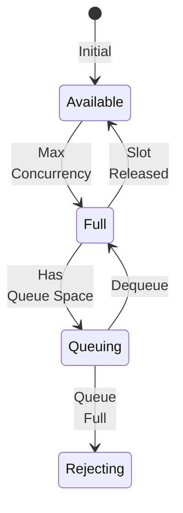

# Policy Enhancements


## Version History

:::updated
**Enhanced in v0.2.0**: 
- Policy composition for combining multiple policies
- Bulkhead isolation for resource protection
- Rate limiting with token buckets
- Dead letter queue support
:::

:::planned
**Coming in v0.3.0**: 
- Stateful policies with persistence
- Policy metrics and monitoring
- Dynamic policy configuration

[See state management features →](../../v0.3.0/features/policies.md)
:::

## New Features in v0.2.0

### Policy Composition

:::new
Combine multiple policies into reusable sets:
:::

```csharp
// Define policy sets
services.AddPolicySet("Resilient", policies => {
    policies.AddRetry(3, BackoffStrategy.Exponential);
    policies.AddTimeout(5000);
    policies.AddCircuitBreaker(0.5, 10, 5, 30);
    policies.AddCache(300);
});

services.AddPolicySet("RateLimited", policies => {
    policies.AddRateLimit(100, TimeSpan.FromMinute(1));
    policies.AddBulkhead(10, 20);  // 10 concurrent, 20 queued
});

// Apply policy sets
[PolicySet("Resilient")]
public class OrderReceptor : IReceptor<CreateOrder> { }

// Combine sets
[PolicySet("Resilient", "RateLimited")]
public class ExternalServiceReceptor : IReceptor<CallExternalService> { }
```

### Bulkhead Isolation

:::new
Prevent resource exhaustion with bulkhead isolation:
:::

```csharp
[Bulkhead(
    MaxConcurrency = 10,
    MaxQueuedActions = 20,
    TimeoutMs = 30000
)]
public class DatabaseReceptor : IReceptor<QueryDatabase> {
    public QueryResult Receive(QueryDatabase cmd) {
        // Max 10 concurrent executions
        // Queue up to 20 additional requests
        // Reject if queue full
        return ExecuteQuery(cmd);
    }
}

// Advanced configuration
[Bulkhead(
    MaxConcurrency = 5,
    MaxQueuedActions = 10,
    OnReject = BulkheadRejectStrategy.ThrowException,
    Name = "DatabaseBulkhead"  // Named for monitoring
)]
public class CriticalReceptor : IReceptor<CriticalCommand> { }
```

#### Bulkhead States



### Rate Limiting

:::new
Control request rates with token bucket algorithm:
:::

```csharp
// Simple rate limit
[RateLimit(100, TimeSpan.FromMinute(1))]  // 100 requests per minute
public class ApiReceptor : IReceptor<ApiCall> { }

// Advanced rate limiting
[RateLimit(
    TokenLimit = 1000,
    Window = TimeSpan.FromHour(1),
    ReplenishRate = 100,  // Add 100 tokens per window
    BurstSize = 50,       // Allow burst of 50
    OnReject = RateLimitRejectStrategy.Queue
)]
public class ThrottledReceptor : IReceptor<ThrottledCommand> { }

// Multiple rate limits (all must pass)
[RateLimit(10, TimeSpan.FromSecond(1))]   // 10 per second
[RateLimit(100, TimeSpan.FromMinute(1))]  // 100 per minute
[RateLimit(1000, TimeSpan.FromHour(1))]   // 1000 per hour
public class MultiLimitReceptor : IReceptor<Command> { }
```

### Dead Letter Queue

:::new
Handle policy failures with dead letter queues:
:::

```csharp
[Retry(3, OnFinalFailure = FailureStrategy.DeadLetter)]
[DeadLetterQueue("failed-orders")]
public class OrderReceptor : IReceptor<ProcessOrder> { }

// Configure dead letter processing
services.AddDeadLetterQueue("failed-orders", options => {
    options.MaxRetries = 5;
    options.RetryDelay = TimeSpan.FromMinutes(5);
    options.OnDeadLetter = async (message, context) => {
        await NotifyOps(message);
        await LogToAudit(message);
    };
});

// Manual dead letter processing
public class DeadLetterProcessor {
    private readonly IDeadLetterQueue _dlq;
    
    public async Task ProcessFailures() {
        await foreach (var message in _dlq.ReadAsync("failed-orders")) {
            // Attempt reprocessing
            if (await TryReprocess(message)) {
                await _dlq.Remove(message);
            } else {
                await _dlq.Postpone(message, TimeSpan.FromHour(1));
            }
        }
    }
}
```

### Dynamic Policy Configuration

:::new
Configure policies at runtime:
:::

```csharp
// Policy with dynamic configuration
[DynamicPolicy("OrderProcessing")]
public class OrderReceptor : IReceptor<ProcessOrder> { }

// Configure dynamically
services.ConfigurePolicy("OrderProcessing", policy => {
    if (IsHighLoad()) {
        policy.AddRateLimit(50, TimeSpan.FromSecond(1));
        policy.AddBulkhead(5);
    } else {
        policy.AddRateLimit(100, TimeSpan.FromSecond(1));
        policy.AddBulkhead(20);
    }
});

// Update configuration at runtime
public class PolicyManager {
    private readonly IPolicyConfiguration _config;
    
    public void AdjustForLoad(double cpuUsage) {
        if (cpuUsage > 80) {
            _config.Update("OrderProcessing", p => p.AddTimeout(2000));
        } else {
            _config.Update("OrderProcessing", p => p.AddTimeout(5000));
        }
    }
}
```

## Enhanced Policy Execution

### Parallel Policy Execution

:::updated
Policies can now execute in parallel where appropriate:
:::

```csharp
[ParallelPolicies(
    typeof(LoggingPolicy),
    typeof(MetricsPolicy),
    typeof(TracingPolicy)
)]
public class InstrumentedReceptor : IReceptor<Command> { }
```

### Policy Context

:::new
Rich context flows through policy chain:
:::

```csharp
public class CustomPolicy : IPolicyOf<IReceptor> {
    public async Task<TResult> Execute<TResult>(
        Func<Task<TResult>> operation,
        IPolicyContext context  // Enhanced in v0.2.0
    ) {
        // Access context information
        var correlationId = context.CorrelationId;
        var attemptNumber = context.GetValue<int>("AttemptNumber");
        var previousFailures = context.GetValue<List<Exception>>("Failures");
        
        // Add context for downstream policies
        context.SetValue("PolicyName", "CustomPolicy");
        context.SetValue("StartTime", DateTime.UtcNow);
        
        return await operation();
    }
}
```

## Testing Enhanced Policies

```csharp
[Test]
public class PolicyCompositionTests {
    [Test]
    public async Task PolicySet_ShouldApplyInOrder() {
        // Arrange
        var services = new ServiceCollection();
        services.AddPolicySet("TestSet", policies => {
            policies.AddRetry(2);
            policies.AddTimeout(1000);
        });
        
        var receptor = new TestReceptor();
        var wrapped = PolicyWeaver.WrapWithSet(receptor, "TestSet");
        
        // Act & Assert
        // Verify policies applied in correct order
    }
    
    [Test]
    public async Task RateLimit_ShouldThrottle() {
        // Arrange
        var policy = new RateLimitPolicy(5, TimeSpan.FromSecond(1));
        var successes = 0;
        
        // Act - try 10 rapid requests
        for (int i = 0; i < 10; i++) {
            try {
                await policy.Execute(() => Task.FromResult(true), new PolicyContext());
                successes++;
            } catch (RateLimitExceededException) { }
        }
        
        // Assert - only 5 should succeed
        Assert.Equal(5, successes);
    }
    
    [Test]
    public async Task Bulkhead_ShouldLimitConcurrency() {
        // Complex test verifying concurrent execution limits
    }
}
```

## Performance Improvements

| Policy | v0.1.0 Overhead | v0.2.0 Overhead | Improvement |
|--------|----------------|-----------------|-------------|
| Retry | < 10ns | < 8ns | 20% faster |
| Timeout | < 100ns | < 50ns | 50% faster |
| Cache | < 50ns | < 30ns | 40% faster |
| CircuitBreaker | < 20ns | < 15ns | 25% faster |
| RateLimit | - | < 25ns | New |
| Bulkhead | - | < 30ns | New |

## Migration from v0.1.0

### Breaking Changes

None - v0.2.0 is fully backward compatible.

### Recommended Updates

```csharp
// Before (v0.1.0)
[Retry(3)]
[Timeout(5000)]
public class OrderReceptor : IReceptor<CreateOrder> { }

// After (v0.2.0) - Use policy sets
services.AddPolicySet("Standard", policies => {
    policies.AddRetry(3);
    policies.AddTimeout(5000);
});

[PolicySet("Standard")]
public class OrderReceptor : IReceptor<CreateOrder> { }
```

## Related Documentation

- [v0.1.0 Foundation](../../v0.1.0/components/policy-engine.md) - Basic policy implementation
- [v0.3.0 State Management](../../v0.3.0/features/policies.md) - Stateful policies
- [Testing Guide](../testing/policies.md) - Testing composed policies
- [Performance Tuning](../guides/policy-performance.md) - Optimization tips