# GraphQL Integration

Whizbang provides seamless HotChocolate GraphQL integration for Lenses, enabling powerful filtering, sorting, paging, and projection capabilities with full AOT compatibility.

## Overview

The `Whizbang.Transports.HotChocolate` package integrates Whizbang Lenses with [HotChocolate](https://chillicream.com/docs/hotchocolate), providing:

- **Automatic Query Generation** - Source generators create type-safe GraphQL queries from `[GraphQLLens]` attributes
- **Full Data Operations** - `[UseFiltering]`, `[UseSorting]`, `[UsePaging]`, `[UseProjection]` support
- **Scope-Aware Queries** - Multi-tenancy and security filtering via middleware
- **AOT Compatible** - Zero reflection, source-generated at compile time

## Quick Start

### 1. Install the Package

```bash{title="Install the Package" description="Install the Package" category="API" difficulty="BEGINNER" tags=["Apis", "Graphql", "Install", "Package"]}
dotnet add package Whizbang.Transports.HotChocolate
```

### 2. Define Your Lens

```csharp{title="Define Your Lens" description="Define Your Lens" category="API" difficulty="BEGINNER" tags=["Apis", "Graphql", "Define", "Your"]}
[GraphQLLens(QueryName = "orders")]
public interface IOrderLens : ILensQuery<OrderReadModel> { }
```

### 3. Configure Services

```csharp{title="Configure Services" description="Configure Services" category="API" difficulty="BEGINNER" tags=["Apis", "Graphql", "Configure", "Services"]}
// Program.cs
builder.Services.AddGraphQLServer()
    .AddWhizbangLenses()
    .AddQueryType<Query>()
    .AddWhizbangLensQueries();  // Registers the generated lens query fields

// Add scope middleware for multi-tenancy
builder.Services.AddWhizbangScope();

var app = builder.Build();
app.UseWhizbangScope();
app.MapGraphQL();
```

### 4. Query Your Data

```graphql{title="" description="" category="Apis" difficulty="BEGINNER" tags=["Apis", "Graphql", "GRAPHQL"]}
{
  orders(
    where: { data: { status: { eq: "Completed" } } }
    order: { data: { createdAt: DESC } }
    first: 10
  ) {
    nodes {
      id
      data {
        customerName
        status
        totalAmount
      }
      metadata {
        eventType
        timestamp
      }
    }
    pageInfo {
      hasNextPage
      endCursor
    }
  }
}
```

> `totalCount` is available on a connection only when the resolver opts in with `[UsePaging(IncludeTotalCount = true)]` — the generated lens resolvers do not enable it by default.

## Documentation

| Topic | Description |
|-------|-------------|
| [Setup](setup.md) | Installation and configuration |
| [Lens Integration](lens-integration.md) | Using `[GraphQLLens]` attribute |
| [Filtering](filtering.md) | Query filtering examples |
| [Sorting](sorting.md) | Sort operations |
| [Scoping](scoping.md) | Multi-tenancy and security |
| [Production Hardening](production-hardening.md) | Introspection and error-detail hardening for production |

## Architecture

```mermaid
flowchart TD
    Request["GraphQL Request"]
    Middleware["WhizbangScopeMiddleware<br/>- Extracts TenantId, UserId from claims/headers<br/>- Sets IScopeContext for request"]
    HotChocolate["HotChocolate Execution<br/>- &#91;UseFiltering&#93; → WhizbangFilterConvention<br/>- &#91;UseSorting&#93; → WhizbangSortConvention<br/>- &#91;UsePaging&#93; → Relay-style pagination<br/>- &#91;UseProjection&#93; → Efficient field selection"]
    LensQuery["ILensQuery&lt;TModel&gt;<br/>- Scope-filtered IQueryable<br/>- PerspectiveRow&lt;TModel&gt; with Data, Metadata, Scope"]

    Request --> Middleware --> HotChocolate --> LensQuery
```



## Key Types

| Type | Purpose |
|------|---------|
| `GraphQLLensAttribute` | Marks lens interfaces for GraphQL exposure |
| `GraphQLLensScopes` | Flags enum controlling which fields are exposed (Data, Metadata, Scope, SystemFields) |
| `WhizbangScopeMiddleware` | Extracts scope from HTTP context |
| `WhizbangScopeOptions` | Configures claim/header mappings |
| `PerspectiveRow<T>` | Wrapper with Data, Metadata, Scope, and system fields |

## Related Documentation

- [Lenses Overview](../../fundamentals/lenses/lenses.md)
- [Security & Scoping](../../fundamentals/security/security.md)
- [HotChocolate Documentation](https://chillicream.com/docs/hotchocolate)
