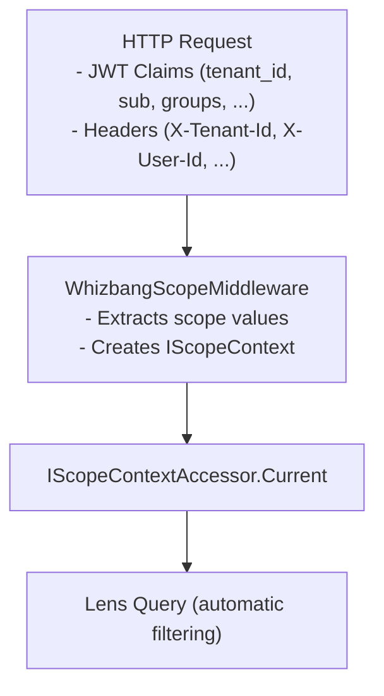

# GraphQL Scoping

Whizbang's scope middleware provides automatic multi-tenancy and security filtering for GraphQL queries, ensuring users only see data they're authorized to access.

## Overview

The `WhizbangScopeMiddleware` extracts scope information from HTTP requests (JWT claims and headers) and makes it available to lens queries for automatic filtering.



## Setup

### 1. Register Services

```csharp{title="Register Services" description="Register Services" category="API" difficulty="BEGINNER" tags=["Apis", "Graphql", "Register", "Services"]}
builder.Services.AddWhizbangScope();
```

### 2. Add Middleware

```csharp{title="Add Middleware" description="Add Middleware" category="API" difficulty="BEGINNER" tags=["Apis", "Graphql", "Add", "Middleware"]}
app.UseAuthentication();
app.UseWhizbangScope();  // After auth
app.MapGraphQL();
```

## Configuration

### Default Claim/Header Mappings

| Scope Value | Claim Type(s), tried in order | Header Name |
|-------------|-------------------------------|-------------|
| TenantId | `tenant_id` | `X-Tenant-Id` |
| UserId | Azure AD `objectidentifier` claim, `objectid`, `oid`, `sub`, `ClaimTypes.NameIdentifier` | `X-User-Id` |
| OrganizationId | `org_id` | `X-Organization-Id` |
| CustomerId | `customer_id` | `X-Customer-Id` |
| Roles | `ClaimTypes.Role` | - |
| Groups | `groups` | - |
| Permissions | `permissions` | - |
| CorrelationId | - | `X-Correlation-ID` |

### Custom Configuration

```csharp{title="Custom Configuration" description="Custom Configuration" category="API" difficulty="BEGINNER" tags=["Apis", "Graphql", "Custom", "Configuration"]}
builder.Services.AddWhizbangScope(options => {
    // Custom claim types
    options.TenantIdClaimType = "https://myapp.com/tenant_id";
    options.UserIdClaimType = "sub";
    options.GroupsClaimType = "https://myapp.com/groups";

    // Custom header names
    options.TenantIdHeaderName = "X-My-Tenant";

    // Extension mappings
    options.ExtensionClaimMappings["region"] = "Region";
    options.ExtensionClaimMappings["department"] = "Department";
});
```

## How Scoping Works

### 1. Scope Extraction

The middleware extracts scope from the request:

```csharp{title="Scope Extraction" description="The middleware extracts scope from the request:" category="API" difficulty="BEGINNER" tags=["Apis", "Graphql", "Scope", "Extraction"]}
// Conceptually (simplified): each configured claim type is tried in order,
// and JWT claims take priority over headers
var tenantId = options.TenantIdClaimTypes
        .Select(claimType => context.User?.FindFirst(claimType)?.Value)
        .FirstOrDefault(value => !string.IsNullOrEmpty(value))
    ?? context.Request.Headers["X-Tenant-Id"];
```

### 2. Context Population

The scope context is populated with:

```csharp{title="Context Population" description="The scope context is populated with:" category="API" difficulty="INTERMEDIATE" tags=["Apis", "Graphql", "Context", "Population"]}
// The middleware wraps everything it extracted in a SecurityExtraction,
// then publishes it as an immutable, propagating scope context
var extraction = new SecurityExtraction {
    Scope = new PerspectiveScope {
        TenantId = "tenant-123",
        UserId = "user-456",
        OrganizationId = "org-789"
    },
    Roles = new HashSet<string> { "Admin", "User" },
    Permissions = new HashSet<Permission> { new("orders:read") },
    SecurityPrincipals = new HashSet<SecurityPrincipalId> {
        SecurityPrincipalId.User("user-456"),
        SecurityPrincipalId.Group("sales-team")
    },
    Claims = claims,                    // all raw claims from the request
    Source = "HttpContext",
    ActualPrincipal = "user-456",
    EffectivePrincipal = "user-456",
    ContextType = SecurityContextType.User
};

scopeContextAccessor.Current = new ImmutableScopeContext(extraction, shouldPropagate: true);
```

### 3. Lens Filtering

Your lens implementation uses the scope context:

```csharp{title="Lens Filtering" description="Your lens implementation uses the scope context:" category="API" difficulty="INTERMEDIATE" tags=["Apis", "Graphql", "Lens", "Filtering"]}
public class ScopedOrderLens : IOrderLens {
    private readonly IScopeContextAccessor _scopeContextAccessor;
    private readonly DbContext _db;

    public IQueryable<PerspectiveRow<OrderReadModel>> Query {
        get {
            var context = _scopeContextAccessor.Current;
            var query = _db.Orders.AsQueryable();

            // Filter by tenant
            if (!string.IsNullOrEmpty(context?.Scope.TenantId)) {
                query = query.Where(o => o.Scope.TenantId == context.Scope.TenantId);
            }

            // Filter by allowed principals (array overlap).
            // AllowedPrincipals is a List<string> ("user:alice", "group:sales-team");
            // an empty list means the row is not principal-restricted.
            if (context?.SecurityPrincipals.Count > 0) {
                var principals = context.SecurityPrincipals
                    .Select(p => p.Value)
                    .ToList();
                query = query.Where(o =>
                    o.Scope.AllowedPrincipals.Count == 0 ||
                    o.Scope.AllowedPrincipals.Any(p => principals.Contains(p)));
            }

            return query;
        }
    }

    // ... other ILensQuery<OrderReadModel> members omitted for brevity
}
```

## Security Principal Filtering

### Row-Level Security

Each `PerspectiveRow` can have `AllowedPrincipals`:

```csharp{title="Row-Level Security" description="Each PerspectiveRow can have AllowedPrincipals:" category="API" difficulty="INTERMEDIATE" tags=["Apis", "Graphql", "Row-Level", "Security"]}
var order = new PerspectiveRow<OrderReadModel> {
    Data = orderData,
    Scope = new PerspectiveScope {
        TenantId = "tenant-123",
        AllowedPrincipals = [
            SecurityPrincipalId.User("user-456"),
            SecurityPrincipalId.Group("sales-team")
        ]
    }
};
```

### Query Filtering

The lens filters using "array overlap":

```sql{title="Query Filtering" description="The lens filters using 'array overlap':" category="API" difficulty="BEGINNER" tags=["Apis", "Graphql", "Query", "Filtering"]}
-- PostgreSQL example
WHERE scope->'AllowedPrincipals' ?| ARRAY['user:user-456', 'group:sales-team']
```

## Accessing Scope in Resolvers

### Via IScopeContextAccessor

```csharp{title="Via IScopeContextAccessor" description="Via IScopeContextAccessor" category="API" difficulty="INTERMEDIATE" tags=["Apis", "Graphql", "IScopeContextAccessor"]}
public class Query {
    public CurrentUser GetCurrentUser([Service] IScopeContextAccessor accessor) {
        var context = accessor.Current;
        return new CurrentUser {
            UserId = context?.Scope.UserId,
            TenantId = context?.Scope.TenantId,
            Roles = context?.Roles.ToList() ?? []
        };
    }
}
```

### Exposing Current Scope

```graphql{title="type Query" description="type Query" category="Apis" difficulty="BEGINNER" tags=["Apis", "Graphql", "GRAPHQL"]}
type Query {
  currentScope: ScopeInfo!
  orders(...): OrdersConnection
}

type ScopeInfo {
  tenantId: String
  userId: String
  organizationId: String
  roles: [String!]!
}
```

## Multi-Tenancy Patterns

### Tenant-Per-Row

Each row has a `TenantId` in its scope:

```csharp{title="Tenant-Per-Row" description="Each row has a TenantId in its scope:" category="API" difficulty="BEGINNER" tags=["Apis", "Graphql", "Tenant-Per-Row"]}
[GraphQLLens(QueryName = "orders")]
public interface IOrderLens : ILensQuery<OrderReadModel> { }

// Lens filters by TenantId from context
```

### Tenant-Per-Database

Different databases per tenant (configured at startup):

```csharp{title="Tenant-Per-Database" description="Different databases per tenant (configured at startup):" category="API" difficulty="BEGINNER" tags=["Apis", "Graphql", "Tenant-Per-Database"]}
builder.Services.AddScoped<IOrderLens>(sp => {
    var context = sp.GetRequiredService<IScopeContextAccessor>().Current;
    var tenantId = context?.Scope.TenantId ?? "default";
    var connectionString = GetTenantConnectionString(tenantId);
    return new EFCoreOrderLens(connectionString);
});
```

## Permission Checks

### In Resolvers

```csharp{title="In Resolvers" description="In Resolvers" category="API" difficulty="INTERMEDIATE" tags=["Apis", "Graphql", "Resolvers"]}
public class Query {
    public async Task<OrderReadModel?> GetOrder(
        Guid id,
        [Service] IOrderLens lens,
        [Service] IScopeContextAccessor accessor) {

        var context = accessor.Current;

        // Check permission
        if (!context?.HasPermission(Permission.Read("orders")) ?? true) {
            throw new UnauthorizedAccessException();
        }

        return await lens.GetByIdAsync(id);
    }
}
```

### With Attributes

`[RequirePermission]` declares the required permission; `[UseRequirePermission]` installs the HotChocolate middleware that enforces it (returning an `AUTH_NOT_AUTHORIZED` error when the permission is missing). Both attributes are needed on a resolver:

```csharp{title="With Attributes" description="With Attributes" category="API" difficulty="BEGINNER" tags=["Apis", "Graphql", "Attributes"]}
[UseRequirePermission]
[RequirePermission("orders:read", Operation = ScopeOperation.Read)]
public IQueryable<PerspectiveRow<OrderReadModel>> GetOrders(
    [Service] IOrderLens lens) {
    return lens.Query;
}
```

## Testing Scoped Queries

```csharp{title="Testing Scoped Queries" description="Testing Scoped Queries" category="API" difficulty="INTERMEDIATE" tags=["Apis", "Graphql", "Testing", "Scoped"]}
[Test]
public async Task Query_FiltersByTenantAsync() {
    // Arrange - seed the ambient scope the same way the middleware does
    var scopeAccessor = new ScopeContextAccessor();
    scopeAccessor.Current = new ImmutableScopeContext(
        new SecurityExtraction {
            Scope = new PerspectiveScope { TenantId = "tenant-a" },
            Roles = new HashSet<string>(),
            Permissions = new HashSet<Permission>(),
            SecurityPrincipals = new HashSet<SecurityPrincipalId>(),
            Claims = new Dictionary<string, string>(),
            Source = "Test"
        },
        shouldPropagate: true);

    var lens = new ScopedOrderLens(scopeAccessor, db);

    // Add test data
    db.Orders.Add(CreateOrder("tenant-a"));
    db.Orders.Add(CreateOrder("tenant-b"));
    await db.SaveChangesAsync();

    // Act
    var results = await lens.Query.ToListAsync();

    // Assert
    Assert.That(results).AllSatisfy(r =>
        Assert.That(r.Scope.TenantId).IsEqualTo("tenant-a"));
}
```

## Best Practices

1. **Always filter by scope** - Never bypass scope filtering, even for admin queries
2. **Use row-level security** - Combine tenant filtering with principal filtering
3. **Validate scope values** - Don't trust scope values for authorization decisions alone
4. **Log scope context** - Include scope in audit logs for troubleshooting
5. **Test with multiple tenants** - Ensure queries don't leak data across tenants

## Related Documentation

- [Setup](setup.md) - Initial configuration
- [Filtering](filtering.md) - Query filtering
- [Security](../../fundamentals/security/security.md) - Security principals and permissions
