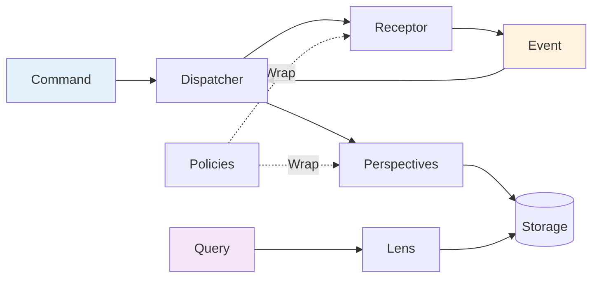

# Core Components Overview

## Component Architecture

All components in Whizbang v1.0.0 work together to provide a complete message-driven architecture. Each component has a specific responsibility and clean interface.



## Component Responsibilities

### Message Flow Components

| Component | Responsibility | Interface |
|-----------|---------------|-----------|
| **[Dispatcher](dispatcher.md)** | Routes all messages | `IDispatcher` |
| **[Receptors](receptors.md)** | Receive messages, make decisions | `IReceptor<T, R>` |
| **[Perspectives](perspectives.md)** | React to events, update state | `IPerspectiveOf<T>` |
| **[Lenses](lenses.md)** | Provide read-only queries | `ILens` |

### Infrastructure Components

| Component | Responsibility | Interface |
|-----------|---------------|-----------|
| **[Policy Engine](policy-engine.md)** | Cross-cutting concerns | `IPolicyOf<T>` |
| **[Ledger](ledger.md)** | Event storage abstraction | `ILedger` |
| **[Drivers](drivers.md)** | Database abstraction | `IDriver` |
| **[Transports](transports.md)** | Message broker abstraction | `ITransport` |

## In-Memory Implementations

In v1.0.0, all components have in-memory implementations:

```csharp
services.AddWhizbang(options => {
    options.UseInMemory();  // Configures all in-memory implementations
});
```

This configures:
- `InMemoryDispatcher` - Routes messages via dictionary
- `InMemoryLedger` - Stores events in lists
- `InMemoryDriver` - Stores data in dictionaries
- `InMemoryTransport` - Pub/sub via event handlers

## Component Interaction

### Command Processing Flow

1. **Command** submitted to **Dispatcher**
2. **Dispatcher** routes to appropriate **Receptor**
3. **Receptor** validates and makes decision
4. **Receptor** returns **Event(s)**
5. **Dispatcher** publishes events to **Perspectives**
6. **Perspectives** update their state

### Query Processing Flow

1. **Query** request made
2. **Dispatcher** provides appropriate **Lens**
3. **Lens** queries underlying storage
4. Results returned to caller

### Policy Application

Policies wrap component execution:

```csharp
[Retry(3)]
[Timeout(5000)]
public class PaymentReceptor : IReceptor<ProcessPayment> {
    // Policies applied automatically via source generation
}
```

## Component Discovery

All components are discovered at compile time:

```csharp
[WhizbangHandler]  // Source generator finds this
public class OrderReceptor : IReceptor<CreateOrder> { }

[WhizbangHandler]  // And this
public class OrderPerspective : IPerspectiveOf<OrderCreated> { }

[WhizbangLens]  // And this
public class OrderLens : IOrderLens { }
```

## Component Registration

Source generators create registration code:

```csharp
// Generated code
public static class WhizbangGenerated {
    public static void RegisterHandlers(IServiceCollection services) {
        services.AddScoped<IReceptor<CreateOrder>, OrderReceptor>();
        services.AddScoped<IPerspectiveOf<OrderCreated>, OrderPerspective>();
        services.AddScoped<IOrderLens, OrderLens>();
        // ... all discovered components
    }
}
```

## Component Testing

All components are testable via in-memory implementations:

```csharp
[Test]
public async Task TestOrderFlow() {
    var dispatcher = new InMemoryDispatcher();
    var ledger = new InMemoryLedger();
    
    // Register components
    dispatcher.Register(new OrderReceptor());
    dispatcher.Register(new OrderPerspective());
    
    // Test command flow
    var result = await dispatcher.Send(new CreateOrder(...));
    
    // Verify
    Assert.IsType<OrderCreated>(result);
}
```

## Component Guidelines

### Interface Segregation
Each component has a focused interface with single responsibility.

### Dependency Injection
All components are registered in DI container and resolved automatically.

### Testability
Every component can be tested in isolation using in-memory implementations.

### Extensibility
New components can be added by implementing the appropriate interface.

## Navigation

### Detailed Documentation
- [Dispatcher](dispatcher.md) - Message routing
- [Receptors](receptors.md) - Command handling
- [Perspectives](perspectives.md) - Event handling
- [Lenses](lenses.md) - Queries
- [Policy Engine](policy-engine.md) - Cross-cutting concerns
- [Ledger](ledger.md) - Event storage
- [Drivers](drivers.md) - Database abstraction
- [Transports](transports.md) - Messaging abstraction
